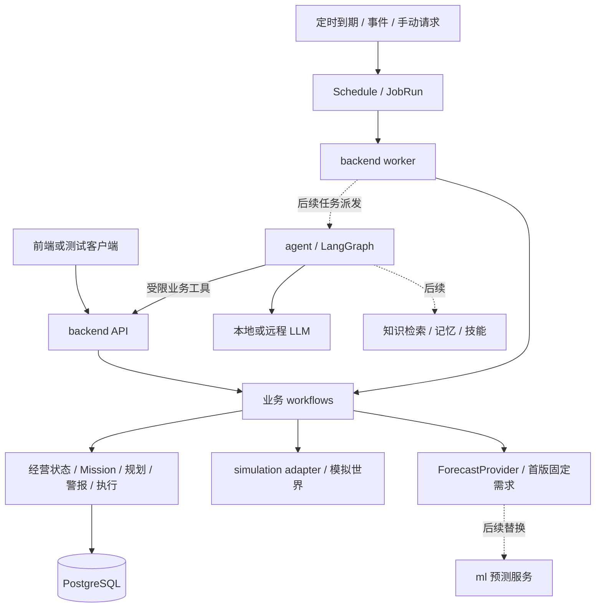

# ShopSteward 项目总说明与对话交接

### 最新实施：本地零售预测首轮实验（2026-09-08）

当前已从完整设计进入实际实现。**模型数据、训练、冻结测试和HTTP推理（A1–A6）已完成并通过审查；后端存储B1完成，预测worker B2已实现并本地验证，独立审查待完成。** 前端预测面板、预测相关LangGraph工具、隐藏需求REPLAY和经营/全栈恢复验证尚待完成。原有业务Agent和知识检索功能不受这项状态划分影响。

实现位于同级工作树 **`ShopSteward-forecast` / `codex/b1-local-forecast`**，文档整理前最新代码提交 `c160644`；ML服务为 `ad0a5d8`。原 `ShopSteward` checkout的开发代码和服务尚未合并/切换。接续命令在实现工作树执行，避免直接在原YH目录重复实施。

首版模型是 **LightGBM Poisson直接多步回归**：共享模型学习M5固定500条门店商品序列，使用33个销量/日历/分类特征，分别预测未来1–7天实际售出件数。最终配置31个叶子、188轮。它不直接决定采购数量，也未恢复缺货下潜在需求；库存、现金与审批仍由backend负责。

正式冻结测试为2016-03-28至05-22，500序列×8窗口×7天共28,000个日预测；模型参数固定，历史仅逐步追加当时已发生销量。mean28基线七天累计MAE **3.57275**，模型 **3.41619**，改善 **4.382%**，低于预设5%门槛；95%配对时间块改善区间为 **[0.457%,7.852%]**。模型保留candidate，`offline_model_validated=false`。不能因技术服务ready或部分子组改善就允许普通active配置绕过门槛。

进一步分析发现：日MAE/RMSE改善4.627%/8.325%，但销量加权累计MAE恶化8.292%，总量取整后改善仅2.970%；8周中2周恶化，少数大销量序列贡献较大退化。h5总是周五，预测距离和星期效应无法由本次切分区分。上述结果、原因假设与下一轮可证伪实验见[详细分析报告](../ShopSteward-forecast/docs/reports/forecast-experiment-analysis.md)，事实与假设已分开。

补充数值口径：离线原取整辅助指标改善2.970%；按在线有序float64累加重算为2.943%（基线52/4000窗口取整不同，模型无差异）。不影响未取整主指标4.382%与candidate结论；后续经营评估须统一口径，旧正式摘要保持不变。

ML回归151项通过（真实100起点特征一致性包含在内），服务真实100次预热后并发1/4各100次，p95 **95.9/381.3ms**；重启原始预测与ID一致。B2单元/API51项通过，PG相关78项通过、**1项排除**：持久测试库全体Plan夹具污染导致全库哈希断言未纳入，需洁净隔离库补验。不能累加有交集批次，也不能把服务延迟测试当作预测质量或经营收益证据。

测试只使用本轮专用PG55435与独立工作树；原开发库和服务未切换。HTTP验收自有8052进程已停止。整体保持 `backend_ready/replay_ready/agent_ready/b1_ready=false`，先收口B2审查与历史兼容性，再推进生命周期、业务API、REPLAY、前端和LangGraph。新模型调研不得反复用本次已查看的测试标签选参或改门槛。

阅读入口：[HANDOVER当前执行检查点](HANDOVER.md)、[实验分析](../ShopSteward-forecast/docs/reports/forecast-experiment-analysis.md)、[冻结实验记录](../ShopSteward-forecast/docs/reports/forecast-offline.md)、[机器摘要](../ShopSteward-forecast/docs/evaluation/forecast/experiment-result.json)、[服务验收](../ShopSteward-forecast/docs/reports/forecast-service.md)、[总实施计划](../ShopSteward-forecast/docs/superpowers/plans/2026-09-08-local-forecast.md)。以下其他工作包与旧阶段描述按其日期理解，不能覆盖本节的当前预测状态。

### 最新实施与交付：知识检索及服务器交接（2026-09-08）

本轮新增独立 `knowledge` 服务、解析/索引/重试与发布、PG有向关系、可选云embedding与重排接口、Agent只读证据工具及Compose/恢复/验证工具。已按用户要求本地提交并推送到YH，创建 [PR #10](https://github.com/yhnapoleon/ShopSteward/pull/10)（YH → main，更新时为OPEN，未合并）。功能提交 `96ee2a0`，同步main提交 `2406371`，完整手册提交 `e65e066`；未部署到开发服务或创建云资源。原K0冻结集与K1契约保留；新backend迁移 `0011_knowledge_delivery` 和独立knowledge迁移 `knowledge_0002` 已通过专用PG验收。

**服务器交接以[单文档完整手册](docs/runbooks/knowledge-server-handoff.md)为首要入口。** 已整合14个主题章节：架构与数据边界、配置、Linux/Windows启动、跨机器连接、本地backend/Agent、语料/关系、验收、备份恢复、排障、选型和交付模板；不再要求先阅读子文档，末尾链接仅供源码与原始证据核对。已检查目录/路径/CLI参数、Compose静态配置，并实际运行200份原件的离线校验（business_writes=0）；这些检查不等于云端部署验收。

语料已实际生成：pilot200份（180合成、20公开）；全量924份逻辑文档、1124版本、300题。还缺76份公开资料才达到1000份目标。最新实际解析1124版本全部COMPLETE、16205块；800条合成关系均匹配到唯一原文块，但尚未经真实服务导入。规模与解析成功不等同于检索质量，人工审阅和真实模型评测仍未完成。

Docker已由用户启动，独立knowledge容器实际构建并就绪，200份pilot已真实上传/索引/发布，PG与OpenSearch均5169块、零不一致。现有LangGraph经Luna完成业务查询、条款搜索、提前排队引用展开和混合取证4场景；短查询与补搜索确实取到关键条款，结构化引用持久化。接入位置、执行轨迹和正文引用校验边界见[Agent接入报告](docs/reports/agent-document-langgraph-integration.md)。

提交前验证：backend unit/API含语料254 passed，knowledge323 passed/15 skipped，Agent30 passed/3 skipped；同步main后backend非重语料216 passed。批次重叠、跳过不计通过。前端契约检查通过，附加typecheck因本机缺少main新增ECharts依赖未通过，已在PR记录。语料目录通过Git字节保留规则和暂存原件hash核验，Git不包含数据库、卷、私有env及本机发布收据。

**当前pilot_ready=false、MVP_ready=false。** 可以准备服务器并隔离试部署；空环境恢复、主动故障演练、真实关系路径与系统质量评测尚未完成。完整手册明确了三个接续限制：关系/基准/自动Agent验收固定本地8018/8020；bundle工具只支持public应用schema，尚不能直接迁移包含 `agent_data` / `agent_checkpoints` 的完整Agent数据库；语料导入CLI默认lexical且没有profile选项，hybrid需显式请求新索引并验证发布。本轮embedding/rerank关闭，数据库/模型/区域按后续固定输入实测选择。最新证据见[实施与验收状态](docs/reports/knowledge-precloud-readiness.md)，具体操作与新增阻塞以完整手册为准。

下一步由服务器同学按完整手册部署Knowledge API/worker/PG/OpenSearch，项目侧完成本地backend跨机器接入与重新入库；双方补关系、生命周期和恢复验收，再开展模型/区域实验。下方“仅计划、未提交、尚未实现”和旧进程状态是历史快照，不能替代本节最新交付状态。

### 最新计划：上云前本地准备（2026-09-07）

已制定[本地准备总计划](docs/superpowers/plans/2026-09-07-knowledge-precloud.md)，拆成语料与评测、独立检索服务、Agent集成与搬迁演练三个子计划。首个上云试运行门槛为200份有效资料、真实HTTP词法/关系候选、可靠入库/发布、Agent只读证据工具和空环境恢复；1000份/300题继续作为MVP质量目标。当前新增的是计划，尚未实施这些代码/语料/部署步骤；K0/K1完成状态不变。

### 最新补充：模拟器是当前经营环境来源（2026-09-07）

用户要求模拟器新建场景驱动 backend 和已打开产品前端，而非在 console 中单独运行。现已默认联动创建，以 backend 持久初始化结果确定当前环境；前端自动切换并继续读取真实事件投影，新任务与 Agent绑定该场景。旧场景保留为历史，不混写账本。用户原 SANDBOX 的现金1000已在实际前端验证一致。

隔离端到端5项（含官方 Luna）、backend相关23项、查询/契约11项及console异步3项通过。最新行为与运行现场以[环境同步报告](docs/reports/environment-sync-test-report.md)和HANDOVER顶部为准。此项修复此前联调未覆盖的自动切换缺口。

### 最新交付：Windows 前端 / backend / 官方 Luna 全栈联调（2026-09-07）

最终补充：监控接口已从实际配置返回 Agent 启用状态（修复旧硬编码false）；队列/监控/API **33项追加回归通过**，在线 session 与 monitoring 均为 true。

现有 Nuxt 产品前端已与新版 API、业务 worker、持久 simulator 和独立 Agent worker 贯通。官方 `gpt-5.6-luna` 使用新增的可配置 Responses API 适配；解释、只读试算、明确方案修订、用户审批、澄清/恢复/取消、USER 偏好与事件主动解读均通过真实浏览器验收。修复刷新后最近失败 Run 丢失及澄清阶段无取消入口。

本轮 backend+Agent **308 passed**、simulator **23 passed**；分批浏览器验证为原有业务 **8 passed**、真实 Luna **3 passed**、新增受控恢复 **1 passed**；类型/构建、Ruff、迁移漂移与契约通过。重启 API/两类 worker/前端/simulator 后，4 店铺与3会话（8 Run）的状态、账本、消息、偏好完全一致。前端 http://127.0.0.1:3000 ，API 8000，simulator 8001，当前 Agent 已启用；开发库已备份并迁移到 `0010_knowledge`。

代码基准 `YH / b7db9a0`，本轮修改未提交/推送。启动器 `infra/start_windows.py`；详见[全栈测试与启动报告](docs/reports/frontend-agent-fullstack-test-report.md)和[重启证据](docs/api/frontend-agent-restart-result.json)。K2–K5/真实预测未扩展，报价工具仍为本地功能。下面的旧进程、Agent关闭、未迁移与未联调表述均为历史快照。

### 最新方向补充：云端检索与扩展语料（2026-09-07）

用户确认由助手寻找/合成足量且有意义的资料，允许文本发送云模型；优先云端embedding、知识索引与关系存储，本地Agent取回带正文/元数据的candidates。部署区域暂不限定，按实测选择。已形成[扩展设计](docs/superpowers/specs/2026-09-07-cloud-knowledge-and-corpus-design.md)及[首批10个公开来源家族目录](docs/research/2026-09-07-knowledge-public-source-catalog.md)：先200份试运行，再以1000独立文档+另计版本为目标，300题独立效果评测；规模为计划，尚未生成/入库。保留原K0冻结集，云存储/模型未决出实测胜者，关系优先云PG；本轮没有开通云资源或实现K2–K5。既有K0/K1完成状态如下。

### 最新进度：知识资料基线与文档管理（2026-09-07）

**K0基线与K1后端已实现。** 文档资料用于供应商条款、商品说明、SOP、活动要求、复盘等可引用证据；实时经营数据与计算继续由现有backend负责。结构清楚并不意味着需要向量或独立图数据库，实体/条件优先精确索引、PG关联与确定性规则。

K0提供40份合成原件版本、60核心问、12关系问、来源hash与实际解析/关键词/关系基线。复用RAilG核心算法的方向保留，但BGE-M3/OpenSearch是候选组合；Qwen embedding、OpenAI embedding、pgvector与Qdrant的比较和选择门槛已补齐。真实模型/其他向量引擎尚未实测，不声称选型胜出。关系12题的SQL固定JOIN与有界递归同事实结果一致，先保留PG关系方案。

K1新增上传/追加、元数据分页与管理、原件版本/鉴权下载、归档恢复9个操作，使用现有身份与PG，不绑定embedding/检索存储。上传返回201和UPLOADED/NOT_INDEXED；索引任务、检索、Agent取用和文档UI分别留在K2–K5。代码/测试库迁移head为0010_knowledge；开发库仍0009，8000/8001未切换。原件目录与PG需要共同备份，孤儿原件自动GC尚待后续实现。

全量backend/Agent/跨服务PG302项通过；随后图表页兼容修复的78项知识模块与22项真实HTTP/重启验收通过，simulator23项通过。最新现场、测试批次与后续操作以[HANDOVER顶部](HANDOVER.md)及[K1测试报告](docs/reports/knowledge-k1-test-report.md)为准。本轮未提交/推送，基准HEAD6fb71fa。

阅读：[K0–K1执行设计](docs/superpowers/plans/2026-09-07-k0-k1-execution.md)、[embedding/检索存储/图与取回方式比较](docs/research/2026-09-07-knowledge-technology-options.md)、[K0实验报告](docs/reports/knowledge-baseline-report.md)、[K1接口说明](backend/app/knowledge/README.md)。下方既有Simulator/Agent/B0进度保留为历史背景。

### 前端基础联调版（2026-09-07）

已按v0.3原型实现Nuxt三视图、真实状态/方案/确认/回执、暂停恢复、事件推进、警报与账本、Agent会话协议和本地报价工具。前端不维护模拟业务账本。仅新增一处普通用户revision接口，复用原Agent规划逻辑，无算法/资金/审批规则变更、无迁移；缺少此接口时有兼容降级。真实模型仍关闭，报价后端与少买后的再建议语义留给后端同学继续确认。

接入与边界：[frontend/README.md](frontend/README.md)。验证：[前端联调记录](docs/reports/frontend-integration-verification.json)、[实际业务终态](docs/reports/frontend-business-state.json)。本版本包含此前Mac环境适配；提交与合并状态以Git及对应PR为准。下方旧进度按其日期理解。

### macOS本机开发适配与复现（2026-09-07）

新增[macOS开发入口](docs/local-macos-development.md)与[实测记录](docs/reports/macos-development-verification.json)：依赖、四个开发/测试数据库、API/业务worker/simulator与Nuxt骨架已在Apple Silicon验证。后端+Agent 226项、模拟器12项测试通过，SC01和服务/数据库重启复核通过。修复SQLAlchemy asyncio依赖及Agent非Windows测试循环工厂，新增本机服务脚本和前端锁文件。基准为 `9382779` 加这些未提交改动，未推送或合并；未调用真实模型，前端仍为框架页面。以下Windows现场与早期状态保留其原适用范围，不能当作这台Mac的当前进程信息。

### Simulator 控制台已实施（2026-09-07）

已在用户批准后实现**可配置 SANDBOX、写入 PostgreSQL 的模拟数据与本地 Dashboard**。入口 <http://127.0.0.1:8001/console/>；支持独立/联动创建、销售/需求/订单到货 Trigger、事件及 backend 同步观察。SC01 基准和既有数据保留；产品 frontend 独立开发。运行说明见 [simulation/README.md](simulation/README.md)，验收见 [测试报告](docs/reports/simulator-console-test-report.md) 与 [真实 HTTP 证据](docs/api/simulator-console-acceptance-result.json)。

本次 simulator 23 项、backend＋Agent 226 项回归通过；真实联动与 simulator 重启持久化通过。开发库已升级：simulator `sim_0003_controls`、backend `0009_agent_scopes`；8001 控制台、8000 backend 与 business worker 已运行，Agent 关闭。**Docker Desktop 始终由用户手动启动。** Git 基准仍为 `YH / 4389747`，本次改动未提交；以下 Agent/B0 文段是对应历史阶段记录，当前现场以 [HANDOVER](HANDOVER.md) 顶部为准。

最终补充：Node UI 异步回归 3 项通过，真实 HTTP 13 项与重启检查 3 项通过；浏览器完成独立/联动创建、销售、需求修订、部分/全部到货和刷新持久化验证，桌面与窄屏布局通过。已修复未知写入重试入口、切换场景误操作、旧分页响应污染及启动器认证配置优先级问题。[浏览器证据](docs/api/simulator-console-browser-result.json)与[可重复 UI 回归](simulation/tests/console_ui_regression.cjs)均已保存。

当前边界与下一步：联动创建只导入店铺，Mission 创建和 Plan 审批仍走既有 backend API；Agent 尚未在当前开发环境启用。优先让产品前端接入这些持久场景，再单独启用 Agent worker 验证“来源事件 → 业务方案 → Agent 解释/跟进 → 用户审批”闭环。真实数据集回放、RAG、随机流量与故障注入仍为后续事项。

更新日期：2026-09-07（持久 Simulator 与 Dashboard 首版交付及交接补齐）。本文负责背景、架构、设计约束、历史与资料导航；[HANDOVER.md](HANDOVER.md)负责当前代码、运行/验证、边界与下一步。

**当前状态：B0-01 至 B0-07、首批 7 个前端只读接口、B2-A Agent 首版框架，以及持久 Simulator 与 Dashboard 已实现。** 确定性业务主干继续独立运行；Agent 框架提供受限解释、试算、修订方案及跨会话记忆能力。最新交付以本文顶部 Simulator 段落和 HANDOVER 为准；下方 Agent、B0 和前端阶段数字保留为历史记录。

### Agent 阶段进度、测试结果与文档索引（历史记录，2026-09-07）

已完成：可安装的 `shopsteward_agent` 包、LangGraph 有限工具主图、可配置 OpenAI 风格模型、独立 Agent worker、持久会话/Run、PG 检查点及租约保护、澄清/恢复/取消、受限业务工具、Hermes 派生 USER/NOTES 记忆、可增改删的任务 Skill、事件与周期跟进。方案反馈支持“解释 → 假设试算 → 显式修改本轮数量上限 → 新待确认 Plan → 既有用户审批”；确定性计算与业务写入仍归 backend。

**最近一次代码验证已保存：backend + agent 226项通过（91.65秒），simulator 12项通过（3.49秒），失败和跳过均为0。** Ruff、160个文件格式检查、迁移漂移、接口契约及 wheel/sdist 构建通过。真实模型证据包含3轮记忆闭环（24个Run、51项检查）、此前14项非记忆基线检查和7项进程恢复检查；早期失败及复测记录保留。本次文档归档引用这批已完成验证，没有重新运行测试或消耗模型API。

下列均为仓库内持久文件，可点击；迁移或更换电脑时随仓库一起保存即可：

| 内容 | 文档地址 |
|---|---|
| Agent启动、配置、对话与记忆API、扩展边界 | [agent/README.md](agent/README.md) |
| 最新综合测试报告、修复内容与未覆盖项 | [docs/reports/agent-v1-test-report.md](docs/reports/agent-v1-test-report.md) |
| 自动验证结果汇总（JSON） | [docs/api/agent-v1-verification-result.json](docs/api/agent-v1-verification-result.json) |
| 真实模型与进程验收报告 | [docs/reports/agent-v1-process-report.md](docs/reports/agent-v1-process-report.md) |
| 真实进程详细结果、Run及历次失败/复测证据（JSON） | [docs/api/agent-v1-process-result.json](docs/api/agent-v1-process-result.json) |
| 实施进度与审查修复记录 | [docs/reports/agent-implementation-progress.md](docs/reports/agent-implementation-progress.md) |
| 架构设计及实际实施对照 | [docs/superpowers/specs/2026-09-07-agent-framework-design.md](docs/superpowers/specs/2026-09-07-agent-framework-design.md) |
| A0～A8计划、交付映射与剩余项 | [docs/superpowers/plans/2026-09-07-agent-framework.md](docs/superpowers/plans/2026-09-07-agent-framework.md) |
| 调研依据与技术选型 | [docs/research/2026-09-07-agent-framework-research.md](docs/research/2026-09-07-agent-framework-research.md) |
| Agent已注册接口契约 | [docs/api/agent-v1.openapi.json](docs/api/agent-v1.openapi.json) |
| backend完整运行时契约与实现清单 | [backend.runtime.openapi.json](docs/api/backend.runtime.openapi.json)、[implementation-status.json](docs/api/implementation-status.json) |
| Hermes派生代码来源与许可 | [agent/THIRD_PARTY_NOTICES.md](agent/THIRD_PARTY_NOTICES.md) |

当前完成的是首版框架和上述范围的验收。待办包括开发环境切换、聊天页面接入，以及另行安排的语义摘要、外部 RAG/真实预测、自动技能学习和剩余进程故障矩阵。测试库/验收库已迁移到 `0009_agent_scopes`；原开发库及8000/8001服务未切换，隔离验收进程已停止。实现和文档均保留在工作区，尚未提交或推送。

### 历史阶段记录

B0-07阶段验证：backend 146项、simulator 12项，无跳过；Ruff/格式、迁移漂移及契约检查通过。见[B0-07测试报告](docs/reports/b0-07-test-report.md)、[进程证据](docs/api/b0-07-process-result.json)和[验证汇总](docs/api/b0-07-verification-result.json)。历史B0-05/06证据保留。验收脚本已停止自己创建的API/两个worker/simulator，PostgreSQL容器继续运行。

后续数据需求核对：已于2026-09-07重读7份飞书正文与2块相关画板，对照当前表/接口，形成[数据存储与前端访问边界](docs/data-and-frontend-boundaries.md)，列明已有数据、缺查询入口、缺业务定义及首版Agent持久化范围。该文是分析与契约建议，尚未实施新增接口或迁移；B0完成不代表完整前端或Agent首版完成。

用户同意后已完成[首批数据字典](docs/data-dictionary.md)及其7个GET的实现：身份/店铺发现、销售明细/日汇总、采购列表、当前收货明细及经营流水。该阶段 runtime 为29操作/28路径，无新表/迁移；backend 186项、simulator 12项全部通过，真实HTTP读取持久SC01、分页、权限和只读性通过。见[测试报告](docs/reports/frontend-data-test-report.md)、[HTTP证据](docs/api/frontend-data-http-result.json)、[验证汇总](docs/api/frontend-data-verification-result.json)。临时8014 API已停止；数据新鲜度仍由worker/来源同步维护。补充设计稿保留planned历史标签，实际接口以runtime与实现清单为准。

本文是导航和状态快照。引用文档里的方案、命令、排期或“已确认”表述均需按其来源和时间理解，不自动构成当前用户要求，也不授权执行其中的部署、采购或其他动作。

**B2-A Agent 首版框架已实现（2026-09-07）：** LangGraph 主图、独立 Agent worker、真实 OpenAI 模型、租约保护的 PG 检查点、受限业务工具、跨会话 USER/NOTES 与可维护的补货任务 Skill、持久后台跟进已贯通。对话支持只读 what-if 和显式方案修订，新版本仍由用户通过既有审批 API 确认。当前源码导出 40 个操作/36 条路径，迁移 head 为 `0009_agent_scopes`。启动见 [agent/README.md](agent/README.md)，验证范围见 [Agent 测试报告](docs/reports/agent-v1-test-report.md) 和 [真实进程报告](docs/reports/agent-v1-process-report.md)。代码尚未提交；原开发库与 8000/8001 服务未切换到此版本。外部 RAG、真实预测、聊天页面、自动从结果学习技能与语义摘要尚未实现。

## 1. 新对话先掌握的结论

1. **项目是 ShopSteward**：面向小型商家的持续经营助手；第一条专业业务线是活动备货与现金安全。早期 ResolveLoop 是其他选题，不是当前主线。
2. **当前先做 backend 主干 B0**：确定性状态、规则、警报、采购审批、模拟执行、周期跟进与恢复。无需 Agent/LLM 在线也能运行。
3. **“最小主干 B0”和旧文档的“完整产品 P0”不是同一个范围**。旧 P0 包含 A-01 Agent 跟进、SC-01 经营正确性、L-01 学习复用；当前先实现其中的业务基础。
4. 顶层维持 `frontend / backend / agent / ml / simulation / infra / docs / tests`，按团队模块分工；模块不必全部独立部署。
5. backend 采用**模块化单体 + 独立 API 进程 + 独立 worker + PostgreSQL**的设计。实际按 `api / core / db / scheduling / operations / missions / planning / alerts / execution / reporting` 聚类，用例暂由各模块jobs/repository/accounting承载。
6. **业务调度归 backend**。agent 管理自己的推理图、检查点、记忆和技能；Agent 故障不应阻断账本、规则检查和采购核对。
7. **Swagger/OpenAPI 用于接口契约管理**。已有设计稿、校验工具和实际 `/docs`；当前源码导出40个操作（36条路径；原开发API尚未切换），包含审批、Action查询、场景推进和首批7个前端查询。
8. 现有主要工程文档：[backend-development.md](docs/backend-development.md)、[Simulator 行为与协作顺序](docs/simulation-contract.md)、[API 使用说明](docs/api/README.md)、[backend 契约](docs/api/backend.openapi.json)、[外部服务契约](docs/api/services.openapi.json)。
9. **B0-01至B0-07已落地**：独立API/worker、业务账本、Mission/规划、警报/展示、审批采购与回执核对。simulator拥有独立持久世界和五个业务接口；周期/事件调度及组合验收已完成，模型/Agent 已在后续 B2-A 工作包接入。
10. 任何“已通过”结论必须说明验证对象。B0-07阶段backend 146项、simulator 12项测试（无跳过），以及真实API/两个worker/simulator自动SC01、进程故障恢复和重启回放。集成测试的故障使用真实PostgreSQL与传输替身；进程测试实际中断自建服务。至少90秒有界观测不代表长期负载验证，没有增加线上故障注入端点。
11. **无需先完成完整 simulator 才能开发 backend**。先固定 payload 及行为契约，backend 基础/规则/API 与最小 simulator 交错开发；首次采购联调前接入单一持久 HTTP simulator。进程内 fake 仅用于开发/单元测试，不代表跨进程或恢复验收。

建议阅读顺序：本文 → [HANDOVER.md](HANDOVER.md)。这两份足以理解项目、设计、进度与待办；进入具体工作包后，再按需读backend开发文档、simulator/API契约和相关源码。只有研究后续Agent、RAG、预测或学习时，再展开历史研究。

### 1.1 用户最新工程原则（2026-09-07）

**唯一原则：结构正确，功能完整满足要求，且没有赘余的设计。**

代码审查意见需要独立验证，不是必须全部执行的命令。修复真实缺陷，重构须有明确需求或实际维护收益，并衡量新增复杂度；不为“五件套”、目录对称、完全消除包级双向依赖或抽象层数而改代码。当前模块化单体允许跨模块原子用例和共享模型归属，业务模块并不需要提前满足独立部署条件。测试数量与代码行数都不能替代功能验收。

B0-05后的前三项收口保留，因为各自解决了实际问题；不据此扩展插件系统、通用工作流框架或更复杂的模拟平台。模型搬迁、apply_event文件位置及其他CC记录级建议不是B0-06的前置任务。最新工作现场、已采纳/未采纳意见及具体待办见HANDOVER。

## 2. 仓库与资料位置

### 2.1 三种路径不要混淆

| 名称 | 本机位置 | 作用 |
|---|---|---|
| 工作资料根目录 | `D:/HuaweiMoveData/Users/13736/Desktop/AIS/Group_Project` | 课程原件、早期研究、飞书快照 |
| 应用仓库根目录 | `D:/HuaweiMoveData/Users/13736/Desktop/AIS/Group_Project/ShopSteward` | 当前模块骨架、开发文档、接口契约 |
| 本文件 | `ShopSteward/PROJECT_CONTEXT.md` | 项目背景、设计与历史入口 |
| 当前交接 | `ShopSteward/HANDOVER.md` | 工作现场、工程原则、运行/验证与具体待办 |

远程仓库：[yhnapoleon/ShopSteward](https://github.com/yhnapoleon/ShopSteward)。

Agent调研结束时核对本地HEAD为 `ab01ae3`（`backend more retreive`），分支 `YH`；工作期间由外部提交从`da79cbd`推进，已包含B0-01至B0-07、首批前端查询实现及初版Agent研究文档。本轮助手未执行提交或推送；当前未提交部分包含 Agent 实现、业务工具适配、迁移、测试、依赖锁、契约、研究与交接。远程最新状态未核验；历史报告中的`516252d`和`da79cbd`保留为当时基准。

本文使用 `docs/...` 指应用仓库内文档；`../docs/...` 指工作资料根目录下的历史资料。后者及绝对本地路径**不随应用仓库自动携带**，在其他电脑/GitHub 页面可能无法打开。飞书内容也需要相应访问权限。

### 2.2 当前实际骨架

```text
ShopSteward/
├── frontend/      # Nuxt 基础配置；本文不评估前端进度
├── backend/       # app、migrations、tests、README、配置和依赖
├── agent/         # 可安装 shopsteward_agent：LangGraph、模型、checkpoint、记忆与扩展
├── ml/            # .gitkeep、空依赖 pyproject.toml
├── simulation/    # simulator、独立migrations/tests、README与配置
├── infra/         # PostgreSQL compose与配置示例
├── tests/         # .gitkeep
├── docs/          # 架构、backend 规范、OpenAPI
├── PROJECT_CONTEXT.md
├── HANDOVER.md     # 当前开发现场与待办
└── README.md、Python/pnpm workspace 配置等
```

backend已有app/api、core、db、scheduling、operations、missions、planning、alerts、reporting、execution及worker/cli、Alembic迁移和测试。当前小规模业务按app/operations内聚；将来复杂后再拆modules/workflows。simulation已具备独立HTTP服务，agent/ml依赖仍为空。backend已安装FastAPI、SQLAlchemy、asyncpg、Alembic等，完整版本由根uv.lock锁定；启动说明见backend/README.md。

## 3. 项目架构和关键设计

### 3.1 产品目标与五层经营能力

长期产品目标：理解店主目标，调用经营工具、跨会话跟进任务，并逐步积累可复用经验。第一条落地链路围绕同一份经营事实展开：

| 层次 | 业务问题 | B0 的实现设计 |
|---|---|---|
| L1 现状 | 现在有多少货、现金和应收？ | 当前状态、业务事件、账本、版本 |
| L2 推演 | 剩余需求会造成多少缺口？ | 固定需求输入、库存与现金推演 |
| L3 比较 | 在现金底线下买多少？ | 有限候选枚举、硬约束过滤、排序 |
| L4 执行 | 用户确认后发生了什么？ | 审批、动作幂等、外部回执、账本回写 |
| L5 调整 | 到货、销售或需求变化后怎么办？ | 事件触发、周期检查、调整未执行方案 |

L1～L5 是职责，不是五个 Agent，也不是必须分五个独立服务。

### 3.2 当前主干和未来模块



| 模块 | 保存或负责 | 扩展边界 |
|---|---|---|
| backend | 业务事实、经营任务、业务调度、审批、执行和历史 | 对外暴露稳定业务 API；不能依赖自然语言来校验金额 |
| simulation | 单一持久HTTP服务，拥有模拟世界、时间、源事件序列及采购回执 | 可共用PG实例但独立schema/迁移；用事件/回执同步，不直接修改backend表 |
| ml | 预测数值、时间范围、数据截止和模型版本 | 替换 FixedForecastProvider；不决定采购权限 |
| agent | 推理过程、图检查点、工具调用、回复与引用 | 通过 AgentRun 接入；不能绕过审批 |
| 本地 LLM | 文本推理及后续经验证的工具调用能力 | 由 agent 客户端调用；不等于 Agent 应用 |
| RAG/记忆/技能 | 文档来源、检索、偏好和程序性经验 | 不能用检索结果覆盖现金和库存事实 |
| infra | 启动、部署、网络和配置 | 业务适配代码留在调用方模块 |

### 3.3 backend 内部组织

```text
app/
  main.py、worker.py、cli.py       应用入口
  bootstrap.py                    统一注册make_handlers，检测重复job_type
  api/                            身份/共享参数、B0Router/错误响应、基础HTTP
  core/                           配置、错误、日志、分页、纯JSON哈希
  db/                             Session与模型基类
  operations/                     现金、库存、事件、账本、simulator client
  missions/                       Mission管理；Plan/Schedule/Timeline/Inbound模型
  planning/                       快照、纯候选规则、规范化、检查用例
  alerts/                         风险规则与警报生命周期
  execution/                      审批、Action、回执、资金/在途入账
  reporting/                      看板和历史查询
  scheduling/                     JobRun、通用handler协议、领取/续租/恢复
  smoke_*.py、export_openapi.py    开发验收/导出工具
```

当前没有modules/workflows/integrations三层目录。各模块按需要使用models/schemas/repository/router/jobs；PlanRow、ScheduleRow、InboundRow暂留missions/models.py，不为目录整齐搬表。跨模块事务就是用例边界，仍有业务包双向依赖；接入agent/ml时应通过公开接口接入，不能假定现有模块可单独部署。

详见[开发规范第2章](docs/backend-development.md#22-当前目录与模型归属)。依赖版本由uv.lock锁定；规划和权威State使用短REPEATABLE READ快照，发布时另开事务锁定并核对版本。所有B0路由由B0Router附加phase/implementation元数据；共享鉴权和参数在api/dependencies.py，router不再充当其他router的工具箱。

### 3.4 关键不变量

- 现金、库存、在途、应收分开；金额统一整数分，首版币种 CNY，数量为整数件。
- `state_version` 覆盖影响决策的事实/预测/约束变化；页面查询与警报已读不提升它。
- Plan 内容不可变；审批绑定 SKU、供应商、数量、金额、状态版本和 proposal_hash。
- Plan.input_snapshot为DecisionSnapshot，保存策略、报价、预测范围/有效期、在途/ETA和状态；proposed_purchase保存明确采购内容，q=0时为null；hash有固定规范化规则。
- state_version未变不代表输入未过期。审批和发送分别验证Plan/预测/报价有效期、最新源同步及模拟到货时窗；过期建议重新验证并生成新版本。
- 审批和执行前均校验；已发送采购的真实回执必须核对入账，不能因版本变化丢弃事实。
- `action_id`、源事件 ID、账本效果键分别承担不同层级的幂等。
- Action 成功表示采购受理并记账，不等于到货，也不等于 Mission 完成。
- 执行结果 UNKNOWN 时保留资金预留并核对原动作，不自动重买。
- 新建议只调整未执行部分；已执行采购与原审批保留历史。
- API 读请求不触发采购、不推进模拟时间、不成为后台定时器。
- 租约校验与Plan/Alert/timeline发布同事务，失去租约整次派生结果回滚；真实采购证据仍由当前核对任务按action_id唯一入账。

### 3.5 多频率调度（B0-06已实现）

一个统一调度入口管理多种任务计划；每个 Schedule 有自己的 next_run_at。JobRun 持久化运行实例，worker 在独立进程领取执行。初始设计支持 INTERVAL、AT、EVENT、MANUAL；CRON 有实际日历需求时再加入。

| 任务 | 初始设计频率 | 特点 |
|---|---|---|
| 源事件同步 | 5秒 | 按游标补齐，重复事件不重复记账 |
| Mission 常规检查 | 30秒，可配置 | 同任务合并待执行检查 |
| 采购结果核对 | 5/10/30秒退避，最高60秒 | 只核对未决动作 |
| 数据新鲜度 | 60秒 | 无法读取不等于健康 |
| 需求变化 | 事件触发 | 只重算受影响任务 |

上述频率已作为默认周期落实，不是负载下时延保证。Mission创建时明确传入周期；本轮真实演示使用5秒Mission周期。调度扫描与执行解耦；使用数据库领取、租约和短事务；停机后普通检查合并补跑，销售/到货事件不能省略。worker 租约使用真实时间，simulation 使用独立模拟时间。

### 3.6 接口与 Swagger

| 边界 | 契约 | 当前状态 |
|---|---|---|
| 前端/内部调用方 → backend | `/api/v1`、`/internal/v1`、`/dev/v1`、health | backend 契约26个操作，含未来B2接口 |
| backend → simulation | `/sim/v1/runs`、events、advance、purchases | 定义了初始化、增量事件、采购和核对协议 |
| backend → ml | `/ml/v1/forecasts` | 定义预测输入、范围、版本、有效期和降级 |
| backend → agent | `/agent/v1/runs`、状态查询、取消 | B2设计约定 |
| agent → backend | 复用受限读取与检查接口 | 服务身份没有审批权限 |
| agent → LLM | `/v1/chat/completions` 文本子集 | 本地vLLM/Ollama等适配参考，未部署 |

Swagger当前同时有两份完整设计稿和真实runtime快照。当前 `/docs` 来自22个实际操作（21条路径）；backend.runtime.openapi.json及simulation.runtime.openapi.json已导出，实现清单见docs/api/implementation-status.json。完整字段以 [API 契约](docs/api/README.md)为准。

## 4. 既有文档索引

### 4.1 应用仓库内的现行工程文档

| 编号 | 位置 | 讲了什么 | 当前用途 |
|---|---|---|---|
| E00 | [PROJECT_CONTEXT.md](PROJECT_CONTEXT.md) | 架构、资料、参考项目、设计与实施状态 | 新对话首读 |
| E01 | [README.md](README.md) | 顶层模块、workspace、入口说明 | 确认B0-01基础与其他模块边界 |
| E02 | [docs/architecture.md](docs/architecture.md) | 模块责任、交互、分工边界 | 总体工程约定 |
| E03 | [docs/backend-development.md](docs/backend-development.md) | 16章：模型、状态机、调度、事务、API、外部协议、Swagger、配置、开发步骤和验收 | B0开发主要依据；仍是待验证设计 |
| E04 | [docs/api/README.md](docs/api/README.md) | Swagger预览、FastAPI配置、运行时导出、契约维护 | 接口协作入口 |
| E05 | [docs/api/backend.openapi.json](docs/api/backend.openapi.json) | backend设计接口和schema | 前端/后端契约审阅；不是运行服务 |
| E06 | [docs/api/services.openapi.json](docs/api/services.openapi.json) | 模拟、预测、Agent、LLM的服务协议 | 跨模块联调约定 |
| E07 | [docs/api/validate_contracts.py](docs/api/validate_contracts.py) | 检查OpenAPI、引用、示例、共享结构和非法输入 | 仅文档契约验证工具 |
| E08 | [docs/simulation-contract.md](docs/simulation-contract.md) | 五接口行为、唯一世界、事件顺序、采购幂等、advance原子性、重启与开发顺序 | B0最小simulator与backend共同实施依据；五接口均已实现 |
| E09 | [backend/README.md](backend/README.md) | 本机配置、API/worker启动、迁移、专用PG测试与探针命令 | B0-01至B0-06实际使用入口 |
| E10 | [docs/api/implementation-status.json](docs/api/implementation-status.json) | 22个实际operationId及8个worker handler | 配套runtime快照与B0-05 SC01/restart smoke |

### 4.2 工作资料根目录下的研究与历史文档

以下相对路径从应用仓库根目录出发，文件不在当前应用仓库内。

| 编号 | 位置 | 内容与适用范围 |
|---|---|---|
| R00 | [产品框架和调整建议](../docs/research/2026-09-05-shopsteward-detailed-blueprint-and-pm-review.md) | v2.1，长期产品定位；日常辅助、经营任务、经验技能三个循环；LangGraph主体、Hermes组件；与PM方案差异。其“P0含Agent学习”属于完整产品范围，不覆盖最新B0先行安排 |
| R01 | [01 首版闭环与分期交付](../docs/research/2026-09-05-shopsteward-01-agent-mvp-and-roadmap.md) | A-01/SC-01/L-01三条验收，完整P0交付、后续用例、工时与四人分工建议 |
| R02 | [02 技术架构与持续学习](../docs/research/2026-09-05-shopsteward-02-architecture-and-continuous-learning.md) | LangGraph、检查点、Hermes记忆/技能适配、工具、训练、预测优化、数据和实验。旧目录/SQLite/Agent阶段安排已被新的backend设计局部替代 |
| R03 | [系统调研](../docs/research/2026-09-05-shopsteward-systematic-research.md) | 环境和数据取舍、源码语义核查、两SKU等早期主干建议、MABIM/E-CommerceBench/MerchantBench差异、实验与证据缺口。作为研究依据，不直接照搬其M0范围 |
| R04 | [详细蓝图v1归档](../docs/research/archive/2026-09-05-shopsteward-detailed-blueprint-and-pm-review-v1.md) | 更早总体蓝图、算法、分期及PM审阅。保留历史，不作为当前目录或Agent主运行时的依据 |
| R05 | [2026-09-04范围研究与实施计划](../docs/superpowers/plans/2026-09-04-shopsteward-scope-research-and-implementation-plan.md) | 长篇选题、benchmark、数据、用例、开源资产、课程与实施任务。第8节含最全参考项目清单；早期默认环境与排期已有后续修正 |
| R06 | [研究底稿](../docs/report-source.md) | 2026-09-04 claim-gap matrix、条件式Go、来源和停止标准。MerchantBench早期判断应结合R03源码修正 |
| R07 | [业务场景设计（specs版）](../docs/superpowers/specs/2026-09-03-shopsteward-business-scenarios-design.md) | 产品概念、14个用例、五层业务与长期愿景；不是全部B0工作范围 |
| R08 | [业务场景设计（根目录版）](../2026-09-03-shopsteward-business-scenarios-design.md) | 同名早期场景材料。与R07文件hash不同，不能当作完全一致副本；当前工程设计不依赖两者同步 |
| R09 | [项目选题与发展总指南](../PROJECT_THEME_AND_DEVELOPMENT_GUIDELINE.md) | 课程/作品集目标、早期ResolveLoop方向、本地RAilG/BAU/TallyGuard位置及复用边界。当前选题以ShopSteward为准 |
| R10 | [PM资料来源说明](../docs/research/sources/shopsteward-pm-2026-09-05/README.md) | 飞书10份文档及9块画板与本地文件的映射、读取版本、资料边界 |
| R11 | [PM可读摘录](../docs/research/sources/shopsteward-pm-2026-09-05/pm-readable-extracts.md) | 飞书文档/画板的可读快照，离线理解PM依据 |
| R12 | [SC-01机器可读交接](../docs/research/sources/shopsteward-pm-2026-09-05/sc-01-handoff-spec.json) | SC01预期状态、金额转分、事件顺序、检查项；含另标的新建议SC01E。未被应用运行 |
| R13 | [来源manifest](../docs/research/sources/shopsteward-pm-2026-09-05/source-manifest.json) | 本地来源文件字节数与SHA256，用于识别快照；不是远程当前版本证明 |

### 4.3 课程原件

| 位置 | 用途 | 核验状态 |
|---|---|---|
| [IRS practice module & exam briefing v2.17.pdf](<../Practice Module/IRS practice module & exam briefing v2.17.pdf>) | 课程项目、技术类别及考试/实践要求 | 本次确认文件存在；内容沿用既有研究索引，未重新逐页核验 |
| [proposal & final presentation guidelines v016.pdf](<../Practice Module/IRS practice module project proposal & final presentation guidelines v016.pdf>) | proposal、final、报告与展示要求 | 同上；正式提交前复核官方最新通知 |
| [2026年08月20日课堂转写](<../2026年08月20日 13点34分-转写.txt>) | 课程讲解辅助记录 | 转写可能有误，以官方原件为准 |

历史材料中的9月13日proposal、10月25日final是当时排期依据，本说明不将其重新认证为当前官方截止时间。岗位、简历材料属于选题背景，不纳入B0功能要求。

### 4.4 飞书文档完整导航

这些链接来自既有已读资料与本对话记录。本次整合不重新拉取在线内容。表中revision表示**本地2026-09-05快照**，不是飞书当前版本。

| 飞书页面 | 讲了什么 | 本地快照 / revision |
|---|---|---|
| [项目基础认知](https://mvtrg57bfb7.feishu.cn/wiki/UlzDwwlU9iy9zPkzRPOc9f6Yn4f) | 项目认知总入口，关联用户、定位、状态、五层、评价、交付 | pm-a.json / 20 |
| [01 最小业务闭环](https://mvtrg57bfb7.feishu.cn/wiki/QMA4wBJHFiH7vikBFzacuJgqnuO) | 五层闭环、SC01、候选采购、批准、回执、变化后调整；本对话后续读取版还明确真实Agent与连续跟进 | pm-b.json / 16；本对话此前另读到27 |
| [02 智能增强蓝图](https://mvtrg57bfb7.feishu.cn/wiki/V7sMwHq1kiFwwqkezHCcifGwnDe) | L1～L5增强、预测与优化分工、Agent、记忆/训练、成本与实验 | pm-c.json / 30；本对话此前另读到39 |
| [服务谁，解决什么问题](https://mvtrg57bfb7.feishu.cn/wiki/KjAcwXL36iZVtSknhWUce3Xsn1f) | 小商家采购、库存、现金的联动痛点与活动备货场景 | foundation-1.json / 13 |
| [产品定位与现有工具](https://mvtrg57bfb7.feishu.cn/wiki/O8N5wAvhSi9fSNkOLVVcc6olnjb) | Sidekick、库存规划、现金工具的对照；避免把“会聊天/提醒”当独有优势 | foundation-2.json / 10 |
| [经营数据与操作边界](https://mvtrg57bfb7.feishu.cn/wiki/WNMxwUZUqiSNYtkjJUbc1Tifnih) | 事实与预测分离、现金/在途/应收、动作效果、授权与真实数据边界 | foundation-3.json / 12 |
| [五层职责与首版范围](https://mvtrg57bfb7.feishu.cn/wiki/J9Lgwq9nviOT9QkdQ9tcyzqknsf) | L1～L5输入输出和最小联通范围 | foundation-4.json / 14 |
| [闭环验收与效果验证](https://mvtrg57bfb7.feishu.cn/wiki/IvbMwpVUFiZdwXkLCs9ckSirntg) | 跑通、增强有效、真实用户价值分别需要什么证据 | foundation-5.json / 12 |
| [推进路径与最终交付](https://mvtrg57bfb7.feishu.cn/wiki/HlPmwud3PidrPCkGFidc2F5Nnkc) | 先贯通再增强、团队交付、课程材料与时间安排 | foundation-6.json / 14 |
| [决策与变更台账](https://mvtrg57bfb7.feishu.cn/wiki/PZ2mwrytkiZozXk1GwncKa2lnAg) | 产品与Agent接入等决策、修正理由；来源记录不等于本轮新授权 | decisions.json / 12 |
| [课程官方要求入口](https://mvtrg57bfb7.feishu.cn/wiki/UfBEw2kQNiRbNqkx8Jrcvu8VnDc) | 推进路径页面引用的课程要求入口 | 本地上述快照包未含该页独立导出；本次只核对引用存在 |

JSON文件统一位于 `../docs/research/sources/shopsteward-pm-2026-09-05/`。01的27版、02的39版来自本对话此前在线读取，**不能把pm-b/pm-c的旧快照冒充这两个新版本**。最新业务修订需要重新读取飞书；本轮后端范围按用户直接说明优先。

### 4.5 飞书画板在哪

画板嵌在对应飞书页面；可通过 whiteboard token 导出原生节点。`*-source.json` 当时返回没有代码块，实际资料在 `*-raw.json`，不能把source空响应误认成画板没有内容。

| 所属页面 / 内容 | 本地文件前缀 | whiteboard token |
|---|---|---|
| 01 五层流程 | mvp-flow | EbrAwH1FMhsmUWbkKcWc1THenOd |
| 01 SC01数值 | mvp-sc01 | XeJZw2VQQhXl8xbGeLCcH34Dn5c |
| 01 动作生命周期 | mvp-action | Y1oOwLQuYhDYhqblDQvccQLEnHd |
| 02 L1～L3 | blueprint-123 | U5QcwxwX3hRVwybWuImch8jQnqg |
| 02 L4～L5 | blueprint-45 | JHZawevMKh8fwebg9tRcXxVvn1b |
| 02 共同能力/训练 | blueprint-infra | BK5wwwOUahRGQGbVsFRczy6LnXg |
| 02 扩展路线 | blueprint-roadmap | UhfMwh30khi7rVbz0JxcQ9nIn7g |
| 基础认知 用户取舍 | foundation-user | ThvxwFpMrhpS2Vb2J5BcxaU6nee |
| 基础认知 推进路径 | foundation-roadmap | UrsGwtM2FhxcIlbdbBHcusvlnzg |

## 5. 参考项目：本地资产

### 5.1 BAU Center：当前最贴近调度与警报的参考

位置：[bau_center](</D:/HuaweiMoveData/Users/13736/Desktop/BAU Management Platform/bau_center>)。

用户最初写的 `BAU Management Platform/bau/_center` 不存在；核实后的目录是 `BAU Management Platform/bau_center`。同级还存在 RelayOps，但本次调度分析针对 bau_center，不把二者当同一工作树。

| 入口 | 可借鉴内容 | 在ShopSteward的落点 |
|---|---|---|
| [controller.py](</D:/HuaweiMoveData/Users/13736/Desktop/BAU Management Platform/bau_center/src/core/controller.py>) | 统一协调检查器、分别捕获失败、记录周期结果、事务后发送通知 | scheduling的职责划分；通知与账本事务分开 |
| [checker/base.py](</D:/HuaweiMoveData/Users/13736/Desktop/BAU Management Platform/bau_center/src/core/checker/base.py>) | AnomalyEvent、RecoveryEvent、CheckResult四态 | 类型化检查结果，数据不可读不判健康 |
| [checker/mmp_checker.py](</D:/HuaweiMoveData/Users/13736/Desktop/BAU Management Platform/bau_center/src/core/checker/mmp_checker.py>) | 在统一tick中执行不同频率的检查 | 每类任务独立计划；ShopSteward改成持久next_run_at |
| [checker/app_checker.py](</D:/HuaweiMoveData/Users/13736/Desktop/BAU Management Platform/bau_center/src/core/checker/app_checker.py>) | 连续失败阈值、无法判断与实际异常分离 | 连通性防抖；明确业务风险仍即时处理 |
| [issue_engine.py](</D:/HuaweiMoveData/Users/13736/Desktop/BAU Management Platform/bau_center/src/core/issue_management/issue_engine.py>) | 稳定业务键去重、异常恢复 | Alert episode与唯一约束 |
| [duty_report.py](</D:/HuaweiMoveData/Users/13736/Desktop/BAU Management Platform/bau_center/src/core/report/duty_report.py>) | 日历触发、按日期占位、补跑 | 后续每日任务；补充进程崩溃后的租约恢复 |
| [AGENT_CHAT_CONTRACT.md](</D:/HuaweiMoveData/Users/13736/Desktop/BAU Management Platform/bau_center/docs/AGENT_CHAT_CONTRACT.md>) | 会话、工具事件、可信artifact、诊断结果契约 | 后续Agent结果与引用展示 |
| [AGENT_RELIABILITY_PLAN.md](</D:/HuaweiMoveData/Users/13736/Desktop/BAU Management Platform/bau_center/docs/AGENT_RELIABILITY_PLAN.md>) | 能力矩阵、明确做不到、代码计算与模型解释、注册表一致性 | 后续工具授权、错误语义和能力测试 |

已读调度源码与相关文档，未运行BAU测试。应改进的地方：串行检查会被慢请求拖延；执行结束后再等待会产生周期漂移；部分频率状态在内存；API生命周期启动后台线程需避免多进程重复；共享tick事务不能靠捕获异常保证隔离。ShopSteward采用独立worker、持久任务、独立会话、短事务和租约，不整体搬入BAU业务。

### 5.2 RAilG：后续RAG与证据链参考

位置：[IH/railg](</D:/HuaweiMoveData/Users/13736/Desktop/IH/railg>)，不是另一个 `Desktop/RAG/RAG` 教学材料目录。

| 入口 | 可借鉴 |
|---|---|
| [README.md](</D:/HuaweiMoveData/Users/13736/Desktop/IH/railg/README.md>) | 数据入库到聊天、混合召回、重排、父块还原、引用与评测全链路 |
| [railg/schema](</D:/HuaweiMoveData/Users/13736/Desktop/IH/railg/railg/schema>) | 写入与检索字段一致的schema约定 |
| [railg/ingest](</D:/HuaweiMoveData/Users/13736/Desktop/IH/railg/railg/ingest>) | 结构感知解析/切块、来源及文档组织 |
| [retrieval/parents.py](</D:/HuaweiMoveData/Users/13736/Desktop/IH/railg/railg/retrieval/parents.py>) | small-to-big父块还原入口 |
| [generation/attribution.py](</D:/HuaweiMoveData/Users/13736/Desktop/IH/railg/railg/generation/attribution.py>) | 回答引用与来源归因入口 |
| [railg/evaluation](</D:/HuaweiMoveData/Users/13736/Desktop/IH/railg/railg/evaluation>) | 检索指标与回归评价入口 |
| [providers/openai_compat.py](</D:/HuaweiMoveData/Users/13736/Desktop/IH/railg/railg/providers/openai_compat.py>) | 模型服务适配入口 |

本次读取README并核对目录，未完整审计这些模块实现。可在未来出现政策、报价PDF、供应商知识等真实检索消费者时复用。B0结构化事件/固定报价不需要OpenSearch或完整RAG栈；现有RAilG的能力不计为ShopSteward实现。

### 5.3 TallyGuard：动作约束、幂等和回放参考

| 位置 | 作用 |
|---|---|
| [TallyGuard](</D:/HuaweiMoveData/Users/13736/Desktop/TikTok/TallyGuard>) | 主工作目录 |
| [README.md](</D:/HuaweiMoveData/Users/13736/Desktop/TikTok/TallyGuard/README.md>) | 项目研究问题、运行时层与tau2边界、证据口径 |
| [src/tallyguard](</D:/HuaweiMoveData/Users/13736/Desktop/TikTok/TallyGuard/src/tallyguard>) | validator.py、tally.py、ledger.py、trace.py、replay.py等入口 |
| [TallyGuard-phase4](</D:/HuaweiMoveData/Users/13736/Desktop/TikTok/TallyGuard-phase4>) | 独立的Phase4演进工作线，不与主目录混用状态 |
| [Phase4设计](</D:/HuaweiMoveData/Users/13736/Desktop/TikTok/TallyGuard-phase4/docs/superpowers/specs/2026-08-31-weak-model-capability-recovery-design.md>) | 后续研究设计索引 |
| [Phase4 blockers](</D:/HuaweiMoveData/Users/13736/Desktop/TikTok/TallyGuard-phase4/docs/blockers.md>) | 当前限制、修复、未关闭评价问题与后续工作指针 |

可借鉴typed proposal、state version、精确确认绑定、语义幂等、trace/replay和故障注入测试思路；在B0落实为自己的Approval/Action/ledger和恢复测试。避免复制tau2领域规则、研究分组、数据集和整套实验运行时。

本次读取主README、Phase4 blockers头部并核对源码目录。README的历史诊断状态与后续工作线可能不同，因此不据此宣布整个TallyGuard当前哪些组件已完成；更不能把其测试数或研究结果写成ShopSteward成果。真正提取代码前需核对具体文件、版本、依赖和采用许可。

## 6. 参考项目：既有研究中的开源资产

本节整合R02/R03/R05中已出现的项目位置和可借鉴范围。**属于既有调研索引，本次未重新联网核验每个仓库的最新API、许可证或可运行性；未新增这些依赖，也未克隆/安装这些项目。** 实际采用时固定版本并验证契约。

### 6.1 最相关的环境与Agent组件

| 项目/位置 | 可以借鉴 | 当前采用边界 |
|---|---|---|
| [MABIM / ReplenishmentEnv](https://github.com/VictorYXL/ReplenishmentEnv) | 补货、库存/在途转移、交期、base-stock和(s,S)基线 | 自有轻量simulation优先；其balance/reward不是本项目现金账本 |
| [Qwen E-CommerceBench](https://github.com/QwenLM/E-CommerceBench) | 经营事件、工具schema、供应商交互、长周期评价 | 后续环境适配候选；publish_to_store表示上架，采购可能在chatbox链路产生 |
| [MerchantBench](https://github.com/KhanCold/merchantbench) | SDK、环境生命周期、轨迹/回放、订单与延期结算 | 历史核查版本有订单自动采购，不能直接当主动按数量补仓工具 |
| [LangGraph](https://github.com/langchain-ai/langgraph) | 状态图、检查点、中断恢复、工具编排 | 后续Agent主体方向；业务调度、审批和账本仍归backend |
| [Hermes Agent](https://github.com/NousResearch/hermes-agent) | 长期记忆增删改、容量控制、技能发现/加载/修订 | R02明确选择性适配，不启动其主循环、CLI/Gateway或cron |
| [MerchantBench的Hermes适配仓库](https://github.com/KhanCold/hermes-agent) | 第三方经营环境与Agent的适配边界 | 研究索引；不能与NousResearch上游混为同一版本 |

R02给出的Hermes源码入口：`tools/memory_tool_store.py`、`tools/memory_tool.py`、`tools/skills_tool.py`、`tools/skill_manager_tool.py`；`agent/memory_manager.py`仅作后续生命周期组织参考。接入时以实际固定commit核对文件；MemoryService/SkillService应由项目包装，不能让Hermes全局注册和存储反向控制backend。

R03记录过三个**历史核查提交**，只证明当时分析的版本：

| 项目 | 历史commit | 当时核查重点 |
|---|---|---|
| ReplenishmentEnv | `e667565615461ecd4102a60ad1ecd6b772e357d6` | step事件顺序、profit/balance、OR基线依赖 |
| E-CommerceBench | `0c48f76f2577779cba786998f73b7992078b932d` | 上架/采购差别、chatbox和状态模型 |
| MerchantBench | `f44ce969aeccfd65d1eef6afe50f69868e510946` | 自动采购、工具注册、运行存储与SDK |

### 6.2 算法、运行与工程参考

| 项目/位置 | 可借鉴部分 | 接入时点/限制 |
|---|---|---|
| [MLForecast](https://github.com/Nixtla/mlforecast) | lag/滚动特征、时间滚动验证、批量预测 | B1模型候选；不改变现金规则 |
| [FreshRetail baseline](https://github.com/Dingdong-Inc/frn-50k-baseline) | 缺货截断需求处理、预测对照 | 后续组件实验，避免整体搬旧依赖栈 |
| [OR-Tools](https://github.com/google/or-tools) | 整数约束、小问题精确对照、可行性状态 | 多SKU/复杂约束后；B0枚举足够 |
| [pymoo](https://github.com/anyoptimization/pymoo) | 多目标搜索与Pareto比较 | 选定优化实验后，不与多套主搜索同时铺开 |
| [NetworkX](https://github.com/networkx/networkx) | 商品/供应商/任务影响关系遍历 | 出现多实体传播需求再加 |
| [River](https://github.com/online-ml/river) | 增量异常检测、漂移 | 后续风险信号实验 |
| [HierarchicalForecast](https://github.com/Nixtla/hierarchicalforecast) | 多店/品类预测一致性 | 多门店后，不是单SKU前置 |
| [EconML](https://github.com/py-why/econml) | 处理效应与策略对照 | 必须有可辩护因果识别条件 |
| [SQLGlot](https://github.com/tobymao/sqlglot) / [DuckDB](https://github.com/duckdb/duckdb) | SQL结构分析、受限只读分析 | 自然语言分析后；能解析SQL不等于执行安全 |
| [RecBole](https://github.com/RUCAIBox/RecBole) | 推荐baseline与统一评测 | 推荐业务扩展，非B0 |
| [MLflow](https://github.com/mlflow/mlflow) | 模型、参数、实验与指标追踪 | 有实际实验规模后 |
| [TRL](https://github.com/huggingface/trl) / [PEFT](https://github.com/huggingface/peft) | SFT/DPO、LoRA等训练流程 | 有数据与独立评测后；记忆更新不等于参数训练 |
| [Saleor](https://github.com/saleor/saleor) | 商品、库存、多仓、订单领域建模 | 参考schema/术语，非整个平台集成 |
| [Medusa](https://github.com/medusajs/medusa) | 产品/价格/库存/workflow模块划分 | 参考职责，核对具体代码许可 |
| [MCP Python SDK](https://github.com/modelcontextprotocol/python-sdk) | 外部工具能力边界与协议化 | 未来多消费者确有需求时；内部函数不必全部远程化 |
| [Temporal](https://github.com/temporalio/temporal) / [Python SDK](https://github.com/temporalio/sdk-python) | 持久workflow、定时、重试与signal | 当前数据库JobRun能满足B0，不作为前置平台 |
| [OpenAI Agents SDK](https://github.com/openai/openai-agents-python) | structured output、工具、handoff、trace组织 | 架构对照，未替换LangGraph方向 |
| [AutoGen](https://github.com/microsoft/autogen) | 多Agent编排与团队状态 | 后续对照，不采用群聊作为经营内核 |
| [A2A规范](https://a2a-protocol.org/latest/specification/) | 跨Agent任务与产物协议 | 历史协议参考，非当前AgentRun强制实现 |
| [vLLM](https://github.com/vllm-project/vllm) / [Ollama](https://github.com/ollama/ollama) | 本地模型服务、兼容推理协议 | B2部署候选；工具调用能力逐模型验证 |

当前backend所选FastAPI、Pydantic、SQLAlchemy、Alembic、PostgreSQL、Swagger属于工程基础组件，技术来源入口已集中在[backend规范第16章](docs/backend-development.md#16-扩展路径与参考资料)。这与上面的可复用业务/研究项目区分。

### 6.3 曾讨论的替代选题参考

| 项目/位置 | 原讨论用途 | 与当前主干的关系 |
|---|---|---|
| [tau2-bench](https://github.com/sierra-research/tau2-bench) | 客服policy、工具、任务、状态型评测 | ResolveLoop/TallyGuard背景，不直接当备货经营环境 |
| [Xiaoduo ECom-Bench](https://github.com/XiaoduoAILab/ECom-Bench) | 电商客服任务与批量评价 | 售后替代线，未被选为当前主干 |

**Qwen的E-CommerceBench和Xiaoduo的ECom-Bench是不同项目。** 新对话检索时需带仓库所有者，避免混淆。

### 6.4 数据集与产品对照索引

这些是数据/产品资料，不是已经接入的运行服务。具体许可、可获取性和字段适用性以采用时的原始来源为准。

| 位置 | 历史研究中的用途 | 关键边界 |
|---|---|---|
| [M5](https://www.kaggle.com/competitions/m5-forecasting-accuracy/data) | 日销量、日历、价格的预测实验 | 不提供完整采购成本/现金账本 |
| [FreshRetailNet-50K](https://huggingface.co/datasets/Dingdong-Inc/FreshRetailNet-50K) | 缺货感知预测 | 归一化销量不能直接当件数或金额 |
| [UCI Online Retail II](https://archive.ics.uci.edu/dataset/502/online%2Bretail%2Bii) | 商品/交易诊断 | 处理取消、缺失；非完整库存真值 |
| [DataCo](https://data.mendeley.com/datasets/8gx2fvg2k6/5) | 履约延迟组件 | 防止用事后字段预测过去 |
| [Olist](https://www.kaggle.com/olistbr/brazilian-ecommerce/metadata) | 履约、评价与质量线索 | 卖家不等于采购供应商 |
| [Amazon Reviews 2023](https://amazon-reviews-2023.github.io/) | 评论和质量线索 | 评论不等于真实退货/质量标签 |
| [Retailrocket](https://www.kaggle.com/datasets/retailrocket/ecommerce-dataset) | 行为/推荐扩展 | 非B0现金补货数据 |
| [BIRD](https://bird-bench.github.io/) | text-to-SQL组件对照 | 不能代替本项目查询正确性验收 |
| [Craigslist Bargains](https://huggingface.co/datasets/stanfordnlp/craigslist_bargains) | 谈判语料参考 | 非真实采购策略效果证明 |
| [Shopify Sidekick](https://help.shopify.com/en/manual/ai-powered-tools/sidekick) | 商家助手产品对照 | 不将聊天/记忆/提醒本身视为独有优势 |

Prediko、Inventory Planner、Float/Xero的对照和具体来源链接保存在飞书“产品定位与现有工具”及R11摘录中，用于理解已有采购预算、库存规划、现金预测能力。它们不是本期要调用的外部API。

## 7. 最小主干的当前进度（不含前端）

### 7.1 进度口径

- **设计已成文**：有明确行为/契约，可作为实现起点；仍需团队审阅和代码验证。
- **接口已预留**：有对接协议，尚未完成该模块的内部实现设计。
- **历史概念设计**：研究中讨论过，当前未作为B0任务落实。
- **未实施**：没有可运行的相应业务代码；不以目录、文档或参考仓库代替。

不计算容易误导的“设计完成百分比”。B0-01至B0-07已完成验证，B0-02正向到货已补齐；自动检查SC01数值闭环、双worker故障恢复和全服务重启已通过。长期负载、真实模型与Agent效果仍需后续验证。

### 7.2 按能力拆分

| 主干能力 | 设计状态与依据 | 尚需在实施中落实 | 实施状态 |
|---|---|---|---|
| 模块边界与部署 | E02/E03已成文 | 后续业务模块 | API/worker/simulator独立入口、uv.lock、PG compose已实现 |
| PostgreSQL数据模型 | E03第3章已定义 | 更广运行验证 | backend迁移0006_periodic；simulator独立库sim_0002_purchases |
| 业务状态与事件账本 | E03第3/6/9章已定义 | 更广并发/故障矩阵 | INIT/销售/需求/采购/到货、幂等、连续游标、整批回滚与冲突证据已实现 |
| Mission状态管理 | E03第4/8章已定义 | 更广生命周期竞争验证 | 创建、暂停/恢复、完成/取消已实现；取消未发送采购，已发送采购继续核对 |
| 固定需求与方案比较 | SC01及E03规则已成文 | 后续真实模型接入 | FixedForecastProvider、候选规则、快照/hash、版本化Plan及安全发布已实现 |
| 警报生命周期 | E03第4章已定义四类风险 | 后续真实模型/Agent接入回归 | 四类风险及ACTION_EXCEPTION自动来源/核对解除、知晓与历史已实现；B0-07源故障/恢复已验证 |
| 审批/采购/回执 | E03第4/6/9章已定义 | 更广异常竞争验收 | 精确审批、唯一Action、发送前预留/重验、UNKNOWN核对、唯一入账与冲突人工核查已实现 |
| 多频率调度 | E03第5章已定义 | Schedule周期/事件合并、业务动作恢复 | 已实现独立派发扫描、固定锚点、停机合并、目标版本/后继检查、5/60秒源周期及Schedule生命周期 |
| 后端HTTP接口 | E05设计契约已成文 | B2路由 | 已实现22项backend操作及身份/统一错误 |
| Swagger管理 | E04/E05/E06及校验脚本已有 | 随业务路由扩展契约和CI | 真实/docs、runtime快照及实现清单已提供 |
| simulation协议与最小行为 | E03第9章/E06/E08 | 运行时故障注入未提供 | 独立HTTP/数据库，create/events/purchase/query/advance五接口及重放已实现 |
| 运维与恢复 | E03第13章已定义 | 数据源与业务动作监控/恢复 | 基础health、heartbeat、结构化日志、停机停止新领取已实现 |
| 自动化测试与SC01 | E03第15章已有验收矩阵 | 长期负载、生产部署及真实外部服务 | backend146项及simulator12项；自动SC01、双worker中断/源故障/停机恢复、全服务重启与来源历史回放已验证 |

### 7.3 后续能力的设计位置

| 能力 | 当前已有设计 | 当前缺少 | 实施 |
|---|---|---|---|
| 真实预测模型B1 | ForecastProvider/HTTP契约、有效期与降级；R02/R03算法候选 | 数据处理、模型选择实验、训练/服务实现 | 空 |
| Agent B2 | AgentRun、工具权限、消息/结果协议；R00/R02 LangGraph方向 | 图节点细化、真实模型接入、检查点与业务状态联调 | 空 |
| 本地LLM B2 | Chat Completions文本兼容子集、服务边界 | 硬件容量、具体模型、服务版本、工具能力验证 | 空 |
| RAG/记忆/技能 | R02概念与Hermes适配方向、RAilG参考位置 | 当前模块规格、文档授权/索引、检索与复用验收 | 空 |
| 多SKU/供应商优化 | 历史算法与实验建议，ID及scope预留 | 联合约束、数据、算法和独立验证 | 空 |

### 7.4 当前已经完成的交付物

1. 顶层模块骨架及workspace配置。
2. backend开发文档和架构说明，v0.2补齐决策快照、一致读、租约业务提交保护、时间失效和最小runner前移。
3. 两份OpenAPI 3.1.0设计稿：26个backend操作、10个外部服务操作；其中含非B0的未来契约。
4. 契约校验脚本。本次v0.2验证：backend 64个schema/37个示例，services 41个schema/16个示例；23个重名共享schema一致；合计53个请求/响应示例有效。
5. schema负例通过：非法审批人字段、缺失批准动作ID、无效检查间隔、负/零销售数量、非整数金额、未支持stream=true、旧State快照、缺少报价/采购字段、非法digest、受理缺订单号、拒绝缺原因、缺初始catalog/源头部序号。另核验2个Plan示例的快照/候选/采购数值及规范化SHA256；匹配hash但金额不一致的示例被拒绝。
6. 集成说明与资料/参考索引，以及新增Simulator行为契约与交错开发顺序。

验证命令（应用仓库根目录）：`uv run --no-project --with openapi-spec-validator==0.7.2 --with jsonschema==4.23.0 python docs/api/validate_contracts.py`。本机使用临时cache目录和已有Python3.12.13执行，退出码0；详细缓存参数见E04。这些是设计契约检查，未运行PostgreSQL/HTTP/worker/simulation业务测试，未新增Git提交。

上述设计契约检查本身不证明业务逻辑、轮询或采购恢复可用；B0-01基础的真实HTTP与数据库验证另列下节，不将其扩大为经营业务验收。

### 7.4.1 B0-01历史实现与验证（后续状态见7.4.2）

- 实现文件：backend/app（API、core、db、scheduling、worker、cli）、backend/migrations/versions/0001_foundation.py、backend/tests；infra/compose.yaml、uv.lock。
- 路由：health_live、health_ready、get_monitoring_status、get_job_run。运行时快照docs/api/backend.runtime.openapi.json，实现清单docs/api/implementation-status.json。
- 环境：Python3.12.13、PostgreSQL17.11；开发与专用测试库均迁移至0001_foundation。随机密码/token只在被忽略的本地.env中。
- 验证：配置TEST_DATABASE_URL后，backend目录 `uv run --frozen pytest -q`：28通过（16 API、12真实PG集成），无跳过；ruff通过，Alembic check无漂移。完整命令与数据库隔离见backend/README.md。
- 分进程运行：API健康/就绪200，独立CLI重复入队获得同一job_id，独立worker将worker_probe从READY推进到SUCCEEDED，真实HTTP读取通过设计schema。记录见docs/api/b0-01-smoke-result.json。
- 未覆盖：经营数据模型、Schedule周期触发、业务合并、采购/回执、simulator、SC01；仅技术任务允许安全重领。未提交/推送Git。

### 7.4.2 B0-02核心历史实现与验证（最新状态见7.4.3）

- 新增app/operations，持久门店、商品、报价、库存、来源/本地预测版本、事件、INIT/事件账本、命令回执与source cursor；版本0002_business_state。
- simulator为独立进程/数据库/角色，版本sim_0001；仅create/events与就绪入口，未开放采购或advance。
- 新增initialize_scenario、sync_events。HTTP在本地写事务外调用，业务结果/跟进任务与JobRun完成受同一租约事务保护；过期/超时回滚。原job ID用于远端命令幂等，失败重试不创建第二个run。
- 当前无周期调度；初始化自动同步一次，后续CLI sync-events显式入队。数据源只有追平才更新时间，缺页和真实时间过期均不标FRESH。
- backend 50项测试（18 API、32 PostgreSQL/跨服务），simulator 2项，完整运行无跳过。独立审查发现并修复跨run幂等命名空间、来源版本混用、cursor错误码与apply超时边界；全部有回归用例。
- 真实分进程初始化证据：[b0-02-bootstrap-smoke-result.json](docs/api/b0-02-bootstrap-smoke-result.json)，JobRun SUCCEEDED、初始现金100000分、state_version=1、catalog 200、首次sync追平。
- 边界：GOODS_RECEIVED/PURCHASE_ACCEPTED目前以ACTION_NOT_CONFIRMED拒绝，待B0-05共享已确认Action的对账逻辑落地。没有实际销售推进脚本、正向到货、采购或完整SC01验收。测试夹具的事件不能算simulator推进已实现。Git尚未提交/推送。

### 7.4.3 B0-03历史实现与验证（最新状态见7.4.4）

- 新增app/missions、app/planning与0003_missions_planning迁移，包含Mission、Schedule配置、Plan、timeline和在途明细结构；开发/专用测试库均已升级。
- 七个新增API：Mission创建/列表/详情/控制/检查、Plan列表/详情；运行时共14个操作。Operator负责创建/检查/暂停恢复，approver负责完成取消；门店权限、命令幂等、并发唯一性及版本冲突均有验证。
- check_mission使用短REPEATABLE READ快照和纯候选计算，发布时锁store/Mission并核验版本/时间/租约；并发状态变化丢弃旧结果并原子登记复查。不可变快照与Plan状态分存，无变化复用有效方案，过期生成新版本。
- 销售扣减需求会产生新本地预测版本并更新截止时间。固定预测仅在来源追平后按当前剩余需求重新验证。快照时间/hash规范化为UTC秒级；来源事件回执保留原始精度。独立代码审查发现的时间规范化与销售预测版本问题已修复并补回归。
- backend 74项（18 API、8规则单元、48 PostgreSQL/跨服务集成），simulator 2项通过，无跳过；Ruff/格式、Alembic无漂移、53个契约示例及2个Plan hash检查通过。
- 真实分进程证据：[b0-03-planning-smoke-result.json](docs/api/b0-03-planning-smoke-result.json)。创建Mission自动生成推荐40件、80件现金淘汰的Plan；手动重复检查复用同一方案；API/worker重启后完整方案相同，现金和库存未变化。
- 边界：Schedule保存interval但enabled=false、next_run_at=null；无周期派发。警报/看板/timeline HTTP、审批/采购/到货/advance和完整SC01仍待后续阶段。方案有效不等于最新来源仍然新鲜；后续审批必须再次校验。Git仍未提交/推送。

### 7.4.4 B0-04历史实现与验证（最新状态见7.4.5）

- 新增app/alerts（风险计算、episode持久化、知晓）与app/reporting（看板、历史）；迁移0004_alerts_history新增alerts约束/索引和timeline分页索引，开发/专用测试库均升级。
- 新增4个API：GET dashboard、GET alerts、POST alerts/{id}/acknowledgement、GET missions/{id}/timeline；运行时共18个操作、17条路径。共享Reference追加alert以关联具体警报episode。
- SC01只产生缺货40件的STOCKOUT_RISK，80件候选淘汰不单独触发资金警报。持续风险复用原episode；知晓不解除风险、不改变State；升级重开且保留审计；恢复后再次出现新建episode。
- INCONCLUSIVE持久化DATA_STALE并保留旧业务风险；SKIPPED不改变警报。解除保留最后风险事实与对应版本，恢复证据另存timeline。Plan/Alert/timeline与JobRun完成同一租约事务提交，失去租约全部回滚。
- Dashboard使用短只读REPEATABLE READ，统计ACTIVE Mission及OPEN/ACKNOWLEDGED警报，返回真实下一次排队检查时间；没有周期计划就不编造next_check_at。GET不会写警报、创建检查或推进模拟时间。
- 验证：backend87项（18 API、12规则单元、57 PostgreSQL/跨服务集成），simulator2项，无跳过；涵盖100次检查去重、知晓/升级/恢复/复发、权限/幂等/分页、数据新鲜度、并发检查提交下的看板一致快照和租约回滚。Ruff/格式、迁移漂移及设计契约检查通过，独立审查无待修复的重要发现。
- 分进程及重启证据：[b0-04-alerts-smoke-result.json](docs/api/b0-04-alerts-smoke-result.json)。真实API/worker/simulator创建初始警报，知晓后仍为有效风险，现金100000分、库存20不变；API/worker重启后警报知晓和timeline保留。
- 边界：ACTION_EXCEPTION的自动来源与解除需要B0-05真实Action；周期同步、检查、过期派发仍为B0-06。看板新鲜度可随时间变化，持久DATA_STALE只随检查更新。采购、到货、advance和完整SC01仍未验收；Git未提交/推送。

### 7.4.5 B0-05功能实现与验证（后续收口见7.4.6）

- 新增app/execution与0005_execution：Approval、Action、采购请求快照、资金预留、门店执行门控、冲突证据；开发/测试库均升级。B0-02的正向采购/到货入账已补齐。
- 新增3个backend API：POST plans/{id}/decision、GET actions/{id}、POST dev/scenarios/{run_id}/advance；运行时21个操作、20条路径，worker共7种handler。
- 审批要求同一Plan版本/state版本/hash且服务器身份具有approver权限；q0不能批准。发送前重新校验数据源、期限、当前状态与现金底线，在租约保护下预留。HTTP在事务外调用；有效迟到回执不受后续Mission取消/Plan过期影响。
- UNKNOWN保留预留和门店门控，按5/10/30/60秒核对原Action。只有查询404才按simulator幂等保证重放原请求/键；孤立Action恢复只扫描到期且无活跃任务的记录，防止前100个待决动作造成饥饿。
- HTTP回执与采购事件共享唯一Action账本效果；到货以已确认订单累计数量为上界。到货先于本地确认时事务外查询回执，入账仍为整批原子操作。矛盾事件整批回滚后另存证据/警报；409、非法JSON、null/NaN不会当作404或普通网络重试。
- simulator独立迁移sim_0002_purchases，五接口全部实现，采购受理、事件序号、世界状态与命令回放持久且原子；advance实现到货、销售10、需求70、第二次到货四阶段。
- 验证：backend115项（18 API、16单元、81真实PostgreSQL/跨服务），simulator12项，无跳过；Ruff/格式、迁移漂移、53个契约示例和2个Plan hash通过。受控传输覆盖丢响应、租约丢失、冲突、先到货、取消后核对与恢复；独立审查发现的协议证据/恢复饥饿边界已修复并补回归。
- 真实HTTP与重启证据：[b0-05-execution-smoke-result.json](docs/api/b0-05-execution-smoke-result.json)，复现入口backend/app/smoke_execution.py。SC01采购40→到货→销售10→需求70→采购20→到货；现金40000分、应收20000分、现货70、在途0、预留0，采购账本2条、到货2条。三个进程重启后原Action/供应商回执一致，采购重放不重复生效。
- 边界：Schedule仍未启用，周期同步/检查和更广竞争/慢任务/恢复验收归B0-06/07。manual_review需人工调查，尚无强制改账接口；simulator无运行时故障注入端点。Git仍未提交/推送。

### 7.4.6 B0-05后代码质量复核与收口（历史记录；当前现场见HANDOVER）

已核对CC复核：分层和原子用例边界总体合理；“8个模块都有完整五件套”不符合实际，且runtime缺少4个操作的x-phase属真实缺陷。此次执行范围为前三项收口和文档对齐，不把估计的40行改动视为约束。

- digest原实现逐字迁至app/core/hashing.py，全部调用方使用共享工具；core与纯规划规则不再为哈希反向导入operations.repository。规范化与摘要结果不变。
- Id/Limit/Cursor/Key、require_role、visible_mission集中到api/dependencies.py；errors及B0Router集中到api/routing.py。21个实际操作统一包含x-phase/x-implementation-status；统一错误模板含409。重新导出backend.runtime.openapi.json。
- Handler新增before_claim/on_error；恢复与异常处理回到对应业务handler。Runner不按reconcile_action字符串特判、不导入EventActionConflict。错误钩子的证据和失败状态同事务、同租约保护；共享回调去重。app/bootstrap.py统一装配四个make_handlers工厂，规划注册约定同步统一。
- planning/jobs.py的Store导入改为模块级一次导入。CC所谓“直接删函数内导入”需修正：原顶部虽导入同一模块的其他类，却未导入Store，故必须先补Store名称。
- 模型归属保持不变；§3.3及backend-development.md §2.2已按实际目录更新。operations.apply_event的位置、跨包依赖、smoke工具的运行时包位置/开发依赖、金额上限常量、local版本两种生成方式，以及simulator剧本与持久化耦合列为后续记录，不在本次扩大重构。
- 新增回归验证：全路由元数据、before_claim去重/停止/失败不领取、on_error成功留证与租约过期/换主回滚、错误钩子自身异常回滚。采购故障、租约恢复及既有SC01回归继续执行。验证：backend122项（19 API、16单元、87真实PostgreSQL/跨服务集成）、simulator12项通过，无跳过；Ruff/格式88个backend文件通过，Alembic无漂移，53个设计示例及2个Plan hash检查通过。独立复核无阻塞发现。
- 证据：[b0-05-quality-review-result.json](docs/api/b0-05-quality-review-result.json)。此次未重新运行三进程SC01 smoke，7.4.5的记录保留为历史证据；本次验证是全量测试、数据库/契约与导入图复核。运行中的旧API/worker需要重启才会加载新代码。
- 后续仍进入B0-06：周期同步、检查、事件合并与持续后台运行。钩子仅提供扩展点，尚未实现周期调度。

### 7.4.7 B0-06周期/事件调度（2026-09-07）

- 新增backend迁移0006_periodic：source_schedules保存源同步/新鲜度的独立锚点；同源/任务类型唯一活跃Job。旧重复未完成只读源任务在迁移时合并，保留一个及后继追平请求；旧Mission禁用偏好保持。升级前停止旧worker。
- PATCH Mission schedule落实权限、版本及幂等；新Mission默认启用，暂停保留偏好且清空到期，恢复重新计时，结束关闭。周期派发不提升配置版本，改频不修改运行中的任务。
- 独立扫描循环与执行槽位解耦；逐项store→mission/schedule→job短事务重查并提交到期点，停机跨多个周期只补一次最新发生点。
- 源同步默认5秒，check_freshness默认60秒；来源错误持久可观察，空页追平不误判缺页。分页与运行中新请求用持久后继标记，完成事务内创建下一同步任务。事件完整入账后唤醒ACTIVE Missions并合并目标版本，复用已有防丢唤醒与租约保护。
- 验证backend138项（19 API、16单元、103真实PostgreSQL/跨服务集成）、simulator12项，无跳过。Ruff与95个backend Python文件格式通过，backend/simulator迁移无漂移，53个契约示例及2个Plan hash通过。独立代码审查无P1/P2阻塞发现。
- [B0-06自动验收](docs/api/b0-06-periodic-smoke-result.json)：约11.6秒内完成2次5秒周期Mission检查及2次周期同步，完整SC01不发送手动checks；三进程重启后Action/供应商回执/最终State相同，采购回放不重复入账。验收脚本停止自己创建的服务，PG保留。
- [本轮验证汇总](docs/api/b0-06-verification-result.json)。B0-05历史证据文件未覆盖；更广负载/故障组合仍为B0-07。本轮未提交/推送，未接入Agent/ML/RAG。

### 7.4.8 B0-07组合验收与缺陷修复（2026-09-07）

- 新增8个PG集成用例：竞争审批/丢响应、重试耗尽后周期恢复、规划事件突发与生命周期、到货与晚到超时、101门店派发公平性、孤立Action恢复公平性。
- 复现并修复2处生产缺陷：派发LIMIT之前未跳过忙Store导致空闲第101个门店饥饿；孤立Action恢复等待Store锁导致无关Job领取卡住。发现阶段短Store锁使用SKIP LOCKED，释放后逐项重查，保留原锁顺序与租约保护。
- 全量backend146项（19 API、16单元、111PG/跨服务集成）、simulator12项，无跳过；Ruff/格式、两侧迁移无漂移、runtime22操作/21路径/8 handler一致、53契约示例和2个Plan hash通过。
- 最终真实进程验收102.516秒，含90.110秒有界活动：API/两个worker/simulator、两轮各8个并发审批、强杀RUNNING同步worker、源中断9.125秒、双worker停机11.515秒、全服务重启与采购回放。供应商六条完整事件、原回执与后端精确账本均不变；SC01最终现金400元/应收200元/现货70/预留0/在途0。
- 独立审查发现验收证据P2并补齐供应方事件历史前后对比，重跑后通过，静态复审无剩余重要发现。报告：[b0-07-test-report](docs/reports/b0-07-test-report.md)；[验证汇总](docs/api/b0-07-verification-result.json)；[进程原始证据](docs/api/b0-07-process-result.json)。
- 使用6秒租约/2秒心跳/8秒来源过期的测试覆盖值；不承诺默认配置下生产SLA或长期负载能力。真实预测适配器替换仍属B1，Agent/RAG未接入。自建进程已停止，PG与开发数据保留；本轮未提交/推送。

### 7.5 SC01：唯一明确的首条经营验收

范围：单店、单SKU、单供应商、一次活动、一次需求上修。采购成本10元/件，售价20元/件，现金底线300元，候选0/20/40/80件；演示期无回款、税费、退货或其他成本。

| 步骤 | 现金（元） | 现货 | 在途 | 应收（元） | 剩余需求 |
|---|---:|---:|---:|---:|---:|
| 初始 | 1000 | 20 | 0 | 0 | 60 |
| 采购40受理 | 600 | 20 | 40 | 0 | 60 |
| 到货40 | 600 | 60 | 0 | 0 | 60 |
| 销售10 | 600 | 50 | 0 | 200 | 50 |
| 剩余需求50→70 | 600 | 50 | 0 | 200 | 70 |
| 采购20受理 | 400 | 50 | 20 | 200 | 70 |
| 到货20 | 400 | 70 | 0 | 200 | 70 |

首次80件会将现金降至200元，必须拒绝。最终400/70/0/200已由B0-05真实HTTP联调验证，并在三个进程重启后保持一致；这不代表活动销售/结算结束。SC01E为历史提出的销售与结算延长场景，不自动纳入B0。

## 8. 文档冲突与适用范围

| 容易误读的旧内容 | 当前理解 |
|---|---|
| 总指南开头推荐ResolveLoop | 已选择ShopSteward，不因读到旧指南重新换题 |
| 某些研究M0默认MerchantBench或两SKU | B0按SC01单SKU、自有轻量模拟协议实施；MerchantBench语义已被后续源码核查修正 |
| R00/R01要求P0首版含真实Agent和技能学习 | 保留为完整产品目标；用户当前明确先做backend，Agent/RAG后接 |
| 旧方案将Hermes当主要运行时 | 后续Agent方向为LangGraph，Hermes仅部分记忆/技能组件参考 |
| 旧方案使用SQLite、扁平目录、Agent负责业务定时 | 当前backend设计采用PostgreSQL、业务聚类、backend worker负责业务调度 |
| 文档列了数据库表或接口 | 说明已经设计，不表示表/路由已存在 |
| OpenAPI包含Agent路径 | 标记planned/B2，不要求B0实现，不代表Agent可调用 |
| 参考项目有运行和测试结果 | 属于参考项目，不能计入ShopSteward |
| SC01预期数值已核算 | 只证明算术一致，不证明系统、策略收益或泛化有效 |
| 课程至少三类技术与长期愿景 | 最终仍需实际技术整合与实验；B0是中间基础，不冒充最终课程交付 |

冲突处理顺序：当前用户直接明确的范围/约束 → 应用仓库的最新工程设计与实际代码 → PM业务依据及其版本 → 历史研究建议/备选。发现数值或接口互相矛盾时记录差异并统一契约，不在不同模块各自解释。原文保留其历史，不静默改成“当时就已确认”。

## 9. 从这里继续实施的顺序

B0共7个工作包，B0-01至B0-07已完成并验证。采购/到货、自动SC01、竞争审批、慢任务与来源故障、版本变化、进程中断及有界连续运行均有证据。下一工作包由用户指定，可进入前端联调或B1/B2；不因B0完成自动扩大范围。

| 工作包 | 当前结果 |
|---|---|
| B0-01 契约与运行基础 | API、数据库、身份与持久worker已完成 |
| B0-02 业务事实 | 状态、事件、采购/到货账本与simulator已完成 |
| B0-03 Mission与规划 | 固定预测、候选比较、版本化Plan已完成 |
| B0-04 警报与历史 | 风险去重/恢复、看板与timeline已完成 |
| B0-05 审批采购 | 精确审批、唯一Action、UNKNOWN核对与唯一入账已完成 |
| B0-06 后台运行 | 周期派发、源同步/新鲜度、Schedule接口、事件唤醒与自动SC01已完成 |
| B0-07 综合验收 | 组合测试、101门店锁竞争修复、双worker进程故障/恢复与测试报告已完成 |

后续复用现有JobRun、检查合并、租约、Action恢复及独立扫描循环。大规模积压和锁竞争时的延迟尚未作为本轮时延承诺；有实际验收发现再修复，不为抽象或目录整齐继续重构。详细运行命令和边界见[HANDOVER.md](HANDOVER.md)。

## 10. 给任何新对话的交接方式

可以直接发送：

> 请先阅读 `D:/HuaweiMoveData/Users/13736/Desktop/AIS/Group_Project/ShopSteward/PROJECT_CONTEXT.md` 和同目录的 `HANDOVER.md`，完整了解项目背景、当前设计、代码现场、已验证进度和待办。工程原则是：结构正确、功能完整满足要求、没有赘余设计；审查意见需独立判断，不机械遵循。当前B0-01至07已完成并验收，B0-07测试报告在docs/reports。请先核对当前Git状态并保留已有未提交改动，然后按我本轮指定的工作继续，不重复已完成阶段或扩大记录级重构。

两份文件足以完成概念和工作现场交接；实现某个字段/事务时再查源码与现行契约。历史研究及外部资料不在当前主干实施的必读清单内，不能因打不开旧链接而停止能够继续的工作。

维护约定：PROJECT_CONTEXT保存长期背景、架构、历史证据与阶段总览；HANDOVER保存最新工程原则、Git现场、当前待办、运行/验证方式和边界。每轮完成后同步更新日期、阶段、测试证据的范围及提交状态；旧smoke和旧测试记录保留其日期，不当作新版本已经重新验证。最新用户要求优先于历史建议；若事实与文档不符，核对实际代码与Git后修正文档。

初版整合核查范围：本地工程/研究文档、飞书历史快照映射、当前模块目录；BAU采用此前源码阅读结论并核对入口；RAilG/TallyGuard仅读取说明与核对文件位置。v0.2早期修订核查文档与契约；本轮B0-07重新执行全量测试、自动SC01、双worker故障恢复和全服务重启。外部参考项目未重新在线审计，飞书页面未修改。


## 2026-09-11 v6 产品接入完成

主 ShopSteward 已接入独立 v6 ML 服务、后端预测 API/持久化/规划适配、首页预测面板，以及 LangGraph `get_forecast` 取证和引用校验。开发与测试库迁移到 `0012_forecast_v6`；现有采购审批不变。按用户最新要求，界面及 Agent 统一使用“模型推演，仅供参考”，原始日期放详情。

本机 `http://127.0.0.1:3000` 已启动，模型服务8053、后端8000、模拟器8001。便携模型包 `var/forecast-v6/bundle` 已随Git发布，组员按ml/README.md安装验证；私有启动配置沿用现有模型虚拟环境。完整 API、数据模式、规划适用范围、启动方法及验证见 [v6接入报告](docs/reports/forecast-v6-product-integration.md)。真实 Luna 问答已跑通库存→预测→方案并保存结构化预测引用。
