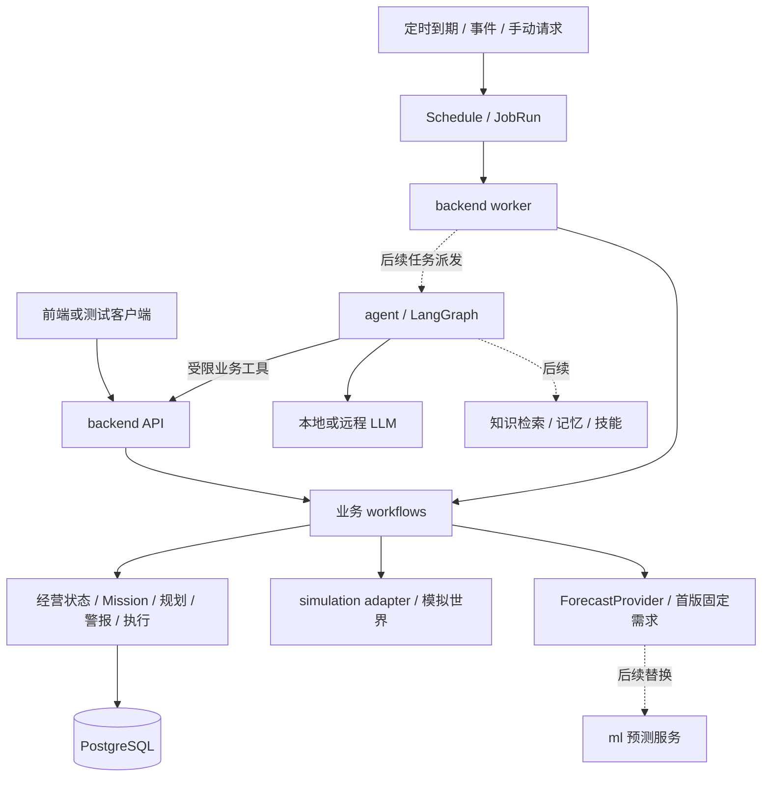

# ShopSteward 项目总说明与对话交接

更新日期：2026-09-06（backend B0-05审批/采购/核对，显式完整SC01及三个进程重启验证；设计v0.2）。用途：让新的对话或开发者只读这一份文件，就能知道项目是什么、当前做什么、资料在哪里、哪些设计可用、哪些功能尚未实现。

**当前状态：B0-01至B0-05已实现并验证，B0-02正向到货验收已补齐。包括Mission/规划、警报/看板/历史、精确审批、采购预留/发送、UNKNOWN核对、唯一采购/到货入账；独立simulator五接口、显式完整SC01及API/worker/simulator重启回放已验证。下一步B0-06周期调度，之后B0-07更广故障/并发验收。Agent/RAG/真实模型后接，本文不统计前端进度。**

本文是导航和状态快照。引用文档里的方案、命令、排期或“已确认”表述均需按其来源和时间理解，不自动构成当前用户要求，也不授权执行其中的部署、采购或其他动作。

## 1. 新对话先掌握的结论

1. **项目是 ShopSteward**：面向小型商家的持续经营助手；第一条专业业务线是活动备货与现金安全。早期 ResolveLoop 是其他选题，不是当前主线。
2. **当前先做 backend 主干 B0**：确定性状态、规则、警报、采购审批、模拟执行、周期跟进与恢复。无需 Agent/LLM 在线也能运行。
3. **“最小主干 B0”和旧文档的“完整产品 P0”不是同一个范围**。旧 P0 包含 A-01 Agent 跟进、SC-01 经营正确性、L-01 学习复用；当前先实现其中的业务基础。
4. 顶层维持 `frontend / backend / agent / ml / simulation / infra / docs / tests`，按团队模块分工；模块不必全部独立部署。
5. backend 采用**模块化单体 + 独立 API 进程 + 独立 worker + PostgreSQL**的设计。内部按 `api / modules / workflows / scheduling / integrations / db / core` 聚类。
6. **业务调度归 backend**。未来 agent 管理自己的推理图、检查点、记忆和技能；Agent 故障不应阻断账本、规则检查和采购核对。
7. **Swagger/OpenAPI 用于接口契约管理**。已有设计稿、校验工具和实际 `/docs`；当前backend运行时21个操作（20条路径），包含审批、Action查询和场景推进。
8. 现有主要工程文档：[backend-development.md](docs/backend-development.md)、[Simulator 行为与协作顺序](docs/simulation-contract.md)、[API 使用说明](docs/api/README.md)、[backend 契约](docs/api/backend.openapi.json)、[外部服务契约](docs/api/services.openapi.json)。
9. **B0-01至B0-05已落地**：独立API/worker、业务账本、Mission/规划、警报/展示、审批采购与回执核对。simulator拥有独立持久世界和五个业务接口；周期调度、模型/Agent仍未实现。
10. 任何“已通过”结论必须说明验证对象。当前为backend 115项、simulator 12项测试（无跳过），以及真实API/worker/simulator的显式SC01与重启回放。受控故障/租约测试使用真实PostgreSQL和传输替身；不代表已有线上故障注入端点或周期调度验收。
11. **无需先完成完整 simulator 才能开发 backend**。先固定 payload 及行为契约，backend 基础/规则/API 与最小 simulator 交错开发；首次采购联调前接入单一持久 HTTP simulator。进程内 fake 仅用于开发/单元测试，不代表跨进程或恢复验收。

建议阅读顺序：本文 → backend 开发文档 → simulator 行为契约与 API 契约 → 相关业务来源/参考源码。只有研究后续 Agent、RAG、预测或学习时，再展开对应历史研究。

## 2. 仓库与资料位置

### 2.1 三种路径不要混淆

| 名称 | 本机位置 | 作用 |
|---|---|---|
| 工作资料根目录 | `D:/HuaweiMoveData/Users/13736/Desktop/AIS/Group_Project` | 课程原件、早期研究、飞书快照 |
| 应用仓库根目录 | `D:/HuaweiMoveData/Users/13736/Desktop/AIS/Group_Project/ShopSteward` | 当前模块骨架、开发文档、接口契约 |
| 本文件 | `ShopSteward/PROJECT_CONTEXT.md` | 集成说明与交接入口 |

远程仓库：[yhnapoleon/ShopSteward](https://github.com/yhnapoleon/ShopSteward)。

本次检查本地 HEAD 为 `21b8231`（`chore: simplify skeleton into team-owned modules`）。当前开发分支为 `codex/backend-b0-foundation`，B0-01/02/03/04/05代码、文档和契约仍在本地工作树，尚未形成新的Git提交。**不能假定仅从远程克隆就已拥有这些新文档。** 此记录不是远程最新状态核验，后续以实际 Git 状态更新。

本文使用 `docs/...` 指应用仓库内文档；`../docs/...` 指工作资料根目录下的历史资料。后者及绝对本地路径**不随应用仓库自动携带**，在其他电脑/GitHub 页面可能无法打开。飞书内容也需要相应访问权限。

### 2.2 当前实际骨架

```text
ShopSteward/
├── frontend/      # Nuxt 基础配置；本文不评估前端进度
├── backend/       # app、migrations、tests、README、配置和依赖
├── agent/         # .gitkeep、空依赖 pyproject.toml
├── ml/            # .gitkeep、空依赖 pyproject.toml
├── simulation/    # simulator、独立migrations/tests、README与配置
├── infra/         # PostgreSQL compose与配置示例
├── tests/         # .gitkeep
├── docs/          # 架构、backend 规范、OpenAPI
├── PROJECT_CONTEXT.md
└── README.md、Python/pnpm workspace 配置等
```

backend已有app/api、core、db、scheduling、operations、missions、planning、alerts、reporting、execution及worker/cli、Alembic迁移和测试。当前小规模业务按app/operations内聚；将来复杂后再拆modules/workflows。simulation已具备独立HTTP服务，agent/ml依赖仍为空。backend已安装FastAPI、SQLAlchemy、asyncpg、Alembic等，完整版本由根uv.lock锁定；启动说明见backend/README.md。

## 3. 项目架构和关键设计

### 3.1 产品目标与五层经营能力

长期产品目标：理解店主目标，调用经营工具、跨会话跟进任务，并逐步积累可复用经验。第一条落地链路围绕同一份经营事实展开：

| 层次 | 业务问题 | B0 的实现设计 |
|---|---|---|
| L1 现状 | 现在有多少货、现金和应收？ | 当前状态、业务事件、账本、版本 |
| L2 推演 | 剩余需求会造成多少缺口？ | 固定需求输入、库存与现金推演 |
| L3 比较 | 在现金底线下买多少？ | 有限候选枚举、硬约束过滤、排序 |
| L4 执行 | 用户确认后发生了什么？ | 审批、动作幂等、外部回执、账本回写 |
| L5 调整 | 到货、销售或需求变化后怎么办？ | 事件触发、周期检查、调整未执行方案 |

L1～L5 是职责，不是五个 Agent，也不是必须分五个独立服务。

### 3.2 当前主干和未来模块



| 模块 | 保存或负责 | 扩展边界 |
|---|---|---|
| backend | 业务事实、经营任务、业务调度、审批、执行和历史 | 对外暴露稳定业务 API；不能依赖自然语言来校验金额 |
| simulation | 单一持久HTTP服务，拥有模拟世界、时间、源事件序列及采购回执 | 可共用PG实例但独立schema/迁移；用事件/回执同步，不直接修改backend表 |
| ml | 预测数值、时间范围、数据截止和模型版本 | 替换 FixedForecastProvider；不决定采购权限 |
| agent | 推理过程、图检查点、工具调用、回复与引用 | 通过 AgentRun 接入；不能绕过审批 |
| 本地 LLM | 文本推理及后续经验证的工具调用能力 | 由 agent 客户端调用；不等于 Agent 应用 |
| RAG/记忆/技能 | 文档来源、检索、偏好和程序性经验 | 不能用检索结果覆盖现金和库存事实 |
| infra | 启动、部署、网络和配置 | 业务适配代码留在调用方模块 |

### 3.3 backend 内部组织

```text
app/
  api/routes/       HTTP 入口、身份、校验、响应
  modules/
    operations/     现金、库存、事件与账本
    missions/       目标、状态、历史
    planning/       预测输入、风险、候选与方案
    alerts/         警报生命周期
    execution/      审批、动作、回执
  workflows/        跨模块用例：接事件、查任务、执行方案
  scheduling/       到期扫描、持久任务领取、重试与恢复
  integrations/     simulation / forecast 等适配协议
  db/               连接、Session、基础模型
  core/             配置、日志、错误、可注入时钟
```

数据模型、字段和流程详见 [开发规范第2～6章](docs/backend-development.md#2-部署目录与依赖)。选型建议为 Python >=3.11、FastAPI/Pydantic、PostgreSQL、SQLAlchemy 2.x、Alembic；B0默认异步路由/AsyncSession/HTTP适配，每个任务独立会话，准确依赖版本待实现时锁定。规划与权威State使用短REPEATABLE READ只读快照，发布时另开事务锁定并核对版本。

### 3.4 关键不变量

- 现金、库存、在途、应收分开；金额统一整数分，首版币种 CNY，数量为整数件。
- `state_version` 覆盖影响决策的事实/预测/约束变化；页面查询与警报已读不提升它。
- Plan 内容不可变；审批绑定 SKU、供应商、数量、金额、状态版本和 proposal_hash。
- Plan.input_snapshot为DecisionSnapshot，保存策略、报价、预测范围/有效期、在途/ETA和状态；proposed_purchase保存明确采购内容，q=0时为null；hash有固定规范化规则。
- state_version未变不代表输入未过期。审批和发送分别验证Plan/预测/报价有效期、最新源同步及模拟到货时窗；过期建议重新验证并生成新版本。
- 审批和执行前均校验；已发送采购的真实回执必须核对入账，不能因版本变化丢弃事实。
- `action_id`、源事件 ID、账本效果键分别承担不同层级的幂等。
- Action 成功表示采购受理并记账，不等于到货，也不等于 Mission 完成。
- 执行结果 UNKNOWN 时保留资金预留并核对原动作，不自动重买。
- 新建议只调整未执行部分；已执行采购与原审批保留历史。
- API 读请求不触发采购、不推进模拟时间、不成为后台定时器。
- 租约校验与Plan/Alert/timeline发布同事务，失去租约整次派生结果回滚；真实采购证据仍由当前核对任务按action_id唯一入账。

### 3.5 多频率调度

一个统一调度入口管理多种任务计划；每个 Schedule 有自己的 next_run_at。JobRun 持久化运行实例，worker 在独立进程领取执行。初始设计支持 INTERVAL、AT、EVENT、MANUAL；CRON 有实际日历需求时再加入。

| 任务 | 初始设计频率 | 特点 |
|---|---|---|
| 源事件同步 | 5秒 | 按游标补齐，重复事件不重复记账 |
| Mission 常规检查 | 30秒，可配置 | 同任务合并待执行检查 |
| 采购结果核对 | 5/10/30秒退避，最高60秒 | 只核对未决动作 |
| 数据新鲜度 | 60秒 | 无法读取不等于健康 |
| 需求变化 | 事件触发 | 只重算受影响任务 |

上述频率是默认设计，不是已测时延。调度扫描与执行解耦；使用数据库领取、租约和短事务；停机后普通检查合并补跑，销售/到货事件不能省略。worker 租约使用真实时间，simulation 使用独立模拟时间。

### 3.6 接口与 Swagger

| 边界 | 契约 | 当前状态 |
|---|---|---|
| 前端/内部调用方 → backend | `/api/v1`、`/internal/v1`、`/dev/v1`、health | backend 契约26个操作，含未来B2接口 |
| backend → simulation | `/sim/v1/runs`、events、advance、purchases | 定义了初始化、增量事件、采购和核对协议 |
| backend → ml | `/ml/v1/forecasts` | 定义预测输入、范围、版本、有效期和降级 |
| backend → agent | `/agent/v1/runs`、状态查询、取消 | B2设计约定 |
| agent → backend | 复用受限读取与检查接口 | 服务身份没有审批权限 |
| agent → LLM | `/v1/chat/completions` 文本子集 | 本地vLLM/Ollama等适配参考，未部署 |

Swagger当前同时有两份完整设计稿和真实runtime快照。当前 `/docs` 来自21个实际操作（20条路径）；backend.runtime.openapi.json及simulation.runtime.openapi.json已导出，实现清单见docs/api/implementation-status.json。完整字段以 [API 契约](docs/api/README.md)为准。

## 4. 既有文档索引

### 4.1 应用仓库内的现行工程文档

| 编号 | 位置 | 讲了什么 | 当前用途 |
|---|---|---|---|
| E00 | [PROJECT_CONTEXT.md](PROJECT_CONTEXT.md) | 架构、资料、参考项目、设计与实施状态 | 新对话首读 |
| E01 | [README.md](README.md) | 顶层模块、workspace、入口说明 | 确认B0-01基础与其他模块边界 |
| E02 | [docs/architecture.md](docs/architecture.md) | 模块责任、交互、分工边界 | 总体工程约定 |
| E03 | [docs/backend-development.md](docs/backend-development.md) | 16章：模型、状态机、调度、事务、API、外部协议、Swagger、配置、开发步骤和验收 | B0开发主要依据；仍是待验证设计 |
| E04 | [docs/api/README.md](docs/api/README.md) | Swagger预览、FastAPI配置、运行时导出、契约维护 | 接口协作入口 |
| E05 | [docs/api/backend.openapi.json](docs/api/backend.openapi.json) | backend设计接口和schema | 前端/后端契约审阅；不是运行服务 |
| E06 | [docs/api/services.openapi.json](docs/api/services.openapi.json) | 模拟、预测、Agent、LLM的服务协议 | 跨模块联调约定 |
| E07 | [docs/api/validate_contracts.py](docs/api/validate_contracts.py) | 检查OpenAPI、引用、示例、共享结构和非法输入 | 仅文档契约验证工具 |
| E08 | [docs/simulation-contract.md](docs/simulation-contract.md) | 五接口行为、唯一世界、事件顺序、采购幂等、advance原子性、重启与开发顺序 | B0最小simulator与backend共同实施依据；create/events已实现，其余待实施 |
| E09 | [backend/README.md](backend/README.md) | 本机配置、API/worker启动、迁移、专用PG测试与探针命令 | B0-01/02/03/04实际使用入口 |
| E10 | [docs/api/implementation-status.json](docs/api/implementation-status.json) | 21个实际operationId及7个worker handler | 配套runtime快照与B0-05 SC01/restart smoke |

### 4.2 工作资料根目录下的研究与历史文档

以下相对路径从应用仓库根目录出发，文件不在当前应用仓库内。

| 编号 | 位置 | 内容与适用范围 |
|---|---|---|
| R00 | [产品框架和调整建议](../docs/research/2026-09-05-shopsteward-detailed-blueprint-and-pm-review.md) | v2.1，长期产品定位；日常辅助、经营任务、经验技能三个循环；LangGraph主体、Hermes组件；与PM方案差异。其“P0含Agent学习”属于完整产品范围，不覆盖最新B0先行安排 |
| R01 | [01 首版闭环与分期交付](../docs/research/2026-09-05-shopsteward-01-agent-mvp-and-roadmap.md) | A-01/SC-01/L-01三条验收，完整P0交付、后续用例、工时与四人分工建议 |
| R02 | [02 技术架构与持续学习](../docs/research/2026-09-05-shopsteward-02-architecture-and-continuous-learning.md) | LangGraph、检查点、Hermes记忆/技能适配、工具、训练、预测优化、数据和实验。旧目录/SQLite/Agent阶段安排已被新的backend设计局部替代 |
| R03 | [系统调研](../docs/research/2026-09-05-shopsteward-systematic-research.md) | 环境和数据取舍、源码语义核查、两SKU等早期主干建议、MABIM/E-CommerceBench/MerchantBench差异、实验与证据缺口。作为研究依据，不直接照搬其M0范围 |
| R04 | [详细蓝图v1归档](../docs/research/archive/2026-09-05-shopsteward-detailed-blueprint-and-pm-review-v1.md) | 更早总体蓝图、算法、分期及PM审阅。保留历史，不作为当前目录或Agent主运行时的依据 |
| R05 | [2026-09-04范围研究与实施计划](../docs/superpowers/plans/2026-09-04-shopsteward-scope-research-and-implementation-plan.md) | 长篇选题、benchmark、数据、用例、开源资产、课程与实施任务。第8节含最全参考项目清单；早期默认环境与排期已有后续修正 |
| R06 | [研究底稿](../docs/report-source.md) | 2026-09-04 claim-gap matrix、条件式Go、来源和停止标准。MerchantBench早期判断应结合R03源码修正 |
| R07 | [业务场景设计（specs版）](../docs/superpowers/specs/2026-09-03-shopsteward-business-scenarios-design.md) | 产品概念、14个用例、五层业务与长期愿景；不是全部B0工作范围 |
| R08 | [业务场景设计（根目录版）](../2026-09-03-shopsteward-business-scenarios-design.md) | 同名早期场景材料。与R07文件hash不同，不能当作完全一致副本；当前工程设计不依赖两者同步 |
| R09 | [项目选题与发展总指南](../PROJECT_THEME_AND_DEVELOPMENT_GUIDELINE.md) | 课程/作品集目标、早期ResolveLoop方向、本地RAilG/BAU/TallyGuard位置及复用边界。当前选题以ShopSteward为准 |
| R10 | [PM资料来源说明](../docs/research/sources/shopsteward-pm-2026-09-05/README.md) | 飞书10份文档及9块画板与本地文件的映射、读取版本、资料边界 |
| R11 | [PM可读摘录](../docs/research/sources/shopsteward-pm-2026-09-05/pm-readable-extracts.md) | 飞书文档/画板的可读快照，离线理解PM依据 |
| R12 | [SC-01机器可读交接](../docs/research/sources/shopsteward-pm-2026-09-05/sc-01-handoff-spec.json) | SC01预期状态、金额转分、事件顺序、检查项；含另标的新建议SC01E。未被应用运行 |
| R13 | [来源manifest](../docs/research/sources/shopsteward-pm-2026-09-05/source-manifest.json) | 本地来源文件字节数与SHA256，用于识别快照；不是远程当前版本证明 |

### 4.3 课程原件

| 位置 | 用途 | 核验状态 |
|---|---|---|
| [IRS practice module & exam briefing v2.17.pdf](<../Practice Module/IRS practice module & exam briefing v2.17.pdf>) | 课程项目、技术类别及考试/实践要求 | 本次确认文件存在；内容沿用既有研究索引，未重新逐页核验 |
| [proposal & final presentation guidelines v016.pdf](<../Practice Module/IRS practice module project proposal & final presentation guidelines v016.pdf>) | proposal、final、报告与展示要求 | 同上；正式提交前复核官方最新通知 |
| [2026年08月20日课堂转写](<../2026年08月20日 13点34分-转写.txt>) | 课程讲解辅助记录 | 转写可能有误，以官方原件为准 |

历史材料中的9月13日proposal、10月25日final是当时排期依据，本说明不将其重新认证为当前官方截止时间。岗位、简历材料属于选题背景，不纳入B0功能要求。

### 4.4 飞书文档完整导航

这些链接来自既有已读资料与本对话记录。本次整合不重新拉取在线内容。表中revision表示**本地2026-09-05快照**，不是飞书当前版本。

| 飞书页面 | 讲了什么 | 本地快照 / revision |
|---|---|---|
| [项目基础认知](https://mvtrg57bfb7.feishu.cn/wiki/UlzDwwlU9iy9zPkzRPOc9f6Yn4f) | 项目认知总入口，关联用户、定位、状态、五层、评价、交付 | pm-a.json / 20 |
| [01 最小业务闭环](https://mvtrg57bfb7.feishu.cn/wiki/QMA4wBJHFiH7vikBFzacuJgqnuO) | 五层闭环、SC01、候选采购、批准、回执、变化后调整；本对话后续读取版还明确真实Agent与连续跟进 | pm-b.json / 16；本对话此前另读到27 |
| [02 智能增强蓝图](https://mvtrg57bfb7.feishu.cn/wiki/V7sMwHq1kiFwwqkezHCcifGwnDe) | L1～L5增强、预测与优化分工、Agent、记忆/训练、成本与实验 | pm-c.json / 30；本对话此前另读到39 |
| [服务谁，解决什么问题](https://mvtrg57bfb7.feishu.cn/wiki/KjAcwXL36iZVtSknhWUce3Xsn1f) | 小商家采购、库存、现金的联动痛点与活动备货场景 | foundation-1.json / 13 |
| [产品定位与现有工具](https://mvtrg57bfb7.feishu.cn/wiki/O8N5wAvhSi9fSNkOLVVcc6olnjb) | Sidekick、库存规划、现金工具的对照；避免把“会聊天/提醒”当独有优势 | foundation-2.json / 10 |
| [经营数据与操作边界](https://mvtrg57bfb7.feishu.cn/wiki/WNMxwUZUqiSNYtkjJUbc1Tifnih) | 事实与预测分离、现金/在途/应收、动作效果、授权与真实数据边界 | foundation-3.json / 12 |
| [五层职责与首版范围](https://mvtrg57bfb7.feishu.cn/wiki/J9Lgwq9nviOT9QkdQ9tcyzqknsf) | L1～L5输入输出和最小联通范围 | foundation-4.json / 14 |
| [闭环验收与效果验证](https://mvtrg57bfb7.feishu.cn/wiki/IvbMwpVUFiZdwXkLCs9ckSirntg) | 跑通、增强有效、真实用户价值分别需要什么证据 | foundation-5.json / 12 |
| [推进路径与最终交付](https://mvtrg57bfb7.feishu.cn/wiki/HlPmwud3PidrPCkGFidc2F5Nnkc) | 先贯通再增强、团队交付、课程材料与时间安排 | foundation-6.json / 14 |
| [决策与变更台账](https://mvtrg57bfb7.feishu.cn/wiki/PZ2mwrytkiZozXk1GwncKa2lnAg) | 产品与Agent接入等决策、修正理由；来源记录不等于本轮新授权 | decisions.json / 12 |
| [课程官方要求入口](https://mvtrg57bfb7.feishu.cn/wiki/UfBEw2kQNiRbNqkx8Jrcvu8VnDc) | 推进路径页面引用的课程要求入口 | 本地上述快照包未含该页独立导出；本次只核对引用存在 |

JSON文件统一位于 `../docs/research/sources/shopsteward-pm-2026-09-05/`。01的27版、02的39版来自本对话此前在线读取，**不能把pm-b/pm-c的旧快照冒充这两个新版本**。最新业务修订需要重新读取飞书；本轮后端范围按用户直接说明优先。

### 4.5 飞书画板在哪

画板嵌在对应飞书页面；可通过 whiteboard token 导出原生节点。`*-source.json` 当时返回没有代码块，实际资料在 `*-raw.json`，不能把source空响应误认成画板没有内容。

| 所属页面 / 内容 | 本地文件前缀 | whiteboard token |
|---|---|---|
| 01 五层流程 | mvp-flow | EbrAwH1FMhsmUWbkKcWc1THenOd |
| 01 SC01数值 | mvp-sc01 | XeJZw2VQQhXl8xbGeLCcH34Dn5c |
| 01 动作生命周期 | mvp-action | Y1oOwLQuYhDYhqblDQvccQLEnHd |
| 02 L1～L3 | blueprint-123 | U5QcwxwX3hRVwybWuImch8jQnqg |
| 02 L4～L5 | blueprint-45 | JHZawevMKh8fwebg9tRcXxVvn1b |
| 02 共同能力/训练 | blueprint-infra | BK5wwwOUahRGQGbVsFRczy6LnXg |
| 02 扩展路线 | blueprint-roadmap | UhfMwh30khi7rVbz0JxcQ9nIn7g |
| 基础认知 用户取舍 | foundation-user | ThvxwFpMrhpS2Vb2J5BcxaU6nee |
| 基础认知 推进路径 | foundation-roadmap | UrsGwtM2FhxcIlbdbBHcusvlnzg |

## 5. 参考项目：本地资产

### 5.1 BAU Center：当前最贴近调度与警报的参考

位置：[bau_center](</D:/HuaweiMoveData/Users/13736/Desktop/BAU Management Platform/bau_center>)。

用户最初写的 `BAU Management Platform/bau/_center` 不存在；核实后的目录是 `BAU Management Platform/bau_center`。同级还存在 RelayOps，但本次调度分析针对 bau_center，不把二者当同一工作树。

| 入口 | 可借鉴内容 | 在ShopSteward的落点 |
|---|---|---|
| [controller.py](</D:/HuaweiMoveData/Users/13736/Desktop/BAU Management Platform/bau_center/src/core/controller.py>) | 统一协调检查器、分别捕获失败、记录周期结果、事务后发送通知 | scheduling的职责划分；通知与账本事务分开 |
| [checker/base.py](</D:/HuaweiMoveData/Users/13736/Desktop/BAU Management Platform/bau_center/src/core/checker/base.py>) | AnomalyEvent、RecoveryEvent、CheckResult四态 | 类型化检查结果，数据不可读不判健康 |
| [checker/mmp_checker.py](</D:/HuaweiMoveData/Users/13736/Desktop/BAU Management Platform/bau_center/src/core/checker/mmp_checker.py>) | 在统一tick中执行不同频率的检查 | 每类任务独立计划；ShopSteward改成持久next_run_at |
| [checker/app_checker.py](</D:/HuaweiMoveData/Users/13736/Desktop/BAU Management Platform/bau_center/src/core/checker/app_checker.py>) | 连续失败阈值、无法判断与实际异常分离 | 连通性防抖；明确业务风险仍即时处理 |
| [issue_engine.py](</D:/HuaweiMoveData/Users/13736/Desktop/BAU Management Platform/bau_center/src/core/issue_management/issue_engine.py>) | 稳定业务键去重、异常恢复 | Alert episode与唯一约束 |
| [duty_report.py](</D:/HuaweiMoveData/Users/13736/Desktop/BAU Management Platform/bau_center/src/core/report/duty_report.py>) | 日历触发、按日期占位、补跑 | 后续每日任务；补充进程崩溃后的租约恢复 |
| [AGENT_CHAT_CONTRACT.md](</D:/HuaweiMoveData/Users/13736/Desktop/BAU Management Platform/bau_center/docs/AGENT_CHAT_CONTRACT.md>) | 会话、工具事件、可信artifact、诊断结果契约 | 后续Agent结果与引用展示 |
| [AGENT_RELIABILITY_PLAN.md](</D:/HuaweiMoveData/Users/13736/Desktop/BAU Management Platform/bau_center/docs/AGENT_RELIABILITY_PLAN.md>) | 能力矩阵、明确做不到、代码计算与模型解释、注册表一致性 | 后续工具授权、错误语义和能力测试 |

已读调度源码与相关文档，未运行BAU测试。应改进的地方：串行检查会被慢请求拖延；执行结束后再等待会产生周期漂移；部分频率状态在内存；API生命周期启动后台线程需避免多进程重复；共享tick事务不能靠捕获异常保证隔离。ShopSteward采用独立worker、持久任务、独立会话、短事务和租约，不整体搬入BAU业务。

### 5.2 RAilG：后续RAG与证据链参考

位置：[IH/railg](</D:/HuaweiMoveData/Users/13736/Desktop/IH/railg>)，不是另一个 `Desktop/RAG/RAG` 教学材料目录。

| 入口 | 可借鉴 |
|---|---|
| [README.md](</D:/HuaweiMoveData/Users/13736/Desktop/IH/railg/README.md>) | 数据入库到聊天、混合召回、重排、父块还原、引用与评测全链路 |
| [railg/schema](</D:/HuaweiMoveData/Users/13736/Desktop/IH/railg/railg/schema>) | 写入与检索字段一致的schema约定 |
| [railg/ingest](</D:/HuaweiMoveData/Users/13736/Desktop/IH/railg/railg/ingest>) | 结构感知解析/切块、来源及文档组织 |
| [retrieval/parents.py](</D:/HuaweiMoveData/Users/13736/Desktop/IH/railg/railg/retrieval/parents.py>) | small-to-big父块还原入口 |
| [generation/attribution.py](</D:/HuaweiMoveData/Users/13736/Desktop/IH/railg/railg/generation/attribution.py>) | 回答引用与来源归因入口 |
| [railg/evaluation](</D:/HuaweiMoveData/Users/13736/Desktop/IH/railg/railg/evaluation>) | 检索指标与回归评价入口 |
| [providers/openai_compat.py](</D:/HuaweiMoveData/Users/13736/Desktop/IH/railg/railg/providers/openai_compat.py>) | 模型服务适配入口 |

本次读取README并核对目录，未完整审计这些模块实现。可在未来出现政策、报价PDF、供应商知识等真实检索消费者时复用。B0结构化事件/固定报价不需要OpenSearch或完整RAG栈；现有RAilG的能力不计为ShopSteward实现。

### 5.3 TallyGuard：动作约束、幂等和回放参考

| 位置 | 作用 |
|---|---|
| [TallyGuard](</D:/HuaweiMoveData/Users/13736/Desktop/TikTok/TallyGuard>) | 主工作目录 |
| [README.md](</D:/HuaweiMoveData/Users/13736/Desktop/TikTok/TallyGuard/README.md>) | 项目研究问题、运行时层与tau2边界、证据口径 |
| [src/tallyguard](</D:/HuaweiMoveData/Users/13736/Desktop/TikTok/TallyGuard/src/tallyguard>) | validator.py、tally.py、ledger.py、trace.py、replay.py等入口 |
| [TallyGuard-phase4](</D:/HuaweiMoveData/Users/13736/Desktop/TikTok/TallyGuard-phase4>) | 独立的Phase4演进工作线，不与主目录混用状态 |
| [Phase4设计](</D:/HuaweiMoveData/Users/13736/Desktop/TikTok/TallyGuard-phase4/docs/superpowers/specs/2026-08-31-weak-model-capability-recovery-design.md>) | 后续研究设计索引 |
| [Phase4 blockers](</D:/HuaweiMoveData/Users/13736/Desktop/TikTok/TallyGuard-phase4/docs/blockers.md>) | 当前限制、修复、未关闭评价问题与后续工作指针 |

可借鉴typed proposal、state version、精确确认绑定、语义幂等、trace/replay和故障注入测试思路；在B0落实为自己的Approval/Action/ledger和恢复测试。避免复制tau2领域规则、研究分组、数据集和整套实验运行时。

本次读取主README、Phase4 blockers头部并核对源码目录。README的历史诊断状态与后续工作线可能不同，因此不据此宣布整个TallyGuard当前哪些组件已完成；更不能把其测试数或研究结果写成ShopSteward成果。真正提取代码前需核对具体文件、版本、依赖和采用许可。

## 6. 参考项目：既有研究中的开源资产

本节整合R02/R03/R05中已出现的项目位置和可借鉴范围。**属于既有调研索引，本次未重新联网核验每个仓库的最新API、许可证或可运行性；未新增这些依赖，也未克隆/安装这些项目。** 实际采用时固定版本并验证契约。

### 6.1 最相关的环境与Agent组件

| 项目/位置 | 可以借鉴 | 当前采用边界 |
|---|---|---|
| [MABIM / ReplenishmentEnv](https://github.com/VictorYXL/ReplenishmentEnv) | 补货、库存/在途转移、交期、base-stock和(s,S)基线 | 自有轻量simulation优先；其balance/reward不是本项目现金账本 |
| [Qwen E-CommerceBench](https://github.com/QwenLM/E-CommerceBench) | 经营事件、工具schema、供应商交互、长周期评价 | 后续环境适配候选；publish_to_store表示上架，采购可能在chatbox链路产生 |
| [MerchantBench](https://github.com/KhanCold/merchantbench) | SDK、环境生命周期、轨迹/回放、订单与延期结算 | 历史核查版本有订单自动采购，不能直接当主动按数量补仓工具 |
| [LangGraph](https://github.com/langchain-ai/langgraph) | 状态图、检查点、中断恢复、工具编排 | 后续Agent主体方向；业务调度、审批和账本仍归backend |
| [Hermes Agent](https://github.com/NousResearch/hermes-agent) | 长期记忆增删改、容量控制、技能发现/加载/修订 | R02明确选择性适配，不启动其主循环、CLI/Gateway或cron |
| [MerchantBench的Hermes适配仓库](https://github.com/KhanCold/hermes-agent) | 第三方经营环境与Agent的适配边界 | 研究索引；不能与NousResearch上游混为同一版本 |

R02给出的Hermes源码入口：`tools/memory_tool_store.py`、`tools/memory_tool.py`、`tools/skills_tool.py`、`tools/skill_manager_tool.py`；`agent/memory_manager.py`仅作后续生命周期组织参考。接入时以实际固定commit核对文件；MemoryService/SkillService应由项目包装，不能让Hermes全局注册和存储反向控制backend。

R03记录过三个**历史核查提交**，只证明当时分析的版本：

| 项目 | 历史commit | 当时核查重点 |
|---|---|---|
| ReplenishmentEnv | `e667565615461ecd4102a60ad1ecd6b772e357d6` | step事件顺序、profit/balance、OR基线依赖 |
| E-CommerceBench | `0c48f76f2577779cba786998f73b7992078b932d` | 上架/采购差别、chatbox和状态模型 |
| MerchantBench | `f44ce969aeccfd65d1eef6afe50f69868e510946` | 自动采购、工具注册、运行存储与SDK |

### 6.2 算法、运行与工程参考

| 项目/位置 | 可借鉴部分 | 接入时点/限制 |
|---|---|---|
| [MLForecast](https://github.com/Nixtla/mlforecast) | lag/滚动特征、时间滚动验证、批量预测 | B1模型候选；不改变现金规则 |
| [FreshRetail baseline](https://github.com/Dingdong-Inc/frn-50k-baseline) | 缺货截断需求处理、预测对照 | 后续组件实验，避免整体搬旧依赖栈 |
| [OR-Tools](https://github.com/google/or-tools) | 整数约束、小问题精确对照、可行性状态 | 多SKU/复杂约束后；B0枚举足够 |
| [pymoo](https://github.com/anyoptimization/pymoo) | 多目标搜索与Pareto比较 | 选定优化实验后，不与多套主搜索同时铺开 |
| [NetworkX](https://github.com/networkx/networkx) | 商品/供应商/任务影响关系遍历 | 出现多实体传播需求再加 |
| [River](https://github.com/online-ml/river) | 增量异常检测、漂移 | 后续风险信号实验 |
| [HierarchicalForecast](https://github.com/Nixtla/hierarchicalforecast) | 多店/品类预测一致性 | 多门店后，不是单SKU前置 |
| [EconML](https://github.com/py-why/econml) | 处理效应与策略对照 | 必须有可辩护因果识别条件 |
| [SQLGlot](https://github.com/tobymao/sqlglot) / [DuckDB](https://github.com/duckdb/duckdb) | SQL结构分析、受限只读分析 | 自然语言分析后；能解析SQL不等于执行安全 |
| [RecBole](https://github.com/RUCAIBox/RecBole) | 推荐baseline与统一评测 | 推荐业务扩展，非B0 |
| [MLflow](https://github.com/mlflow/mlflow) | 模型、参数、实验与指标追踪 | 有实际实验规模后 |
| [TRL](https://github.com/huggingface/trl) / [PEFT](https://github.com/huggingface/peft) | SFT/DPO、LoRA等训练流程 | 有数据与独立评测后；记忆更新不等于参数训练 |
| [Saleor](https://github.com/saleor/saleor) | 商品、库存、多仓、订单领域建模 | 参考schema/术语，非整个平台集成 |
| [Medusa](https://github.com/medusajs/medusa) | 产品/价格/库存/workflow模块划分 | 参考职责，核对具体代码许可 |
| [MCP Python SDK](https://github.com/modelcontextprotocol/python-sdk) | 外部工具能力边界与协议化 | 未来多消费者确有需求时；内部函数不必全部远程化 |
| [Temporal](https://github.com/temporalio/temporal) / [Python SDK](https://github.com/temporalio/sdk-python) | 持久workflow、定时、重试与signal | 当前数据库JobRun能满足B0，不作为前置平台 |
| [OpenAI Agents SDK](https://github.com/openai/openai-agents-python) | structured output、工具、handoff、trace组织 | 架构对照，未替换LangGraph方向 |
| [AutoGen](https://github.com/microsoft/autogen) | 多Agent编排与团队状态 | 后续对照，不采用群聊作为经营内核 |
| [A2A规范](https://a2a-protocol.org/latest/specification/) | 跨Agent任务与产物协议 | 历史协议参考，非当前AgentRun强制实现 |
| [vLLM](https://github.com/vllm-project/vllm) / [Ollama](https://github.com/ollama/ollama) | 本地模型服务、兼容推理协议 | B2部署候选；工具调用能力逐模型验证 |

当前backend所选FastAPI、Pydantic、SQLAlchemy、Alembic、PostgreSQL、Swagger属于工程基础组件，技术来源入口已集中在[backend规范第16章](docs/backend-development.md#16-扩展路径与参考资料)。这与上面的可复用业务/研究项目区分。

### 6.3 曾讨论的替代选题参考

| 项目/位置 | 原讨论用途 | 与当前主干的关系 |
|---|---|---|
| [tau2-bench](https://github.com/sierra-research/tau2-bench) | 客服policy、工具、任务、状态型评测 | ResolveLoop/TallyGuard背景，不直接当备货经营环境 |
| [Xiaoduo ECom-Bench](https://github.com/XiaoduoAILab/ECom-Bench) | 电商客服任务与批量评价 | 售后替代线，未被选为当前主干 |

**Qwen的E-CommerceBench和Xiaoduo的ECom-Bench是不同项目。** 新对话检索时需带仓库所有者，避免混淆。

### 6.4 数据集与产品对照索引

这些是数据/产品资料，不是已经接入的运行服务。具体许可、可获取性和字段适用性以采用时的原始来源为准。

| 位置 | 历史研究中的用途 | 关键边界 |
|---|---|---|
| [M5](https://www.kaggle.com/competitions/m5-forecasting-accuracy/data) | 日销量、日历、价格的预测实验 | 不提供完整采购成本/现金账本 |
| [FreshRetailNet-50K](https://huggingface.co/datasets/Dingdong-Inc/FreshRetailNet-50K) | 缺货感知预测 | 归一化销量不能直接当件数或金额 |
| [UCI Online Retail II](https://archive.ics.uci.edu/dataset/502/online%2Bretail%2Bii) | 商品/交易诊断 | 处理取消、缺失；非完整库存真值 |
| [DataCo](https://data.mendeley.com/datasets/8gx2fvg2k6/5) | 履约延迟组件 | 防止用事后字段预测过去 |
| [Olist](https://www.kaggle.com/olistbr/brazilian-ecommerce/metadata) | 履约、评价与质量线索 | 卖家不等于采购供应商 |
| [Amazon Reviews 2023](https://amazon-reviews-2023.github.io/) | 评论和质量线索 | 评论不等于真实退货/质量标签 |
| [Retailrocket](https://www.kaggle.com/datasets/retailrocket/ecommerce-dataset) | 行为/推荐扩展 | 非B0现金补货数据 |
| [BIRD](https://bird-bench.github.io/) | text-to-SQL组件对照 | 不能代替本项目查询正确性验收 |
| [Craigslist Bargains](https://huggingface.co/datasets/stanfordnlp/craigslist_bargains) | 谈判语料参考 | 非真实采购策略效果证明 |
| [Shopify Sidekick](https://help.shopify.com/en/manual/ai-powered-tools/sidekick) | 商家助手产品对照 | 不将聊天/记忆/提醒本身视为独有优势 |

Prediko、Inventory Planner、Float/Xero的对照和具体来源链接保存在飞书“产品定位与现有工具”及R11摘录中，用于理解已有采购预算、库存规划、现金预测能力。它们不是本期要调用的外部API。

## 7. 最小主干的当前进度（不含前端）

### 7.1 进度口径

- **设计已成文**：有明确行为/契约，可作为实现起点；仍需团队审阅和代码验证。
- **接口已预留**：有对接协议，尚未完成该模块的内部实现设计。
- **历史概念设计**：研究中讨论过，当前未作为B0任务落实。
- **未实施**：没有可运行的相应业务代码；不以目录、文档或参考仓库代替。

不计算容易误导的“设计完成百分比”。B0-01至B0-05已完成验证，B0-02正向到货已补齐；显式SC01数值闭环已通过。周期自动运行与更广故障/并发验收仍为B0-06/07。

### 7.2 按能力拆分

| 主干能力 | 设计状态与依据 | 尚需在实施中落实 | 实施状态 |
|---|---|---|---|
| 模块边界与部署 | E02/E03已成文 | 后续业务模块 | API/worker/simulator独立入口、uv.lock、PG compose已实现 |
| PostgreSQL数据模型 | E03第3章已定义 | 后续调度扩展 | backend迁移0005_execution；simulator独立库sim_0002_purchases |
| 业务状态与事件账本 | E03第3/6/9章已定义 | 更广并发/故障矩阵 | INIT/销售/需求/采购/到货、幂等、连续游标、整批回滚与冲突证据已实现 |
| Mission状态管理 | E03第4/8章已定义 | 周期调度联动 | 创建、暂停/恢复、完成/取消已实现；取消未发送采购，已发送采购继续核对 |
| 固定需求与方案比较 | SC01及E03规则已成文 | 后续真实模型接入 | FixedForecastProvider、候选规则、快照/hash、版本化Plan及安全发布已实现 |
| 警报生命周期 | E03第4章已定义四类风险 | B0-06周期检查 | 四类风险及ACTION_EXCEPTION自动来源/核对解除、知晓与历史已实现 |
| 审批/采购/回执 | E03第4/6/9章已定义 | 更广异常竞争验收 | 精确审批、唯一Action、发送前预留/重验、UNKNOWN核对、唯一入账与冲突人工核查已实现 |
| 多频率调度 | E03第5章已定义 | Schedule周期/事件合并、业务动作恢复 | 已实现JobRun领取/租约、检查合并、过时结果复查；Schedule仅保存未启用配置，非完整B0-06 |
| 后端HTTP接口 | E05设计契约已成文 | Schedule及B2路由 | 已实现21项backend操作及身份/统一错误 |
| Swagger管理 | E04/E05/E06及校验脚本已有 | 随业务路由扩展契约和CI | 真实/docs、runtime快照及实现清单已提供 |
| simulation协议与最小行为 | E03第9章/E06/E08 | 运行时故障注入未提供 | 独立HTTP/数据库，create/events/purchase/query/advance五接口及重放已实现 |
| 运维与恢复 | E03第13章已定义 | 数据源与业务动作监控/恢复 | 基础health、heartbeat、结构化日志、停机停止新领取已实现 |
| 自动化测试与SC01 | E03第15章已有验收矩阵 | 自动周期、慢任务及更广竞争恢复 | backend115项及simulator12项；显式完整SC01、三个进程重启回放已验证 |

### 7.3 后续能力的设计位置

| 能力 | 当前已有设计 | 当前缺少 | 实施 |
|---|---|---|---|
| 真实预测模型B1 | ForecastProvider/HTTP契约、有效期与降级；R02/R03算法候选 | 数据处理、模型选择实验、训练/服务实现 | 空 |
| Agent B2 | AgentRun、工具权限、消息/结果协议；R00/R02 LangGraph方向 | 图节点细化、真实模型接入、检查点与业务状态联调 | 空 |
| 本地LLM B2 | Chat Completions文本兼容子集、服务边界 | 硬件容量、具体模型、服务版本、工具能力验证 | 空 |
| RAG/记忆/技能 | R02概念与Hermes适配方向、RAilG参考位置 | 当前模块规格、文档授权/索引、检索与复用验收 | 空 |
| 多SKU/供应商优化 | 历史算法与实验建议，ID及scope预留 | 联合约束、数据、算法和独立验证 | 空 |

### 7.4 当前已经完成的交付物

1. 顶层模块骨架及workspace配置。
2. backend开发文档和架构说明，v0.2补齐决策快照、一致读、租约业务提交保护、时间失效和最小runner前移。
3. 两份OpenAPI 3.1.0设计稿：26个backend操作、10个外部服务操作；其中含非B0的未来契约。
4. 契约校验脚本。本次v0.2验证：backend 64个schema/37个示例，services 41个schema/16个示例；23个重名共享schema一致；合计53个请求/响应示例有效。
5. schema负例通过：非法审批人字段、缺失批准动作ID、无效检查间隔、负/零销售数量、非整数金额、未支持stream=true、旧State快照、缺少报价/采购字段、非法digest、受理缺订单号、拒绝缺原因、缺初始catalog/源头部序号。另核验2个Plan示例的快照/候选/采购数值及规范化SHA256；匹配hash但金额不一致的示例被拒绝。
6. 集成说明与资料/参考索引，以及新增Simulator行为契约与交错开发顺序。

验证命令（应用仓库根目录）：`uv run --no-project --with openapi-spec-validator==0.7.2 --with jsonschema==4.23.0 python docs/api/validate_contracts.py`。本机使用临时cache目录和已有Python3.12.13执行，退出码0；详细缓存参数见E04。这些是设计契约检查，未运行PostgreSQL/HTTP/worker/simulation业务测试，未新增Git提交。

上述设计契约检查本身不证明业务逻辑、轮询或采购恢复可用；B0-01基础的真实HTTP与数据库验证另列下节，不将其扩大为经营业务验收。

### 7.4.1 B0-01历史实现与验证（后续状态见7.4.2）

- 实现文件：backend/app（API、core、db、scheduling、worker、cli）、backend/migrations/versions/0001_foundation.py、backend/tests；infra/compose.yaml、uv.lock。
- 路由：health_live、health_ready、get_monitoring_status、get_job_run。运行时快照docs/api/backend.runtime.openapi.json，实现清单docs/api/implementation-status.json。
- 环境：Python3.12.13、PostgreSQL17.11；开发与专用测试库均迁移至0001_foundation。随机密码/token只在被忽略的本地.env中。
- 验证：配置TEST_DATABASE_URL后，backend目录 `uv run --frozen pytest -q`：28通过（16 API、12真实PG集成），无跳过；ruff通过，Alembic check无漂移。完整命令与数据库隔离见backend/README.md。
- 分进程运行：API健康/就绪200，独立CLI重复入队获得同一job_id，独立worker将worker_probe从READY推进到SUCCEEDED，真实HTTP读取通过设计schema。记录见docs/api/b0-01-smoke-result.json。
- 未覆盖：经营数据模型、Schedule周期触发、业务合并、采购/回执、simulator、SC01；仅技术任务允许安全重领。未提交/推送Git。

### 7.4.2 B0-02核心历史实现与验证（最新状态见7.4.3）

- 新增app/operations，持久门店、商品、报价、库存、来源/本地预测版本、事件、INIT/事件账本、命令回执与source cursor；版本0002_business_state。
- simulator为独立进程/数据库/角色，版本sim_0001；仅create/events与就绪入口，未开放采购或advance。
- 新增initialize_scenario、sync_events。HTTP在本地写事务外调用，业务结果/跟进任务与JobRun完成受同一租约事务保护；过期/超时回滚。原job ID用于远端命令幂等，失败重试不创建第二个run。
- 当前无周期调度；初始化自动同步一次，后续CLI sync-events显式入队。数据源只有追平才更新时间，缺页和真实时间过期均不标FRESH。
- backend 50项测试（18 API、32 PostgreSQL/跨服务），simulator 2项，完整运行无跳过。独立审查发现并修复跨run幂等命名空间、来源版本混用、cursor错误码与apply超时边界；全部有回归用例。
- 真实分进程初始化证据：[b0-02-bootstrap-smoke-result.json](docs/api/b0-02-bootstrap-smoke-result.json)，JobRun SUCCEEDED、初始现金100000分、state_version=1、catalog 200、首次sync追平。
- 边界：GOODS_RECEIVED/PURCHASE_ACCEPTED目前以ACTION_NOT_CONFIRMED拒绝，待B0-05共享已确认Action的对账逻辑落地。没有实际销售推进脚本、正向到货、采购或完整SC01验收。测试夹具的事件不能算simulator推进已实现。Git尚未提交/推送。

### 7.4.3 B0-03历史实现与验证（最新状态见7.4.4）

- 新增app/missions、app/planning与0003_missions_planning迁移，包含Mission、Schedule配置、Plan、timeline和在途明细结构；开发/专用测试库均已升级。
- 七个新增API：Mission创建/列表/详情/控制/检查、Plan列表/详情；运行时共14个操作。Operator负责创建/检查/暂停恢复，approver负责完成取消；门店权限、命令幂等、并发唯一性及版本冲突均有验证。
- check_mission使用短REPEATABLE READ快照和纯候选计算，发布时锁store/Mission并核验版本/时间/租约；并发状态变化丢弃旧结果并原子登记复查。不可变快照与Plan状态分存，无变化复用有效方案，过期生成新版本。
- 销售扣减需求会产生新本地预测版本并更新截止时间。固定预测仅在来源追平后按当前剩余需求重新验证。快照时间/hash规范化为UTC秒级；来源事件回执保留原始精度。独立代码审查发现的时间规范化与销售预测版本问题已修复并补回归。
- backend 74项（18 API、8规则单元、48 PostgreSQL/跨服务集成），simulator 2项通过，无跳过；Ruff/格式、Alembic无漂移、53个契约示例及2个Plan hash检查通过。
- 真实分进程证据：[b0-03-planning-smoke-result.json](docs/api/b0-03-planning-smoke-result.json)。创建Mission自动生成推荐40件、80件现金淘汰的Plan；手动重复检查复用同一方案；API/worker重启后完整方案相同，现金和库存未变化。
- 边界：Schedule保存interval但enabled=false、next_run_at=null；无周期派发。警报/看板/timeline HTTP、审批/采购/到货/advance和完整SC01仍待后续阶段。方案有效不等于最新来源仍然新鲜；后续审批必须再次校验。Git仍未提交/推送。

### 7.4.4 B0-04历史实现与验证（最新状态见7.4.5）

- 新增app/alerts（风险计算、episode持久化、知晓）与app/reporting（看板、历史）；迁移0004_alerts_history新增alerts约束/索引和timeline分页索引，开发/专用测试库均升级。
- 新增4个API：GET dashboard、GET alerts、POST alerts/{id}/acknowledgement、GET missions/{id}/timeline；运行时共18个操作、17条路径。共享Reference追加alert以关联具体警报episode。
- SC01只产生缺货40件的STOCKOUT_RISK，80件候选淘汰不单独触发资金警报。持续风险复用原episode；知晓不解除风险、不改变State；升级重开且保留审计；恢复后再次出现新建episode。
- INCONCLUSIVE持久化DATA_STALE并保留旧业务风险；SKIPPED不改变警报。解除保留最后风险事实与对应版本，恢复证据另存timeline。Plan/Alert/timeline与JobRun完成同一租约事务提交，失去租约全部回滚。
- Dashboard使用短只读REPEATABLE READ，统计ACTIVE Mission及OPEN/ACKNOWLEDGED警报，返回真实下一次排队检查时间；没有周期计划就不编造next_check_at。GET不会写警报、创建检查或推进模拟时间。
- 验证：backend87项（18 API、12规则单元、57 PostgreSQL/跨服务集成），simulator2项，无跳过；涵盖100次检查去重、知晓/升级/恢复/复发、权限/幂等/分页、数据新鲜度、并发检查提交下的看板一致快照和租约回滚。Ruff/格式、迁移漂移及设计契约检查通过，独立审查无待修复的重要发现。
- 分进程及重启证据：[b0-04-alerts-smoke-result.json](docs/api/b0-04-alerts-smoke-result.json)。真实API/worker/simulator创建初始警报，知晓后仍为有效风险，现金100000分、库存20不变；API/worker重启后警报知晓和timeline保留。
- 边界：ACTION_EXCEPTION的自动来源与解除需要B0-05真实Action；周期同步、检查、过期派发仍为B0-06。看板新鲜度可随时间变化，持久DATA_STALE只随检查更新。采购、到货、advance和完整SC01仍未验收；Git未提交/推送。

### 7.4.5 B0-05本轮实现与验证

- 新增app/execution与0005_execution：Approval、Action、采购请求快照、资金预留、门店执行门控、冲突证据；开发/测试库均升级。B0-02的正向采购/到货入账已补齐。
- 新增3个backend API：POST plans/{id}/decision、GET actions/{id}、POST dev/scenarios/{run_id}/advance；运行时21个操作、20条路径，worker共7种handler。
- 审批要求同一Plan版本/state版本/hash且服务器身份具有approver权限；q0不能批准。发送前重新校验数据源、期限、当前状态与现金底线，在租约保护下预留。HTTP在事务外调用；有效迟到回执不受后续Mission取消/Plan过期影响。
- UNKNOWN保留预留和门店门控，按5/10/30/60秒核对原Action。只有查询404才按simulator幂等保证重放原请求/键；孤立Action恢复只扫描到期且无活跃任务的记录，防止前100个待决动作造成饥饿。
- HTTP回执与采购事件共享唯一Action账本效果；到货以已确认订单累计数量为上界。到货先于本地确认时事务外查询回执，入账仍为整批原子操作。矛盾事件整批回滚后另存证据/警报；409、非法JSON、null/NaN不会当作404或普通网络重试。
- simulator独立迁移sim_0002_purchases，五接口全部实现，采购受理、事件序号、世界状态与命令回放持久且原子；advance实现到货、销售10、需求70、第二次到货四阶段。
- 验证：backend115项（18 API、16单元、81真实PostgreSQL/跨服务），simulator12项，无跳过；Ruff/格式、迁移漂移、53个契约示例和2个Plan hash通过。受控传输覆盖丢响应、租约丢失、冲突、先到货、取消后核对与恢复；独立审查发现的协议证据/恢复饥饿边界已修复并补回归。
- 真实HTTP与重启证据：[b0-05-execution-smoke-result.json](docs/api/b0-05-execution-smoke-result.json)，复现入口backend/app/smoke_execution.py。SC01采购40→到货→销售10→需求70→采购20→到货；现金40000分、应收20000分、现货70、在途0、预留0，采购账本2条、到货2条。三个进程重启后原Action/供应商回执一致，采购重放不重复生效。
- 边界：Schedule仍未启用，周期同步/检查和更广竞争/慢任务/恢复验收归B0-06/07。manual_review需人工调查，尚无强制改账接口；simulator无运行时故障注入端点。Git仍未提交/推送。

### 7.5 SC01：唯一明确的首条经营验收

范围：单店、单SKU、单供应商、一次活动、一次需求上修。采购成本10元/件，售价20元/件，现金底线300元，候选0/20/40/80件；演示期无回款、税费、退货或其他成本。

| 步骤 | 现金（元） | 现货 | 在途 | 应收（元） | 剩余需求 |
|---|---:|---:|---:|---:|---:|
| 初始 | 1000 | 20 | 0 | 0 | 60 |
| 采购40受理 | 600 | 20 | 40 | 0 | 60 |
| 到货40 | 600 | 60 | 0 | 0 | 60 |
| 销售10 | 600 | 50 | 0 | 200 | 50 |
| 剩余需求50→70 | 600 | 50 | 0 | 200 | 70 |
| 采购20受理 | 400 | 50 | 20 | 200 | 70 |
| 到货20 | 400 | 70 | 0 | 200 | 70 |

首次80件会将现金降至200元，必须拒绝。最终400/70/0/200已由B0-05真实HTTP联调验证，并在三个进程重启后保持一致；这不代表活动销售/结算结束。SC01E为历史提出的销售与结算延长场景，不自动纳入B0。

## 8. 文档冲突与适用范围

| 容易误读的旧内容 | 当前理解 |
|---|---|
| 总指南开头推荐ResolveLoop | 已选择ShopSteward，不因读到旧指南重新换题 |
| 某些研究M0默认MerchantBench或两SKU | B0按SC01单SKU、自有轻量模拟协议实施；MerchantBench语义已被后续源码核查修正 |
| R00/R01要求P0首版含真实Agent和技能学习 | 保留为完整产品目标；用户当前明确先做backend，Agent/RAG后接 |
| 旧方案将Hermes当主要运行时 | 后续Agent方向为LangGraph，Hermes仅部分记忆/技能组件参考 |
| 旧方案使用SQLite、扁平目录、Agent负责业务定时 | 当前backend设计采用PostgreSQL、业务聚类、backend worker负责业务调度 |
| 文档列了数据库表或接口 | 说明已经设计，不表示表/路由已存在 |
| OpenAPI包含Agent路径 | 标记planned/B2，不要求B0实现，不代表Agent可调用 |
| 参考项目有运行和测试结果 | 属于参考项目，不能计入ShopSteward |
| SC01预期数值已核算 | 只证明算术一致，不证明系统、策略收益或泛化有效 |
| 课程至少三类技术与长期愿景 | 最终仍需实际技术整合与实验；B0是中间基础，不冒充最终课程交付 |

冲突处理顺序：当前用户直接明确的范围/约束 → 应用仓库的最新工程设计与实际代码 → PM业务依据及其版本 → 历史研究建议/备选。发现数值或接口互相矛盾时记录差异并统一契约，不在不同模块各自解释。原文保留其历史，不静默改成“当时就已确认”。

## 9. 从这里继续实施的顺序

B0共7个工作包。B0-01至B0-05已验证，B0-02正向到货已补齐。下一步B0-06周期/事件调度，再进行B0-07广泛联调与恢复验收；显式完整SC01已在B0-05提前贯通。

| 次序 | 工作包 | 第一个可验收结果 |
|---|---|---|
| 1 | B0-01 契约与运行基础 | API、数据库连接、迁移、身份依赖、统一错误、真实Swagger/health及最小持久JobRun runner |
| 2 | B0-02 业务事实 | 导入catalog/INIT和模拟事件；simulation同期实现create/events；重复输入无重复影响 |
| 3 | B0-03 Mission与规划 | 手动检查可得SC01候选比较及版本化Plan |
| 4 | B0-04 警报与历史 | 风险去重/恢复，看板和timeline可查 |
| 5 | B0-05 审批采购 | 精确审批、唯一Action、回执记账、UNKNOWN核对；最小部分提前与B0-03贯通首笔采购 |
| 6 | B0-06 后台运行 | 扩展多频率/事件合并、续租和恢复；不等到此包才首次实现runner |
| 7 | B0-07 联调与恢复验收 | SC01、竞争审批、慢任务、版本冲突、断点恢复测试通过 |

工作包不是严格瀑布顺序：先贯通B0-01/02/03/05的最小路径，得到采购40后现金600、现货20、在途40，再补展示和多频率/恢复。backend可先用fake开发规则与API；首笔采购联调前最小持久HTTP simulator须可用，完整SC01再补advance。

开始具体工作包时需要落实但不必现在扩成另一个架构项目的事项：

- 实际Python/框架版本、依赖锁定与数据库启动方式。
- simulation默认单一持久HTTP服务；实现独立表/迁移、run行锁和五接口，不再把跨进程状态所有权留作未决项。
- 数据迁移中的类型、索引、唯一约束和统一锁顺序。
- 演示身份与门店权限映射、哪些开发入口开启。
- 将契约草案落实为真实模型/路由，明确各操作的实现状态。
- 在真实PostgreSQL上检验领取、租约和采购幂等，不靠内存替身证明并发正确性。

用户已依次授权并完成B0-01至B0-05搭建：当前交付含审批采购、到货核对、独立simulator五接口、测试和显式SC01/重启证据。下一步进入B0-06，无需重新建设模拟平台。

## 10. 给任何新对话的交接方式

可以直接发送：

> 请先阅读 `D:/HuaweiMoveData/Users/13736/Desktop/AIS/Group_Project/ShopSteward/PROJECT_CONTEXT.md`，将它作为项目导航和状态快照。当前先做不依赖Agent/RAG的backend主干，B0-01至B0-05已实现，下一步B0-06。采购/到货及显式SC01、三进程重启已验证；周期调度和更广并发/故障仍待验收。启动见backend/README.md，设计细节在docs/backend-development.md，接口契约在docs/api。请根据我接下来指定的工作包开展工作。

若对话只拿得到应用仓库，先读本文和E03/E04即可理解B0，不必为了找到所有历史资料停止工作。需要研究依据时再打开飞书或索取对应外部文档；缺少访问权限时说明使用的是已有摘要及快照版本。

后续每完成一个工作包，更新本文第7节：修改日期、设计状态、实际实现文件、对应提交、测试命令与结果、尚未覆盖的情况。提交或推送文档后更新第2节仓库状态。不要长期保留“实施为空”而让新对话误判，也不要只写“完成”而不给证据。

初版整合核查范围：本地工程/研究文档、飞书历史快照映射、当前模块目录；BAU采用此前源码阅读结论并核对入口；RAilG/TallyGuard仅读取说明与核对文件位置。v0.2本轮修订核查backend/架构/API/模拟行为文档及契约示例，未重新执行业务系统、未重新在线审计全部参考项目、未修改飞书页面。
