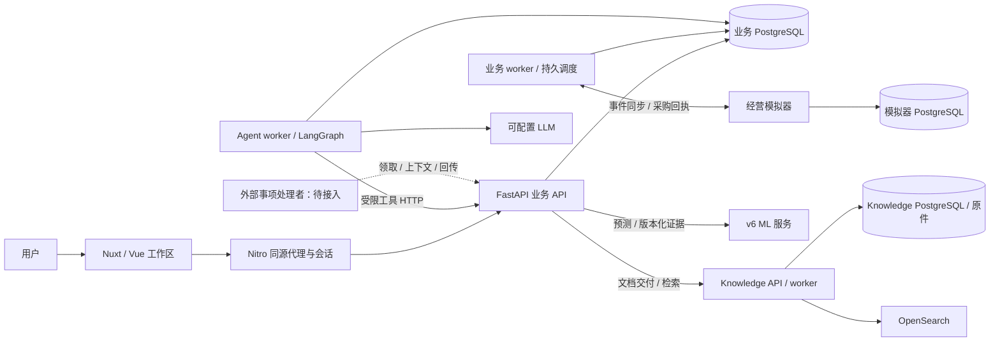

# ShopSteward · 零售经营协作系统

ShopSteward 围绕门店备货，把经营数据、七日需求预测、方案比较、人工采购确认、执行回执和 Agent 对话放在同一工作区。后端负责库存、现金与采购规则；Agent 查询证据、解释方案并协助试算；模拟器提供可重复的经营事件与外部执行结果。

**当前基线：2026-09-12，main 已合并 [PR #15](https://github.com/yhnapoleon/ShopSteward/pull/15)，提交 `2313365`。** v6 预测与任务工作区、事项承接已合流。业务数据库迁移头为 **`0014_forecast_work_merge`**。

[当前能力](#当前能力与边界) · [项目架构](#项目架构) · [首次安装](#首次安装) · [启动服务](#启动服务) · [可选能力](#启用可选能力) · [更新与验证](#更新与验证) · [文档导航](#文档导航)

## 当前能力与边界

| 模块 | 已实现 | 使用条件与边界 |
|---|---|---|
| 经营与备货 | 库存/现金账本、销售与收货查询、Mission、候选方案、警报、周期检查、审批采购及回执恢复 | 需要业务 API、业务 worker、PostgreSQL 和模拟器；采购逐笔确认 |
| 前端工作区 | 今日、持续跟进、经营记录、经营概览、文档中心；同一任务的方案、对话、工具进度和结果 | Nuxt 同源代理访问后端，数据来自实际 API |
| Mission Agent | LangGraph 工具循环、澄清与恢复、持久会话/检查点、记忆与任务 Skill、试算/方案修订、历史引用与成果 | 配置模型和独立 Agent worker 后启用；没有审批采购工具 |
| v6 七日预测 | 四组件推理、300 个支持系列、历史示例、观察历史导入、不可变预测证据、前端面板、Agent `get_forecast` | 模型包随 Git 提供，无需重训；历史演示标注“模型推演，仅供参考”，不能启用为实际规划需求 |
| 知识检索 | 文档/版本/原件管理、解析索引、发布与重试、检索和证据展开、Agent 文档工具 | 检索需独立 Knowledge API/worker、PostgreSQL、OpenSearch；云 embedding/rerank 为可选配置 |
| 主动事项承接 | 自然语言事项保存、连续消息、状态/结果恢复、已有 Mission 关联、外部处理者领取/回传协议 | 新事项的意图分类和处理者尚待接入；与已有 Mission Agent 独立 |
| 经营模拟 | SC01 与可配置 SANDBOX、模拟时间、销售/到货/结算事件、幂等采购回执、本地控制台 | 使用合成经营环境和独立数据库，不连接真实店铺 |

目前是可运行的本地开发与验证系统。完整 A-01/L-01 联合验收、真实经营效果和云端部署验收仍有待完成；历史实验指标及某台机器的服务状态不能代替当前环境验收。

## 项目架构



API 与 worker 共用业务库中的持久任务；API 不会自动启动 worker。`agent/` 是由 Agent worker 加载的 Python 包，不是另一个必须启动的 HTTP 服务。ML、Knowledge、simulation 有各自服务边界，模型和模拟器不直接修改业务账本。

| 目录 | 内容与入口 |
|---|---|
| `frontend/` | Nuxt 4 / Vue 3 / TypeScript；页面、组件、Nitro 代理与 Playwright 测试 |
| `backend/` | FastAPI、SQLAlchemy、Alembic；`app`、`app.worker`、`app/work_items/`、`app/forecast_v6/` |
| `agent/` | LangGraph 运行时、模型适配、持久检查点、记忆/Skill 与受限工具协议 |
| `ml/` | v6 LightGBM/PyTorch 推理服务、验证与模型打包工具 |
| `knowledge/` | 文档解析、索引、检索服务与独立迁移 |
| `simulation/` | 持久 HTTP 模拟器及独立迁移；入口 `python -m simulator` |
| `infra/` | PostgreSQL / Knowledge Compose、Windows 启动器、指定 macOS 环境管理器 |
| `docs/` | 当前契约、架构、运行手册、设计和分阶段验证证据 |
| `var/forecast-v6/bundle/` | 随 Git 分发的模型权重、manifest、示例与推理参考结果 |
| `tests/` | 预留的跨模块测试目录；现有测试主要位于各模块的 `tests/` 和 `tools/` |

数据归属、业务链路和进程关系见 [架构说明](docs/architecture.md)。

## 首次安装

以下以 **Windows PowerShell、仓库根目录**为起点。已有环境保留自己的 `.env`、数据库和模型配置，直接按[更新与验证](#更新与验证)操作。

### 1. 工具与依赖

准备 Git、Python 3.12、uv、Node.js 22、Corepack，以及已启动的 Docker Desktop。仓库声明 Python >=3.11；当前开发与 Windows CI 使用 3.12。pnpm 固定为 `10.17.1`，Python 与前端依赖分别由 `uv.lock`、`pnpm-lock.yaml` 锁定。

```powershell
git clone --branch main https://github.com/yhnapoleon/ShopSteward.git
Set-Location ShopSteward
uv sync --frozen --all-packages --all-groups --python 3.12
corepack pnpm install --frozen-lockfile
```

使用 `corepack pnpm` 调用仓库指定版本。基础安装不包含 ML 的 Torch runtime extra；启用预测时再按下文安装。macOS/Linux 可使用相同依赖命令，将 `Set-Location` 换为 `cd`。

### 2. 创建本地配置

仅为不存在的配置复制模板：

```powershell
foreach ($module in @('infra', 'backend', 'simulation', 'frontend')) {
    $target = Join-Path $module '.env'
    if (-not (Test-Path -LiteralPath $target)) {
        Copy-Item -LiteralPath (Join-Path $module '.env.example') -Destination $target
    }
}
```

填写以下字段。每个凭证使用独立随机值；可通过 `[guid]::NewGuid().ToString('N')` 生成。占位符必须替换，本地配置不提交到 Git。

| 配置文件 | 必填或需要对齐的字段 |
|---|---|
| `infra/.env` | `POSTGRES_PASSWORD`；默认 `POSTGRES_PORT=55432` |
| `backend/.env` | `DATABASE_URL` 的密码/端口与业务 PostgreSQL 一致；配置 `AUTH_TOKENS`；`SIMULATION_TOKEN` 与模拟器服务 token 相同 |
| `simulation/.env` | `SIM_DATABASE_URL` 指向独立 `shopsteward_sim` 库；`SIM_SERVICE_TOKEN` 至少 24 字符 |
| `frontend/.env` | `NUXT_BACKEND_URL=http://127.0.0.1:8000`；手动开发启动可设置 `NUXT_BACKEND_TOKEN` 为后端的用户 admin token，`NUXT_DEV_TOOLS=true` 显示联调入口 |

本地用户身份示例，写成 `backend/.env` 中的一行：

```dotenv
AUTH_TOKENS=[{"token":"<替换为至少24字符的随机用户token>","principal_id":"local-admin","kind":"user","roles":["admin"],"store_ids":[]}]
```

业务库 URL 为 `postgresql+asyncpg://shopsteward:<业务库密码>@127.0.0.1:55432/shopsteward`；模拟器 URL 使用单独的 `shopsteward_sim` 用户、密码和库名。密码若含 URL 保留字符，需要 URL 编码。用户 token、模拟器服务 token、ML 服务 token 和 LLM API key 用途不同。

先保留 `AGENT_ENABLED=false`、`FORECAST_V6_ENABLED=false`；无需模型即可跑通基础经营链路。前端 token 属于 Nitro 私有配置，不使用 `NUXT_PUBLIC_` 前缀；生产构建通过用户登录的 HttpOnly 会话访问，不使用开发身份回退。

### 3. 数据库与迁移

启动业务 PostgreSQL：

```powershell
docker compose --env-file infra/.env -f infra/compose.yaml up -d --wait
```

Compose 创建业务用户和 `shopsteward` 库，**不会自动创建模拟器库**。首次安装进入 psql：

```powershell
docker compose --env-file infra/.env -f infra/compose.yaml exec postgres psql -U shopsteward -d postgres
```

在 psql 中创建模拟器账号和数据库，密码与 `simulation/.env` 一致；已有角色/数据库不重复创建：

```sql
CREATE ROLE shopsteward_sim LOGIN;
\password shopsteward_sim
CREATE DATABASE shopsteward_sim OWNER shopsteward_sim;
\q
```

分别在对应模块目录迁移，使各自的 `.env` 被正确读取：

```powershell
Set-Location backend
..\.venv\Scripts\python.exe -m alembic upgrade head
..\.venv\Scripts\python.exe -m alembic current
Set-Location ../simulation
..\.venv\Scripts\python.exe -m alembic upgrade head
..\.venv\Scripts\python.exe -m alembic current
Set-Location ..
```

预期业务库为 `0014_forecast_work_merge`，模拟器为 `sim_0003_controls`。业务迁移保留预测分支 `0012_forecast_v6` 和事项分支 `0013_work_intake`，已有任一版本均通过 `upgrade head` 合流。Knowledge 使用独立迁移 `knowledge_0002`，不能替代业务迁移。

## 启动服务

### Windows：已有配置后的统一启动

完成依赖、数据库和迁移后，在根目录执行：

```powershell
.venv/Scripts/python.exe infra/start_windows.py
```

启动器读取 `backend/.env`，启动模拟器、业务 API、业务 worker 和前端；按开关增加 Agent worker 与 v6 ML 服务，并检查就绪状态。它不负责创建数据库、执行迁移或启动 Knowledge 服务。前端开发身份取自配置中的 admin 用户。

默认端口 3000/8000 必须空闲；8053 在启用预测时也必须空闲。已有 8001 模拟器会被复用并检查 ready，应确认它使用本项目配置。日志和本次创建的 PID 写入 `var/windows-stack-<时间>/` 的日志及 `processes.json`。启动成功后服务留在后台；脚本没有 `stop` 子命令，停止时根据该记录核对进程，或用下面的分终端方式管理生命周期。

### 分终端启动：Windows / macOS / Linux

在**每个 Python 终端**先激活根目录环境：PowerShell 使用 `.\.venv\Scripts\Activate.ps1`，bash/zsh 使用 `source .venv/bin/activate`。若 PowerShell 不允许激活脚本，可在模块目录用 `..\.venv\Scripts\python.exe` 代替 `python`。

| 终端 | 工作目录 | 命令 |
|---|---|---|
| 模拟器 | `simulation/` | `python -m simulator` |
| 业务 API | `backend/` | `python -m app` |
| 业务 worker | `backend/` | `python -m app.worker --profile business` |
| 前端 | 仓库根目录 | `corepack pnpm --filter @shopsteward/frontend dev --host 127.0.0.1 --port 3000` |
| Agent worker（可选） | `backend/` | `python -m app.worker --profile agent` |
| Knowledge 交付 publisher（可选） | `backend/` | `python -m app.knowledge.publisher` |

每条长期运行命令使用独立终端，Ctrl+C 停止对应前台进程。API 和 worker 都需要迁移后的业务库，初始化场景还需要模拟器。仅启动 API 不会处理排队任务。

已有 Apple Silicon Mac 专用环境可使用 `.venv/bin/python infra/local_dev.py start`，并提供 `status`、`stop`、`migrate` 子命令。该脚本依赖预先初始化的 Homebrew PostgreSQL 17 及固定数据路径，会关闭 Agent，且不启动 ML/Knowledge；新机器先读 [macOS 开发说明](docs/local-macos-development.md)，不要把它当通用安装器。

### 地址与第一次使用

| 入口 | 默认地址 | 检查方式 |
|---|---|---|
| 用户工作区 | `http://127.0.0.1:3000` | `/api/session` 查看身份状态 |
| 业务 API | `http://127.0.0.1:8000` | `/health/live`、`/health/ready`；开发 Swagger 为 `/docs` |
| 模拟器 | `http://127.0.0.1:8001` | `/health/ready`、`/docs`；控制台需开启 `SIM_CONSOLE_ENABLED` |
| v6 ML（可选） | `http://127.0.0.1:8053` | `/health/ready` 需要 ML Bearer token |
| Knowledge（可选） | `http://127.0.0.1:8020` | `/health/ready`；完整依赖见部署手册 |
| 业务 PostgreSQL | `127.0.0.1:55432` | 业务和模拟器使用独立用户/数据库 |

首次打开工作区，连接本机 admin 身份，通过“联调控制 · 合成数据”创建 SC01，再按界面建立备货跟进、核对方案并确认采购。没有初始化场景时没有门店和库存数据是正常状态。也可在后端 Swagger 使用用户 token 调用 `POST /dev/v1/scenarios`，body 为 `{"scenario":"SC01"}`，提供新的 `Idempotency-Key`，随后查询返回的 JobRun；202 表示受理，执行状态以任务结果为准。

“交给我一件事”目前可以保存事项；自动理解和处理需另外接入事项处理者。要使用已有 Mission Agent，进入具体备货任务的 Agent 工作区。

## 启用可选能力

### v6 模型推演与观察历史预测

在根目录补齐可选依赖并验证已打包的模型：

```powershell
uv sync --frozen --all-packages --all-groups --all-extras --python 3.12
.venv/Scripts/python.exe ml/tools/reproduce_v6.py
```

`--all-extras` 同时安装 Torch 等可选依赖，该环境用于完整开发。只复现模型时可采用 [ML 独立安装流程](ml/README.md)。模型包随 Git 分发，不依赖相邻研究工作树、GPU、原始训练集或 LLM key；固定复现样例应输出 `verification: PASS`。

在 `backend/.env` 配置：

```dotenv
FORECAST_V6_ENABLED=true
FORECAST_V6_URL=http://127.0.0.1:8053
FORECAST_V6_TOKEN=<独立随机ML服务token>
```

Windows 统一启动器会启动 ML 并注入相同凭证；模型使用另一 Python 环境时，增加 `ML_PYTHON=<该环境python的绝对路径>`。手动启动时在根目录、已激活完整环境的终端执行：

```powershell
$env:ML_SERVICE_TOKEN='<与FORECAST_V6_TOKEN相同的值>'
python -m uvicorn shopsteward_ml.service:create_app --factory --host 127.0.0.1 --port 8053
```

bash/zsh 用 `export ML_SERVICE_TOKEN='...'`。ML 服务直接读取进程环境，不会自动加载 `ml/.env`。默认模型路径相对于仓库根目录；在其他目录启动需指定绝对路径 `ML_V6_BUNDLE`。

首页提供两种输入：历史示例只用于模型推演；观察历史要求连续、完整的 84–374 天整数销量，需用户显式选择规划启用，后端继续校验范围、时间、新鲜度和状态版本。预测不直接生成已批准采购。接口及质量边界见 [v6 产品接入报告](docs/reports/forecast-v6-product-integration.md)。

### Mission Agent

在 `backend/.env` 设置 `AGENT_ENABLED=true`，填写 `AGENT_BASE_URL`、`AGENT_MODEL`、`AGENT_API_MODE`、`AGENT_API_KEY_FILE` 和 `AGENT_BACKEND_URL`。Key 文件只存 API key，建议用绝对路径；协议可选 `chat_completions` / `responses`，应与所选服务的工具调用能力一致。

Windows 统一启动器会增加 Agent worker；手动启动则另开 `python -m app.worker --profile agent`，并在 `frontend/.env` 设置 `NUXT_AGENT_ENABLED=true` 后重启前端。开启模型会消耗所配置服务的 API 用量。会话、恢复、记忆及工具边界见 [Agent README](agent/README.md)。

### Knowledge 检索与事项处理者

Knowledge 的 API、worker、PostgreSQL、OpenSearch 和存储有单独部署流程，使用 [Knowledge 完整部署手册](docs/runbooks/knowledge-server-handoff.md)及 [Compose 配置](infra/compose.knowledge.yaml)。后端设置 `KNOWLEDGE_SERVICE_ENABLED=true`、`KNOWLEDGE_SERVICE_URL`、`KNOWLEDGE_SERVICE_KEY`，服务端 key 与后端一致。后端还需在独立终端运行 `python -m app.knowledge.publisher` 交付 outbox；它不属于业务 worker，也不会被 Windows 总启动器自动启动。不要只打开开关而省略服务、索引与发布流程。

新事项通过 `/internal/v1/work-items` 协议交给外部处理者。`WORK_PROCESSOR_ENABLED=true` 仅声明已接入处理者，既不启动进程，也不把事项自动接到 Mission LangGraph；实际接入完成前保持默认 false。协议与分工见 [事项承接模块](backend/app/work_items/README.md)。

## 更新与验证

### 更新已有环境

确认工作区改动已妥善保存，在当前跟踪分支执行 `git pull --ff-only`；需要合入 main 的开发分支先检查差异并按团队流程合并。然后同步锁文件依赖，完整模型环境保留 `--all-extras`：

```powershell
uv sync --frozen --all-packages --all-groups --all-extras --python 3.12
corepack pnpm install --frozen-lockfile
```

基础环境可省略 `--all-extras`。按前文分别迁移业务库和模拟器库，再重启使用旧代码的 API、worker、前端及启用的服务。Git 更新不会迁移数据库、刷新运行中进程或传输 `.env`。业务数据、原件、日志、依赖环境需单独保留；模型包内文件不要手工格式化，以免破坏 manifest 哈希。

### 开发检查

根目录检查前端契约、类型与构建：

```powershell
corepack pnpm --filter @shopsteward/frontend api:check
corepack pnpm --filter @shopsteward/frontend typecheck
corepack pnpm --filter @shopsteward/frontend build
```

后端 unit/API/forecast 与 Agent 单元测试可在已安装依赖的环境执行，无需真实模型服务：

```powershell
Set-Location backend
..\.venv\Scripts\python.exe -m pytest tests/unit tests/api tests/test_forecast_v6.py -c pyproject.toml -q
..\.venv\Scripts\python.exe -m pytest ../agent/tests -c pyproject.toml -q
Set-Location ..
.venv/Scripts/python.exe -m pytest ml/tests -q
```

ML 测试需要 runtime/dev extras。macOS/Linux 将 `.venv/Scripts/python.exe` 替换为 `.venv/bin/python`。真实 PostgreSQL、模拟器及跨进程验收另需专用测试库和配置，按模块 README 执行；不要把集成测试指向业务开发库。

前端服务已启动后，可运行以下使用受控 API 响应的浏览器回归；首次使用先安装 Playwright Chromium：

```powershell
corepack pnpm --filter @shopsteward/frontend exec playwright install chromium
corepack pnpm --filter @shopsteward/frontend exec playwright test tests/forecast.spec.ts tests/task-workspace.spec.ts tests/work-intake.spec.ts tests/agent-progress.spec.ts
```

默认访问 3000，其他端口通过 `FRONTEND_URL` 指定。其余浏览器和 smoke 脚本可能创建合成场景或调用真实模型，运行条件见对应模块说明。

当前合流验证（`2313365` 的代码树）：后端 **304 passed**，Agent **32 passed / 3 skipped**，ML runtime **22 passed**；24 项相关浏览器回归中 23 项首轮通过，1 项 Windows 剪贴板换行断言适配后复测通过；契约、类型、生产构建及 [Windows CI](https://github.com/yhnapoleon/ShopSteward/actions/runs/34696812946)通过。迁移检查覆盖两条历史分支与空库的离线升级 SQL，不代表已替本机业务库执行升级。

### 常见问题

| 现象 | 优先检查 |
|---|---|
| live 正常、ready 失败 | 数据库连接、是否在正确模块目录加载 `.env`、`alembic current` 是否为当前 head |
| 初始化或业务任务一直排队 | 业务 worker、模拟器 ready、两个服务 token 是否匹配；admin 查看 `/api/v1/monitoring/status` |
| 前端未连接身份或 401 | `AUTH_TOKENS`、用户 token 与角色；开发模式的 `NUXT_BACKEND_TOKEN` 或登录会话 |
| Agent 不工作 | 后端/前端开关、Key 文件、模型协议和 Agent worker；业务 worker 不处理 Agent 队列 |
| 新事项只有“已保存”没有答案 | 外部事项处理者尚未接入；开启 Mission Agent 不会自动完成该接入 |
| 预测 UNAVAILABLE / STALE | 模型开关、8053 服务与 token、已导入输入、有效期及门店/SKU/业务状态是否匹配 |
| Knowledge 检索不可用 | 独立服务与 worker、数据库/索引就绪、服务 key、文档索引及发布状态 |
| 启动器报告端口占用 | 查明旧服务所有者并按原管理方式停止；统一启动器不会接管所有旧进程 |
| API 契约漂移 | 在 `backend/` 执行 `python -m app.export_openapi`，再于根目录执行 `corepack pnpm --filter @shopsteward/frontend api:generate` 并检查差异 |

## 文档导航

| 主题 | 入口 |
|---|---|
| 架构与数据边界 | [架构说明](docs/architecture.md)、[数据字典](docs/data-dictionary.md) |
| 当前 API | [运行时 OpenAPI](docs/api/backend.runtime.openapi.json)、[实现清单](docs/api/implementation-status.json)、[契约说明](docs/api/README.md) |
| 模块运行 | [Backend](backend/README.md)、[前端](frontend/README.md)、[Agent](agent/README.md)、[模拟器](simulation/README.md)、[ML](ml/README.md) |
| 任务、事项与成果 | [事项协议](backend/app/work_items/README.md)、[任务工作区交付](docs/reports/agent-workspace-delivery.md) |
| Knowledge | [完整部署与交接手册](docs/runbooks/knowledge-server-handoff.md) |
| 开发与视觉规范 | [Backend 开发规范](docs/backend-development.md)、[前端视觉规范](frontend/style.md)、[macOS 环境](docs/local-macos-development.md) |
| 历史决策与实验 | [项目上下文](PROJECT_CONTEXT.md)、[交接记录](HANDOVER.md)、[v6 接入报告](docs/reports/forecast-v6-product-integration.md) |

本页描述当前合流版本。模块文档按日期保留的旧接口数量、旧迁移头和机器运行状态用于追溯；调用接口以源码导出的 runtime 契约为准，迁移以当前 Alembic head 为准。
