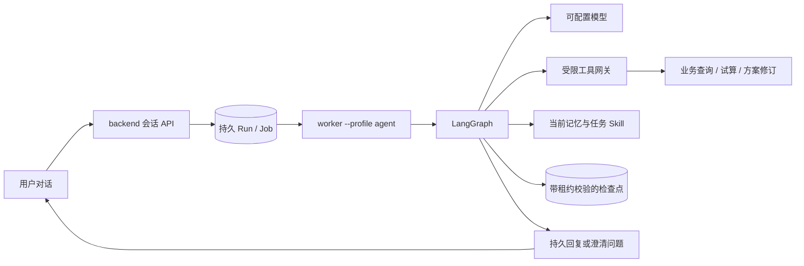

# ShopSteward Agent

首版已实现为 Python 包，由 backend 的独立 Agent worker 装配。真实 LangGraph 主图、OpenAI 风格 Chat Completions、PostgreSQL 检查点、Hermes 派生记忆策略、任务 Skill 和受限业务工具已经贯通。前端聊天页面、外部 Agent HTTP 服务、向量 RAG、真实预测模型仍属于后续接入。



## 启动

从仓库根目录安装 `uv sync --all-packages --all-groups`。普通业务 worker 不导入 LangGraph；Agent worker 显式选择 `--profile agent`，默认并发 1。

在 `backend/.env` 配置下列字段；Key 文件只包含 API Key，运行时读取，不提交到 Git：

```dotenv
AGENT_ENABLED=true
AGENT_BASE_URL=https://api.openai.com/v1
AGENT_MODEL=gpt-4.1-mini
AGENT_API_KEY_FILE=C:/private/openai.txt
AGENT_BACKEND_URL=http://127.0.0.1:8000
AGENT_WORKER_CONCURRENCY=1
```

继续使用现有 `DATABASE_URL`、`AUTH_TOKENS`、simulator 配置。切换到新版本前，在 backend 目录运行迁移；然后分别在三个终端启动 API、业务 worker 和 Agent worker：

```powershell
..\.venv\Scripts\python.exe -m alembic upgrade head
..\.venv\Scripts\python.exe -m uvicorn app.main:app --host 127.0.0.1 --port 8000
..\.venv\Scripts\python.exe -m app.worker --profile business
..\.venv\Scripts\python.exe -m app.worker --profile agent
```

后三条是三个独立进程。Windows 的 Agent worker 自动使用 psycopg 所需的 SelectorEventLoop。不要覆盖已有凭证配置。开发阶段的验收使用单独的 `shopsteward_agent_acceptance` 数据库；本次没有替换 8000/8001 上已有服务，也没有迁移原开发库。

## 对话与方案反馈

1. `POST /api/v1/missions/{mission_id}/conversations` 创建当前用户的会话。
2. `POST /api/v1/conversations/{conversation_id}/messages` 提交 `{"content":"解释当前方案"}`，返回 `agent_run_id`。
3. 轮询 `GET /api/v1/agent-runs/{run_id}`；完整消息通过会话 messages GET 读取，支持 `after_seq` 分页。
4. `WAITING_INPUT` 返回 `interrupt_id` 和 `question`。向 `/agent-runs/{run_id}/resume` 提交这两个字段中的 ID 与 `content`，继续同一个 Run。`/cancel` 取消运行。
5. “如果最多买20件”调用只读 `evaluate_plan`；“这次修改方案，最多买20件”调用 `revise_plan`，保留旧方案并生成新的待确认版本。临时数量上限独立于现金 Policy，在本轮采购成功后清除。
6. 采购批准仍走已有 `/api/v1/plans/{plan_id}/decision`，使用用户的真实 approver 身份、精确版本和 hash。Agent 没有审批或采购执行工具。

所有写入入口使用现有用户 Bearer；创建会话、发送、恢复、取消、知识编辑需要 `Idempotency-Key`。followup PATCH 使用 `expected_version`。完整注册契约见 [agent-v1.openapi.json](../docs/api/agent-v1.openapi.json)，已有路径的 B0 行为保持兼容。

## 记忆与任务 Skill

`GET/POST /api/v1/stores/{store_id}/agent-knowledge` 读取或修改当前用户在该店铺的知识。其他用户即使属于同一店铺也无法读取这些内容。

- `USER`：通用回答偏好，1375 字符预算。
- `NOTES`：稳定背景，2200 字符预算。
- `SKILL`：任务流程、任务相关偏好和纠正；首条业务线 `task_type=replenishment`。每个任务作用域最多 12 个条目、6000 字符。它是版本化流程文本，不执行脚本。

每次变更有 scope 版本、稳定 entry ID、来源和历史 revision；乐观版本冲突拒绝覆盖。删除从当前作用域移除，审计 revision 保留。每个模型节点重新加载当前版本；记忆工具回执只把版本信息放入图状态，避免把旧记忆副本重新注入。

明确的保存、纠正、删除请求进入需要成功工具回执的图流程，可先澄清对象。读取偏好、否定保存和一次性数量调整不会强制写记忆。中文/英文明确命令的识别是保守规则，并非通用意图理解模型；不明确的表达可能需要用户澄清。实际语义解释仍由模型完成。

Hermes 采用的是固定源码版本的条目更新语义，经纯函数化并接入本项目 PostgreSQL 持久化；没有安装或嵌入完整 Hermes Agent。来源与许可见 [THIRD_PARTY_NOTICES.md](THIRD_PARTY_NOTICES.md)。

## 运行与扩展边界

图线程等于 Run ID。每个会话串行执行，排队的用户消息不会进入正在执行的输入。历史使用最近 80 条消息窗口并按所属对话轮次组装；暂未实现语义摘要。业务事件按持久水位合并，只有完成回复才消费。后台跟进需用户显式开启，默认 300 秒、最小 60 秒；无新事实时不调用模型。结果保存在应用消息中，未发送外部 IM/邮件。

每 Run 最多 8 个逻辑模型轮次、12 个工具、90 秒执行窗口；模型请求 30 秒、工具 10 秒。澄清等待不计时，进程故障停机计入窗口；崩溃在模型请求中可能重发同一个逻辑轮次并产生额外用量。协议修复最多一次。使用工具调用凭证和 Job 租约限制每次写入；旧 worker 无法提交检查点、pending writes、工具效果或最终回复。

金额由后端提供分值和确定性元显示，方案卡片直接来自 Plan。文字中的阿拉伯数字金额会与工具证据核对；不一致时回退到确定性方案说明并标记 `validation_warnings`。这不是对全部自然语言含义的完整证明。

扩展入口位于 `shopsteward_agent.extensions`：`EvidenceProvider`、`SkillProvider`、空默认实现和有来源/工具依赖过滤的 `collect_extensions`。可在装配层的 `load_context` 中接入；当前尚未配置外部 RAG/技能仓库。业务事实始终通过 backend，用模型适配器切换兼容供应商；本次真实服务验证仅覆盖 OpenAI 官方 API。

## 验证

从 backend 运行 pytest，需要专用 `TEST_DATABASE_URL=.../shopsteward_test` 与 `TEST_SIM_DATABASE_URL=.../shopsteward_sim_test`，先迁移测试库；测试会清理该测试库中的队列，不能指向开发或生产库。

```powershell
..\.venv\Scripts\python.exe -m pytest tests ../agent/tests -c pyproject.toml -q
```

真实模型与进程验收：从 backend 运行 `tools/verify_agent.py`，可加 `--knowledge-only` 或 `--recovery`。脚本使用独立验收库、临时随机鉴权、8024 端口和自有进程，消耗模型 API 用量。具体结果和未注入的故障见 [进程验收报告](../docs/reports/agent-v1-process-report.md)。
