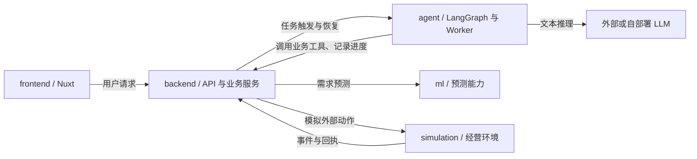

# 简化架构与分工

按交付模块划分，内部实现留空。先约定接口，再由负责人决定本模块需要哪些文件。

## 模块职责

| 目录 | 负责什么 | 对外提供什么 |
|---|---|---|
| frontend | Nuxt 页面、交互、执行进度展示 | 用户提交与结果展示 |
| backend | HTTP API、任务记录、库存和现金账本、采购规则与批准校验 | 前端接口与 Agent 业务工具接口 |
| agent | LangGraph 编排、Worker、定时唤醒、任务恢复、LLM 调用、记忆和技能学习 | 接收任务触发，推进任务并回传进度与结果 |
| ml | 预测数据处理、训练、评估与推理；需要时提供独立预测服务 | 有版本和数据截止时间的预测结果 |
| simulation | 合成经营场景、模拟时间、需求、到货、销售和结算事件；模拟外部动作结果 | 场景重置、时间推进、事件与执行回执 |
| infra | Docker、环境配置、启动脚本、部署与联调配置 | 一致的开发与运行环境 |
| docs | 架构、接口契约、数据字段、分工、实验说明 | 团队共同遵循的约定 |
| tests | 跨模块集成与 A-01 / SC-01 / L-01 验收 | 检查整条业务链是否连通、正确 |

## 模块交互

## 分工时需要共同确定的边界

1. **backend 与 agent：**backend 保存经营事实和任务记录、校验动作权限；agent 决定如何推进任务并保存自己的图检查点与记忆。现金或库存不能由模型直接改写。持久任务如何领取、触发和恢复由两者共同约定。
2. **backend 与 simulation：**simulation 模拟店铺外部世界及动作结果；backend 根据带唯一 ID 的事件/回执更新经营账本。状态归属、初始状态导入、事件顺序和去重规则在接口文档中写明，避免同一次销售或到货重复记账。
3. **backend 与 ml：**ml 返回预测，backend 负责现金约束、方案推演和采购比较。LLM 客户端归 agent，销量预测模型归 ml。
4. **infra 与业务对接：**infra 负责让模块启动、联网和部署；业务 API、模型调用和模拟器适配代码归各调用方，接口约定放 docs。

这些是代码所有权边界，不等于八个独立部署服务。P0 的 simulation、ml 可以先作为 Python 模块调用，出现资源或部署需要时再单独提供服务。

## 四人认领建议

| 工作包 | 主负责 | 协作 |
|---|---|---|
| 产品与整合 | frontend、infra | 汇总 docs、组织 tests |
| 业务与环境 | backend、simulation | 与 Agent/模型负责人对齐输入输出 |
| Agent 与学习 | agent | 与 backend 对齐任务、工具、批准与恢复 |
| 预测与实验 | ml | 共同完善 simulation 场景及效果评价 |

各模块负责人共同补充 docs 和 tests。若业务与环境工作量过重，可由预测负责人认领模拟需求与场景部分；不为分工方便而复制业务状态或计算规则。
