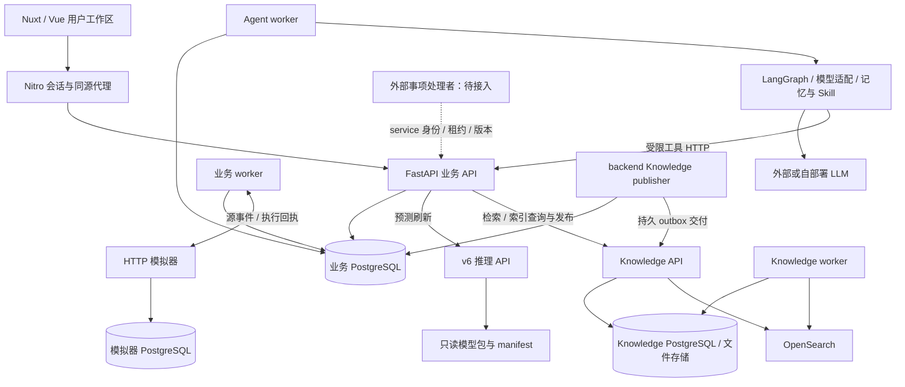

# 项目架构与数据边界

本页对应 2026-09-12 合流基线 `2313365`。安装、配置和启动命令见[根 README](../README.md)；本页说明模块如何协作及状态由谁维护。

## 运行进程

| 进程 | 工作目录 / 入口 | 必要条件 |
|---|---|---|
| 前端开发服务 | 根目录；`corepack pnpm --filter @shopsteward/frontend dev` | Node、前端依赖、可访问的后端 |
| 业务 API | `backend/`；`python -m app` | 业务配置与迁移后的数据库 |
| 业务 worker | `backend/`；`python -m app.worker --profile business` | 同一业务库；经营同步和采购链需要模拟器 |
| Agent worker | `backend/`；`python -m app.worker --profile agent` | `AGENT_ENABLED`、模型配置、API、业务库 |
| 模拟器 | `simulation/`；`python -m simulator` | 独立数据库、迁移和服务 token |
| v6 ML | 根目录；`python -m uvicorn shopsteward_ml.service:create_app --factory --host 127.0.0.1 --port 8053` | ML runtime、模型包、进程环境中的共享 token |
| Knowledge publisher | `backend/`；`python -m app.knowledge.publisher` | 业务 outbox、原件存储、Knowledge 连接配置 |
| Knowledge API / worker | `infra/compose.knowledge.yaml`；详见[部署手册](runbooks/knowledge-server-handoff.md) | 独立 PG、OpenSearch、原件存储、迁移和服务 key |

`agent/` 是 Agent worker 加载的运行时包；图检查点与业务状态的持久化由桥接层协调。业务 worker、Agent worker、Knowledge publisher 和 Knowledge worker 是不同进程，不能互相替代。Windows 启动器管理基础栈及按开关启用的 Agent/ML，不启动 Knowledge 栈或 publisher。

## 状态与数据归属

| 状态 | 所有者 | 约束 |
|---|---|---|
| 库存、现金、销售、在途、采购账本 | backend | 唯一业务事实来源；模型文字和 UI 表格不直接写账 |
| Mission、Plan、审批与 Action | backend | Mission 表示持续备货委托；Plan 保存候选及输入证据；批准后才产生执行链 |
| Conversation、Message、Run、工具活动与事件 | backend Agent 桥接层 | 按用户、门店与任务隔离，记录可恢复进度和实际成果 |
| 图检查点、记忆与任务 Skill | Agent 运行时及桥接层 | 与 Run/租约关联；通过现有管理与鉴权边界使用 |
| WorkItem、WorkMessage、结果、领取租约 | backend 事项承接层 | 先保存用户的一件事，可关联已有 Mission；不复制账本 |
| 预测输入、不可变证据、当前绑定 | backend forecast_v6 | 绑定门店/SKU、输入、模型版本与业务状态；规划启用需显式选择并持续校验 |
| 冻结模型、特征计算与原始推理输出 | ml | 校验 manifest 哈希；不决定采购数量或审批 |
| 文档归属、版本元数据、原件与交付 outbox | backend knowledge | 管理上传、访问与交付；publisher 向独立服务提交 |
| 解析块、检索索引、有向关系及服务数据 | knowledge | 自有 PG/文件存储/OpenSearch，与业务库分别迁移 |
| 模拟时间、外部经营事件和采购回执 | simulation | 独立数据库和幂等记录；backend 拉取或接收后按规则入账 |

业务和模拟器可共用 PostgreSQL 实例，但账号、数据库、迁移与事务独立。Knowledge Compose 另有独立 PG 和 OpenSearch。前端没有独立经营账本，页面缓存和草稿不能作为最终业务状态。

## 关键业务链路

### 备货、采购与持续跟进

1. 用户在合成环境初始化 SC01/SANDBOX，API 保存任务，由业务 worker 从模拟器导入状态并持续同步事件。
2. 用户创建 Mission，确定门店/SKU、现金底线、供应商及候选数量；周期调度、事件和手动检查共同触发规划。
3. 后端读取一致快照，生成带版本/hash 的 Plan 与警报；数据过期或输入不完整时不发布可执行的新结论。
4. 用户批准具体 Plan，后端重新校验版本、资金与权限，记录 Action 并执行采购发送/回执核实。模型没有采购批准工具。
5. 模拟器产生回执和到货/销售等事件，后端按唯一标识与序号去重入账；超时或未知结果沿原 Action 核实，不盲目重购。

细节见[后端开发规范](backend-development.md)、[Simulator 契约](simulation-contract.md)和[组合故障验证](reports/b0-07-test-report.md)。

### 已有 Mission 的 Agent 协作

用户消息进入持久 Conversation/Run，独立 Agent worker 执行 LangGraph。模型调用受限业务工具，后端完成身份、任务、门店与输入校验；查询、试算、方案修订返回可引用的结构化结果。

桥接层持久化工具开始/结束/失败、Run 事件、引用和成果。前端通过事件回放/SSE与轮询恢复显示，区分试算、修订、采购与到货。停止回答不撤销已经提交的业务变更；修订方案仍需要用户另行批准采购。

启用文档服务后可用 `search_documents` / `read_document_evidence`；启用 v6 后可用 `get_forecast` 读取已保存预测。工具能力是否开放取决于运行配置与权限。架构不把模型生成的文本等同于已核实事实。

### v6 预测与规划

模型包由 F6、F3、W2、N3 四组件组成，随仓库分发并在加载时校验文件哈希。后端通过独立 ML HTTP 服务刷新结果，保存输入与不可变预测证据，再建立当前门店/SKU 绑定。

- `historical_demo`：使用明确选择的原始历史示例，只供“模型推演”，不能启用为实际规划需求。
- `observed`：导入连续完整的 84–374 天整数销量，显式选择规划启用；后端还检查预测期限、业务时间、状态版本及作用范围。
- 前端和 Agent 读取已保存证据；失效、被替换或范围不符的引用不能当成当前预测。

ML 负责七日销量预测，backend 继续负责现金、库存、报价、候选数量及审批。当前质量记录不等于生产经营收益证明，详见[v6 接入报告](reports/forecast-v6-product-integration.md)。

### Knowledge 交付与检索

后端管理文档与原件，记录待交付 outbox；独立 publisher 负责提交。Knowledge worker 处理服务侧解析/索引任务，API 提供查询、检索与证据展开。索引构建和发布分别记录，未完成发布不能当作可检索版本。

历史引用绑定文档版本、索引代次、块与内容校验值，访问时重新核对权限；历史证据不可用时明确显示，不用最新版冒充。部署、导入、原件存储、备份及恢复见[完整手册](runbooks/knowledge-server-handoff.md)。

### 主动事项承接与待接入处理者

新事项先保存 WorkItem 和连续消息。外部处理者使用 service 身份领取事项，取得版本化上下文，再回传追问、进度、结果或已有 Mission 关联；短租约和处理令牌防止过期回传覆盖用户新输入。

平台承接和协议已实现，意图分类及实际处理进程仍待接入。`WORK_PROCESSOR_ENABLED` 只声明服务可用性，独立于 `AGENT_ENABLED`。用户接受显示出的备货条件后，平台才调用原 Mission 创建；每笔采购仍走原审批。详见[事项协议](../backend/app/work_items/README.md)。

## 契约、迁移与验证入口

- 业务运行时接口：[`backend.runtime.openapi.json`](api/backend.runtime.openapi.json)，当前基线为 63 条路径、71 个 HTTP 操作；开发与生产是否公开 Swagger 由配置决定。
- 前端类型和公开代理白名单从运行时契约生成，浏览器代理不开放 `/internal/` 服务接口；生成与校验命令见[根 README](../README.md)。
- 业务迁移头 `0014_forecast_work_merge` 合并已有 `0012_forecast_v6` 与 `0013_work_intake`；模拟器为 `sim_0003_controls`，Knowledge 为 `knowledge_0002`。
- Git 更新不自动迁移数据库或重启进程。业务单元测试、真实 PG/HTTP 集成、浏览器受控响应回归和真实模型验收分别保留证据，不把一种测试替代另一种。
- 当前合流验证与边界见 [HANDOVER 顶部](../HANDOVER.md)；完整 A-01/L-01、事项处理者和云端/真实经营效果继续按各模块的待完成项推进。
