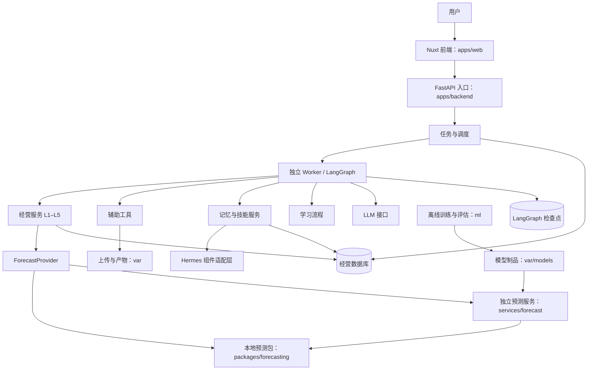

# 架构分层

以下为目录对应的目标架构，各模块当前留空。

```mermaid
flowchart TB
    User[用户] --> Web[Nuxt 前端：apps/web]
    Web --> API[FastAPI 入口：apps/backend]
    API --> Tasks[任务与调度]
    Tasks --> Worker[独立 Worker / LangGraph]
    Worker --> Commerce[经营服务 L1–L5]
    Worker --> Auxiliary[辅助工具]
    Worker --> Memory[记忆与技能服务]
    Worker --> Learning[学习流程]
    Worker --> LLM[LLM 接口]
    Memory --> Hermes[Hermes 组件适配层]
    Commerce --> Provider[ForecastProvider]
    Provider --> Local[本地预测包：packages/forecasting]
    Provider --> Remote[独立预测服务：services/forecast]
    Remote --> Local
    ML[离线训练与评估：ml] --> Models[模型制品：var/models]
    Models --> Remote
    Commerce --> DB[(经营数据库)]
    Tasks --> DB
    Memory --> DB
    Worker --> CP[(LangGraph 检查点)]
    Auxiliary --> Files[上传与产物：var]
```

- API 与 Worker 共用后端代码，运行时分进程。
- 经营规则归经营服务；模型通过明确接口提供能力。
- 预测契约独立保存，本地预测与独立服务复用同一实现。
- 记忆和技能组件通过适配层接入，不另建 Hermes 主运行循环。
- 部署文件、数据契约和各模块代码由后续开发补充。
