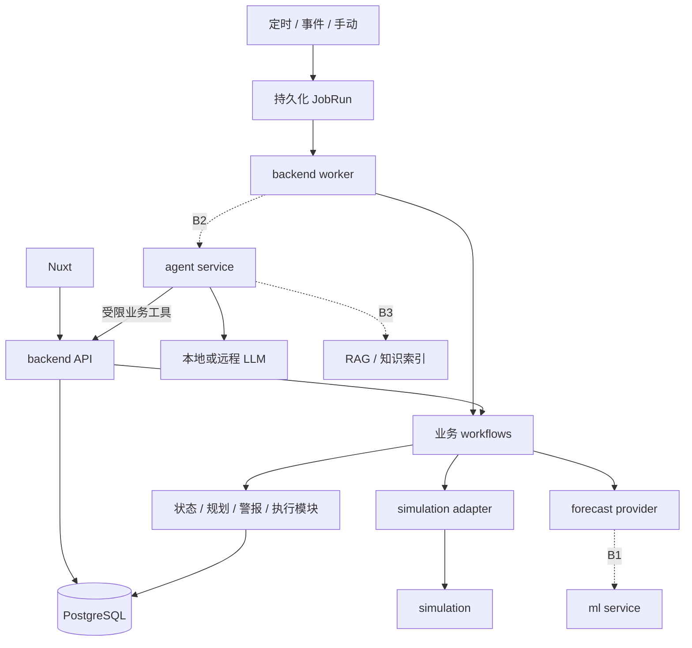
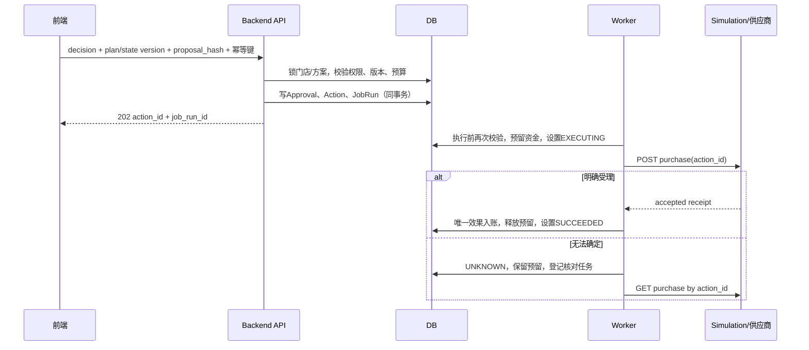

# ShopSteward Backend 开发与接口规范

版本：0.2.0-draft · 日期：2026-09-06 · 状态：整体为开发设计；B0-01至B0-05已实现；正向采购/到货及显式完整SC01已验证

本文面向后端、Nuxt 前端、模拟环境、预测模型和 Agent 的开发人员。目标是先完成不依赖 Agent/RAG 的确定性业务后端，再通过稳定契约接入智能能力。本文中的路径、端口、频率、状态和字段是本项目建议采用的约定；不表示当前仓库已经提供这些能力。

当前实现范围以 [Backend说明](../backend/README.md) 与 [实现清单](api/implementation-status.json) 为准：21个backend操作（20条路径）、状态/INIT/销售/需求账本、Mission管理、固定预测与有限候选规划、不可变Plan、警报去重/知晓/恢复、只读看板/历史、initialize/sync/check/execute/reconcile/advance worker及simulator五接口。B0-05已补齐审批、资金预留、UNKNOWN核对、唯一采购/到货入账和显式SC01。Schedule仅存配置，周期派发仍待B0-06。当前代码按app/operations、missions、planning、alerts、reporting、execution内聚，复杂后再拆分目录。

配套文件：

- [Backend OpenAPI 契约](api/backend.openapi.json)：前端 API、内部事件接入、开发演示入口。
- [外部服务 OpenAPI 契约](api/services.openapi.json)：simulation、ml、agent，以及 LLM 文本调用的最小兼容子集。
- [Swagger 使用与契约维护](api/README.md)：在没有业务服务时查看契约，以及实现后的生成、校验流程。
- [模块总体架构](architecture.md)。
- [Simulator 行为契约与协作顺序](simulation-contract.md)：B0 模拟状态所有权、事件顺序、持久化、幂等与最小联调切片。

## 目录

1. [范围与设计决策](#1-范围与设计决策)
2. [部署、目录与依赖](#2-部署目录与依赖)
3. [业务数据与数据库](#3-业务数据与数据库)
4. [状态机与业务规则](#4-状态机与业务规则)
5. [调度、触发与恢复](#5-调度触发与恢复)
6. [事务、幂等与并发](#6-事务幂等与并发)
7. [HTTP 通用约定](#7-http-通用约定)
8. [前端 API](#8-前端-api)
9. [模拟环境协议](#9-模拟环境协议)
10. [预测服务协议](#10-预测服务协议)
11. [Agent 与本地 LLM 协议](#11-agent-与本地-llm-协议)
12. [Swagger 与 OpenAPI 管理](#12-swagger-与-openapi-管理)
13. [配置、部署与可观测性](#13-配置部署与可观测性)
14. [开发步骤与分工](#14-开发步骤与分工)
15. [验收矩阵与 SC01](#15-验收矩阵与-sc01)
16. [扩展路径与参考资料](#16-扩展路径与参考资料)

## 1. 范围与设计决策

### 1.1 本期 B0：独立业务后端

必须在关闭 Agent、RAG、远程预测服务时完成：

1. 从 simulation 导入一次初始状态，持续接入销售、到货、需求调整事件。
2. 保存现金、库存、在途、应收、预测和业务版本。
3. 创建 Mission，支持周期检查、事件检查、手动检查和暂停/恢复。
4. 检查预计缺货、资金约束、执行异常，管理警报生命周期。
5. 使用有限候选采购量和现金底线比较方案。
6. 审批绑定不可变方案内容；执行前再次校验版本、身份和约束。
7. 核对外部采购回执，保证同一采购的账本影响只应用一次。
8. 持久化任务、运行记录、审批、动作和历史，重启后可继续处理。
9. 提供 Nuxt 接口及真实路由生成的 Swagger UI/OpenAPI。

本期范围是 backend 主干，不等同于原产品文档的完整首版。真实 Agent、跨会话学习、CSV 技能复用等原首版目标按用户最新安排移到后续阶段。

### 1.2 后续阶段

| 阶段 | 内容 | 本期处理方式 |
|---|---|---|
| B1 | 独立预测服务 | 定义协议；本期使用 fixed provider，同样输出版本和时间范围 |
| B2 | Agent 对话、解释、持续跟进 | 定义运行与结果协议；关闭时不能出现伪造的 Agent 回答 |
| B2 | 本地/远程 LLM | 配置与调用边界确定；由 agent 模块拥有客户端 |
| B3 | RAG、文件、技能、训练和评估 | 定义数据引用与权限边界；本期不建向量数据库或训练流水线 |
| 后续 | 多门店、多 SKU 联合优化、多个供应商 | 保留实体 ID；新增算法、约束和测试后才能宣称支持 |

### 1.3 核心决策

| 决策 | 采用方式 | 原因 |
|---|---|---|
| 后端组织 | 模块化单体 | 可按功能分工，避免多个业务服务协调事务 |
| Web 框架 | FastAPI + Pydantic，Python >=3.11 | 类型化契约、输入输出校验和 OpenAPI |
| 持久化 | PostgreSQL + SQLAlchemy 2.x + Alembic | 业务事务、唯一约束、任务领取和迁移 |
| 运行单元 | API 进程 + 一个 worker 进程 | 浏览器/API 生命周期与持久任务解耦 |
| 任务存储 | 数据库 Schedule + JobRun | 本期无需 Redis、Celery、Kafka |
| 前端刷新 | HTTP 查询轮询 | 后续可增加 SSE，保留原查询接口 |
| 模型故障 | 明确降级/不可用状态 | 模型输出不能替代账本或审批 |
| API 规范 | OpenAPI 3.1.0 + Swagger UI | 契约审阅、交互调试、客户端生成 |

以上是技术方向，不是已经锁定的依赖版本。实施时在 uv lockfile 中锁定兼容版本；不要使用不受控的 latest 镜像。SQLite 可用于部分纯逻辑开发，但不能替代 PostgreSQL 的并发与事务验收。

### 1.4 开发入口与首个可用结果

- 可用结果：用户查看缺货风险、确认 40 件采购，并查询到现金 600 元、现货 20 件、在途 40 件及可追溯回执。
- 功能成功：SC01 数值正确，同请求/同采购重复输入不重复产生效果；后续扩展到销售、到货、需求上修与重启恢复。1/5/30 秒是配置默认值，实际时延记录后报告。
- 核心路径前置：版本化 payload **及行为契约**、backend 事务/唯一约束、最小持久任务 runner，以及在采购联调前可用的最小 simulator；无需等待完整模拟平台。
- 后续验证：多频率调度与恢复在 B0-06/07 验收；模型效果、复杂需求、吞吐压测与生产运维在对应后续阶段验收，不阻断独立业务开发。
- 下一步：按第14章交错开发 backend 和最小 simulator。先约定接口可以开始 backend 的模型、规则和 API；只有静态 payload 或 mock 不能证明采购、事件顺序和重启恢复已跑通。

## 2. 部署、目录与依赖

### 2.1 所有权与运行位置

| 模块 | 所有权 | 不承担的职责 |
|---|---|---|
| backend | 当前业务事实、Mission、调度、规则、审批、动作与账本 | LLM 提示词、向量检索、模型训练 |
| simulation | 模拟世界、模拟时间、销售与到货事件、外部动作回执 | 直接写 backend 数据库 |
| ml | 需求预测、模型版本、训练评估 | 改现金、决定审批、直接采购 |
| agent | 推理编排、工具调用、图检查点、记忆、RAG、LLM 客户端 | 绕过 backend 修改经营事实 |
| frontend | 展示与用户意图输入 | 驱动后台定时器、计算权威余额 |
| infra | 环境、启动、部署、网络 | 业务适配与采购规则 |

API 和 worker 使用同一套 backend 业务模块和数据库。后续 agent 可以独立部署；其 graph checkpoint 与 backend JobRun 是不同层面的恢复状态，通过 agent_run_id 关联。

B0 跨进程联调默认使用**单一 HTTP simulation 服务**。模拟器独占模拟世界、模拟事件序列与采购回执，使用持久存储；API 和 worker 不各自创建内存世界。可共用 PostgreSQL 实例，但 simulation 使用独立 schema/表与自己的迁移，不能读写 backend 业务表或共享跨模块事务。进程内 fake 仅用于开发/单元测试；不作为双进程联调或恢复验收的运行方式。



### 2.2 目标目录

文件随功能开发创建，当前不要求一次填满所有目录。

```text
backend/
├── app/
│   ├── main.py
│   ├── worker.py
│   ├── api/
│   │   ├── router.py
│   │   ├── dependencies.py
│   │   ├── errors.py
│   │   └── routes/
│   │       ├── dashboard.py
│   │       ├── missions.py
│   │       ├── plans.py
│   │       ├── actions.py
│   │       ├── alerts.py
│   │       ├── monitoring.py
│   │       └── internal.py
│   ├── modules/
│   │   ├── operations/       # store、stock、ledger、events、catalog
│   │   ├── missions/         # 目标、状态、timeline
│   │   ├── planning/         # forecast、policy、risk、candidate、plan
│   │   ├── alerts/           # 生命周期、去重与恢复
│   │   └── execution/        # approval、action、receipt
│   ├── workflows/
│   │   ├── ingest_events.py
│   │   ├── check_mission.py
│   │   └── execute_plan.py
│   ├── scheduling/
│   │   ├── scheduler.py
│   │   ├── runner.py
│   │   ├── handlers.py
│   │   ├── policies.py
│   │   ├── models.py
│   │   └── repository.py
│   ├── integrations/
│   │   ├── contracts.py
│   │   ├── simulation.py
│   │   └── forecast.py
│   ├── db/
│   │   ├── base.py
│   │   └── session.py
│   └── core/
│       ├── config.py
│       ├── errors.py
│       ├── logging.py
│       └── clock.py
├── migrations/
├── tests/
│   ├── unit/
│   ├── integration/
│   └── api/
├── .env.example
└── pyproject.toml
```

模块内部使用 `schemas.py / models.py / service.py`；纯规则增至一定规模后拆 `rules.py`，复杂查询拆 `repository.py`。不强制每个模块再拆 domain/application/infrastructure。API 的 HTTP 专属查询参数放路由旁，业务 DTO 放所属模块 schemas；避免两套同名模型各自漂移。

### 2.3 依赖规则

- routes 只做输入、身份、调用、响应；不直接计算采购量或修改余额。
- workflow 组织跨模块用例；模块公开服务封装本模块不变量。
- scheduling 只知道 job_type、scope、handler，不包含商品或现金算法。
- 业务模块不导入 FastAPI Request、LLM SDK 或具体 HTTP 客户端。
- workflow 在事务中调用调度存储登记后续 JobRun；调度存储不反向导入 workflow。handlers 在启动装配阶段注册，避免循环依赖。
- repository 不自行随处 commit。workflow 明确事务边界，外部 HTTP 调用不持有数据库行锁。
- 同一 SQLAlchemy Session 不跨并发任务共享。官方文档将 Session/AsyncSession 的并发使用单位分别定义为线程/任务；本项目采用每个 JobRun 独立会话。[SQLAlchemy Session](https://docs.sqlalchemy.org/en/20/orm/session_basics.html)

### 2.4 I/O 与事务读取约定

B0 默认采用 FastAPI 异步路由、SQLAlchemy AsyncSession 和异步 HTTP 适配器；纯业务规则保持普通无 I/O 函数。API 请求、每个并发 JobRun、scheduler 扫描与续租各用独立短生命周期会话。配置有界连接池、并发数与 HTTP 超时；不能在事件循环直接调用阻塞式数据库/HTTP 客户端。连接驱动和具体依赖版本在 B0-01 锁定。

数据库默认写事务使用 READ COMMITTED；所有会改变门店决策输入的写入（含 policy、预测和预留变化）先锁 store。规划输入、dashboard 的权威 State 通过短暂的 **REPEATABLE READ 只读事务**构造完整 DTO，退出事务后才做外部读或计算；禁止依赖默认隔离级别下多个 SELECT 自动形成一致快照。发布派生结果时新开写事务，在锁内重查版本。无需全库默认 SERIALIZABLE。[PostgreSQL 隔离级别](https://www.postgresql.org/docs/current/transaction-iso.html)

规划快照同时绑定 state_version、mission_version、policy_version、forecast_version、rule_version。发布时比较 mission_version，避免计算期间 pause→resume 后状态又为 ACTIVE、却漏过任务变更。计划/警报可落后于 dashboard State，但必须带自己的计算版本；不把它们冒充同一最新快照。

## 3. 业务数据与数据库

### 3.1 通用标识与单位

- 外部暴露 ID 作为不透明字符串，推荐 UUID；客户端不得解析或依赖递增规律。
- 演示示例使用 store_001、sku_001 等易读 ID，不要求生产实现使用此格式。
- 金额：整数分，字段以 `_minor` 结尾；首版币种 CNY，所有金额不使用 float。
- 商品数量：首版整数件，`unit=piece`。重量、箱/件转换以后用显式单位和换算规则支持。
- 实际时间：RFC3339 带时区，响应统一 `Z`；数据库使用有时区时间戳。
- 模拟时间：独立 `simulation_time`，不能直接用于 worker 的 lease 或 retry 时钟。
- `state_version`：门店决策输入的统一递增版本。库存、现金、有效在途、需求预测、采购约束改变均递增；警报已读、页面查询、心跳不递增。
- `plan_version`：同一 Mission 的方案版本。`mission_version`：目标/状态/检查策略版本。`forecast_version` 和 `policy_version` 用于来源追踪，已被 state_version 覆盖的修改不能漏掉版本提升。

### 3.2 最小持久化实体

以下是数据库实体，不要求一个实体对应一个目录。

| 实体 | 主要字段 | 关键约束 |
|---|---|---|
| stores | id、currency、cash_minor、reserved_cash_minor、receivables_minor、state_version、active_action_id | 金额非负；active_action_id 本期门店最多一个采购在执行/待核对 |
| products | id、name、unit | SKU 主数据 |
| suppliers / offers | supplier_id、sku_id、unit_price_minor、MOQ、pack_size、lead_time | 报价明确来源和生效时间；本期固定一个供应商 |
| stock_positions | store_id、sku_id、on_hand、in_transit | unique(store_id,sku_id)，数量非负 |
| inbound_items | action_id、sku_id、ordered_qty、received_qty、expected_arrival_at | 收货不得超过已确认采购量 |
| business_events | id、source、source_event_id、scenario_run_id、sequence、type、payload、occurred_at、received_at | unique(source,scenario_run_id,source_event_id) 及 unique(source,scenario_run_id,sequence)；同 ID/序号不同内容报冲突 |
| ledger_entries | id、event_id/action_id、effect_type、cash_delta_minor、inventory_delta、receivables_delta | 对每个业务效果建立唯一键；入账不可由重复回执再次触发 |
| forecasts | id、store_id、sku_id、horizon、remaining_demand、version、source、data_as_of、valid_until、assumptions | 预测范围、单位与来源可核对 |
| missions | id、store_id、sku_id、objective、status、version、policy、policy_version、completion_criteria | 首版同一门店/SKU 最多一个 ACTIVE/PAUSED 采购 Mission |
| plans | id、mission_id、plan_version、state_version、status、input_snapshot、proposed_purchase、candidates、recommended_candidate_id、proposal_hash、expires_at | input_snapshot 为 DecisionSnapshot；unique(mission_id,plan_version)；方案内容不可变 |
| approvals | id、plan_id、decision、actor_id、proposal_hash、state_version、decided_at | 同一 plan 仅一个终局决定；审批记录不可改写 |
| actions | id、plan_id、approval_id、status、purchase_snapshot、execution_state_version、external_order_id、receipt、last_error | purchase_snapshot 复制 Plan.proposed_purchase；unique(plan_id)；action_id 是外部幂等键 |
| alerts | id、scope、type、episode_key、status、severity、facts、state_version、timestamps | 同一 scope/type 最多一条持续有效风险；执行异常按 action_id 区分 |
| schedules | id、job_type、scope、trigger、next_run_at、enabled、version | 同一任务类型/作用范围的常规计划唯一 |
| job_runs | id、dedup_key、job_type、scope、status、trigger、attempt_count、lease_token、lease_until、available_at、target_state_version、target_mission_version、result | unique(dedup_key)；同 check_mission scope 最多一条 READY/RUNNING/RETRY_WAIT 的未结束检查（部分唯一索引）；到期和租约字段索引 |
| source_cursors | source、scenario_run_id、last_sequence、last_success_at、last_error | 游标与事件应用同事务推进 |
| timeline_entries | id、mission_id、type、actor、references、summary、created_at | 追加记录；可按游标分页 |
| idempotency_records | principal、operation、key、request_hash、status_code、response、resource_id | unique(principal,operation,key) |

`policy`、`input_snapshot`、候选比较结果和规范化回执可用受 schema 校验的 JSONB，避免首版把每个只读快照拆成多张表。现金、数量、状态、作用范围、唯一键和待执行时间等查询/约束字段采用明确列。

### 3.2.1 不可变决策快照

`Plan.input_snapshot` 使用 DecisionSnapshot，不再直接复用展示用 State。它完整保存 state、mission_version、policy/policy_version、forecast（数量、数据截止、模拟需求范围、真实时间 valid_until、assumptions）、offer（报价版本、MOQ、包装、交期和有效期）、逐笔 inbound 的剩余数量/ETA/是否计入、eligible_inbound_qty、rule_version、evaluated_at 及当前数据源新鲜度截止。查询历史方案不依赖可变的当前报价或当前预测。

`Plan.proposed_purchase` 保存门店、SKU、供应商、数量、单价、总金额、币种及预计到货时间；推荐 q=0 或无可行推荐时为 null，拒绝创建采购 Action。所有候选与快照、proposal 一致性由 planning 服务验证：商品和供应商匹配、总额=数量×单价、推荐 ID 存在且可行、有效在途汇总正确、版本与 Plan 顶层一致。JSON Schema 只能验证形状，不能代替这些跨字段计算。

hash v1 的输入对象固定为 `{hash_version:"decision-v1", mission_id, plan_version, input_snapshot, candidates, recommended_candidate_id, proposed_purchase, expires_at}`；采用 UTF-8 JSON（保留Unicode原字符、不转义成ASCII）、对象键递归排序、无多余空白、无 NaN/float、显式 null。业务时间输出统一 UTC `Z`、秒精度；ID/版本/枚举均为不透明 ASCII 字符串，assumptions 为定序数组；候选按 quantity/id、inbound 按 action_id/sku_id 排序。sha256 加 `sha256:` 前缀，**不**含 status、explanation、审批或执行状态。前端只回传后端返回的 hash；不自行生成。后端生成与核验使用同一函数，存储快照后不得改写。API 示例应使用与示例内容一致的 digest。

### 3.3 账本与投影

backend 保存查询用的当前状态以及可追溯账本。simulation 保存模拟世界。两者通过事件对齐，不共享表，也不能各自把一次业务效果应用两遍。

| 业务事实 | backend 账本影响 |
|---|---|
| 初始导入 | 建立初始现金和库存；记录一次 INIT 事件 |
| 采购被供应商确认受理 | 现金减少、在途增加、释放本次现金预留 |
| 到货 | 在途减少、现货增加 |
| 销售 | 现货减少、应收增加 |
| 回款 | 本期 SC01 不发生；后续事件使应收减少、现金增加 |
| 需求调整 | 更新 remaining_demand 和预测版本；不修改现金或库存 |

现金预留是本地并发保护，不是实际支出。`available_cash_minor = cash_minor - reserved_cash_minor`。外部结果 UNKNOWN 时保留预留并阻止同门店下一笔采购，直到查明结果；不能因超时自动释放。

### 3.4 索引与迁移最低要求

- schedules(enabled,next_run_at)、job_runs(status,available_at)、job_runs(status,lease_until)。
- alerts(store_id,status,updated_at)、missions(store_id,status)、timeline_entries(mission_id,created_at,id)。
- 源事件、采购账本效果、approval、action、任务发生实例均使用数据库唯一约束，不能只做先查再插。
- 迁移用 Alembic 显式管理；生产启动不得临时 create_all 或自动重置数据。
- 不构建完整事件溯源框架；保留业务事件与账本用于核查和受控重建，重建程序另行验收。

## 4. 状态机与业务规则

### 4.1 Mission

```text
ACTIVE ↔ PAUSED
ACTIVE / PAUSED → COMPLETED
ACTIVE / PAUSED → CANCELLED
```

创建后 ACTIVE，登记首次检查和常规计划。暂停会停止新规划/Agent 跟进，但来源同步、已发采购核对及到货记账仍运行。取消不撤销已执行采购；已排队未发送采购在锁内取消并释放预留，已发送或 UNKNOWN 的采购继续核对。完成必须检查 completion_criteria、未完成动作和输入状态；本期默认由用户显式请求完成且后端验证，不因一次 SC01 演示结束自动完成活动。

### 4.2 Plan

```text
PENDING_APPROVAL → APPROVED / REJECTED / SUPERSEDED / EXPIRED
```

方案内容不可修改。新状态生成新 plan_id/plan_version；旧的未决定方案变 SUPERSEDED。批准后方案仍作为历史保存；实际执行状态在 Action 中记录。方案批准后、发送前输入变化：Action 变 STALE，不发送；保留原审批并生成新方案要求重新确认。

方案 expires_at 为 min(生成时间+配置TTL、forecast.valid_until、offer.valid_until)。默认 TTL 为真实时间15分钟；它不替代动态数据源新鲜度检查。过期与状态变化分别返回 PLAN_EXPIRED / STATE_VERSION_CONFLICT。q=0 为合法无需采购的推荐，展示为检查建议，proposed_purchase=null，不生成可审批采购 Action。

审批与 QUEUED→EXECUTING 前分别检查真实时间下的 Plan/forecast/offer 有效性、最新成功同步时间和模拟时间下的到货可行性；即使 state_version 未变化也必须检查。源新鲜度以最新成功查询且已追平源游标为准，空事件页也可证明同步成功；不能用最后一条业务事件的时间认定静止店铺必然过期。失败返回 PLAN_EXPIRED、DATA_STALE 或 ARRIVAL_WINDOW_MISSED，未发送 Action 置 STALE，释放本动作预留/门店执行门控并登记重新检查。已发送动作无论输入是否过期仍走回执核对。

输入不变时仅复用仍有效的建议。过期 PENDING_APPROVAL 置 EXPIRED；输入重新验证有效后创建新 plan_version/hash，不能仅延长旧对象有效期。拒绝抑制策略与过期不同：同输入的 REJECTED 仍受第8.5节抑制。q=0 和完全无可行候选时保留可查检查结果，但批准返回 NO_PURCHASE_PROPOSED。B0 的 fixed forecast 在有效期内读取已更新的本地预测；到期时以最新同步状态重新验证数量/范围并生成新版本，不从初始60件重置，也不在失联时单纯滚动延长 TTL。

### 4.3 Action

```text
QUEUED → EXECUTING → SUCCEEDED
                   → FAILED
                   → UNKNOWN → SUCCEEDED / FAILED
QUEUED → STALE / CANCELLED
```

SUCCEEDED 表示采购被确认受理、支出和在途已入账，不表示已经到货。FAILED 仅用于得到明确未受理/拒绝证据；网络异常通常为 UNKNOWN。已成功的采购不会因后续规划而改写成未执行。

### 4.4 警报

```text
OPEN → ACKNOWLEDGED → RESOLVED
OPEN → RESOLVED
```

同一持续风险更新已有警报，不按 state_version 新建。恢复后再次出现是新的 episode。已知晓不意味着风险解除或批准采购；严重程度升级保留知晓审计，但新升级应重新展示为需要关注。

| 类型 | 判断 | 解除 |
|---|---|---|
| STOCKOUT_RISK | 剩余需求大于当前库存+预测范围内有效在途 | 新鲜输入下缺口消失 |
| CASH_CONSTRAINT | 现金已低于底线，或在资金约束下不能补足需求 | 当前现金和可行方案重新满足约束 |
| ACTION_EXCEPTION | 动作失败/结果未知 | 明确完成核对并解决对应问题；失败历史仍保存 |
| DATA_STALE | 数据源超过允许新鲜度，或持续无法判断 | 成功获取并应用新鲜数据 |

B0-04细则：缺货通常为WARNING，现货为0时为CRITICAL；现金已低于底线为CRITICAL，符合MOQ/包装的补缺成本超过现金余量为WARNING。一个过大的候选被淘汰不产生现金警报。INCONCLUSIVE立即记录DATA_STALE WARNING并保留其他风险；只有新鲜、可判断的检查能解除已评估类型的风险。暂停/结束Mission本身不证明风险解除。技术连通性后续可使用连续3次失败阈值。CheckResult 固定 HEALTHY / ANOMALY / INCONCLUSIVE / SKIPPED，UNKNOWN 数据不构造 HEALTHY 或清除风险。

警报解除时保留最后观察到的facts、state_version和related_plan_id；resolved_at及解除timeline记录恢复证据，避免给旧事实套用新版本。Reference增加alert类型以准确关联episode；知晓、升级、解除均写追加历史。警报按不可变first_seen_at/id分页，更新风险不改变分页锚点。B0-05已接入ACTION_EXCEPTION自动产生/解除，按action_id分隔episode；未知结果保留预留，冲突证据进入人工核查并停止自动改账。

### 4.5 确定性计算

SC01：采购单价 1000 分，销售单价 2000 分，现金底线 30000 分，候选 0/20/40/80 件。

```text
spend(q) = q × unit_price_minor
cash_after(q) = available_cash_minor - spend(q)
shortage(q) = max(0, remaining_demand - on_hand - eligible_inbound - q)
feasible(q) = cash_after(q) >= cash_floor_minor
             AND q符合最小起订量/包装约束（q=0单独允许）
排序 = shortage 升序，再 quantity 升序
```

有效在途必须在预测需求范围内可到货。首版使用 SC01 固定到货假设，并在 assumptions 中展示；实际 ETA 不明时不能默认为及时到货。算法依赖需求时间分布的扩展，不能仅把总量公式用于所有真实经营情况。

单个候选不可行只显示淘汰原因，不自动产生资金告警。完全补足需求无可行候选时，才结合剩余缺口生成 CASH_CONSTRAINT。需求上调 50→70 是替换“剩余需求”，不是向原总需求再加 70。

### 4.6 检查流程

1. 按第2.4节读取一致的 DecisionSnapshot 输入，记录 state_version 和 mission_version。
2. 在事务外完成必要的外部读与纯计算。
3. 短事务按第5.4节验证当前 JobRun 租约，在门店锁内重新检查 state_version、mission_version、Mission 状态和时间有效性。
4. 版本不一致则丢弃旧计算结果、登记下一次检查；不能发布旧方案覆盖新状态。
5. 写入警报变更、必要的新方案、timeline 和 JobRun 结果。
6. 输入摘要和规则版本未改变且建议仍有效时复用；过期/拒绝按第4.2节处理。新鲜度检查时刻本身不构成新采购意图，不因每次同步更新快照时间就生成方案。

## 5. 调度、触发与恢复

### 5.1 三个不同概念

- Trigger：发生原因，INTERVAL / AT / EVENT / MANUAL；CRON 后续加入。
- Schedule：某类重复或定点任务的到期规则。
- JobRun：一次可领取、可恢复的具体运行，同时作为本期数据库工作队列。

Mission 的 next_check_at 从对应 Schedule 返回，不在两处独立维护。技术重试通过 JobRun.available_at 表示，不修改用户的常规检查周期。

### 5.2 本期任务注册

| job_type | 触发方式 | 初始频率 | handler | 重叠策略 |
|---|---|---|---|---|
| worker_probe | 本地CLI显式入队 | 一次 | 数据库技术探针（B0-01已实现） | 命令key去重；另已注册initialize_scenario/sync_events |
| sync_events | INTERVAL | 5 秒 | ingest_events | 同一数据源不并发，继续游标 |
| check_mission | INTERVAL/EVENT/MANUAL/AT | 30 秒，可配 5～3600 秒 | check_mission | 同 Mission 合并待运行检查 |
| execute_purchase | 审批事务直接入队 | 一次 | execute_plan | 同门店串行，不能合并不同动作 |
| reconcile_action | AT/INTERVAL | 5、10、30 秒退避，最高 60 秒 | execute_plan | 同 action 不并发 |
| check_freshness | INTERVAL | 60 秒 | 数据新鲜度检查 | 同数据源合并 |
| agent_followup | B2 EVENT/AT | 由任务需要决定 | Agent 适配 | 不自动重复产生新 Agent run |

scan interval 初始 1 秒，worker 并发初始 4。它们是工程默认值，不是时延保证。外部接口配额、负载、最长任务耗时都需实际测量。

### 5.3 周期语义

本期 interval 使用固定时间锚点：next_run_at 按上次 scheduled_for + interval 推进。落后多个周期时合并为一次最新检查，并直接推进到未来的第一个到期点；不因每次耗时而无限漂移。用户修改频率后从修改生效时刻计算下一次到期，不修改正在执行的 JobRun。

未来 fixed-delay（完成后等待 N 秒）或 CRON 必须作为明确策略加入，不能与 interval 混用。CRON 必须有 IANA 时区和夏令时策略，使用已测试的解析库；首版没有每日任务时不实现自制 cron 引擎。

### 5.4 原子调度与任务领取

1. scheduler 先无锁选择候选 Schedule ID，再在短事务内按统一顺序锁关联 store/mission（业务检查需要时）、Schedule、JobRun，并重查是否仍到期。
2. 以 `schedule_id + scheduled_for` 记录周期发生身份：无未结束检查时创建 JobRun；已有同 Mission 未结束检查则合并原因/目标版本到该 JobRun，不强行插入第二条。入队/合并与推进 next_run_at 同事务；Schedule 行锁和 next_run_at 防止合并情况下重复调度。其他不可合并动作使用独立 dedup_key。
3. runner 原子领取 READY/RETRY_WAIT 且 available_at 到期的记录，更新 RUNNING、lease_token、lease_until、attempt_count。
4. 释放事务后调用 handler；每个任务使用自己的数据库会话。
5. 派生业务结果发布与 JobRun 完成写回必须在同一事务匹配领取时的 lease_token 和未过期 lease_until；不仅保护任务状态，还保护 Plan、Alert、timeline 与后续任务登记。失去租约则回滚整次派生结果发布。
6. lease 初始 30 秒，每 10 秒续租；到期任务扫描必须区分只读检查与外部写动作。

PostgreSQL 的 `FOR UPDATE SKIP LOCKED` 可用于竞争领取队列记录；它跳过锁定记录，不能作为普通业务一致性查询的替代。[PostgreSQL SELECT](https://www.postgresql.org/docs/current/sql-select.html)

发布事务先按统一顺序锁 store → mission/plan → action（仅需要的行），最后锁当前 job_run，在锁内使用数据库真实时钟检验 token/status/lease_until；该 job 行锁一直保持到提交，使重新领取不能插入其间。领取/续租事务只锁 JobRun，不再获取业务行锁。续租以 token 匹配且尚未到期为条件；旧持有者不得复活已到期租约。外部调用期间不持锁，发送前至少通过本地有效租约与动作状态门控；网络副作用仍由 action_id 幂等兜底，租约不能撤回已经发出的请求。

外部回执是事实，和可丢弃的旧计算结果分开：失去租约的执行者不直接推进 Action/账本，可交由当前核对任务按原 action_id 查询受理证据并唯一入账。Action 保持 EXECUTING/UNKNOWN 与预留，不能以租约过期判定采购失败或丢弃受理事实。

### 5.5 JobRun 状态

```text
READY → RUNNING → SUCCEEDED / FAILED / CANCELLED
              → RETRY_WAIT → RUNNING
```

技术 JobRun 成功与业务 HEALTHY 分开。一个成功检查可以输出 ANOMALY。执行采购任务若得到 UNKNOWN，可以成功完成“登记未知并安排核对”的工作，其关联 Action 仍 UNKNOWN；前端以 Action 为采购事实。

记录 trigger_source、trigger_event_ids、input_state_version、output_state_version、结果引用、耗时、尝试次数和错误分类。不要只记录一句“任务失败”。

### 5.6 合并、恢复与超时

- 同 Mission 已有 READY/RETRY_WAIT 检查时，在 store/mission 锁内合并触发原因并提升 target_state_version/target_mission_version，不丢弃业务事件；新事件或手动检查可将 available_at 提前到当前时刻。
- RUNNING 时登记目标版本；任务完成事务若发现目标比本次输入新，先结束本次 JobRun，再同事务创建后继 READY 检查。事件登记使用相同锁顺序，因此提交之后的新事件也会找到后继任务或创建一条，不留丢唤醒窗口。
- 任务合并要有数据库保护；仅在内存维护 set 不足以恢复。
- scheduler 不等待 handler 执行结束；限制并发、单请求超时和每轮领取数量。
- 只读网络失败按 5/10/30 秒加少量抖动重试，单次 JobRun 最多 3 次，然后 FAILED；后续常规计划仍可继续。
- 外部写操作不因通用重试自动创建新 action_id。结果未知先查回执；保持 pending 的核对不是无限重复提交。
- 普通检查停机后合并补跑；销售/到货事件按游标全部补齐；每日总结未来按业务日期补跑。
- shutdown 停止领取新任务，等待限定时间让运行中任务结束；未完成任务按租约恢复。
- worker heartbeat 持久化且与任务最近成功时间分开。worker 活着不代表所有外部数据源正常。

### 5.7 真实时间与模拟时间

worker 租约、HTTP 超时、重试、心跳使用真实时间。simulation 的销量、到货和活动时间使用 simulation_time。前端 GET 不推进模拟时间；只允许明确的开发演示命令推进。测试通过注入 Clock 控制时间，不使用长时间 sleep。

## 6. 事务、幂等与并发

### 6.1 幂等层级

| 层级 | 唯一键 | 作用 |
|---|---|---|
| HTTP 命令 | principal + operationId + Idempotency-Key | 用户重试获得同一资源 |
| 源事件 | source + scenario_run_id + source_event_id | 拉取与推送重复不重复入账 |
| 调度发生 | schedule_id + scheduled_for | 重启不重复创建同次周期任务 |
| 采购动作 | action_id，且 plan_id 唯一 | 一份已批方案只有一笔采购 |
| 账本效果 | action_id + PURCHASE_ACCEPTED，或 source_event_id + effect_type | 回执和事件不会重复扣款/加库存 |

同一 HTTP 幂等键不同请求内容返回 409 IDEMPOTENCY_KEY_REUSED。request_hash 必须包含规范化路径资源参数与请求体，不能让不同 plan_id/run_id 上的相同body错误回放同一响应。身份鉴别与当前资源授权先于幂等回放，不能凭已知键读取其他用户响应。稳定保留已受理命令的资源映射；本期不清理采购映射。后续清理需保留 action/ledger 唯一约束。

### 6.2 审批到采购



审批事务将门店 active_action_id 指向新采购，避免两份方案同时被批准。执行前事务排除本动作自己的预留影响，校验最新现金和约束；校验通过后预留资金并记录 execution_state_version。预留影响可用现金，因此提升 state_version，但不会让自己的动作因为这一提升自我判定 STALE。

锁顺序统一为 store → mission/plan → action，减少死锁。任何变更现金/库存的 workflow 均锁 store。外部请求发送后出现销售等新事件，合法回执仍必须入账，不能以旧版本为由丢弃已经发生的采购；之后重新检查。

完整锁顺序为 store → mission/plan → action → source_cursor → schedule → job_run，只获取当前流程需要的行，同类多行按 ID 排序。scheduler 给 Mission 入队时也遵循此顺序；领取器和续租仅锁 JobRun，不反向等待 store。初始 B0 同一 source run 只对应一个门店。Action 到 SUCCEEDED/FAILED/STALE/CANCELLED 时，同事务按 active_action_id==本动作 清空执行门控并释放其剩余预留；UNKNOWN 不清空。租约过期而 Action 已为 EXECUTING 时一律按“可能发出”核对，不盲目重新校验后发送。

### 6.3 异常恢复决策表

| 故障位置 | 恢复 |
|---|---|
| 审批事务未提交 | 无采购任务；相同请求可重试 |
| 提交成功但响应丢失 | 幂等键返回原 action_id |
| worker 已领取但未发出 | 租约恢复；版本和状态重新检查 |
| 可能已发出，未收到回执 | 先按原 action_id 核对；不能新建采购 |
| 供应商成功，backend 入账前崩溃 | 重查原回执，依赖 ledger 唯一键应用一次 |
| 到货先于采购受理事件被处理 | 保留事件，先补齐 action receipt，不能直接制造负在途 |
| 来源出现 sequence 缺口 | 停止推进游标并请求缺失事件；显示延迟 |
| 计算期间状态变化 | 丢弃旧建议并重算；已经执行的事实不丢弃 |

不宣称跨数据库和外部服务的 exactly-once。采用可重复投递、幂等外部动作、唯一入账和结果核对实现业务效果一次。

## 7. HTTP 通用约定

### 7.1 地址与返回

- 前端 API：`/api/v1`；内部回调：`/internal/v1`；演示管理：`/dev/v1`。
- 建议本地端口：frontend 3000，backend 8000，simulation 8001，ml 8002，agent 8003，vLLM 8004，Ollama 常见本地端口 11434。均可配置，容器内 localhost 不能代替其他容器地址。
- 普通成功响应直接返回资源对象；列表使用 `{items, next_cursor}`，没有下一页时 next_cursor 为 null。
- 异步命令返回 202 和 job_run_id/资源 ID；202 只表示持久化受理。
- 响应包含 `X-Request-ID`。客户端可传入受长度限制的关联 ID，服务端生成自己的请求追踪记录。
- 游标不透明；默认 limit=20，范围 1～100；稳定排序 `(created_at,id)`。游标绑定查询条件，不保证所有翻页期间是同一个数据库快照。
- 未设置字段与 null 按 schema 区分；本期 PATCH 请求采用明确专用请求模型，不接受任意字段更新。

### 7.2 身份与权限

Swagger 定义 UserBearer 和 ServiceBearer 两种安全方案，二者都采用 Authorization Bearer 传输，但服务端区分身份类型和权限。Bearer 不自动意味着 JWT；B0 可用本地配置的演示 token 映射固定用户，后续替换身份提供方而不改变业务签名。token 不写入前端仓库或 OpenAPI 示例。

| 身份 | 范围 |
|---|---|
| viewer | 可见门店的状态、任务、方案、警报、历史 |
| operator | 创建任务、手动检查、知晓警报、修改允许的检查策略 |
| approver | 确认/拒绝方案、完成/取消任务；本期可与 operator 同一人 |
| admin | 运维状态、开发场景初始化/推进 |
| simulation_service | 指定模拟运行的事件提交 |
| agent_service | 授权 Mission 的读取、检查与建议；无审批权限 |

服务身份中的 allowlisted scopes 和资源范围在服务端绑定，不能相信 Agent 请求体自己声明的 allowed_tools。即使 Swagger 能显示内部路径，也必须通过后端鉴权；隐藏文档不是权限控制。

### 7.3 错误协议

```json
{
  "error": {
    "code": "STATE_VERSION_CONFLICT",
    "message": "经营状态已变化，请查看最新方案后重新确认",
    "request_id": "req_001",
    "retryable": false,
    "details": {"expected_version": 7, "current_version": 8}
  }
}
```

| HTTP | code 示例 | 客户端动作 |
|---|---|---|
| 401 | UNAUTHENTICATED | 获取有效身份 |
| 403 | FORBIDDEN | 不自动重试或假装已执行 |
| 404 | RESOURCE_NOT_FOUND | 返回列表/刷新关联对象 |
| 409 | STATE_VERSION_CONFLICT、MISSION_VERSION_CONFLICT、PLAN_ALREADY_DECIDED、ACTION_IN_PROGRESS、IDEMPOTENCY_KEY_REUSED、EVENT_SEQUENCE_GAP | 刷新状态或核对原资源 |
| 422 | VALIDATION_ERROR、CASH_FLOOR_VIOLATION、INVALID_TRANSITION、PLAN_EXPIRED、NO_PURCHASE_PROPOSED、ARRIVAL_WINDOW_MISSED | 展示字段或业务原因 |
| 429 | RATE_LIMITED | 遵循 Retry-After |
| 503 | DEPENDENCY_UNAVAILABLE、FEATURE_DISABLED、DATA_STALE | 显示降级；不得显示虚构成功 |
| 500 | INTERNAL_ERROR | 保留 request_id，不泄漏堆栈/密钥 |

FastAPI 默认校验错误需要统一映射成上面的 422 格式，并同步 OpenAPI；不能文档一套、运行时另一套。

## 8. 前端 API

机器可读字段以 backend.openapi.json 为准；以下补充操作语义。B2 接口在设计契约标记为 planned，B0 运行时不注册它们。

### 8.1 接口清单

| 方法与路径（/api/v1 前缀） | 权限 | 阶段 | 成功 |
|---|---|---|---|
| GET /catalog?store_id= | viewer | B0 | 200 门店商品、报价、可选策略输入 |
| GET /dashboard?store_id= | viewer | B0 | 200 聚合经营状态 |
| POST /missions | operator | B0 | 201 Mission |
| GET /missions?store_id=&status= | viewer | B0 | 200 分页列表 |
| GET /missions/{mission_id} | viewer | B0 | 200 任务详情 |
| POST /missions/{mission_id}/control | 按 operation 校验 | B0 | 200 更新后 Mission |
| PATCH /missions/{mission_id}/schedule | operator | B0 | 200 Schedule |
| POST /missions/{mission_id}/checks | operator/受限服务 | B0 | 202 JobAccepted |
| GET /missions/{mission_id}/plans | viewer | B0 | 200 历史方案列表 |
| GET /plans/{plan_id} | viewer | B0 | 200 完整候选比较 |
| POST /plans/{plan_id}/decision | approver | B0 | approve 202 / reject 200 |
| GET /actions/{action_id} | viewer | B0 | 200 状态与回执摘要 |
| GET /alerts?store_id=&mission_id=&status= | viewer | B0 | 200 警报列表 |
| POST /alerts/{alert_id}/acknowledgement | operator | B0 | 200 Alert |
| GET /missions/{mission_id}/timeline | viewer | B0 | 200 分页历史 |
| GET /job-runs?mission_id= | viewer | B0 | 200 运行记录 |
| GET /job-runs/{job_run_id} | viewer | B0 | 200 单次检查/执行任务 |
| GET /monitoring/status | admin | B0 | 200 worker 与数据源状态 |
| POST /missions/{mission_id}/messages | operator | B2 | 202 AgentDispatchAccepted |
| GET /missions/{mission_id}/messages | viewer | B2 | 200 消息历史 |
| GET /agent-runs/{agent_run_id} | viewer | B2 | 200 AgentRun |

所有 POST/PATCH 命令要求 Idempotency-Key。浏览器首次用户操作创建一个键，网络重试复用；用户重新修改意图应创建新键。

### 8.2 首屏与聚合状态

`GET /catalog` 为前端提供稳定 ID、单位、报价和范围，不能要求前端把 sku_001 写死。报价包含 supplier_id、unit_price_minor、pack_size、minimum_order_quantity。

`GET /dashboard` 返回：

- state：store_id、state_version、currency、cash_minor、reserved_cash_minor、available_cash_minor、receivables_minor、各 SKU 的 on_hand/in_transit/remaining_demand。
- freshness：data_as_of、last_sync_at、status=FRESH/STALE/UNKNOWN。
- active_mission_count、active_alert_count、last_check_at、next_check_at。

state 和 version 在一致读中获取。异步派生的计划/警报标注自身 state_version；后端尚未计算到最新版本时，前端显示“正在重新检查”。看板查询不启动检查、不调用 LLM、不推进模拟时间。B0-04中active_mission_count仅统计ACTIVE，active_alert_count包含OPEN与ACKNOWLEDGED；last_check_at来自完成且非SKIPPED的检查，next_check_at来自真实待执行检查或启用Schedule。新鲜度随读取时间变化，但持久DATA_STALE警报仅随检查更新，不能把没有警报理解为数据仍新鲜。

### 8.3 创建与控制 Mission

```json
{
  "store_id": "store_001",
  "sku_id": "sku_001",
  "objective": "在现金不少于300元的条件下覆盖本次活动需求",
  "policy": {
    "cash_floor_minor": 30000,
    "candidate_quantities": [0, 20, 40, 80],
    "supplier_id": "supplier_001"
  },
  "check_interval_seconds": 30
}
```

创建时验证门店、商品、报价及操作者范围，生成初始检查任务和 Schedule。objective 本期仅保存展示，规则以结构化 policy 为准，不解析自然语言中的金额替代字段。

控制请求 `{operation:pause|resume|complete|cancel, expected_mission_version}`。resume 登记一次立即检查；complete 要求不存在 QUEUED/EXECUTING/UNKNOWN 动作并满足明确结束条件；cancel 允许未完成外部动作继续核对，但不再产生新建议。控制结果和原因写 timeline。

schedule PATCH 请求 `{interval_seconds, enabled, expected_schedule_version}`。范围 5～3600 秒。修改频率不取消正在执行的任务；enabled=false 只关闭常规检查，不关闭经营事件同步或采购核对。

### 8.4 手动检查

请求可带 `reason`，返回 `{job_run_id,status}`。如果合并到现有待执行检查，返回同一 job_run_id 并记录新的触发原因。前端轮询 JobRun，SUCCEEDED 后刷新 Mission、警报和方案；FAILED 时展示 error_code 和 request_id。

### 8.5 方案展示与决策

方案包含 DecisionSnapshot 类型的 input_snapshot、state_version、forecast_version、policy_version、rule_version、proposed_purchase、proposal_hash、expires_at、candidates 和 recommended_candidate_id。快照与 hash 的固定字段、规范化和跨字段检查以第3.2.1节为准。

每个候选提供 quantity、spend_minor、cash_after_minor、shortage_qty、feasible、rejection_reasons。q=80 被淘汰不等于系统执行失败。字段以结构化事实为准，explanation 本期可以用模板产生。

```json
{
  "decision": "approve",
  "expected_plan_version": 1,
  "expected_state_version": 7,
  "proposal_hash": "sha256:c7923a499fa4265f81d5fb12a01bb81496af222a29da954e283b3e32127fe4b7"
}
```

hash 由后端按第3.2.1节生成，绑定商品、供应商、数量、金额、币种、预测/策略版本和输入状态。上面的 digest 对应机器可读契约中的示例 Plan。后端读取原方案，拒绝客户端额外提交 price、approved_by 或任意 quantity。B0 仅批准推荐候选；选择其他候选需要后续新增“生成指定候选待批方案”的命令及校验，本期接口尚不支持，前端不能显示为可用功能。

approve 成功 202 返回 plan_id、decision、action_id、job_run_id；reject 成功 200 返回 decision 及 null action/job。拒绝后的同输入常规检查不反复提出同一采购建议；需求/策略变化或用户显式再次检查后可重新评估，并记录原因。

Swagger 中的 ID、版本和 proposal_hash 示例用于理解格式。真实确认必须先 GET 当前 Plan，再使用该资源返回的值，不能直接使用静态示例批准其他方案。

### 8.6 轮询与页面状态

| 页面 | 初次加载 | 刷新策略 |
|---|---|---|
| 看板 | catalog + dashboard | 页面可见时每 3 秒查询 dashboard |
| Mission | mission + plans + alerts | 运行中每 3 秒刷新；历史按需分页 |
| 审批操作 | decision | 显示“已受理”；查询 action，直到结果明确 |
| 历史面板 | timeline | 根据最后游标按需加载，避免重复条目 |
| 运维面板 | monitoring/status | 每 10 秒；只给 admin |

前端请求进行中不启动同类重叠请求；隐藏页面/卸载组件暂停轮询；失败时逐步退避至 30 秒，恢复可见立即刷新。不要把上次请求的旧响应覆盖较新的 state_version。UNKNOWN 不能显示为失败可重买；ACKNOWLEDGED 不能显示为风险解除。

## 9. 模拟环境协议

### 9.1 调用方向

| 调用方 → 提供方 | 方法与路径 | 用途 |
|---|---|---|
| backend → simulation | POST /sim/v1/runs | 新建隔离的 SC01 运行，返回初始快照 |
| backend → simulation | GET /sim/v1/runs/{run_id}/events?after_sequence=&limit= | 拉取增量事件 |
| backend → simulation | POST /sim/v1/runs/{run_id}/advance | 显式推进模拟时间/场景步骤 |
| backend → simulation | POST /sim/v1/purchases | 幂等执行采购 |
| backend → simulation | GET /sim/v1/purchases/{action_id} | 核对采购结果 |
| simulation → backend | POST /internal/v1/events/batches | 可选事件推送，与拉取共享去重机制 |
| admin → backend | POST /dev/v1/scenarios | 创建并初始化 backend 对应门店 |
| admin → backend | POST /dev/v1/scenarios/{run_id}/advance | 代理明确的模拟推进命令 |

HTTP 是 B0 联调与恢复验收的默认运行协议，simulation 为单一持久服务。进程内 fake 实现同一输入输出，用于单元测试，不作为恢复证据。完整行为与最小服务范围见 [Simulator 行为契约](simulation-contract.md)。

### 9.2 事件批次

```json
{
  "source": "simulation",
  "scenario_run_id": "scenario_001",
  "events": [
    {
      "event_id": "event_003",
      "sequence": 3,
      "schema_version": "1.0",
      "event_type": "SALE_RECORDED",
      "store_id": "store_001",
      "occurred_at": "2026-09-06T00:00:00Z",
      "simulation_time": "2026-09-07T08:00:00Z",
      "payload": {"sku_id": "sku_001", "quantity": 10, "unit_price_minor": 2000}
    }
  ]
}
```

初始快照导入后，源事件 sequence 从 1 开始，同一 run 全局递增。批次最多 100 条；校验和应用采用全批事务。响应返回 accepted_event_ids、duplicate_event_ids、last_sequence。遇到缺口返回 409 EVENT_SEQUENCE_GAP；同一 ID/sequence 不同 payload 返回 409 EVENT_CONFLICT，不覆盖历史。

轮询 cursor 是源 sequence，不是收到的数组长度。投递重复不会重新入账。批次 payload 中 store_id 必须与服务身份授权的 scenario_run 匹配。

拉取页按 sequence 升序，last_sequence 为本页最后一条序号（空页为请求 after_sequence）；新增 source_head_sequence 表示同一读取快照中的源头部序号，has_more=(last_sequence<source_head_sequence)。backend 仅在整批应用提交后推进自己的游标；拉取追平后更新 last_success_at，不能因请求返回200但仍缺页就宣布 FRESH。source 数据事件序号使用 run 内锁与事务分配的连续计数器，不使用会在回滚后留下缺口的数据库 sequence。未来可选推送与拉取共用 ingest workflow；首条联调只启用拉取。

### 9.3 首版事件类型

| event_type | payload | 校验 |
|---|---|---|
| SALE_RECORDED | sku_id、quantity、unit_price_minor | quantity>0 且库存足够；收入进入应收，不直接增加现金；remaining_demand=max(0,旧值-quantity)，不能因销量超过预测拒绝真实销售 |
| GOODS_RECEIVED | action_id、sku_id、quantity | quantity>0；采购已确认，累计收货不超过 ordered_qty |
| DEMAND_REVISED | sku_id、remaining_demand、forecast_version、data_as_of、valid_until、horizon_start、horizon_end | 替换剩余需求；按源sequence接受来源版本，backend生成本地新版本；范围正确 |
| PURCHASE_ACCEPTED | action_id、external_order_id、sku_id、quantity、total_minor | 与批准采购内容一致；与直接回执共用唯一账本效果 |

销售时对剩余需求的扣减产生新的本地预测版本；后续 DEMAND_REVISED 明确提供新的剩余需求，不重复扣已经包含在该预测中的历史销售。预测的 data_as_of 与最后应用销量事件需要在快照中记录。复杂异步预测修订须先对齐截止事件版本，本期不猜测时间重叠部分。

ForecastSnapshot.source_sequence 记录计算快照已应用的源游标；forecast_version 是backend本地版本，来源forecast_id/model_version另存，不能按来源版本字符串的字典序决定新旧。源sequence与backend state_version分别演进。收到到货但本地尚缺受理时，在事务外补查采购回执，再进入完整批次应用事务；无法查明则保留原游标并重试，不能持业务行锁调用HTTP。

### 9.4 采购协议

请求包含 action_id、scenario_run_id、store_id、sku_id、supplier_id、quantity、expected_total_minor、currency。模拟器根据自己的报价校验金额；同一 action_id 同内容返回原订单，同 ID 不同内容冲突。

回执包含 action_id、status=ACCEPTED|REJECTED|PENDING、external_order_id、quantity、total_minor、currency、recorded_at、reason。ACCEPTED 必须有订单号，REJECTED 必须有原因。PENDING 只表示未决，不得入采购账。

GET 返回 404 不一概等于未发送：模拟器协议必须确保 action_id 的持久化可查询性。对于真实最终一致供应商，需查询宽限期后再按其协议决定是否可用原 action_id 重发。没有外部幂等能力的系统只能人工核对，不能套用自动重试承诺。

B0 simulator 使用主库一致查询，采购状态、订单、事件和 action_id 内容摘要同事务提交；返回 ACCEPTED/REJECTED 后重启仍可查询。并发未提交请求期间 GET 仍可能404，因此该响应不释放预留；允许按同一 action_id、原 payload、原幂等键重发，simulator 的唯一约束和 run 行锁保证只受理一次。原键不得换成新动作。采购受理回执与 PURCHASE_ACCEPTED 事件必须包含相同订单、数量、金额；冲突保留原账本并标记 ACTION_EXCEPTION，不覆盖原事实。

### 9.5 初始化与推进

开发入口使用新 scenario_run_id 和新 store_id 创建隔离数据，不删除旧场景历史。初始化 workflow 用命令 ID 幂等地向 simulation 创建 run，导入初始快照并记录 INIT；中断后重试获得同一 run。run 创建和 backend 入库不是分布式事务，因此本地命令记录保留远端 run_id 以便恢复。

advance 输入 `{steps:1}`，返回受理的 job_run_id。重复同一幂等键不能推进两次。推进必须把幂等键传给 simulation。B0 不提供任意“重置全部数据库”的 API。

## 10. 预测服务协议

### 10.1 调用边界

backend 的 ForecastProvider 对外返回统一 Forecast；内部可以使用 FixedForecastProvider 或 HTTPForecastProvider。业务模块不识别模型框架。HTTP 部署建议 `POST /ml/v1/forecasts`，服务鉴权，读推理可在超时后有限重试；训练接口不属于 backend B0。

请求示例：

```json
{
  "request_id": "forecast_request_001",
  "store_id": "store_001",
  "sku_id": "sku_001",
  "input_state_version": 7,
  "data_as_of": "2026-09-06T00:00:00Z",
  "horizon_start": "2026-09-06T00:00:00Z",
  "horizon_end": "2026-09-13T00:00:00Z",
  "unit": "piece",
  "history": [{"date": "2026-09-05", "sold_quantity": 10}]
}
```

响应包含 forecast_id、input_state_version、sku_id、store_id、predicted_quantity、unit、data_as_of、horizon_start/end、valid_until、model_name、model_version、source、assumptions；可选区间 lower_quantity/upper_quantity，缺失时不伪造置信度。

### 10.2 预测验收与降级

- 校验 ID、单位、范围、数量非负、截止时间不超出可信输入范围、响应 input_state_version 与请求相同。
- 得到响应后若决策输入已变，不能直接写成当前有效预测；重新请求或明确标注过期。
- horizon 必须覆盖当前检查的需求范围；valid_until 是真实时间有效期，不等于模拟活动截止时间。
- source=fixed/manual/model 三者明确展示。模型接入失败不能悄悄把 fixed 标成 model。
- 缓存键包括 provider/model_version、store、sku、数据版本、时间范围；不得只按 SKU 缓存。
- 首版默认使用 fixed；切换 http 后请求失败，仅在已有预测仍有效、范围一致时使用它；否则 INCONCLUSIVE、DATA_STALE，停止产生需要该预测的新采购方案。
- 预计需求与采购决策分开。即使模型直接输出“建议买 80 件”，backend 也只接受已约定的预测字段，采购仍走规则和审批。

## 11. Agent 与本地 LLM 协议

### 11.1 总体链路

```text
用户 message
→ backend 保存消息与 dispatch job
→ agent 创建/恢复一次 AgentRun
→ Agent 调用 backend 业务工具，必要时调用 LLM/RAG
→ backend 轮询 AgentRun 结果
→ 保存回复与引用，前端查询
```

B0 不启动上述链路。B2 使用现有 JobRun 负责 dispatch/reconcile，Agent 自己保存推理检查点。backend 保存展示镜像、关联关系和调用状态，不复制 agent 的完整内部图状态。

### 11.2 backend → agent

`POST /agent/v1/runs`，以 backend 生成的 agent_run_id 作为幂等身份，Idempotency-Key 相同。响应 202。

```json
{
  "agent_run_id": "agent_run_001",
  "mission_id": "mission_001",
  "trigger": "USER_MESSAGE",
  "message": "解释当前采购方案",
  "context": {
    "store_id": "store_001",
    "sku_id": "sku_001",
    "state_version": 7,
    "plan_id": "plan_001"
  },
  "allowed_tools": ["get_mission", "get_plan", "request_check"],
  "deadline_at": "2026-09-06T00:02:00Z"
}
```

allowed_tools 由 backend 从服务授权生成；agent 必须取自身允许能力的交集。context 是引用与版本，不是 Agent 可自行修改的账本。输入若落后，Agent 可以调用业务读取接口获取最新状态。

`GET /agent/v1/runs/{agent_run_id}` 返回 QUEUED/RUNNING/SUCCEEDED/FAILED/CANCELLED、response_text、references、proposed_actions、usage、error。proposed_actions 是待校验的结构化建议，不是采购回执。

`POST /agent/v1/runs/{agent_run_id}/cancel` 是协作取消；已发出的业务动作继续按 backend Action 核对。B2 默认采用 backend 拉取结果，避免一开始同时维护回调和轮询两套状态更新入口。

前端 message 接口返回 agent_run_id 和 dispatch 的 job_run_id。dispatch SUCCEEDED 仅表示 Agent 已受理；Agent 回答是否完成看 AgentRun。Agent 未启用时运行时无对应路由；启用但临时不可用可受理持久 dispatch 并有限重试，超出 deadline 后明确失败。

### 11.3 agent → backend 业务工具

| 工具 | 复用接口 | 限制 |
|---|---|---|
| get_mission | GET /api/v1/missions/{id} | 仅授权 Mission |
| get_plan | GET /api/v1/plans/{id} | 仅同作用范围 |
| request_check | POST /api/v1/missions/{id}/checks | 限频和幂等 |
| get_action | GET /api/v1/actions/{id} | 只读 |
| read_timeline | GET /api/v1/missions/{id}/timeline | 只读、分页 |

Agent 不能使用服务 token 调用 approve decision，不能依据聊天中的“我已经确认”冒充 human approver。未来允许 Agent 生成自定义候选时，新增受类型约束的 proposal 接口并复用相同约束校验；B0 不提供任意 SQL、任意函数执行或通用 tools/execute。

### 11.4 Agent/LLM 不可混为一个服务

Agent 是有任务状态、工具权限和推理流程的应用；LLM 是文本/工具调用建议的推理服务。backend 调 agent 的业务运行协议，agent 调 LLM 的推理协议。未来若 backend 仅需要文字摘要，仍经独立适配器或 agent 服务，不能把模型调用散落在采购规则中。

本地服务可选 vLLM 或 Ollama。两者提供 OpenAI 兼容接口，但具体模型的工具调用、结构化输出等能力需要单独验证。[vLLM 官方文档](https://docs.vllm.ai/en/latest/serving/online_serving/openai_compatible_server/)、[Ollama 兼容说明](https://docs.ollama.com/api/openai-compatibility)

### 11.5 LLM 最小协议

本项目 services.openapi.json 只描述文本推理兼容子集，不代表完整供应商规范：

```http
POST /v1/chat/completions
Authorization: Bearer <由部署适配器配置>
Content-Type: application/json
```

```json
{
  "model": "shopsteward-llm",
  "messages": [
    {"role": "system", "content": "根据提供的结构化事实说明方案，不改变事实。"},
    {"role": "user", "content": "说明为什么现金底线使80件方案不可行。"}
  ],
  "temperature": 0.2,
  "max_tokens": 512,
  "stream": false
}
```

适配器读取 choices[].message.content、finish_reason 和可选 usage。实际 served model name 由部署确定，不能假定示例名称存在。finish_reason 表示长度截断时不得直接把不完整 JSON 当成有效业务建议。

服务配置包括 provider、base_url、model、api_key_ref、connect/read_timeout、max_output_tokens、max_concurrent_requests。Ollama 的兼容接口示例中 API key 可被忽略，因此需要由网络/代理提供所需鉴权；不能把传了 Bearer 当成访问控制已生效。

未来工具调用通过独立能力检查启用：确认 chat template、tool_call_id、参数 JSON 校验、允许工具列表和最大调用轮数。流式输出、多模态、embeddings 不包含在本期兼容子集中。RAG 需要时再定义检索/embedding 协议及文档授权范围。

### 11.6 追踪与故障隔离

- request_id → job_run_id → agent_run_id → model_call_id 建立关联。
- 保存 provider/model/version、开始/结束时间、usage、错误类别和业务引用；不保存秘密凭据或把完整推理过程公开给前端。
- Agent 回复引用 state_version/plan_id。状态变化后旧回复保留历史标签，不成为当前建议。
- LLM timeout/无效结构输出有限重试后 FAILED；backend 看板、事件接入、规则计算和审批仍正常运行。
- 本期不自动切换到任意外部模型供应商，避免数据路径和成本在未配置时变化。

## 12. Swagger 与 OpenAPI 管理

### 12.1 工具职责

OpenAPI 是机器可读契约，Swagger UI 展示和调试该契约，Git 管理审阅与版本。Swagger UI 本身不代替业务实现、身份管理或接口发布流程。

FastAPI 支持配置文档地址、OpenAPI 地址和 tags。实施后约定 `/docs` 为 Swagger UI、`/openapi.json` 为真实运行时契约；内部文档在需要时按权限独立提供。[FastAPI 文档配置](https://fastapi.tiangolo.com/tutorial/metadata/)

### 12.2 设计期与实现期的事实来源

1. 当前：docs/api 下文件为待实现设计契约，全部操作标记 `x-implementation-status: planned`，另有 x-phase 区分 B0/B1/B2。
2. 每项实现时：先审阅契约，再写 Pydantic 输入/输出、路由和验证测试。
3. 应用 `.openapi()` 生成的结果是已实现接口的唯一运行时来源；`/docs` 不加载完整设计稿冒充已实现路由。[FastAPI OpenAPI 生成](https://fastapi.tiangolo.com/how-to/extending-openapi/)
4. CI 导出 runtime OpenAPI，与设计契约中本次承诺的操作作语义对比；保留 docs/api 设计稿用于尚未实现的跨模块联调。
5. 模块 B0 完成后，backend.openapi.json 中已实现部分迁移为运行时生成快照，后续 B2 草案仍单独标记/保存。不得让两份手写契约都宣称自己是运行事实来源。

### 12.3 每个接口必须提供的元数据

- 稳定唯一 operationId、tag、summary、调用权限、阶段与实现状态。
- 所有 path/query/header 参数、requestBody、字段类型、required、enum、范围和 null 语义。
- 每一种成功状态、统一错误 schema、409/422 等业务错误语义。
- 至少一个重要操作的有效请求/响应示例；异步命令明确 202 语义和后续查询。
- 对写操作声明 Idempotency-Key；对状态转换声明 expected version。
- ServiceBearer/UserBearer 分开；operation 需要的角色写入 x-permissions 并在代码落实。

### 12.4 多服务文档

backend.openapi.json 使用 backend server；services.openapi.json 每个 operation 明确其所属服务器，避免 Swagger 将采购请求错误发到模型端口。OpenAPI 支持在不同层级定义 server 地址。[Swagger server 说明](https://swagger.io/docs/specification/v3_0/api-host-and-base-path/)

Swagger UI 可提供两个文档的下拉选择。B0 首先实现 backend 与 simulation；ml、agent、LLM 条目标记后续/兼容子集。内部服务已有其原生 OpenAPI 时以原生规范为准，项目契约只约束实际使用部分。

### 12.5 团队变更流程

1. 修改契约/业务语义并说明前端或外部适配器影响。
2. 对比 required、type、enum、响应码、路径、operationId；新增必填参数、改单位、删枚举都是兼容风险。
3. 实现与契约一起评审；禁止仅更新 Swagger 描述而遗漏实际校验。
4. 生成并校验 runtime schema，执行请求/响应契约测试和消费者联调。
5. Nuxt 客户端类型从运行时 OpenAPI 生成并锁定快照；本期可先手写薄客户端，但不能长期维护一套不同的字段定义。

API 路径 v1 表示兼容系列，info.version 表示发布版本；OpenAPI 的 3.1.0 是规范版本，三者不混用。本项目 JSON Schema 使用 3.1 的 null 联合类型，不混入 3.0 的 nullable 字段。[OpenAPI 3.1 规范](https://spec.openapis.org/oas/v3.1.0.html)

## 13. 配置、部署与可观测性

### 13.1 最小配置表

| 配置 | 建议默认 | 说明 |
|---|---|---|
| APP_ENV | development | 控制开发入口和文档开放 |
| DATABASE_URL | 无 | 配置 PostgreSQL；秘密值不写入示例 |
| CORS_ORIGINS | 本地 Nuxt origin | 精确列表 |
| WORKER_ENABLED | 独立进程开启 | API 进程不自启动 scheduler |
| SCHEDULER_SCAN_SECONDS | 1 | 到期扫描 |
| WORKER_CONCURRENCY | 4 | 有界并发 |
| JOB_LEASE_SECONDS / JOB_HEARTBEAT_SECONDS | 30 / 10 | 必须 lease > heartbeat |
| SIMULATION_MODE | http | B0 联调使用单一持久 simulator；fake 仅测试装配 |
| SIMULATION_BASE_URL | 本地 8001 | 必须配置可达地址及服务身份 |
| PLAN_TTL_SECONDS / SOURCE_STALE_SECONDS | 900 / 60 | 方案有效期上限 / 成功追平同步的新鲜度上限 |
| FORECAST_PROVIDER | fixed | B1 可切 http |
| FORECAST_BASE_URL | 本地 8002 | B0 不要求可连通 |
| AGENT_ENABLED | false | 关闭时不注册 B2 路由 |
| AGENT_BASE_URL | 本地 8003 | B2 启用 |
| DOCS_ENABLED / DEV_API_ENABLED | development=true | 正式部署独立控制 |

LLM_PROVIDER/LLM_BASE_URL/LLM_MODEL/LLM_API_KEY 归 agent 配置，不放 Nuxt public runtimeConfig。凭据只通过环境/秘密管理提供；普通配置接口仅返回 provider 状态，不返回 token。

### 13.2 数据库与进程

联调启动顺序：数据库可用 → backend/simulation 各自显式迁移 → 单一 simulation 服务 → API → worker → 前端。API 可多进程，worker 初期一个。backend 基础开发可在 simulator 未完成时启动 health/契约/纯规则测试，外部依赖未就绪明确报错。并发扩大时先验证领取租约、业务锁和外部配额；不因简单加进程就宣称支持任意吞吐。

`GET /health/live` 检查 API 活性；`GET /health/ready` 检查 DB 和必要本期配置，返回 200/503。Agent/远程 ML 关闭不导致 B0 readiness 失败。worker 活性通过 monitoring/status 的 heartbeat 体现，避免仅凭 API 健康推断后台健康。

### 13.3 最小指标与日志

- HTTP：请求数、错误率、延迟、operationId、request_id。
- 调度：due backlog、最老到期延迟、run duration、失败次数、lease 恢复次数。
- 数据：last_successful_sync_at、source sequence lag、INCONCLUSIVE 次数。
- 业务：警报新建/恢复、方案淘汰原因、审批冲突、UNKNOWN 动作数量、幂等回放数量。
- 模型（B1/B2）：provider 延迟、timeout、usage、模型版本、降级次数。

结构化日志含 store_id/mission_id/action_id/job_run_id 等已有关联 ID，剔除认证头、连接串和原始秘密数据。timeline 存用户需要的业务解释；技术堆栈仅内部日志查看。

## 14. 开发步骤与分工

本节是交付拆分，不包含实际业务代码；每项完成后有独立可验收结果。

| 工作包 | 主要位置 | 输入/依赖 | 交付 |
|---|---|---|---|
| B0-01 契约与运行基础 | api、core、db、migrations、最小 scheduling | 本文/API 草案/模拟行为契约 | API 启动、health、身份依赖、错误格式、真实 Swagger；持久 JobRun 入队/领取/完成骨架 |
| B0-02 业务事实 | modules/operations、ingest_events、simulation adapter | 数据库基础；simulation 同期实现 create/events | initial_catalog/INIT、销售、到货、需求事件与幂等入账 |
| B0-03 Mission 与规则 | missions、planning、check_mission | 业务快照 | 手动检查、候选比较、版本化 Plan |
| B0-04 警报与展示 | alerts、dashboard、timeline | 检查结果 | 去重、知晓、恢复、看板与历史 |
| B0-05 审批采购 | execution、execute_plan | Plan、最小 runner；simulation purchases/query | 审批、幂等动作、现金预留、回执核对；提前贯通第一次采购 |
| B0-06 后台运行 | scheduling、worker | 已可手动入队运行的 workflows | 扩展 interval/at/event、合并、续租、恢复；不是此时才首次创建 worker |
| B0-07 联调验收 | backend/tests、根 tests | 全闭环 | SC01、并发/恢复、Swagger 语义一致 |
| B1 | integrations/forecast、ml | ForecastProvider 契约 | 真实模型可替换固定输入 |
| B2 | agent adapter、agent、B2 routes | 业务工具接口 | 异步对话/解释、受限工具、LLM 故障隔离 |

工作包编号表示职责拆分，不要求把每包所有接口写齐后才接触下一包。推荐先取 B0-01→02→03→05 的最小路径：INIT → 手动检查入队 → 推荐40 → 批准入队 → worker发送 → 回执入账 → 查询现金600/在途40，再补齐 B0-04 展示和 B0-06/07 周期/恢复。纯 workflow 可先在集成测试中直接调用，HTTP 的202承诺始终由持久 JobRun 支撑，不采用请求返回后临时内存任务。前端可依据设计契约建立 mock，联调时切到真实 runtime schema。

simulation 不必先全部完成：backend 基础、规则和API可用 fake 开发；在上述第一笔采购跨进程验收前，最小持久 HTTP simulator 必须提供 create/events/purchases/query，完整 SC01 再补齐 advance。五接口的行为和共同验收见 [协作顺序](simulation-contract.md#1-先开发谁)。

建议后端内部两组协作：业务组负责 operations/planning/execution，运行与接入组负责 api/scheduling/integrations。共享 schema 变更必须先协调，不能各自定义一套 State/Plan。

## 15. 验收矩阵与 SC01

### 15.1 SC01 账本验收

表中金额单位为元；API/数据库以分保存。

| 步骤 | 现金 | 现货 | 在途 | 应收 | 剩余需求 |
|---|---:|---:|---:|---:|---:|
| 初始化 | 1000 | 20 | 0 | 0 | 60 |
| 采购40受理 | 600 | 20 | 40 | 0 | 60 |
| 到货40 | 600 | 60 | 0 | 0 | 60 |
| 销售10 | 600 | 50 | 0 | 200 | 50 |
| 需求修订50→70 | 600 | 50 | 0 | 200 | 70 |
| 采购20受理 | 400 | 50 | 20 | 200 | 70 |
| 到货20 | 400 | 70 | 0 | 200 | 70 |

首次 q=80 的 cash_after=200，低于底线300，必须淘汰；首次推荐40，第二次推荐20。最后一行不代表70件已经售出或整个活动已结束。

### 15.2 必须覆盖的测试

| ID | 测试 | 断言 |
|---|---|---|
| RULE-01 | 候选比较 | SC01 推荐量及现金约束正确 |
| RULE-02 | 无需采购 | 推荐0时无待审批采购 Action |
| EVENT-01 | 同一销售重复投递 | 库存、应收只变一次 |
| EVENT-02 | 事件缺口/乱序 | 游标不越过未处理事件，返回明确冲突 |
| EVENT-03 | 受理回执与受理事件重复 | 现金仅扣一次，在途仅加一次 |
| PLAN-01 | 计算期间版本改变 | 旧计划不发布，登记重算 |
| PLAN-02 | 读取快照期间发生采购 | cash、stock、forecast与版本来自一致数据库快照，不返回拼接状态 |
| PLAN-03 | 任务计算期间 pause→resume | 即使最终ACTIVE，旧 mission_version 结果也不发布 |
| PLAN-04 | 回放历史决策与hash | 修改当前报价/预测不改变原快照；规范化digest一致，跨字段不一致拒绝发布 |
| PLAN-05 | 状态版本不变但输入过期 | 审批/发送拒绝；旧方案不延长；重验输入后生成新版本 |
| PLAN-06 | q=0/无可行候选 | proposed_purchase=null，批准返回NO_PURCHASE_PROPOSED，无Action |
| APPROVAL-01 | 未授权或旧版本审批 | 无新采购、无现金影响 |
| APPROVAL-02 | 同键同内容并发请求 | 相同 action_id，唯一 Approval |
| APPROVAL-03 | 同键不同内容 | 409；原动作不变 |
| ACTION-01 | 外部成功、本地入账前崩溃 | 重启核对，入账一次 |
| ACTION-02 | 外部响应超时 | UNKNOWN、保留预留、不盲目重买 |
| ACTION-03 | 两个任务竞争门店现金 | 同时最多一个采购通过执行门控 |
| ALERT-01 | 同风险轮询100次 | 一条持续有效警报，不刷屏 |
| ALERT-02 | 已知晓与恢复 | 知晓不清风险；健康新鲜输入才恢复 |
| ALERT-03 | 数据源不可读 | INCONCLUSIVE，不错误解除旧风险 |
| JOB-01 | 5秒/30秒两种周期 | 各自到期，不被同一全局间隔替代 |
| JOB-02 | 一类外部调用慢 | 其他任务继续领取/运行，调度扫描不被阻塞 |
| JOB-03 | 停机跨多个周期 | 常规检查合并；源事件全部补齐 |
| JOB-04 | 租约过期后旧worker回写 | lease_token 不匹配，旧结果不覆盖 |
| JOB-05 | 执行期间重复事件触发 | 合并原因，最终检查覆盖最新输入 |
| JOB-06 | 失去租约后提交业务结果 | Plan/Alert/timeline/后续任务均未写入，而不只是JobRun状态更新失败 |
| JOB-07 | 完成事务与新事件交错 | 目标版本更新不会丢唤醒，最终检查覆盖最新state/mission版本 |
| MISSION-01 | 暂停/取消 | 新规划停止，已发采购/到货仍核对入账 |
| API-01 | 真实响应 schema | required、null、金额单位和错误格式匹配契约 |
| API-02 | 所有GET | 不采购、不推进模拟、不触发检查 |
| API-03 | 权限边界 | Agent token 无批准权限，不能跨门店读写 |
| EXT-01 | 替换预测适配器 | 规则与审批测试无需修改 |
| EXT-02 | Agent/LLM关闭或失败 | B0 全闭环仍通过 |
| SIM-01 | API与worker访问同一模拟运行 | 世界一致，初始化/推进不各自生效在不同内存实例 |
| SIM-02 | 模拟器重启后核对/重发原采购 | 原订单和幂等映射仍存在，模拟状态与backend账本各应用一次 |
| SIM-03 | advance多步中途失败 | 模拟时间、脚本位置、事件序号及状态全部回滚 |
| FRESH-01 | 世界无新事件/分页未追平 | 空页追平可更新成功同步；有缺页不能误报FRESH |

纯规则用单元测试；唯一约束/行锁/租约使用真实 PostgreSQL 集成测试；API 测试验证权限和契约；跨模块 SC01 放根 tests。使用可控假时钟验证调度，不用真实等待30秒来证明逻辑。

### 15.3 完成定义

- B0 API 在 Swagger 中可调用，运行时规范只展示已实现路由。
- SC01 连续及重启恢复路径通过；存在至少一次真实 wall-clock 自动检查的集成演示。
- 库存、现金、应收、采购可追溯到事件、方案、审批与回执。
- worker 停止、数据过期、动作未知可被前端看见。
- 所有版本冲突和重复输入行为有自动化验证。
- B1/B2 的 schema 是接入约定，不被写成已支持能力。

## 16. 扩展路径与参考资料

### 16.1 允许的渐进扩展

- 多商品：扩展 stock/forecast 作用范围，再实现共享现金约束下的联合优化；单商品规则不能直接独立并行采购。
- 多供应商：报价、MOQ、包装、时效比较进入 planning；执行仍使用统一 Action/Receipt。
- 更多任务：新增注册的 job_type 和 handler，使用原 JobRun/lease；不向用户开放任意代码任务。
- 更高吞吐：先测量数据库领取、外部配额和热点门店锁；达到实际瓶颈后替换队列执行器，保留任务与动作 ID。
- RAG：由 agent 维护索引、来源版本和授权过滤，引用 mission/plan/event；账本事实仍查询 backend。
- SSE：推送状态改变提示，前端收到后仍可使用原资源查询接口恢复。

### 16.2 BAU 参考定位

本地实际读取仓库为 `BAU Management Platform/bau_center`。参考的是以下职责模式，未复制其实现：

| 文件 | 借鉴 | 本项目调整 |
|---|---|---|
| src/core/controller.py | 统一协调检查器 | 调度扫描与执行分开、worker 独立部署 |
| src/core/checker/base.py | CheckResult/异常与恢复类型 | 保留 INCONCLUSIVE，结构化风险事实 |
| src/core/checker/mmp_checker.py | 检查器独立频率 | 到期时间持久化，不依赖内存 last_run |
| src/core/issue_management/issue_engine.py | 稳定业务键去重 | 数据库唯一约束和风险 episode |
| src/core/report/duty_report.py | 日历触发、唯一占位、补跑 | 增加租约与进程崩溃恢复 |

### 16.3 业务来源

- [ShopSteward 01 最小业务闭环](https://mvtrg57bfb7.feishu.cn/wiki/QMA4wBJHFiH7vikBFzacuJgqnuO)：前序读取 revision 27 及其流程画板，SC01、批准、回执、连续跟进要求。
- [ShopSteward 02 智能增强蓝图](https://mvtrg57bfb7.feishu.cn/wiki/V7sMwHq1kiFwwqkezHCcifGwnDe)：前序读取 revision 39 及其画板，规则/预测/Agent 分层和后续增强方向。
- 本文按照用户最新要求先实现 backend；字段、端口、表结构、超时、接口路径为本次工程设计，并非逐字来自飞书文档。

### 16.4 技术来源

技术接口说明于 2026-09-06 查阅官方文档；具体服务版本实施时锁定并通过契约测试验证。

- [FastAPI 文档与 tags 配置](https://fastapi.tiangolo.com/tutorial/metadata/)
- [FastAPI OpenAPI 生成](https://fastapi.tiangolo.com/how-to/extending-openapi/)
- [OpenAPI 3.1.0](https://spec.openapis.org/oas/v3.1.0.html)
- [Swagger 多服务器地址](https://swagger.io/docs/specification/v3_0/api-host-and-base-path/)
- [SQLAlchemy Session](https://docs.sqlalchemy.org/en/20/orm/session_basics.html)
- [PostgreSQL SELECT 与行锁](https://www.postgresql.org/docs/current/sql-select.html)
- [vLLM OpenAI 兼容服务](https://docs.vllm.ai/en/latest/serving/online_serving/openai_compatible_server/)
- [Ollama OpenAI 兼容接口](https://docs.ollama.com/api/openai-compatibility)
