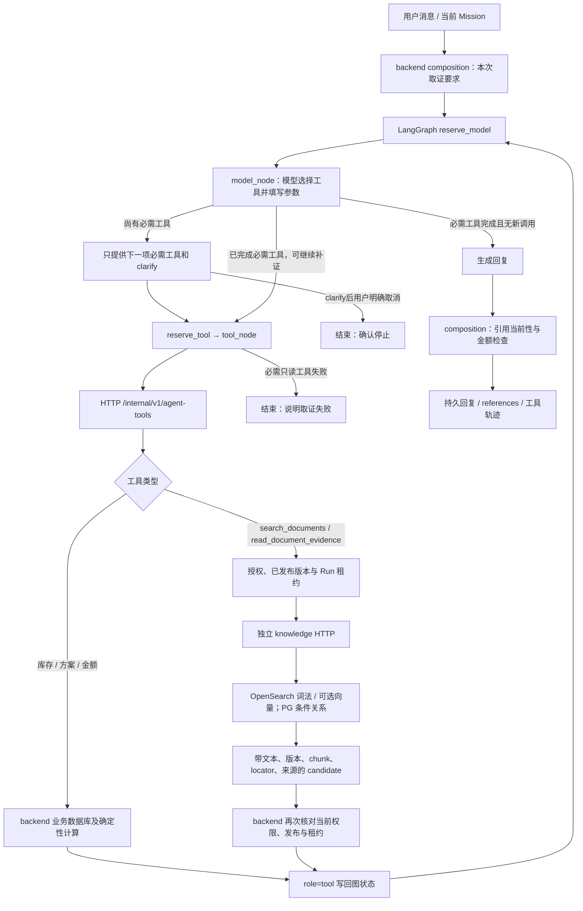

# Agent 文档取证与当前 LangGraph 接入

2026-09-08。已完成隔离Docker服务、200份原件HTTP发布和现有Luna模型的4场景LangGraph联调。下文区分程序约束、实际模型轨迹和仍未完成的质量验收。原始运行报告保留，不把后处理回放伪装成新的模型运行。

## 实际链路

没有新增第二套 Agent，也没有把全部资料塞进系统提示。`agent/src/shopsteward_agent/runtime.py` 的既有五个节点保持不变：`reserve_model`、`model_node`、`reserve_tool`、`tool_node`、`clarify_node`。文档检索接在真实工具调用循环内；检索结果成为下一次模型推理的工具消息。

## 哪个位置决定需要什么信息

| 用户需求 | 回答前的取证顺序 | 后续行为 |
|---|---|---|
| 当前库存、现金 | `get_dashboard` | 使用业务结果，文档不能提供当前值 |
| 当前补货方案 | `get_plan` | 方案及计算仍由业务后台负责 |
| 供应商条款、合同、SOP、商品说明 | `search_documents` | 模型用具体问题和已知实体查询 |
| 当前库存 + 方案 + 条款 | `get_dashboard → get_plan → search_documents` | 分开陈述实时业务事实和资料约束 |
| 展开上一条引用 | `read_document_evidence` | 从已返回的结构化引用取得 chunk ID |
| 条件或对象不明 | `clarify` | 不捏造实体ID或关系成立条件 |
| 明确保存长期偏好 | 既有 `memory_edit` 流程 | 个人记忆与经营文档仍分开 |

`backend/app/agent_bridge/evidence_policy.py` 只识别明确的请求模式。其他表达仍由模型依据工具说明判断；这不是覆盖所有自然语言的意图分类器，不能宣称任意问法都会正确路由。规则、原因和覆盖范围写入输出的 `evidence_policy`，实际执行写入 `required_tools` / `completed_tools`。

`model_node` 复用已有 `required_tools` 机制：当一项要求未完成时，只向模型提供该工具与 `clarify`，设置 `tool_choice=required`。新增检查也拒绝模型调用当前未提供的工具，即使它在全局工具目录中；避免提前执行后续动作。必需只读工具失败不会算作完成，会结束本轮并说明缺少依据；记忆写入仍保持原来的纠正流程。澄清后明确回答“取消/停止”等会直接结束并确认停止（这是成功的停止回执，独立的API取消接口仍使用原CANCELLED状态）。模型调用与工具调用继续受现有8次/12次预算、90秒总deadline约束。

这里仍让模型形成查询参数与判断是否需要追加检索。不能为了凑齐一次调用而发送固定无意义查询；候选相关性、缺失条件和回答质量需要真实用例验证。

## 证据如何回到推理中

`backend/app/agent_bridge/tools.py` 在 `KNOWLEDGE_SERVICE_ENABLED` 开启时注册两个文档工具。`composition.call_tool` 走当前 Run 的短期 Bearer，通过独立HTTP请求调用后台工具网关。`document_evidence.py` 读取当前用户、门店、有效发布版本，结束数据库事务后访问knowledge服务；返回后再次检查授权与Run租约。

返回字段包括文本、`document_id`、`version_id`、`generation_id`、`chunk_id`、`metadata_revision`、`locator`、文本及原件hash、来源与synthetic标志、检索通道和可验证的关系路径。`Runtime.tool_update` 把完整工具结果写入 `messages` 中的 `role=tool`，只把成功工具的引用加入 `references`。模型下一轮才能基于它作答。

此前的聊天历史只传role/content，结构化引用可能丢失。因此 `load_context` 现在还提供最多20个近期文档引用，范围限制为同会话、所属Run输入序号早于当前Run的最近10条助手回复。不能简单要求助手Message.seq早于当前用户输入：用户可能在上一条回复产生前就排队追问。引用只是重新定位的入口；原文展开仍重新授权，旧引用本身不证明当前仍有效。

## 不能靠一次命中绕过的约束

- 服务端候选必须通过当前门店、权限、发布版本及证据修订检查。最终回复前再检查文档引用以及关系路径上每个来源版本和有效期，累计跨轮路径逐条验证，不误套单候选20路径上限；生成过程中被归档或换版的证据不会继续支撑旧结论。
- 明确需要文档但没有有效引用时，后台替换肯定结论为“没有取得有效文档证据”。该检查不等于语义蕴含验证：有引用仍需检查引用是否真正支持结论。
- 文档正文是外部证据，不能授予采购、改记忆或改变工具权限。采购继续走已有用户审批接口。
- PG关系只沿已确认、来源有效、类型和值均匹配的条件边取回，最多3跳。模型不得自行把 `proof_available=true` 当作事实。
- `read_document_evidence` 不要求每次搜索后都调用：候选正文已完整时可直接引用；缺上下文、例外条件或用户明确要求核对时再展开。
- 当前联调用真实词法索引。embedding/rerank关闭；不能据此判断最终embedding模型或vectorDB优劣。
- 模型正文中明确标注为版本或chunk的标识若不在返回引用中，替换为“标识未核实，请以随附资料引用为准”，并记录 `DOCUMENT_INLINE_ID_UNVERIFIED`。不猜测正确ID，也不修改结构化引用。这只检查标识，不验证正文全部含义或标题与引用的一一对应。

调度器原有 `JobResult` 只接受业务/通用artifact引用。`jobs.scheduler_references` 仅把调度回执中的文档引用转成artifact指针；`AgentRun.output` 和助手 `Message.references` 保留完整文档证据。真实事务联调已验证不会因引用schema冲突而回滚。

## 直接查看代码

| 位置 | 作用 |
|---|---|
| [evidence_policy.py](../../backend/app/agent_bridge/evidence_policy.py) | 明确请求的取证要求、最终引用与正文标识校验 |
| [composition.py](../../backend/app/agent_bridge/composition.py) | 接入现有Run、近期引用、模型提示、HTTP工具网关、最终复核 |
| [runtime.py](../../agent/src/shopsteward_agent/runtime.py) | 现有五节点图、按顺序提供工具、role=tool回流、失败/取消结束 |
| [document_evidence.py](../../backend/app/agent_bridge/document_evidence.py) | 授权范围、检索/原文展开、事务外HTTP、返回后重新核验 |
| [jobs.py](../../backend/app/agent_bridge/jobs.py) | 完整回复落库与兼容调度回执 |
| [test_evidence_sequence.py](../../agent/tests/test_evidence_sequence.py) | 受控模型下的顺序、结果回流、越序拒绝和终止行为 |

## 执行记录

专用业务测试库已迁移到 `0011_knowledge_delivery`，schema-check无漂移。投递35项、文档证据30项混合测试通过，其中25项实际PG、40项非PG。独立knowledge服务8020就绪，PG55434为 `knowledge_0002`，OpenSearch3.8.0端口19201为green，实际构建image ID `sha256:4c4130e2f71ccc89ec36ebc20fc7456678835d19ba6b7f492dad8e10e5093ae2`，基础镜像digest见 `var/knowledge-precloud/infra-ready.json`。

200份pilot原件（180合成、20公开）经实际K1上传→outbox→独立worker→OpenSearch READY→backend发布。测试租户为 `knowledge-test-agent-0908020841-STORE01`，使用 `shopsteward_test`。保持knowledge容器运行；独立8018验收API/publisher/Agent进程在脚本结束时关闭，开发8000/8001及开发库未操作。

最终真实运行使用现有 `gpt-5.6-luna`、Responses适配器，共4个Run、10次逻辑模型调用、6次工具调用，embedding调用为0。实际持久化图状态记录如下：

| 场景 | 真实调用顺序 | 每次文档候选数 | 核对结果 |
|---|---|---|---|
| 只查当前库存和现金 | `get_dashboard` | — | 无文档调用；返回测试现金1000元、38个SKU各库存20 |
| 新旧条码供货映射 | `search_documents → search_documents` | 6、6 | 主动追加聚焦查询，取到映射、生效批次和双码追踪条款 |
| 展开上一条引用 | `read_document_evidence` | 4 | 用结构化chunk定位原文；追问在上一条回答完成前入队，仍正确取证 |
| 库存与供应商条款混合判断 | `get_dashboard → search_documents` | 6 | 先读真实库存，再取条款；说明库存没有条码级拆分，不能据此删除旧码 |

文档场景实际query先为 `新旧条码并存 供货映射 交代要求`，再为 `新旧码映射 生效批次 供货附件 完整字段`。真实SKU ID放在 `entity_ids` 过滤。返回原文包括“改码供货必须附新旧码映射与生效批次”和“保留双码映射且按批次追踪”，每块仍带版本、hash和独立locator。这些是模拟流程资料；没有真实采购授权。

可逐条查看：

- [r5真实运行与原始回答](agent-document-integration-20260908-r5.json)。`passed`是工具顺序/运行状态/引用存在性验收，不是语义准确率。
- [实际LangGraph检查点导出的参数与候选](agent-document-trace-20260908-r5.json)。由只读 `export_agent_document_trace.py` 导出，未再次调用模型。
- [正文标识校验回放](agent-document-output-validation-20260908.json)。r5仍有一个错误版本号和一个截短chunk编号，随后新增确定性校验并在四份真实输出上回放；两个错误被标记，结构化引用均不变。回放使用既有权威快照，不声称是一次新的在线授权或模型运行。

过程失败保留在初始/r2/r3报告：最初实体文件名错误；r2暴露装配层与guard接口不一致；r3暴露JobResult不接受文档引用。r4已通过完整事务，但宽泛query主要命中范围段落。之后调整短查询与补检索提示得到r5关键条款；没有改金标或通过人工指定答案提高成绩。

回归：backend非重语料unit+API最终216 passed / 9.51秒，包含正文标识和跨轮累计关系路径回归；独立聚焦批次29 passed（重叠，不相加）；Agent全套30 passed、3 skipped；契约10个delivery路径/10个service路径/2个文档工具OpenAPI验证通过。

当前仍未覆盖：通用自然语言路由准确率、全部300题质量评测、真实dense/embedding/rerank、真实关系边导入及端到端路径、浏览器引用卡片体验、进程故障演练、空环境双库恢复和云区域延迟。`get_plan`混合顺序与失败/取消在受控图测试覆盖，本轮4个真实模型场景没有把这些冒充在线用例。故整体 `pilot_ready=false`、`MVP_ready=false`。
