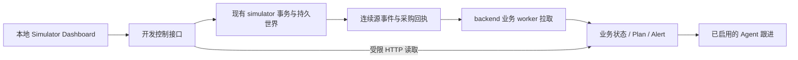

# Simulator 控制台研究与首版建议

日期：2026-09-07。代码基准：`YH / 4389747`（Agent Skelon）。

状态：用户已批准并实施首版持久 SANDBOX 与 Dashboard。以下保留研究时的设计依据；实际交付见 [运行说明](../../simulation/README.md) 和 [测试报告](../reports/simulator-console-test-report.md)。

## 1. 结论与目标

适合建立独立于产品前端的本地 simulator dashboard。复用现有持久世界、源事件、采购回执和幂等机制，增加可配置的场景初始化、手动业务 Trigger 与观察界面。第一阶段使用标注为合成数据的有限场景，真实数据回放随后接入。

可用结果：开发者在浏览器中选择场景，调整初始条件，触发销售、需求调整或到货，查看实际世界变化与事件；联动模式下还能判断 backend 是否同步，并观察其任务、方案及警报。产品前端可独立使用相同场景进行联调。

功能成功标准：业务数值符合明确预期；同键重试不重复生效；无效触发无部分写入；GET不改变世界；刷新或重启后能读取相同场景；backend未同步或未运行时清楚显示状态。记录触发到源事件提交、源事件到后端追平的实际耗时，不预先声称固定时延保证。单纯触发环境事件不应直接调用模型；已启用的Agent跟进可能由现有调度产生模型调用。

核心路径的实际前置：Docker由用户手动启动、PG就绪、simulator迁移与源码匹配。联动backend额外需要其API、业务worker及匹配迁移；观察Agent还需Agent配置及worker。独立模拟器页面无需等待产品前端、RAG或真实预测。

推迟到其消费阶段：长期负载、完整进程故障矩阵、数据集回放、随机需求生成、真实预测及策略收益比较。首版不为这些后续目标建设通用场景编排平台。

## 2. 已核对的代码与现场

- `simulation/simulator/main.py`：FastAPI，5个业务操作及ready；服务Bearer鉴权。
- `simulation/simulator/repository.py`：事务持久化初始化、采购、源事件及四步SC01。
- `simulation/simulator/models.py`：Run、Purchase、EventRow、CommandRecord；Run行锁、连续源序号和命令幂等。
- `simulation/simulator/schemas.py`：SALE_RECORDED、DEMAND_REVISED、GOODS_RECEIVED、PURCHASE_ACCEPTED已有类型化协议。
- `backend/app/operations/jobs.py`：初始化、增量拉取、周期源同步、新鲜度和advance；源事实通过既有同步链路进入业务投影。
- `backend/app/reporting/read_schemas.py`：查询上下文已有source_sequence，可用于显示追平进度。不能把source_sequence当作state_version。
- 原SC01只能按顺序执行到货→销售10→需求改为70→再次到货。采购在独立请求中受理，不是advance的一步。
- 目前没有场景列表、当前世界读取或自由Trigger HTTP入口；不能仅靠页面封装现有advance实现任意场景。

本次用户手动启动Docker Desktop后，既有PostgreSQL容器healthy。simulator开发库迁移为`sim_0002_purchases`，原有8个场景已保留；backend开发库仍为`0006_periodic`，本地Agent开关为false。

已隐藏启动现有simulator，地址`http://127.0.0.1:8001`。ready=200，OpenAPI可读，未授权业务读取=401。没有迁移开发库、覆盖.env或创建开发采购。simulator专用测试库运行结果为12 passed / 2.97s，无失败或跳过。

证据：[simulator-console-research-result.json](../api/simulator-console-research-result.json)。日志：Git忽略的`var/simulator-console-research/`。启动器PID为27724，仅供本次定位，后续应重新验证端口及进程身份。backend及两类worker本轮未启动。

用户运行偏好：今后Docker Desktop始终由用户手动启动；助手只检查和使用已运行的Docker。此前助手启动尝试的失败原因未确定，不能归因为沙箱。

## 3. 外部研究

### FreshRetailNet-50K：后续需求回放候选

[官方数据卡](https://huggingface.co/datasets/Dingdong-Inc/FreshRetailNet-50K)描述了门店商品时间序列、小时缺货状态、促销和天气变量；销量字段经过全局归一化。适合缺货下的需求恢复及预测研究。数据卡标注CC BY 4.0。

针对本项目的判断：这些销量不能直接当作整数件数或货币金额；字段清单不提供完整的本项目采购回执和现金账本。若后续使用，应记录数据版本、抽样范围、归一化到合成件数的映射，以及合成的成本、库存和交期。历史销量受缺货影响，不应直接标成真实潜在需求。当前只研究数据卡，没有下载或导入数据。

### MABIM / ReplenishmentEnv：配置和实验组织参考

[官方仓库](https://github.com/VictorYXL/ReplenishmentEnv)分别组织配置、SKU数据、模拟环境和OR/RL基线，并支持自定义配置建立环境。

针对本项目的判断：可以借鉴参数化场景和固定输入重跑方式；替换ShopSteward模拟内核还需要适配现有审批、受理、应收和事件语义，首版无此必要。本次只核对README，没有安装或采用其代码。

### Dashboard实现

现有FastAPI可以通过[官方StaticFiles机制](https://fastapi.tiangolo.com/tutorial/static-files/)提供静态资源。首版页面采用本地HTML/CSS/JavaScript即可，不需要新增Nuxt工程或等待产品前端。API验收可以复用[FastAPI测试方式](https://fastapi.tiangolo.com/tutorial/testing/)及项目已有HTTPX/真实PostgreSQL测试。

## 4. 方案对比

| 方案 | 收益 | 成本及判断 |
|---|---|---|
| simulation内独立控制台 | 直接复用模拟世界、可独立启动、不占产品前端开发接口 | 推荐；增加小规模开发控制路由和静态页面 |
| 产品前端内增加开发页面 | 可复用产品组件和登录 | 等待前端基础，且开发控制与店主操作需要区分；后续可按需整合 |
| 引入完整库存benchmark | 后续算法对照、批量环境能力较多 | 经营语义适配和依赖较重，不解决当前最小联调缺口 |

## 5. 推荐架构

- 模拟器唯一拥有环境事实，backend唯一拥有业务投影、审批、预留和任务状态。控制台不能直接改backend表。
- 本地页面通过开发控制接口操作；服务token留在服务端，不能嵌入HTML或浏览器持久存储。
- 控制台默认关闭；显式开启且仅绑定loopback。开发控制请求限制Host、Origin和浏览器跨站请求；不允许从页面配置任意代理目标。
- backend联动使用独立配置的用户身份与允许的固定API路径；不是通用代理。业务审批继续由backend精确校验，不因Trigger或Agent自动批准。
- 源世界提交和backend同步是两个时点。页面并列显示源头sequence、backend查询上下文sequence和最后读取时间；不能将两个不同HTTP快照称为原子一致快照。
- 原SC01固定剧本保留兼容。新增SANDBOX场景用于手动Trigger，避免任意触发后仍把结果称为原SC01基准。

## 6. 首版场景与Trigger

初始化参数建议限定为：初始现金、现货、剩余需求、采购单价、MOQ、包装量、交期和活动时长。初始在途保持0，因为在途必须来自实际已受理订单。现金底线与候选数量是backend的Mission策略，不伪装成环境事实。

| 模板/操作 | 输入及前置 | 明确效果 |
|---|---|---|
| SC01基准 | 使用原默认值和四步剧本 | 原验收继续可复现 |
| 常规补货 | 默认SANDBOX初始值 | 生成独立store/run，准备手动操作 |
| 低现金 | 创建时减少现金 | 联动backend后观察现金约束下方案 |
| 库存充足 | 创建时增加现货 | 观察无需采购或采购量下降 |
| 销售 | 正整数数量、正整数分单价；库存足够 | 现货减少、应收增加、剩余需求下限为0；现金不变 |
| 需求调整 | 新的非负剩余需求 | 生成新需求事件与有效预测期限；不修改现金/库存 |
| 部分到货 | 选择本run已受理且未收完的订单，数量不超未收量 | 现货增加、在途减少；不重复扣现金 |
| 全部到货 | 选择本run未收完的已受理订单 | 收取实际剩余数量，不硬编码40/20 |

到货时模拟时间可按既有机制推进到订单ETA，但页面要明确展示这一行为。源数据过期依赖真实同步时间；不通过改动模拟时间冒充真实来源中断。

每次Trigger带Idempotency-Key，并在run行锁内同时提交状态、事件、命令响应。响应给出本次生成的序号范围。请求失败时不保留部分业务效果；响应丢失时以原键重试。收货订单必须校验所属run。

首版不提供自由JSON注入、任意SQL、无来源现金修改、伪造采购、数据删除或重置旧run。重新演示通过新建独立run完成。拒绝审批、暂停任务属于backend用户操作；网络故障属于进程测试，分别使用对应入口。

## 7. 页面布局与操作

1. 顶部：服务状态、合成数据标记、独立/联动模式、刷新及创建场景。
2. 左侧：场景模板、已有run列表、初始参数；展示store/run标识供前端联调。
3. 主区：现金、应收、现货、在途和需求卡片，模拟时间与活动范围。
4. 操作区：销售、需求上调/下调、部分/全部到货；提交前显示数量及预期影响。订单不足时给出具体前置，不显示虚假成功。
5. 事件区：按sequence显示来源事件、载荷、真实发生时间和模拟时间；支持分页读取。
6. 联动观察区：backend状态、同步进度、Mission/Plan/Alert；未导入或worker离线时保持可见，说明下一步。

独立模式可先运行；联动模式通过backend开发初始化入口创建场景，再使用同一run触发事件。不能先在模拟器任意创建run，再假定backend会自动发现它。

## 8. 实施与验证顺序

1. 确认本首版范围。确定SANDBOX初始化DTO及Trigger DTO、错误语义，明确兼容原SC01。
2. 扩展simulator配置与持久场景元信息，增加当前世界/订单/事件读取及Trigger事务；如需迁移，使用增量迁移保留旧run。
3. 构建独立本地控制台及配置说明。优先交付创建→触发→观察的完整路径。
4. 联动backend：扩展开发初始化参数转发，复用现有worker、事件和业务查询；不新增另一套同步机制。
5. 真实PG验证同键并发、跨run订单拒绝、超卖/超收回滚、部分到货及重启持久性；保留原12项SC01回归。
6. 浏览器实际操作验证，以及真实HTTP触发→backend追平的精确数值检查。Agent效果验证在有配置和已开启跟进的独立场景进行，不能以规则测试代替真实模型结论。
7. 更新runtime契约、README、PROJECT_CONTEXT与HANDOVER，记录启动命令、实际测试和未覆盖项。

下一份实施计划应从以上首版范围出发；本研究不将完整故障平台、RAG、真实预测、多SKU优化或自动学习纳入本轮。
