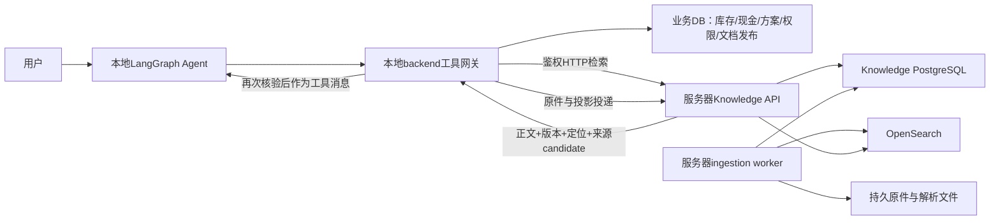
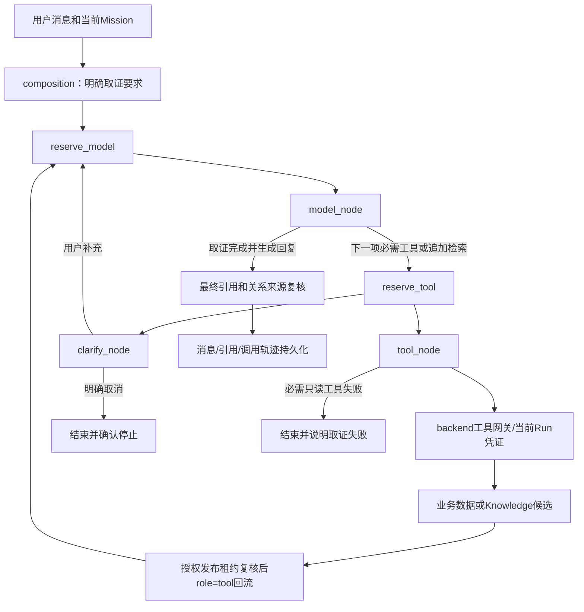

# Knowledge 服务器交接与部署完整手册

更新：2026-09-08。本文整合部署边界、配置、启动、入库、LangGraph接入、测试、恢复、运维和选型说明。服务器负责人可以按本文完成准备与试部署，无需先阅读其他说明文档；末尾链接仅用于源码、原始证据和进一步审查。实际操作仍需仓库中的代码、Compose、依赖锁和语料文件。

**当前结论：可以开展隔离云端试部署，完整搬迁验收尚未通过。`pilot_ready=false`、`MVP_ready=false`。** 本文中“已验证”指已完成的本地隔离运行；Linux/云端命令是根据当前代码整理的操作步骤，尚未在目标服务器执行。没有选定云厂商、区域、正式机器规格或最终embedding模型。

代码已提交并推送，交接PR为 [#10](https://github.com/yhnapoleon/ShopSteward/pull/10)，源分支YH，目标main。功能提交 `96ee2a0`，与当时main同步的提交 `2406371`；接收时记录实际使用的完整commit SHA，不能把本文里的旧SHA当作永远最新。

## 目录

1. [系统范围与数据流](#1-系统范围与数据流)
2. [已有成果和剩余验收](#2-已有成果和剩余验收)
3. [接收代码与环境准备](#3-接收代码与环境准备)
4. [完整配置说明](#4-完整配置说明)
5. [服务器构建迁移与启动](#5-服务器构建迁移与启动)
6. [本地backend和Agent接通服务器](#6-本地backend和agent接通服务器)
7. [语料映射上传索引与发布](#7-语料映射上传索引与发布)
8. [关系导入与LangGraph取证](#8-关系导入与langgraph取证)
9. [验收与性能测试](#9-验收与性能测试)
10. [数据搬迁备份与恢复](#10-数据搬迁备份与恢复)
11. [运维升级回退与排障](#11-运维升级回退与排障)
12. [数据库embedding和区域选型](#12-数据库embedding和区域选型)
13. [分工交付与回填模板](#13-分工交付与回填模板)
14. [源码与原始证据索引](#14-源码与原始证据索引)

## 1. 系统范围与数据流

第一阶段上服务器的是Knowledge API、ingestion worker、独立PostgreSQL、OpenSearch和知识服务持久卷。业务backend、业务DB、文档管理与原件权威、发布控制和LangGraph Agent仍在现有环境。服务器Knowledge数据库属于派生数据存储，不能代替业务数据库。



数据分工：

| 数据 | 权威或存放位置 | Agent如何使用 |
|---|---|---|
| 库存、现金、在途、订单、方案、审批 | 原业务backend/DB | 业务工具与确定性计算，不进入RAG作为实时值 |
| 文档原件、权限、版本、发布指针 | backend原件存储与业务DB | backend授权后取证 |
| 解析块、父段落、派生原件、索引任务 | 独立Knowledge PG/持久卷 | 由Knowledge服务检索并返回 |
| 条款、SOP、商品说明、供货附件、复盘 | 受控文档索引 | search_documents / read_document_evidence |
| 有来源的商品/供应商/条件关系 | 当前使用Knowledge PG有向关系 | 按已确认条件、有界路径取证，不推导采购许可 |
| 个人偏好、长期记忆 | 既有Agent USER/NOTES/SKILL | 保留原记忆流程，不改为经营文档库 |

Agent不直连PG/OpenSearch，不获得Knowledge service key。文档正文是证据，不是能改变系统规则、工具权限或采购审批的指令。

## 2. 已有成果和剩余验收

### 2.1 已取得的本地证据

- 独立Docker项目包含API、worker、PG、OpenSearch。PG 17.11、OpenSearch 3.8.0；Knowledge迁移 `knowledge_0002`，业务专用测试库迁移 `0011_knowledge_delivery`，schema检查通过。
- API live/ready返回200，OpenSearch green，worker运行；API以UID/GID 10001运行，持久卷可写，根文件系统只读。
- 200份pilot原件经真实K1上传、outbox、worker、索引和发布。200成功任务/READY generations，声明、PG、OpenSearch均为5169块，无数量不一致。
- 现有Luna Responses完成4个真实Run、10次逻辑模型调用、6次工具调用：业务查询、文档补搜、提前排队引用展开、库存与条款混合。确实取到新旧码映射、生效批次和双码追踪原文；embedding/rerank关闭。
- 提交前backend unit/API含语料254 passed；knowledge323 passed/15 skipped；Agent30 passed/3 skipped。同步main后backend非重语料216 passed。之前另有25项实际PG边界测试通过。不同批次有交集，不能累加为一个总数。
- 代码Ruff和契约校验通过。提交时1657个语料文件逐字节核对，pilot200/full1124原件大小与hash通过；`.gitattributes`对扩展语料保留原始字节。
- 前端API契约检查通过；本机未安装最新main新增的ECharts，附加typecheck未通过。前端与当时main相同，未把此检查记为通过。只部署Knowledge镜像不需要Node或前端依赖。

### 2.2 语料与质量范围

本轮验收基线为pilot200（180合成、20公开）；全量924逻辑文档、1124版本（含额外修订）、300题（100 dev/200 test）。公开资料纳入量24，达到100份公开目标仍差76份，并待人工审阅。来源采集目录可能含候选、排除项和存档，不能把目录文件数当作已纳入文档数。

全量实际解析1124版本全部COMPLETE，共16205块、1878743字符，18.710秒wall、18.219秒CPU，解析进程峰值working set123805696字节。这不包含索引、数据库和worker内存，不是服务器容量测量。800条合成关系只完成离线唯一原文绑定，真实关系导入与端到端路径尚未验收。扫描件OCR尚未实施；必须保留PARTIAL/OCR_REQUIRED/UNSUPPORTED等实际解析结果。

### 2.3 尚未通过的门槛

| 检查 | 当前证据 | 下一步 |
|---|---|---|
| corpus_200 | 本地真实HTTP入库发布通过 | 云端重新核对资料、发布和块数 |
| real_http | 本地真实检索通过 | 本地backend到云API的真实链路 |
| agent_tools | 本地4场景通过 | 跨机器复验及引用核对 |
| build | 本地镜像构建通过 | 目标架构构建/启动与digest记录 |
| versioning | 部分PG边界有测试，完整主动演练未执行 | 换版/归档/失败发布/租约/重启 |
| restore | 未执行，且存在第10节schema阻塞 | 修复兼容性后做空目标恢复与查询对比 |

`ready_for_cloud_pilot`要求这六个键均为字符串 `passed`。缺项、跳过或not_run不算通过。模型质量、云延迟与成本另行记录；MVP还需要资料目标、人工/保留集评测等证据。

## 3. 接收代码与环境准备

### 3.1 固定版本与资产

在服务器的一份新目录接收代码。以下命令不改变已有checkout：

```bash
git clone https://github.com/yhnapoleon/ShopSteward.git
cd ShopSteward
git fetch origin YH
git switch --detach origin/YH
git rev-parse HEAD
```

部署双方把输出SHA记入交付记录；若PR已合并，改为双方约定的main提交。不要使用本机绝对路径 `D:/...`，也不要依赖IH/RAilG的源码目录或凭据。

必须具备的仓库内容：根 `pyproject.toml`、`uv.lock`、`.dockerignore`、`.gitattributes`；各workspace的 `pyproject.toml`；`knowledge/`；`infra/compose.knowledge.yaml`；backend新增模块/迁移/tools；Agent代码；`docs/api/`契约；`docs/evaluation/knowledge-expanded/`的manifest、实体、原件、关系和dev查询。

Git不会复制数据库、Docker卷、`.env`、密钥、`var/`中的映射/发布收据。报告中本机 `var/...` 只是证据位置。新数据库需要新映射/收据，不能复用旧数据库生成的UUID。

### 3.2 依赖与主机检查

- 仅运行四个容器：需要可用Docker Engine和Compose插件、Git、访问镜像仓库的网络、可持久化磁盘；镜像内部使用Python 3.12和uv锁定依赖。
- 执行宿主机Python工具：还需Python/uv及仓库虚拟环境；恢复另外需要兼容PG大版本的 `pg_dump` / `pg_restore`。
- 本阶段embedding通过可选HTTP模型接口，未要求本地GPU。正式CPU/RAM/磁盘规格未经过容量验收；不要把512MiB的OpenSearch JVM heap当作整套服务内存上限。
- 核对目标CPU架构与镜像支持、磁盘空间、端口占用、系统时间/NTP、DNS、出站代理。证据有效期依赖时间正确。

Linux检查示例：

```bash
docker version
docker compose version
uname -m
df -h
free -h
ss -ltn
sysctl vm.max_map_count
```

Linux的 `vm.max_map_count` 应至少262144；不足时由主机管理员调整，并确认重启后配置仍有效。该要求来自[OpenSearch Docker官方说明](https://docs.opensearch.org/latest/install-and-configure/install-opensearch/docker/)。不要为了本文演练随意改动共享主机的全局参数。

### 3.3 两种操作路径

- **服务器新部署：** 第4—5节用显式Compose命令，独立项目名 `shopsteward-knowledge-cloud-pilot`。
- **已有Windows本地演练：** 使用 `infra/knowledge_local.py`，项目为 `shopsteward-knowledge-precloud`。helper使用自有容器收据，不能与手工Compose混用管理同一项目。

每一步出现非零退出码应先排障，不能继续声称迁移/启动完成。本文没有执行任何目标服务器命令。

## 4. 完整配置说明

### 4.1 私有文件与Compose字段

Linux服务器在仓库根目录执行：

```bash
umask 077
mkdir -p var/knowledge-cloud-pilot
cp -n knowledge/.env.example var/knowledge-cloud-pilot/private.env
chmod 600 var/knowledge-cloud-pilot/private.env
```

`cp -n`保留已有配置；接下来用私有编辑器/密钥管理方式填写模板，不把完整env打印到日志。服务key与PG密码使用独立随机值，密码采用URL安全字符 `A-Z a-z 0-9 _ -`。模板占位值不可用于运行。

| 字段 | 首次试部署值或含义 |
|---|---|
| KNOWLEDGE_SERVICE_KEY | 私有随机服务key；与本地backend一致 |
| KNOWLEDGE_POSTGRES_PASSWORD | 独立PG私有密码 |
| KNOWLEDGE_POSTGRES_DB | `shopsteward_knowledge_test`；独立派生测试库 |
| KNOWLEDGE_API_PORT | `8020`，仅服务器127.0.0.1 |
| KNOWLEDGE_POSTGRES_PORT | `55434`，仅服务器127.0.0.1 |
| KNOWLEDGE_OPENSEARCH_PORT | `19201`，仅服务器127.0.0.1 |
| KNOWLEDGE_INDEX_PREFIX | `shopsteward-knowledge-cloud-pilot`，每个环境独立 |
| KNOWLEDGE_IMAGE | `shopsteward-knowledge:cloud-pilot`，目标机本地镜像名 |
| KNOWLEDGE_POSTGRES_IMAGE | 初始 `postgres:17-bookworm`，实拉后记录并固定digest |
| KNOWLEDGE_OPENSEARCH_IMAGE | 初始 `opensearchproject/opensearch:3.8.0` |
| KNOWLEDGE_PYTHON_IMAGE | 初始 `python:3.12-slim-trixie` |
| KNOWLEDGE_UV_IMAGE | 初始 `ghcr.io/astral-sh/uv:0.12.10` |
| KNOWLEDGE_DATABASE_URL | 宿主进程用；Compose自行构造 `postgres:5432` 的内部连接，不读取模板空值作为容器连接 |
| KNOWLEDGE_OPENSEARCH_URL | 宿主进程用；Compose容器固定内部 `http://opensearch:9200` |
| KNOWLEDGE_STORAGE_ROOT | 宿主进程用；Compose容器固定 `/data/knowledge` |

Compose中API、worker、migrate共用镜像、连接、key和数据卷；API/worker配置应保持一致。改用托管PG/索引或对象存储时，需要修改部署装配/存储适配，不能认为修改模板中的宿主URL就会覆盖Compose内部地址。

持久卷为 `knowledge-pg`（PG数据）、`knowledge-search`（索引）、`knowledge-data`（原件和解析产物），实际卷名带Compose项目名前缀。运行用户10001，根文件系统只读，`/tmp`为tmpfs。部署前检查挂载卷权限；不要通过给整个服务提权规避文件权限问题。

### 4.2 可选模型字段

首轮全部保持未配置，使用 `lexical-v1`。Compose入口会删除空的embedding/rerank变量；直接宿主进程应避免遗留另一套环境的模型配置。

| 字段 | 含义/默认 |
|---|---|
| KNOWLEDGE_EMBEDDING_URL | 完整HTTP embedding端点；适配器直接POST，不自动追加 `/embeddings` |
| KNOWLEDGE_EMBEDDING_API_KEY | 提供方私有key |
| KNOWLEDGE_EMBEDDING_MODEL | 提供方模型ID |
| KNOWLEDGE_EMBEDDING_DIMENSIONS | 明确向量维度 |
| KNOWLEDGE_EMBEDDING_PROVIDER | `http-openai-compatible`，profile来源标识 |
| KNOWLEDGE_EMBEDDING_REVISION | 可选模型修订标识 |
| KNOWLEDGE_EMBEDDING_QUERY_INSTRUCTION | query前缀指令，与document指令分开 |
| KNOWLEDGE_EMBEDDING_DOCUMENT_INSTRUCTION | document前缀指令 |
| KNOWLEDGE_EMBEDDING_NORMALIZE | 默认true |
| KNOWLEDGE_EMBEDDING_MAX_INPUT_CHARS | 默认12000；字符预算不是生成模型tokens实测 |
| KNOWLEDGE_EMBEDDING_DEADLINE_MS | 默认8000 |
| KNOWLEDGE_RERANK_URL / API_KEY / MODEL | 三项齐全才启用重排；URL为实际调用端点 |

Embedding的URL/key/model/dimensions必须完整，缺一会配置失败。提供方协议必须兼容当前请求/响应；当前请求包含model、dimensions、input，query/document指令由适配器加到文本前。换提供方并非都能只改模型名。

Knowledge运行参数还包括lease_seconds=120、max_attempts=5、max_total_attempts=15、poll_seconds=1、max_upload_bytes=20MiB。这些是Settings字段；当前Compose未逐一映射到私有env，需要调整时显式修改部署environment并验证。没有通用自动费用封顶开关：配置模型并请求hybrid可能实际计费。实验预算由第12节执行流程控制。

## 5. 服务器构建迁移与启动

### 5.1 固定本次项目参数

以下代码块均为 **Linux Bash，仓库根目录，同一终端会话**。续行使用反斜杠，不要复制到PowerShell直接执行。

```bash
SS_ENV="$PWD/var/knowledge-cloud-pilot/private.env"
SS_PROJECT="shopsteward-knowledge-cloud-pilot"
SS_COMPOSE=(--project-name "$SS_PROJECT" --env-file "$SS_ENV" --file infra/compose.knowledge.yaml)
docker compose "${SS_COMPOSE[@]}" config --quiet
docker compose "${SS_COMPOSE[@]}" ps -a
```

首次部署应为空项目，且第3节的端口未占用。若已存在项目或卷，先确认其身份与是否续作；不要删除已有卷强行满足“新环境”。不要把当前服务器项目交给本地helper接管。

### 5.2 构建和迁移

```bash
docker compose "${SS_COMPOSE[@]}" pull postgres opensearch
docker compose "${SS_COMPOSE[@]}" build --pull api
docker compose "${SS_COMPOSE[@]}" up -d --wait postgres opensearch
docker compose "${SS_COMPOSE[@]}" --profile maintenance run --rm migrate
docker compose "${SS_COMPOSE[@]}" up -d --no-build --wait api worker
```

迁移是显式维护步骤，API/worker不自动迁移。migrate执行 `python -m alembic -c /app/knowledge/alembic.ini upgrade head`，只改变此Knowledge PG，不会升级业务backend库。预期Knowledge schema为 `knowledge_0002`。

镜像从仓库根构建，使用 `uv sync --locked --package shopsteward-knowledge --no-dev --no-editable --extra service --extra parsers --extra opensearch`。没有把测试语料、gold、私有env、var、IH或本机venv打入运行镜像；资料应通过正常上传投递进入服务。

### 5.3 健康与镜像记录

```bash
docker compose "${SS_COMPOSE[@]}" ps
curl --fail http://127.0.0.1:8020/health/live
curl --fail http://127.0.0.1:8020/health/ready
curl --fail http://127.0.0.1:19201/_cluster/health
docker compose "${SS_COMPOSE[@]}" exec -T postgres psql -U knowledge -d shopsteward_knowledge_test -c 'SELECT version_num FROM alembic_version;'
docker compose "${SS_COMPOSE[@]}" images
docker image inspect shopsteward-knowledge:cloud-pilot --format '{{.Id}}'
docker image inspect postgres:17-bookworm --format '{{json .RepoDigests}}'
docker image inspect opensearchproject/opensearch:3.8.0 --format '{{json .RepoDigests}}'
```

如果修改了DB名/端口/镜像名，上述查询也要一致修改。API live/ready预期均200，ready会核对数据库schema/索引和服务配置。worker没有Compose healthcheck，单看running不能证明任务处理成功，后续以真实任务闭环验收。

初次按tag构建得到的是目标机候选版本。发布前记录Python/uv/PG/OpenSearch的实际RepoDigest、uv.lock hash、应用image ID；将实际拉取的 `image@sha256:...` 写回私有配置中的四个镜像字段，再重建并启动核对。应用本地image ID不是远端registry digest；需要跨机复用时通过 `docker image save/load` 或经授权的registry发布取得对应镜像，不能填造digest。

已有本地应用image ID为 `sha256:4c4130e2f71ccc89ec36ebc20fc7456678835d19ba6b7f492dad8e10e5093ae2`，它没有随Git推送，目标机不一定得到相同ID。原本地基础镜像记录在私有工作目录，不依赖其存在才能重新构建。

### 5.4 Windows本地helper路径

在Windows仓库根目录，Python环境已准备、私有配置位于 `var/knowledge-precloud/private.env` 时：

```powershell
./.venv/Scripts/python.exe infra/knowledge_local.py check
./.venv/Scripts/python.exe infra/knowledge_local.py build
./.venv/Scripts/python.exe infra/knowledge_local.py migrate
./.venv/Scripts/python.exe infra/knowledge_local.py start
./.venv/Scripts/python.exe infra/knowledge_local.py status
```

helper从不启动Docker Desktop、不终止端口占用者、不启动业务backend。它验证配置，拒绝模板密钥、重复键、变量展开和非test库名；收据在 `var/knowledge-precloud/<project>.json`，记录的PID是Docker VM PID。build会解析依赖digest并固定后续命令的引用；start拒绝接管无自身收据的容器。不要丢弃收据或混用手工Compose管理同一项目。已有服务占用端口时check失败是预期，不应据此停止未知进程。

## 6. 本地backend和Agent接通服务器

### 6.1 网络入口

当前Compose只绑定服务器loopback，OpenSearch安全插件关闭，不能把三个端口直接开放到公网。第一轮可保持数据库/索引内部可达，通过SSH隧道只接入Knowledge API。下面在 **Agent所在电脑** 运行，替换用户名和服务器地址：

```bash
ssh -N -o ExitOnForwardFailure=yes -L 127.0.0.1:18020:127.0.0.1:8020 deploy@SERVER_HOST
```

保持该会话存活。本地 `http://127.0.0.1:18020/health/ready` 应返回200；18020特意避开本机旧Knowledge8020。此路由的正确性还要结合服务器日志、独立index prefix和导入后的任务/块数核对，不能误测到原本机服务。

长期入口由服务器负责人落地私有网络或有TLS、鉴权的反向代理；保留service Bearer鉴权。若增加反向代理，上传大小和超时应匹配20MiB原件限制及实际摄取耗时。本文未交付已验证的域名、证书或代理配置。

### 6.2 本地应用配置

业务backend配置示意，密钥由双方私下配置：

```dotenv
APP_ENV=test
DATABASE_URL=<本机独立shopsteward_test的postgresql+asyncpg连接>
KNOWLEDGE_STORAGE_ROOT=<本机独立验收原件目录的绝对路径>
KNOWLEDGE_SERVICE_ENABLED=true
KNOWLEDGE_SERVICE_URL=http://127.0.0.1:18020
KNOWLEDGE_SERVICE_KEY=<与服务器相同的私有key>
KNOWLEDGE_RETRIEVAL_PROFILE=lexical-v1
AGENT_ENABLED=true
AGENT_BACKEND_URL=http://127.0.0.1:8018
AGENT_BASE_URL=<现有生成模型API地址>
AGENT_MODEL=<现有生成模型ID>
AGENT_API_MODE=<responses或chat_completions>
AGENT_API_KEY_FILE=<本机生成模型密钥文件绝对路径>
```

还需 `AUTH_TOKENS`：为本轮用户token配置principal_id、kind=user、operator角色和测试store_ids；需要Agent采购审批演示时再使用合适的审批身份，检索不授予审批权限。`KNOWLEDGE_IMPORT_TOKEN`是该用户token，不是Knowledge service key。

backend/publisher/Agent进程要使用相同测试库、key、URL和业务授权；配置变更后通过各自进程管理器重新加载。只重启Knowledge API不会更新本地backend持有的配置。不要把 `AGENT_BACKEND_URL` 改为Knowledge地址。

### 6.3 测试库和进程

以下均在本机独立验收环境执行。新Python环境从仓库根用 `uv sync --locked --all-packages --all-extras` 安装workspace依赖；不要用这一步随意替换正在运行的开发环境依赖。

先创建空的 `shopsteward_test` 并通过私有环境变量指定连接。进入backend后，显式迁移检查：

```bash
../.venv/bin/python -m alembic upgrade head
../.venv/bin/python -m alembic current
../.venv/bin/python -m alembic check
```

Windows把 `../.venv/bin/python` 换为 `../.venv/Scripts/python.exe`。这些命令使用 `DATABASE_URL`，务必确认指向shopsteward_test；预期 `0011_knowledge_delivery`。已有 `tests/integration/test_knowledge_runner.py` 会读取本机backend/.env并派生测试库，但它不是新服务器自动配置工具。

在backend目录分别启动三个进程，采用上面的同一组私有配置：

```bash
../.venv/bin/python -m uvicorn app.main:app --host 127.0.0.1 --port 8018 --no-access-log
../.venv/bin/python -m app.knowledge.publisher
../.venv/bin/python -m app.worker --profile agent
```

三条命令分别在独立终端或服务管理器中运行，第一条不会退出后自动执行后两条。publisher负责本地outbox→服务器投递，服务器worker负责解析索引，本地Agent worker负责LangGraph Run；三者不能相互替代。仅做库存/条款取证不需要启动采购执行流程。

backend知识HTTP请求上限8秒，Agent工具10秒、单模型调用30秒、每Run最多8个模型轮次/12个工具/90秒执行窗口。跨机器延迟必须实测，不能只检查容器内部健康。澄清等待不计执行时间，进程停机计入。

## 7. 语料映射上传索引与发布

### 7.1 文件和身份

仓库根以下路径：

- `docs/evaluation/knowledge-expanded/manifests/pilot.json`：200份首次联调资料。
- `docs/evaluation/knowledge-expanded/manifests/full.json`：本轮全量版本清单。
- `docs/evaluation/knowledge-expanded/entities-fixture.json`：测试门店/SKU/供应商定义，文件名不是entities.json。
- `docs/evaluation/knowledge-expanded/relations.jsonl`：有原文来源的合成关系。
- `docs/evaluation/knowledge-expanded/queries-dev.jsonl`：100条dev输入；题集gold不进入检索服务。

manifest内 `original_path` 相对扩展语料根，按实际文件大小和SHA256核对。未获读取权限、已归档、过期或未发布资料不能因索引命中而成为有效引用。公开资料也显式映射到测试店铺，不赋予跨店权限。

### 7.2 准备和校验映射

以下为 **本机Bash，仓库根目录**，Python环境见第6节。Windows可把Python路径替换为 `.venv/Scripts/python.exe` 并把整条命令放在一行。

```bash
.venv/bin/python backend/tools/import_knowledge_corpus.py \
  --target-test --manifest docs/evaluation/knowledge-expanded/manifests/pilot.json \
  --entities docs/evaluation/knowledge-expanded/entities-fixture.json \
  --mapping var/cloud-pilot/mapping.json --namespace cloud-pilot01 \
  --prepare-mapping --dry-run
```

这一步不写DB，预期validated_original_versions=200、business_writes=0。namespace使用1—24位小写字母/数字/连字符，换独立环境应换namespace和输出目录。同一mapping路径已属于其他namespace/实体时会拒绝覆盖。

### 7.3 Seed与上传发布

先通过进程环境设置 `TEST_DATABASE_URL` 指向本机 **shopsteward_test**；设置 `KNOWLEDGE_IMPORT_TOKEN` 为该测试API接受的用户token，其store_ids须覆盖mapping中的门店。可在离线mapping生成后据此配置token并启动/重载测试backend。

```bash
.venv/bin/python backend/tools/import_knowledge_corpus.py \
  --target-test --manifest docs/evaluation/knowledge-expanded/manifests/pilot.json \
  --entities docs/evaluation/knowledge-expanded/entities-fixture.json \
  --mapping var/cloud-pilot/mapping.json --namespace cloud-pilot01 \
  --seed-test --base-url http://127.0.0.1:8018 \
  --receipts var/cloud-pilot/import-receipts.json --publish
```

**这条命令会创建测试业务实体，并立即进行真实HTTP上传、索引等待和发布，不是只seed。** seed复用现有operations初始化，不从文档猜测业务库存；目标严格限制本地shopsteward_test。如果已有正确seeded mapping，可省略entities/namespace/seed-test，用同一manifest/mapping/receipts重跑上传续传。

真实过程为：原件上传 → backend outbox → publisher投递 → 服务器worker解析 → PG保存块/manifest → OpenSearch可见性与数量核验 → READY → backend通过HTTP复核READY证明 → CAS发布。结果中的failures应为空；不能只看uploaded_versions=200就认为全部发布成功，要核对publication收据和实际索引。

本机后端通过18020隧道访问服务器，导入器只连接8018，因此上述普通导入可以用于跨机链路。原件最大20MiB。保留mapping、receipts、namespace、输入hash、index profile和应用版本；失败后使用同一原件与收据续传，不手改状态或伪造generation。

### 7.4 版本、重试和发布规则

- 文档编辑CAS版本与证据修订分开；追加原件保留旧发布。
- 权限、实体等证据metadata变化须新generation和显式重新发布，不能让旧索引悄悄沿用新权限。
- 重试创建新generation，旧租约和乱序回执不能覆盖新结果。只有有完整可搜索manifest证明的READY才能发布。
- 发布使用expected_publication_revision；重复操作依靠幂等收据，409时重新读当前版本并核对意图。
- 未来/有界替换保留旧版本未覆盖的有效区间。回退也走正常发布控制，不直接改表。
- 用户API以 `/api/v1/documents/{document_id}/versions/{version_id}/index-jobs` 请求索引，以 `/api/v1/documents/{document_id}/index-jobs/{request_id}` 查进度，以该路径下 `/retry` 重试，以 `/api/v1/documents/{document_id}/publications` 发布。工具已封装payload、幂等和CAS，不建议手拼状态。

## 8. 关系导入与LangGraph取证

### 8.1 关系的作用与限制

当前采用PG有来源的有向关系，最多3跳。边必须confirmed、有对应原文chunk、当前version/generation/revision，条件原子类型和值均匹配。`true`不能当作数字1；模型不能为了命中而编造 `proof_available=true`。返回known_paths_only与truncated信息，不声称完整影响范围或自动替代许可。

合成导入器只接收已有关系断言schema，重新解析上传后的真实version ID，要求唯一完整原文quote，核对当前发布以及文本/hash/locator，再提交关系。公开资料的关系声明需要另行审阅，不通过本工具自动确认。

### 8.2 现有工具的固定端口

关系导入器、benchmark和C3 verifier严格要求backend `http://127.0.0.1:8018`、Knowledge `http://127.0.0.1:8020`，包括HTTP scheme和端口。不能把第6节的18020直接传给这些工具。自动Agent联调脚本也固定8020。

要在不改代码的情况下用这些脚本测云端，应在一台 **本地8020空闲的独立验收电脑/环境** 上，将第6节隧道改为：

```bash
ssh -N -o ExitOnForwardFailure=yes -L 127.0.0.1:8020:127.0.0.1:8020 deploy@SERVER_HOST
```

并将测试backend的KNOWLEDGE_SERVICE_URL设为本地8020后重启相关自有进程。若本机已有旧Knowledge服务，先确认所有权并通过其原启动器停止本次测试服务，保留卷；不能直接杀占用者。否则只做18020的普通导入/人工Agent复验，等远端端点支持作为单独改动验证，不能声称这些固定端口脚本已测到云。

固定端口环境中，设置用户token和Knowledge service key，仓库根执行：

```bash
.venv/bin/python backend/tools/import_knowledge_relations.py \
  --target-test --manifest docs/evaluation/knowledge-expanded/manifests/pilot.json \
  --mapping var/cloud-pilot/mapping.json \
  --receipts var/cloud-pilot/import-receipts.json \
  --output var/cloud-pilot/relation-import.json
```

加 `--dry-run` 仅做离线原文绑定，不导入关系；真实运行需seeded mapping、当前发布收据和 `index_profile_id`。旧收据缺此字段时通过普通导入器刷新。同边ID确定性生成，丢失响应后的重试不会自动增添重复边。`store_fixture`、`scenario_id`等已写入断言的条件必须由relation_context提供，不能随意删去以扩大命中。

### 8.3 当前图的实际接入



五个既有节点保留，没有新增第二套Agent。明确库存/现金要求get_dashboard，当前方案要求get_plan，文档条款要求search_documents，引用展开要求read_document_evidence；混合请求先业务后文档。个人记忆写入保留原流程。规则仅覆盖明确表达，不是通用自然语言分类器。

未完成必需工具时，model_node只提供该工具及clarify，强制工具选择，并拒绝模型调用当步未提供的工具。query应为简短主题/动作，实体ID放entity_ids；只命中范围段落时，模型应在预算内追加聚焦检索。已有候选足够时无需重复读同一chunk。

候选包含正文、document/version/generation/chunk ID、metadata_revision、locator（页/段/表格单元格）、文本/原件hash、来源/synthetic标记、检索通道和关系路径。完整结果写回图的role=tool消息，成功引用被累积。backend返回前与生成最终答案前都复核当前权限与发布；最终逐条检查累计关系路径，不能误套单候选20路径上限。

近期引用最多20个，来自同会话最近10条、所属Run早于当前输入的助手回复。这样用户在上一条回答完成前排队追问也能展开引用。旧引用只是定位入口，重新展开仍须授权。

无有效文档依据时不输出肯定条款结论。正文中明确标为版本/chunk却不匹配结构化引用的标识会标记为未核实；不猜正确ID，不改原结构化引用。这不是语义蕴含或全部引用配对证明。调度回执仅保留兼容的artifact指针，AgentRun.output和Message.references保留完整文档引用。

## 9. 验收与性能测试

### 9.1 先复验四个真实场景

在测试Mission会话发送下表问题，用mapping内的实际SKU017/SKU018 ID替换简称，不能把fixture简称直接猜成业务ID：

| 场景 | 输入要点 | 应检查的实际轨迹 |
|---|---|---|
| 纯业务 | 不用查文档，只查当前库存和现金 | get_dashboard，无文档调用；数值来自本次工具 |
| 条款 | 新旧条码并存，供货映射怎样交代才完整 | search_documents，必要时补搜；找到映射、生效批次、双码追踪原文 |
| 引用追问 | 请展开上一条引用，核对原文条件 | read_document_evidence，定位到真实块；另测提前排队 |
| 混合 | 结合当前库存和供应商文档，能否直接覆盖删除旧码 | get_dashboard在前，search_documents在后；分别解释事实与条件 |

会话API：POST `/api/v1/missions/{mission_id}/conversations`；POST `/api/v1/conversations/{conversation_id}/messages`发送content；轮询GET `/api/v1/agent-runs/{run_id}`；再读取会话消息与references。写请求使用用户Bearer和新的Idempotency-Key。WAITING_INPUT按返回interrupt_id调用resume；不再继续则使用既有cancel。没有Mission时由项目负责人用现有业务API建立正确测试Mission，不从文档生成采购权限。

验收记录应包括Run状态、required/completed tools、实际顺序与query、候选原文/版本/定位、服务器处理记录及最终引用。只检查“工具调用成功”不足以证明答案质量。历史r4虽路由通过，但只取到范围段落；r5短query和补检索才取得关键条款。r5正文标识错误在随后确定性回放中修正，不能把回放当作新增在线模型验收。

### 9.2 可选自动Agent脚本

`backend/tools/verify_agent_documents.py` 是本机专用验收启动器，不是通用云部署器。使用前必须满足：本地8020确实连到本次云API、8018空闲、已迁移的本地shopsteward_test、backend/.env有现有生成模型与可读key文件、`var/knowledge-precloud/private.env`中service key与云端一致。脚本会读取本机配置，创建测试namespace/实体、导入200份资料、自启8018/API/publisher/Agent，实际调用生成模型，最后仅关闭自建进程；不启动业务采购worker。

Windows仓库根示例（输出用绝对路径、新文件）：

```powershell
./.venv/Scripts/python.exe backend/tools/verify_agent_documents.py --target-test --real-model --output C:/acceptance/agent-cloud-r1.json
```

`--reuse-report`仅适用于同一机器、同一测试库与仍存在的task_directory/收据；不能将提交到GitHub的历史报告直接作为另一台电脑的可恢复现场。该脚本固定4场景、最多8逻辑模型轮次/Run；可能在中途失败后保留测试数据，重跑前检查报告。

### 9.3 只读HTTP与并发基准

使用第8节固定8018/8020环境，用户token放 `KNOWLEDGE_VERIFY_TOKEN` 或 `KNOWLEDGE_IMPORT_TOKEN`，服务key放 `KNOWLEDGE_SERVICE_KEY`。Bash仓库根：

```bash
.venv/bin/python backend/tools/verify_knowledge_precloud.py \
  --target-test --manifest docs/evaluation/knowledge-expanded/manifests/pilot.json \
  --queries docs/evaluation/knowledge-expanded/queries-dev.jsonl \
  --mapping var/cloud-pilot/mapping.json --receipts var/cloud-pilot/import-receipts.json \
  --output var/cloud-pilot/http-check-r1.json

.venv/bin/python knowledge/tools/benchmark.py \
  --target-test --manifest docs/evaluation/knowledge-expanded/manifests/pilot.json \
  --queries docs/evaluation/knowledge-expanded/queries-dev.jsonl \
  --mapping var/cloud-pilot/mapping.json --receipts var/cloud-pilot/import-receipts.json \
  --output var/cloud-pilot/benchmark-r1.json --concurrency 1,5,10 --mode lexical
```

这两个工具不启动服务、不导入资料、不调用embedding模型。缺少输入或服务不会输出虚构成绩。verifier只执行有界探针，restore/build/Agent/主动生命周期仍会保持not_run，不能凭外部收据写passed就升级。benchmark当前只有lexical模式，不支持把 `--mode hybrid` 当作现成云模型评测。

题集可能使用固定历史as_of；Agent按当前时间取证。历史查询成绩不能冒充当前有效期的Agent效果。云实测记录网络拓扑/是否隧道，区分本地backend→服务器总时延和服务内部耗时。

### 9.4 主动演练清单

每项在专用测试店/资料上执行，保存前后业务状态和证据，不能直接操作开发资料：

1. 上传中断后按相同幂等key/收据续传，不新增逻辑重复文档。
2. 不同店铺、私有权限、未来/过期版本检索范围正确。
3. 生成答案期间归档或换版，最终复核撤掉失效证据。
4. 新generation解析/索引失败，旧有效发布仍可用。
5. worker失去租约后不能提交旧结果；重启后任务最终收敛。
6. Knowledge超时或不可用时Agent说明缺少依据，不伪造条款结论。
7. 关系条件不满足、不完整或来源失效时路径不被采用。
8. 完整取证前后库存、现金、审批与采购状态保持预期；没有隐式采购写入。
9. 空目标恢复后核对原件hash、发布、关系和固定查询，见第10节。

本轮尚未把这些全部做成已通过的主动进程验收；服务器负责人和项目负责人需要共同补齐。

## 10. 数据搬迁备份与恢复

### 10.1 新部署和现有数据搬迁是两条路径

**新部署再入库：** 服务器创建空Knowledge库/卷，本地业务测试库正常seed和上传；无需复制旧Knowledge DB，这是第5—9节路线。

**搬迁现有双库/发布状态：** 要一致地保留业务权威、Knowledge派生库、原件、解析产物、发布和关系，不能只复制索引。当前自动bundle工具尚未完成真实恢复验收。

**已知阻塞必须先处理：** `bundle.table_names()`只接受public应用schema，而当前Agent使用 `agent_data`，检查点还使用 `agent_checkpoints`。因此直接导出完整当前Agent数据库会被拒绝；不能宣称现成脚本已经能完整迁移它。修复应完整枚举、锁定、导出和校验所需schema及依赖，并补回归/实际恢复。不要为了绕过限制删Agent schema或删检查。下面流程仅在来源满足工具限制，或此兼容性修复已完成并验收后执行。

### 10.2 一致性导出的前提与命令

需要兼容源/目标PG大版本的 `pg_dump`、`pg_restore` 在PATH，同版本代码/迁移，两个不同名称的本地test库，实际可读的权威/派生存储根。Compose的knowledge-data是Docker卷，不等于宿主 `var/knowledge-precloud/storage`；先确认真实路径或通过只读挂载取得停写时的一致文件视图。不要用空目录代替真实原件。

通过自有进程管理器暂停上传、publisher和摄取生产者，等待outbox及knowledge_jobs处于SUCCEEDED/FAILED；pending/running/retry会拒绝导出。直到导出完成都维持停写，无DDL或外部sequence写入。参数writers-paused是操作者声明，不会替你停止进程。

私有进程环境设置 `KNOWLEDGE_BUNDLE_AUTHORITY_DATABASE_URL` 和 `KNOWLEDGE_BUNDLE_DERIVED_DATABASE_URL`，均须明确local test PostgreSQL连接，名称不同，不含查询覆盖参数。脚本不自动读取.env。

```bash
.venv/bin/python backend/tools/export_knowledge_bundle.py \
  --target-test --writers-paused \
  --authority-storage /absolute/test-backend-originals \
  --derived-storage /absolute/test-knowledge-storage \
  --output /absolute/new-bundle-r1
```

工具会对支持的应用表取SHARE锁（5秒获取超时），检查已排空，用snapshot执行custom-format pg_dump并复制文件，维护窗口跨越备份I/O。包包括authority/derived的database.dump、snapshot、迁移/版本、原件/派生文件、profiles.json和bundle-manifest.json（每个文件路径/大小/SHA256），不包括连接凭据。完整业务测试库归档可能含其他表，并非可随意用于生产的选择性导出器。

### 10.3 离线验证与传输

```bash
.venv/bin/python knowledge/tools/restore_bundle.py --bundle /absolute/new-bundle-r1 --target-test --verify-only
```

只读检查缺失/多余文件、hash/size、越界路径、链接、重复/大小写别名、env混入、迁移/profile、实体/版本/发布/关系和generation manifest。离线通过不是恢复通过；不连接DB、不执行归档SQL。通过双方可信渠道传递manifest hash，并保留匹配的commit和镜像记录。归档SQL须来自可信操作者。

### 10.4 空目标恢复

使用全新项目，例如 `shopsteward-knowledge-precloud-restore-r1`，新env、未占用端口8022/55435/19202，派生库 `shopsteward_knowledge_test_r1`，索引前缀 `shopsteward-restore-test-r1`。复用已验证digest。目标数据库/目录/索引namespace必须为空；不要先运行migrate，因为pg_restore会还原schema。

Linux Bash仓库根，先在新私有env中填写对应端口/DB/key：

```bash
SS_RESTORE=(--project-name shopsteward-knowledge-precloud-restore-r1 --env-file /absolute/private-restore.env --file infra/compose.knowledge.yaml)
docker compose "${SS_RESTORE[@]}" config --quiet
docker compose "${SS_RESTORE[@]}" up -d --wait postgres opensearch
docker compose "${SS_RESTORE[@]}" exec -T postgres createdb -U knowledge shopsteward_authority_test_r1
```

createdb遇到同名库应失败并检查目标，不删除旧库。私有环境设置 `KNOWLEDGE_RESTORE_AUTHORITY_DATABASE_URL`、`KNOWLEDGE_RESTORE_DERIVED_DATABASE_URL`、`KNOWLEDGE_RESTORE_OPENSEARCH_URL`，均指本机新目标loopback；云主机上运行工具时localhost指该云主机。

```bash
.venv/bin/python knowledge/tools/restore_bundle.py \
  --bundle /absolute/new-bundle-r1 --target-test \
  --storage-target /absolute/new-restored-storage-r1 \
  --index-prefix shopsteward-restore-test-r1
```

工具先验证包和空目标，再为目标DB加协作advisory lock；各PG归档分别在事务内恢复，不使用clean/create，不覆盖源库。随后比较表行、原件hash，从解析块重建兼容lexical索引，核对数量和候选payload。跨双库/文件/索引没有一个共同原子事务：失败保留部分目标，下一次使用新的空目标，不自动破坏性清理。

当前自动重建仅支持 `lexical-v1`。profile不兼容应在写入前拒绝；更换embedding/parser后需要正常重新摄取到新generation并验证发布，不覆盖旧向量空间。

输出目录含authority/derived。本地测试backend指向authority原件目录；在恢复项目API/worker停止且目标knowledge-data卷确认为空时，用非root容器复制derived到卷：

```bash
docker compose "${SS_RESTORE[@]}" run --rm --no-deps \
  --volume '/absolute/new-restored-storage-r1/derived:/restore-source:ro' \
  --entrypoint python api -c "import pathlib,shutil; dst=pathlib.Path('/data/knowledge'); assert not any(dst.iterdir()), 'volume must be empty'; shutil.copytree('/restore-source',dst,dirs_exist_ok=True)"
docker compose "${SS_RESTORE[@]}" up -d --no-build --wait api worker
```

配置独立测试backend连接恢复后的权威库/API，再比较发布指针、关系、hash与固定查询/Agent结果。恢复工具返回fixed_queries=not_run是诚实边界，重建成功不会自动通过查询验收。固定8018/8020探针仍需第8节的专用端口环境或另外实现端点支持。

## 11. 运维升级回退与排障

### 11.1 常用操作

使用第5节同一项目/env参数，不操作原开发Compose：

```bash
docker compose "${SS_COMPOSE[@]}" ps
docker compose "${SS_COMPOSE[@]}" logs --tail 100 api worker
docker compose "${SS_COMPOSE[@]}" logs --tail 100 postgres opensearch
docker compose "${SS_COMPOSE[@]}" stop api worker
```

最后一条是明确停机操作，只在维护窗口执行，保留卷。需要停整个新项目时用同一参数的stop，不使用down -v。Windows helper管理的项目使用 `infra/knowledge_local.py stop`，它只停止自身收据记录的容器并保留卷。

升级前记录commit、digest、schema、profile和发布状态；排空/暂停相关生产者，取得可恢复备份，再显式迁移和重启。数据库迁移可能使旧镜像不兼容，不能把“换回旧image”当作完整回退。索引回退依靠仍兼容且当前有效的旧generation及正常CAS发布，涉及schema的数据回退需要已验证恢复方案。

### 11.2 排障表

| 症状 | 先检查 | 处理边界 |
|---|---|---|
| Docker不可用 | daemon/权限/网络 | Windows由用户启动Desktop，helper不会启动它 |
| 端口占用 | 本项目ps、主机监听者、旧隧道 | 确认所有权；不终止未知开发服务 |
| build读缓存目录失败 | 构建根、.dockerignore | 使用根context及已提交的缓存排除，不将整个本机目录打包 |
| OpenSearch启动失败 | 日志、vm.max_map_count、内存/磁盘、挂载权限 | 由服务器负责人调整主机资源；512MiB heap不是整机配额 |
| API ready503 | PG schema、索引连接、service key | migrate与API指同一库，确认knowledge_0002 |
| backend ready失败 | 业务库连接与0011迁移 | 不要误用Knowledge库代替业务库 |
| 文档工具未注册 | KNOWLEDGE_SERVICE_ENABLED、进程是否重载 | API/publisher/Agent用一致配置 |
| 401/403 | 用户token与service key是否混用、store授权/owner | 不提升文档权限来绕过失败 |
| 任务持续等待 | publisher、服务器worker、租约/重试、投递错误 | 只运行API无法完成索引 |
| READY但检索无资料 | 是否发布、profile/generation、有效期、店铺和实体过滤 | READY不等于已发布；使用真实SKU ID |
| 只命中范围说明 | query过长、内部ID混入、未追加搜索 | 聚焦条款关键词，检查候选原文是否足够 |
| 上传或发布409 | 幂等payload、CAS修订 | 保留收据，重读当前状态；不手改DB指针 |
| metadata编辑后NOT_INDEXED | 证据revision已变化 | 正常重新索引/发布，不复用失效证据 |
| 原件hash不符 | checkout字节、manifest版本、实际路径 | 不修改manifest迁就变异原件，核对.gitattributes |
| OCR_REQUIRED/PARTIAL | 扫描件/不支持内容 | 不能标为完整可检索；本轮OCR未实施 |
| 工具超时 | 本地→云隧道/网络、服务耗时、8秒/10秒预算 | 记录失败和降级，不伪造肯定结论 |
| CLI拒绝URL | 固定端口/loopback/test保护 | 按第8节路由或单独实现支持，不能仅传远端URL |
| 恢复拒绝schema | agent_data/agent_checkpoints、公有表限制 | 第10节已知兼容性阻塞；不要删除schema绕过 |
| 恢复后数量对但答案不同 | 发布/有效期/profile/原件与查询as_of | 对比固定查询和引用，不只比较count |

## 12. 数据库embedding和区域选型

先固定当前可复现基线“PG派生数据/关系 + OpenSearch词法 + embedding/rerank关闭”，再在服务器上比较。基线只是已实现和验证的方案，不表示引擎/模型选型胜出。

| 项目 | 当前实现 | 后续变化 |
|---|---|---|
| PG | 任务、projection、chunk/parent、关系、租约和迁移 | 自建/托管先验连接与版本；换其他数据库需要实现/迁移，不只改URL |
| 索引 | OpenSearch适配，词法已实测，dense接口存在 | pgvector/Qdrant尚无等价实现；需生命周期、scope过滤、回归和迁移 |
| 知识图谱 | PG确认关系与有界取回 | 先测真实路径；Neo4j不具备现成一键切换 |
| Embedding | OpenAI兼容HTTP协议与profile | 比较模型/提供方；不兼容协议需新适配 |
| Rerank | 可选HTTP适配 | 独立评估质量增益、额外耗时和成本 |
| 区域 | 未限定 | 比较本地backend→云服务，以及云服务→模型提供方两段链路 |

模型、revision、维度、归一化和query/document指令变化均可能改变向量空间。同维度不代表兼容，不能保留旧文档向量只切查询模型。正常流程：确定profile → 建新generation/索引 → 重新embedding与验证 → CAS发布 → backend切匹配检索profile → 保留可回退旧版本。

完整embedding配置会开放hybrid-v1，但还需要生成并发布该profile资料，之后才能将backend `KNOWLEDGE_RETRIEVAL_PROFILE` 切到hybrid-v1。Luna生成模型与embedding分别配置、分别计费和评测。Agent不会因为填写模型key就自动拥有可用的向量库。

当前 `import_knowledge_corpus.py` 的CLI没有profile参数，调用时默认请求lexical-v1。不能用第7节原样命令证明hybrid数据已经建好。混合索引需要通过第7.4节的index-jobs API显式提交 `{"profile_id":"hybrid-v1"}`，等待新generation的READY并正常发布，或先给导入CLI补齐经过验证的profile支持。读取端配置也必须与发布的数据一致。

实验输入为固定pilot manifest和100条dev查询，最多先比较2个区域、2个模型；200条test保留作后续验证，不用于反复调参。现有 `cloud-experiment.json` 的预算、区域、模型为空，状态not_run、billable_run_enabled=false；它是实验记录模板，不是会替真实provider拦截费用的运行开关。当前embedding适配器对部分临时错误最多尝试3次，若实验要求每请求只尝试1次，需要相应执行器/配置支持并核验，不能假定模板已强制限制重试。

冻结并记录：manifest/dev请求hash、源码commit、模型revision、维度、指令、归一化、chunk/profile、区域、缓存是否命中、重试次数、调用价格和预算上限。缓存复用要匹配原件/chunk hash、模型profile和document指令，不能跨向量空间复用。

指标至少包含关键条款召回、引用正确性、无依据回答、条件关系成立性、端到端p50/p95、首建索引时间、并发1/5/10失败率、机器资源、实际模型调用量和费用。当前字符预算不是生成模型tokens实测；无性能实测时不要给出SLA或正式资源规格。

## 13. 分工交付与回填模板

| 阶段 | 服务器负责人 | 项目/Agent负责人 | 完成证据 |
|---|---|---|---|
| 接收/空启动 | 固定commit、资源/卷/网络、build/migrate/start | 提供本手册、契约、资料与配置含义 | 镜像/schema/ready与目标环境记录 |
| 跨机连接 | 私有入口/隧道、鉴权、服务器任务记录 | 配置本地API/publisher/Agent并重载 | 来自目标服务器的真实候选 |
| 数据/关系 | 稳定运行PG/索引/worker | 正常seed、入库、发布、关系与证据核对 | mapping/收据/hash/数量/条件路径 |
| 主动验收/恢复 | 配合停写、重启、备份与空目标恢复 | 补schema支持、引用/业务状态/固定查询 | 第9—10节逐项结果 |
| 选型实验 | 提供端点、资源、实际账单 | 冻结输入和profile，跑质量/延迟评测 | 可复现对比与最终决定 |

接收方可直接复制以下模板到部署记录，不写入密钥：

```text
日期/操作者：
PR/commit SHA：
目标主机OS/CPU架构：
Compose项目名/代码目录：
应用image ID及基础镜像RepoDigest：
uv.lock SHA256：
API访问拓扑/端口（不含凭据）：
PG库名/schema修订：
索引prefix/profile：
持久卷与备份位置：
manifest/dev输入hash：
namespace/mapping/收据文件：
上传版本/成功发布/READY generation数量：
声明/PG/OpenSearch块数及差异：
业务/条款/引用展开/混合场景结果：
归档/换版/失败发布/租约/重启结果：
关系条件与来源失效结果：
空目标恢复/hash/发布/固定查询结果：
模型/区域/费用/延迟指标：
未执行、失败与下一负责人：
pilot_ready / MVP_ready（附六项门槛依据）：
```

交付不止于“docker ps正常”。服务启动、数据发布、Agent取证、恢复可用和模型质量分别验收。PR可用于开展试部署，后续用新的部署/实验回执说明通过了哪些门槛。

## 14. 源码与原始证据索引

以下用于核对实现和阅读原始测量，不是理解本文的必读前置。部署程序、语料与契约仍从仓库取得，不手抄本文另造一套实现。

| 文件/目录 | 用途 |
|---|---|
| `infra/compose.knowledge.yaml`、`knowledge/Dockerfile`、`knowledge/.env.example`、`infra/knowledge_local.py` | 四服务装配、运行镜像、配置模板、本地helper |
| `backend/app/knowledge/`、`backend/migrations/versions/knowledge_index_delivery_0011.py` | 原件/权限、投递、发布、迁移 |
| `knowledge/src/shopsteward_knowledge/`、`knowledge/migrations/` | service/worker/解析/检索/关系/存储与派生迁移 |
| `backend/app/agent_bridge/composition.py`、`document_evidence.py`、`evidence_policy.py`、`jobs.py` | Agent装配、鉴权取证、顺序/最终校验、引用持久化 |
| `agent/src/shopsteward_agent/runtime.py` | 既有五节点LangGraph |
| `docs/api/knowledge-delivery-v1.openapi.json`、`knowledge-service-v1.openapi.json`、`knowledge-document-tools.json` | 当前K2/服务/工具契约，原K1契约单独冻结 |
| `docs/reports/agent-document-integration-20260908-r5.json` | 原始真实模型4场景结果 |
| `docs/reports/agent-document-trace-20260908-r5.json` | 真实持久化检查点导出的工具参数与candidate |
| `docs/reports/agent-document-output-validation-20260908.json` | 正文标识确定性回放，不是新的在线模型运行 |
| `docs/reports/knowledge-precloud-verification.json` | 实施检查点及未通过门槛 |
| `docs/evaluation/knowledge-expanded/` | 原件、manifest、来源、实体、关系、题集和质量材料 |

补充叙述和原计划： [Agent接入报告](../reports/agent-document-langgraph-integration.md)、[本地原运行手册](knowledge-local-and-cloud.md)、[当前验收状态](../reports/knowledge-precloud-readiness.md)、[实施总计划](../superpowers/plans/2026-09-07-knowledge-precloud.md)。本文已纳入接收方开展试部署所需的操作信息；遇到新代码/配置变化，应先核对commit并同步本文，避免多个手册互相矛盾。
