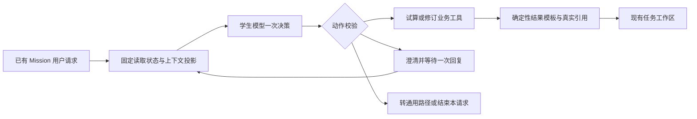
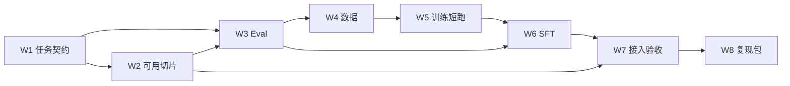

# ShopSteward 第二阶段计划：补货工具决策 SFT、Eval 与数据流水线

> **For agentic workers:** REQUIRED SUB-SKILL: Use superpowers:subagent-driven-development or superpowers:executing-plans to implement this plan task-by-task. Steps use checkbox (`- [ ]`) syntax for tracking. 本文当前供团队细化和讨论，不表示已要求执行开发、租赁服务器或启动训练。

**Goal:** 在已有 Mission 的补货对话中，用自部署模型可靠完成工具选择、参数绑定和必要澄清，并建立能重放、评测、训练和回收失败的数据闭环。

**Architecture:** 固定流程提供已授权的任务上下文；SFT 模型提出一个受限决策；现有业务工具执行，确定性模板交付结果。业务授权、计算、版本校验和持久状态继续由现有系统负责。

**Tech Stack:** 现有 Python/FastAPI/PostgreSQL/LangGraph；拟采用 Transformers、TRL、PEFT 完成训练，自部署推理优先验证 vLLM；数据起步使用 JSONL、manifest 和对象存储。新增训练依赖使用独立环境。

**Spec:** [范围设计 v0.2](../specs/2026-09-14-phase2-task-model-data-eval-design.md)。本计划详细展开该设计；两者均以本次收窄后的范围为准。

**版本与状态:** v0.2，2026-09-14，团队讨论稿。源码核对基线 `30bed9f`，分支 YH。文中的模型规模、数据量、超参数、时间和指标均为实验规划值，尚非测量结果。

## Global Constraints

- 首轮 SFT 只覆盖“补货场景下的工具选择、参数绑定、必要澄清”。
- 首轮入口是已有 Mission 的用户对话；无 Mission 的通用事项处理器不作为本轮依赖。
- 不训练开放式经营分析、预测计算、长报告生成、通用异常诊断或自主采购。
- 所有业务执行仍走现有授权、版本和幂等协议；模型不能提供服务密钥或审批凭据。
- 实际经营金额继续使用整数分；采购数量沿用后端严格整数及范围约束。
- 允许使用远程 GPU；具体租赁规格、预算和实际运行需在短跑结果基础上确定。
- Python 版本下限沿用项目 `>=3.11`；训练环境与业务应用环境分开锁定依赖。
- 本文不安排人员分工；只定义工作内容、接口、依赖、交付与讨论事项。

---

## 阅读导航

| 想讨论的问题 | 对应章节 |
|---|---|
| 二阶段到底交付什么、哪些不做 | 1–3 |
| 具体训练什么，怎样定义正确答案 | 4–5 |
| Eval 怎么写、如何避免虚高结果 | 6 |
| 数据从哪里来、怎么验证与切分 | 7 |
| 多大的模型、多少数据、怎么训练 | 8–9 |
| 如何接入当前项目 | 10–11 |
| 怎么分步推进和验收 | 12–13 |
| 讨论会上要决定什么 | 14–15 |

## 1. 阶段目标和可用结果

### 1.1 面向用户的结果

用户在某个已有补货 Mission 中输入自然语言，例如“如果本次最多买 20 件，会有什么影响”或“把本次采购上限改成 20 件”。系统能区分假设与正式修改，调用正确的业务工具，并展示真实结果和下一步状态。

功能仍是一个可用的补货助手。首轮训练只优化其中最有价值、可严格验证的决策部分。

| 必须说明的项目 | 本阶段定义 |
|---|---|
| 可用结果 | 自然语言请求能经模型决策转成真实试算或待确认新方案，并显示结果 |
| 功能成功 | 用户目标完成、动作正确、参数正确、没有错误业务副作用；成本与耗时可测 |
| 核心路径的必要条件 | 有效 Mission 上下文、受限决策契约、工具执行与回执、确定性展示、最小 Eval |
| 后续验证与增强 | 大规模 benchmark、复杂恢复、多业务泛化、自动技能学习、DPO、生产并发优化 |
| 下一步最小产物 | 两个意图对照案例真实执行，一份 50 例开发集，一次基础模型评测 |

### 1.2 工程目标与研究目标分别验收

**工程目标：**模型能够插入现有产品，完成限定范围任务；数据采集、重放、评测、部署切换可运行。

**研究目标：**在相同工具和上下文下，确定 SFT 相比基础模型是否改善动作选择、参数绑定或每成功任务成本，并找出有效数据的类型。

工程闭环完成不等于 SFT 有增益。若训练没有提升，应交付可复现负结果和错误分析；可以继续使用质量较好的基础模型，但研究目标不能标成完成。

### 1.3 与原路线的关系

原路线中的第二阶段还涉及持续跟进、技能复用及其他业务增强。本轮按用户要求增加 post-training，但不同时扩大首轮训练任务。文档使用“二阶段 PT 核心包”指本计划；原多 SKU 优化、预测精度提升和供应商扩展仍有各自验收口径。

现有 v6 需求预测模型负责预测数值。此处 SFT 的对象是语言模型决策，不能用工具选择提升代替预测精度提升。

## 2. 范围与方案取舍

### 2.1 三种可选方案

| 方案 | 内容 | 优点 | 代价 | 本计划选择 |
|---|---|---|---|---|
| A 意图分类器 | 只预测查询/试算/修改等类别，代码填所有参数 | 最简单、数据需求较低 | 无法充分验证实体与参数绑定，模型价值可能有限 | 作为规则/分类基线 |
| B 受限工具决策模型 | 选择试算/修订/澄清等动作，生成受约束参数 | 可训练、可执行、可严格评分，接近真实任务需求 | 要建设上下文和数据验证 | **首轮采用** |
| C 全链路 Agent 微调 | 选工具、规划多步、分析、报告、异常恢复 | 模型负责范围广 | 数据与归因困难，易把工程错误混进训练 | 核心包之外 |

### 2.2 业务模块与模型的职责

| 能力 | 本阶段处理方式 | 是否计入 SFT 目标 |
|---|---|---|
| 区分假设、修改、撤回和缺信息 | 模型根据消息与上下文决策 | 是 |
| 提取数量、绑定方案 ID 与版本 | 模型输出，执行器严格校验 | 是 |
| 必要澄清 | 模型输出一个短问题，使用已有等待/恢复机制 | 是，限定范围 |
| 读取 Mission 和当前 Plan | 固定前置流程 | 否 |
| 采购数量试算、金额计算 | 现有业务工具 | 否 |
| 方案生成、版本保存 | 现有 `revise_plan` 与规划逻辑 | 否 |
| 结果表格、金额单位、状态文案 | 确定性模板 | 否 |
| 通用报告和开放式分析 | 现有通用 Agent，按路由接管 | 否 |
| 网络重试、取消、幂等、版本冲突 | 确定性执行器 | 否 |
| 无 Mission 的通用事项处理 | 后续独立工程工作包 | 否 |
| 自动审批、采购、修改现金政策 | 不向学生模型提供相应能力 | 否 |

### 2.3 核心包的边界

- 单次请求绑定一个已有 Mission 和当前 Plan；不训练跨店、多 Mission 搜索。
- 首轮核心约束为本次采购数量上限，不覆盖预算、供应商、日期等复合约束的自动转换。
- 每次模型响应只允许一个结构化动作；不生成平行工具调用或任意长度计划。
- 一个 episode 最多有一次模型发起的澄清及一次用户回复。更长对话交给现有通用路径或后续扩展。
- “最多 20 件”表示上限，不等于实际方案必须采购 20 件；实际采购数量由业务工具计算。
- “买 20 件”和“最多买 20 件”语义不同。前者如无法由当前上限工具精确表达，应澄清或转通用路径，不能偷偷改成上限 20。

## 3. 当前项目基线与改造位置

### 3.1 已核实的可复用实现

| 位置 | 当前实现 | 对本计划的作用 |
|---|---|---|
| `agent/src/shopsteward_agent/model.py` | 可配置 base_url、模型名、API 模式；转换工具调用结果 | 复用服务接口，增加学生配置与兼容性验证 |
| `agent/src/shopsteward_agent/runtime.py` | LangGraph、工具预算、澄清 interrupt、模型协议修复 | 复用持久流程约束；为学生建立受限分支 |
| `backend/app/agent_bridge/composition.py` | 装配模型、上下文、运行图和最终输出 | 插入策略选择与实例配置的主要位置 |
| `backend/app/agent_bridge/tools.py` | `get_mission/get_plan/evaluate_plan/revise_plan` 等 | 保留工具契约与鉴权，导出模型可见 schema |
| `backend/app/agent_bridge/presentation.py` | 金额事实与部分展示校验 | 复用金额格式，新增受限结果模板 |
| `backend/tests/integration/test_plan_revision_api.py` | 试算/修订相关业务断言 | 提取可靠场景构造与最终状态校验 |
| `backend/tests/integration/test_agent_tools.py` | 受限工具集成行为 | 验证学生决策经过真实网关后的结果 |
| `backend/app/work_items/` | 通用事项上下文、租约、结果协议 | 核心包完成后的可选入口；当前不要求先实现 processor |

### 3.2 需要在基线阶段解决的接口问题

1. **上下文不能只传一句用户文本。**必须提供当前 Plan、Mission 版本、允许的工具、相关用户对话，否则无法区分语义错误与输入不足。
2. **修订意图存在后端关键词校验。**当前 `tools.py` 对假设/明确修改做关键词判断。语义正确的改写仍可能被拦截，尤其澄清回复只有“20”时。需要保留原始用户消息、记录实际拦截原因并测试；不能生成伪造用户消息或由模型提供来源 ID 绕过校验。
3. **现有主图默认让模型继续生成最终文本。**学生分支应在一次决策执行成功后进入模板展示，不再要求同一个模型写报告。
4. **现有上下文可能包含大量记忆或资料。**首轮采用固定、可重现的受限投影，避免上下文不断增长改变训练分布。
5. **现有模型适配有 30 秒超时、2048 输出 token 等默认值。**学生分支应单独配置，不能为它修改全部 Agent 的行为。

修订来源的处理建议：首轮正式修改要求当前有效用户消息本身有明确修改意图和数量；澄清问题提示用户完整表达修改要求。仅回复数字导致的来源不足单列集成限制。支持更自然的跨消息授权聚合时，另做后端小范围变更与测试，不把它当作 SFT 自动解决的问题。

## 4. 任务定义与场景矩阵

### 4.1 首轮任务族

| ID | 用户请求 | 预期动作 | 核心验证 |
|---|---|---|---|
| PT-01 | “如果上限是 20 件，会怎样？” | `evaluate_plan` | 参数 20；正式业务方案未变 |
| PT-02 | “把本次采购上限改成 20 件” | `revise_plan` | 新方案/约束正确；没有采购执行 |
| PT-03 | “先别改，只看上限 20 的结果” | `evaluate_plan` | 否定正式修改优先，不能误写 |
| PT-04 | “把上限调低一些” | `clarify` | 询问缺失数量，不猜参数 |
| PT-05 | “按刚才试算的上限修改” | 有唯一、完整上下文时选择修订；来源校验不通过则返回明确限制 | 指代绑定与执行结果分开计分 |
| PT-06 | “算了，这次不用改了” | `no_action` | 本请求不调用业务写工具；不取消整个 Mission |
| PT-07 | “上限改成 -5 件 / 20.5 件” | `clarify` | 指出数量契约，不自动取整或截断 |
| PT-08 | “做一份本季度经营分析” | `handoff` | 判断超出学生范围，不编造报告 |
| PT-09 | “最多买 20 箱”但无包装换算依据 | `clarify` 或 `handoff`，依明确任务标签 | 不把箱静默等同于件 |
| PT-10 | “取消本次额外采购上限” | 支持该语义的有效上下文下 `revise_plan`，值为 null | 区分无额外上限与上限 0，不改变现金政策 |

PT-01–04 是第一批最小切片；PT-05–10 在同一窄任务内补充边界，不扩成独立业务模块。PT-10 先验证真实后端行为再生成训练标签。

### 4.2 场景覆盖维度

| 维度 | 必须覆盖的变化 |
|---|---|
| 意图 | 假设、明确修改、否定修改、撤回、信息不足、超范围 |
| 数值 | 0、普通正整数、上界 1,000,000、负数、非整数、中文数字、明确取消上限 |
| 表达 | 直述、礼貌表达、口语、否定、先后纠正、相关短历史指代 |
| 上下文 | 有当前 Plan、缺 Plan、多条不同数量历史、当前用户未授权修订 |
| 执行状态 | 正常、版本变化、调用超时、已成功但回执传输不确定 |
| 对象 | 当前 Plan、历史 Plan 的提及、其他 Mission 的 ID 出现在文本中 |

不做所有维度的笛卡尔积。先覆盖会改变正确动作的组合，再根据真实错误增加交叉场景。训练配比和真实使用分布不同，评测必须单列常规集与挑战集。

### 4.3 一份可执行任务规格

以下为拟建 fixture 格式；对象 ID 由隔离测试环境实际创建并映射，不复制到真实经营库。

```yaml
task_id: PT-01-example-001
task_type: hypothetical_quantity_cap
scenario_family: hypothetical_vs_revision
lineage_id: seed-cap-001
split: dev
fixture_recipe: current_replenishment_plan_v0
environment_seed: 17
user_messages:
  - "如果本次采购上限是20件，会怎样？"
expected:
  allowed_actions: [evaluate_plan]
  arguments:
    plan_id: "$current_plan_id"
    max_purchase_qty: 20
  final_predicates:
    - evaluation_receipt_matches_request
    - current_plan_id_unchanged
    - business_cash_inventory_in_transit_unchanged
    - no_purchase_action_created
  delivery_kind: hypothetical_result
budget:
  model_decisions: 1
  business_mutations: 0
```

“未变化”只针对应保持不变的业务字段；日志、模型用量、工具审计行可以新增。不能比较整个数据库完全相等。

## 5. 模型输入、输出与执行契约

### 5.1 模型可见输入

输入由固定投影器生成，包含：当前用户消息、最多 4 组完整相关历史交互、Mission 与 Plan 的真实标识和版本、采购数量约束、单位、允许的工具 schema。最多 4 组是初始配置，须用长度分布和指代任务验证。

投影器不预先告诉模型“这是修改请求”，否则会把待评测能力写入输入。它只提供真实可见状态，不包含标准动作、成功标签、未来工具结果、服务令牌或内部评分。

初始序列预算取 4096 token，预留输出空间。超长输入先在完整对话组边界裁剪；若裁剪会丢失必要指代信息，转通用路径并记录 `context_limit`，不能截出断裂工具回执后继续训练。

### 5.2 决策动作集合

| 动作 | 参数 | 执行方式 |
|---|---|---|
| `evaluate_plan` | `plan_id`, `max_purchase_qty` | 沿用真实工具；上限 null 表示无额外数量上限 |
| `revise_plan` | 上述字段及 `expected_mission_version` | 沿用真实工具，版本必须来自当前可见状态 |
| `clarify` | `question` | 沿用运行时澄清语义；短问题，只问影响本动作的缺项 |
| `handoff` | `reason`：`unsupported_request`、`insufficient_context`、`permission_scope` | 新增运行时控制动作，不是业务 API |
| `no_action` | `reason`：`withdraw_current_request` | 新增运行时控制动作；只结束当前请求，不撤销任务或已经成功的修改 |

`source_message_id` 由后端绑定，模型 schema 中不提供。`processing_token`、服务密钥、审批凭据均不出现在输入或目标中。`get_mission/get_plan` 由固定流程调用，不能把固定读取算成学生自主规划能力。

所有决策使用一个 tool_call。Schema 约束能过滤非法格式，但不能证明动作或数值在语义上正确；base 与 SFT 使用相同解码约束，分别记录原始输出和解析后结果。

### 5.3 示范目标

对 PT-01 的模型输出示例：

```json
{
  "role": "assistant",
  "content": "",
  "tool_calls": [{
    "id": "call_eval_001",
    "type": "function",
    "function": {
      "name": "evaluate_plan",
      "arguments": "{\"plan_id\":\"plan-fixture-17\",\"max_purchase_qty\":20}"
    }
  }]
}
```

这是项目工具协议示例，不直接假定所有训练库接受同一 arguments 字符串格式。数据投影器负责转换成所选 tokenizer/chat template 接受的结构，转换前后做 round-trip 检查；同一语义的参数不能因为空格/JSON 键顺序不同被判错。

### 5.4 执行器处理流程



校验包括工具是否可用、当前用户是否有权限、对象是否在作用域内、参数类型、版本和调用预算。模型给错 ID、数量或版本时不得静默换成正确值并把该次预测算正确。

版本冲突时首轮停止该次修改，固定读取新状态并提示需要重新确认当前意图；不把任意异常交给学生自主规划。写入结果不确定时先查询既有调用回执/幂等状态，未确定前禁止向通用模型发起可能重复的修改。

## 6. Eval 详细规划

### 6.1 Eval 的两个主要层次

**决策 Eval：**在冻结上下文中预测一个动作。快速发现工具选择、数量、ID、版本和澄清错误。

**执行 Eval：**从隔离状态实际运行请求，经过同一策略与业务执行器，检查回执、最终业务状态和展示结果。这是产品任务验收的主层次。

软件单元测试验证执行器和 scorer 是否正确；模型 Eval 验证模型是否能完成任务。两个结果分开列出。

### 6.2 核心指标及分母

| 指标 | 定义 | 防止误读 |
|---|---|---|
| 动作正确率 | 预测动作属于该样本允许集合 / 全部有效模型决策 | 应执行却澄清或转交算错误 |
| 完整参数正确率 | 在预期为工具调用的样本中，工具和全部必要参数均正确 / 此类样本 | 不能只在已选对工具的子集报告 |
| 格式合法率 | 输出能通过 schema / 全部模型响应 | 格式正确不能替代业务成功 |
| 必要澄清召回 | 真正缺信息时正确澄清 / 缺信息样本 | 同时报充分信息时的无必要澄清率 |
| 核心任务成功率 | 范围内 episode 达成用户目标且满足业务谓词 / 全部范围内 episode | 只读成功不能掩盖正式修订失败 |
| 范围外路由正确率 | 正确转交或结束 / 对应边界样本 | 不与核心任务混成一个主总分 |
| 错误写入尝试率 | 不该修订却请求修订 / 不允许修订的样本 | 即使后端拦截也记录模型错误 |
| 错误业务副作用 | 实际错误修改、采购或对象越界次数 | 记录具体案例和总测试数 |
| 每成功任务成本 | 本组所有尝试成本 / 成功任务数 | 分列学生独立与含兜底结果；零成功写不可计算 |
| 延迟 | 决策与全链路各自 P50/P95 | 固定并发、预热、输入长度，记录超时 |

工具/数据库等基础设施故障单列原因。在面向用户的全链路可用率中保留失败；模型能力分析另报告环境正常的子集及排除数量，不能偷偷删除困难样本。

### 6.3 评分器必须检查的事实

- 试算：plan_id 与参数正确；返回真实试算结果；正式约束、当前 Plan、现金、库存、在途和采购行动不发生相应业务修改。
- 修订：新 Plan 的数量约束等于用户要求，实际采购数量符合上限而非强制等于上限；旧版本保留；新方案待确认；采购未执行。
- 澄清：问的是必要缺项；本轮无业务副作用。用户提供完整有效回复后能够完成任务。
- 撤回：本轮不继续修改；不擅自取消整个 Mission 或回滚已完成操作。
- 展示：用实际回执渲染，标注试算或待确认状态，金额单位正确，引用是真实对象。

不要用教师模型主观评分代替这些断言。澄清文字可按 rubric 人工抽样检查，若引入 LLM judge，只评语言是否对应缺项并进行人工校准。

### 6.4 数据集数量与用途

| 集合 | 初始规模 | 使用方式 |
|---|---:|---|
| smoke/dev 起步集 | 50 个 episode | 频繁查看、修改、联调，不用于最终效果声明 |
| dev-v1 | 200 个 episode | 选择提示、数据配比和 checkpoint；含正常及挑战场景，分开统计 |
| test-v1 | 300 个 episode | 建议 200 核心任务 + 100 边界/挑战；锁定候选后评测 |
| 训练集 | 先 1,000，后 3,000–8,000 条决策目标 | 不含 dev/test 同源变体；另报 episode、场景家族数 |

这些数量是工作量预算，不保证统计功效。开发起步集可并入 dev-v1；不能并入 test-v1。已有场景数量不足时宁可先交付较小但独立的测试集，并说明结论限制。

主报告按场景家族与任务类型展示。若比较相差几例，报告具体分子/分母与配对差异；足够样本时按场景家族 bootstrap 估计区间，不能把同源改写当独立观察值。

### 6.5 对照实验

| 实验 ID | 配置 | 回答的问题 |
|---|---|---|
| B0 | 关键词/简单规则路由 | 该任务是否需要微调模型 |
| B1 | 当前通用 API 模型，使用相同受限输入和动作集 | 可达到的参考质量与成本；不是自动金标 |
| B2 | 7–8B 基础 instruct 模型，未 SFT | 首要训练基线 |
| S1 | 同一模型 + 1,000 条训练数据 | 是否有初步学习信号 |
| S2 | 同一模型 + 3,000 条训练数据 | 数据扩充是否有效 |
| S3 | 根据 dev 结果扩至最多 8,000 条 | 是否值得继续扩量 |
| C1 可选 | 3–4B 或 14B，先不训练 | 判断压缩或增加容量的价值 |

固定测试输入、工具 schema、模板、上下文、采样、模型调用预算、记忆版本、服务精度和解码约束。若改变任何一项，新增实验 ID 并标记对照不再只反映 SFT。

### 6.6 验收指标的建议起点

下面是基线后、正式训练前讨论并固定的目标，不是预先宣称可以实现：

- 动作正确率目标 ≥95%，完整参数正确率目标 ≥95%，同时逐任务报告。
- 核心 episode 成功率目标 ≥90%；信息充分时无必要澄清率目标 ≤5%。
- 明确禁止写入的测试集中实际错误业务副作用为 0，并报告模型尝试次数；有限测试不能证明无限场景无错。
- 模型改进目标为相同条件下相对 base 提升约 5 个百分点，或在事先约定的质量容差内降低每成功任务成本。置信区间不支持差异时描述趋势。
- 暂以单并发、预热后决策 P95 ≤5 秒、无澄清全链路 P95 ≤15 秒作为体验讨论值；基线后记录网络/卡型并确定正式服务目标。

MVP 联调不被这些实验目标阻断；候选模型是否替换稳定基线，才受质量和产品验收约束。

## 7. 数据流水线详细规划

### 7.1 数据来源与使用顺序

| 来源 | 如何获得 | 进入训练前的条件 |
|---|---|---|
| 人工种子 | 按第 4 章写请求、可见状态与正确动作 | 语义明确；对应工具可执行；边界经讨论达成一致 |
| 业务测试场景 | 从现有测试提取状态构造和断言 | 改成可重用 fixture，不直接依赖 pytest 私有运行状态 |
| teacher 候选 | 对训练分区种子进行表达、上下文和参数变化 | 不接触 test；经过结构、执行及语义校验 |
| 真实使用轨迹 | 从启用的测试/演示链路采集 | 去凭据；有当时状态与版本；符合数据使用约定 |
| 失败修复 | 针对原始可见输入生成修正动作 | 从同一起点重放成功；保留失败关联；不泄漏未来状态 |

优先人工确认约 100 个种子案例的语义质量，再扩充到覆盖不同组合的来源家族。不能从 20 个模板扩写出 5,000 行就当作拥有 5,000 个独立任务。

### 7.2 八步处理流程

1. **采集和归一化。**保留原消息、工具实际回执、状态快照、版本、时间及原始输出；给 episode 和来源血缘编号。
2. **去除凭据和不必要信息。**删除 token/key；用户和业务标识改成可保持关联的 fixture ID；只上传本实验必要数据。
3. **先按来源分组切分。**建立 train/dev/test 的 group manifest；原始案例、改写、拆分和修复继承同一分区。
4. **只在 train 生成候选。**为种子改变表达、数值、否定、指代和缺项；生成时记录 teacher、提示和费用。
5. **执行校验。**schema → 合法对象/参数 → fixture 重置与真实工具重放 → 业务最终状态谓词。
6. **语义复核与修复。**小批初期全量检查关键动作标签，扩量后按类型抽检并全查错误写入样本；失败分类后定向修复。
7. **去重与发布。**同时做规范化精确去重和同源/近似重复检查；输出 accepted/rejected 统计及版本 manifest。
8. **训练投影。**生成只包含模型可见输入与正确目标动作的数据；发布前校验 token mask、工具格式和数据哈希。


### 7.3 标准数据与训练数据分开

标准 episode 记录建议包含以下字段：

| 字段组 | 必须内容 |
|---|---|
| 标识 | episode_id、task_type、scenario_family、lineage_id、split、parent_episode_id |
| 溯源 | source_kind、source_ref、collection_time、teacher_id、generation_config_hash |
| 环境 | fixture_recipe、snapshot_ref/hash、environment_seed、business_clock、backend_commit |
| 可见输入 | 消息、context_version、tool_schema_hash、prompt_hash、memory_snapshot_hash |
| 模型 | model_id/revision、tokenizer_revision、adapter_revision、decoding_config |
| 运行 | 原始输出、解析动作、工具调用 ID、真实回执、最终状态 diff |
| 质量 | verifier_version、验证结果、failure_tags、review_status |
| 成本 | 输入/输出 token、延迟、teacher/API 成本、资源运行 ID |

金标动作、隐藏断言和评分结果保存在标准记录的验证区，不能混入模型输入。训练文件使用 prompt/completion 或相应会话工具格式；一个样本的目标是一个已验证动作。

若选择单目标 completion-only SFT，历史中出现的错误动作可以作为上下文保留，但其 token 不作为监督目标；修复标签必须只依赖当时可见信息。初版优先使用完整、干净的单目标样本，降低错误标签掩码的复杂性。

### 7.4 数据切分与防泄漏规则

- 分组键覆盖原始业务案例、共同生成模板、文档来源和场景血缘。相关组之间有重叠时按连通分组处理，不能只按单一 ID 随机切分行。
- 全部工具动作在 train/dev 中都可出现；评测“未见表达/组合”与“未见工具”是不同问题，首轮不声称具备未见工具泛化。
- 同一 episode 的多个决策目标不能分散到不同集合。
- 测试集失败如用于数据修复或提示优化，该版本就成为已看过的数据；之后的正式结论需要新的未见测试版本。
- 不把未来到货、修订后新 Plan ID、实际最优动作等隐藏答案加入输入。
- 对照实验固定同一测试集；若测试规格修复，所有候选在同一修正版上重新比较。

### 7.5 验证规则与错误分类

| 错误标签 | 例子 | 处理 |
|---|---|---|
| intent_error | 假设请求选择修订 | 生成语义对照数据 |
| argument_error | 数量/ID/版本错误 | 检查可见信息，再补绑定样本 |
| clarification_error | 信息充分仍追问，或缺数量直接猜 | 补充分信息与缺项配对样本 |
| scope_error | 开放报告请求进入学生修订动作 | 补范围外对照与路由测试 |
| format_error | 多个动作、非法 JSON、参数缺项 | 先检查模板/解析器，不盲目扩数 |
| backend_policy_mismatch | 正确语义被后端来源或关键词规则拒绝 | 作为集成问题修复或明确支持范围 |
| environment_error | 测试数据库/工具服务不可用 | 修环境后重放；不作为模型正负标签 |
| delivery_error | 真实试算结果被展示成正式修改 | 修模板与执行器 |

校验通过也可能存在语义误标。每个新数据生成版本先抽查各类样本，重点核查假设/修改、零/null、精确数量/上限和否定纠正。发现系统性错误时隔离该生成批次并重生成，不能只删除已发现的几条。

### 7.6 首轮训练配比建议

以下按 5,000 条监督目标提供讨论起点；实际按 dev 错误和有效场景分布调整，不能用此比例伪装真实使用频率。

| 类型 | 占比 | 条数 |
|---|---:|---:|
| 正常假设试算 | 25% | 1,250 |
| 正常正式修订 | 25% | 1,250 |
| 否定、纠正、相关上下文指代 | 20% | 1,000 |
| 缺项、非法数量、单位歧义 | 15% | 750 |
| 范围外、撤回、权限边界 | 15% | 750 |

同一来源产生的改写设置可配置上限并报告分布，避免少数模板主导训练。扩量优先增加有效场景家族和失败条件，而不是重复更换措辞。

### 7.7 数据存储与发布

小规模使用版本目录与 manifest，正式数据和权重放项目约定的对象存储或训练机数据卷；Git 保存生成脚本、任务规格、小型无敏感 fixture、配置和汇总报告。

发布 manifest 至少包含文件列表/hash、各 split 的 episode/目标/家族数、schema 版本、工具版本、生成与验证配置、拒绝原因统计、token 长度分位数。发布后的版本不原地覆盖；修复产生新版本。

原始日志、去凭据标准数据、训练投影、模型权重分别存储。开发清理只能针对已确认路径的临时运行目录，不能让“重置 Eval”影响真实业务库或共享原始数据。

## 8. 模型选择与 SFT 实验

### 8.1 模型候选与选择规则

首轮主候选采用 7–8B 级 instruct 模型。一个可复现的具体候选是 `Qwen/Qwen3-8B`，优先验证关闭 thinking 的短动作输出模式；官方模型卡提供模式与工具使用说明。这里不是认定其为当前最优模型，而是给出可以开始验证的明确候选。[官方模型卡](https://huggingface.co/Qwen/Qwen3-8B)

候选登记时固定 model revision、tokenizer revision、许可证、服务版本、模板 hash 和工具解析方式。若该候选的中文语义、工具协议或部署质量不满足基线要求，可换另一个同量级候选，但更换后重新跑相同基线。

| 规模 | 本轮用途 | 进入完整训练的条件 |
|---|---|---|
| 3–4B | 可选成本对照 | 未训练基线接近 8B，且目标延迟/资源更有价值 |
| 7–8B | 首轮主实验 | 协议兼容、核心案例可执行、有可改善错误 |
| 14B | 可选容量对照 | 较小模型补数后仍有稳定语义短板，较大模型同条件表现更好 |
| 32B 及以上 | 本核心包暂不投入 | 只有后续任务扩展及对照证据支持时考虑 |

同时训练多个规模会混淆数据质量与容量问题。先比较未训练基线，再集中训练一个主候选。

### 8.2 初始超参数建议

下表是短跑配置起点，不是已经验证的最优值。配置字段由训练适配器映射到锁定版本的库接口。

| 参数 | 起点 | 调整依据 |
|---|---|---|
| 方法 | LoRA SFT，基础模型冻结 | 显存不足再比较 QLoRA；不默认全参数训练 |
| LoRA rank / alpha | 16 / 32 | 首轮先固定，数据实验后再考虑 rank 32 |
| LoRA dropout | 0.05 | 根据过拟合和 dev 表现调整 |
| target modules | 验证可训练线性层集合 | 导出实际模块清单，不能依赖未经检查的通配结果 |
| 学习率 | 1e-4；必要时与 5e-5 单因素对照 | dev 动作/参数指标与训练稳定性 |
| epoch | 最多 3，优先看 1 和 2 的 checkpoint | 依 dev 指标选，不以跑满为目标 |
| 有效 batch | 32 个序列 | 通过 micro-batch 与梯度累积实现，记录 token 分布 |
| 最大序列 | 初始 4096 token，包含输入与目标 | 根据真实长度分布决定是否扩大 |
| 精度 | 支持时 BF16 | 由 GPU 和依赖验证；量化独立作为变量 |
| packing | 首轮关闭 | 数据格式稳定后再测，避免掩码/样本边界问题 |
| 随机种子 | 主实验固定 17 | 最终候选可用 29 复验，若未复验注明 |

监督只针对正确 assistant 决策目标。TRL 支持 completion-only 和 assistant-only 等方式，但必须检查所选 chat template 的 generation mask；不能只设置一个开关就假设历史错误、用户文本或工具回执已经全部排除。[TRL SFT 文档](https://huggingface.co/docs/trl/sft_trainer)

### 8.3 训练前必须完成的检查

- 抽取正常调用、澄清、转交、零/null 和含历史样本，查看实际 token 与 loss mask。
- 检查所有有效目标至少有一个被监督 token，无效输入不会被静默丢弃。
- 样本截断不破坏工具结构或丢失目标；超限样本有计数与原因。
- 用 100–300 条样本短跑，验证保存、加载、推理解析和训练 loss 行为。
- 小样本能够拟合仅说明训练链路工作，不能用训练集准确率证明泛化。
- 使用独立 dev 选择 checkpoint；test 不参与早停或超参数选择。

### 8.4 实验推进与停止规则

1. 先跑 B0/B1/B2，形成基线错误分布。
2. S1 用 1,000 条验证是否有学习信号；没有信号先查模板、标签、上下文和基线饱和。
3. S2 用 3,000 条，与 S1 保持模型和配置一致，判断增益是否来自新增场景。
4. 只有 dev 表明仍受覆盖不足限制，才扩大到 5,000–8,000 条。
5. 若数据清洗和一次定向扩充后仍无改善，暂停扩量，运行容量对照或保留 base；不把“再生成十万条”当默认解法。
6. 锁定候选后跑 test-v1，再用实际服务精度验证，提交正结果或负结果。

首轮不引入 DPO。任务动作已有可执行正确标准，先验证 SFT 的收益；偏好优化留给之后确实出现多个合法输出的质量差异时。

## 9. 远程 GPU、训练量与费用规划

### 9.1 资源使用方式

用户允许使用远程 GPU 和较高配置。推荐先用单张 80GB 级 GPU 作为主候选的宽裕短跑环境，测实际峰值显存、吞吐和预算后再确定正式实例；该建议不是“8B 必须用 80GB”。更小显存或量化方案可以后续比较。

训练机、在线推理服务、业务数据库分离。业务服务不需要安装训练用 CUDA/TRL 依赖；训练机只接收实验所需的去凭据数据。模型服务通过鉴权连接项目，密钥由执行器持有，不写入样本或文档。

### 9.2 工作量计算方法

假设 5,000 条目标样本，平均序列 1,500 token，训练 2 个 epoch：

```text
总处理 token = 5,000 × 1,500 × 2 = 15,000,000
训练小时估算 = 总处理 token / 实测有效训练 tokens_per_second / 3,600
总实验费用 = GPU 实例小时 × 实际单价 + teacher/API + 存储与传输
```

输入 token 即使不计算监督 loss 仍需参与模型计算。有效吞吐应包括所选 batch、精度、序列长度、梯度累积和通信开销；验证、保存、预处理另行计时。没有短跑结果前不承诺具体 GPU 小时或总价。

Teacher 成本同时报告生成候选数和最终有效数据数，以“每条验证通过样本成本”比较生成策略，不能仅报 API 每百万 token 单价。

### 9.3 每次远程实验记录

记录 GPU 型号/数量/显存、驱动/CUDA、环境 lock、model revision、数据版本、开始/结束时间、训练 token、峰值显存、吞吐、checkpoint、失败原因和费用。日志缺失的 run 可以用于排障，不能成为不可复现的主结果。

短跑结束先关闭无消费者的空闲实例或按团队实际租赁方式暂停计费；训练断点和数据先保存到已约定存储。启动、停止与清理操作必须识别本实验资源，不能影响其他共享任务。

## 10. 工程接入与用户体验

### 10.1 接入阶段

| 阶段 | 行为 | 验证内容 |
|---|---|---|
| 离线决策 | 读取 fixture，学生只产生动作 | 输入/输出契约、模型与 schema 兼容 |
| 隔离执行 | 动作经过真实测试环境工具 | 正确回执、最终业务状态、模板展示 |
| 影子比较 | 对相同去凭据上下文比较候选决策，不重复执行业务修改 | 同分布质量、延迟、路由覆盖 |
| 限定入口启用 | 为选定测试/演示环境的已有 Mission 启用学生分支 | 工作区闭环、澄清、取消、恢复与回退 |

影子模式只比较候选动作，不让多个模型对同一个真实状态各执行一次修订。业务状态对照应在独立 fixture 副本运行。

### 10.2 路由与回退

策略配置拟设 `general`、`replenishment_policy`、`shadow` 三种模式，默认保持 `general`。作用于明确选定的实验环境或会话，不能通过全局替换现有模型把全部业务送给学生。

- 学生返回 `handoff` 时交给现有通用 Agent，记录原因和两边成本。
- 对范围内正常请求错误转交，在学生独立 Eval 中记失败；系统最终成功另计。
- 超时、协议错误最多允许一次配置一致的协议修复；修复成本计入。若之后转交，保留原始失败输出。
- 业务写入已成功或结果未知时，不直接重跑同一请求；先核对回执和幂等状态。
- 首轮不使用学生自报置信度作为可靠回退阈值；如未来使用，必须先校准。

### 10.3 结果展示

试算模板展示“假设条件、真实试算结果、与当前方案的区别”，明确正式方案未改变。修订模板展示“新方案、采购上限、待确认状态、真实 Plan 引用”，不得声称采购完成。

数量和金额从回执读取；无对应字段就不输出猜测值。无操作模板说明当前请求未执行修改；不能承诺回滚先前操作。错误模板显示可行动的下一步和已有状态，不输出数据库异常或供应商 SDK 原始报错。

本轮可复用现有 Mission/Plan 引用与任务工作区，无需先增加预测/文档引用类型。开放式解释仍由通用路径提供，不混入学生 SFT 的效果声明。

### 10.4 自部署服务兼容性

逐项验证中文输入、自动工具选择、单个调用、JSON 参数类型、null、tool_call_id、特殊停止标记、输出上限和超时；多轮澄清输入与训练模板保持一致。对于 vLLM，模型、parser、chat template 的组合必须实际测试。[vLLM 工具调用文档](https://docs.vllm.ai/en/latest/features/tool_calling/)

训练权重和实际服务精度/量化配置分别登记。若量化导致参数或路由回退，应以最终部署表现决定是否启用，而非引用 BF16 训练环境分数。

## 11. 文件结构与拟建接口

下面是实施时的建议落点，标注“新增”的文件目前尚不存在。业务执行不复制到研究目录，研究 runner 必须调用同一策略与业务适配接口。

### 11.1 应用侧

| 文件 | 状态 | 职责 |
|---|---|---|
| `agent/src/shopsteward_agent/task_policy/contracts.py` | 新增 | 决策动作、上下文和输出类型 |
| `agent/src/shopsteward_agent/task_policy/policy.py` | 新增 | 受限模型请求、单动作解析、schema 校验 |
| `agent/src/shopsteward_agent/task_policy/runtime.py` | 新增 | 持久决策/澄清/执行分支，调用注入服务 |
| `backend/app/agent_bridge/task_policy_context.py` | 新增 | 固定读取、权限与业务上下文投影 |
| `backend/app/agent_bridge/task_policy_presentation.py` | 新增 | 真实回执的确定性模板与引用 |
| `backend/app/agent_bridge/composition.py` | 修改 | 根据策略模式装配，复用 Job/Run/checkpoint |
| `backend/app/core/config.py` | 修改，已核实为配置落点 | 学生服务与策略模式独立配置 |
| `agent/src/shopsteward_agent/model.py` | 按兼容性结果修改 | 新增必要模型参数，默认保持现有行为 |
| `backend/app/agent_bridge/tools.py` | 原则上复用 | 来源/授权问题仅在独立集成用例证明后定向修复 |
| `agent/tests/test_task_policy.py` | 新增 | 决策解析、范围控制、澄清及预算 |
| `backend/tests/integration/test_task_policy_execution.py` | 新增 | 真实工具、回执、版本、幂等与展示 |

### 11.2 研究侧

```text
posttraining/                             # 新增，独立安装/锁定环境
  README.md
  pyproject.toml
  requirements.lock
  tasks/replenishment_v0.yaml
  configs/data_v0.yaml
  configs/eval_dev_v1.yaml
  configs/eval_test_v1.yaml
  configs/sft_smoke.yaml
  configs/sft_8b_v0.yaml
  configs/serve_student_v0.yaml
  src/shopsteward_pt/cli.py
  src/shopsteward_pt/data/records.py
  src/shopsteward_pt/data/collect.py
  src/shopsteward_pt/data/split.py
  src/shopsteward_pt/data/verify.py
  src/shopsteward_pt/data/export.py
  src/shopsteward_pt/eval/fixtures.py
  src/shopsteward_pt/eval/runner.py
  src/shopsteward_pt/eval/scorers.py
  src/shopsteward_pt/training/sft.py
  src/shopsteward_pt/serving/verify.py
  src/shopsteward_pt/reporting.py
  tests/test_data_contract.py
  tests/test_split_lineage.py
  tests/test_scorers.py
  tests/test_training_projection.py
docs/reports/posttraining/                # 新增，小型报告入 Git
```

`.gitignore` 在引入环境与数据时增加必要规则，排除 `.venv-pt`、权重、原始日志和大数据运行目录。与根 uv workspace 的关系须显式声明；建议首轮独立 pip/lock 环境，不把训练依赖并入现有业务 uv lock。

### 11.3 公共接口草案

这些是工作包之间建议固定的 v0 名称和语义，不代表代码已实现。`PolicyContext` 保存第 5.1 节的可见输入；`Decision` 保存一个动作名及其已校验参数；`DecisionRecord` 额外保留原始响应与模型用量。`ExecutionOutcome` 保存真实回执、引用、业务错误码和展示类型；`EpisodeSpec` 对应第 4.3 节；`EpisodeTrace` 保存执行轨迹与前后状态证据；`EpisodeScore` 保存各谓词结果与失败原因。

| 接口 | 行为与结果 |
|---|---|
| `decide(context: PolicyContext) -> DecisionRecord` | 异步模型请求，返回单个已解析动作、原始输出与用量 |
| `execute_decision(decision: Decision, context: PolicyContext) -> ExecutionOutcome` | 异步执行受限动作，返回真实回执或明确错误 |
| `render_outcome(outcome: ExecutionOutcome) -> dict` | 从已完成结果构造现有工作区可消费的展示数据 |
| `run_episode(spec: EpisodeSpec, policy_id: str) -> EpisodeTrace` | 异步运行独立 fixture，返回完整执行证据 |
| `score_episode(spec: EpisodeSpec, trace: EpisodeTrace) -> EpisodeScore` | 对轨迹与业务状态评分，返回分项判定和原因 |

具体实现归入第 12 章对应工作包。任何接口变更同步更新数据 schema、消费者配置与测试，不允许 runner 偷改工具语义。

## 12. 可执行工作包

每个工作包结束都应有独立可审阅产物。顺序表达依赖，不对应人员安排。新文件路径均来自第 11 章；下面的命令是完成对应入口后应支持的验收方式，当前不可直接当作已存在脚本运行。

### W1：任务契约和 50 例开发集

**依赖：**第 2、4、5 章范围讨论形成 v0。**产物：**任务 YAML、动作 schema、50 个可重放 episode 规格、语义边界表。

- [ ] 写 PT-01–04 的成对例子及各自成功谓词，补充 0/null、上限/精确量、否定、撤回等边界。
- [ ] 定义 `PolicyContext`、`Decision`、`DecisionRecord` 和运行时控制动作 schema。
- [ ] 添加契约验证：拒绝未知字段、多动作、负数、浮点数、布尔数量及非法版本；接受合法 0 与明确 null。
- [ ] 为每个新场景创建真实 fixture recipe；用现有业务逻辑验证试算与修订预期，不凭文字计算金标。
- [ ] 输出 `task-contract-v0.md` 和可读场景清单，列明后端来源校验不支持的表达。

**验证：**`test_data_contract.py` 与 `test_task_policy.py`；50 例规格全部可解析，有合法初始状态和成功谓词。还不要求模型全部答对。

### W2：已有 Mission 的最薄真实切片

**依赖：**W1。**输入/输出：**`PolicyContext → DecisionRecord → ExecutionOutcome`。**产物：**能运行的查询/修订切片、模板结果和真实轨迹。

- [ ] 在 composition 的独立策略配置下，固定读取当前 Mission 和 Plan，构造上下文。
- [ ] 先使用当前 API 模型或固定测试决策验证执行路径，再装配未训练学生模型；两者工具协议一致。
- [ ] 实现单决策、一次澄清、明确转交和撤回分支；复用持久 Run、取消和租约能力。
- [ ] 实现试算/修订结果模板，不再要求学生生成最终报告。
- [ ] 验证只读不改变方案，修订不执行采购，重复投递不重复生成效果，版本冲突不静默覆盖。

**验证：**新增 `test_task_policy_execution.py`；复用 `test_plan_revision_api.py` 与 `test_agent_tools.py` 回归。保存两个核心例子的工具回执、业务差异和界面结果。

### W3：Eval runner、scorer 和第一份基线

**依赖：**W1；真实执行层依赖 W2，冻结输入的决策层可先完成。**产物：**可重复运行的评测命令、逐例日志和 B0/B1/B2 报告。

- [ ] 实现 fixture 初始化、每例隔离、执行前后业务字段采集及工具版本登记。
- [ ] 实现 `run_episode` 和 `score_episode`，语义允许集合与业务谓词分开评分。
- [ ] 给 scorer 加反例：调用正确但没有执行、试算误写、上限 20 实际采购少于 20、引用假 ID、环境失败。
- [ ] 运行 50 例基线，核查全部失败；冻结 dev-v1/test-v1 的来源分组清单。
- [ ] 汇总核心成功率、参数正确率、范围外路由、后端拦截、时延和成本；确定正式候选验收阈值。

**验证：**`test_scorers.py` 的反例不能误判成功；同一 fixture 和确定性策略重复运行产生相同业务判定。真实模型重复运行可以不同，差异必须记录。

### W4：数据流水线 v0 与首批 1,000 条目标

**依赖：**W1/W3；行动正例依赖 W2 的执行验证。**产物：**采集、切分、验证、投影、manifest 及质量报告。

- [ ] 实现第 7.3 节标准记录，加入去凭据和 ID 一致性检查。
- [ ] 固定来源分组 split，先验证跨分区无同源样本再生成候选。
- [ ] 生成小批 teacher 候选，逐例验证并复核关键标签后扩量。
- [ ] 实现 rejected 原因输出、修复关联、精确和近似重复检查。
- [ ] 导出首批 1,000 条目标，报告 episode/家族数量和 token 分布，不用拆分行数冒充独立任务。

**验证：**`test_split_lineage.py` 覆盖改写/修复/多轮拆分泄漏；`test_training_projection.py` 确认隐藏 oracle 和凭据不出现在输入，错误历史不进入目标 loss。

### W5：服务兼容性和训练短跑

**依赖：**W1/W4；模型未训练基线也可在 W3 前启动。**产物：**固定模型/依赖版本、资源 profile、训练与推理协议检查报告。

- [ ] 在独立远程环境登记候选 revision，验证非 thinking 动作输出和工具 parser。
- [ ] 使用 `sft_smoke.yaml` 跑 100–300 条目标，检查 mask、训练稳定性、显存和吞吐。
- [ ] 保存适配器，在新进程重新加载，并验证工具名、类型、null 和数量不变。
- [ ] 用实际吞吐估算 W6 的 token、时长和预算，记录是否需要更大卡或量化。
- [ ] 锁定可复现的环境清单；训练脚本禁止默认把原始数据或权重自动公开上传。

**验证：**至少包含一个试算、一个修订、一个澄清、一个转交、一个 null 的往返样本；输出 `resource-profile-v0.md`。训练集拟合成功不计为泛化结果。

### W6：首轮 SFT 与定向补数

**依赖：**W3/W4/W5。**产物：**S1/S2 模型、配置、dev 分析和数据版本。

- [ ] 固定提示、工具、模板和 base，执行 1,000 条数据的 S1。
- [ ] 按 dev 动作和参数指标选择 checkpoint，标注退化任务。
- [ ] 若错误属于数据覆盖，补至 3,000 条形成 S2；否则先修复原因并重新编号实验。
- [ ] 只有出现可信收益时继续至 5,000–8,000 条或做一次容量对照。
- [ ] 汇总学习曲线、失败案例和负结果；所有结论都链接数据与 run manifest。

**验证：**相同输入配置对照 B2/S1/S2；没有改善时按第 8.4 节停止扩量，不能只提交最低训练 loss 的模型。

### W7：独立验收与受限接入

**依赖：**W2/W3/W6。**产物：**test-v1 报告、实际服务验证、模型切换方案和演示。

- [ ] 锁定候选后运行 test-v1，按核心任务与挑战集分开报告。
- [ ] 在最终服务精度下再测核心任务，记录量化/网络/并发差异。
- [ ] 验证通用回退、协议错误、超时、取消、版本变化和不确定写入回执。
- [ ] 演示假设试算、正式修订、澄清完成、撤回、超范围转交五条用户路径。
- [ ] 输出是否启用学生的建议；工程完成与研究目标是否完成分别填写。

**验证：**限定入口工作区可用；主 Agent 回归通过；原始模型分数和回退后系统分数分别可追溯。

### W8：文档和复现实验包

**依赖：**各工作包产物持续汇总，最终依赖 W7。**产物：**项目说明、操作步骤、实验报告、数据/模型清单和后续问题。

- [ ] 编写 `posttraining/README.md`：环境、数据来源、任务范围、复现顺序、资源测量、模型切换。
- [ ] 列出所有正式 run 的数据/模型/模板/工具 hash 和报告链接。
- [ ] 报告错误分布与已知限制，包括来源校验、短历史、单 Mission、固定数量上限。
- [ ] 记录 DPO、多步恢复、通用事项入口等扩展的进入条件，避免默认为本阶段欠交付。
- [ ] 团队讨论后把本计划的决策记录更新到下一版本，保留可解释的范围变化。

### 12.1 计划中的命令契约

以下命令需由 W3–W6 建好 CLI 后运行，当前只规定入口和参数。配置文件记录输入输出路径、数据版本、环境端点及预算；密钥通过私密运行环境注入，不写入 YAML。

```powershell
.venv-pt\Scripts\python.exe -m shopsteward_pt.cli validate --config posttraining/configs/data_v0.yaml
.venv-pt\Scripts\python.exe -m shopsteward_pt.cli export --config posttraining/configs/data_v0.yaml
.venv-pt\Scripts\python.exe -m shopsteward_pt.cli evaluate --config posttraining/configs/eval_dev_v1.yaml
.venv-pt\Scripts\python.exe -m shopsteward_pt.cli train --config posttraining/configs/sft_smoke.yaml
.venv-pt\Scripts\python.exe -m shopsteward_pt.cli train --config posttraining/configs/sft_8b_v0.yaml
```

远程 Linux 使用对应虚拟环境内的 `python -m shopsteward_pt.cli`，配置语义一致。CLI 对不存在的输入、混乱 split、缺少环境标识、超预算配置给出明确错误并返回非零退出码；禁止自动猜一个业务数据库执行重置。

## 13. 里程碑、依赖和阶段验收

### 13.1 依赖关系



模型服务基线、契约单测和数据格式准备可以在不依赖前序结果的部分同时推进。正式动作金标、训练结论和上线决定必须按依赖获得证据。

### 13.2 相对排期建议

时间以“可以持续开发且远程环境可用”为假设，供讨论，不代表已承诺工时。缺乏投入信息时以里程碑推进，不按日历硬压范围。

| 时间窗口 | 重点 | 可审阅结果 |
|---|---|---|
| 第 1 周 | W1/W2/W3 起步 | 50 例、一条真实链路、基线错误分布 |
| 第 2 周 | W3/W4/W5 | 独立分区、首批数据、scorer、资源短跑 |
| 第 3 周 | W6 | SFT 与补数对照、学习曲线、失败分析 |
| 第 4 周 | W7/W8 | 独立验收、限定入口演示、复现实验包 |

如果第 1 周发现大部分失败来自后端来源校验或上下文，应先修集成并调整排期；不要按原时间表直接购买更多 GPU 试图解决接口问题。

### 13.3 分阶段检查清单

**M1：可用切片。**至少 PT-01/PT-02 从用户请求到真实工具回执可演示；模板准确；记录可重放输入。模型质量不足不妨碍先用基线完成工程验证。

**M2：测量与数据。**scorer 能识别关键反例；split 无同源泄漏；第一批目标有来源和验证结果；训练 mask 可解释。

**M3：训练结论。**有 base/SFT 的公平对照、逐类错误及实际训练成本；以 dev 选模型，test 独立；允许结论是“暂未观察到收益”。

**M4：产品验收。**指定入口可用，真实业务工具与模板正确，回退可追踪，取消/版本冲突/不确定写入不会重复修改；实际推理配置的结果可复现。

### 13.4 二阶段核心包完成标准

- [ ] 窄任务、语义边界、模型动作与工具契约明确。
- [ ] 能在已有 Mission 上完成真实试算、正式修订、必要澄清及结束/转交。
- [ ] 有独立可重放的开发/测试集、确定性 scorer 和基线。
- [ ] 数据流水线能采集、验证、切分、投影、发布并追溯失败修复。
- [ ] 完成至少一次有效 SFT 对照实验，提供可复现正结果或负结果。
- [ ] 自部署模型经实际服务验证；是否替换基线有明确依据。
- [ ] 文档和报告说明成本、限制及下一轮需要解决的问题。

## 14. 风险、取舍和扩展条件

| 风险/不确定性 | 观察信号 | 应对 |
|---|---|---|
| 标签把上限当成精确采购量 | 合法方案被 scorer 判错 | 修任务语义和 scorer，所有候选同版重测 |
| 语义正确却被来源校验拒绝 | `EXPLICIT_REVISION_REQUIRED` 等集中出现 | 归为集成问题，测试真实用户来源，不绕过授权 |
| 模板重复导致虚高 | 随机行切分高分、按家族切分大跌 | 重做分组、增加场景家族 |
| SFT 破坏原有能力 | 格式或常规任务退化 | 保留 base，检查学习率/目标/数据配比 |
| 基础模型已足够好 | 微调收益小且成本增加 | 接受无需 SFT 的结果，避免为训练而训练 |
| 小模型容量不足 | 补数无效，较大模型同条件明显好 | 有控制地做 14B 对照，不同时改多个因素 |
| 兜底掩盖学生错误 | 系统高分但大量转交 | 独立报告学生完成率、覆盖率和回退成本 |
| 业务工具接口变化 | schema hash 变化、旧数据重放失败 | 升版本、重验受影响数据、全部候选同契约比较 |
| 多人同时跑测试互相污染 | fixture 状态与预期不一致 | 为 run 隔离数据库/命名空间，明确重置目标 |

**后续扩展进入条件：**

- 多轮恢复：核心动作已稳定，日志显示有足够真实、可重放的状态变化失败。
- 通用 WorkItem 入口：Mission 内切片已成立，再独立规划无 Mission 的上下文、领取、关联和结果回传。
- 报价整理：解析和单位换算工具已可执行，且能建立独立正确性 scorer。
- 报告 SFT：模板/通用模型确有未满足需求，且有可核查事实与表达质量标签。
- DPO：存在多个合法输出的稳定偏好问题，能构造同一可见输入与预算下的候选。
- 技能自动学习：单独做技能开启/关闭和版本控制实验，不混淆参数学习收益。

## 15. 团队讨论议题与决策记录

这里记录需要讨论的选择及建议，未确定的值不伪装成已批准结论，也不要求先决定全部问题才能开始无依赖工作。

| 编号 | 讨论问题 | 建议默认选择 | 影响的下一步 |
|---|---|---|---|
| D1 | 首轮是否只做已有 Mission、采购数量上限？ | 是；其他约束与通用入口后移 | W1/W2 范围 |
| D2 | 模型直接调用真实工具还是输出业务意图？ | 受限工具调用，保留真实参数契约 | W1 输出格式 |
| D3 | 是否首轮支持跨消息正式修订授权？ | 首轮要求当前有效消息完整表达；自然聚合另做后端变更 | W2 来源校验与 PT-05 验收 |
| D4 | 主候选模型是什么？ | 先验证 Qwen3-8B 非 thinking 工具模式；通过基线再锁 revision | W3/W5 |
| D5 | 何时扩充训练数据？ | 1k→3k；有 dev 收益再到 5k–8k | W4/W6 工作量 |
| D6 | 本轮更重质量提升还是更低成本？ | 先保证窄任务可靠性，再比较每成功任务成本 | 第 6.6 节正式目标 |
| D7 | Eval 使用项目 runner 还是 Inspect？ | 首轮轻量 runner 复用现有执行器；日志/实验需求增加再适配 Inspect | W3，不能另建不一致 Agent |
| D8 | 远程实例与费用上限如何设定？ | 先短跑测吞吐和有效数据成本，再确定正式实验预算 | W5 之后的实际训练 |
| D9 | 真实轨迹的使用范围与保存位置？ | 首批以人工/合成 fixture 为主；真实轨迹去凭据后按项目约定使用 | W4 采集 |
| D10 | SFT 无收益时怎样交付？ | 交付负结果、保留稳定基线、明确下一轮问题 | W6/W7 结论 |

讨论记录每次至少写：日期、议题编号、选定方案、理由、影响的配置/任务、验收变化。范围变化必须对应新增任务数据和评测，不用一句“顺便让模型出报告”扩展首轮监督目标。

### 15.1 下一次讨论的建议顺序

1. 先确认 D1/D2，拿“如果最多 20 件”和“把上限改成 20 件”逐项核对输入、动作和最终状态。
2. 确认数量语义、澄清及来源边界，决定 D3；由此形成首批可执行案例。
3. 确认 D4/D5/D6，决定模型、数据增长方式和正式指标。
4. 按 D7/D8/D9 选择实现方式与资源约束，再开始对应工作包。
5. 约定用 W1–W8 的交付物检查进展，并接受 D10 所描述的可复现负结果。

## 16. 参考与文档状态

- 项目当前说明：[README](../../../README.md)、[架构](../../architecture.md)。
- 范围依据：[本轮设计 v0.2](../specs/2026-09-14-phase2-task-model-data-eval-design.md)。
- 代码依据：[模型适配](../../../agent/src/shopsteward_agent/model.py)、[运行图](../../../agent/src/shopsteward_agent/runtime.py)、[装配](../../../backend/app/agent_bridge/composition.py)、[工具](../../../backend/app/agent_bridge/tools.py)。
- 模型候选：[Qwen3-8B 官方模型卡](https://huggingface.co/Qwen/Qwen3-8B)。
- SFT 数据与掩码：[TRL 官方文档](https://huggingface.co/docs/trl/sft_trainer)。
- 工具协议：[vLLM 官方文档](https://docs.vllm.ai/en/latest/features/tool_calling/)。
- 可选评分框架：[Inspect 官方评分文档](https://inspect.aisi.org.uk/scoring.html)，可借鉴自定义 scorer 和分组报告；首轮不强制新增框架。

技术文档查阅日期为 2026-09-14。实施时固定实际可运行的依赖版本，滚动文档不等于项目锁定版本。本文没有启动训练、下载模型、租赁服务器、修改业务代码或作出效果声明。
