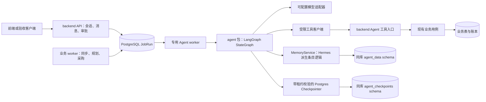
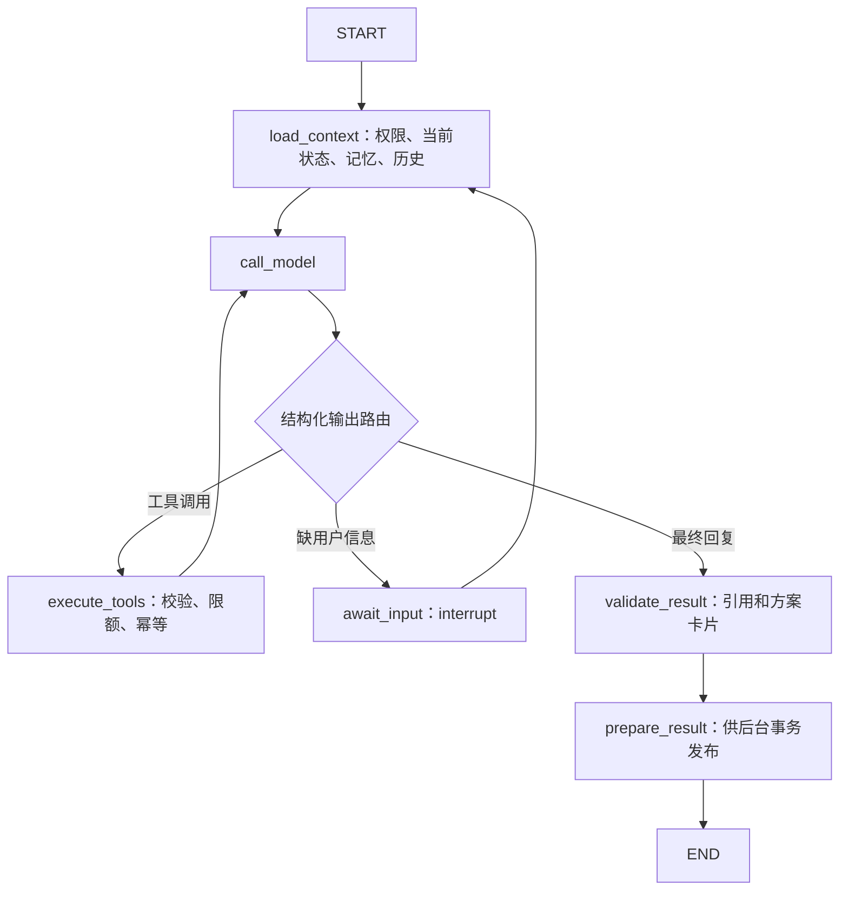

# ShopSteward Agent 首版架构设计

## 2026-09-07 实施对照（优先于下方原始建议）

用户随后明确授权按计划实现，并补充任务 Skill 持续维护和对话方案反馈循环。首版框架已落地；当前源码与运行步骤见 [Agent README](../../../agent/README.md)，实测范围与未覆盖项见 [测试报告](../../reports/agent-v1-test-report.md)。下方原始设计细节保留为规划基线，不代表每个建议均已实现。

| 工作包 | 实际交付 |
|---|---|
| A0 / A2 | 固定 LangGraph 等依赖；官方 PG saver 事务租约保护，含 pending writes；真实 worker 中断恢复及旧 writer 拒绝 |
| A1 / A3 | 会话消息 FIFO、Run/Job、独立 Agent worker、真实模型有限工具图、澄清/resume/cancel、幂等最终回复 |
| A4 | 当前 Mission 绑定的业务工具、只读试算、显式数量约束修订与新 Plan；既有审批保留 |
| A5 | Hermes 固定版本派生条目规则、PG 私有 USER/NOTES、版本化可写补货任务 SKILL、来源与版本冲突 |
| A6 | 持久事件水位与指纹、用户开启的周期跟进、无变化不调用模型、运行中事件保留后继 |
| A7 | 11 个真实操作、当前知识读取/编辑、模型与 EvidenceProvider/SkillProvider 扩展接口；外部 provider 尚未装配 |
| A8 | 联合自动回归与真实模型/进程核心闭环通过；详见报告，未把原计划全部故障矩阵标为完成 |

实现调整：通用偏好放 USER，任务偏好和流程放 `SKILL(task_type=replenishment)`；用户明确命令可以增改删，当前版本每个模型节点重新加载。一次性的数量限制放 Mission.task_constraints，在本轮采购成功后清除，不写长期记忆、不改变现金 Policy。对话循环通过新 Run/澄清恢复组织，确定性试算、Plan 版本和批准仍归 backend。

实际知识 API 是 `/api/v1/stores/{store_id}/agent-knowledge`；没有新增原草案 `/agent-memories`。历史上下文采用最近80条消息窗口，暂未实现 Conversation 语义摘要。外部 SkillProvider 是只读扩展接口，已落地的用户任务 Skill 由版本化知识服务维护；不运行任意技能脚本。没有部署独立 Agent HTTP 服务。

尚未完成原计划中的全部进程故障注入，特别是“记忆提交后 HTTP 响应丢失”的真实进程场景；工具回执重放、版本冲突与租约失效有集成测试。完整故障矩阵、长期负载和语义摘要保留为后续加固项。

原始设计日期：2026-09-07。以下为实施前建议，当前实现及用户补充以顶部实施对照为准。

依据：[定向调研](../../research/2026-09-07-agent-framework-research.md)、PROJECT_CONTEXT/HANDOVER、实际 B0 源码与接口快照。本文解释本轮推荐选择；[实施计划](../plans/2026-09-07-agent-framework.md)给出文件和验收顺序。

## 1. 目标与范围

首版要实际完成：用户围绕 Mission 对话，真实模型调用受限经营工具，解释当前 Plan 并提供可核验引用；明确偏好可跨会话记住、纠正、删除；来源或方案发生重要变化后在页面关闭时继续跟进，重启可恢复。

采购依旧使用 B0 的精确审批和执行；Agent 只能请求重新检查或展示既有待审 Plan。B1 预测不作为前置，先使用现有 FixedForecastProvider。

本次首版交付命名为 **B2-A Agent 基础闭环**。它包含有界长期记忆与相关经历读取，不等于旧完整 P0 的全部 L-01 程序性技能学习。自动修订技能、向量 RAG、真实预测、多 SKU 优化单独扩展；其接口位置在本设计中给出。

工程要求：结构正确、功能完整满足要求、没有赘余设计。沿用 Python >=3.11、Windows/PowerShell 开发及 PostgreSQL；所有金额使用既有整数分契约。

## 2. 三种接入方式与推荐

| 方式 | 好处 | 代价 | 结论 |
|---|---|---|---|
| API 进程内直接执行图 | 首次连通简单 | 请求断开/重启、模型慢请求和 API 生命周期耦合 | 不作为持久首版 |
| 专用 Agent worker + 同一 JobRun，agent 是独立 Python 包 | 复用已验收的领取恢复，模型拥有独立槽位，只有一套调度 | 仍与 backend 在部署、队列、DB 上耦合 | **首版推荐** |
| 独立 Agent HTTP API + 自己的持久 Run 执行器 | 模型依赖和部署完全独立 | 双方 Run 状态、取消、幂等 dispatch、恢复及状态核对都需协议 | 多消费者/独立扩容时实施 |

推荐方案是对旧 planned Agent HTTP 设计的明确细化：保留服务契约为未来部署边界，本轮不宣称 `/agent/v1/runs` 已实现，也不搭建没有消费者的 HTTP 空壳。



`backend/app/agent_bridge` 管理产品侧会话、任务入口、触发、授权与结果发布；`agent/src/shopsteward_agent` 管理主图、模型、上下文、记忆与扩展适配。agent 包不导入 backend ORM/业务模块；backend 在 Agent worker 的装配点注入具体实现。

**业务 worker 默认 profile=business，Agent worker 显式 profile=agent。** business 保留原 8 类 handler 和周期扫描；agent 只领取 agent_followup，默认并发 1，可测试后提高。Agent 依赖通过 backend 可选依赖组引用 workspace 包，普通 API/业务 worker 不导入 LangGraph。现有 Runner 的按 handler 名称过滤领取能力可以复用。

## 3. 数据归属与最小对象

首版同一个 PostgreSQL 应用数据库，不新增数据库服务。选择同库的实际原因是 checkpoint/记忆写入必须能与 JobRun 租约校验组合为本地事务。schema 表示归属，不宣称自动提供数据库权限隔离；运行身份的实际授权应在部署说明列明。

| 数据 | 权威位置 | 关键字段与约束 |
|---|---|---|
| Conversation | backend 新表 agent_conversations | id、principal_id、store_id、mission_id、default 标志、active_run_id；用户+Mission 只有一个默认会话 |
| Message | backend 新表 agent_messages | id、conversation_id、seq、role、content、run_id、references；用户消息不合并；最终回复每 Run 唯一 |
| AgentRun | backend 新表 agent_runs | id、conversation_id、trigger、trigger_key、input_message_id、状态、job_id、版本、输出、错误、usage、取消标记、工具凭证摘要 |
| 业务触发积压 | backend 新表 agent_triggers | 单调 seq、conversation_id、source_key 唯一、引用、发生时间；持久化事件，供合并消费 |
| ToolInvocation | backend 新表 agent_tool_calls | run_id、invocation_id、tool、args_hash、状态、结果/引用、error；同键异参数冲突 |
| Memory scope | agent_data.memory_scopes | principal/store/target 唯一、version、字符预算；并发写锁作用域 |
| MemoryEntry | agent_data.memory_entries | entry_id、scope_id、revision、kind、content、source_message/run、valid_until、supersedes、deleted_at；旧版本保留 |
| Checkpoint | agent_checkpoints，上游 saver 建表 | 由 LangGraph 管理；不通过产品 API 原样输出 |

经历首版从已完成 AgentRun、工具记录和结果引用生成查询投影，不再存一份全量 Experience 副本；需要独立结果评价、跨任务标签时再增加 Experience 表。正式数据模型实现时写出外键与唯一索引；不得凭这些表名宣布迁移已经完成。

三个 ID 的语义：

- `conversation_id`：属于某个用户、店铺、Mission 的会话；跨设备继续使用相同 ID。
- `agent_run_id`：一次用户输入或一次合并触发；恢复仍用同一 ID。
- `graph_thread_id`：首版等于 agent_run_id，检查点隔离一次运行及其恢复；conversation_id负责产品会话历史。同一会话只允许一个未结束 Run，排队消息逐条处理，业务触发可合并。新Run从产品消息/摘要组装上下文，不继承已取消或失败Run的未完成节点。

不同会话共享该用户/店铺的有效长期记忆，不能共享完整聊天或另一用户的私有记忆。首版 Mission 必填，与既有契约一致；将来通用店铺聊天通过新会话类型扩展，不提前引入没有当前使用者的通用 Agent 任务系统。

会话摘要与实际消息历史分开，摘要保存在Conversation并记录covered_through_seq。图只载入有界近期完整消息组、摘要、引用和必要业务快照；工具调用及结果必须成对，不截断半条工具交换。每次新 Run 重置轮数、工具计数和上一 Run 的临时结果。这个选择不使用LangGraph来保存跨Run整段聊天的唯一副本，避免取消/失败Run污染新输入；LangGraph专注单Run内部的持久执行。

每个Run固定input_through_seq，加载上下文不能看到排在它之后的用户消息；摘要覆盖范围不得越过这一水位。恢复仍保留相同输入边界，仅重新查询当前业务事实和有效记忆。

## 4. 主图与运行语义



主图直接采用 StateGraph，不增加 Supervisor/多个自主业务 Agent。节点既有确定性读取，也有模型判断。工具循环逐次执行；先在节点内完成参数和权限检查，再调用实际工具。

最小状态包含 messages、active_run_id、context_refs、state_version、memory_scope_versions、loaded_skill_refs、model_turns、tool_calls_count、pending_question 和 final_result。认证令牌、数据库连接、模型 Key、租约 token 放在进程内 runtime context / 注入依赖，不能进入 checkpoint 或模型上下文。

建议初始配置：每 Run 最多 8 次模型调用、12 次工具调用，最多 1 次格式修复；总执行预算 90 秒，单模型请求 30 秒，单业务 HTTP 请求 10 秒。所有请求还受剩余总预算约束；限额耗尽返回结构化原因。数值是首版保守起点，需真模型验收后调参，不是性能承诺。

AgentRun 状态：QUEUED → RUNNING → SUCCEEDED / WAITING_INPUT / FAILED / CANCELLED。WAITING_INPUT 恢复仍用原 Run；恢复通过新的执行 Job，原 Job 已成功完成“暂停”这一执行段。其排队状态可返回 QUEUED 并保留 pending_question，图实际使用 Command(resume=...)。

只对真实澄清使用 interrupt。采购建议引用 Plan 后可以正常完成当前 Run；用户审批和采购结果到达时创建跟进 Run。这样不让采购审批长期占住整个会话。

恢复前校验 interrupt_id、conversation owner、当前 Run、输入幂等键和当前权限；先重新加载业务状态，再继续推理。取消撤销工具凭证并阻止后续副作用和最终回复发布，正在进行的模型请求可能已产生费用。取消 AgentRun 不取消 Mission，不撤销已审批采购。

## 5. 模型适配及结果契约

`models/factory.py` 根据配置构建模型客户端；首个实现使用 langchain-openai 的 ChatOpenAI 标准 Chat Completions 路径。图依赖 ModelClient 接口，不读取全局 OPENAI 环境配置。

配置：provider、base_url、model、api_key_file 或环境变量、request_timeout、context_budget、completion_budget、supports_tools、supports_json_schema、supports_streaming。后面三项必须来自明确配置与对应兼容性报告，不从供应商名称猜测。base_url 只能来自部署配置，不能由模型工具参数指定。

首版以非流式完成一轮并保存最终消息为验收基线；产品可轮询 Run 状态。SSE 为后续展示能力，不能成为后台任务的驱动器。HTTP 连接断开不影响持久任务；重连读已保存结果。

结果包含 response_text、references、proposed_actions、warnings、usage 和 model/prompt/graph/tool_catalog/memory_adapter 版本。工具和 API 返回的引用组成允许引用集；模型只能引用该集合。采购卡片从 backend Plan 投影生成，携带 plan_id、plan_version、state_version、proposal_hash、expires_at；不信任模型输出的数量和金额。

自然语言本身仍可能有错误，验收要测关键数值和表达。确定性校验能保证引用存在、卡片金额来自后端，不能宣称完全消除了幻觉。来源陈旧、无权限或资料缺失时必须暴露状态。

## 6. 工具与授权

首版目录：get_mission、get_plan、get_dashboard、get_action、read_timeline、read_sales_summary、request_check；记忆工具单列 memory_edit，经历读取 read_experiences。工具目录是显式名称到实现的映射，每项声明参数 schema、返回 schema、权限、是否有副作用、deadline、去重规则及输出长度。未装配的能力不出现在模型工具列表。

backend 新增 `/internal/v1/agent-tools/{tool_name}`，路径与参数分别进行校验；调用既有 repository/用例，不通过管理员 token 重放公共 API。agent 包通过固定基址的 BackendToolClient 调用它。

每次有效领取 Agent job 时，后台生成随机短期工具 token，只将摘要存入 AgentRun；明文留在进程内。工具请求必须匹配 RUNNING Run、其当前有效 Job 租约、token 摘要和过期时间，并重新核对 principal 当前用户/店铺权限。新 attempt 换 token，取消/终止立即失效。凭证来自运行授权，不从用户消息解析。

工具参数不能选择 principal、store、任意 URL 或 auth scope。工具中的 mission_id/plan_id/action_id 必须属于绑定 Mission/店铺。运行授权是“部署允许 ∩ 当前用户权限 ∩ 本次任务允许”的交集；request_check 要求 operator。view-only 用户可问答，但不能安排检查。

不暴露 approve/reject、execute_purchase、advance_scenario、SQL、shell、任意文件和任意 HTTP 工具。用户说“批准”时呈现对应 Plan 的既有审批入口，不把普通消息当批准。

**幂等单位：**服务端生成 invocation_id（Run+模型轮次+调用序号），模型的 tool_call_id 仅做协议关联。首次记录 args_hash；重放同键同参数返回已保存结果，同键不同参数返回409。request_check 在 backend 事务内复用现有命令与检查合并；工具回执和受保护的实际效果在同一事务提交。网络失败不自动创建另一个 invocation_id。

## 7. Hermes 记忆适配

采用“修改后复用条目核心 + PostgreSQL 权威记录”，不直接 import 上游 `tools.memory_tool`。适配代码集中在 `memory/hermes_policy.py`，注明 commit、原函数、许可证及改动。项目自有存储、授权和版本逻辑集中在 `memory/service.py` / `postgres.py`，不伪称这些功能来自 Hermes。

MemoryService 对图暴露：

```python
class MemoryService(Protocol):
    async def recall(self, scope: MemoryScope, query: str) -> MemoryBundle: ...
    async def apply_changes(
        self, scope: MemoryScope, changes: list[MemoryChange],
        expected_version: int, operation_id: str, source: MemorySource,
    ) -> MemoryMutationResult: ...
```

这里是设计接口而非已存在代码。MemoryChange 支持 add/replace/remove；修改使用 entry_id 和 revision，内部确需文字匹配时保留 Hermes 的歧义拒绝规则。MemorySource 引用真实用户消息或实际 Run，不接受凭空 source_id。

首版两个持久目标均按 principal_id+store_id 隔离：USER 存表达/格式偏好，NOTES 存稳定业务背景。USER 默认1375字符、NOTES默认2200字符；预算为活动注入内容的预算，历史版本不反复注入。人物敏感信息、密钥、动态现金库存、未经证据支持的推断不进入活动记忆。授权共享店铺记忆需要后续单独设计。

写入事务：锁 scope → 读取最新版本 → 基于副本计算最终结果 → 核对来源/版本/预算 → 写新 revision 和工具回执 → 最后锁定并核对 Job 当前租约与取消状态 → 提交。失败全回滚；任何模型调用不在事务里。并发冲突返回最新版本，只允许有界重新读取与重算。

对明确“记住/以后用/改成”的低影响用户偏好，本次运行可自动保存，成功后才说“已记住”。不需要引入每条偏好的逐次审批。无法可靠判断来源或内容类型时只用于本轮上下文，不静默提升为永久记忆。

删除与纠正立即提升 scope version；下一个模型节点重新加载变化 scope，不能只在进程启动时加载。历史 checkpoint 可能包含旧内容，恢复时必须依据有效记忆版本重建提示块；历史审计可保留，但不得再次激活被删除条目。用户删除记忆与物理删除所有聊天/备份不同，后者需独立数据保留功能。

来源、当前用户说明、经营事实之间的优先级由代码和提示一起实现：工具/策略仍是权威；记忆只补充偏好和背景。“以后保留500元现金”可以记录为未落实意图并指向正式策略配置，不能在记忆层替用户改 B0 现金底线。

首版按用户/店铺读取活动记忆，经历按 Mission、关键词和时间范围查已完成 Run；没有先建向量库。记忆不可用时读问答可降级并标记 memory_unavailable；写失败不得声称成功。主回复失败不重复完成过的记忆操作。

## 8. 恢复、并发与事务

### 8.1 三层控制

1. JobRun 控制执行段的持久领取、租约和重试。
2. Conversation.active_run_id 与待执行队列保证同会话按消息序执行；WAITING_INPUT 占用会话槽位，用户可恢复或取消，业务触发继续积压。
3. 所有权校验分别保护 checkpoint、工具效果、记忆变更和最终发布。

不能仅在最终 apply 检查租约：旧图可能在失去租约后继续写 checkpoint，影响新执行者。每次 checkpoint 写入都必须保护 `aput` 和 `aput_writes`。

Run还需与Job终态收口：on_error在确认不再重试时保存失败并释放会话槽；现有recover_expired会直接把耗尽尝试的Job改成FAILED而不调用业务on_error，因此agent专用before_claim执行有界终态核对，关闭仍占槽但Job已终止的Run并安排下一条。按Conversation SKIP LOCKED领取候选，不等待一个忙会话阻塞所有领取。WAITING_INPUT对应的已成功暂停Job不被错误关闭。

### 8.2 带租约保护的 saver 组合

backend 装配 `CheckpointWriteFence`；agent 的 saver 包装通过注入回调进行校验，不导入 Job ORM。一次写入使用独占借用的 psycopg 连接和显式 transaction：锁 Job并核对 token/未过期 → 调用绑定同一连接的官方 saver 写入 → 再以 clock_timestamp 核对期限 → 提交。任何异常回滚整次写入。连接不能在外层 transaction 未结束时被别的协程复用。

该事务只含 SQL 和有界序列化，不含模型/HTTP，不跨越整张图。checkpoint 使用 agent_checkpoints 的固定 search_path；Job 表必须显式 public.job_runs。setup 在独立迁移命令执行，不在此事务里做 DDL。默认禁用 pickle fallback，不引入 beta delta 通道；按实际序列化类型配置限制。

这是必须通过固定依赖版真实 PG 实验的实现点：主动抛错、写入中租约到期、换 token 后旧 writer、并行 put_writes、重启后读取。实验不通过时不能降级为只有最终输出受保护，也不能声称首版自动恢复成立。

### 8.3 故障处理

| 断点 | 恢复行为 |
|---|---|
| 模型返回前崩溃 | 从已保存 checkpoint 重试，可能重复模型费用 |
| 工具效果已提交、checkpoint 尚未保存 | 同 invocation_id 返回原回执 |
| 记忆已提交、图重放 | 同 operation_id 返回原变更，版本不重复提升 |
| checkpoint 后、最终消息前崩溃 | 从图结果继续最终发布，assistant Message 按 Run 唯一 |
| 旧租约任务继续运行 | 不能写 checkpoint、记忆、工具效果或发布结果 |
| 模型429/暂时5xx | 单请求最多1次短重试，受总预算；整个job遵循现有有界重试 |
| 模型401、非法配置/未知工具 | 结构化失败，不无限重试 |
| Agent停机 | B0业务worker继续；待办留队列 |
| 图版本升级 | Run固定graph_version；保留旧执行器直到旧Run结束，无法匹配时明确失败/人工重试 |

不在生产启用带写工具的任意 time travel；离线回放使用录制工具结果。所有取消仅阻止后续动作，已发生的事实仍由 B0 正常核对。

## 9. 后台跟进

新会话通过 operator 显式设置 followup_enabled。首版周期默认300秒、最小60秒；通过现有业务 dispatcher 扩展负责登记。Agent worker 自己不再运行第二个业务定时器。

事件来源使用已持久化的 Plan/Alert/Action/timeline 事实：新 Plan、风险出现/恢复、Action 受理/异常、到货、Mission 暂停/结束。事务内只写轻量 agent_trigger 记录，不调用 LLM。对 Agent 自己的消息/检查请求不直接生成反馈触发，避免循环。

消费策略：用户消息绝不合并；同会话未处理业务触发合并为一个 Run，冻结其 consumed_through_seq。运行期间的新事件留待后继；完成发布和消费水位同事务。暂停 Mission 停止经营建议类自动跟进，但已发生采购的结果可留终态通知；取消/完成后不再周期提出新采购。followup关闭后停止自动唤醒，用户主动问答仍可用。

周期先执行确定性变化检测（state_version、current_plan_id、警报/Action状态指纹），不因时间到就消耗模型。无变化且无新事件直接推进到期锚点。最小通知间隔默认60秒，可合并；这只是产品去重策略，不改变 B0 原始事件与账本记录。

产品“后台通知”首版是保存 assistant Message、Run结果及必要 timeline引用，用户回来可读。外部邮件/飞书/短信发送需要独立通知适配和用户授权，不包含在本包。API GET 不触发模型、不补记忆、不安排任务。

## 10. 对外 API 与旧契约差异

| 入口 | 首版用途 |
|---|---|
| POST /api/v1/missions/{id}/conversations | 创建私有会话；可设置跟进，要求相应权限 |
| GET /api/v1/missions/{id}/conversations | 列出当前用户可见会话 |
| POST /api/v1/missions/{id}/messages | 保存消息并入队，202；可省conversation_id使用默认会话 |
| GET /api/v1/missions/{id}/messages | 按conversation_id与稳定游标读取消息 |
| GET /api/v1/agent-runs/{id} | 输出状态、结果、引用、usage和可展示的执行摘要 |
| POST /api/v1/agent-runs/{id}/resume | 回答澄清；绑定interrupt_id、幂等键 |
| POST /api/v1/agent-runs/{id}/cancel | 幂等取消Run |
| PATCH /api/v1/conversations/{id}/followup | 启停/改频，版本校验 |
| GET /api/v1/agent-memories | 只读展示自己的记忆与来源，store/target筛选 |
| PATCH /api/v1/agent-memories/{id} | 用户直接纠正或逻辑删除；expected_revision、幂等 |
| POST /internal/v1/agent-tools/{tool_name} | Run绑定授权的内部调用，不直接向页面开放 |

读写权限不仅看 store，还要看 conversation owner；同一店铺的其他用户不能读私有会话。新 B2 路由显式覆盖x-phase=B2并标work-package；不为新增 Agent 路由重写整套 B0Router。

旧 AgentRun 增加conversation_id、WAITING_INPUT、pending_question、版本及取消字段；Message增加conversation_id/seq；ProposedAction的SUGGEST_PURCHASE必须绑定有效Plan。旧模型契约仅有文本输入，需新增工具请求/结果及能力开关说明。补充设计稿先标 planned，实现后才更新runtime和清单。

## 11. 后续接入结构

| 接入对象 | 首版保留的接缝 | 真正实施时增加 |
|---|---|---|
| 其他模型/本地服务 | ModelClient + factory | 专用字段映射、协议能力报告 |
| 真实预测B1 | backend ForecastProvider与现有Plan读取 | ML实现；图继续读取backend结果 |
| 文档RAG | EvidenceProvider.search(query, scope) 返回带来源的片段 | ingest/检索/重排、来源授权、过期与引用验收 |
| 程序性技能 | SkillProvider.list/load，结果带version/tool requirements | 首先只读；再做候选修订、激活、回退及应用记录 |
| 经历记忆增强 | ExperienceReader查询现有Run | 有需求再引入结构化Outcome或向量索引 |
| 外部数据/工具 | 显式ToolSpec与工具执行入口 | 逐项权限、幂等、deadline及回执协议 |
| 独立Agent服务 | AgentExecutor.execute(request, context) | HttpAgentExecutor、远端持久Run、取消及结果核对协议 |
| 外部通知 | 已保存Message/Run作为通知源 | 对外通知适配、发送授权、送达去重 |

首版可以只有未装配时返回空集合的只读 Evidence/Skill provider，不能注册没有能力的模型工具；没有抽象插件发现、动态下载或任意技能脚本执行。接口只出现在真实装配点和对应上下文加载节点中。

## 12. 首版验收与边界

- **A-01真实运行：**真模型读取Mission/Plan并说明40件方案及80件被现金底线淘汰；引用与后端一致；关页面后任务仍完成。
- **M-01跨会话记忆：**会话A指定简报顺序，会话B实际应用；纠正后采用新值，删除后不再注入；不同用户/店铺隔离。
- **F-01持续跟进：**SC01需求变化、新Plan及采购/到货事件自动生成有依据的跟进；无变化期间不反复模型调用。
- **R-01恢复：**两个Agent worker竞争、运行中强杀、旧租约晚写、工具响应丢失、记忆写后崩溃、最终发布前崩溃均不重复可观察效果。
- **B0回归：**模型断网/Agent停机时原业务worker的同步、检查、采购核对照常；SC01最终现金400元、应收200元、现货70、在途/预留0。
- **P-01授权：**跨用户/店铺、伪造Run、过期token、viewer请求检查、提示诱导审批/推进模拟全部拒绝。

测试层次分开报告：确定性测试、真实PG/HTTP故障、真模型功能/行为。模型验收使用固定场景与版本，建议每个核心情境至少3次观察稳定性；权限和账本不变量必须全部通过，语言一致性不能用“测试全部通过”掩盖人工评价失败。

仅框架测试或假的模型回复不能满足A-01。完整L-01技能学习、长期负载、生产SLA、部署独立性、模型策略收益都不在本次已证明范围内。
