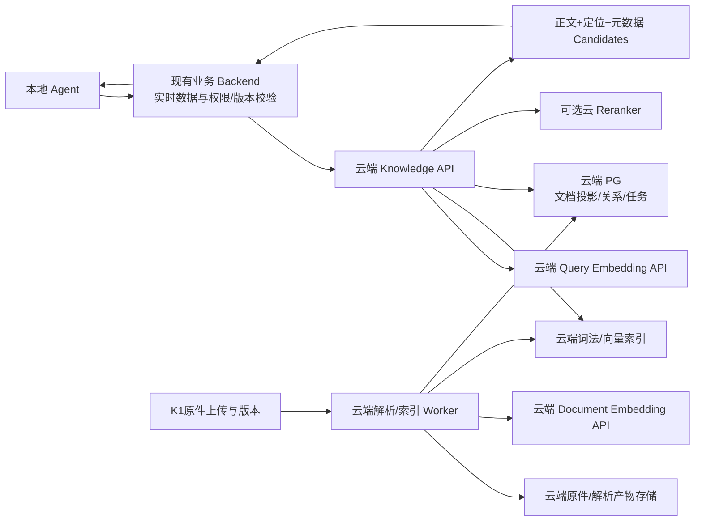

# 云端知识检索与扩展语料设计

2026-09-07，依据K0–K1完成后用户新增要求。本文更新后续方向，不改变已冻结K0结果，也不表示K2–K5已经实现或云资源已经开通。

## 1. 已确认要求与推荐方向

- 资料由助手主动寻找或合成，规模和业务覆盖足以评价检索价值；原40份资料只承担回归与解析兼容检查。
- 允许资料正文、查询和候选片段发送给云端模型。MVP不建设额外企业隐私设施；沿用已有门店、版本和基本身份校验，避免错误业务回答。
- 文档embedding和query embedding均优先云端API；本地推理只作可选成本/速度对照，不作为首版依赖。
- 知识索引、关系存储、解析/索引worker和检索API部署云端；本地Agent获得带正文与元数据的候选证据。
- 区域暂不限定，按本机端到端实测选择。云区域不等于模型实际推理区域。

建议先验证“云端CPU服务 + 云embedding API + PG关系/元数据投影 + 可替换向量存储”。上云部署方向已明确，但pgvector/Qdrant/OpenSearch及模型仍须实测，不能把部署偏好当成引擎胜出证据。独立Neo4j和自托管GPU均不作为首版前置条件。

## 2. 资料规模：质量集、检索规模集、压力集分开

不存在让RAG自动有价值的最低文件数。目标是资料超出合理单次上下文、问题需要选择有效证据，而且检索优于全文塞入/标题或关键词搜索。不能为了得出“必须用向量”的结论故意破坏词法基线。

| 集合 | 计划规模 | 用途 |
|---|---:|---|
| K0原基线 | 已有40原件版本、60核心问+12关系问 | 保留现有hash、结果与缺陷回归，不扩写覆盖 |
| 扩展试运行 | 先交付200独立逻辑文档；版本另计 | 检查主题覆盖、合成质量、真实解析和云索引全链路 |
| MVP检索规模集 | 1000独立逻辑文档，另约200历史/未来/修订版本 | 作为入库目标；预计8000–20000块，仅为估算，实际解析后统计 |
| 独立效果题集 | 300题：100 dev、200 frozen test | 评价真正的证据/答案质量，不由压力文件自动扩增题数 |
| 压力集 | 同一有效语料逐级扩到1万/5万/10万块 | 单独命名、隔离索引，只报告负载、过滤、增量与延迟 |

1000独立文档的初始配额：公开行业/设备/商品资料100、合成供应商条款180、商品使用与包装说明320、经营SOP160、活动要求100、复盘与异常案例140。配额是采集/写作目标，不是当前已存在的文档数。公开资料未能满足质量或使用条件时报告缺口，不将章节、多语言镜像或合成资料冒充新增公开来源。

目标覆盖约8个模拟门店、40个模拟供应商、300个模拟SKU与12个月事件跨度。与现有K0饮品/简餐/零售场景衔接；不同门店/时间/供应商的区别必须改变适用条件或处理方式。实体不是现有生产业务实体，后续用独立测试租户与显式ID映射导入，不能直接向现有门店写入数百SKU。

### 2.1 公开资料

首批来源已查找并记录在[来源目录](../../research/2026-09-07-knowledge-public-source-catalog.md)。覆盖采购验收、储存、食品撤回、剩余食品捐赠、卫生流程、标识与追溯、过敏原信息。

每份来源保存publisher、title、URL、language、jurisdiction、发布日期（无法确认则null）、访问时间、实际原件hash、使用条件、获取状态。目录命中不等于原件已入库。记录正文版本，不能把网页抓取时间当生效时间。

同一文件不同语言/HTML/PDF表现共用source_family_id，独立来源只计一次。长手册按章节切块但仍计一份逻辑文档。香港行业指引标明HK适用背景，不自动视作所有门店的制度；公开行业资料作为背景，门店正式采纳关系另行表达。

公开可阅读不等于可任意再分发。原件采集检查站点使用条件；不能获取或不适合保存全文时，只保留链接与短来源说明，source_kind=reference_card，明确它不能支撑目录中未保存的具体条款。不得绕过访问限制。

### 2.2 合成经营资料

先定义可核对的业务场景与时间线，再独立写成合同附件、商品说明、异常处置流程、活动要求、复盘等文体。每份文档至少有一个可检索的业务决定、适用条件和来源定位，只有改名字/改编号的模板副本不计质量配额。

可合成商业场景：预约收货窗口、缺件补交、包装匹配、起订组合例外、退货证明材料、活动替代品要求、设备异常后的升级流程、不同版本的条款替换。食品安全数值和法律要求不得编造后冒充行业事实；涉及这些要求时使用有来源的内容或明确“查阅厂商/当地指引”，不为凑难题任意改温度阈值。

保存scenario_family_id、source_family_id、作者/生成模型与版本（实际使用时）、生成输入hash、synthetic=true、事实清单、有效期与冲突说明。所有模拟供应商/事件/数字在正文和metadata都标注模拟。合成资料只证明管线与模拟任务表现，真实业务效用另需实际用户问题验证。

质量闸门：内容hash去重；去模板后相似性聚类并审阅高相似簇；每批20份做内容抽查；全部执行实体引用/时间区间/版本链/单位一致性检查；每类至少覆盖否定、例外、缺失信息、近似但不适用的资料。保留差异真实的难负例，过滤无意义填充文本。

### 2.3 题集与关系集

300题配额：精确/元数据40、关键词40、同义语义60、跨文档条件综合60、无答案/冲突40、实时业务混合60。关系问题作为其中60题的交叉标签，不能额外相加扩大分母。

同一场景家族及其改写题统一分到dev或test；资料本身均可进入检索语料，test是查询/答案/调参隔离，不是把正确来源排除出索引。避免生成器把答案句或gold locator写进query规划输入。标注包括必要证据集合、允许替代证据、缺失条件、应调用业务工具的部分。

关系先以Supplier/SKU/DocumentVersion/SOP/Campaign及有来源关系表达；MENTIONS、APPLIES_TO、SUPERSEDES、REQUIRES_EVIDENCE、条件化兼容关系分开。边数量由真实场景需要产生，不设置凑边数目标。每条文档边具备source_version_id、locator、条件、有效期和assertion_status。合成世界中确认的边标记synthetic_verified，不混同真实机构确认。

## 3. 部署边界与数据流

本地Agent运行编排与业务工具，不下载完整索引或embedding模型。默认一次search取得足量候选正文；确需更多上下文时按稳定ID批量取证据，避免每个chunk一次跨区域请求。资料文本是被引用的数据，不升级成Agent执行指令。

K1当前与业务表/权限绑定，不能简单复制到云端后形成两套权威。首版采用明确投影模式：现有backend仍是文档权限、版本及业务ID权威；新增可重试的入库任务把原件及metadata revision发送云端；云PG存派生文档/关系/索引generation，不允许独立更改权威字段。云端只发布确认完成的generation，索引失败保持旧代。

SearchScope由backend生成；云端先按门店、有效版本及generation过滤，返回后backend批量检查revision与有效引用，再交给Agent。MVP不新增复杂权限产品，但不能用错误门店、旧版或未生效条款回答。云投影过旧时返回stale/degraded或空，不假装最新。

由业务记录推导的Supplier→SKU→Mission等关联优先在现有backend查询，再把必要的实体范围送云端；不能把云端关系缓存当实时库存、现价、当前任务状态。以后迁移全部backend/PG到云端属于独立部署工作，不在这里悄悄迁移现有8000/8001。

## 4. 引擎与模型的收敛方式

| 方案 | 优势 | 本项目须验证 | 定位 |
|---|---|---|---|
| 云PG+pgvector，关系也在PG | 服务少，复用关系/版本表达，便于精确向量基线 | 中文词法方案、过滤后ANN召回、并发与索引构建负载；原生PG排名不称BM25 | 首个低运维候选 |
| 云PG+Qdrant | 向量负载独立，payload过滤及dense/sparse组合 | 两库投影一致性、中文分词、真实网络及托管推理位置 | 并行候选，不能仅因“上云”自动胜出 |
| 云PG+OpenSearch | 已有K0中文CJK/BM25对照和RAilG适配基础 | 内存/维护开销、明确版本与RRF实现、过滤行为 | 中文词法收益明显时保留 |

先固定同一解析结果比较模型，再用同一批缓存向量比较存储，避免模型×DB全排列。第一轮最多2个云embedding模型：text-embedding-v4的1024维作为中文服务候选，OpenAI text-embedding-3-small作为国际端点对照；具体可运行集合由实际账号/区域/端点决定。旧BGE-M3、Qwen3本地模型仍保留按需对照。商业API模型名不等于某个开源模型权重，不能混记revision。

阿里云官方同步接口列出text-embedding-v4及多种输出维度；实际输入限制、批大小、计价及当前账号可用模型在配置端点时再验证。[官方API](https://help.aliyun.com/en/model-studio/text-embedding-synchronous-api)

Qdrant自托管并不自动获得托管Cloud Inference；其托管版可使用内建或外部embedding模型。[Inference选项](https://qdrant.tech/documentation/inference/)。官方当前说明：EU集群的托管推理在EU，其他区域集群的托管推理在US，免费模型仅在US；故“数据库在附近”不能推出“推理也在附近”。[Cloud Inference](https://qdrant.tech/documentation/cloud/inference/)

首版模型采用托管API，数据库/检索API用CPU实例；不预购GPU。云CPU规格只在200份试运行的峰值内存、首建耗时和并发结果后定，文档数量本身不能决定服务器配置。后续若高频入库/查询使API成本明显增加，再比较同区域自托管embedding的总成本。

知识图谱作为云PG里的有来源关系先实现。Neo4j只有在相同事实集上证明路径维护或查询收益时进入部署方案。当前K0的12题没有证明图数据库必要性，扩大语料也不自动改变这一结论。

## 5. Candidate与检索契约（设计，尚未注册接口）

云端执行exact/metadata限定、词法与dense召回、应用层RRF、可选rerank、有限关系扩展和parent补全。默认词法/dense各50，最多30条重排，返回最多6份证据、6000 token上下文；初始检索总deadline8秒，Agent工具总上限10秒。这些继承预算待测，不是延迟承诺。

每个candidate至少返回：

| 字段组 | 内容 |
|---|---|
| 稳定身份 | document_id、version_id、generation_id、chunk_id、metadata_revision |
| 可用证据 | text、title、section_path、locator（页/段/表/单元格范围）、source_url或原件读取标识、content_sha256 |
| 适用范围 | store_id、entity_refs、valid_from/until、as_of、jurisdiction、source_kind、synthetic |
| 检索解释 | retrieval_channels、各通道rank/score、fusion_score、可选rerank_score；不同分数不冒充置信概率 |
| 证据质量 | parsing_status、ocr_status、truncated、conflict_group、关系路径及逐边来源/限定条件 |

响应级字段：request_id、retrieval_profile、embedding_profile、index_watermark、timings_ms、degraded、warnings、candidates。生产响应不含gold、expected_answer或人工题集提示。

有效版本按查询as_of而非最新上传选择。精确ID或只要当前库存/价格的请求直接走backend，零embedding调用。查询模型超时且词法已有可用结果时返回降级候选；不能伪造向量分或让Agent把非空结果等同充分证据。重排不能补回未召回资料。

## 6. 地域、速度和成本如何实测

账号可用时，最多选择两个可用区域/端点组合进行比较；不为试验采购多个长期资源。记录DB区域、检索API区域、模型实际推理区域、从本地访问方式。优先测试同区域API+DB，模型端点单列，不把跨域往返隐藏在模型时间里。

按相同query/资料/profile，记录首次与稳态分开：本地→API RTT、query embedding、词法/dense、融合/重排/关系/parent、响应传输、完整端到端p50/p95。查询并发1/5/10；入库记录实际tokens/sec、首建墙钟时间、失败重试、增量重建和索引峰值资源。相同输入缓存命中和未命中分别报告。

成本拆为文档embedding、query embedding、rerank、OCR/抽取/生成、云实例/DB/对象存储/流量。以实际计费token乘配置时核验的单价，设置本次试验总额与日限额后再发起付费运行。允许文本出云不自动意味着无限额计费，也不需要用户再次授权数据出云。

容量估算示例：20000个1024维float32向量约81.92MB（仅向量数值）；实际还包括ANN结构、payload、原文、词法索引、关系、WAL/备份和并行generation，不能据此承诺整个数据库只占82MB。

## 7. 交付顺序与接受标准

1. 扩展语料：来源目录→200份试运行→1000独立文档及修订版本；分批验质量，输出真实文件、manifest、来源/合成记录与验证报告。原40份K0不动。
2. K2解析/索引：稳定locator、表格与扫描缺失状态、真实worker、重试、generation发布；先能返回词法证据；修正已复现RAilG两项缺陷。
3. 云端试运行：部署Knowledge API/worker/PG投影及入围向量引擎；接可用embedding端点，先用200份规模测网络和计费，再做1000份首建。Docker Desktop仍由用户手动启动。
4. K3对照：精确/词法、dense、hybrid、hybrid+rerank；关系路径使用相同事实单独消融；根据质量、费用和端到端延迟选择一个默认profile。
5. K4本地Agent：只读search/批量evidence工具，带引用回答，与库存/现价等业务调用组合；失败或证据不充分时明确缺口。
6. K5文档中心：上传、入库进度、版本发布、来源预览、重建/错误重试与引用跳转；操作必须有真实后端状态。

效果接受标准：有证据组Recall@5目标≥90%，必要条件证据覆盖、引用正确、无答案行为分组报告；hybrid相对最佳词法基线应有可解释增益。建议预先登记语义/综合组至少5个百分点的提升目标，并报告样本数、逐题改对/改错及不确定性；达不到时不宣称dense必要。关系层同样按必要证据收益判断。端到端延迟符合预算或明确降级，版本/门店混淆为0。

本轮完成的是新增要求、公开来源查找及此设计的落盘。扩展1000份语料、云模型实测、云部署、candidate API及Agent工具尚未完成；现有实际完成状态仍以K0/K1报告为准。
