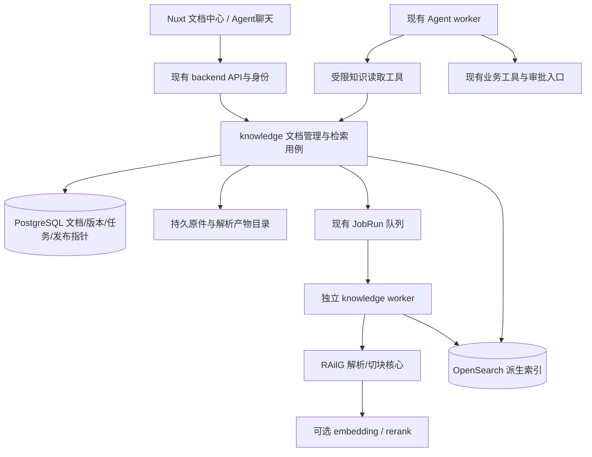

# ShopSteward 文档管理、索引与 RAG 设计建议

> 2026-09-07执行更新：用户已授权K0–K1。本轮范围与选型以[K0–K1执行计划](../plans/2026-09-07-k0-k1-execution.md)为准。原OpenSearch+BGE-M3是候选基线；K1上传为201/UPLOADED/NOT_INDEXED，所有写入支持幂等与CAS（创建无需CAS），真实索引任务在K2接入。下文保留完整后续规划，不能把planned能力当已实现。

日期：2026-09-07。状态：**待评审的规划，尚未实施**。

配套：[分阶段实施计划](../plans/2026-09-07-knowledge-retrieval.md)。

2026-09-07补充：[K0前置数据范围与知识图谱判断](2026-09-07-knowledge-data-and-graph-scope.md)。用户已授权K0，并要求先明确RAG语料与图谱适用性；首批范围细化为40份合成经营资料、原60问加12问关系专项，评估轻量实体关系检索，不提前部署完整图系统。

## 1. 目标与范围

让店主批量录入经营资料，按店铺、供应商、商品、类型和版本管理；既能直接找文件、查条款，也能让现有 Agent 按需检索、引用资料，并结合 backend 的实时业务数据回答问题。

默认首版采用本地文件批量上传，支持文本 PDF、DOCX、MD/TXT、XLSX/CSV；提供解析预览、状态、失败重试、更新版本、归档和引用回看。扫描 PDF 的检测与缺页提示属于首版；OCR/VLM 后端启用列为可选增量。飞书同步单独列工作包，不成为本地录入的前置条件。该默认值是规划假设，可按用户偏好调整。

继续保持：金额和库存由 backend 决定，文档不能修改采购权限、Policy 或审批；已有 USER/NOTES/SKILL 保持原职责。工程原则是结构正确、功能完整、没有赘余设计。

## 2. Indexing 与 RAG 的实际分工

Indexing 是建立查找结构；RAG 是检索证据后让模型生成回答。关键词检索也可以支持 RAG，使用向量查找文件也可以完全不生成答案。文档管理、解析、索引、检索和生成应是可组合能力。

按**问题所需能力**决定路径，不能仅凭扩展名或“是文档”就全部向量化。

| 内容/问题 | 权威存储与索引 | 默认取用方式 | 何时需要语义检索或 RAG |
|---|---|---|---|
| 当前库存、现金、在途、Plan、Action | 现有 PG 表、主键/业务键/时间索引 | 已授权 backend API | Agent 可解释查询结果；不把动态状态复制到向量库 |
| 销售合计、采购成本、供应商准时率 | SQL 聚合；尚无统计入口时单独补 API | 确定性查询 | 资料可解释背景，不能用检索 top-k 代替全量统计 |
| 文件名、编号、供应商、SKU、文档类型、有效期 | PG 元数据与 B-tree；文本名称检索按数据量补索引 | 列表、过滤、精确打开 | 已知文件不必跑 embedding/rerank |
| “找供应商 A 最新生效的交货条款” | 供应商 ID + 类型 + 生效区间 + 已发布版本 | 元数据定位后读取章节 | 多份文件存在歧义时再加全文检索 |
| 明确术语：“截单时间”“缺货替代” | OpenSearch 倒排索引/BM25 | 关键词命中 + 上下文原文 | 用户要解释、比较时可把结果交给 Agent，不强制向量 |
| 长篇 SOP、复杂合同的例外与条件 | 原件 + 结构块 + BM25 + 向量 | 混合检索、父段落还原 | 自然表达和原文不一致、跨章节归纳时收益明显 |
| “少送了货应该怎么处理” | 收货 SOP、部分交付条款 | 混合检索 | 用户说“少送”，原文可能叫“分批履约/数量差异”，适合语义召回 |
| 历史经营复盘和沟通纪要 | 有来源的案例文档 + 日期/实体标签 | 先筛场景，再混合检索 | 找相似情况与经验；查当时具体金额仍回原业务记录 |
| 报价/起订量/交期表 | 文件原件可检索；正式生效数值归业务表 | 指定供应商/SKU精确查字段 | 长篇条款解释可 RAG；文件中的数字不能自动成为规划输入 |
| XLSX 销售明细/大批交易 CSV | 受控结构化导入与 SQL，属于另一个数据接入任务 | 按行列、日期、实体查询 | 不把整表切成文字后要求 LLM 做准确聚合 |
| 小型 FAQ、几十行规则表 | ID/标签/关键词，必要时直接全文读取 | 低成本精确读取 | 同义表达确有漏召回时再加向量，不预设一定有收益 |
| 当前长期偏好和任务 Skill | 现有知识服务及版本作用域 | 按 principal/store/task_type 加载 | 大量历史经历的语义发现可后续增强，不新建第二套活动记忆 |
| PROJECT_CONTEXT/HANDOVER、测试报告 | 开发文档索引 | 开发助手使用 | 默认不进入店主经营知识库，避免工程历史影响经营回答 |

文档初次上传不调用 LLM 分类：用户批量选“供应商资料/SOP/复盘/其他”、可附供应商和 SKU 标签。SOP/复盘/长篇条款默认允许混合检索；短表和目录先做关键词索引。高级选项保留 lexical/hybrid，用户界面不要求理解向量或 chunk 参数。

## 3. 本地资产核查结果

核查方式为 README、目录与关键源码静态阅读；**未运行 IH 测试、模型调用、索引构建或服务部署**，以下不代表当前机器上相应服务可用。

ShopSteward 基准：`YH / 6fb71fa (simulator)`，本次开始时工作区干净。RAilG 基准：`c7048a3`，但工作区存在已修改和未跟踪文件；README、API、配置、sources、Web 等有未提交变化。因此仅固定该 commit 不能复现本次读到的全部行为。实施时要记录所采用文件的 SHA256 和差异。

IH 根目录：`D:/HuaweiMoveData/Users/13736/Desktop/IH`。

| 项目 | 已核查的实际内容 | 建议复用程度 |
|---|---|---|
| railg | 解析、三级切块、表头传播、页码估算、混合检索、重排、父块还原、引用、检索评测；另有 SQLite 管理台 | **主要来源，抽取核心并适配**；不整体部署第二套聊天/账号/数据库 |
| indexing-hub | chunker、PDF/Office解析、附件提取、OCR formatter；上传入口与 Ray Serve/Redis 工作流相连 | 核心算法已有部分进入 RAilG。仅在真实文档解析失败时对照 parser/附件算法；不引入整套 Ray/Redis/HDFS 编排 |
| smartsearch/smart-search | README 描述企业 Elasticsearch 检索服务与旧环境依赖 | 作为检索策略追溯入口；本轮没有全面审计其实现，不优先直接移植服务 |
| formatai/format-ai | 金融单据类型、集中 VLM/OCR 服务及专用部署配置 | 复杂扫描版式出现实际需求再检查具体实现；不把业务专用模板当通用解析器 |
| frontier | Svelte 5 聊天/管理 UI；FileDropzone 有拖放、多文件状态行等展示逻辑 | 借鉴上传交互和来源展示，按现有 Nuxt/Vue 重写组件。聊天附件并不等于已建成知识入库链路 |
| ragbot | README 声称从旧项目抽取核心，缺少 RAilG 后续文档登记/评测/持久会话等能力 | 历史来源与对照，不维护第二套近似实现；本轮只读 README，不给其代码质量结论 |

只在 RAilG 中找到仓库级 `LICENSE`（MIT）。其他目录未在此次文件枚举中找到仓库级许可文件；复制其代码前核查来源和可采用范围，不能从 RAilG 的许可证反推所有上游材料的授权。首版可先围绕 RAilG 做可追溯的选择性复用。

### 3.1 RAilG 核心取用清单

下列路径相对 `IH/railg/`；实施目标统一放入 ShopSteward `backend/app/knowledge/railg_core/`，保持清楚的来源说明。

| 来源 | 用途 | 必要适配 |
|---|---|---|
| `ingest/extractors/base.py`、`office.py`、`pdf.py`、`text_formats.py` | 标准化文本/表格提取 | 接管原件存储；显式报告缺页、截断、公式缓存；补定位类型 |
| `ingest/chunker.py`、`ingest/page.py` | section/context/chunk、短块合并、表头传播 | 与零重叠父块还原一起搬，保留回归用例 |
| `ingest/extractors/layout.py`、`ocr_backends.py` | OCR版式转换与后端适配 | 已存在 Paddle/VLM 类，不是仅有空接口；但本轮未验模型、SDK兼容性和效果 |
| `schema/document.py`、`schema/mapping.py` | 写入/读取/mapping共同契约 | 加 store、version、generation、有效期和定位字段；移除默认公开访问 |
| `retrieval/builder.py`、`processors.py` | BM25/kNN DSL 和过滤器 | 强制作用域过滤，修正关键词无命中语义；补结构化标签过滤 |
| `retrieval/service.py` | 检索、重排和降级 | 关键词模式不初始化 embedding；关闭额外查询改写 LLM；结构化状态区分故障与无结果 |
| `retrieval/parents.py` | small-to-big 和表头去重 | 版本隔离、权限复核、完整父段落/显式截断 |
| `providers/base.py`、`openai_compat.py`、`tokens.py` | embedding/rerank接口与预算 | 使用 ShopSteward 配置注入和依赖锁；不读 IH 的 .env |
| `config.py`中核心组件配置类型 | 解析/检索参数契约 | 只保留实际引用的类型，以显式构造注入；不搬全局配置加载和聊天配置 |
| `generation/attribution.py`、`packer.py` | 来源编号、引用集合和预算 | 只移植引用与装配逻辑，生成留给现有 Agent |
| `evaluation/metrics.py`、相关测试 | recall/nDCG/MRR与回归 | 增加版本、权限、拒答和数值事实边界评测 |

### 3.2 源码显示的接入缺口

1. `railg/api.py:413` 的 `/api/ingest` 接收服务器路径并同步跑完整流水线；没有浏览器上传接口。管理台不能直接满足“拖文件后离开页面、后台继续处理”。
2. `railg/ingest/pipeline.py` 先 `delete_doc` 再 bulk；bulk失败可能只有部分新块。跳过逻辑仅比较内容哈希，元数据、ACL、模型和切块配置变化不能仅凭这个哈希判断无须更新。
3. `DocumentMeta` 默认 `public`，doc_id由路径hash产生。ShopSteward需要服务器生成的店铺内文档标识，不能让同一路径跨店碰撞或默认公开。
4. `store.fetch_siblings` 只按 doc/section/context 查，默认最多50块，没有身份、版本过滤；不能直接用于多店铺、版本化检索。`parents.py` 的窗口可能只还原部分段落，不能声称总是完整。
5. `builder.py` 组合 `bool.filter + bool.should` 时未设 `minimum_should_match`。对存在过滤器的关键词查询，应显式要求内容命中；否则无关键词命中也可能返回过滤范围内文档。这是静态语义发现，实施阶段需要真实 OpenSearch 用例验证。
6. `RetrievalService` 构造时仍会创建 embedding provider；`keyword_only` 跳过向量请求不等于完全不依赖模型配置，需要懒加载改造。
7. XLSX使用 `data_only=True`、把sheet当“页”；DOCX没有可靠分页；单元格文本最长2000字符。数字公式缓存、真实行列位置、截断和PDF复杂表格都需要明确边界。
8. 引用校验目前主要是编号和向量相似度，不能当成严格的事实蕴含证明；检索分数也不是正确率或可信概率。
9. ShopSteward `agent_bridge/tools.py:375` 在持有业务锁的事务内执行工具。远程 OpenSearch、embedding/rerank 调用必须分为事务外读取阶段，不能直接塞进该事务。
10. Agent `runtime.py` 汇总所有成功工具的 references，未区分“曾检索”和“实际引用”；`composition.py` 金额校验只接纳业务工具的结构化金额。引入文档证据后这两处要做有边界的适配，不能关闭现有校验。
11. 当前Agent工具执行与HTTP客户端均有10秒边界；检索需要在该预算内有界降级，或单独、显式调整知识工具预算，不能形成多层互相矛盾的超时。
12. 当前 frontend 仅见 `package.json`、`nuxt.config.ts`，没有已实现的页面目录。因此知识页和最小Agent证据展示要计入新开发，不按“改几处已有页面”估算。

## 4. 三种集成方式与推荐

| 方式 | 收益 | 代价/适用条件 |
|---|---|---|
| **A：复用核心，嵌入当前backend（推荐）** | 一套身份、PG、上传、Agent、前端；保留 RAilG 最有价值的算法 | 需要替换文档登记与发布流程、适配检索权限；新增 OpenSearch 与知识 worker |
| B：直接独立运行 RAilG，通过HTTP调用 | 单人检索演示最快，原管理页可立即研究 | 现有上传、SQLite、单管理员、版本发布仍要补；产生第二套管理状态与身份映射 |
| C：PG元数据/全文检索起步，之后再加向量 | 少一个搜索服务，可先交付查文件功能 | RAilG 的OpenSearch DSL复用率降低；中文召回、BM25与向量融合需重新验证；不保证仅换数据库就等价 |

选择 A 的原因是用户明确希望复用 RAilG，并需要统一文档管理和 Agent 取用。若首批语料很少且精确/关键词检索已经达标，可先交付 A 的文档管理与关键词阶段，延后 embedding；不要为展示 RAG 强行让每个查询调用模型。

## 5. 目标架构



数据权威：原件/解析产物是可重建输入；PG决定谁能看、哪个版本可以使用；OpenSearch是可重建搜索投影。模型生成仍只有现有 Agent 一条主链路。

worker继续复用 Runner/JobRun/租约，新增 `--profile knowledge`，只注册知识类handler。API接收上传后登记任务返回202；解析和embedding不占business worker执行槽位。不引入新的队列平台或通用DAG。

知识依赖放 backend 可选依赖组，解析器和搜索client懒加载。关闭知识功能时，既有API/business worker能正常启动；OpenSearch故障只使文档全文搜索不可用，精确元数据/原文读取和现有采购继续运行。

## 6. 数据模型与版本发布

首版新增三类持久对象，具体迁移ID在实施时读取Alembic head后确定：

| 对象 | 字段和职责 |
|---|---|
| KnowledgeDocument | id、store_id、title、category、supplier_ids、sku_ids、owner_principal_id、visibility(store/private)、metadata_version、status(active/archived)、active_version_id、active_generation_id、created_at/updated_at |
| KnowledgeVersion | id、document_id、version_no、original_name、mime_type、content_sha256、raw_key、normalized_key、locator_manifest_key、valid_from/valid_until、source_kind、source_revision、extraction_profile、quality_warnings、created_by/created_at；原始内容不可变 |
| KnowledgeIndexBuild | generation_id、version_id、job_id、attempt/lease标识、status、stage、expected_chunks、indexed_chunks、embedding_profile、chunk_profile、index_schema_version、manifest_hash、error_code；同版本可重新构建 |

原件和规范化 JSON/Markdown存放 `var/knowledge/` 的持久挂载，使用服务器生成的相对key，不信任上传文件名作为路径。PG不塞整个PDF。备份必须覆盖PG和文件存储；OpenSearch允许重建。改用对象存储属于后续实现替换，不在首版引入独立对象存储服务。

索引块至少包含 document_id、version_id、generation_id、store_id、chunk_uid、section/context/chunk序号、snippet、text_to_index、locator，以及hybrid模式下的semantic_vector。所有用于过滤的字段必须有明确mapping和写入测试。

发布流程：

1. 接收文件并完成SHA256校验；短事务创建版本、JobRun。响应丢失以用户+操作+幂等键找回同一版本与任务。
2. worker在事务外解析、切块、embedding；每个租约尝试创建独立generation，旧worker不能覆写新worker的块。
3. 写入新generation，不删除当前可用generation；检查bulk每项结果、数量、manifest和索引刷新可见性。
4. 在租约保护的PG完成事务内确认文档未归档、metadata_version与目标版本仍适用，再原子切换active_version/generation指针；任务完成和发布同事务。
5. 构建失败保留旧版本可用。失租约或落后版本不能发布，遗留块由后续清理任务处理。
6. 部分解析、扫描缺页、损坏或截断默认进入“需检查”，不自动切换。用户可修正/重试，或明确接受不完整文档；若接受，检索与引用必须带相同警告。

通常文本资料处理成功即可自动启用，不要求每份文档都走人工审批。首次批量上传默认本店共享，界面明确显示；可选择仅本人。更新文件由用户选择“作为现有文档新版本”，不靠同名猜测。

上传先完成lexical构建并发布可查版本；需要hybrid的文档再登记独立增强任务。向量构建失败时保留该版本的lexical generation，不能让embedding不可用阻塞首次资料录入。增强成功后切换同一version下的generation；混合查询仍通过BM25覆盖尚未向量化的文档。

重传相同内容到**同一文档**可以复用解析产物；权限、标签、有效期、embedding模型、维度和chunk配置分别判定，不被内容哈希短路。不同店铺或文档即使内容相同也保留独立身份。

未来生效的版本保留待启用，不提前替换当前版本；首版不做定时发布。过期版本可进入历史查询，但不作为“当前条款”。普通检索默认服务器当前时间；模拟验收需要显式指定与场景对应的 `as_of`，禁止混淆模拟时间和真实生效日期。

归档后立即从PG授权候选集合移除，延迟清理索引不影响可见性。首版归档是可恢复操作，不提供一键永久清空证据。

## 7. 查询路由与证据契约

### 7.1 四条读取路径

1. **精确查询**：ID、供应商/SKU、类型、有效期 → PG → 指定文档/章节。完全不调用embedding、rerank、LLM。
2. **关键词查询**：中文/英文术语 → BM25 + 权限/标签/版本过滤 → 原文片段。无命中返回空，不用所有文档补数。
3. **混合查询**：自然语言 → BM25与向量 → 可选rerank → 完整父段落/有限窗口。用户要找文件时直接返回结果，不自动生成长答案。
4. **综合经营回答**：Agent先取所需业务事实，再按需走1～3，引用证据并表达推断；数值计算/Plan修改使用原工具。

首版不增加独立意图分类LLM。明确ID走精确读取；用户可选择全文搜索；Agent通过工具描述选择。混合检索中的查询改写由Agent已有上下文产生可独立理解的query，不再让RAilG额外启动一轮聊天模型。

### 7.2 权限与版本过滤

服务端从当前principal/store推导scope，模型不能提交ACL、index名或任意店铺覆盖身份。按PG获取当前授权且有效的generation集合，再把store与generation限制同时注入BM25和kNN。空授权集合立即返回空，禁止退化为全库检索。

首版目标规模为每店不超过1000份活动文档，PG授权generation列表支持此规模；这只是设计与验收范围，不是数据库硬上限。超过范围需单独测索引级权限投影方案，不能偷偷截取前1000条造成漏召回。

父段落按版本化解析产物/manifest读取，复核相同授权与generation；不直接调用未改造的 `fetch_siblings`。命中到返回模型之间再检查归档、权限和版本变化。授权检查不能只放在搜索接口：文档预览、下载、工具重放、引用点击、Agent历史消息/检查点重载均需覆盖。

撤权生效后不能通过缓存或下一轮上下文重新暴露内容；已在撤权前合法发送给用户/模型的文本无法追溯收回，不能承诺这一点。撤权与在途模型调用的边界以最后一次授权校验/提交为准，验收覆盖校验前后的竞态。

### 7.3 统一证据结构

```json
{
  "reference_id": "docref_<server-generated>",
  "type": "document",
  "document_id": "doc_<id>",
  "version_id": "docver_<id>",
  "generation_id": "build_<id>",
  "title": "供应商A交付说明",
  "locator": {"kind": "pdf_page", "page_start": 3, "page_end": 3},
  "excerpt": "供应商原文中实际命中的文字",
  "content_sha256": "<actual-sha256>",
  "valid_from": "2026-09-01T00:00:00Z",
  "valid_until": null,
  "retrieved_at": "2026-09-07T00:00:00Z",
  "warnings": [],
  "truncated": false
}
```

此JSON是字段示例，ID/hash/date并非真实已导入记录。PDF使用物理页码；DOCX/Markdown使用标题路径和段落序号，不编造页码；表格使用sheet和行范围，公式缓存未知时标记。跨页引用记录范围，截断不能默认为完整。

返回 `status=ok/no_match/degraded/unavailable` 与 `degraded_reason`。embedding失败允许BM25回退；rerank失败保留召回排序；OpenSearch失败不能伪装“没有相关资料”。无证据或冲突时Agent说明缺口，不能自动采纳最相似或最新文件为真。

Agent只读工具首版三项：`search_documents`、`read_document`、`get_document_metadata`。使用现有工具网关与同一Run租约身份；`EvidenceProvider`可作为搜索实现的内部适配，但不并行建设每个模型节点自动检索的第二条路径。

远程工具采用“短事务认证/重放检查 → 事务外检索 → 短事务复核租约和授权/写ToolInvocation”流程。相同invocation结果可重放，先重检当前权限；同键不同参数409。并发相同调用允许重复只读计算，唯一约束保证仅发布一份结果；不持有store/mission锁等待远端。

默认知识工具仍遵循现有10秒总上限，检索服务目标在8秒内返回或明确降级，给网关和日志留预算；embedding/搜索/rerank使用同一个剩余deadline，而非各自重试10秒。若真实验收不达标，再单独配置知识工具超时，保留Run总预算。

### 7.4 引用与金额边界

`retrieved_references`保存运行审计；`cited_references`只包含回答真正使用且服务端验证过的引用。编号由服务端分配，多次检索去重；模型编造的来源ID不展示。引用点击通过backend授权预览原版本，不使用服务器绝对路径或未经校验的外部URL。

文档中的价格是“资料所述报价”，不能加入代表当前业务事实的 `allowed_minor` 集合。首版采用服务端生成的 `document_quotes` 引用卡呈现原文金额；模型正文保持既有业务金额校验，不自由改写文档金额或据此算采购。需要展示的原文金额从可信定位片段直接截取，保留版本和时间。这样避免关闭校验，也避免合法文档金额导致整段业务回答被覆盖。

资料成为确定性规划输入是独立工作：提取候选字段 → 格式/单位/有效期校验 → 用户确认 → 业务API保存 → backend重算。首版不宣称已自动完成这条链路。

文档内“忽略规则/自动审批/保存为永久偏好”等文字作为资料处理，不能触发memory_edit、修订Plan或改变权限；现有显式用户命令边界继续有效。

## 8. 文档中心与 Agent 使用体验

### 8.1 文档中心

- 列表：名称、类型、关联供应商/商品、版本、有效期、可见范围、处理状态；按实体和日期过滤。
- 上传：拖放多文件、批量标签、逐文件状态；每文件独立请求/幂等键，部分失败不重传成功文件。
- 详情：原文件、解析内容、缺页/截断提示、版本历史、失败原因；PDF页/文档段落/表格行定位。
- 管理：改标签、上传新版本、重新处理、启用已就绪版本、归档/恢复；版本冲突409提示刷新。
- 查找：普通搜索先返回资料列表与片段；“向Agent提问”携带选定document_ids，仍受店铺作用域限制。
- 不把搜索引擎、向量维度、lease、chunk等技术名词放进正常用户流程。重建高级选项仅在管理/诊断位置显示。

建议首版限制：每批20文件、每文件20MiB、单PDF最多200页；上传并发2。它们是待验收的可配置产品默认，不是已测吞吐承诺。大表按行/单元格总量设解析上限，超限明确提示结构化导入或分拆，禁止静默截断。

### 8.2 Agent

首次接入提供最小Mission会话页或可复用聊天面板，复用现有会话/消息/Run API；展示文本、Plan卡、文档引用卡和检索降级提示。不重建整套产品前端，也不把RAilG聊天作为第二个Agent。

当前会话绑定Mission，因此“向Agent提问”先选择已有且有权限的Mission；没有任务时仍可独立查文档/看原文，不暗中创建经营任务。脱离Mission的全局文档聊天需要单独扩展Conversation契约，不计入首版。选定document_ids通过消息的可选字段提交，校验后持久化到对应Run，作为该Run所有知识工具的范围上限；不只把ID拼在自然语言提示里。

选定资料可以帮助缩小范围，但不替代权限验证。日常只问库存时不检索文档；问制度/例外时检索；综合经营问题同时使用业务事实和资料。

## 9. 验收与评测原则

首批准备40份小型中英混合合成语料、60条核心标注问题及额外12条关系专项问题，含两个店铺、供应商同名/商品近似、旧新版本、金额差异、缺页、无答案、材料中恶意指令等。文档明确标为模拟；不能作为真实经营效果证据。具体类别与对照以K0前置范围文件为准。

60问建议分组：精确查找12、关键词查找12、同义表达12、跨条款/复盘8、无答案/冲突8、业务与资料混合8。权限、重启、并发等另作系统测试，不混入检索质量分母。评测集区分调参与冻结验收集，报告原始分子/分母和每组结果。

对照依次为：元数据/关键词基线、BM25、BM25+向量、混合+rerank。相同语料、过滤、父块预算、生成模型和冻结问题；分别报告Recall@5、MRR/nDCG、引用定位正确率、实际支撑、无答案处理、延迟和调用量。少量数据不报告夸大的显著性。

验收硬要求：所有权限/版本/归档/租约场景通过；精确ID与版本查找全对且0模型调用；无结果不返回无关文件；生成不能绕过业务审批和金额约束；指定SC01回归正确。语义检索只有在同义/综合组比BM25有可解释改善且不损害精确组时才默认启用，否则该类语料继续关键词模式。

建议检索质量目标：有证据问题Recall@5至少90%，但必须同时报告样本数量；这是目标，尚无实测。所有答案来源必须可定位；支撑质量由人工核对冻结集关键断言，向量相似度或LLM judge只辅助。

## 10. 外部技术依据与适用边界

- [LangChain Retrieval](https://docs.langchain.com/oss/python/langchain/retrieval)：已有SQL/文档系统可作为工具使用；检索后生成构成RAG，不要求重建所有知识。
- [PostgreSQL 17 Index Types](https://www.postgresql.org/docs/17/indexes-types.html)：结构化等值/范围查询使用合适的数据库索引；不能将全文/向量搜索当作所有查询的替代。
- [OpenSearch Filtering vector search results](https://docs.opensearch.org/latest/vector-search/filter-search-knn/index/)：过滤位置会影响向量召回；作用域约束必须进入实际检索。
- [OpenSearch Hybrid search](https://docs.opensearch.org/latest/vector-search/ai-search/hybrid-search/index/)：关键词与语义可以组合。RAilG当前是自有bool/BM25/kNN组合，不等同于官方最新hybrid pipeline。

RAilG compose固定OpenSearch 2.17.1、JVM heap 1GiB；本次读取的是官方latest说明，不能把新版本能力直接视为2.17.1可用。首轮兼容检查固定实际镜像版本，验证mapping、kNN filter、bool语义和中文分词后锁定；无需为了本计划先升级到latest。
