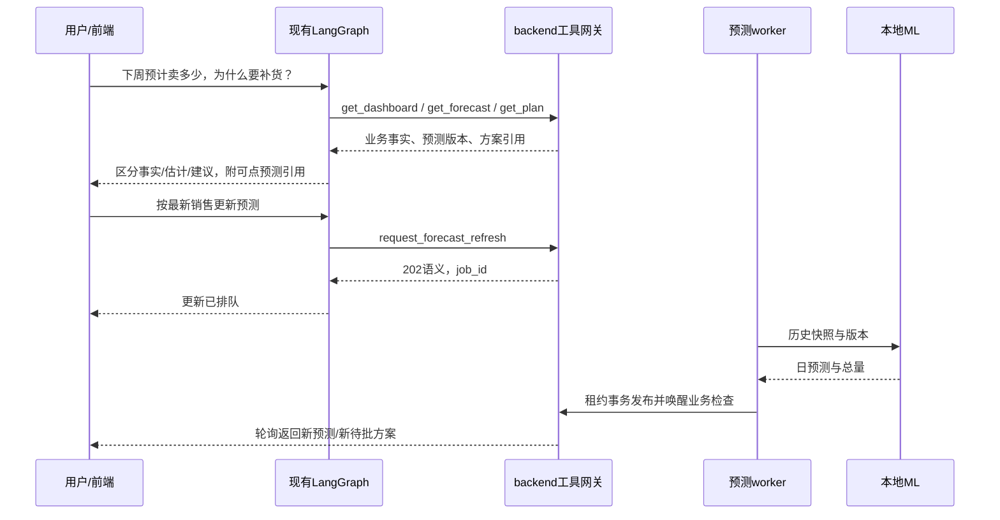

# B1 本地零售预测与经营接入完整设计

日期：2026-09-08。状态：设计交付，代码、训练、迁移及服务接入均未实施。

用户已确定：公开零售数据训练与独立评测，再接模拟器演示；本轮要求完整设计，从目标、数据和训练到 backend/frontend/LangGraph 调用。工程基准为本地 `YH / 4ff1e2d`。本文中的新增文件、端点、参数及门槛是待实施规格，不代表现有能力。

配套：[总实施计划](../plans/2026-09-08-local-forecast.md)、[A 数据/训练/推理](../plans/2026-09-08-local-forecast-model.md)、[B backend/模拟回放](../plans/2026-09-08-local-forecast-backend.md)、[C 前端/LangGraph/验收](../plans/2026-09-08-local-forecast-product.md)。

## 1. 目标、使用者与首版范围

为门店经营任务提供可追溯的短期数量预测。离线目标是门店 × 商品的观测日销量；业务使用时明确标为“基于历史销量的需求估计”。模型不直接决定采购量，不计算或更改现金账本，不审批，不使用 RAG 文本直接改预测。

首版完整闭环：公开数据预处理 → 时间切分 → 基线/机器学习实验 → 冻结模型 → 本地 HTTP 推理 → backend 异步校验发布 → 现有规划/审批 → 前端查看预测与来源 → LangGraph 按权限读取和请求刷新 → 独立回放比较经营结果。

| 范围 | 确定规格 |
|---|---|
| 主数据 | M5 官方提供的 `sales_train_evaluation.csv`、`calendar.csv`、`sell_prices.csv` |
| 初始规模 | 500 条门店 × 商品序列，按训练期统计分层、固定种子抽样 |
| 预测 | 日粒度，未来 1～7 个完整自然日；主要评价 7 天累计销量 |
| 主模型 | 一个跨商品共享的 LightGBM，直接多步样本池，`horizon_step` 为特征 |
| 基线 | mean7、mean28、seasonal7；零预测只用于诊断，不参与默认选型 |
| 训练/运行 | 本地 CPU；Python >=3.11，沿用 uv workspace；不要求 GPU、云训练或模型微调 |
| 首版经营 | 单店、单 SKU、单供应商、固定 7 天活动结束时点 |
| 界面 | 现有经营页面嵌入预测详情与图表、现有聊天展示预测引用 |
| 回放 | 独立 `REPLAY` 场景；SC01/SANDBOX 兼容保留 |
| 不确定性 | 首版不返回未经校准的区间，不显示“准确率/置信度百分比” |

完整首版不包含：潜在需求恢复、促销因果效应、自动定价、供应商到货预测、多 SKU 联合优化、在线训练、任意新商品泛化承诺、完整财务结算。FreshRetailNet 缺货建模作为后续独立实验，不混入本轮训练或指标。

## 2. 现有代码核对与必改接缝

| 现有入口 | 已核对事实 | 本轮设计要求 |
|---|---|---|
| `ml/pyproject.toml` | 空依赖、不可安装包 | 新增可安装 `shopsteward_ml`、CLI 与推理服务 |
| `backend/app/planning/snapshot.py` | `prepare()`直接实例化`FixedForecastProvider` | 规划读取已发布投影；HTTP 在独立预测 Job 中执行 |
| `backend/app/operations/repository.py` | 销售减库存/增应收，同时扣减剩余需求并复制预测版本 | 固定模式保留；日级模型模式不套用实际销量直接扣预测的旧算法 |
| `backend/app/planning/schemas.py` | 快照有总量、来源、版本，无日曲线 | 保留 decision-v1 快照结构；曲线在不可变预测详情中按引用解析 |
| `backend/app/execution/repository.py` | 审批/发送核对预测版本、状态及有效期 | 增加模型可用性检查；不绕过现有现金/版本校验 |
| `backend/app/scheduling/*` | 持久队列、租约、合并与周期扫描已存在 | 新增 `refresh_forecast` 类型，复用 Runner，不建立新调度平台 |
| `backend/app/agent_bridge/tools.py` | 受租约保护的工具注册与调用，已有 request_check/get_plan | 加预测读取/刷新工具；Agent 不直接请求 ML 或读训练目录 |
| `agent/src/shopsteward_agent/runtime.py` | 通用 model/tool 节点、required_tools | 复用已有图；预测能力由后端工具目录与取证策略注入 |
| `frontend/app/components/AgentConversation.vue` | 已保存 Message.references；页面主要展示正文 | 增加可点击预测引用，不把正文解析成业务数值 |
| `simulation/simulator/*` | SC01/SANDBOX、正整数销售事件，无完整日结束事件 | 新增回放与闭日观测，支持零销量日、时间推进和隐蔽需求评测 |

当前 backend 迁移文件 `knowledge_index_delivery_0011.py` 的 revision 为 `0011_knowledge_delivery`，simulator 为 `sim_0003_controls`。实施时重新读取实际 head，再创建预测迁移，禁止修改历史迁移来凑版本。

## 3. 数据取得、范围与可复现性

### 3.1 获取和保存

来源优先为 M5 主办方仓库链接的官方 Dataset，Kaggle 官方下载为替代入口。下载时记录最终 URL、取得日期、原件字节数、SHA256、使用条款来源；登录/来源不可取得时报告缺少原件，不悄悄换镜像或合成数据。大文件放 Git 忽略的 `var/forecast/data/raw/`，Git 保存下载说明、manifest 和小型合成测试夹具。

三个原件必须来自相容版本：以 sales 的 `d_*` 集合连接 calendar；校验连续天号、门店/商品唯一键、销量非负整数、价格键 `(store_id,item_id,wm_yr_wk)` 唯一及正价格。缺少价格不能当零价。保留原件、标准化 Parquet、series 清单、split manifest 和特征清单各自的 hash。

### 3.2 标准数据行

`series_id, store_id, item_id, dept_id, cat_id, state_id, date, day_index, sold_quantity, sell_price, price_observed, available, event_name_1, event_type_1, event_name_2, event_type_2, snap_flag`。

`available` 只按当时已知上架/价格记录判断；缺记录、未上架与真实零销售分别保留。模型不具备 M5 缺货真值，不将零销量自动解释为缺货。训练数据日历遵循原美国门店日期；州映射时区：CA→America/Los_Angeles、TX→America/Chicago、WI→America/Chicago。时区数据依赖 `tzdata`，Windows 不依赖系统已有 IANA 数据。

首版特征集 `sales-calendar-v1` 使用历史销量、已知日历、训练期拟合的分类映射，不使用价格作为模型特征；价格原件用于可用性检查与后续消融的输入准备。这样回放使用独立 CNY 价格时，不会向美元价格特征输入人民币。价格特征实验只能作为不同的 `feature_profile` 另报，不混用主模型。

### 3.3 固定 500 序列

设全部可用天号最大值 `T`；要求 T>=1000 且 calendar 完整。仅以 `d<=T-112` 的统计筛选：至少365个已在售日、至少28个非零日。按照食品/家居/爱好三类与零销量占比三组（<0.3、0.3～0.7、>0.7）分层，在层内按训练期均销量排序后等距分段随机抽取，种子 `20260908`。按各层候选数量比例分配500个名额，余数按层名排序分配；不足层名额顺延，候选总量不足500时失败并记录原因。

保存精确 ID 清单及每条序列的训练期分组。不得根据测试期销量、测试误差或曲线好看程度删换序列。高/中/低销量分组用训练期均销量的三分位数冻结；同值按 ID 排序。

### 3.4 时间切分与标签可见性

| 区间 | 定义 | 用途 |
|---|---|---|
| 初始训练 | `d<=T-112` | 抽样、类别映射基础、候选训练 |
| 验证 | `T-111..T-56` | 8个非重叠7天窗口，选择超参数和最强基线 |
| 测试 | `T-55..T` | 8个非重叠7天窗口，冻结方案后的最终评价 |

验证起点 `c=T-112+7*k`；测试起点 `c=T-56+7*k`，k=0..7，目标均为c+1..c+7。每个训练行的 origin=t 和 horizon=h 必须满足 `t+h<=训练截止日`；不能只截 origin 而让标签越界。历史变换、缺失处理、类别编码都只 fit 当前训练分区。

验证窗口按其起点重训，训练最多取最近730天。early stopping 使用该起点之前末28天的完整标签作为内层验证；外层7天不参与 stopping。选定配置后，用8个验证窗口最佳轮数的中位数取整为最终轮数，重新在`d<=T-56`训练一次。最终模型在56天测试期间不重训；每周起点允许接收已经发生的真实观测更新特征，参数、分类映射、选择门槛均不改变。这是冻结模型的顺序预测评价。

原 M5 28天、全层级 WRMSSE 排名与本项目7天500序列不同，不能将项目分数声称为官方竞赛分数。

## 4. 特征、训练、基线与解释

### 4.1 统一的训练/推理函数

`build_origin_features(history, origin_date, horizon_step, series_metadata, calendar)`只读取日期<=origin_date的观测。

- 历史偏移：`y_t,y_(t-1),y_(t-6),y_(t-13),y_(t-27)`，名称明确为 offset_0/1/6/13/27，避免 lag1 off-by-one。
- 截至t的7/14/28天均值、标准差、和、零值占比；均值7/均值28的比值，分母为0时返回缺失并带标志，不填无穷。
- 目标日t+h的星期、月份、周末、已公布日历事件、SNAP日历，h=1..7。
- 训练期 category dictionary 中的store/item/department/category/state；未知ID映射UNKNOWN，但首版服务对未授权绑定商品返回UNSUPPORTED_SERIES，不宣称冷启动泛化。
- 至少56个连续完整历史日，否则INSUFFICIENT_HISTORY。更早缺失不前向填销量；因不完整观察窗口而不可构造的样本剔除并计数。

直接多步池：每个origin生成7行，同一套特征加h，目标为`y_(t+h)`。一个模型服务所有已绑定序列和7个h，不递归把预测当真实销量。训练/推理必须调用同一函数，特征顺序与类型保存在artifact中。

### 4.2 基线与候选配置

mean7/mean28：各未来日等于最近7/28天均值；seasonal7：h日取`y_(t+h-7)`。全部返回非负浮点，每个基线用同一数据可见性、窗口和评价函数。

LightGBM固定CPU、`num_threads=4, learning_rate=0.05, max_depth=-1, min_data_in_leaf=100, feature_fraction=1.0, bagging_fraction=1.0, bagging_freq=0, lambda_l2=1.0, deterministic=true, force_col_wise=true, seed=20260908`。最多1000轮、early stopping 50轮。候选只取`objective∈{poisson,regression}`×`num_leaves∈{31,63}`，共4组；所有负预测裁到0并记录发生次数，非有限预测为错误，不伪造成0。

内层 early stopping 使用 RMSE。候选选择按外层8窗口平均7天累计MAE最小，其次每日RMSE，再次较少叶数，最后poisson优先。没有无限搜索或看到测试结果再改目标函数。各组训练记录参数、轮数、时间、峰值内存、环境和失败原因；32次候选外层训练的首次预算上限为2小时，超过时标记实验不完整，不以部分组结果宣布胜者。资源不足可另提交100序列诊断配置，不能覆盖500序列正式实验。

### 4.3 可解释输出

每次预测附后端可直接展示的历史7/28天均值、最近7天总销量、未来预测总量、训练范围和局限。模型级importance只作为全局特征使用情况，不能解释为促销因果效应。首版不增加SHAP在线计算；Agent可以说“使用了历史销量和日历”，不能自行断言“增长80%由节日导致”。

### 4.4 版本化制品

`var/forecast/artifacts/<model_version>/`包含LightGBM原生model.txt（或baseline.json）、manifest.json、feature_schema.json、category_mapping.json、series_manifest.json、validation_metrics.json、test_metrics.json、model_card.md和checksums.sha256。模型版本包含配置/训练数据hash摘要，不只用时间命名。manifest包含训练截止、支持ID、最大预测天数、feature_profile、单位、依赖锁hash和promotion_status。

训练结束先冻结模型文件/特征/选择清单的hash；最终测试只补充评测与promotion结论，不修改模型参数。测试报告完成后生成最终artifact整体checksums并封存；同一模型的候选阶段和最终发布阶段保留不同bundle hash，不能把报告写入操作误报为重新训练。baseline同样使用制品格式，algorithm=baseline并显示“统计基线”；可以作为独立基线回放，但不能获得机器学习改善的验证标识。

推理进程启动校验文件hash和schema，载入一个显式版本；运行中不自动追踪“最新文件”。服务只读制品，不可通过HTTP上传、训练、替换模型或传入任意文件路径。回滚使用旧制品目录并重启自有推理进程，backend绑定版本同步变更。

## 5. 效果指标与发布门槛

主要指标`weekly_mae=mean(|sum(pred_7)-sum(actual_7)|)`；同时报告daily MAE、daily RMSE、各h误差、每序列误差、各训练期销量/稀疏组误差、`bias=sum(pred-actual)/sum(actual)`。分母0的组bias为null并单列样本量，不使用MAPE。500序列权重相等的weekly MAE为主；另报总量加权口径，不能偷偷换主指标。

以下为本设计预先固定的验收目标，不是已实现结果：

1. 无未来泄漏、数据/制品可复现、所有输出范围/身份校验通过。
2. 在验证集冻结最强简单基线。主模型最终测试weekly MAE至少比该基线低5%；基线误差为0时只能判持平，不能除0或声称改善。
3. 各高/中/低销量组weekly MAE不得比同一基线恶化超过10%；整体绝对bias<=10%。分组不足30条序列时标记证据不足、保留该组原始结果，不删组。
4. 以7天块为单位做1000次固定种子配对bootstrap，报告改善区间；只有区间下界>0才声称观察到稳定改善。8个测试块证据仍有限，不声称跨地区泛化。
5. 同一机器预热后100次单序列HTTP调用，目标p95<=1秒、全部<=5秒；记录CPU/内存/并发1和4的实际结果。这是本机验收目标，非生产SLA。

状态分别保存`artifact_ready / offline_model_validated / backend_ready / replay_ready / agent_ready / b1_ready`。技术接入可以用明确标记candidate的模型在隔离环境进行；质量门槛不通过时不能默认激活该模型，也不能把基线标成训练模型。实验失败仍要交付报告；再设计实验时创建新版本/新测试协议，不能反复调测试集。

## 6. 本地推理服务契约

独立包`ml/src/shopsteward_ml/`。CPU推理以同步FastAPI端点/有界线程执行，避免阻塞事件循环；训练仅CLI。默认127.0.0.1:8030，Bearer服务凭证只在backend/ML私有env中，前端和LangGraph模型不可见。保留服务端1MiB请求限制、最多365天历史、最多7日目标、并发4，超过并发返回429/Retry-After。

`GET /health/live`检查进程；`GET /health/ready`检查制品hash、模型/特征版本和可推理性，不需连接业务库。就绪返回仅版本摘要，无路径和训练原件。另提供服务Bearer保护的`GET /ml/v1/model`，返回当前已加载的单个制品描述：model_version、algorithm、feature_profile、promotion_status、artifact_hash、supported_series、timezone_by_state、max_horizon_days、minimum_history_days和训练截止日。没有在线模型上传/激活接口；更换版本需先启动加载目标制品的服务，再由backend配置绑定。backend配置变更在写事务外取得描述，事务内再次核对配置CAS，后续推理必须回显同一模型版本。

### 6.1 POST /ml/v1/forecasts

在既有计划契约上新增`schema_version=forecast-request-v1`的精确schema；响应继续提供旧Forecast必需字段，新增详情由backend显式解析，不能直接塞给extra=forbid的旧DTO。请求示例（历史在此只展示字段形状；真实请求必须至少56天）：

```json
{
  "schema_version": "forecast-request-v1",
  "request_id": "forecast-request-001",
  "store_id": "replay-store-001",
  "sku_id": "replay-sku-001",
  "series_id": "FOODS_1_001_CA_1",
  "input_state_version": 7,
  "source_sequence": 12,
  "history_revision": 3,
  "binding_version": 1,
  "model_version": "m5-lgbm-direct7-example",
  "feature_profile": "sales-calendar-v1",
  "data_as_of": "2026-09-08T04:00:00Z",
  "observation_end_date": "2016-04-24",
  "timezone": "America/Los_Angeles",
  "horizon_start": "2016-04-25T07:00:00Z",
  "horizon_end": "2016-05-02T07:00:00Z",
  "unit": "piece",
  "history": [{"date": "2016-04-24", "sold_quantity": 10, "complete": true, "censored": false}]
}
```

`data_as_of`是backend观察资料完整可用的真实时间；`observation_end_date/horizon_*`是经营日历。M5历史日期不伪装成2026年，两个时钟不比较大小。ML内部目标日期从时区日历计算；不以固定UTC86400秒跨DST凑日期。

响应回显身份、输入四版本/序号、请求摘要；提供`forecast_id, source, model_name, model_version, feature_profile, target=observed_sales, daily_predictions[{date,quantity}], total_quantity_raw, predicted_quantity, rounding_policy, unit, data_as_of, observation_end_date, timezone, horizon_start/end, generated_at, valid_until, assumptions, diagnostics`。

日预测保留浮点，`total_quantity_raw=sum(daily.quantity)`；`predicted_quantity=ceil(total_quantity_raw)`，只对累计总量取整一次，`rounding_policy=ceil-total-v1`。全部结果0时允许0；总量超过业务int64范围为422。固定示例[0.2,0.2]总量0.4、业务件数1，不逐日向上取整为2。首次h=7，活动尾期h可为1..6；超出范围422，活动已结束不请求。

ML返回真实时间生成时点及至多1小时valid_until；backend限制`min(响应有效期,接收时间+3600秒)`，再次校验资料时点，不信任供应者自行延长。ML对相同输入摘要返回确定性forecast_id和同一原始预测；并发重试不得生成不同曲线。backend只发布一次，TTL过期后的明确刷新使用新request_id，可生成新发布记录但不训练模型。

### 6.2 错误和超时

422：INSUFFICIENT_HISTORY、HISTORY_GAP、INCOMPLETE_DAY、HORIZON_UNSUPPORTED、UNSUPPORTED_SERIES、FEATURE_PROFILE_MISMATCH、MODEL_VERSION_MISMATCH、INVALID_PREDICTION。503：MODEL_UNAVAILABLE。401：服务身份无效。429：容量已满。响应采用现有error.code/message/request_id/retryable/details口径，详情不含凭据或原始历史。

HTTP connect超时1秒、总超时5秒；backend job最多3次、2/4秒退避，只对网络/429/503重试。422不重试。失联时仅复用**同模型、同历史revision、同scope、同范围且未过期**的已发布预测；否则标不可用并暂停新方案，已发送Action继续原核对。

## 7. backend 持久数据与授权接口

模型运行结果由backend发布成经营预测；服务不能直接连接业务PG。

| 存储 | 作用和约束 |
|---|---|
| 既有 `ForecastRow` | 继续保存最小Forecast、被Plan引用的不可变版本；B1新增记录禁止UPDATE/DELETE |
| 新 `forecast_bindings` | PK(store_id,sku_id)，provider=fixed/http、mode=shadow/active、series_id、model_version、feature_profile、timezone、episode_end、binding_version、history_revision、published_revision、requested_revision、last_job_id、last_error、next_refresh_at、rerun_requested |
| 新 `forecast_observations` | PK(store,sku,date)，售出件数、complete、censored、来源manifest/闭日事件、source_sequence；种子历史与运行观测分别标记；幂等追加，矛盾内容409 |
| 新 `forecast_details` | PK forecast_id，FK到ForecastRow三元键；原始请求hash/响应hash、日曲线、diagnostics、model/feature版本、input/output_state_version、mode、生成/有效期；正文不可变 |

ForecastRow.version为backend生成`local-...`，不能直接使用模型版本；forecast_id作为全局查询ID唯一。原有fixed版本按原流程工作，不对历史数据做推测性补曲线。新详情状态过期由读取时计算，不修改正文。绑定表只保留调度状态，不复制业务现金/库存。以上各revision均为非负BigInteger，binding_version从1开始；首次无结果published_revision为null。Job目标版本字段涉及新请求时同样使用BigInteger，不能将Stock/Store的int64版本截成32位。

绑定另存`last_result_id`（最近shadow或active详情）、`last_refresh_status`、`retry_not_before`；当前active业务版本仍以Stock.forecast_version为权威，不能用last_result_id把shadow覆盖active。详情另有数据库真实created_at、input_hash、artifact_hash、model_algorithm和promotion_status快照，索引(store_id,sku_id,created_at,forecast_id)支持稳定历史分页。同job发布使用unique(job_run_id)；同版本原始结果重试必须hash一致。首次配置允许expected_binding_version=0且必须不存在绑定，后续CAS>=1。

仅绑定REPLAY支持的series和日粒度活动；新建绑定默认shadow，启用active要求模型通过离线门槛且历史完整。schema字段变更用CAS。应用全局`FORECAST_SERVICE_ENABLED=false`默认关闭HTTP调用；SC01不创建http绑定。

### 7.1 公开API

| 端点 | 权限/行为 |
|---|---|
| GET `/api/v1/stores/{store_id}/skus/{sku_id}/forecast` | viewer及门店授权；返回当前状态、active/shadow详情、最近28日观测、能力和最近任务；GET无推理副作用 |
| GET `/api/v1/stores/{store_id}/skus/{sku_id}/forecasts` | viewer；limit<=50，稳定(created_at,id)游标，历史预测分页 |
| GET `/api/v1/forecasts/{forecast_id}` | viewer；先复核所属门店授权，越权404；返回该不可变版本和当前可用性 |
| POST `/api/v1/stores/{store_id}/skus/{sku_id}/forecast-refreshes` | operator；幂等键，绑定版本CAS，异步202返回JobRun；不接受用户填预测数量/历史 |
| PATCH `/api/v1/stores/{store_id}/skus/{sku_id}/forecast-config` | admin；幂等/CAS，允许从服务只读制品清单绑定指定版本，shadow/active切换与显式回退 |

当前状态DTO：`status=UNAVAILABLE/QUEUED/READY/STALE/FAILED/DISABLED`，`usable_for_planning`是后端计算结果，`last_refresh_status`单独展示。有效预测刷新失败时可同时READY与last_refresh_status=FAILED；没有数据返回UNAVAILABLE及null，不能伪造全0曲线。返回`binding_version,history_revision,published_revision,model_version,forecast_id,source,mode,observation_end_date,generated_at,valid_until,stale_reason,last_job_id,capabilities{read,refresh,configure}`。

固定模式读接口返回原预测总量和source=fixed，`daily_predictions=null`、`refresh=false`，不把fixed条款中的“model_name”当成机器学习证明。active模型服务关闭后，其旧结果依有效期显示，过期阻止新计划；不能静默回退到初始60件。

旧fixed数据可能只有本地version而没有可全局解析的forecast_id；适配时forecast_id=null，保留local_version并引用当前Plan或Store。只有新建不可变详情的结果才返回可点击forecast引用，不能在GET中补写详情或构造无法解析的ID。PATCH回退fixed的schema只接受provider=fixed、expected_binding_version、fixed_forecast_version；http配置只接受设计中的模型/series/时区/episode字段，两个分支不得混用。已存在active绑定切shadow时保留原active版本供历史展示，但新规划立即禁用该scope的模型依据，直到显式切回active并重新发布。

改变provider、mode、model_version、feature_profile、series或episode范围的配置事务统一锁Store→Binding，binding_version+1、store.state_version+1，使未执行旧Plan失效；切http active时先等待匹配新binding_version的结果发布。切fixed只能从同scope仍有效旧版本恢复Stock指针/总量并唤醒规划，不能复用模型曲线标成fixed。配置受理不代表新预测已完成；已发送Action不受该失效处理撤销。

## 8. backend 调度、事务与预测生命周期

### 8.1 预测worker

新增`python -m app.worker --profile forecast`，并发1，复用JobRun、租约、重试与Runner；业务profile不领取refresh_forecast，模型变慢不占采购执行槽。训练不在任何worker内运行。预测工厂位于`app/forecasting/jobs.py`，只在forecast profile装配。

新增Job类型`refresh_forecast`及(store_id,payload->>'sku_id')活跃部分唯一索引。扫描沿用`scheduling/dispatcher.py`，增加绑定到期发现和短事务入队，Store SKIP LOCKED在LIMIT前；不是新增业务后台循环。租约到期回收覆盖新job_type。

触发：绑定建立、闭日观测提交、显式刷新、模型版本切换、真实TTL到期。现金、到货、普通30秒Mission检查、聊天读取不会触发重新训练或无条件推理。重复请求合并；RUNNING时更新requested_revision/rerun_requested，完成事务内生成后继。终态失败保留原因，扫描30秒后可对可重试问题重新请求；永久422等待新历史/配置/用户刷新，不能无限重试同一输入。

### 8.2 发布算法

1. 短REPEATABLE READ构造history/scope/序号/state/binding/model/目标范围快照；退出事务。
2. 在事务外调用ML HTTP，校验身份、schema、日期、数值、request_hash、模型/feature版本和输出一致性。
3. apply内按Store→Binding→相关Mission（ID排序）→Job锁顺序；用当前时钟、source freshness复核；所有参与代码统一锁序，尤其事件唤醒路径不得反转。
4. state_version/source_sequence/history_revision/binding_version任一变化则不发布该响应；返回SKIPPED并设置一次后继请求。首版采用保守重新请求，不猜测中途销售与预测的重叠。
5. shadow只存详情，不改Stock、业务state_version或当前Plan；不把shadow结果标为当前业务依据。
6. active在同一事务新增ForecastRow/detail、修改Stock.remaining_demand/forecast_version、store.state_version+1、published_revision和TTL；登记timeline、唤醒ACTIVE Mission重算。Job完成与这些写入受同一租约保护；丢租约全部回滚。
7. identical有效输入命中当前结果时返回REUSED，不提升state_version、不重复通知；TTL失效后的新发布允许新版本，但不生成重复采购。

request.input_state_version是发布前值，detail.output_state_version为发布后值，不伪造模型读取了后端发布后的状态。Job引用包括forecast及store；保留原SourceCursor事件序号。

### 8.3 日级更新与固定模式兼容

- SC01/SANDBOX的fixed/manual销售扣减和DEMAND_REVISED语义保持原样。
- active模型模式发生销售时仍正常入账，但不按实际销量修改旧模型曲线；将绑定标为待更新、当前预测不可供新规划，保留旧详情供历史查看。下一完整闭日更新history_revision后重算。
- 每日结束的观察事件也在零销售日发生，推进simulation_time、历史revision与state_version，使旧预测不能继续被审批使用。关日后新预测只覆盖次日起至活动结束；不是从新预测再减去昨日销量。
- REPLAY场景不允许控制台人工SALE/DEMAND_REVISED混入；若外部DEMAND_REVISED到达model scope，记录来源事件但不切换预测权威，发出明确来源冲突状态；不能使原游标永久卡在这条事件，也不能接受其数量成为模型预测。
- 规划快照读取已发布模型总量和最小引用，`ForecastSnapshot`/decision-v1不新增默认字段，避免改变历史hash。日曲线、解释从forecast_id/version查详情。
- 审批和发送同时要求绑定active、published_revision=history_revision、有效范围与TTL、新鲜来源及已发布版本一致；状态校验缺一不可。已发送Action的核对不受预测失效影响。
- 现有总量规划不检查逐日缺货，UI明确“采购比较按活动剩余总量；每日曲线供观察”。首版不把总量算法声称为交期内逐日优化。

## 9. REPLAY 模拟器与业务实验

### 9.1 独立包与数据隐藏

从冻结测试方案中导出两个逻辑产物：`history_seed`（episode_start之前最近365天或全部可用历史，至少56天）和`environment_demand`（未来7天，仅模拟器可读）。manifest固定源hash、series_id、start/end、时区、split及初始条件。模型artifact不含未来销量；ML只读取请求中的历史。backend/Agent/browser不得访问需求路径。

新增simulator私有`replay_episodes`表保存隐蔽需求、逐日未满足需求、对应日期；不放进当前Run.world/configuration可能被现有GET返回的JSON中。创建只传经本地管理CLI注册的`replay_manifest_id`，不接受任意路径。环境评测导出是本地管理CLI/结束后报告，不加入业务服务凭证可调用的实时接口。

ScenarioCreate/Run双方契约扩展为REPLAY；仅REPLAY允许initial_forecast=null和Stock.remaining_demand/forecast_version=null。bootstrap原件hash和幂等仍适用；initial_history只含已发生历史，单独存forecast_observations，不生成历史SALE账本或改当前现金。旧SC01必须继续有原预测且通过coherent_seed校验。

### 9.2 每日推进

原数据日期映射为经营simulation_time；服务租约和来源新鲜度仍用真实时间。episode_start是本地自然日00:00，episode_end是7日后的本地00:00。供应商报价真实TTL独立，不因历史年份被判过期。

新增advance-day控制：校验期望sequence和幂等键 → 锁run → 对ETA<=当日00:00的订单按action_id到货 → 取环境当日需求D → 实际销售S=min(D,on_hand) → S>0生成既有SALE_RECORDED → 隐藏记录D-S → 发出`DAILY_SALES_CLOSED`事件 → simulation_time推进到次日00:00 → 一次事务保存回执。零销量不伪造SALE_RECORDED。中途故障整日回滚，同键重放不重复销售/到货/闭日。

DAILY_SALES_CLOSED payload为`sku_id,date,sold_quantity,complete=true,censored`；censored只表示当日库存不足，不含未满足数量/未来需求。backend检验sold_quantity与当天已同步SALE事件合计相等，记录观察、推进时间和版本，不再记销售收入。现有apply_event的布尔值控制普通账本写入：闭日分支自行提升state_version并返回False，因此没有第二条销售账本；外层仍保存来源事件、推进游标与唤醒。事件schema新增1.1分支，旧1.0事件继续解析；对旧backend不投递REPLAY事件。

首版模拟器不允许日内手动销售或任意跳时；到货在下一日推进时处理，lead_time_seconds=0的订单可在当天销售前到货，默认1天交期。每次推进前验收driver需等上次闭日同步完成、预测/规划终态和用户审批结果，避免把worker竞态混入模型效果。

### 9.3 实验设计与结果解释

固定30条序列（训练期高/中/低销量各10条），用测试期首个7天窗口建立三套条件：常规、低现金、交期2天。选取规则只看冻结series清单和训练期分组，不看测试结果。三个预测方法：最强简单基线、主模型、可见真实未来的oracle上界；oracle只由隔离评测driver使用，不作为产品模式或模型输入。

初始条件按训练期冻结mean_daily确定：stock=ceil(2*mean_daily)，CNY成本1000分/件、售价2000分/件、pack/MOQ=1；现金底线30000分；常规初始现金=底线+成本*ceil(10*mean_daily)，低现金为底线+成本*ceil(3*mean_daily)。候选取{0,ceil(mean_daily),ceil(3*mean_daily),ceil(7*mean_daily)}去重。交期常规1日、压力2日。都是模拟假设，不是Walmart真实财务。

候选集合和初始条件在三种预测方法间相同；oracle只提供完美需求预测给同一个总量规划器，不能称全局最优采购。oracle使用隔离verifier进程内注入的ForecastClient参照实现，数据仅由评测管理员持有，不注册产品服务端点/模型模式，也不放开普通绑定的校验。模型与基线对照的真实HTTP链路另行验收，不将oracle的进程内适配记为真实ML HTTP。评测driver只在隔离测试环境使用已授权测试用户调用现有审批API；生产Agent永远没有审批工具。真实浏览器验收至少一轮由用户确认。

离线评价使用原数据真实历史；闭环中每日特征用各自世界已经卖出的销量，缺货会导致其历史不同，这属于真实反馈，不能偷补原数据未卖出的量。已发生censored观测标为局限，首版不恢复丢失需求。记录“以观测销量作需求代理”的条件性结论。

报告每episode fill_rate、lost_units、ending_stock、purchase_spend、minimum_available_cash、receivables、订单与账本数量；D=0时fill_rate=null、lost_units=0。没有回款/结算，因此不报告真实利润或ROI。可报告设计代价`J=1000*lost_units+50*ending_stock`（人民币分），两个系数为预设缺货/期末持货代价，不能冒充真实会计损失。

经营增强通过目标：全部现金/幂等/审批约束零违规，模型在90个episode的平均J不高于冻结基线，且低现金/长交期两组平均J均不得恶化超过10%；单列缺货与库存取舍。不通过时仍可报告技术接通，但replay_ready只表示工程验收，b1_ready=false。

## 10. 前端与用户交互

沿用`frontend/style.md`，在当前任务的经营事实/方案依据附近加入ForecastPanel；经营概览可复用组件。保留首页既有工作流，不新增训练后台和独立导航大模块。

- 默认展示“未来7天预计销量/活动剩余X天”、总量、最后完整观测日、预测更新时间、可用性；fixed显示“场景固定需求”，model显示“模型估计”，shadow显示“试运行，未用于当前方案”。
- 展开显示最近28日实际销量实线、未来日预测虚线、清楚的预测起点；无数据留空，零值画0。使用现有ECharts依赖，提供等价数据表与文字摘要。首版不画预测区间。
- 方案卡显示**该方案引用的版本**，详情另显示是否已有更新。切场景后清空旧请求结果；详情请求绑定store/sku/forecast_id与请求序号，晚到响应不可覆盖新场景。
- operator点击“更新预测”→POST受理→显示正在排队→轮询Job/current→成功后刷新方案；202不显示“已更新”。超时保留原键，幂等重试；禁用服务/权限不足/历史不足有明确文字。
- 普通用户看不到原始训练文件路径、服务URL、token、超参数。模型名/版本、评测局限放“来源详情”，不能用“AI已确认”代替预计。
- 通过Nuxt同源Nitro代理调用backend；由runtime生成API types和公开路由白名单，浏览器不可访问8030或Agent内部工具。

## 11. LangGraph 的实际调用方式

复用当前有限工具图、会话、Run、PG checkpoint和ToolInvocation。新增工具由`backend/app/agent_bridge/forecast_tools.py`实现，并合并进`tools.py`目录：

| 工具 | 参数 | 返回/权限 |
|---|---|---|
| `get_forecast` | `forecast_id?: string` | 默认当前绑定任务store/sku；读取预测详情、状态与标准化数字；viewer可用，任意ID须同scope |
| `read_forecast_history` | `limit:1..10=5` | 同任务历次版本、时点和范围；不同范围不可直接解释成需求增长 |
| `request_forecast_refresh` | `reason:string,expected_binding_version:int` | operator，要求当前USER消息明确要求更新；入队并返回job_id，不等待训练/推理，不采购 |

模型不能传store_id/series_id/model_version/history/predicted_quantity。刷新幂等键由run_id/tool invocation生成；FOLLOWUP无权调用写工具。get_forecast可对fixed返回已知总量，对禁用/无结果返回显式状态，不能用失败结果建立预测引用。



明确预测问题在现有evidence_policy中增加预测读取义务；混合经营问题先get_dashboard，再get_forecast/get_plan，文档条款仍走原证据工具。否定查询、通用概念问题不强制刷新。未知表述仍交模型选择工具，不把几个正则当完整意图分类器。

工具返回结构化`{type:forecast,id:forecast_id,version:local_version}`，并保存ToolInvocation/Message.references。回答最终发布前复核scope、权限、当前模型可用性和引用版本：询问当前预测而版本已改变，回答标“生成期间已更新，请刷新”；明确历史问题可引用原不可变版本并带日期。不改写原预测或虚构新模型运行。

前端AgentConversation渲染forecast引用，点击打开同一ForecastPanel历史模式。先提供可核对的结构化引用和数值卡；正文量化结论只允许来自成功工具返回，增加对明确标注总量的确定性核对；该检查不宣称验证所有自然语言因果解释。记忆不保存实时预测量，RAG不替代结构化预测读取。

主动解读仅在用户已开启followup时触发；新预测导致候选数量/警报变化，或可用性在READY与失败之间切换时，复用record_event写持久触发。TTL续期而业务结论未变不额外触发。预测Job在5秒内未完成时，Agent返回排队状态，不持有工具事务循环等待。

## 12. 运维、测试隔离与实施边界

新增私有配置示例：ML_ARTIFACT_DIR、ML_SERVICE_TOKEN、ML_HOST=127.0.0.1、ML_PORT=8030、ML_MAX_CONCURRENCY=4；backend FORECAST_SERVICE_ENABLED=false、FORECAST_SERVICE_URL=http://127.0.0.1:8030、FORECAST_SERVICE_TOKEN、FORECAST_HTTP_TIMEOUT_SECONDS=5、FORECAST_TTL_SECONDS=3600、FORECAST_WORKER_CONCURRENCY=1。模型版本按绑定存PG，不从浏览器提供。

开发启动器增添可选--with-forecast，不自动训练、不自动迁移、不启动Docker Desktop、不重启未知进程。Windows隐藏后台启动并记录PID/日志；macOS入口做同等配置。端口占用先核对；独立验收建议backend8050/simulator8051/ML8052/frontend3050，均可配置，不复用知识验收8018/8020。

PG测试必须显式指定TEST_DATABASE_URL/TEST_SIM_DATABASE_URL且通过库名防护。不并发清理同一个测试库，不运行会清知识验收租户的广泛fixture来替代本轮隔离验证。备份包含backend/模拟器数据库、模型制品、数据manifest/历史种子；本轮不使用存在agent schema限制的knowledge bundle作为完整备份方案。

验证分层：数据与算法纯测试；真实本地ML HTTP；专用PG版本/租约/并发；跨进程闭日/预测/规划/审批；真实浏览器与真实Luna工具调用；全部重启后引用、模型版本、历史预测和账本不变。mock通过不能替代模型效果或真实LangGraph调用。

## 13. 交付清单与非目标

必须交付：数据源/许可证说明与manifest、固定500序列和时间划分、三个基线、主模型训练/推理、冻结实验报告、可加载制品、本地接口、backend发布与回退、REPLAY及条件性经营报告、前端预测展示、真实LangGraph调用轨迹、重启/故障验收、运行手册与更新后的PROJECT_CONTEXT/HANDOVER。

全部门槛完成前状态为b1_ready=false。本设计没有下载全量数据、训练模型、申请云资源、修改开发库或提交业务代码。现有知识检索pilot/MVP状态独立，不因本设计产生进度提升。

### 13.1 设计到实施任务覆盖

| 设计内容 | 实施任务 |
|---|---|
| 数据取得、原件hash、500序列、来源范围 | A1 |
| 截止时间、类别映射、直接多步特征与泄漏控制 | A2 |
| 基线、指标、分组、固定门槛 | A3 |
| 训练预算、选择、原生制品和可复现性 | A4 |
| 冻结测试、模型卡、失败与promotion | A5 |
| HTTP、模型描述、限流/超时、单位/时区 | A6 |
| backend持久模型、不可变引用与迁移 | B1 |
| HTTP适配、独立worker、CAS/租约发布 | B2 |
| 日级生命周期、预测权威、调度与审批 | B3 |
| 查询/刷新/配置/回退及公开契约 | B4 |
| REPLAY种子、隐藏需求、闭日/零销量 | B5 |
| 配对经营实验、恢复与业务指标 | B6 |
| 前端图表/历史/刷新/异步隔离 | C1 |
| LangGraph工具、权限、强制取证边界 | C2 |
| 回答/引用最终复核、用户偏好下的跟进 | C3 |
| 启动手册、真实Luna与浏览器闭环 | C4 |
| 全进程重启、完整回归和交接状态 | C5 |

文档交付时已进行本地链接、已存在接入文件、代码示例语法、计划标题/步骤与占位标记检查。这些检查不执行示例中的待实现函数，也不代表业务测试已通过。

## 14. 原始资料与核对范围

以下官方资料在2026-09-08核对，用于数据字段、工具能力与方法边界；具体选型和阈值由本设计提出，未引用外部性能数字作为本项目结果。

- [M5 主办方仓库和数据入口](https://github.com/Mcompetitions/M5-methods)：数据、基准、比赛说明。
- [M5 官方竞赛指南](https://github.com/Mcompetitions/M5-methods/blob/master/M5-Competitors-Guide.pdf)：单位销量、价格与日历、原28天评测口径。
- [LightGBM 参数说明](https://lightgbm.readthedocs.io/en/stable/Parameters.html)：CPU、Poisson/L2目标和确定性参数。执行时锁定实际安装版本并保留环境信息，不能承诺跨版本/平台逐字节相同。
- [MLForecast 多步方法](https://nixtlaverse.nixtla.io/mlforecast/docs/how-to-guides/one_model_per_horizon.html)：递归与直接预测的参考。本设计选单模型horizon特征池，不宣称它等于该库的每h一个模型实现；首版无需强加MLForecast依赖。
- [MLForecast 时间滚动验证](https://nixtlaverse.nixtla.io/mlforecast/docs/how-to-guides/cross_validation.html)：按预测起点验证的方法参考。
- [FreshRetailNet 数据卡](https://huggingface.co/datasets/Dingdong-Inc/FreshRetailNet-50K)：90天、缺货标记、归一化销量；仅后续扩展参考。
