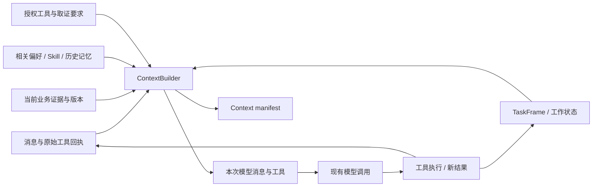
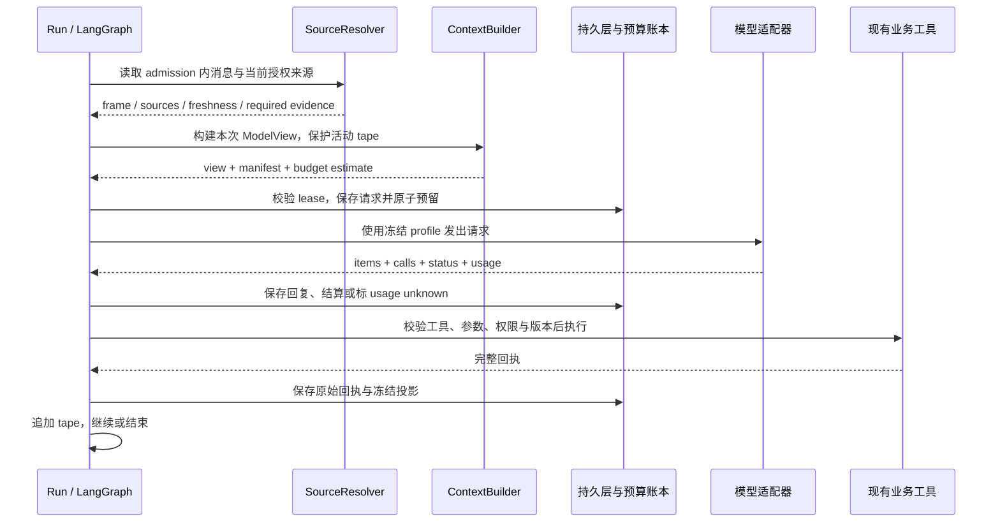

# ShopSteward：Context Engineering 与模型分工完整设计

> 历史分稿。下一阶段统一使用 [设计与评测总稿：Multiagent × Context Engineering × Rubric](2026-09-30-next-phase-integrated-design.md)，其中完整收录业务、架构、模型、评分与阶段交付。本文件仅保留设计来源，以下旧版本表述不再作为独立实施依据。

版本：v1.0 评审稿。日期：2026-09-30。状态：设计完成，产品改造与模型评测尚未执行。与 [多智能体经营异常应对设计](2026-09-30-multiagent-operations-design.md) 共同构成实施依据；本文负责上下文、模型与调用协议，业务计划、审批和采购状态以业务设计为准。

适用对象先是当前 Mission 单 Agent，再复用于未来 Case/专家子图。可用目标是长对话、反复修改和多次取证之后，Agent 仍能使用有效目标、状态和证据完成任务；不是单纯缩短 Prompt。

## 0. 直接采用的设计决定

项目定位：**具有证据与版本管理能力的经营 Agent，按任务复杂度选择模型和专家，通过对照实验说明改进来自哪里。** 课程演示、技术研究与简历共用这一条主线。

| 决策 | 本稿结论 |
|---|---|
| 架构 | 现有 LangGraph 上增加确定性的 ContextBuilder；单 Agent 与专家复用同一套来源、预算、投影、失效协议 |
| 主模型 | 复杂经营任务优先评测 `gpt-6.1-sol`，`medium`；成为默认前通过本项目验收 |
| 轻量模型 | `gpt-6-luna` 承担明确的单任务、TaskFrame 提取和按需摘要；提取错误可绕过派生视图回到原话 |
| 现有基线 | `gpt-5.6-luna` 保留为已接通过的实验对照；代码默认 `gpt-4.1-mini` 与真实实验配置分开登记 |
| 高能力对照 | `gpt-6-astra` 用于少量难例和质量上限实验；不参与默认在线自动升级 |
| 第二供应商 | `deepseek-flash` 作为后续部署/成本候选，单独做协议与质量对照；不在一个工具循环中自动切供应商 |
| 开源研究 | 沿用 `Qwen/Qwen3-8B` 做受限 task policy 的 base/SFT 对照，不承担首版完整经营 Agent |
| 上下文 | 当前任务、关键原话、执行回执和必要证据优先；完整原始轨迹与模型视图分开 |
| 迁移 | CE0 观测 → CE1 单 Agent 可用闭环 → CE2 长对话 → CE3 专家视图与受控路由 |
| 验证 | 模型、上下文策略、多 Agent 三个变量分阶段比较；不一次全换后归因 |

以上模型是**设计推荐与待验证候选**，不意味着本项目已完成新模型接入。官方能力和公开价格核验于本稿日期，模型明细与来源见第 19 节；账户可用性、实际延迟和任务质量仍需实测。

阅读顺序：第 1–14 节说明上下文机制；第 19–21 节是模型选型和协议；第 22–25 节定义接口、持久化及完整场景；第 26–29 节给出成本、实验、实施交付和取舍。

## 1. 结论与范围

将上下文管理做成可测试的 `ContextBuilder`，置于每次模型调用之前。它输出本次模型可见的消息和工具，同时生成能解释取舍的 manifest；原始消息、工具回执和检查点继续完整保存。

优先解决：当前意图和任务状态、预算感知的模型视图、过期结果隔离、工具输出分层。后续再做历史摘要、情景记忆检索和专家专属视图。无需先换模型、升级 LangGraph、引入向量记忆库或改成多 Agent。

| 可用性项目 | 决定 |
|---|---|
| 用户结果 | 长对话后仍能正确试算、修订、澄清和引用；不会恢复已删除偏好或沿用旧方案 |
| 功能指标 | 任务成功、约束保留、过期证据使用、重复澄清、输入 token、成本和端到端延迟 |
| 必需前置 | 来源/版本可追溯、完整消息协议、按模型计算的预算、现有授权边界 |
| 可推迟 | 自动长期学习、通用记忆平台、大规模语义检索、生产缓存优化 |
| 最小切片 | Context manifest＋TaskFrame＋保留原始数据的模型视图压缩，在既有 evaluate/revise 场景验证 |

## 2. 当前实现审查

| 已检查代码 | 当前行为 | 建议变化 |
|---|---|---|
| [jobs.py](../../../backend/app/agent_bridge/jobs.py) | 最多读取 80 条消息，按所属轮次整理，再转 role/content；限制当前 run 输入水位 | 保留轮次/水位，按预算选择完整消息组，携带来源 ID |
| [composition.py](../../../backend/app/agent_bridge/composition.py) | 每模型轮刷新知识；注入中文规则、记忆、当前用户来源、近期文档 refs | 分离稳定指令、任务数据、动态证据，装配类型化 packet |
| [runtime.py](../../../agent/src/shopsteward_agent/runtime.py) | 发送 load_context＋state.messages；本轮工具 JSON 追加到消息 | 模型调用改用编译后的 view，原始 state 保留 |
| [model.py](../../../agent/src/shopsteward_agent/model.py) | 适配两种 API 模式，max_completion_tokens=2048 | 记录 profile/用量并预留输出；不把 2048 当上下文总上限 |
| [evidence_policy.py](../../../backend/app/agent_bridge/evidence_policy.py) | 对部分明确请求强制取证及回答前校验 | 保留，按证据依赖补充新鲜度判断，避免与动态工具筛选冲突 |
| [knowledge.py](../../../backend/app/agent_bridge/knowledge.py) | 用户/门店隔离、版本化偏好与 Skill，显式写入 | 复用版本和来源，不让摘要覆盖当前值 |
| [document_evidence.py](../../../backend/app/agent_bridge/document_evidence.py) | 检索最多 6 个候选，展开最多 20 个块，校验当前引用 | 数量限制外增加 token/字段级选择，保留条款例外 |
| [tools.py](../../../backend/app/agent_bridge/tools.py) | read_experiences 返回已完成任务正文片段及引用 | 后续改为有结果/适用条件的经验卡，不把正文当验证过的知识 |

已有 scope、权限、记忆刷新与证据校验值得保留。未发现统一 token 预算、结构化 TaskFrame、会话摘要或按任务选择上下文的完整层；这不意味着已经测得模型因这些缺口失败。

## 3. 不同数据分别由谁负责

| 信息 | 权威来源 | 模型看到的形式 | 更新/失效 |
|---|---|---|---|
| 身份/权限、连接、凭据 | 服务端 runtime | 只提供必要作用域和能力标签，凭据永不进入 prompt | 每次业务操作校验 |
| 当前用户目标 | 本 run 获准读取的用户原话与修订 | TaskFrame＋关键原句/source IDs | 新输入或澄清形成新版本 |
| 库存/现金/当前 Plan | 业务工具与版本化对象 | 精简事实/对象句柄 | 状态/版本改变使旧数据失效 |
| 文档条款 | 可访问原文版本 | 条款摘录、适用范围、例外和引用 | 版本/权限/发布变化 |
| 当前偏好/Skill | KnowledgeScope 当前版本 | 相关条目及来源/版本 | 当前 scope 决定，不由旧摘要恢复 |
| 本轮已完成/失败操作 | ToolInvocation 和业务回执 | 结构化执行记录 | 不可用文字摘要改写成功/失败 |
| 跨轮讨论/经验 | 消息与历史任务 | 有来源的压缩纪要/经验卡 | 非当前业务事实，按需检索 |

这不是一个覆盖所有内容的单一“优先级列表”。用户可以改变自己的目标；当前现金仍由业务库决定；文档描述条件但不能授权工具。冲突按字段的所有权处理。

## 4. 建议架构



`ContextBuilder` 先采用确定性选择规则；它不是额外一个常驻 LLM Agent。语义提取/摘要可以在新输入或压缩时调用模型，但其花费、错误和时延计入整个任务。

流程：读取 run scope 和输入水位 → 刷新已知版本 → 建 TaskFrame → 确定任务/阶段 → 选择工具和资料 → 分配预算 → 编译完整协议消息 → 保存 manifest → 调用模型。

## 5. TaskFrame：把当前任务从聊天中提出来

推荐字段：`scope, input_watermark, task_type, phase, intent, constraints, source_message_ids, source_quotes, entity_bindings, plan_ref, unresolved, completed_operations, evidence_dependencies`。

例：“先试算最多 40 件；改成最多 20 件，只看影响，先别改方案。”应得到以下模型可见数据，ID 为说明用：

```json
{
  "intent": "evaluate",
  "scope": {"mission_id": "m_example", "store_id": "s_example"},
  "constraints": {"max_purchase_qty": 20},
  "source_quotes": ["改成最多20件，只看影响，先别改方案"],
  "source_message_ids": ["msg_latest"],
  "superseded_constraints": [{"max_purchase_qty": 40, "superseded_by": "msg_latest"}],
  "requested_effect": "read_only_evaluation",
  "plan_ref": {"id": "p_example", "version": 7, "freshness": "requires_check"},
  "unresolved": []
}
```

TaskFrame 是派生视图，不是授权记录，也不是第二份业务 policy。有效 Plan ID/版本来自工具；已完成操作来自回执；语义提取只解释用户意图。提取模型的合法 JSON 不代表语义正确，须保留来源原句并通过任务评测检查。

上面的 JSON 是便于阅读的模型展示投影；实现与持久化使用第 22.2 节带 operator、unit、source_span 的规范契约，不维护两套可写约束模型。

必须区分：上限/精确量/最低量；假设/实际修订；本次约束/长期偏好；取消数量上限/取消请求/取消 Mission；被引用的旧数字/当前目标。无法确定并且影响执行时进行一次必要澄清，不为已知 Plan ID 重复提问。

更新采用带来源的 patch 和显式 supersedes，不凭消息里最后出现的数字更新所有字段。自由文本未涉及的正式 cash_floor 不改变。旧 TaskFrame 作为历史保留。

现有 Mission run 使用 `input_through_seq` 和本 run 的澄清回答；排队但尚未进入该 run 的新消息不能被“最新上下文”提前读入。未来 Case 则采用其 input_revision/撤租规则。两个入口使用不同的 admission adapter，共用 ContextBuilder，不能混淆消息接纳语义。

## 6. 分层选择，而非把所有东西都放进 system prompt

建议每轮包含七类块：

1. 稳定系统规则：身份、工具事实边界、引用规则、回答要求。
2. 当前任务：目标、关键原话、当前意图/约束和未解决问题。
3. 当前必需事实：有效 scope、Plan/状态/证据引用与新鲜度。
4. 相关偏好和 Skill：只选当前任务需要的条目。
5. 相关证据：回答当前问题所需条款及例外；其他以句柄存在。
6. 工作状态：已完成操作、失败原因、仍需补查的缺项。
7. 最近完整交互：保留指代、否定和未结束工具调用所需消息组。

稳定系统规则由应用维护。用户原话、记忆和文档正文即使被应用选择，也仍是数据，不能因为拼接到高优先级消息里就获得更高权限。消息渲染器按模型 API 合法角色表达，明确标注来源；不能制造没有对应调用的 tool 消息。

来源标签和格式化并不能消除提示注入，实际工具权限、版本和金额检查仍在后端。现有 system 中的知识数据可逐步拆到专门的数据块，无需第一阶段重写所有提示词。

## 7. Token 预算与模型视图

`B_input = min(任务配置预算, 模型支持的上下文容量 - 输出预留 - 协议/工具开销 - 余量)`。工具 schema 也占上下文；统计器必须覆盖实际送入适配器的全部内容。不同模型的 token 估算方法和误差需要记录；无法可靠计数时使用保守估算并与供应商 usage 校准。

已有 2048 输出配置是输出上限，不能当输入预算。可先比较几个输入预算档位，选择足够完成任务的配置；没有测量前不声称 8k/16k 是最优。

分配优先规则：

- 保留权限/作用域、当前用户关键原话、有效目标、必要证据和未完成协议组。
- 相关条款连同适用条件/例外整体保留，不能只截取前 N 字。
- 数字事实按字段白名单投影，表格摘要保留数量、金额、版本和失败原因。
- 历史已完成工具结果变成精简回执＋可重读 artifact ref。
- 最后压缩无关旧讨论和可检索背景。

必需块本身超预算时，拆成取证/计算/回答几个模型步骤，或报告超出当前能力的输入范围；不能静默丢掉现金底线、用户否定或条款例外。

不删除原始 `state.messages` 或数据库消息来省 token。保存一份 durable raw trace，另建 `ModelView`。旧回合的 assistant tool_call 与全部 replies 是一个选择单元。Responses 推理工具循环的保护范围更大：当前 segment 从用户输入到最新工具结果的完整 item 序列保持不变，包括 opaque continuation items。工具结果首次投影后即冻结；不能每轮重新压缩同一个活动结果。具体续接、段间重建和权限撤销规则见第 21 节。

## 8. 工具结果分层与按需读取

同一工具保留完整结构化回执供后台校验、卡片和审计使用；模型默认看到任务相关的 summary view。

方案视图至少保留：plan_id、版本、state_version、推荐/选中数量、金额 money_display、现金影响、关键淘汰原因、有效期、目标依赖。不能为了减少 token 丢弃 distinction，如“已受理”与“已到货”、“只读试算”与“已修订”。

文档搜索默认返回有限个有用摘录，包含限定条件、例外和原文定位；标题/摘要不足时再展开。现有 chunk evidence 工具可以复用。业务历史全文重读若需要新 `read_context_artifact`，必须实现真实来源、授权、版本和字数限制后才允许用句柄替代其正文；不能先省略再给出无法读取的 ID。

完整结果的存储与模型投影分开：`raw_result_hash` 和 `model_view_hash` 均记录。旧工具回执可作为历史比较，但默认不满足当前事实取证要求。

## 9. 历史压缩与工作记忆

会话摘要采用结构化记录：已确定目标、用户明确约束、尚未解决的问题、已执行动作/回执引用、已放弃选项及原因、可重新定位的证据、摘要覆盖区间与依赖版本。

摘要不保存或生成模型隐藏推理；它是可展示的任务事实纪要。金额、ID 和执行状态优先从结构化对象投影，不由摘要模型重新编写。

只在历史超过预算或完整旧任务结束时压缩。初期优先确定性的工具投影与 TaskFrame，再引入 LLM 历史摘要。不要每轮都调用一个摘要模型。

摘要保存 `through_message_seq, run_ids, source_hashes, memory_scope_versions, summary_version, invalidation_keys`。压缩覆盖区间不得越过当前 run 水位。摘要生成失败时回退到受限原始视图；不能用残缺摘要替换全部历史。

`through_message_seq` 只是便于检索的上界，不代表区间内所有消息都已覆盖。排队输入、迟到回复会产生空洞，因此同时保存明确的 covered source IDs、run IDs 与 coverage digest；只替换确实被覆盖的旧回合。任务活跃的来源原句单独固定保留，不依赖摘要重新记忆。

避免“摘要的摘要”长期漂移：持久来源仍可定位，必要时从原始消息重建。对关键业务事实只保存指针和历史时点；读取当前值仍走现有工具。

## 10. 三种记忆分开管理

| 记忆 | 例子 | 存储/注入策略 |
|---|---|---|
| 工作记忆 | 本次只试算 20 件，等用户答复单位 | TaskFrame 和 run/case state，任务相关即保留 |
| 情景记忆 | 某次因 MOQ 不满足导致候选被淘汰 | 完成任务卡，按当前问题检索，附适用条件与回执 |
| 长期偏好/Skill | 喜欢表格回答、明确保存的补货流程 | 继续使用 KnowledgeScope，按任务和阶段筛选 |

长期记忆仍保持当前“用户明确要求写入”的语义，不因为新增 context engineering 自动抽取并保存所有对话。自动学习可以另做设计，不是本次前置。

删除/纠正偏好后，旧摘要、tool 回执和经验卡不能重新把它注入为当前偏好。摘要中的记忆字段绑定 scope version；版本变化时删除该派生字段或从当前 scope 重建。历史审计记录仍可存在，不等于继续生效。

“当前现金 800 元”“今天供应商延迟”是动态事实，不能混入长期偏好。经验检索的语义相似度只能用于召回，适用性还要核对任务、条件、时间和来源。

初期库小，用 scope/task_type/实体过滤和少量排序即可；只有实测检索不足再加入 embedding。Skill 选择优先任务类型、阶段、允许工具及条目来源，不把历史成功率虚构为已学习分数。

## 11. 动态工具集

当前工具数量并不巨大，因此动态筛选是后续优化，不是第一优先。先保持现有 catalog 和 required_tools 的正确性。

未来 offered_tools = 授权集合 ∩ 角色能力 ∩ 当前阶段相关能力，并补齐明确取证要求和恢复所需工具。clarify、必要事实读取、可发现的只读能力入口应可用。

不能把 request_check 隐藏后又因旧方案过期无法继续；不能因缓存中有旧 get_plan 结果就跳过 required_tools；不能让主 Agent 委派到看不到必要证据工具的专家。上下文筛选不是权限控制，后端仍校验每次调用。

把取证要求从“工具名执行过”逐步增强为“对应 scope/版本的 EvidenceReceipt 仍满足当前依赖”。先兼容旧 required_tools 字段；缓存读取只有经过同等新鲜度/权限校验并形成回执，才能代替真实重复读取。

## 12. 缓存与新鲜度

稳定系统文本和稳定工具 schema 可用于应用级构建缓存；供应商 prompt caching 能否命中需另行实测，不承诺节省比例。

偏好/Skill 缓存键至少包含 principal/store/task/knowledge version；证据缓存包含文档版本、权限相关版本、发布代次和 hash；计算结果包含完整 snapshot/solver version。TTL 可作为补充，不能单独证明库存或权限仍有效。

每轮 ContextBuilder 的刷新不等于无条件重复查询全部服务。对已经加载且依赖未变的产物复用，对有变化的依赖定向刷新。发布或业务写入前继续原校验；缓存不能延长 Plan TTL 或恢复被撤销的证据。

## 13. Context manifest 与诊断

每次模型调用记录：`run_id, model_call_id, scope, input_watermark, builder/profile/prompt versions, included source IDs/hashes, omitted reason codes, rendered view hash, estimated tokens by category, actual usage, tool catalog hash, freshness checks, compaction events`。

omitted reason 如 stale、superseded、irrelevant、budget、permission、duplicate。manifest 用来回答“为什么模型没看到旧订单例外”“为什么再次调用 get_plan”，不保存隐藏思维。

默认不把私有原文再次复制进通用日志；记录受权限保护的 artifact 指针。调试回放需重新鉴权。原文删除后，hash/结构足以表明曾使用什么版本，但不保证仍能重建已被删除内容；不能以可复现为由绕过删除或权限规则。

## 14. 多 Agent 中的复用

| 角色 | 核心上下文 | 默认不需要 |
|---|---|---|
| Coordinator | 用户目标/修订、依赖图、专家结构化结果、候选引用 | 全部原始合同和每个专家完整消息 |
| Evidence | 需判断的适用性问题、实体标识、相关版本/例外 | 完整现金账和全部销售流水 |
| Impact | 有效需求、库存、在途、时间假设与目标 | 无关合同正文 |
| Options | 目标缺口、资金约束、有效报价、候选比较 | 其他专家全部讨论 |

共享相同 ContextBuilder，不共享一个无限增长的 messages 列表。角色只是选择 profile，身份/权限并不改变。专家返回引用、计算产物、缺项和依赖，主 Agent 可以按需展开证据。

给主 Agent 加更多专家之前，先在单 Agent 上验证 context policy。后续比较时用“单 Agent＋相同 context engineering”作强基线，避免把上下文优化收益归因于多 Agent。

## 15. 实现落点与迁移

新增建议模块 `agent/src/shopsteward_agent/context/`：contracts、builder、selectors、budget、render、summary、manifest；backend 提供 source adapters、鉴权与持久化。纯选择/预算/渲染逻辑不直接依赖 SQL。

集成点：jobs.py 保留 message/run/source 元数据；composition.py 提供类型化上下文与当前来源；runtime.model_node 调用 builder 获得 view/tools；tool_update 同时保存完整回执和投影索引；model adapter 记录预算配置与实际 usage。

先以 feature flag 和 builder_version 在新 Run 中启用。旧 graph_version/checkpoint 使用旧策略完成，或通过显式兼容转换，不在恢复时悄悄改变执行语义。原始 messages 不迁移删除。确定性事实/任务输入可保存于现有 Run output/checkpoint 扩展；跨轮摘要需要按 conversation＋coverage 版本化的持久对象，manifest 必须有调用级来源记录。

影子阶段只生成 manifest/候选 view，不增加实际模型请求，也不改变线上回复；这样可观察预算及省略信息。启用新视图后做隔离任务对照，未经验证不替换现有业务运行配置。

## 16. 验证设计

先选择现有 evaluate_plan/revise_plan、澄清、偏好编辑和文档问答任务，构造：

- 30–100 轮历史插入无关内容，但早期有效约束仍需保留。
- 数量从 40 改 20，再取消上限；0 与 null 分开。
- 只试算→明确修订→用户否定保存，检查 intent 切换。
- 摘要后删除/纠正偏好，确认旧摘要不能恢复它。
- Plan 版本变化、预测失效、文档被替换/撤权。
- 很长工具输出中，决定适用性的例外出现在尾部。
- 工具调用组、澄清中断、重启和排队用户消息边界。

对照：C0 当前窗口；C1 TaskFrame＋版本化块＋确定性投影；C2 加历史摘要/经验检索。先相同模型、相同工具和任务，分别改变一项；多 Agent 在此后单独做交叉对照。

主指标是任务成功和关键条件正确使用，不是 token 越少越好。记录当前/压缩后关键条件召回、过期信息采用、重复澄清、协议错误、模型输入 token、额外摘要 token、P50/P95 延迟和总成本。小样本先做功能诊断；独立测量使用与开发分离的条件组合。

来源存在、语法合法、token 降低都不能替代语义正确性。若某种压缩降低关键条件召回，即使更省 token 也不能作为默认候选。

## 17. 建议交付顺序与简历价值

| 阶段 | 交付 | 直接收益假设 |
|---|---|---|
| CE0 | manifest、分项 token、影子 view | 找到真实上下文成本与遗漏位置 |
| CE1 | TaskFrame、上下文分层、工具投影、完整协议选择 | 减少旧目标和大结果干扰 |
| CE2 | 摘要、版本失效、相关记忆/Skill 检索 | 长对话和跨轮恢复 |
| CE3 | 专家 profile、依赖复用、调用级对照 | 支撑后续多 Agent |

CE1 不依赖自动长期学习、向量库或完整多 Agent 平台。最终可以形成的个人贡献是：实现带来源/版本和预算的上下文构建层，保持原始轨迹可追溯，验证其对长期任务成功及成本的影响。具体提升比例必须来自独立结果，不能把设计目标当简历成绩。

## 18. 设计依据与实现边界

[Anthropic 的 context engineering 实践](https://www.anthropic.com/engineering/effective-context-engineering-for-ai-agents)强调逐次调用选择有效信息、按需读取、压缩和任务笔记。这支持本设计的生命周期思路，不证明任一固定 token 阈值适合 ShopSteward。

[LangChain 官方 context engineering 文档](https://github.com/langchain-ai/docs/blob/main/src/oss/langchain/context-engineering.mdx)区分模型可见视图、工具运行上下文和生命周期管理。本项目采用这些边界，但可以直接在既有 LangGraph 代码中实现；无需为采用新 middleware 示例而升级当前固定依赖。

本轮仅检查源码并形成设计，没有采样真实上下文长度、调用模型或验证质量提升。

## 19. 模型选型：确定职责，再选择可验证的模型

### 19.1 选型前提与证据等级

首版沿用现有 Python/LangGraph/PostgreSQL 和 OpenAI 适配路径；尚无已确认的本地 GPU 服务。公开 API 能力、项目已有实验和本稿推荐必须分别标记。

- 代码事实：`config.py` 默认 `gpt-4.1-mini`；`model.py` 提供 Chat Completions/Responses 两种模式，输出统一为文本、工具调用和 usage。
- 项目实验：`docs/reports/posttraining/repair-v2/dev-repair-v2/decision/B1/manifest.json` 记录官方 API 的 `gpt-5.6-luna`、Responses、prompt v2、1024 输出上限。开发集 199/200 等结果属于受限决策实验，不代表完整经营任务达到同样成功率，也不是 SFT 成果。
- 官方资料：以下价格、模式与容量来自当日实际打开的官方页面，不从 Codex 模型下拉框推断 API 能力。
- 工程推荐：按现有接入成本与任务特征选择候选，最终默认由第 27 节实验决定。没有本项目数据时，不声称某模型在中文条款上一定胜出。

### 19.2 采用的候选与价格口径

美元/百万 token；OpenAI 为 Standard、短上下文、非区域附加费口径。数值只是公开报价，不含业务服务、存储、网络及第三方工具费用。

| 候选 | 普通输入 | 缓存读取 | 缓存写入 | 输出 | 本项目定位 |
|---|---:|---:|---:|---:|---|
| `gpt-6-luna` | 0.10 | 0.01 | 0.125 | 0.50 | 新的轻量候选 |
| `gpt-6.1-sol` | 2.00 | 0.10 | 2.50 | 10.00 | 复杂任务默认候选 |
| `gpt-6-astra` | 10.00 | 1.00 | 12.50 | 50.00 | 少量难例对照 |
| `gpt-5.6-luna` | 0.20 | 0.02 | 0.25 | 1.20 | 已有实验基线 |

来源：[GPT‑6 Luna](https://developers.openai.com/api/docs/models/gpt-6-luna)、[GPT‑6.1 Sol](https://developers.openai.com/api/docs/models/gpt-6.1-sol)、[GPT‑6 Astra](https://developers.openai.com/api/docs/models/gpt-6-astra)、[GPT‑5.6 Luna](https://developers.openai.com/api/docs/models/gpt-5.6-luna)、[官方计费](https://developers.openai.com/api/docs/pricing)。三种 GPT‑6 候选的页面列出 1,050,000 上下文容量、128,000 最大输出；这不是本项目推荐填充量。超过 272K 输入的长上下文有额外倍率，本设计默认上限远低于它。

缓存写入价替代该部分 token 的普通输入价，不再叠加一次普通价。模型输出计费应包含供应商计入的推理 token，不能仅按最终回答字数统计。详细核算见第 26 节。

`deepseek-flash` 当前指向 DeepSeek‑V4.1‑Flash；官方标明 JSON output、工具调用及 Responses 支持。普通输入为 0.15–0.30、缓存命中 0.003–0.006、输出 0.60–1.20 美元/百万 token，差异来自高峰/非高峰。其滚动别名与按时段计费增加复现实验的记录要求。来源：[DeepSeek 官方模型与价格](https://api-docs.deepseek.com/quick_start/pricing/)。

这里把 DeepSeek 作为第二供应商候选，原因是部署选择和中文业务对照价值；没有把它的 JSON output 等同于已验证的严格 schema 遵循，也没有假设它的 Responses 与 OpenAI 的 opaque items 完全兼容。

### 19.3 为什么这样分工

| 工作 | 推荐策略 | 理由与失效回退 |
|---|---|---|
| 当前方案解释、明确数量试算、受限 revise | Luna 主 Agent；保留原话和强制工具取证 | 动作范围小、结果可由后台校验；新模型失败时保留已验证的 5.6 Luna 配置 |
| 含例外的供应通知、多文档适用性、恢复方案协调 | Sol 主 Agent；Evidence 初始同用 Sol | 错判适用性会污染后续全部计算，应先建立较强基线 |
| TaskFrame patch 提取 | Luna，独立结构化请求；每次获准新输入最多一次 | 输出窄且可查原句；提取失败保留旧已验证状态和本次原话，由主 Agent 处理 |
| 历史任务摘要 | 先确定性投影，确需语义摘要再用 Luna | 不让每轮“整理”变成额外工作流；失败就不提交摘要 |
| 库存/资金/候选排名/审批判断 | Python 业务工具 | 数值、权限与版本有明确算法和权威状态，不交给模型重算 |
| Impact/Options 专家 | Luna 解释结构化工具结果，必要时合并为固定节点 | 如果仅转述一个确定性结果，不值得单独启动 Agent |
| 难例质量上限、离线错误分析 | Astra，小样本且保留人工/规则判定 | 能帮助定位能力瓶颈，不能把另一模型的意见当真值 |
| 受限策略后训练 | Qwen3‑8B base 与 SFT 配对 | 与已有计划兼容，可固定权重和模板；属于独立研究支线 |

Sol 是复杂主链的优先候选，而非要求所有调用都用 Sol。Luna 即使便宜，也不应在没有质量检查的情况下垄断“解释用户真正想改什么”和“合同例外是否适用”两个高传播风险环节。可以使用便宜模型提取，但必须让主模型看到关键原句，并测量提取器自身的误差。

不先增加 planner、critic、reviewer 三个常驻 LLM。现有后端已经可以检查数值、版本和执行资格；再加三个模型会扩大费用和故障面，未必提供独立信息。只有开发集中定位到可重复的语义缺陷，才增加针对该缺陷的检查。

### 19.4 开源模型与后训练的边界

沿用 `Qwen/Qwen3-8B` 的理由是已有 B2 方案与数据协议，不是宣称它是当前最佳开源模型。官方模型卡提供 `enable_thinking=False` 硬开关，原生上下文为 32,768；首个受限 policy 实验保持短输入、并发 1 和非 thinking。来源：[Qwen 官方模型卡](https://huggingface.co/Qwen/Qwen3-8B)。

固定 model/tokenizer revision、chat template hash、服务版本、精度/量化、解析器和解码设置。base 与 SFT 必须使用相同配置与 held-out 数据。硬件容量由实际权重、KV cache、并发和框架占用共同决定；本稿不预设某块 GPU 一定够用，也不要求为做 Context Engineering 先租卡。

研究问题限定为：**在同一份带来源的任务上下文下，小模型能否更稳定地产生合法且语义正确的受限业务决策？** 不把完整自主 Agent 的规划、工具循环、长期记忆和全域推理一起塞进一次 SFT。

## 20. 模型配置与路由协议

### 20.1 配置必须显式、版本化

新增 `ModelProfile`，包含 `profile_id/version, provider, model_id, api_mode, reasoning_effort, reasoning_context_policy, max_input_tokens, max_output_tokens, timeout_s, capability_flags, price_version`。key/base_url 由受控服务配置注入，凭据不写进 profile、manifest 或模型上下文。

以下为**开发起始配置，不是已测得的最优值**。输入 token 包括工具 schema、消息协议及本段 continuation 预算；软目标用于触发候选压缩，硬上限用于 admission。

| Profile | 模型 / effort | 输入软目标 / 硬上限 | 总输出上限 | 单请求超时 |
|---|---|---:|---:|---:|
| `mission_light_v1` | gpt-6-luna / low | 12k / 24k | 4096 | 30s |
| `case_main_v1` | gpt-6.1-sol / medium | 24k / 48k | 8192 | 45s |
| `evidence_v1` | gpt-6.1-sol / medium | 24k / 48k | 8192 | 45s |
| `structured_helper_v1` | gpt-6-luna / none | 8k / 16k | 2048 | 15s |
| `summary_v1` | gpt-6-luna / low | 16k / 24k | 4096 | 20s |
| `quality_probe_v1` | gpt-6-astra / medium | 24k / 48k | 32768 | 120s，仅离线 |

输出上限是推理与可见输出的合计预算。8192 对部分复杂任务可能不足；若频繁 `incomplete`，在开发集比较更高上限与 effort，不能把截断后出现的差答案直接归咎于模型。在线时延上限仍服从 run 剩余时间。离线 probe 单独登记预算，不参加“同预算多 Agent”主实验。

所有 GPT‑6 Agent profile 采用 Responses。官方说明 Sol 6.1 和 Astra 的工具调用需要 Responses，Luna 的 Chat Completions 工具调用限制与 reasoning 设置有关。本项目统一路径，避免各角色偷偷落入不同协议。[GPT‑6 使用指南](https://developers.openai.com/api/docs/guides/latest-model)

有 reasoning 的配置不统一传 `temperature=0`；按模型允许参数构建请求。重现依赖配置、来源、重复实验和版本记录，不把 temperature=0 当成完全确定性的保证。对未提供可锁定日期快照的模型，保存请求 model ID、返回 model、调用日期及供应商可得版本字段，并承认云模型无法位级重现。

### 20.2 路由先确定性，后验证收益

首版由已知任务类型选 profile：明确 Mission evaluate/revise → light；供应异常 Case、跨文档例外判断 → main。遇到未分类任务默认 main，而不是凭输入长度判难度。前端无需让用户选择模型。

可升级的信号是业务上可检查的状态：角色允许范围外任务、需要解释的证据冲突、结构化结果经过一次修复仍不合法、约束映射出现歧义。先判断是缺数据、用户歧义还是模型问题：缺数据补查，用户歧义澄清，只有能力问题才值得升级。

V1 不启用自动升级；冻结 light/main 两条静态路由作对照。V1.1 才允许 light → main，最多一次、仅在工具结果全部闭合的 segment 边界、沿用同一全局额度。不能因模型自报 confidence 低而无限重试；不能自动跳到 Astra。

技术故障与质量升级分开：模型 401/403/不支持参数应明确失败或禁用候选；429/5xx/超时最多一次受预算控制的尝试。不得把鉴权失败静默掩盖成“换了便宜模型”。供应商切换只能开启新的 run/segment 并显式记录，未决业务动作先核对回执。

### 20.3 角色分配与预算属于同一棵运行树

Mission 初始沿用 8 次模型、12 次工具、90 秒活动窗口；Case 沿用 14 次模型、28 次工具、150 秒及最多 2 个专家并行。**提取、摘要、修复、重试和专家调用都消耗这份模型额度。** 一次 TaskFrame 提取消耗 1 次，Mission 剩余最多 7 次；单独统计 helper 次数，不能藏在 ContextBuilder 内。

同一次运行冻结 profile map、builder version 和 pricing version。模型设置更新只影响新 run。在线单请求上限取 `min(profile.timeout, run.remaining_time)`；业务设计原来的统一 30 秒变为此规则。用户澄清等待与业务时间继续按原运行协议处理。

## 21. Responses 适配器与上下文压缩的协议边界

### 21.1 当前适配缺口

现有 `OpenAIModel.complete()` 只返回 `content/tool_calls/usage`，没有保留完整 provider output items、返回 model、完成状态、截断原因及 opaque continuation。新 profile 不能仅替换 model 字符串后视作接入完成。

官方文档建议工具循环回传必要 reasoning items，并保持本次用户输入至工具结果的 item 序列完整；这些内容可以是不透明的续接载荷，并不要求或允许应用读取隐藏思维。`max_output_tokens` 用尽也可能没有可见回答。[Reasoning models](https://developers.openai.com/api/docs/guides/reasoning)

### 21.2 V1 选择：应用管理状态、完整保留活动 segment

使用 Responses 的显式 input item replay；`store=false`，不使用 `previous_response_id` 把另一份看不见的历史接在模型视图后。数据库与 LangGraph checkpoint 仍是本项目执行状态的来源。当前固定版本的 LangChain 若不能无损传递必要 items，则在 `model.py` 后增加薄的官方 SDK Responses adapter；不为此重写 LangGraph 或迁移整个 Agent 框架。

设计两层日志：`RawTrace` 保存业务原始内容、完整工具结果和 provider 响应；`ProtocolTape` 保存某段实际发给模型的 items。Tape 中工具内容可以在**第一次发出之前**通过确定性规则投影，但发出后冻结。后续轮次只能追加新 items，不能改写此前工具结果、call_id、phase 或 opaque items。

已结束旧回合可被 TaskFrame、摘要和回执数据替代，不伪造成旧 tool reply。活动 segment 太长时只能：先完成/核对全部 pending calls → 生成可校验的结构化 handoff → 关闭 segment → 清空供应商续接状态 → 以获准的原用户任务和当前工作状态开始新 segment。每 run 最多一次这样的重建；仍超预算则返回未完成范围。pending call、用户 interrupt 或 UNKNOWN 动作存在时不能靠重建跳过它。

segment 重建不会重置模型/工具/时间/成本计数，也不会抹去已完成副作用。业务幂等 key 绑定逻辑 operation 与版本，而不是靠新模型生成的 call_id 防止重复。

### 21.3 更新、撤销与不同模型之间的状态

活动 segment 内新事实以带版本的追加更新表达；旧内容明确为历史，最终执行仍读取后端当前版本。若用户删除当前偏好、撤销文档权限或改变有效目标，不能只在旧 tape 末尾说“忽略之前内容”并继续长期复用：下个模型调用前在安全边界重建视图，剔除失效派生信息。权限失效且无法形成安全边界时停止该模型循环，保留动作回执供恢复。

默认不跨 run 携带 opaque reasoning。研究跨轮 `reasoning.context` 时必须作为独立实验配置；有效值按模型能力登记，不能对不支持的模型盲发参数。不把 opaque items 解密、概述成任务事实或在不同供应商之间转发。

换模型只在无 pending calls 的边界发生；新模型读取来源明确的 handoff 与真实回执。即使某同族模型允许共享续接状态，V1 也统一不跨模型共享，以简化可重现性和失效规则。

### 21.4 请求/回复契约

```text
ModelRequest:
  request_id, run_id, segment_id, profile_version
  rendered_items, offered_tools, tool_choice, response_schema?
  max_output_tokens, reasoning_settings, timeout, source_manifest_id

ModelReply:
  request_id, provider_response_id?, requested_model, returned_model?
  status: completed | incomplete | refused | failed
  content, normalized_tool_calls, replayable_output_items
  usage_raw, usage_normalized, finish_reason?, provider_error_class?
```

schema/refusal/incomplete 分开处理。出现截断或不完整参数时不执行工具；保存真实消耗，可在没有已执行副作用且预算允许时进行一次受控重试。完整工具响应在执行前持久化，重启先读取该响应与 ToolInvocation，避免模型重新生成一组语义重复的动作。Provider 传输层未知是否计费时标记 `usage_unknown`，不将其计为免费。

文本业务回答继续使用现有事实/引用 guards；TaskFrame、summary、专家返回值使用独立 schema，必须通过 schema＋来源＋字段语义检查。严格 JSON 只能减少格式错误，不能证明“最多 20”被解释成了上限。

## 22. 核心数据契约

下列是新增内部 DTO 设计，均不是现有公开 API。实现使用 Pydantic 严格校验、显式 schema_version 与规范化 JSON hash；未知字段不静默接受。

### 22.1 AdmissionBoundary 与 SourceRef

```text
AdmissionBoundary =
  MissionInput(run_id, conversation_id, input_through_seq,
               admitted_resume_message_ids, prior_run_dependencies)
  | CaseInput(case_id, input_revision, run_id, lease_fence)

SourceRef:
  source_type: message | tool_receipt | business_object | document |
               knowledge_entry | summary | experience | task_frame
  source_id, version?, content_hash, scope_key
  locator?, parent_source_ids[], observed_at, valid_until?
  authority_domain, trust_class, freshness
  admission_dependency, retrieval_method
```

`observed_at` 不等于业务生效时间；未来供应延迟同时记录 notice_time、effective_business_date 和获取时刻。`version=null` 表示来源本身无版本，不表示可以永久缓存。Message 使用 ID/seq/hash；Plan 使用 Plan/state 版本；文档使用 version/generation/metadata hash；KnowledgeScope 使用 scope version。

权限不能由 `scope_key` 这个字符串自证，SourceResolver 根据当前 principal 实际查询授权。来源无权读取、已删除或 hash 不符时，不能只因 artifact 曾经合法就继续展开。

### 22.2 TaskFrame 字段与更新算法

```text
TaskFrame:
  schema_version, frame_id, parent_frame_id?, run_id, admission
  task_type, phase, intent, requested_effect
  constraints[]:
    key, operator(eq|lte|gte|unset), value?, unit?, scope(one_run|scenario)
    source_message_id, exact_quote, source_span, supersedes[]
  entity_bindings[]: kind, id?, candidate_ids[], resolution_source
  plan_ref?, unresolved[], required_evidence[]
  completed_operations[]: receipt_ref, status, operation_version
  extraction_profile?, validation_status, source_digest
```

更新步骤：

1. 找到在本 admission 内可复用的 frame；只将新获准输入交给提取器，附当前活跃约束及对应原句。当前完整用户修订不先经过摘要。
2. 提取器输出 `proposed_patch`，不直接修改业务对象。每个设置/取消必须指向一段真实存在的用户原话；source_span 与原文一致。
3. 校验类型、单位、scope、操作符、重复键、supersedes 的对象是否存在；工具 ID 与金额只能从授权工具对象补全，不由提取器发明。
4. 无歧义的 patch 生成新的不可变 frame。语义存在冲突的字段标 `unresolved`，保留两个来源；主模型能看到原句并选择澄清。
5. 未提及字段原值保留。`unset` 仅取消本次用户约束；不能删除业务 cash_floor、采购审批或其他服务端限制。
6. 每次调用仍将关键原话放在 frame 旁。若 frame 与原话冲突，禁止基于冲突字段产生写动作，重新解释或澄清；不能让摘要成为唯一目标来源。

取消上限后再明确“本次恰好 20”应为 eq=20，而非自动沿用 lte；“假如买 20 会怎样”是 scenario，不是保存计划；“别改了”须结合最近合法指代区分停止修订与撤销 Mission。数值 0 是实际值，null 是缺失，unset 是取消条件，三者不能共用一个值。

提取器不可用时有退路：如果原始输入和既有有效约束能整体纳入预算，直接交主模型；不能纳入时报告具体缺失信息，不把提取失败伪装成用户表达不清。真实歧义才提出澄清问题。

### 22.3 ContextBlock、证据依赖与投影

```text
ContextBlock:
  block_id, kind, source_refs[], task_keys[], authority_domain
  required_reason?, freshness, dependency_keys[], conflicts_with[]
  representations[]: full | clause_bundle | structured | receipt | handle
  rendered_hash, token_estimate, estimator_version

EvidenceReceipt:
  receipt_id, tool_name, args_hash, source_refs[], subject_ids[]
  facts_schema_version, result_hash, checked_versions, observed_at
  satisfied_requirements[], validity_rule

ModelView:
  run_id, segment_id, admission, profile_version, builder_version
  messages_or_items, tools, selected_blocks[], omitted_blocks[]
  token_budget, continuation_ref?, manifest_id, rendered_request_hash
```

必需块优先，不用一个不透明的相关性分数覆盖业务规则。可选块依次按当前实体匹配、任务阶段、明确引用、是否仍有效排序；相同等级按 source ID 稳定排序，方便回放。

条款是 bundle：主体规则＋适用对象＋时效＋例外＋来源。若例外在另一 chunk，bundle 必须包含该 chunk 或标缺项，不能把不完整摘录标为 fully_supported。无法用程序保证所有自然语言例外完整，因此需要专门的尾部例外测试和人工核对样本。

对已 superseded 的证据允许用于“为什么方案变了”的历史比较，但须 `historical=true`，不能满足当前 `required_evidence`。同一供应商多个通知冲突时保留相互关系，不能仅按检索分数选一个充当最新版本。

### 22.4 工具投影的稳定契约

每个工具注册 `project_result(raw, task_type) -> ProjectedResult`，schema 按工具版本管理，不用 LLM 随意裁剪。投影至少返回：`ok, outcome, subject/version, facts, constraints, missing_fields, source_refs, artifact_ref?`。

金额保留整数最小货币单位与权威 money_display；单位转换在业务代码内完成。`evaluate` 的结果明确 `persisted=false`；`revise` 明确新旧版本和 `persisted=true`；采购 `accepted`、`arrived`、`unknown` 分开。异常工具保留 error code、可恢复性及是否已产生副作用，不能只显示“失败”。

若完整值的重读能力尚未实现，模型投影不得删掉回答必需字段。初期直接复用 document chunk read 和既有业务读取；仅当确需读取历史大回执时新增 `read_context_artifact`，限制 owner/store、artifact kind、字段/块、响应预算并再次验证来源权限。

## 23. 一次调用的完整生命周期



### 23.1 历史读取不能先丢信息再做 Context Engineering

`jobs.py` 的 `.limit(80)` 是 SQL 层截断。只在其下游增加 token selector，无法恢复第 81 条之外仍有效的约束。

新 loader 返回带 ID/seq/run/reference 的 `MessageEnvelope`；先加载 admission 范围内的元数据目录、已有有效 frame/summary 和被引用的原文，再按完整 run 分页取正文。已有 frame 中的活跃 source IDs 即使很早也按 ID 取回；最近消息窗口只是候选来源之一。

Assistant 消息必须追溯其所属 run 的 admitted inputs，不能因为 role=assistant 就绕过新边界。新运行中尚未获准的用户消息、其派生摘要和结果均不入选。当前 run 的合法 resume 按原 interrupt 协议接纳。

迁移优先从新 conversation 启用 CE1。旧 conversation 没有 frame 时，需要显式 bootstrap coverage：分页扫描授权历史并建立来源目录，历史超出一次可验证处理范围则保持旧策略并标 `legacy_history_unindexed`，或运行一个有独立预算的初始化任务后再启用。不能在后台默默处理大量旧消息，也不能把只看了 80 条的 frame 标为覆盖全部会话。

### 23.2 预算选择算法

首先计算 `available_input = min(profile.hard_input, model_window - reserved_output) - safety_margin`；这里工具/schema/协议计数全部算在输入内，不再次扣除造成双重计数。第 7 节按内容块说明预算，本节确定实现使用的全请求口径。

1. 收集授权且 admission 合法的 source blocks；先过滤 permission/stale/superseded，不让失效信息参与排名。
2. 固定稳定规则、有效 scope、关键原话/目标、未解决问题和当前协议 tape；将所需工具 schema 一起计数。
3. 选择足以回答本阶段问题的事实和 clause bundles。能由句柄重读的可选原文才允许退到 handle。
4. 有剩余预算才加入相关偏好、经验卡、旧完整回合；先去重，再降 representation，最后省略。
5. 达到软目标时优先移除可选块；必要块可以超过软目标但不得超过硬上限。不按 token 预算平均分配给所有类别。
6. 最终渲染后再次计数。安全余量初设为硬输入的 10%，结合实际 usage 校准；unknown tokenizer/opaque item 的误差另记，不能把密文字节直接当真实 token。
7. 必需项无法容纳时返回 `CONTEXT_REQUIRED_OVERFLOW`，不发送一个缺硬约束的请求。有合法阶段边界才重建 segment，否则返回部分结果和范围限制。

预算计数使用供应商支持的计数能力或本地模型 tokenizer；不能可靠精确计数时使用保守上界。若服务端仍报超长，只允许移除可选块的一次重编译；活动 tape 或必要条款不会被临时截断。

### 23.3 信息新鲜度是依赖关系

| 变化事件 | 派生产物的处理 |
|---|---|
| 用户把预算 300 改为 200 | 新 frame/input revision，旧候选保留作历史，待选 proposal 失效重算 |
| Plan/state version 改变 | 旧 EvidenceReceipt 不能满足当前方案证据，重新 get_plan/check |
| 用户删掉“优先 A 供应商” | 当前 scope 重读，摘要/经验中对应 preference 字段不再注入 |
| 文档换版、撤权或失去发布资格 | bundle 和派生解释失效；发布前再次检查 |
| 工具超时且可能已提交修改 | 回执核对优先；不把 unknown 当失败重新修订 |
| 只是 heartbeat/progress version 改变 | 不视为业务输入变化，不触发全部专家重跑 |

以 `dependency_key -> artifact IDs` 做简单索引或 JSONB 查询即可，初期不建分布式事件总线。每次 build 进行 lazy validation，关键发布/写操作再次校验。事件通知只是提前失效优化，丢一条事件不应导致错误执行。

### 23.4 压缩事务

只有完整旧回合与明确 coverage 才能申请摘要。先按来源准备结构化事实，再让 summary profile 补充讨论脉络；对受控字段只允许引用，不能生成新金额、版本或动作结果。完成后校验覆盖集合、引用权限、约束引用和 scope version，再以 compare-and-swap 提交。

若摘要期间源版本变化，丢弃该候选摘要并保留原 view；不覆盖别的 worker 的更新。summary 不是必须产物：额度不足、来源删除、内容校验失败均跳过压缩；不能为了维护摘要拖垮一次简单试算。

## 24. 持久化、恢复与模块落点

### 24.1 最小持久化增量

复用现有 Message、ToolInvocation、KnowledgeScope 和 LangGraph checkpoint。新增两类表即可支撑第一版，不单独建通用 Memory Service。

| 对象 | 建议字段 | 约束 / 用途 |
|---|---|---|
| `agent_context_artifacts` | id、kind、principal/store/conversation/run、schema_version、parent_id、admission_json、source_refs、dependency_keys、coverage_json、payload_json、payload_hash、status、created_at | frame、summary、request view、protocol segment；不可变 payload，失效另记状态；按 conversation/kind 与 dependency 查询 |
| `agent_model_calls` | id、run_id、segment_id、role、purpose、call_index、attempt、profile_json、request_artifact_id、response_artifact_id、manifest_json、budget_reservation、usage_json、cost_status、status、timestamps | 唯一 `(run_id, role, call_index, attempt)`；pending/received/applied/failed/unknown 状态，调用级审计 |
| `AgentRun.context_config` | graph/context/profile/pricing 版本、总预算、feature flags | 启动时冻结，恢复不读新的进程默认值 |

原始工具数据仍在 ToolInvocation，artifact 引用它；不得为每次调用复制全部原始回执。模型实际请求需要受权限保护的快照或可重建投影，普通 manifest 只存 ID/hash/计数。opaque response items 存受控 payload，不进入产品 UI 和通用日志。

TaskFrame 是不可变、run 绑定的派生 artifact；下一 run 只复用其 admission 可覆盖的父 frame。无需维护一个可能被迟到 worker 覆盖的全局“当前 TaskFrame”可变对象。

未来 Case 已有 `case_calls` 全局额度设计时，`agent_model_calls` 作为详细调用记录关联 reservation ID；预留只能由一个账本拥有，不能在两处各扣一次，也不能因为写了两条日志算两次实际调用。

### 24.2 崩溃和并发恢复

- 发请求前：同一数据库事务校验租约、保存 manifest/request hash 并预留额度。事务失败不发模型请求。
- 请求已发未落回复：状态为 unknown，保留额度；允许重试时创建新的 attempt，计入两次潜在费用，不能假装模型请求 exactly-once。
- 回复落库未执行工具：checkpoint 引用回复记录，恢复读取相同规范化 tool calls，校验后继续。
- 工具完成后崩溃：复用 ToolInvocation/业务幂等回执，投影可确定性重建；不再调用模型重新猜上一步是否完成。
- worker 丢租约：迟到回复仅可结算其本次费用/审计，不能发布答案、改 frame 当前依赖或执行工具。发布继续受原 fence 控制。
- 重启恢复：先验证 graph/profile/schema 可用，再核对 source freshness；旧版本不能被新 builder 静默接管。

### 24.3 模块与具体修改位置

| 文件 / 模块 | 负责什么 |
|---|---|
| `agent/src/shopsteward_agent/context/contracts.py` | 上述 DTO、类型、版本和状态 |
| `context/builder.py`、`selectors.py` | 纯函数选择与依赖处理，不访问数据库、不隐式调用模型 |
| `context/budget.py`、`render.py` | token 预算、消息协议、工具 schema 与角色数据渲染 |
| `context/projections.py` | 每工具确定性投影，字段保留清单 |
| `context/frame.py`、`summary.py` | 有来源 patch/摘要校验；语义请求由外层显式调度和记账 |
| `agent/src/shopsteward_agent/model.py` | legacy adapter 保留，新增 Responses item/usage/status 契约 |
| `backend/app/agent_bridge/context_sources.py` | admission-aware MessageEnvelope、来源展开与权限检查 |
| `backend/app/agent_bridge/context_repository.py` | artifacts、calls、摘要 CAS、依赖查询 |
| `backend/app/agent_bridge/jobs.py` | 替换下游前已截断的读取方式，冻结 context_config |
| `backend/app/agent_bridge/composition.py` | 拆稳定规则与类型化源数据、ModelProfile 装配 |
| `agent/src/shopsteward_agent/runtime.py` | 每轮显式 build/reserve/call/record；保留当前工具约束 |

文件名为设计建议，实施时可按职责合并小模块。第一版不需要再抽象 provider 插件市场、通用知识图谱或额外队列集群。

### 24.4 版本与回滚

新增 `agent-context-v1` graph 注册入口，保留 `agent-v1` worker 到旧 run 排空。注意 jobs.py 当前只接受 `agent-v1`，新增 graph 不能只在运行时改一个字符串。schema migration 先加可空字段/新表，再部署双版本 worker，最后仅对新 run 打开 flag。

回滚关闭新 run 的 context flag；已在新 graph 内的任务由兼容 worker完成，无法完成则标可恢复失败并保留原始状态。不要把 checkpoint 改名后强行放进旧图。多 Agent 集成另开版本，不把 CE1 的成功当作 Case 并发协议已经可用。

### 24.5 留存与可见性

来源权限是所有 artifact 读取的前提。派生正文的留存不超过关联原始来源允许期限；硬删除原文时同时删除/重建包含其正文的摘要、request view、opaque segment 及其 checkpoint 副本，保留不含正文的必要调用计数和 tombstone。到期不可重放时显示 `source_unavailable`，不声称可以完全复现。停止使用一个偏好与硬删除所有历史记录是不同操作：前者立即使其失效，后者才按删除策略清理审计正文。已经发送给供应商的请求无法由本地删除倒退撤回，平台留存按相应供应商设置处理。

首版增加开发用 Context Inspector：展示本次目标、来源版本、选中/省略原因、token 分类和费用状态；仅管理员或被授权的会话拥有者可见各自范围。模型供应商与 profile 放在技术诊断区，用户主流程只看到有效约束、引用和未解决问题。

## 25. 端到端场景：让设计可以演示和验收

### 25.1 反复修订后仍正确试算

用户早期说“最多 40 件”，中途进行了很多无关讨论，最新输入：“改成最多 20 件，只看影响，先别改方案。”

1. loader 接纳最新消息，复用旧 frame 的约束及其原始来源；即使该来源位于 80 条消息以前也按 ID 读取。
2. helper 生成 `lte 20 / evaluate / one_run`，supersedes 原来的 40；新的 frame 与原话一起交给主 Agent。
3. required evidence 读取当前 Plan v7，evaluate 产生只读试算，结果标 `persisted=false`。
4. 回复比较影响并引用 v7；后端 Plan 仍为 v7，未产生 revise 调用。
5. 用户随后明确“把方案保存成这个”，新 run 才形成 revise intent；写入前重新核对有效 Plan/version 和用户所指试算。

演示可见成果：约束卡显示“本次上限 20 / 只读试算”，Plan 版本不变；Inspector 显示原来 40 的省略原因是 superseded，绝不是“截断历史后忘记”。

### 25.2 删除偏好后旧摘要不复活

旧摘要记录“优先 A 供应商”，用户明确删除该偏好，KnowledgeScope 从 v3 变为 v4。

build 发现摘要依赖的 scope 版本过期，移除其 preference 字段并读取 v4。历史可仍说明“以前曾比较 A”，但不能把 A 标成当前优先。接下来的供应商比较只按当前约束和有效报价进行。删除后模型没有继续收到那条旧偏好的活动 segment；审计能说明其来源已失效。

### 25.3 供应延期与资金约束：多 Agent 的真实落点

复用业务设计已算验的合成样例：初始库存 20、每天需求 10、原在途 50 延至第 5 天、现金 800、底线 500，因此新增采购预算 300。

- Evidence profile 收到通知与相关订单/条款，确认适用性、到货日期及例外，返回 source refs 和 unresolved；通知中的“请立即下单”不会获得工具权限。
- Impact 通过日级 solver 确认等待会在第 3、4 天损失共 20 件需求；模型只解释结果，不自己推演现金与库存。
- Options 工具比较 A40/360 元、B20/240 元、C20/160 元。有效结果为 A 超预算，B 第 3 天到货可覆盖缺口，C 第 5 天到货不能补救前两天损失。Options Agent 若只需转述，可直接省去。
- Coordinator 看到紧凑候选表和必要引用，推荐 B，等待用户选择与现有批准流程。
- 用户把预算改为 200：形成新 Case input_revision，撤销旧分析资格，B 失去可行性；系统展示等待及未覆盖风险，不继续提交旧 B 方案。

这里 context engineering 的价值是让同一个预算与时间语义在专家间传递；multiagent 的价值假设是把条款适用性调查与经营影响调查分开。是否比强单 Agent 更好，交给实验回答。

### 25.4 工具成功后进程崩溃

revise 已返回 Plan v8，但聊天答复尚未写入时 worker 重启。恢复读取同一 ToolInvocation 和 model response，把 `persisted=true / v8` 投影给后续步骤；不会把没有聊天回复误判为业务未发生并再次 revise。若业务回执仍 UNKNOWN，则先核对，不靠记忆摘要判断成功。

### 25.5 资料超出预算

用户提交很长的合同，当前原话与必要例外 bundle 加起来超过硬上限。系统先用已有文档检索/分块能力定位相关条款；仍不能形成完整 bundle 时标证据不足。结果可展示已确认部分及缺项，不能因为 Sol 或 Astra 有百万上下文就无限加载，也不能只保留合同前半部分后给完整结论。

## 26. 成本、延迟与资源预算

### 26.1 调用级会计

对每次实际 attempt 记录：普通输入 U、缓存读取 R、缓存写入 W、输出 O（按供应商计费口径含推理）、各自单价和价格版本。

```text
model_cost = (U * price_input + R * price_cached +
              W * price_cache_write + O * price_output) / 1_000_000
task_cost = 所有主模型、helper、专家、修复、重试的 model_cost
            + 已知第三方工具/运行费用
```

U/R/W 是不重叠的计费分类；输入总数应能与分类相核对。SDK 若只提供 total input 和 cached read，无法确定剩余里有多少 cache writes，则保存 `cost_status=estimated_range`，按普通价至写入价计算区间；供应商账单或更完整 usage 到位后才能标 exact。usage 缺失为 unknown，不是 0。[官方缓存规则](https://developers.openai.com/api/docs/guides/prompt-caching)

应用预算预留使用最坏可适用输入单价、允许的最大输出和请求/重试数；执行前先 reserve，结束后 settle，未知费用不立即释放。币种固定 USD decimal，显示人民币时汇率另行记录；不混用现金业务金额与模型美元预算。

V1 开发保护值：普通 Mission 每任务模型费预留上限 $0.10，复杂 Case $1.50；离线实验另设批次总预算。它们是防失控配置而非实际开销预测。超限返回已有结果与未完成步骤；提升限额是配置变更，不由 Agent 自己决定。

### 26.2 一组透明的数量级示例

仅作代数估算：假设 6 次业务模型调用，每次 12k 输入、1k **总计费输出**；另有一次 4k/0.5k TaskFrame 提取和一次 12k/1k 摘要，两个 helper 使用 Luna。实际调用量、推理量与摘要发生率尚未测量。

| 配置 | 假设所有输入按普通价 | 假设所有输入按缓存写入价 |
|---|---:|---:|
| 6 次 Luna＋helper | $0.01255 | $0.01475 |
| 2 次 Sol＋4 次 Luna＋helper | $0.07715 | $0.09075 |
| 6 次 Sol＋helper | $0.20635 | $0.24275 |
| 6 次 Astra＋helper | $1.02235 | $1.20275 |

这是同 token 假设下的价格对比，不是同质量、同延迟或同成功率对比。Astra 可能使用不同调用数，Luna 也可能需要更多修复；真正比较应看成功任务的总费用、失败损耗和实际延迟，不能直接把此表比例写成“优化收益”。缓存命中可能降低费用，但本表不预支命中收益。

### 26.3 缓存与压缩的取舍

稳定规则和工具 schema 放在前缀，动态事实放后部。首次投影之后维持活动 tape 稳定，减少每轮完全重写造成的 cache miss。旧历史压缩可能同时降低 token 与破坏已有缓存；按实际 U/R/W 衡量，不只比较文本长度。

初期不额外发模型请求预热缓存，不为凑缓存最小长度添加无关文字。只有 CE1/CE2 的任务成功已经稳定，才评估 explicit breakpoints；配置能力与 SDK 传递经过测试后再启用。应用数据缓存和供应商前缀缓存分开观测，前者仍必须做权限/版本检查。

延迟同时报告端到端 wall time、用户等待外的 active time、LLM 时间、工具时间和 context build 时间。并行专家延迟不能简单相加当用户时延，但每个专家的 token 和费用都要相加。

## 27. 可执行的评测与默认模型决策

### 27.1 三个研究问题

1. 同模型、同工具、同任务下，版本化 TaskFrame 与有预算的视图是否改善长历史/多次修订的正确率？
2. 在足够的上下文工程下，轻量模型与强模型分别适合哪些任务，节省是否抵得过修复与失败？
3. 给单 Agent 相同的上下文工程之后，按需专家是否仍对跨文档异常应对有额外价值？

RQ1 是本设计优先研究项；RQ2 是模型部署选择；RQ3 沿用多 Agent 业务设计。小模型 SFT 是第四条可选支线，不作为前三项的完成条件。

### 27.2 数据与对照

沿用 12 条 smoke、24 条 dev、48 条 locked test 的阶段规模。按场景模板、供应商/文档组合和约束组合分组划分，不能只换商品名称就把同一逻辑模板放进训练和测试两侧。

locked test 至少覆盖六类、每类 8 例：早期约束与干扰；否定/修订/单位；偏好纠正与删除；动态业务/文档失效；长结果尾部例外；工具协议/恢复/admission。每例标注预期工具效果、关键条件、当前有效来源、允许回答与必须澄清项。

| 维度 | 对照配置 | 保持一致 |
|---|---|---|
| 上下文 | C0 既有窗口策略；C1 frame＋来源版本＋投影；C2 再加摘要/经验 | 同模型/effort、工具、业务事实、Responses adapter 和总调用预算 |
| 模型 | 5.6 Luna 已有基线、6 Luna、6.1 Sol；Astra 仅补充难例 | 同 context policy、prompt 语义、业务工具与测试输入 |
| 架构 | 固定工作流、强单 Agent、静态专家、按需专家 | 同 ContextBuilder；所有业务 Agent 角色用同一模型/effort；共同 helper 配置、solver、证据来源与资源上限 |
| SFT | Qwen3‑8B base vs SFT | 同模板/解码/工具协议/context policy 与独立测试集 |

C0 的“80 条”限制保留为现状基线；C1 的历史源目录是 context policy 的一部分。协议适配器升级不与 C1 捆绑成唯一差异，否则无法知道收益来自丢失的 provider items 被修复，还是来自更好的上下文。

架构主实验先统一业务模型，不能让单 Agent 用 Luna、多 Agent 用 Sol 后声称是协作带来的提升。第 19 节的异构模型分工单独报告为部署配置比较；这是系统整体效果，不能单独归因于 agent 数量。

模型质量筛选也采用共同输入/输出/超时上限（开发起点为 48k/8192/45s），保证低输出 cap 没有单方面截断某个候选。随后才比较第 20 节各生产候选 profile 的实际质量—成本—延迟。不同 effort 不是跨模型等价算力；具体设置公开记录，预算内实际消耗同时报告。

### 27.3 分批执行，控制矩阵规模

| 批次 | 内容 | 数量 / 停止条件 |
|---|---|---|
| P0 接入兼容 | 每个新候选 10 个小用例：工具闭环、schema、refusal、incomplete、恢复、usage、参数支持等 | 协议不通过先修适配，不进入质量比较 |
| P1 开发筛选 | 24 dev × 3 个候选模型，先各跑一次 | 定位任务类别与预算，选在线候选；不是最终成绩 |
| P2 CE 主实验 | 48 test × C0/C1 × 3 次 | 288 个 task runs，先回答 RQ1 |
| P3 CE2 增量 | 同 48 test × C2 × 3 次 | 144 runs，可复用配置完全一致的 C1 结果 |
| P4 模型与 CE 交互 | 预先选定的 24 例分层子集 × 两模型 × C0/C1 × 3 次 | 288 runs，可选；专门检查轻量模型是否更依赖 context policy |
| P5 Multiagent | 业务设计中的对照 | 复用相同来源与已冻结 CE，不自动展开所有模型×所有架构 |

这些都是待运行计划，未启动 API 消耗。不同批次若 prompt/profile/源数据改变，不能复用旧成绩冒充配对样本。同一场景的 3 次生成是重复测量，不当成 3 个独立业务场景夸大样本量。

### 27.4 指标与判定

| 类别 | 定义与判定 |
|---|---|
| 任务成功率 | 正确效果/答案＋硬约束满足＋引用当前有效证据；中途失败算失败 |
| 硬约束错误 | 错把 evaluate 当 revise、越 scope、使用失效权限、重复副作用、错误金额/单位等；逐项记录 |
| 约束召回 | 评测标注中的当前关键条件有多少进入 ModelView；另测模型实际是否遵守 |
| 过期采用率 | 需要当前事实的断言/动作中使用失效来源的比例 |
| 澄清质量 | 必要澄清命中、不必要追问、用户已回答后重复追问 |
| 协议质量 | orphan tool calls、invalid schema、截断、恢复错误、provider items 遗失 |
| 资源 | 全树 input/output/reasoning/cache 分类、费用区间、P50/P95、总 attempts |
| 成本效率 | 总费用/成功任务数，并单列失败总费用；不是只统计成功样本的便宜部分 |

工具状态与数值尽量用确定性 oracle；条款适用性由标注规则与人工盲审判定。LLM judge 可帮助归类，但不能自行给自己判满分。失败要能追到 source selection、frame extraction、tool projection、provider protocol、reasoning capacity 或业务工具层。

首版可用性验收：第 27.5 节关键回归全部通过；locked test 目标至少 44/48 场景在三次重复中多数成功，所有观察到的越权/重复副作用/错误写操作问题都必须修复后重跑相关集。这个门槛是产品开发目标，不代表统计置信度或生产级零风险结论。

轻量模型成为某任务类默认的条件：该类无新增关键错误，配对任务结果与较强候选相当，且总成本或时延有实测收益。48 场景不足以证明小幅差异时保留较强模型，报告不确定性；不预先保证“便宜模型一定通过”。使用场景级配对 bootstrap/成功率区间，并公开原始计数，避免只报一个提升百分比。

### 27.5 必须落地的关键回归

| 编号 | 输入/事件 | 必须观察到的结果 |
|---|---|---|
| T01 | 第 81 条之外仍有效的现金约束 | 通过活跃来源保留，或明确 legacy coverage 不足；不得默默遗忘 |
| T02 | 40→最多 20→取消上限→恰好 0 | lte/unset/eq 正确，0 不变 null |
| T03 | “只看影响，别保存” | 零 revise，数据库 Plan 版本不变 |
| T04 | 摘要后删除偏好 | 所有当前偏好视图失效，旧段不得继续携带为有效偏好 |
| T05 | 文档尾部“已受理订单除外” | 例外 bundle 被纳入，适用性结论正确或明确待查 |
| T06 | 旧工具已读过，新 Plan 版本出现 | 旧工具名记录不足以免除新取证 |
| T07 | 多个 tool calls＋opaque items＋恢复 | call/result 完整，协议续接无遗失，工具不重复执行 |
| T08 | 新用户消息在运行中排队 | 未获准信息及其派生内容不进入当前 view |
| T09 | context 权限检查后、写操作前撤权 | 后端拒绝操作；失效 view 不能继续发布 |
| T10 | summary 与 scope 更新并发 | CAS 拒绝过时摘要，不覆盖新 frame |
| T11 | 模型仅产生推理后输出截断 | 标 incomplete、记录消耗、零半成品工具执行 |
| T12 | 预算/租约耗尽、worker 迟到 | 无越额度新调用，无迟到工具副作用，成本未知如实记录 |

单元测试覆盖纯 builder、预算、frame patch、投影和协议；集成测试用现有 PostgreSQL fixture 验证版本/回执；真实模型只用于兼容与语义评测。不为每个配置 getter 单独增加镜像测试。

## 28. 实施交付与课程/简历产物

### 28.1 四个可独立验收的增量

| 阶段 | 实施内容 | 可交付用户结果 | 本阶段不依赖 |
|---|---|---|---|
| CE0 | 来源 metadata、request/usage manifest、shadow builder、现有模型记录 | 能解释一次错误究竟缺了什么、花了多少 | 换模型、摘要、专家 |
| CE1 | admission loader、TaskFrame、确定性工具投影、预算与 Responses item 保留、新旧 graph 并存 | 多次修订后正确试算/保存，来源和版本可检查 | 向量库、自动长期学习 |
| CE2 | 带 coverage 的摘要、scope/source 失效、按需原文展开、历史 bootstrap | 长对话和重启后仍保持目标，删除偏好可真正生效 | 多 Agent、SFT |
| CE3 | 角色 context profiles、同一预算账本、受控路由和专家 handoff | 供应异常场景有分工、引用、候选比较和闭环 | 生产集群、真实供应商谈判 |

先以已接通模型完成 CE0/CE1 协议基线，再分别接入 6 Luna/Sol 做模型比较。需要真实模型的实验只有在前面的纯逻辑与集成路径可用后才批量运行。无需等待所有后续研究做完，CE1 就能形成可演示工程成果。

### 28.2 交付物清单

1. 本设计稿与关键决策记录，源码变更对应到具体职责。
2. 一条可操作演示：多轮约束变化 → 正确试算 → 明确保存 → 版本/回执展示；再展示删除偏好和进程恢复。
3. Context Inspector：源覆盖、失效原因、token 组成、模型/profile、成本 exact/estimate/unknown。
4. 可复现实验目录：dataset split/hash、prompt/profile/builder/solver 版本、场景级结果、失败标签、费用和延迟。
5. 一份结果报告：哪些上下文策略有效、哪些模型适合哪些任务、哪些情况下专家没有收益。
6. 个人贡献证据：负责模块、设计取舍、独立实现/测试、提交记录、演示视频与可核验指标。

### 28.3 简历怎么写才站得住

设计阶段可以描述为“设计了基于来源与版本的 Agent 上下文管理方案及模型评测协议”，不能写成已实现或已提升。

完成实现后可使用这一结构，再填真实数据：

> 为零售经营 Agent 实现 TaskFrame、版本化证据、按 token 预算构建的模型视图和工具轨迹恢复；在 N 个独立场景、R 次重复实验中比较单/多 Agent 与模型分工，任务成功率由 A 提升至 B，单成功任务成本为 C，并保留失败与引用审计。

如果实验未发现质量提升，也可报告“在预设质量门槛下减少输入/调用开销”或“识别多 Agent 只在某类交叉证据任务获益”，前提是结果支持。最有说服力的面试讲解是一个真实失败案例如何被定位和修复，而不是模型名列表。

## 29. 关键取舍与未决项

| 决策 | 采用 | 暂不采用及原因 |
|---|---|---|
| 历史管理 | 来源可追溯的应用层 ModelView | 只靠最后 N 条；会丢有效约束 |
| 压缩 | 先投影，后按需摘要，活动 tape 冻结 | 每轮摘要；容易增加成本和摘要漂移 |
| 模型 | Sol/Luna 分工＋现有基线 | 全 Astra 或全最小模型；缺乏本任务数据支持 |
| Provider | 主线保留现有 OpenAI 路径 | 首版多供应商自动切换；协议差异与未知动作恢复复杂 |
| 记忆 | 显式用户写入＋可失效派生记忆 | 自动把所有聊天转长期偏好；与当前语义冲突 |
| RAG | 复用现有文档来源与检索 | 为对话 memory 立即新增 embedding/reranker；尚未发现必要瓶颈 |
| 验证 | 后端规则、状态 oracle、语义样本盲审 | 多个 LLM 相互同意作为正确性依据 |
| Multiagent | 有界、按需、同 ContextBuilder | 每个角色永久运行并共享全部历史 |

实施前剩余的环境性信息：账号实际可用模型/配额、锁定 SDK 对所需 Responses items 的支持、真实任务 token 与延迟分布、Qwen 服务硬件。这些不影响设计定稿；分别在接入兼容、CE0 和可选 B2 环境登记中解决。没有这些实测信息时，不写死 SLA、显存承诺或收益百分比。

官方页面之间可能存在更新滞后：本次模型目录仍能看到 `gpt-6-sol`，而已打开的最新模型指南与专用页面列出 `gpt-6.1-sol`。因此本文使用精确 API ID，并将来源核验日期、实际返回模型和新接入测试一起登记；运行时不自动追踪“latest”。

## 30. 最终边界

本文是完整工程设计及研究协议，已结合当前源码与官方模型资料形成；没有修改产品运行代码、部署服务、调用付费推理 API 或启动训练。预算、质量门槛和 profile 值是可执行的起始决策，不是测试成绩。

业务 use case 与采购闭环见 [多智能体经营异常应对设计](2026-09-30-multiagent-operations-design.md)，用例发散与取舍见 [用例探索稿](../../research/2026-09-30-multiagent-use-case-exploration.md)。实施时三份文档应按职责共同使用：用例决定为什么做，业务设计决定做什么，本稿决定模型每一步看到什么、如何调用以及如何验证。
