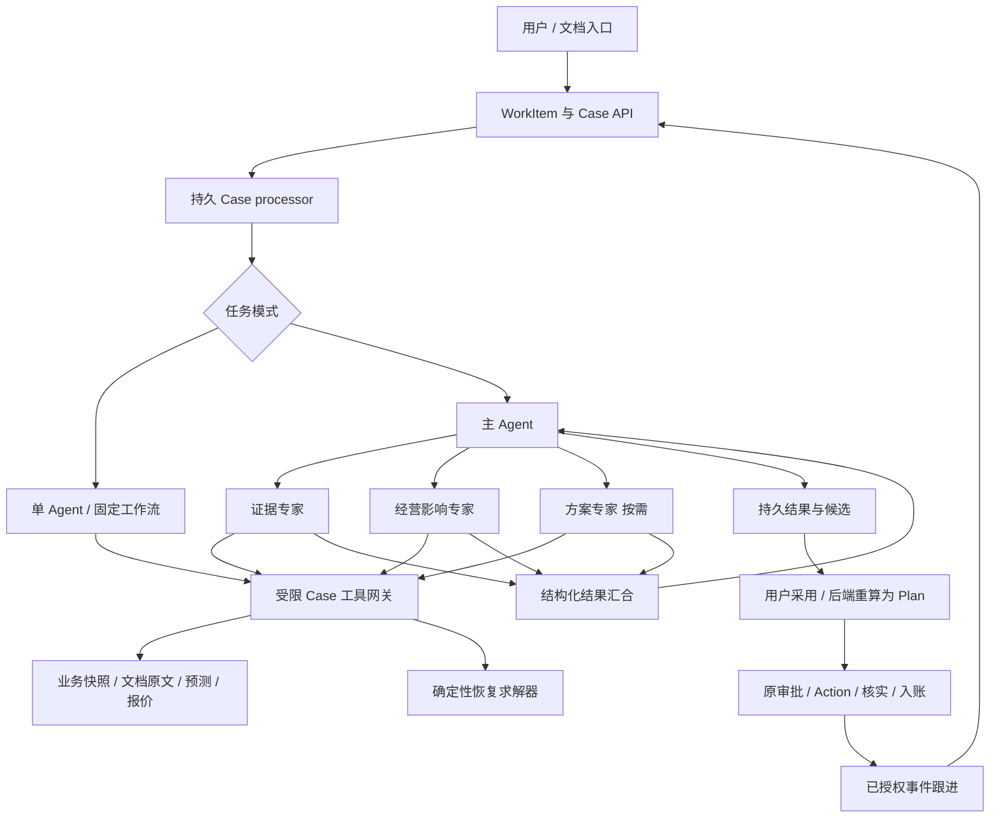
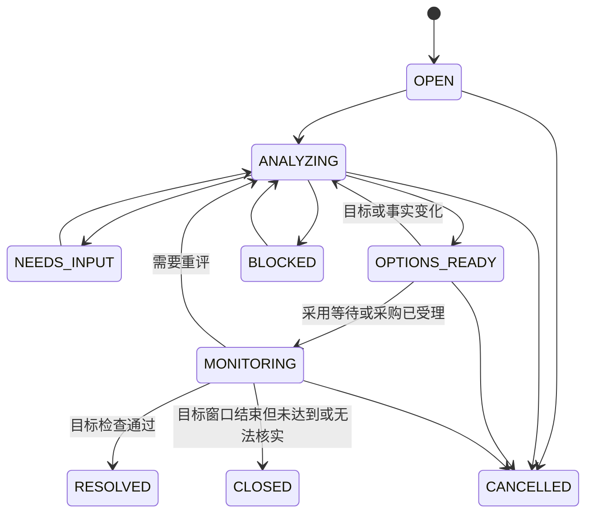

# ShopSteward：证据驱动的多智能体经营异常应对设计

> 历史分稿。下一阶段统一使用 [设计与评测总稿：Multiagent × Context Engineering × Rubric](2026-09-30-next-phase-integrated-design.md)，其中完整收录业务、架构、模型、评分与阶段交付。本文件仅保留设计来源，以下旧版本表述不再作为独立实施依据。

版本：v0.1 完整设计草案。日期：2026-09-30。状态：待用户评审，未进入产品实现。

目标：课程旗舰＋可复现实验＋可证实的个人工程贡献。本文中的新增接口、表、状态、预算和指标都是设计，不代表已实现或已达到。

探索过程与候选取舍见 [用例探索稿](../../research/2026-09-30-multiagent-use-case-exploration.md)。现有基线为工作区 HEAD `30bed9f` 及可见源码；存在其他未提交工作，本轮未更改其内容，也未启动业务服务验证。

上下文与模型的完整设计见 [Context Engineering 与模型分工设计 v1.0](2026-09-30-agent-context-engineering-design.md)：先在当前单 Agent 实现 TaskFrame、预算感知的模型视图、证据失效和可追溯 manifest，再为本设计的各角色配置不同上下文。复杂任务主模型候选为 GPT-6.1 Sol，轻量任务候选为 GPT-6 Luna；现有 GPT-5.6 Luna 保留为实验基线，具体接入、价格、参数与验证见该稿第 19–21 节。原始轨迹保留，活动 Responses 工具循环的完整 item 序列不可随意改写。

## 0. 评审摘要

### 0.1 产品决定

在现有 ShopSteward 上增加“供应异常应对”事项。用户从供应商通知或经营事件发起，系统判断哪些订单/方案受影响，按时间推演库存，比较等待与替代采购，生成可由现有采购链接受的计划，并跟进结果。

文档变更影响是旗舰入口；单 SKU 应急补购是第一条完整业务线；多 SKU 联合备货和异常复盘是后续扩展。供应商谈判、跨店调拨、取消订单和动态定价不进入首版。

### 0.2 技术决定

采用“有界主 Agent＋按需专家子图＋确定性业务工具”。主 Agent 负责意图、委派、补查和汇总；专家分别调查证据、经营影响和替代方案；时间计算、候选约束、排名、审批及记账由后端完成。

简单事项走固定工作流或单 Agent。多 Agent 是可替换策略，是否成为默认策略由对照结果决定。

### 0.3 最小可用交付

| 项目 | 决定 |
|---|---|
| 可用结果 | 一份通知引发的事项有影响结论、候选比较、可接受计划和复查状态 |
| 功能成功 | 找对适用对象、算对时间缺口、不漏硬约束、可完成批准与采购受理、能识别真实到货 |
| M0 必需 | 真实事项 processor、时间分桶计算、证据/版本绑定、多报价试算、版本化审批重算、最小模拟事件 |
| 后置工作 | 真实商家效果、大规模统计、联合采购、谈判、生产集群和长期学习 |
| 第一片 | 单门店单 SKU、已受理原订单、一份通知、两到三份报价、一个待确认补购方案 |

### 0.4 最重要的工程变化

新增日级恢复求解器和 recovery-v1 计划类型；现有 execution 的固定重建逻辑改为受控的版本分派。现有库存/资金账本和 Action 执行协议继续复用。不会绕过当前“同门店未核实采购先核实”的限制。

## 1. 需求、假设与非目标

### 1.1 已确认

用户希望先深挖用例，再得到完整设计；兼顾课程交付、技术研究和简历。本文完成设计阶段，不把讨论中的候选视为已批准实施的所有功能。

### 1.2 首版范围

- 一个门店、一个目标 SKU、未来七个营业日桶。
- 一个既有活动 Mission；已有受理订单可以在途，不能有未核实的新采购行动。
- 至多三个有效替代供应商报价；一次决定最多产生一笔应急采购。
- 通知、相关条款和报价说明可以来自少量已发布文档；实体必须绑定到当前门店目录。
- 支持主动用户输入；授权开启跟进后支持事件触发。无需真实邮件或 IM。
- 支持“无需补购”“条件不足但可解释影响”“存在可行补购方案”三类有效结果。
- 用户可以改预算、拒绝推荐、停止当前分析；采购批准仍为现有 approver 操作。

### 1.3 暂不做

不自动取消/退款/替换原订单；不宣称文档是真实供应商承诺；不优化缺少数据支持的利润；不恢复潜在需求；不训练促销弹性模型；不进行多智能体强化学习；不允许专家递归创建专家。

### 1.4 成功边界

只有分析成果时，称“分析完成”；采购被供应源受理时，称“采购已受理”；收到 GOODS_RECEIVED 才称“已到货”。事件事项解除还需符合其目标检查，不能用 Action SUCCEEDED 代替。

## 2. 现有系统的复用和缺口

| 层 | 可复用 | 必须新增或改造 |
|---|---|---|
| 用户工作区 | WorkItem、消息、领取/回传、结果与 Mission 入口 | case 详情、类型化文档引用、候选/时间轴和真实 processor |
| Agent | 模型适配、LangGraph、持久检查点和受限工具设计 | case 运行时、专家上下文、全局预算、父子进度和按需路由 |
| 知识 | 文档版本、权限、实体标签、索引与引用展开 | 变更/适用性结构、case 证据投影 |
| 预测 | v6 原始七日日预测与规划资格 | DemandProfile 适配、情景来源和有效性绑定 |
| 业务规划 | 现金、报价、在途、Plan 版本/hash | 时间模型、多报价求解、一次性应急意图、recovery-v1 |
| 执行 | 审批、发送、重试核实、预留、入账 | 按计划类型分派重算与恢复上下文生命周期 |
| 模拟器 | 场景、销售/需求/到货事件、幂等 | ETA 修订、多报价、隐藏需求回放、恢复场景模板 |

关键事实：现有 `Policy.supplier_id` 固定供应商；`Candidate.shortage_qty` 是周期总量计算；`execution.validate_current` 直接调用旧 `build_plan`；WorkItem 引用未支持 document/forecast；原检查点 fence 依赖 job_runs，不能直接用于仅持 WorkItem 租约的新 processor。

源码依据见第 22 节。上述缺口纳入范围，不把新增专家 Prompt 当作完整接入。

## 3. 用户旅程与场景契约

### 3.1 输入入口

1. 在任务工作区提出“评估这次供应延迟”。
2. 在文档详情选择已发布版本，点击“分析经营影响”。引用通过显式 attachment_refs 传递，不把文件 ID 塞进自由文本。
3. 已开启跟进的事项收到相应结构化事件后，由后端入队复查。

第一次完整演示使用入口 1 或 2；自动文档发布监听不阻塞该切片。所有入口创建/继续同一个可持久事项，用户刷新后能恢复。

### 3.2 正常链路

| 步骤 | 用户可见行为 | 系统交付条件 |
|---|---|---|
| 受理 | 显示正在核对的事件及目标 | 原消息/附件已持久化，身份及门店明确 |
| 取证 | “正在核对通知适用范围” | 实际子任务事件，不显示虚构思考过程 |
| 影响 | 展示受影响订单、日期及原因 | 每个关键结论连接证据或业务快照 |
| 比较 | 等待、快速补购、低价补购对照 | 数字来自相同求解快照，包含被淘汰原因 |
| 改口 | 用户降低预算，旧比较保留 | 新意图版本使旧候选不可接受，重算相关部分 |
| 采用 | 选择候选，生成待确认计划 | 后端重新核对依赖并重算；不执行采购 |
| 批准 | 原采购确认卡显示数量、供应商和金额 | 原审批身份、版本、hash 及资金校验 |
| 跟进 | 已受理/部分到货/全部到货/仍需处理 | 由真实 Action/到货事件驱动 |

### 3.3 验收场景族

| ID | 场景 | 成功结果 |
|---|---|---|
| U01 | 延迟导致时间缺口 | 指出缺货发生日，选择有效补购 |
| U02 | 原订单被旧条款豁免 | 不把新条件错误应用到旧订单 |
| U03 | 文档与源 ETA 不一致 | 展示已记录值与待核实通知，允许条件情景 |
| U04 | 总量充足但中途断货 | 不用总量结论掩盖时间缺口 |
| U05 | 低价方案过晚 | 不推荐对目标无帮助的采购 |
| U06 | 用户压低预算 | 新候选符合新预算，旧候选失效 |
| U07 | 原采购结果 UNKNOWN | 分析可继续，新采购先等待核实 |
| U08 | 部分到货 | 只计算尚未收到的剩余量 |
| U09 | 没有相关影响 | 解释无需行动并提供必要复查条件 |
| U10 | 缺少关键日需求或有效报价 | 交付已知事实和精确缺项，不编造数字 |
| U11 | 分析中通知被撤回/权限变更 | 不发布原文或可执行的旧结论 |
| U12 | 重启/重复提交/丢响应 | 恢复同一逻辑结果，不重复生成或发送采购 |

## 4. 经计算核对的旗舰例子

以下是人为设计的合成场景，不是项目经营效果。单位为件、人民币元；程序中金额全部存整数分。

- 第 1 天开始时现货 20，七天每天需求 10，共 70。
- 原订单已受理、已付款，剩余 50 件由第 3 天延期到第 5 天日初到货。
- 当前可用现金 800，现金底线 500，应急采购上限为 300；原订单支出不再重复扣减。
- 原订单仍会到货，不因应急采购而消失。

| 选项 | 到货 | MOQ/包装 | 单价 | 数量 | 新支出 | 七日缺货 | 期末现货 | 结论 |
|---|---|---|---:|---:|---:|---:|---:|---|
| 等待 | 原订单第 5 天 | — | — | 0 | 0 | 20 | 20 | 第 3、4 天各缺 10 |
| A | 第 3 天 | 40/10 | 9 | 40 | 360 | 0 | 40 | 违反现金底线 |
| B | 第 3 天 | 20/10 | 12 | 20 | 240 | 0 | 20 | 可行，满足目标 |
| C | 第 5 天 | 20/10 | 8 | 20 | 160 | 20 | 40 | 更便宜，但没有缓解缺口 |

等待与 B20 的每日期末现货分别是 `[10,0,0,0,40,30,20]` 和 `[10,0,10,0,40,30,20]`。等待的丢失需求是 `[0,0,10,10,0,0,0]`；B20 为全零。

20 现货＋50 在途等于七日总需求，旧总量算法可能给出零缺口；新的时间模型能识别中间断货。若预算改为 200，B20 不再可行，C20 仍无目标收益，按既定排序应推荐等待并说明尚有 20 件需求不能覆盖，而不是为了完成采购选择 C。

本轮使用独立的小型 Python 枚举核对了上表算术；这只验证设计示例，不是新求解器或 Agent 的验收。

## 5. 为什么是多 Agent，以及什么时候不是

采用推荐架构的假设是：适用性调查和经营调查需要不同上下文，且新发现可能要求补查。收益来源应是遗漏减少、调查覆盖提升或相同质量下缩短时间，而不是角色名称。

### 5.1 三个候选

| 路线 | 适合情况 | 取舍 |
|---|---|---|
| 固定 workflow | 结构化单事件、对象明确 | 最便宜稳定；作为强基线和简单路径 |
| 单 Agent＋同等工具 | 中等复杂、少量材料 | 集成简单；作为主要对照 |
| 有界协调器＋专家 | 多材料/例外/候选路径需动态补查 | 需付出调度、上下文交换和恢复成本 |

不使用自由互聊网络，不强制每次启动全部专家，不额外设 LLM 审批者。LLM 总结中的“多数同意”不作为业务事实。

### 5.2 路由

显式功能入口和类型化事件决定任务族，主 Agent 根据可见缺项选择 simple 或 collaborative。单个明确的结构化变化可直接调用固定分析。复杂标志包括：需要跨文档适用性判断、多个竞争解释、报价条件尚未齐全、多个独立调查方向。

关键词只用于提示，不能因为出现“复杂”二字就提升模式。路由决定和原因写入短的结构化日志。研究时支持强制 single/static_multi/adaptive_multi，防止路由改变测试分布。

## 6. 总体架构



首版在现有 agent 包内增加独立 Case runtime，由 backend 的新 processor profile 装配。专家是同一进程内的有界子图，不各自部署服务。业务数据库保持唯一经营事实来源，Knowledge 保持独立服务；无需新引入消息中间件或通用知识图谱。

## 7. Agent 合同与工具边界

### 7.1 固定四种角色，按需实例化

| 角色 | 自主决策范围 | 主要工具 | 不承担 |
|---|---|---|---|
| Coordinator | 委派、选择补查、合并缺项、交付解释 | delegate、read_case_artifacts、evaluate_recovery | 采购批准、账本写入、捏造证据 |
| Evidence | 搜索词、展开哪些原文、如何核对例外与对象 | search_documents、read_document_evidence、read_notice_versions、resolve_entities | 修改报价/ETA/偏好 |
| Impact | 选择相关在途/预测、构造允许的需求情景、识别最敏感假设 | read_case_snapshot、read_forecast_profile、simulate_recovery | 自行计算金额并当权威值 |
| Options | 候选调查、请求其他报价条件、比较服务目标 | list_case_offers、read_document_evidence、evaluate_recovery | 下单、自动接受谈判条件 |

首轮 Evidence 和 Impact 可并发。Options 只有在存在多报价、可行方案不足或需定向补查时运行。首版禁止专家互发消息；依赖通过主 Agent 的类型化请求传递。

### 7.2 输入

每次委派收到：`case_id, revision_id, run_id, subtask_id, role, question, allowed_scope, snapshot_id, supplied_evidence_ids, dependency_versions, output_schema, local_budget`。

默认不复制整个用户聊天和其他专家原文。明确的用户限制、纠正和必要指代保留原句与 message_id，避免摘要丢失否定。Impact 不需要全合同；Evidence 不需要全部销售流水；Options 需要供应条件及已计算缺口。

### 7.3 输出

```json
{
  "subtask_id": "st_...",
  "revision_id": "cr_...",
  "status": "complete",
  "claims": [{
    "claim_id": "cl_...",
    "kind": "interpretation",
    "subject": {"type": "action", "id": "existing_order"},
    "statement": "通知适用于本订单的剩余到货量",
    "support": ["evidence_1", "evidence_2"],
    "applicability": {"result": "supported", "rule_ids": ["order_scope"]}
  }],
  "artifact_ids": ["impact_..."],
  "missing": [],
  "followup_requests": [],
  "dependency_hash": "sha256:..."
}
```

`status` 允许 complete/partial/needs_input/failed；`kind` 区分 source_fact、interpretation、assumption、calculation。预算和 usage 由运行时记录，不信任模型自报。业务数字须引用 calculation artifact 字段；自然语言不覆盖结构化值。

### 7.4 合并和冲突

汇合器先校验 schema、作用域、版本与引用存在，再由主 Agent 解释。可程序判断的 scope/date/offer/cash 由代码裁决；解释冲突指派一次定向补查。仍有冲突时保留条件方案或提出一条影响选择的澄清，不循环辩论。

引用校验只能证明来源可访问和内容一致，不能证明模型解释一定正确。解释准确性仍是评测对象。

## 8. 证据与业务事实的关系

### 8.1 四层数据

1. 原始证据：文档版本、块、位置、内容 hash；或者结构化源事件/业务对象版本。
2. Claim：模型对证据的解释，附适用对象和时间，允许不确定。
3. Scenario assumption：用户明确接受的情景假设，只作用于 Case，不默默改库存或报价。
4. Authoritative projection：由业务导入/源事件/明确的操作接口维护的当前状态。

PDF 写“交期五天”不能直接覆盖在途 ETA；PDF 报价与业务报价冲突时，候选可作条件分析，但不能产生按该报价执行的 Plan。执行前须有有效结构化报价；首版模拟源可以发布相应版本，现实接入可由现有/新增受控报价录入完成。

### 8.2 有界适用性表示

首版支持：supplier_id、sku_ids、action_ids、旧/新订单范围、订单创建时间条件、effective_from/until、显式 exclusions。未知的附加商务条款标为 unsupported_condition，不让 LLM 任意扩展 DSL。

上传时间不等于生效时间，最新文件不自动覆盖历史订单条款。缺少实体映射时先返回候选；只有影响任务选择的歧义才询问用户。

### 8.3 来源权限与可执行性

Case 继承 WorkItem 的 owner/store 边界。私有资料只对当前 owner 及获授权服务可见；后端每次读取与发布重新校验。文档中的命令、角色声明或“可以采购”不进入工具授权。

状态分为 verified_source、supported_interpretation、user_assumption、unresolved，而非一个不可解释的 confidence 百分比。关键执行参数只能来自有效业务源或明确绑定的允许情景输入；用户认可文字不等于供应商接受新报价。

## 9. 时间敏感的恢复求解器

### 9.1 数据合同

`RecoverySnapshot` 冻结：门店/商品、当前现货、在途逐订单剩余量与 ETA、现金及预留、正式 policy、用户预算/目标、候选有效报价、日需求 profile、业务时间、服务 UTC 时间、来源版本和 solver_version。

同时记录实际引用证据的哈希；计算不把 Agent 的自由文本当输入事实。主 Agent 只能通过有限 schema 提供允许的情景选择。

### 9.2 需求来源

- 优先使用满足既有规划资格和时间/范围检查的 v6 日预测。
- 或使用 simulator/用户显式提供的日需求情景，标记 source 与采用者。
- historical_demo 继续只用于展示推演，不能因新 runtime 绕过现有规划资格。
- 只有七日总量时，不默认均匀分摊。可完成定性影响，并请求一个日需求情景；均匀分摊只能作为用户明确接受的假设。

v6 日浮点预测到整数需求桶使用版本化 `daily-allocation-v1`：先对每一天取 floor，再将 `predicted_quantity - sum(floors)` 个单位按小数部分从大到小分配，平手按日期排序。分配前校验差额在 0..天数范围且日数据与已保存总量一致；不一致时输入无效。保留原始日值、分配结果和适配版本，不把适配结果当新的预测精度成绩。

### 9.3 时钟与精度

数据库租约、API 超时和现有报价 valid_from/until 使用服务 UTC。库存到货、营业日和目标窗口使用明确的 business_time；模拟器的 simulation_time 不等于机器时钟。文档适用时间必须声明 clock_domain，演示资料由 fixture 对齐，不能直接比较两个时钟域。

首版是日级模型：每天使用一个显式需求结算时点；在该时点之前到货计入本日，否则计入下一日。当天内部连续销量与精确开店前缺货不在精度承诺内。若用户目标要求小时级保障，说明日级模型不足，不能声称已满足。

### 9.4 递推

对每一天 t：

```text
available_t = end_stock_(t-1) + existing_arrivals_t + proposed_arrivals_t
served_t    = min(available_t, demand_t)
lost_t      = max(0, demand_t - available_t)
end_stock_t = available_t - served_t
```

未满足需求按当日丢失处理，不回填到以后；不采用可无限累计负库存。到货量来自逐订单未收余量，同一 action/SKU 不重复计数。未知 ETA 不当作立即到货：排除出确定到货轨迹，并可另列条件情景。

已受理订单成本不重新计入应急支出。首版没有销售现金回款，因此现金路径仅考虑现有可用现金和新采购；应收账款不能当可用现金。

### 9.5 候选生成与排序

候选集合包括 q=0 等待，以及至多三份报价的合法数量。对每份报价，在显式 max_purchase_qty/预算限制内按 pack_size 枚举，满足 MOQ；每报价最多 100 个非零数量，超过时返回 search_space_exceeded，不静默截断后声称最优。该上限适用于首版小场景，可配置但需记录。

数量上界由 `floor(min(用户支出上限, available_cash-cash_floor)/unit_price)` 与用户数量上限共同决定，不需要 LLM 猜搜索范围。若最小合法包装量已经超预算，返回该最小量及拒绝原因作为解释样例，例如第 4 节 A40；它不进入可选择集合。无有效报价时 q=0 仍可形成等待分析，不强行绑定一份过期报价。

淘汰条件：报价过期/作用域不符、金额溢出、MOQ/包装不符、用户数量或预算限制、采购后现金低于底线、到货完全在目标窗口之外、待核实的关键执行参数。

可行集合默认按 `(预测丢失需求总量, 新采购支出, 期末现货, supplier_id, quantity)` 字典序排序。目标中的日期优先级或“最多允许缺货 X 件”必须结构化表达；首版不使用 LLM 自设权重。相同缺货下优先少花钱，所以第 4 节的 C20 不优于等待。

工具返回完整有界候选表、可行标记、原因代码和日轨迹；UI 只展示等待、推荐和一个有意义的替代项，不强凑三套不同命名。

### 9.6 输出语义

输出为 `RecoveryProposal`，包含 snapshot_hash、candidate_set_hash、rule_version、推荐 candidate_id、解释字段、有效期和适用条件。它是建议，不是采购计划。

只有已有 source/资格支持的候选才有 executable=true。条件情景仍可显示数字，但必须与可执行推荐区分。超过七日的原订单列在 horizon_tail 中，不声称已经评估其全部长期影响。

## 10. 从建议到可执行 Plan

### 10.1 不复制账本，不创建冲突 Mission

RecoveryProposal 归 Case；正式 Plan 仍归既有 Mission。不能为同店同 SKU 绕过唯一约束再建一个 Mission。已有 Action SUCCEEDED 且仍在途不阻止应急采购；UNKNOWN/EXECUTING 等未核实行动继续阻止新采购批准。

### 10.2 采用候选事务

用户点击具体候选的“生成待确认方案”，提交 `proposal_id, candidate_id, expected_case_revision, expected_mission_version, expected_current_plan_id, expected_state_version, proposal_hash` 和幂等键。

后端执行：

1. 校验当前用户 operator/admin、Case owner、门店权限及 Mission 作用域。
2. 按现有业务顺序取锁，并核对快照/报价/预测/Case 意图版本与有效期。
3. 用同版求解器重新生成候选集合，确认选中候选在当前集合中且 feasible、executable。
4. 若有变化，返回具体 stale 原因与需刷新的部分，不静默替用户选择另一个候选。
5. 保存一次性 `RecoveryIntent`（嵌入新 Plan 快照）：选中供应商/数量、用户采用者、正式 policy、允许的一次性供应商覆盖、case/revision/proposal 引用。
6. 将旧待确认 Plan 标为 SUPERSEDED，发布 `plan_kind=recovery_v1` 的新 Plan，更新 current_plan_id 和 mission_version。
7. 同事务写入 `mission.planning_context={kind:recovery, case_id, revision_id, plan_id}`；记录回执。该步骤不产生 Action、不扣款。

选择其他可行候选是允许的：`recommended_candidate_id` 和 `selected_candidate_id` 分别保留。v2 验证选中候选确实由求解器生成且可行，不强制用户只能选择默认第一名。

一次性供应商覆盖不更改 Mission 的长期 supplier_id；它由用户所选方案与随后批准共同限定，不给 Agent 任意换供应商的写权限。

### 10.3 版本化计划与校验分派

`PlanDocument` 增加可辨别类型。旧文档缺失 plan_kind 时按 `baseline_v1` 解析，旧 canonical/hash 算法保持原样。新文档 `recovery_v1` 使用 `RecoverySnapshot`、选中候选、时间结果和一次性意图；旧工具不强行按旧 Candidate 结构解释它。

```text
baseline_v1 → 现有 build_plan / proposal_hash / 既有 validate 规则
recovery_v1 → recovery_solver_v1 / recovery_hash_v1 / recovery validate
unknown    → 不可批准；显示版本不受支持
```

新 hash 至少覆盖：schema/rule/adapter 版本、Mission/Case 身份与版本、完整快照、候选集合、选中候选、一次性覆盖、失效时间。自述 explanation 不决定采购数值；不能通过修改文字改变选中采购。

新 validate 在批准和实际发送前都运行，复用原执行链的角色、状态、金额、报价有效性和门店行动闸门；再校验 Case revision、可执行证据、日需求 profile、RecoveryIntent 与所选候选。重算采用冻结求解输入；当前业务时间若改变到货桶或期限，则要求更新计划，不能偷用原 ETA。

同一计划类型分派需要覆盖所有 Plan 读取、历史卡片、outcome、批准和发送路径；不能只在创建时支持新类型。前端契约从新的运行时 schema 生成。

### 10.4 调度器与一次性意图

普通调度器遇到有效 recovery planning_context 时，不使用长期供应商基线覆盖该待确认方案。输入变化时使其失效，并生成 Case 重评估事件。状态检查/经营同步继续运行。

Action 受理成功后，原执行链已形成在途记录；同一事务清理一次性 planning_context，保留 Case 与 Action 关联，恢复长期补货策略。失败或过期无未核实行动时，清理 context 并向 Case 记录原因。UNKNOWN 时保持关联并走核实，不以超时直接清理后另购。

未采用的分析结果不会锁住普通 Mission 调度。待确认 Plan 的有效期届满由已有检查周期清理；即使 processor 停机，也不能永久阻塞正常规划。

### 10.5 用户改口与停止

分析中新增要求：立即撤销旧 WorkItem 处理租约，旧结果不可回传；新 root 重新理解要求，复用仍有效的证据。

已生成但未批准的恢复 Plan：新要求提交后标为待重评，旧采用操作不可重复用于新意图。已经批准但尚未发送的恢复 Action 若新意图版本不匹配，发送前校验将其置为 STALE，重新展示计划。

已经发送且结果未知/已受理：消息、取消分析或新预算不撤回外部采购，继续原 Action 核实，UI 同时显示“新要求”和已有采购。撤单是首版之外的独立能力。

首版采取保守的消息版本失效：恢复计划尚未发送时，同一 Case 的新自由文本消息会使旧意图需要重新确认；“查看状态”提供只读按钮，避免读状态也改变意图。后续可优化语义无变化的复用，但不能依赖未经验证的模型分类保留旧采购授权。

### 10.6 等待方案

q=0 不产生 PurchaseRequest。用户选择“采用等待并跟进”保存 Case 决定和检查条件，返回明确的未采购结果。它不自动暂停长期 Mission；若用户希望暂停补货，应使用已有独立控制操作。界面需说明持续委托仍按原规则运行。

## 11. 领域对象、状态与持久化

### 11.1 分层含义

- WorkItem：用户的一件事与连续对话。
- OperationsCase：一次经营事件的处理上下文。
- CaseRevision：某次事件/用户要求下不可变的输入和证据视图。
- CaseRun：某 revision 的一次可恢复计算周期。
- RecoveryProposal：不可变候选比较成果。
- Plan/Action：既有业务计划和采购行动。

一个 WorkItem 可以保留多个历史 Case，并通过 current_case_id 指向前台当前 Case；同一 WorkItem 同时最多一个运行中的 root。新通知与同一事件相关时进入原 Case 的新 revision，独立事件另建 Case。关联既有 Mission 仍使用现有规范事项归并机制，不绕开同用户同 Mission 的规范卡片。

### 11.2 Case 状态与 WorkItem 投影



Case 决定与 Plan/Action 状态单独关联；无需把每一种采购状态复制进 Case 状态机。WorkItem PROCESSING/WAITING_INPUT/RESULT_READY/BLOCKED 继续表达前台响应。关联 Mission 的 WorkItem 不因回答结束就标 COMPLETED；Case RESOLVED 不自动完成 Mission。

未开启跟进时，可以交付“分析已完成、尚未验证解决”，Case 保持 OPTIONS_READY；不会假装后台持续监听。用户归档结果不等于已解决经营问题。

Goal 记录 `window_start/end, objective, max_lost_qty（若用户设定）, evaluation_basis`。RESOLVED 只用于无影响已被核实，或目标所需事实已经足够且满足明确的成功条件；仅有未来预测时保持 MONITORING。窗口结束后仍未满足/证据不足则 CLOSED，outcome 为 unmet/unknown，保留原因，不长期显示“处理中”。模拟器可以提供实际丢失需求进行结果核对；现实没有该数据时不得把它记成 0。

新 revision 不能抹去窗口内已发生的缺货；若用户明确改变目标窗口，分别保存原目标结果与新目标。停止本次运行只取消 CaseRun，Case 回到 OPEN 或保留已有 OPTIONS_READY；只有明确结束事项才进入 CANCELLED 并关闭其跟进。

### 11.3 新增持久对象

| 对象 | 核心字段/约束 | 为什么需要 |
|---|---|---|
| operations_cases | id、work_item_id、store/owner、kind、anchor、status、current_revision、followup | 事件连续性与所有权 |
| case_revisions | case_id＋revision 唯一，goal、scope、snapshot、seed_evidence、dependencies、input_revision，内容不可变 | 防止新旧证据混用，保留改口历史 |
| case_runs | run_id、revision_id、lease_epoch、status、deadline、usage_budget、mode | 重启与全局预算 |
| case_subtasks | subtask_id、run_id、role、task_spec、checkpoint_key、status、result、dependency_hash | 隔离专家上下文、选择性复用 |
| case_calls | run/step/kind 唯一，request_hash、reserved_budget、status、result、usage | 模型/工具调用预留、幂等与成本 |
| recovery_proposals | proposal_id、revision_id、snapshot/hash、solver_version、结果、expires_at | 可引用且可重算的成果 |
| case_events | case_id、递增 seq、source_key 唯一、事件类型、payload、delivered_at | 进度回放与持久复查触发 |

子表通过 case/run 外键继承 owner/scope，读取时必须 join 校验，不能只凭 ID。业务需要的金额保持 bigint 分；模型生成的 claim 保存在 Case JSON 中，不进入经营账表。索引围绕待处理事项、待交付事件、case_id/seq 和依赖查找建立。

必要扩展字段：WorkItem 的 `input_revision/current_case_id`；Mission 的可空 `planning_context`。input_revision 只在用户输入或新业务意图时递增，不在纯进度续租时递增，避免把每次 heartbeat 当作用户改口。

ETA 变更还需为 InboundRow 保存最后有效的源序号/ETA revision；旧数据可用初始来源版本回填。新源事件在后端和 simulator 的类型合同、归属校验及幂等消费中同时注册，不只在 Agent 层添加事件名。

### 11.4 快照与版本向量

一次计算引用：state_version、mission_version、policy_version、forecast_id/model_version/绑定状态、offer_versions、逐订单 ETA 版本、文档 version/evidence_revision/publication_revision、case/input_revision、solver_version。

业务库用短 REPEATABLE READ 快照。文档读取在锁外完成，并绑定不可变版本；发布前在后端再次校验引用的权限及当前适用性。系统不宣称跨 PG/OpenSearch/LLM 存在分布式事务。

CaseRevision 的 seed_evidence 只冻结本轮开始时的附件和已知证据。调查中新发现的文档以不可变版本追加到 case_calls/子任务产物，不能修改旧 revision；最终 RecoveryProposal 冻结完整 evidence_manifest 和其依赖哈希。读到两个不同业务状态版本时必须选择重新捕获快照，不在结果里混合它们。

分析可复用按依赖 hash 相同的内容；最终 materialize/approve/send 仍使用保守的当前业务版本校验。前者降低无意义重算，后者保护实际采购，两者不是同一层判断。

### 11.5 部分失效

预算变化→重新求解/推荐，保留有效原文和适用性结论。ETA 变化→重新计算库存/方案，保留无关供应商条款。文档权限撤回→相应引用不可再展示，对依赖它的结论撤销或改用其他证据。预测改变→Impact/Options 重算，不重新搜索无关合同。

复用必须是依赖清单一致，不以“看起来类似”判断。后端业务快照改变后即便分析产物可复用，也需要新 Plan 和新批准，不能转移旧 hash。

## 12. 编排、持久恢复与预算

### 12.1 有界主图

```text
claim → capture_context → classify/decompose
      → simple_path 或 dispatch_experts
      → join_and_validate → evaluate_candidates
      → [一次定向补查 或 一条澄清]
      → publish_result → release
```

Coordinator 输出委派规格，由代码校验角色枚举、作用域、预算和依赖。专家的搜索/工具选择由模型决定；预算、权限、数据合并和发布顺序由代码决定。一个专家失败不会自动启动更多同类专家。

### 12.2 初始配置建议

以下是工程起点，不是已测性能承诺。

| 维度 | 初始值 | 语义 |
|---|---:|---|
| root 并发 | 1/worker | 独立于原 Mission Agent worker 配置 |
| 专家并发 | 2/root | 三类角色不等于三路同时启动 |
| 委派深度 | 1 | 禁止子专家递归委派 |
| 专家实例 | 最多 3/root | 某专家补查沿原实例继续 |
| 模型调用 | 总计最多 14/root | 包含主 Agent、专家、协议修复和重试 |
| 业务/知识工具 | 总计最多 28/root | 子调用不各领取 28 次 |
| 模型请求超时 | 按冻结 ModelProfile，初设 30/45 秒 | 同时受 root 剩余时间约束，真实用量仍记账；详见 Context Engineering 第 20 节 |
| 单专家活动窗口 | 60 秒以内 | 同时服从 root 剩余时间 |
| root 活动窗口 | 150 秒 | 首版上限，进程停机计入；用户等待开启新周期 |
| 定向补查 | 最多 1 轮 | 所有角色共享；不得无限互相要求补查 |

调用数和时间是首版硬界限；TaskFrame 提取、摘要、修复、重试与专家均计入同一个全局模型额度。额外 token 和费用预留按 Context Engineering 第 20/26 节的冻结 profile 与价格配置设置。每次请求计入实际供应商用量；缓存写入分类不足时成本保留估算区间，价格或用量缺失时为 unknown，不是 0。

模型调用前在 case_calls 中原子预留额度；请求已发但用量未知时保留预留并标 unknown。工具重放同一逻辑调用不再增加实际业务效果，网络重试和模型重发仍记录实际尝试次数。预算耗尽交付已有结果和缺项，不伪报完整完成。

### 12.3 WorkItem 租约适配

新 processor 通过现有 claim/context/updates 协议工作。领取时获取/继续对应 CaseRun 并更新 lease_epoch。由一个根协调组件独占前台 updates；专家只保存自己的产物，不能各自并发修改 WorkItem expected_version。

续租由根循环按有用进度或定时 heartbeat 发起，使用最新 WorkItem.version；当前协议每次 PROCESSING 更新会递增 version，需要根循环串行维护。默认每 30 秒续租一次，进程不能通过无条件重领同一回执延长过期租约。

### 12.4 检查点 fence

原 FencedPostgresSaver 可复用封装，但注入新的 WorkItem fence：在同一事务确认 processing_owner/hash、expires_at、run.lease_epoch、input_revision 及运行状态。不能继续查询无对应记录的旧 job_runs。

主图和每个专家拥有不同 thread/checkpoint key，例如 `case_run_uuid` 与 `subtask_uuid`；映射存入 case_subtasks，稳定重启恢复。工具调用 ID 包含 root＋subtask＋持久 step_id，重试不换逻辑 ID；request_hash 不同则拒绝同键复用。

本设计使用显式结果产物返回父图，不依赖多个子图直接修改共享 messages。子图内部历史保留在各自检查点，父图只拿结构化摘要及 evidence IDs。

### 12.5 中断与澄清

专家只返回 needs_input；主 Agent 合并为一个必要问题，附已知信息。发布 WAITING_INPUT 后释放 WorkItem 租约。用户回答创建新的 input_revision/CaseRevision，新的计算周期可复用有效产物，旧计算不继续写入。

case 生命周期的多轮耗用单独汇总，避免通过反复澄清“重置预算”掩盖真实成本。恢复和预算策略不会声称模型请求 exactly once；业务调用的幂等与模型供应商计费是不同保证。

### 12.6 持续跟进与去重

只对用户开启跟进且未结束的 Case 生成复查；触发包括关联订单 ETA/收货、被依赖报价更新、目标预测变化、文档适用版本变化和一次预定复查时点。source_event_id 与 Case 组成幂等键，同一事件重复交付不产生新模型运行。

只有专用 `RECHECK_REQUIRED` 事件能进入处理队列；tool.started、结果发布等 UI 进度事件不触发自身重跑。一个 WorkItem 已运行时先合并事件，后续用新的依赖版本捕获上下文；若事件使本轮关键输入失效，撤销旧运行并合并重启。短时间多个变化合成一轮，不为每条销售记录调用模型。

状态改变但依赖值未变时不调用模型。新 snapshot 的影响指标无实质变化时只更新持久检查记录，不向用户重复通知。只有新方案、显著目标偏差、执行失败/完成或需要输入时产生用户提示。跟进到 goal.window_end 后结束或要求用户明确设新窗口，不无限循环。

## 13. 新工具与 API 合同

### 13.1 工具能力

| 工具 | 输入要点 | 输出 | 权限/副作用 |
|---|---|---|---|
| read_case_snapshot | case/revision | 允许范围内快照 | 只读 |
| read_notice_versions | doc/version IDs | 可访问原文和版本关系 | 只读，不自动解释为事实 |
| resolve_entities | 标识或名称、限定目录 | 精确匹配/候选 | 只读 |
| read_forecast_profile | snapshot、sku | 日 profile、资格、来源 | 只读 |
| list_case_offers | snapshot、sku、supplier filter | 有效结构化报价 | 只读 |
| simulate_recovery | snapshot、合法情景 | 日级影响 artifact | 持久计算产物，无账本写入 |
| evaluate_recovery | snapshot、目标、候选范围 | RecoveryProposal | 持久建议，无采购 |
| search/read_document_evidence | scope、query/reference | 原有可引用证据 | 复用检索服务 |

Case 网关在服务身份之外再次校验原用户、Case scope 和角色工具白名单。首版无需把整个旧 Agent bridge 开放给专家；memory_edit、revise_plan、approve、execute 均不在专家工具集中。

### 13.2 建议新增公开接口

所有路径是设计，沿用项目 Bearer、Idempotency-Key、expected_version 和错误体惯例。

| 接口 | 行为 |
|---|---|
| POST `/api/v1/work-items/{id}/cases` | 创建供应异常 Case，输入显式 document/action refs、目标和可选约束 |
| GET `/api/v1/operations-cases/{id}` | 状态、当前 revision、结果、计划和执行关联 |
| GET `/api/v1/operations-cases/{id}/events?after_seq=` | 可回放进度；首版轮询，后续接 SSE |
| GET `/api/v1/operations-cases/{id}/evidence/{evidence_id}` | 重新鉴权后展开证据 |
| GET `/api/v1/recovery-proposals/{id}` | 不可变候选、轨迹及当前可用性 |
| POST `/api/v1/recovery-proposals/{id}/materialize` | 用户选中非零候选，重算并生成 Plan |
| POST `/api/v1/recovery-proposals/{id}/adopt-monitoring` | 保存等待决定和跟进设置，不创建采购 |
| PATCH `/api/v1/operations-cases/{id}/followup` | 显式开启/关闭跟进，带 expected_revision |

预算等新要求首版通过既有 messages 输入及结构化约束编辑共同支持；结构化编辑也追加用户消息和 input_revision，避免 UI 与聊天存在两份目标。

### 13.3 内部接口与执行隔离

既有 work-items claim/context/updates 保留，新增 Case context、calls、subtasks、proposals 的受限服务操作。内部路径不进入前端代理白名单。processor 根据用户业务身份缩小工具权限，不能把 service 身份作为跨店授权。

WorkResult 保留旧 kind 和 references，新增可选 `artifact_refs`，类型限 case/recovery_proposal/document/forecast，后端逐项校验存在性、所有权、版本和可展示性。原业务引用仍沿用旧验证，不把任意 URL 当证据。附件通过已有知识上传与发布流程产生，不另建任意附件存储。

### 13.4 错误码与动作

| 错误类别 | 用户/系统处理 |
|---|---|
| CASE_INPUT_CHANGED / WORK_LEASE_LOST | 终止旧提交，重新领取最新要求 |
| EVIDENCE_UNAVAILABLE / SCOPE_AMBIGUOUS | 保留已知事实，补资料或澄清对象 |
| PROFILE_UNAVAILABLE | 请求日需求或启用有效预测；仍可展示文档影响 |
| PROPOSAL_STALE / OFFER_CHANGED | 标出变化，重算；不静默换方案 |
| NO_FEASIBLE_PURCHASE | 正常业务结果，展示等待/条件选择，不当 500 |
| ACTION_IN_PROGRESS | 分析继续，新批准等待原 Action 核实 |
| BUDGET_EXHAUSTED / SUBTASK_TIMEOUT | 交付部分结果及缺失部分，允许显式重试 |
| PLAN_KIND_UNSUPPORTED | 保留历史可读信息，不批准未知规则 |

## 14. 失败、并发与降级

| 事件 | 必须发生的行为 | 可继续的工作 |
|---|---|---|
| 一位专家超时 | 标记其结果缺失，取消其后续调用 | 发布其他已核实结果 |
| Knowledge 不可用 | 不补造条款，记录失败范围 | 结构化业务影响与已合法缓存证据 |
| 预测不可用 | 不把历史示例变为当前预测 | 条款适用性、报价清单；可请求显式情景 |
| 文档被撤权 | 隐藏引用内容，废弃依赖解释 | 不依赖该资料的分析 |
| 案例运行时崩溃 | 租约过期后恢复稳定 step/checkpoint | 已提交业务效果不重做 |
| 用户消息与结果竞争 | 消息递增 input_revision/撤租；旧结果事务失败 | 新 root 处理新意图 |
| 两个 root 争抢事项 | 一个租约获胜，失败者不回传 | 其他 WorkItem |
| 两个候选同时被采用 | 锁、expected version 和幂等键决定唯一有效 Plan | 失败方刷新 |
| API 丢响应 | 查询/重放同幂等键 | 不换键重复 materialize/批准 |
| 采购发送后丢回执 | 原 action reconcile | 不创建替代 Action |
| 到货/报价变化与批准竞争 | store/Mission 锁和版本检查决定先后 | 失败计划重算 |

多资源写入统一锁顺序：store → mission（若有）→ work_item → case → plan → action；历史路径仍保持 store→mission→plan→action。只持 WorkItem 的租约/进度事务不得随后再获取 store 锁。网络和模型调用不在业务锁内运行。

无需全系统停机式降级。对最终选择有决定性影响的缺项阻止对应可执行候选，其他已验证结果照常交付。部分结果的 complete=false 必须由结构化覆盖项计算，不能仅由模型声称。

## 15. 产品交互

### 15.1 事项详情布局

```text
供应延迟应对 · 当前依据截至某业务时间
目标：保障未来七天供应；采购后现金至少保留 500 元

影响结论
第 3、4 天预计各缺 10 件。原订单第 5 天到货。
[查看原通知] [查看适用订单] [展开假设]

库存时间轴
日期            1   2   3   4   5   6   7
等待时缺货      0   0  10  10   0   0   0
B20 时缺货      0   0   0   0   0   0   0

候选对比
等待：支出 0，预计缺货 20
B20：支出 240，预计缺货 0，可生成待确认方案
C20：支出 160，预计缺货 20，未改善目标
A40：不满足现金底线，展开原因

[修改预算/目标] [采用等待并跟进] [生成 B20 待确认方案]

处理记录与证据
已核对通知适用范围 → 已读取库存/在途 → 已完成候选试算
采购与到货：来自已有 Plan/Action 组件
```

不把专家头像互聊当主要界面。用户首先看到经营问题、方案与下一步；技术轨迹在可展开区域，适合技术视频和调试。

### 15.2 关键交互约束

- “分析影响”与“批准采购”使用不同按钮和状态，不让分析请求变成采购同意。
- 数字从计算结果渲染；LLM 解释可折叠，不承担金额格式化的权威来源。
- 旧结果保留，并标“依据已变化”；用户能比较两个 revision，而非刷新后丢失原决定。
- 引用点击定位原文版本；无权限时给出不可用状态，不替换成最新文件内容。
- 新约束以同一个目标对象驱动聊天和表单，编辑后显示影响的候选。
- 当前运行停止与结束事项分开：停止运行保留 Case 和结果；结束事项关闭该 Case 跟进。两者均不撤销已发送采购，也不自动结束 Mission。
- 跟进未开启时明确显示“未开启后台跟进”；开启后只对新的有效变化生成提示，不每次轮询通知。

### 15.3 刷新、下载与可访问性

事件使用 after_seq 恢复；断线时显示最后更新时间与正在重连，不自行推测子任务结束。首版可轮询，每个 Case 的事件有稳定序号。下载结果包括目标、时间、版本、候选和证据引用，不包含私有模型隐藏推理。

时间轴同时提供表格；状态不能只靠颜色区分。移动端优先纵向候选卡片，原有采购确认交互继续复用。

## 16. 模拟环境与数据设计

### 16.1 新场景能力

在现有 SANDBOX 旁增加版本化 recovery fixture/profile，保留 SC01 原协议与结果。业务 catalog 已支持报价列表，但当前便捷参数不是完整多报价配置；新增 fixture 明确提供多个 supplier/SKU offer，不假设已有控制台能直接创建。

新增受控事件：

- SUPPLY_ETA_UPDATED：指定现有受理订单、未收余量、新 ETA、event_id、source_sequence。
- OFFER_UPDATED：指定 SKU/供应商报价新版本、有效期和完整条件。
- 日需求推进：从隐藏 scenario truth 读取当天潜在需求，计算实际成交与丢失量；业务端只接收其正常可见销售/库存事件，评估器保留丢失需求。

现有 GOODS_RECEIVED、销售和幂等记录复用。ETA 事件更新在途预期，不修改已扣款金额或重复增加在途量；部分收货后只更新剩余量。

### 16.2 文档与事件配对

每个场景包含结构化事实、通知/附件、实体映射、公开预测和隐藏实际需求。通知可以与事实一致，也可以是待核实说法；场景显式标注哪一个已生效。不能为了让 Agent 一定成功，把答案偷偷预写在任务说明中。

普通演示的通知和结构化 ETA 事件一致，跑通可执行闭环。挑战场景包括旧订单豁免、后续撤回、报价截止、对象歧义和文档未发布。Source 权限、发布时间与业务生效时间分开保存。

### 16.3 两类回放

1. 决策回放：冻结用户当时可见事实，判断取证、适用性、参数与方案可行性；不使用未来需求判定当时选择是否“错误”。
2. 经营回放：固定相同外生需求和供应事件，比较不同选择后的库存/缺货/现金结果；结果只说明该模拟环境中的效果。

未来需求真值、未公布供应商条件和评价器标准只在 evaluator 侧，不能成为工具返回。算法只看到截至当时的信息。若某策略影响未来事件，应在环境中显式建模，不能仍声称完全相同的外生轨迹。

## 17. 研究问题与实验设计

### 17.1 需要证伪的假设

- H1：在多文档例外和动态补查场景，隔离专家上下文降低关键约束遗漏。
- H2：按需委派相比固定全部分工，以更低成本达到相近或更高任务成功率。
- H3：结构化证据和依赖版本降低改口/事件变化后的错误复用。
- H4：在相同任务质量要求下，并行独立调查减少等待时间；服务排队/限流可能抵消收益。

H1/H2 不预设为真。若同等工具的单 Agent 表现相当且更便宜，产品可以选择单 Agent；多 Agent 的负结果和适用边界仍可成为可复现研究结论。

### 17.2 基线

| ID | 策略 | 具体定义 |
|---|---|---|
| R0 | 固定工作流 | 固定取证/适用性提取/确定性求解/解释步骤，使用同一基础模型完成需语义理解的步骤 |
| R1 | 强单 Agent | 同一模型、同一底层工具与资料，允许多轮补查和相同结构化结果，不故意削弱 Prompt |
| R2 | 固定多 Agent | 同样三个专家全部启动，固定汇合，无动态选择 |
| R3 | 自适应多 Agent | 本设计的按需委派和一次定向补查 |

所有策略使用同版求解器、同一报价/预测/证据读取权限、同一任务成功判定。R1 可以直接调用所有底层工具；R3 不能独享返回答案的便利工具。

上下文工程对照与多 Agent 对照分开：先测当前单 Agent 与加入 ContextBuilder 的单 Agent；架构实验再让 R0–R3 共享相同的上下文来源、版本校验和预算方法。R1 应是经过上下文改进的强基线，不能把新增 TaskFrame/摘要的收益算作专家分工收益。

先锁定一个基础模型对照架构。后续“大小模型分工”另做实验；不能同时换架构和模型再归因于 Multi-agent。记录实际模型标识、API 模式、Prompt/schema/工具/solver 版本和生成配置。

### 17.3 预算公平

做两个视角：共享最大模型/工具/时间预算下的任务成功；实际消耗下的成功率—成本—延迟曲线。模型上下文 token 不相同是架构代价的一部分，全部计入，包括主 Agent 汇总和失败重试。

并行策略的 token 成本不会因墙钟更短而减少。并发上限、供应商速率限制、缓存命中和队列等待单独报告。单用户完成时间与系统吞吐使用不同实验，不混写为“性能提升”。

### 17.4 数据集建议

开发阶段 12 个手工 smoke 场景覆盖计算和生命周期，再用 24 个 dev 场景调整接口及 Prompt。独立评估初版建议 48 个任务，覆盖 8 类机制，每类 6 个：适用例外、时序缺口、报价约束、无行动正确、改口、源事实变化、缺失信息、恢复/未知提交。

按场景生成模板与约束组合划分 dev/test，不只换商品名或数字。测试保留新的条件组合和表达，避免同一模板的近义改写泄漏。公开字段与隐藏 oracle 分开存储；使用已查看 test 修 Prompt 后，该 test 转为回归集，再建独立验证集。

核心先跑 R0/R1/R3；48×3×2 次独立采样为 288 个运行。R2 若用于完整消融再增加 96 个运行。该规模是建议，不是立即批准 API 花费：先从 pilot 的实际 usage 估算总成本，再决定批量范围。预算不足可先单次采样，但须报告波动评估不足，不能把它包装为稳定提升。

同一随机种子未必让外部模型完全确定；实际重复通过请求标识和配置记录。业务模拟的需求/供应种子固定且配对。

### 17.5 指标及分母

| 指标 | 定义与注意 |
|---|---|
| 端到端任务成功 | 适用对象正确＋关键条件覆盖＋目标结果完成；允许正确无需行动/必要澄清；不能把全部拒绝算成功 |
| 决策正确率 | 与同一可见信息和偏好下的 oracle 合法集合比较；多解不强制唯一文本 |
| 计划可执行率 | 需要采购且输入齐备的任务中，真正通过后端批准/发送前校验的比例 |
| 关键约束遗漏率 | case 标注的决策相关条件中未被最终方案正确处理的比例 |
| 引用与适用性 | 内容/版本/对象/生效范围分别统计；引用存在不等于解释正确 |
| 改口完成率 | 用户修订后的任务在新目标下完成，且不发布旧版本候选 |
| 无效追加调用 | 不改变证据覆盖、候选或缺项的调用，作为诊断而非主成功指标 |
| token、实际请求数 | 包含 root、子 Agent、失败和重发；usage unknown 单列 |
| 每成功任务成本 | 所有运行总支出/成功任务数，包括失败成本；价格未知不填 0 |
| 延迟 | 首个有用结果、完整结果、P50/P95，包含等待和重试，澄清的人类等待另列 |
| 模拟经营结果 | 丢失需求件数、采购支出、期末现货、现金底线违反；不称真实利润 |
| 恢复结果 | 重复提交、过期写入、恢复后目标完成，按故障类型报告 |

报告总体和简单/复杂分层，避免只选多 Agent 擅长的任务。样本不足时保留区间与具体失败例，不声称统计显著。配对成功差异可给 bootstrap 区间，以场景为聚类单位，重复采样不当作独立新场景。

### 17.6 消融与失败归因

在预算允许且问题明确时做：固定分工 vs 自适应；结构化证据 vs 仅摘要；依赖复用 vs 全量重跑。一次只改一项，使用相同数据和工具。

失败标签按可定位阶段：实体/适用性、取证遗漏、预测资格、时间计算、路由/委派、上下文丢失、版本失效、执行、模型协议、预算。不要只按“幻觉/不安全”大类分类。

解释性失败样本保存用户输入、可见证据、实际工具轨迹和期望业务结果。可用于后续受限任务 SFT，但首版收益不依赖先训练模型；独立 test 不自动进入训练集。

## 18. 交付顺序与可用里程碑

这是一份设计中的阶段安排，不是已经批准执行的逐文件实施计划。每阶段有独立可用结果；研究规模不阻塞前置工程切片。

| 阶段 | 可用交付 | 必需能力 | 验证证据 |
|---|---|---|---|
| M1 文档影响 | 用户选择通知，获得相关订单/方案和适用原因 | Case intake、单 processor、证据读取、实体关联 | 正/反适用例、刷新恢复、原文引用 |
| M2 时间方案 | 同一事项比较等待与有效补购 | DemandProfile、日级求解、多报价、proposal 卡片 | 第 4 节数值回放、MOQ/资金/ETA 边界 |
| M3 完整业务闭环 | 采用→批准→受理→到货/复查 | recovery Plan、重算分派、planning_context、源事件 | PG/HTTP 真实事务链、旧流程回归、丢响应与未知行动 |
| M4 协作候选 | 复杂资料按需专家处理，简单任务保留短路径 | 子图、预算、fence、进度、依赖复用 | 专家超时、改口竞争、恢复、固定/自适应对照 |
| M5 研究与展示 | 可复现实验报告和完整课程故事 | 独立 test、实验运行器、成本统计 | 配对结果、失败分析、版本及复现入口 |

M1/M2 可以先用固定或单 Agent 实现，避免在没有任务工具时先造多 Agent 平台。M3 验证业务可用，M4 验证协作候选；不要求先证明 H1 才允许 M4 开发。

建议工作包边界：Agent 编排/证据协议；恢复求解与业务接入；场景/评测；事项体验与全链验证。由团队实际分工认领，不假定每位成员只做 UI，也不把所有贡献归个人。

## 19. 后续扩展设计

### 19.1 多 SKU 联合备货

新增 `PortfolioCase/PortfolioProposal`，引用多个单 SKU 日 profile 和候选集合；不把一个 Mission 改成多 SKU。每 SKU 最多六个候选、最多三个 SKU，首版组合最多 216，确定性枚举即可。

统一约束包括总预算、现金底线、SKU 保障优先级、活动窗口；SKU 专家不得各自承诺预算。求解目标先最小化重点 SKU 缺货，再按已声明优先级与支出排名。用户调整优先级会产生新 proposal。

采用组合后按现有门店闸门串行生成/批准子计划；每笔受理后更新现金和剩余预算。第一笔执行后组合状态为 PARTIALLY_EXECUTED，不能重新提交全部组合，也不宣称全部订单原子成功。外部执行不支持跨供应商回滚。若剩余约束变化，重新给出剩余组合并由用户确认。

### 19.2 异常复盘

新增历史只读 Case，输入为实际决策时点和结果窗口。三个专家按需求、履约、决策假设取证；历史快照和当时文档决定可见范围。结论区分支持/反对/不足证据；模拟反事实只说明所用模型内的效果。

不自动把专家讨论写入长期偏好或生产规则。经用户选择的改进才进入既有 Skill/偏好管理，并记录来源和适用条件。

### 19.3 询价谈判

需要独立的外部会话/报价承诺模型和隐藏规则环境。采购方专家与模拟供应商角色必须明确区分：它们是相互交互的主体，不全属于同一个共享秘密上下文的协作团队。真实消息渠道、承诺权限和取消规则需要单独设计，不能作为本版的小开关启用。

## 20. 可形成的个人经历与证据

### 20.1 推荐叙事主线

项目名称可以使用“ShopSteward：面向零售供应异常的多智能体决策系统”。主线是把非结构化变化通知转化为可核对、可执行、可恢复的经营方案。

与当前其他模块衔接时明确：预测和知识模块提供工具基础；本轮新增贡献是经营事件的任务协议、上下文协作、时间恢复规划接入和对照实验。不能把原有预测训练成绩当作 Multi-agent 成绩。

### 20.2 贡献与证明材料

| 可负责的技术贡献 | 完成后应有的证据 | 可成立的简历表述范围 |
|---|---|---|
| 按需专家编排 | 主图/子图、角色工具合同、实际调用轨迹 | 实现了何种任务分解与协作机制 |
| 证据与依赖管理 | 版本绑定、引用回放、改口失效用例 | 如何避免旧证据与新目标混用 |
| 时间敏感规划 | solver、数值例、边界与重算一致性检查 | 支持什么目标/约束，不夸称普适优化 |
| 业务执行接入 | recovery Plan、批准/发送校验、幂等故障记录 | 完成了哪些真实本地 PG/HTTP 链路 |
| 对照评测 | 固定数据、配置、所有运行 usage、失败样例 | 实际任务成功、成本和时延差异 |
| 个人协作贡献 | 提交/PR、设计决策、自己负责的验证记录 | 本人负责而非整个团队完成的工作 |

### 20.3 表述成熟度

现在可以准确说“完成了多智能体经营异常应对的用例分析与系统设计”。代码与验收完成后，才能改为“设计并实现”。取得独立结果后，才添加具体提升或成本数字。

未来简历可以围绕三条内容组织：业务任务与端到端能力；本人实现的关键机制；严格限定数据和比较条件的实验结果。没有真实门店数据时，应写“在合成业务回放/独立任务集上”，不能写“为商家降低实际损失”。

面试准备材料建议保留：一张架构图、一条成功轨迹、一条失败轨迹、一份数值推演、一份公平对照表，以及“为什么没有选自由互聊”的设计决定。具体成绩只从实验产物生成，不从设计目标抄写。

## 21. 设计风险、验收与自审记录

### 21.1 主要风险及应对

| 风险 | 现实影响 | 应对 |
|---|---|---|
| 求解器增加价值，却被归因于多 Agent | 技术结论不可信 | 所有策略共享求解器，分开报告业务与架构增益 |
| 数据过于整齐或全在快照中 | 多 Agent 没有真实调查空间 | 保留结构化简单组和跨资料复杂组；不故意削弱单 Agent |
| 日模型忽略日内缺货 | 过度承诺服务保障 | 明示日级精度，目标不匹配时说明范围 |
| 新 Plan 只在创建路径兼容 | 批准/发送/历史显示失败 | 全部 Plan 消费路径用类型分派，旧 hash 不变 |
| 固定供应商策略被永久覆盖 | 应急决定污染日常委托 | 一次性 RecoveryIntent 和明确清理生命周期 |
| WorkItem 进度版本被误当输入版本 | 每次续租都导致失效 | 单独 input_revision，根循环串行发布 |
| 专家上下文只传摘要丢掉否定 | 错误理解用户改口 | 关键约束保留原句及 message_id |
| 模型调用膨胀 | 成本高、超时多 | 简单路径、共享预算、最多一次定向补查 |
| 合成需求评测被误当真实收益 | 简历/报告夸大 | 明确 simulator、参数与外推限制 |

### 21.2 功能验收矩阵

首版必须有：第 4 节黄金例；旧订单豁免；部分到货；无可行补购；UNKNOWN 原行动；分析中预算改口；数据改变后的旧批准拒绝；重复 materialize 幂等；发送丢响应核实；processor 重启；文档撤权；旧 baseline Plan 回归。

计算验收包含同一 snapshot 重算一致、候选资金/MOQ/包装/ETA 校验、无重复在途、全零需求、零现货、报价过期、期外到货、总量与日 profile 不一致、无支持数据时明确缺项。只测试真正影响业务结果的边界，不为每个 helper 编写镜像测试。

真实模型验收与确定性功能检查分开。前端显示正确不代表模型正确；模型输出合法不代表批准成功；采购受理不代表到货。

### 21.3 本设计自审结论

- 用例范围已收敛为一个旗舰；后续用例单列，不要求一次实现。
- 每个专家有允许的自主调查和结构化输出；数值及审批不由 LLM 决定。
- 新方案明确了如何通过原审批重算、如何避免后台基线覆盖、何时清理一次性上下文。
- 当前 WorkItem 不支持的引用、实际 processor 和独立 fence 已计入新增工作。
- 已区分 Case/WorkItem/Run/Plan/Action 状态，未把回答完成或订单受理当作业务解决。
- 算术例已独立核对；未宣称新程序、模型质量或经营收益已验证。
- 设计中的预算和评测规模是可调整起点，不是已测 SLA 或当前付费运行指令。

自审补齐了三个容易遗漏的边界：后发现证据以最终 manifest 冻结而不是修改原 revision；跟进事件与 UI 进度事件分离以避免自触发循环；窗口结束未达标使用 CLOSED/outcome，不误报 RESOLVED。

评审后可以据此编写分阶段实施计划。当前没有修改产品代码、数据库、服务配置或既有方案。

## 22. 依据与实现落点

### 22.1 本地代码

| 依据 | 与设计有关的事实/改造点 |
|---|---|
| [runtime.py](../../../agent/src/shopsteward_agent/runtime.py) | 单 Agent、串行工具、8/12/90 默认预算；另建 Case runtime 并复用组件 |
| [checkpoint.py](../../../agent/src/shopsteward_agent/checkpoint.py) | 可注入 fence 的持久化封装 |
| [composition.py](../../../backend/app/agent_bridge/composition.py) | 当前模型/工具/证据装配，供新装配层参考 |
| [工具定义](../../../backend/app/agent_bridge/tools.py) | 当前业务工具权限和受限修改能力 |
| [WorkItem 协议](../../../backend/app/work_items/README.md) | 领取、版本、改口、回传和待接 processor |
| [WorkItem schemas](../../../backend/app/work_items/schemas.py) | 当前引用类型和结果格式 |
| [WorkItem repository](../../../backend/app/work_items/repository.py) | lease、归并、scope 和已关联 Mission 完成限制 |
| [规划 engine](../../../backend/app/planning/engine.py) | 总量式候选计算和旧 hash |
| [规划 schemas](../../../backend/app/planning/schemas.py) | 固定供应商、旧 Plan/DecisionSnapshot |
| [规划 snapshot](../../../backend/app/planning/snapshot.py) | 当前业务输入、v6 资格和在途一致性 |
| [执行 repository](../../../backend/app/execution/repository.py) | 重建验证、门店闸门、审批与 Action |
| [执行 jobs](../../../backend/app/execution/jobs.py) | 发送前再次验证及未知结果核实 |
| [执行 accounting](../../../backend/app/execution/accounting.py) | 采购受理和临时限制清理 |
| [v6 repository](../../../backend/app/forecast_v6/repository.py) | 持久日预测及总量校验 |
| [Knowledge schemas](../../../backend/app/knowledge/schemas.py) | 实体标签、版本、发布与权限元数据 |
| [Simulator 控制](../../../simulation/simulator/control_schemas.py) | 当前销售/需求/到货触发范围 |
| [现有架构](../../architecture.md) | 模块、状态归属和当前运行边界 |

建议新增模块位置：`agent/src/shopsteward_agent/cases/`（graph、contracts、roles、budget）；`backend/app/operations_cases/`（intake、processor、evidence、progress）；`backend/app/planning/recovery/`（schemas、solver、materialize、validation）。这些路径为设计建议，尚未创建。

### 22.2 外部一手资料

- [Anthropic：Building effective agents](https://www.anthropic.com/engineering/building-effective-agents)：固定流程与动态编排的区别，支持保留简单路径和组合式设计。
- [Anthropic：Multi-agent research system](https://www.anthropic.com/engineering/multi-agent-research-system)：独立调查方向、上下文交换和成本的工程经验；其研究收益不外推为本项目成绩。
- [LangChain：Subagents 官方源码文档](https://github.com/langchain-ai/docs/blob/main/src/oss/langchain/multi-agent/subagents.mdx)：中心协调、按工具调用专家和上下文隔离。网页不可用时本轮读取其官方原始文档。
- [LangGraph：Persistence](https://docs.langchain.com/oss/python/langgraph/persistence)：检查点和跨运行状态的不同用途；本项目仍需自己的租约、幂等和权限实现。

现有 agent 包固定 `langgraph==1.2.11`，文档可能对应更新版本；本稿不要求升级。实施前只对需要的子图/checkpointer 行为做小型兼容验证，若不兼容可使用同库独立图＋显式结果汇合，不改变业务合同。
