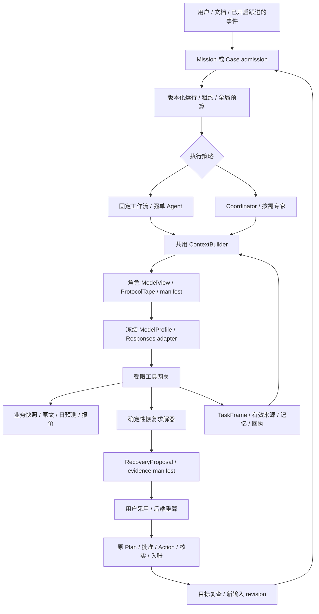
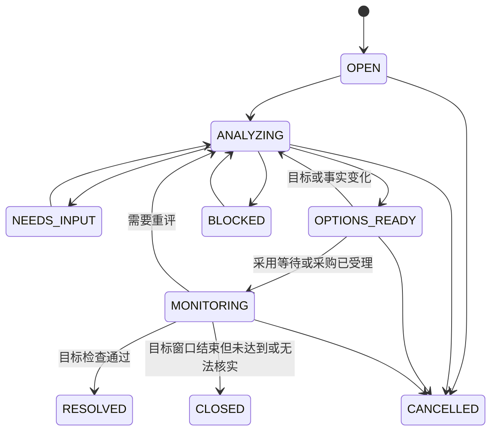
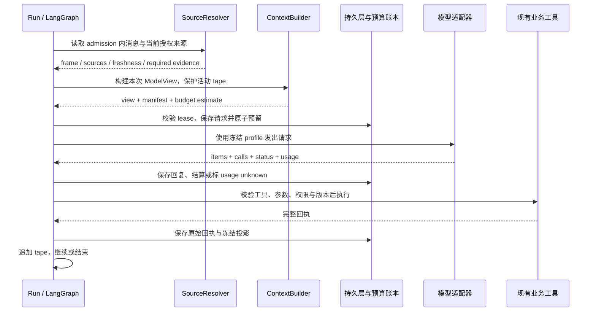
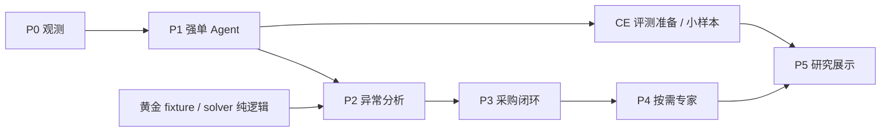

# ShopSteward 下一阶段设计与评测总稿：Multiagent × Context Engineering × Rubric

版本：v1.2 统一评审稿。日期：2026-09-30。实施状态更新：2026-10-02，核心 Case / Context / 专家运行器 / 新版评分器已落地；逐项边界与验收以[交付说明](../../reports/2026-10-02-next-phase-delivery.md)为准，本文保留完整目标设计。

用途：下一阶段统一设计与阶段交付依据。目标：课程旗舰、技术研究、可证实的个人工程经历。

本文件统一收录本轮用例探索结论、Multiagent 设计、Context Engineering、模型选型、rubric 更新、课程映射及交付路线，是下一阶段唯一主设计。设计机制、评分判据与阶段验收在本文对应，不要求读者往返原稿或聊天记录才能理解实施要求。对象、接口、预算和门槛在本稿中表示设计目标；不能据此推断全部已实施或实验已完成，实际情况见交付说明。

快速阅读：0/3/4/20 节看成果、架构与交付；8/9/18 节看模型；5–15 节用于实现评审；19 节看评分与实验；22 节看课程与个人成果。

直接定位：[设计—评分—交付对应表](#design-rubric-map) · [六维任务 rubric](#task-rubric) · [澄清 rubric](#clarification-rubric) · [评分记录与版本](#rubric-records) · [阶段路线](#s20)。

## 目录

- [0. 阶段总纲与统一决策](#s0)
- [1. 目标、范围与用例取舍](#s1)
- [2. 现有基础与工程缺口](#s2)
- [3. 用户旅程、场景契约与黄金样例](#s3)
- [4. 总体架构与路由边界](#s4)
- [5. 领域对象、状态机与版本归属](#s5)
- [6. 证据、业务事实、记忆与新鲜度](#s6)
- [7. Context Engineering：契约、选择、压缩与失效](#s7)
- [8. 模型选型、配置与受控路由](#s8)
- [9. Responses 续接、模型视图与恢复协议](#s9)
- [10. Multiagent：角色合同、上下文与结果合并](#s10)
- [11. 日级恢复求解器与候选生成](#s11)
- [12. 从 RecoveryProposal 到既有采购闭环](#s12)
- [13. 统一运行时：预算、租约、检查点与跟进](#s13)
- [14. 持久化、工具 API、代码落点与迁移](#s14)
- [15. 失败、并发与局部降级](#s15)
- [16. 产品界面与端到端演示](#s16)
- [17. 模拟环境、数据隔离与回放](#s17)
- [18. 模型成本、延迟与资源会计](#s18)
- [19. 统一 Rubric、对照实验与验收](#s19)
- [20. 下一阶段路线、工作包与完成标准](#s20)
- [21. 后续扩展与首版边界](#s21)
- [22. 课程展示、个人贡献与简历证据](#s22)
- [23. 关键取舍、风险与整合自审](#s23)
- [24. 源码依据、官方资料与历史文档](#s24)

<a id="s0"></a>

## 0. 阶段总纲与统一决策

下一阶段把 ShopSteward 推进为**能够理解经营异常、携带有效上下文完成调查、生成可执行恢复方案并跟进结果的经营 Agent**。Context Engineering 是每次模型调用的基础设施；Multiagent 是复杂调查的可选执行策略；确定性求解器和现有采购链负责业务正确性。三者在同一条用户流程中交付。

本稿可独立用于评审、拆分工作包、实现和评测准备。此前用例探索、Multiagent 与 Context Engineering 分稿保留为历史资料；之后的设计及 rubric 修改统一落到本文，出现差异以本文为准。本文包含阶段交付与验收，不宣称代码已实施、模型已完成新接入或实验已产生收益。

| 维度 | 统一决定 |
|---|---|
| 用户目标 | 课程旗舰＋可复现实验＋可核验的个人工程经历 |
| 旗舰用例 | 供应通知/条款变化→影响调查→七日日级库存缺口→等待/应急补购比较→原审批采购链→到货与目标复查 |
| 第一条业务线 | 单门店、单 SKU、至多 3 份替代报价、最多 1 笔应急采购，复用既有 Mission |
| 上下文基础 | TaskFrame、来源与版本、ModelView、完整活动 ProtocolTape、manifest、按需摘要与失效 |
| 协作结构 | Coordinator＋Evidence/Impact/Options 按需子图；深度 1、专家并发至多 2；简单事项保留固定/单 Agent |
| 模型候选 | 复杂任务 gpt-6.1-sol；轻量任务/helper gpt-6-luna；现有 gpt-5.6-luna 作基线；Astra 仅少量离线对照 |
| 状态归属 | ContextBuilder 不授权、不记账、不生成业务真值；Case 组织事项，Plan/Action 负责采购 |
| 交付顺序 | P0 观测→P1 强单 Agent 上下文→P2 异常分析/求解→P3 采购闭环→P4 按需专家→P5 研究与展示 |
| 评测 | 先固定模型测上下文，再固定上下文测模型，再给所有策略相同能力比较协作 |
| Rubric | `agent_case_rubric_v1`；D1–D6 六维判据＋关键失败＋独立任务成功判定；单/多 Agent 共用 |
| 结果兼容 | 旧受限策略 rubric 与历史成绩保留；新评分按任务合同、数据和 rubric 版本独立记录 |

| 可用性要求 | 如何满足 |
|---|---|
| 可用成果 | 用户可多轮修改要求，获得有引用和时间依据的恢复方案，走真实本地采购链完成受理与复查 |
| 功能成功 | 正确试算/修订、适用性和缺口正确、当前版本通过审批校验、未知结果可核实、受理与到货不混淆 |
| 核心前置 | 真实 processor、日级 solver、有效来源、工具/版本协议、现有批准与资金规则 |
| 后置验证 | 独立大样本、生产规模、真实门店效果、多供应商部署、SFT、长期自动学习 |
| 下一可用切片 | 当前 Mission 完成“40→20、只试算、不保存”的带来源闭环；并行开发固定数据的恢复 solver |

默认复用现有 Python/LangGraph/PostgreSQL 和知识服务；尚无确认的本地 GPU 服务。价格与模型信息沿用前稿于 2026-09-30 核验的官方资料，配置与来源保留于第 8/18 节。账号实际可用性和延迟在接入阶段登记。

### 0.1 本次整合的交付边界

本文完整保留“为什么做、做什么、怎样实现、如何判定、怎样证明价值”的链条。各类材料的状态分别为：

| 材料 | 当前状态 | 实施时的用途 |
|---|---|---|
| 现有产品与受限策略评测 | 以第 2/24 节代码及既有报告为依据；本轮未重跑 | 保留业务能力、旧回归与历史比较口径 |
| 用例、架构、上下文、模型及恢复流程 | 设计完成，新增能力未实施 | 按 P0–P4 逐步实现可用结果 |
| 六维 rubric、澄清标准、关键失败与评分 schema | 规范草案，待实现并用 dev 校准 | 开发时指导留证，正式实验前冻结 |
| CE48/OPS48 与协作/模型收益 | 数据及实验方案，尚无本轮新成绩 | P5 用真实轨迹生成结果；不把目标值当成绩 |
| 课程与简历映射 | 交付证据要求，非新增教师权重 | 实现和实验完成多少，就陈述多少 |

文档版本 `v1.2` 与评分契约版本 `agent_case_rubric_v1` 分开：整理章节不自动更改评分含义；改变判据、任务终点或金标时按第 19.16 节做版本迁移。历史分稿用于追溯，不再作为并行维护的实施规格。

<a id="design-rubric-map"></a>

### 0.2 设计、Rubric 与交付对应表

下表把新增机制与可观察结果连接起来。D1–D6 的评分锚点见第 19.13 节；U 为业务场景族，T 为关键回归，CE/OPS 为评测套件，均不是已经跑通的成绩。

| 用户需要的能力 | 设计机制与正文位置 | 核心评分维度 | 应保留的证据与案例 | 交付阶段 |
|---|---|---|---|---|
| 多轮修改后仍遵守最新要求 | TaskFrame、admission、来源替换；第 7/9 节 | D1 目标、D4 执行、D5 修订 | 原话→有效约束→ModelView→真实动作；T01–03/T08、CE | P0/P1 |
| 通知有例外时正确判断是否影响本店 | 版本化来源、实体/适用性、例外 bundle；第 6/7/10 节 | D2 证据、D3 推断 | source/claim 关系及适用性复核；U02/U03/U11、T05/T09、OPS | P2/P3 |
| 看出中途断货并比较可行方案 | 日预测资格、solver、候选约束；第 3/11 节 | D1 约束、D3 方案 | 同一 snapshot 的日轨迹与候选；U01/U04/U05/U08、OPS | P2 |
| 缺信息时精准补齐，不无限追问 | 能力合同、结构化缺项、恢复入口；第 7/13 节 | D6 澄清、D4 完成 | Q1–Q6、实际问答和回复后动作；U10、CE/OPS | P1/P2 |
| 采用建议后得到正确的待确认计划 | recovery Plan、批准/发送校验；第 12 节 | D4 业务完成 | 前后状态、Plan 版本、权限和真实回执；U06/U07/U12 | P3 |
| 删除偏好、撤权或重启后仍可靠 | 依赖失效、ProtocolTape、lease、幂等核实；第 7/9/13/15 节 | D2 证据、D5 恢复 | 失效事件、恢复轨迹、唯一副作用；T04/T06–12、U11/U12 | P1/P3/P4 |
| 复杂调查可以分工，简单问题及时完成 | 按需专家、受限视图、冲突合并；第 4/10/13 节 | 共用 D1–D6；另记协作诊断 | 相同能力的 R0/R1/R2/R3、分层结果与全树用量；OPS | P4/P5 |
| 在质量足够时降低费用与等待 | 模型 profiles、明确路由、共享预算；第 8/18 节 | 同一任务 rubric＋成本/延迟 | 真实模型/参数、失败/升级/重试及总支出；E0/E1/E5 | P0/P1/P5 |

实施证据由运行时记录，评分只读取它们及评测侧金标。不能把期望动作、隐藏需求、判定标签或标准结论放进模型输入；也不能为了符合某一种内部实现，要求所有策略使用完全相同的中间表示。

<a id="s1"></a>

## 1. 目标、范围与用例取舍

### 1.1 已确认

已确认目标为课程旗舰、技术研究与简历经历；本次交付是合并后的下一阶段设计。首版用例已收敛，未进入产品实现。

### 1.2 首版范围

- 一个门店、一个目标 SKU、未来七个营业日桶。
- 一个既有活动 Mission；已有受理订单可以在途，不能有未核实的新采购行动。
- 至多三个有效替代供应商报价；一次决定最多产生一笔应急采购。
- 通知、相关条款和报价说明可以来自少量已发布文档；实体必须绑定到当前门店目录。
- 支持主动用户输入；授权开启跟进后支持事件触发。无需真实邮件或 IM。
- 支持“无需补购”“条件不足但可解释影响”“存在可行补购方案”三类有效结果。
- 用户可以改预算、拒绝推荐、停止当前分析；采购批准仍为现有 approver 操作。

### 1.3 暂不做

不自动取消/退款/替换原订单；不宣称文档是真实供应商承诺；不优化缺少数据支持的利润；不恢复潜在需求；不训练促销弹性模型；不进行多智能体强化学习；不允许专家递归创建专家。

### 1.4 成功边界

只有分析成果时，称“分析完成”；采购被供应源受理时，称“采购已受理”；收到 GOODS_RECEIVED 才称“已到货”。事件事项解除还需符合其目标检查，不能用 Action SUCCEEDED 代替。

### 1.5 用例选择依据

评分不用伪精确的加权总分。下表中的高/中/低是相对于现有项目的设计判断，不是用户调研结论。

| 候选 | 用户价值假设 | 多 Agent 适配 | 现有能力复用 | 新增负担 | 决策 |
|---|---|---|---|---|---|
| 通知变更→业务影响→补救方案 | 从读资料走向处理经营事件 | 高，存在跨来源、适用例外与动态追查 | 高 | 中 | 首版完整闭环 |
| 活动多 SKU 联合备货 | 在预算限制下分配库存保障 | 中高，候选调查可分解、预算必须集中求解 | 中 | 较高 | 后续扩展 |
| 缺货/积压复盘 | 区分预测、履约与决策问题 | 高，竞争假设与历史证据 | 中高 | 中 | 后续研究扩展 |
| 多供应商询价谈判 | 获取并比较条件不同的报价 | 高，信息隔离和多轮交互 | 中低 | 高 | 后续独立研究 |
| 多店调拨 | 在门店间转移库存 | 中，优化常比多 Agent 更重要 | 低 | 很高，缺少调拨账与运输状态 | 本轮不选 |
| 动态定价和促销组合 | 联动售价与需求 | 中，缺少价格弹性和当前售价主数据 | 低 | 很高 | 不纳入本轮 |
| 每日经营简报 | 降低查阅成本 | 低至中，数据固定时单 Agent 足够 | 高 | 低 | 作为结果汇总入口 |
| 自动合规/审计委员会 | 增加解释或复核 | 低，泛化角色难定义产出 | 中 | 中，容易堆调用而无增益 | 不设常驻角色 |

首版选择供应变化，因为项目已有库存、在途、预测、报价和审批基础，证据调查与时间模型可组成完整闭环。其余扩展单列第 21 节，不与 P0–P5 阶段编号混用。

<a id="s2"></a>

## 2. 现有基础与工程缺口

| 层 | 可复用 | 必须新增或改造 |
|---|---|---|
| 用户工作区 | WorkItem、消息、领取/回传、结果与 Mission 入口 | case 详情、类型化文档引用、候选/时间轴和真实 processor |
| Agent | 模型适配、LangGraph、持久检查点和受限工具设计 | case 运行时、专家上下文、全局预算、父子进度和按需路由 |
| 知识 | 文档版本、权限、实体标签、索引与引用展开 | 变更/适用性结构、case 证据投影 |
| 预测 | v6 原始七日日预测与规划资格 | DemandProfile 适配、情景来源和有效性绑定 |
| 业务规划 | 现金、报价、在途、Plan 版本/hash | 时间模型、多报价求解、一次性应急意图、recovery-v1 |
| 执行 | 审批、发送、重试核实、预留、入账 | 按计划类型分派重算与恢复上下文生命周期 |
| 模拟器 | 场景、销售/需求/到货事件、幂等 | ETA 修订、多报价、隐藏需求回放、恢复场景模板 |

关键事实：现有 `Policy.supplier_id` 固定供应商；`Candidate.shortage_qty` 是周期总量计算；`execution.validate_current` 直接调用旧 `build_plan`；WorkItem 引用未支持 document/forecast；原检查点 fence 依赖 job_runs，不能直接用于仅持 WorkItem 租约的新 processor。

源码依据见第 24 节。上述缺口纳入范围，不把新增专家 Prompt 当作完整接入。

### 2.1 当前上下文路径

| 已检查代码 | 当前行为 | 建议变化 |
|---|---|---|
| [jobs.py](../../../backend/app/agent_bridge/jobs.py) | 最多读取 80 条消息，按所属轮次整理，再转 role/content；限制当前 run 输入水位 | 保留轮次/水位，按预算选择完整消息组，携带来源 ID |
| [composition.py](../../../backend/app/agent_bridge/composition.py) | 每模型轮刷新知识；注入中文规则、记忆、当前用户来源、近期文档 refs | 分离稳定指令、任务数据、动态证据，装配类型化 packet |
| [runtime.py](../../../agent/src/shopsteward_agent/runtime.py) | 发送 load_context＋state.messages；本轮工具 JSON 追加到消息 | 模型调用改用编译后的 view，原始 state 保留 |
| [model.py](../../../agent/src/shopsteward_agent/model.py) | 适配两种 API 模式，max_completion_tokens=2048 | 记录 profile/用量并预留输出；不把 2048 当上下文总上限 |
| [evidence_policy.py](../../../backend/app/agent_bridge/evidence_policy.py) | 对部分明确请求强制取证及回答前校验 | 保留，按证据依赖补充新鲜度判断，避免与动态工具筛选冲突 |
| [knowledge.py](../../../backend/app/agent_bridge/knowledge.py) | 用户/门店隔离、版本化偏好与 Skill，显式写入 | 复用版本和来源，不让摘要覆盖当前值 |
| [document_evidence.py](../../../backend/app/agent_bridge/document_evidence.py) | 检索最多 6 个候选，展开最多 20 个块，校验当前引用 | 数量限制外增加 token/字段级选择，保留条款例外 |
| [tools.py](../../../backend/app/agent_bridge/tools.py) | read_experiences 返回已完成任务正文片段及引用 | 后续改为有结果/适用条件的经验卡，不把正文当验证过的知识 |

已有 scope、权限、记忆刷新与证据校验值得保留。未发现统一 token 预算、结构化 TaskFrame、会话摘要或按任务选择上下文的完整层；这不意味着已经测得模型因这些缺口失败。

源码依据为此前已检查的 HEAD `30bed9f` 与工作区文件；已有其他未提交工作，本次整合没有更改产品代码或重新验证服务。

<a id="s3"></a>

## 3. 用户旅程、场景契约与黄金样例

### 3.1 输入入口

1. 在任务工作区提出“评估这次供应延迟”。
2. 在文档详情选择已发布版本，点击“分析经营影响”。引用通过显式 attachment_refs 传递，不把文件 ID 塞进自由文本。
3. 已开启跟进的事项收到相应结构化事件后，由后端入队复查。

第一次完整演示使用入口 1 或 2；自动文档发布监听不阻塞该切片。所有入口创建/继续同一个可持久事项，用户刷新后能恢复。

### 3.2 正常链路

| 步骤 | 用户可见行为 | 系统交付条件 |
|---|---|---|
| 受理 | 显示正在核对的事件及目标 | 原消息/附件已持久化，身份及门店明确 |
| 取证 | “正在核对通知适用范围” | 实际子任务事件，不显示虚构思考过程 |
| 影响 | 展示受影响订单、日期及原因 | 每个关键结论连接证据或业务快照 |
| 比较 | 等待、快速补购、低价补购对照 | 数字来自相同求解快照，包含被淘汰原因 |
| 改口 | 用户降低预算，旧比较保留 | 新意图版本使旧候选不可接受，重算相关部分 |
| 采用 | 选择候选，生成待确认计划 | 后端重新核对依赖并重算；不执行采购 |
| 批准 | 原采购确认卡显示数量、供应商和金额 | 原审批身份、版本、hash 及资金校验 |
| 跟进 | 已受理/部分到货/全部到货/仍需处理 | 由真实 Action/到货事件驱动 |

### 3.3 验收场景族

| ID | 场景 | 成功结果 |
|---|---|---|
| U01 | 延迟导致时间缺口 | 指出缺货发生日，选择有效补购 |
| U02 | 原订单被旧条款豁免 | 不把新条件错误应用到旧订单 |
| U03 | 文档与源 ETA 不一致 | 展示已记录值与待核实通知，允许条件情景 |
| U04 | 总量充足但中途断货 | 不用总量结论掩盖时间缺口 |
| U05 | 低价方案过晚 | 不推荐对目标无帮助的采购 |
| U06 | 用户压低预算 | 新候选符合新预算，旧候选失效 |
| U07 | 原采购结果 UNKNOWN | 分析可继续，新采购先等待核实 |
| U08 | 部分到货 | 只计算尚未收到的剩余量 |
| U09 | 没有相关影响 | 解释无需行动并提供必要复查条件 |
| U10 | 缺少关键日需求或有效报价 | 交付已知事实和精确缺项，不编造数字 |
| U11 | 分析中通知被撤回/权限变更 | 不发布原文或可执行的旧结论 |
| U12 | 重启/重复提交/丢响应 | 恢复同一逻辑结果，不重复生成或发送采购 |

### 3.4 黄金样例：总量够但中途断货

以下是人为设计的合成场景，不是项目经营效果。单位为件、人民币元；程序中金额全部存整数分。

- 第 1 天开始时现货 20，七天每天需求 10，共 70。
- 原订单已受理、已付款，剩余 50 件由第 3 天延期到第 5 天日初到货。
- 当前可用现金 800，现金底线 500，应急采购上限为 300；原订单支出不再重复扣减。
- 原订单仍会到货，不因应急采购而消失。

| 选项 | 到货 | MOQ/包装 | 单价 | 数量 | 新支出 | 七日缺货 | 期末现货 | 结论 |
|---|---|---|---:|---:|---:|---:|---:|---|
| 等待 | 原订单第 5 天 | — | — | 0 | 0 | 20 | 20 | 第 3、4 天各缺 10 |
| A | 第 3 天 | 40/10 | 9 | 40 | 360 | 0 | 40 | 违反现金底线 |
| B | 第 3 天 | 20/10 | 12 | 20 | 240 | 0 | 20 | 可行，满足目标 |
| C | 第 5 天 | 20/10 | 8 | 20 | 160 | 20 | 40 | 更便宜，但没有缓解缺口 |

等待与 B20 的每日期末现货分别是 `[10,0,0,0,40,30,20]` 和 `[10,0,10,0,40,30,20]`。等待的丢失需求是 `[0,0,10,10,0,0,0]`；B20 为全零。

20 现货＋50 在途等于七日总需求，旧总量算法可能给出零缺口；新的时间模型能识别中间断货。若预算改为 200，B20 不再可行，C20 仍无目标收益，按既定排序应推荐等待并说明尚有 20 件需求不能覆盖，而不是为了完成采购选择 C。

上表在设计阶段已用独立 Python 枚举核对，整合时再次检查其日轨迹与资金边界；这只验证设计示例，不是新求解器或 Agent 的验收。

### 3.5 黄金样例与 Rubric 的衔接

先固定该例终点。若用户要求“分析并推荐”，完成分析不等于必须生成采购；若要求“生成待确认方案”，则必须有真实 Plan 回执。下表是评分说明，描述假设轨迹应如何判定，不是已取得的模型结果。

| 案例终点与假设行为 | 主要判据 | 任务成功如何判断 |
|---|---|---|
| 预算 300，只分析；有据地比较等待/A/B/C，推荐 B20，说明费用 240 与预计缺货 0，未写业务状态 | D1–D4/D6；依赖来源和计算符合合同 | 其余必要检查通过即可为 true；无采购回执不扣分 |
| 预算改成 200，只分析；重算后推荐等待，说明预计仍缺 20，旧 B20 不再作为可行方案 | D1/D3/D5；目标版本与候选一致 | 可以为 true，不因未采购而失败 |
| 预算改成 200，仍把 B20 推荐为可执行方案 | D1/D3/D5；违反当前硬预算 | false；引用齐全、语言流畅或专家一致不能抵消 |
| 用户要求生成待确认方案，只给出分析并如实说明尚未生成 | D4 部分完成；要求的 Plan 回执不存在 | 已确认未完成则 false；保留其他维度的有效表现 |
| 只生成待确认 Plan，却向用户声称采购已受理 | D4/D6；交付状态与回执不符 | false，并记录关键状态误报 |
| 用户要求生成待确认方案，记录缺失，既不能证实成功也不能证实失败 | D4 待判；不能只凭模型自述完成 | null / missing_trace，计入未判定数量，不算通过 |

单 Agent、多 Agent 和不同模型均使用这些终点与判据。多 Agent 的额外调查只有在改进结果或成本/时延时才形成价值证据；本例的确定性数值正确性由同一 solver 校验。

<a id="s4"></a>

## 4. 总体架构与路由边界

采用推荐架构的假设是：适用性调查和经营调查需要不同上下文，且新发现可能要求补查。收益来源应是遗漏减少、调查覆盖提升或相同质量下缩短时间，而不是角色名称。

### 4.1 三个候选

| 路线 | 适合情况 | 取舍 |
|---|---|---|
| 固定 workflow | 结构化单事件、对象明确 | 最便宜稳定；作为强基线和简单路径 |
| 单 Agent＋同等工具 | 中等复杂、少量材料 | 集成简单；作为主要对照 |
| 有界协调器＋专家 | 多材料/例外/候选路径需动态补查 | 需付出调度、上下文交换和恢复成本 |

不使用自由互聊网络，不强制每次启动全部专家，不额外设 LLM 审批者。LLM 总结中的“多数同意”不作为业务事实。

### 4.2 路由

显式功能入口和类型化事件决定任务族，主 Agent 根据可见缺项选择 simple 或 collaborative。单个明确的结构化变化可直接调用固定分析。复杂标志包括：需要跨文档适用性判断、多个竞争解释、报价条件尚未齐全、多个独立调查方向。

关键词只用于提示，不能因为出现“复杂”二字就提升模式。路由决定和原因写入短的结构化日志。研究时支持强制 single/static_multi/adaptive_multi，防止路由改变测试分布。

### 4.3 统一系统结构



ContextBuilder 是所有 LLM 调用共用的确定性组件，不是第五个 Agent。helper 提取/摘要由运行时显式调度和计费，不能藏在 builder 中。主 Agent、单 Agent 与专家都经过相同来源、权限、预算和协议检查。

首版专家为现有 agent 包内的同进程独立 LangGraph 子图，不分别部署服务。Case 与 Mission runtime 保持独立生命周期，通过 admission/source/budget adapters 共享组件；业务库保持经营事实来源，知识服务负责原文与引用，不另建通用消息中间件或记忆平台。

### 4.4 三种选择分别负责

- 业务策略：等待还是补购，由目标、事实、solver 和用户采用决定。
- 执行策略：固定流程、单 Agent 或按需专家，由缺项和独立调查方向决定；实验允许强制选择。
- 模型 profile：Luna 或 Sol，由任务类别及已验证能力决定；不会改变工具权限。

静态模型路由与按需专家可共存：Coordinator 决定是否委派允许的角色，role→model 映射在 run 开始时冻结。自动 light→main 升级属于后续配置，不是首次协作上线的前置。

<a id="s5"></a>

## 5. 领域对象、状态机与版本归属

### 5.1 分层含义

- WorkItem：用户的一件事与连续对话。
- OperationsCase：一次经营事件的处理上下文。
- CaseRevision：某次事件/用户要求下不可变的输入和证据视图。
- CaseRun：某 revision 的一次可恢复计算周期。
- RecoveryProposal：不可变候选比较成果。
- Plan/Action：既有业务计划和采购行动。

一个 WorkItem 可以保留多个历史 Case，并通过 current_case_id 指向前台当前 Case；同一 WorkItem 同时最多一个运行中的 root。新通知与同一事件相关时进入原 Case 的新 revision，独立事件另建 Case。关联既有 Mission 仍使用现有规范事项归并机制，不绕开同用户同 Mission 的规范卡片。

### 5.2 Case 状态与 WorkItem 投影



Case 决定与 Plan/Action 状态单独关联；无需把每一种采购状态复制进 Case 状态机。WorkItem PROCESSING/WAITING_INPUT/RESULT_READY/BLOCKED 继续表达前台响应。关联 Mission 的 WorkItem 不因回答结束就标 COMPLETED；Case RESOLVED 不自动完成 Mission。

未开启跟进时，可以交付“分析已完成、尚未验证解决”，Case 保持 OPTIONS_READY；不会假装后台持续监听。用户归档结果不等于已解决经营问题。

Goal 记录 `window_start/end, objective, max_lost_qty（若用户设定）, evaluation_basis`。RESOLVED 只用于无影响已被核实，或目标所需事实已经足够且满足明确的成功条件；仅有未来预测时保持 MONITORING。窗口结束后仍未满足/证据不足则 CLOSED，outcome 为 unmet/unknown，保留原因，不长期显示“处理中”。模拟器可以提供实际丢失需求进行结果核对；现实没有该数据时不得把它记成 0。

新 revision 不能抹去窗口内已发生的缺货；若用户明确改变目标窗口，分别保存原目标结果与新目标。停止本次运行只取消 CaseRun，Case 回到 OPEN 或保留已有 OPTIONS_READY；只有明确结束事项才进入 CANCELLED 并关闭其跟进。

### 5.3 新增持久对象

| 对象 | 核心字段/约束 | 为什么需要 |
|---|---|---|
| operations_cases | id、work_item_id、store/owner、kind、anchor、status、current_revision、followup | 事件连续性与所有权 |
| case_revisions | case_id＋revision 唯一，goal、scope、snapshot、seed_evidence、dependencies、input_revision，内容不可变 | 防止新旧证据混用，保留改口历史 |
| case_runs | run_id、revision_id、lease_epoch、status、deadline、usage_budget、mode | 重启与全局预算 |
| case_subtasks | subtask_id、run_id、role、task_spec、checkpoint_key、status、result、dependency_hash | 隔离专家上下文、选择性复用 |
| case_calls | run/step/kind 唯一，request_hash、reserved_budget、status、result、usage | 模型/工具调用预留、幂等与成本 |
| recovery_proposals | proposal_id、revision_id、snapshot/hash、solver_version、结果、expires_at | 可引用且可重算的成果 |
| case_events | case_id、递增 seq、source_key 唯一、事件类型、payload、delivered_at | 进度回放与持久复查触发 |

子表通过 case/run 外键继承 owner/scope，读取时必须 join 校验，不能只凭 ID。业务需要的金额保持 bigint 分；模型生成的 claim 保存在 Case JSON 中，不进入经营账表。索引围绕待处理事项、待交付事件、case_id/seq 和依赖查找建立。

必要扩展字段：WorkItem 的 `input_revision/current_case_id`；Mission 的可空 `planning_context`。input_revision 只在用户输入或新业务意图时递增，不在纯进度续租时递增，避免把每次 heartbeat 当作用户改口。

ETA 变更还需为 InboundRow 保存最后有效的源序号/ETA revision；旧数据可用初始来源版本回填。新源事件在后端和 simulator 的类型合同、归属校验及幂等消费中同时注册，不只在 Agent 层添加事件名。

### 5.4 快照与版本向量

一次计算引用：state_version、mission_version、policy_version、forecast_id/model_version/绑定状态、offer_versions、逐订单 ETA 版本、文档 version/evidence_revision/publication_revision、case/input_revision、solver_version。

业务库用短 REPEATABLE READ 快照。文档读取在锁外完成，并绑定不可变版本；发布前在后端再次校验引用的权限及当前适用性。系统不宣称跨 PG/OpenSearch/LLM 存在分布式事务。

CaseRevision 的 seed_evidence 只冻结本轮开始时的附件和已知证据。调查中新发现的文档以不可变版本追加到 case_calls/子任务产物，不能修改旧 revision；最终 RecoveryProposal 冻结完整 evidence_manifest 和其依赖哈希。读到两个不同业务状态版本时必须选择重新捕获快照，不在结果里混合它们。

分析可复用按依赖 hash 相同的内容；最终 materialize/approve/send 仍使用保守的当前业务版本校验。前者降低无意义重算，后者保护实际采购，两者不是同一层判断。

### 5.5 部分失效

预算变化→重新求解/推荐，保留有效原文和适用性结论。ETA 变化→重新计算库存/方案，保留无关供应商条款。文档权限撤回→相应引用不可再展示，对依赖它的结论撤销或改用其他证据。预测改变→Impact/Options 重算，不重新搜索无关合同。

复用必须是依赖清单一致，不以“看起来类似”判断。后端业务快照改变后即便分析产物可复用，也需要新 Plan 和新批准，不能转移旧 hash。

### 5.6 三种版本不可混用

| 版本 | 何时改变 | 影响 |
|---|---|---|
| WorkItem.version | 进度、续租、前台状态 | 控制更新竞争，不能据此认定用户改口 |
| input_revision / admitted message set | 新用户意图或影响任务的输入事件 | 新 CaseRevision，旧结果/未发送计划重校验 |
| source/business versions | Plan、现金库存、ETA、预测、报价、文档和偏好变化 | 定向失效派生结果，发布与执行重校验 |

Mission 的 input_through_seq/resume 与 Case 的 input_revision 是不同 admission 协议，通过带标签的 AdmissionBoundary 复用 ContextBuilder；模型不能修改这些边界。

<a id="s6"></a>

## 6. 证据、业务事实、记忆与新鲜度

### 6.1 四层数据

1. 原始证据：文档版本、块、位置、内容 hash；或者结构化源事件/业务对象版本。
2. Claim：模型对证据的解释，附适用对象和时间，允许不确定。
3. Scenario assumption：用户明确接受的情景假设，只作用于 Case，不默默改库存或报价。
4. Authoritative projection：由业务导入/源事件/明确的操作接口维护的当前状态。

PDF 写“交期五天”不能直接覆盖在途 ETA；PDF 报价与业务报价冲突时，候选可作条件分析，但不能产生按该报价执行的 Plan。执行前须有有效结构化报价；首版模拟源可以发布相应版本，现实接入可由现有/新增受控报价录入完成。

### 6.2 有界适用性表示

首版支持：supplier_id、sku_ids、action_ids、旧/新订单范围、订单创建时间条件、effective_from/until、显式 exclusions。未知的附加商务条款标为 unsupported_condition，不让 LLM 任意扩展 DSL。

上传时间不等于生效时间，最新文件不自动覆盖历史订单条款。缺少实体映射时先返回候选；只有影响任务选择的歧义才询问用户。

### 6.3 来源权限与可执行性

Case 继承 WorkItem 的 owner/store 边界。私有资料只对当前 owner 及获授权服务可见；后端每次读取与发布重新校验。文档中的命令、角色声明或“可以采购”不进入工具授权。

状态分为 verified_source、supported_interpretation、user_assumption、unresolved，而非一个不可解释的 confidence 百分比。关键执行参数只能来自有效业务源或明确绑定的允许情景输入；用户认可文字不等于供应商接受新报价。

### 6.4 数据所有权

| 信息 | 权威来源 | 模型看到的形式 | 更新/失效 |
|---|---|---|---|
| 身份/权限、连接、凭据 | 服务端 runtime | 只提供必要作用域和能力标签，凭据永不进入 prompt | 每次业务操作校验 |
| 当前用户目标 | 本 run 获准读取的用户原话与修订 | TaskFrame＋关键原句/source IDs | 新输入或澄清形成新版本 |
| 库存/现金/当前 Plan | 业务工具与版本化对象 | 精简事实/对象句柄 | 状态/版本改变使旧数据失效 |
| 文档条款 | 可访问原文版本 | 条款摘录、适用范围、例外和引用 | 版本/权限/发布变化 |
| 当前偏好/Skill | KnowledgeScope 当前版本 | 相关条目及来源/版本 | 当前 scope 决定，不由旧摘要恢复 |
| 本轮已完成/失败操作 | ToolInvocation 和业务回执 | 结构化执行记录 | 不可用文字摘要改写成功/失败 |
| 跨轮讨论/经验 | 消息与历史任务 | 有来源的压缩纪要/经验卡 | 非当前业务事实，按需检索 |

这不是一个覆盖所有内容的单一“优先级列表”。用户可以改变自己的目标；当前现金仍由业务库决定；文档描述条件但不能授权工具。冲突按字段的所有权处理。

### 6.5 三种记忆

| 记忆 | 例子 | 存储/注入策略 |
|---|---|---|
| 工作记忆 | 本次只试算 20 件，等用户答复单位 | TaskFrame 和 run/case state，任务相关即保留 |
| 情景记忆 | 某次因 MOQ 不满足导致候选被淘汰 | 完成任务卡，按当前问题检索，附适用条件与回执 |
| 长期偏好/Skill | 喜欢表格回答、明确保存的补货流程 | 继续使用 KnowledgeScope，按任务和阶段筛选 |

长期记忆仍保持当前“用户明确要求写入”的语义，不因为新增 context engineering 自动抽取并保存所有对话。自动学习可以另做设计，不是本次前置。

删除/纠正偏好后，旧摘要、tool 回执和经验卡不能重新把它注入为当前偏好。摘要中的记忆字段绑定 scope version；版本变化时删除该派生字段或从当前 scope 重建。历史审计记录仍可存在，不等于继续生效。

“当前现金 800 元”“今天供应商延迟”是动态事实，不能混入长期偏好。经验检索的语义相似度只能用于召回，适用性还要核对任务、条件、时间和来源。

初期库小，用 scope/task_type/实体过滤和少量排序即可；只有实测检索不足再加入 embedding。Skill 选择优先任务类型、阶段、允许工具及条目来源，不把历史成功率虚构为已学习分数。

### 6.6 应用缓存

稳定系统文本和稳定工具 schema 可用于应用级构建缓存；供应商 prompt caching 能否命中需另行实测，不承诺节省比例。

偏好/Skill 缓存键至少包含 principal/store/task/knowledge version；证据缓存包含文档版本、权限相关版本、发布代次和 hash；计算结果包含完整 snapshot/solver version。TTL 可作为补充，不能单独证明库存或权限仍有效。

每轮 ContextBuilder 的刷新不等于无条件重复查询全部服务。对已经加载且依赖未变的产物复用，对有变化的依赖定向刷新。发布或业务写入前继续原校验；缓存不能延长 Plan TTL 或恢复被撤销的证据。

<a id="s7"></a>

## 7. Context Engineering：契约、选择、压缩与失效

下列是新增内部 DTO 设计，均不是现有公开 API。实现使用 Pydantic 严格校验、显式 schema_version 与规范化 JSON hash；未知字段不静默接受。

### 7.1 AdmissionBoundary 与 SourceRef

```text
AdmissionBoundary =
  MissionInput(run_id, conversation_id, input_through_seq,
               admitted_resume_message_ids, prior_run_dependencies)
  | CaseInput(case_id, input_revision, run_id, lease_fence)

SourceRef:
  source_type: message | tool_receipt | business_object | document |
               knowledge_entry | summary | experience | task_frame
  source_id, version?, content_hash, scope_key
  locator?, parent_source_ids[], observed_at, valid_until?
  authority_domain, trust_class, freshness
  admission_dependency, retrieval_method
```

`observed_at` 不等于业务生效时间；未来供应延迟同时记录 notice_time、effective_business_date 和获取时刻。`version=null` 表示来源本身无版本，不表示可以永久缓存。Message 使用 ID/seq/hash；Plan 使用 Plan/state 版本；文档使用 version/generation/metadata hash；KnowledgeScope 使用 scope version。

权限不能由 `scope_key` 这个字符串自证，SourceResolver 根据当前 principal 实际查询授权。来源无权读取、已删除或 hash 不符时，不能只因 artifact 曾经合法就继续展开。

### 7.2 TaskFrame 字段与更新算法

```text
TaskFrame:
  schema_version, frame_id, parent_frame_id?, run_id, admission
  task_type, phase, intent, requested_effect
  constraints[]:
    key, operator(eq|lte|gte|unset), value?, unit?, scope(one_run|scenario)
    source_message_id, exact_quote, source_span, supersedes[]
  entity_bindings[]: kind, id?, candidate_ids[], resolution_source
  plan_ref?, unresolved[], required_evidence[]
  completed_operations[]: receipt_ref, status, operation_version
  extraction_profile?, validation_status, source_digest
```

更新步骤：

1. 找到在本 admission 内可复用的 frame；只将新获准输入交给提取器，附当前活跃约束及对应原句。当前完整用户修订不先经过摘要。
2. 提取器输出 `proposed_patch`，不直接修改业务对象。每个设置/取消必须指向一段真实存在的用户原话；source_span 与原文一致。
3. 校验类型、单位、scope、操作符、重复键、supersedes 的对象是否存在；工具 ID 与金额只能从授权工具对象补全，不由提取器发明。
4. 无歧义的 patch 生成新的不可变 frame。语义存在冲突的字段标 `unresolved`，保留两个来源；主模型能看到原句并选择澄清。
5. 未提及字段原值保留。`unset` 仅取消本次用户约束；不能删除业务 cash_floor、采购审批或其他服务端限制。
6. 每次调用仍将关键原话放在 frame 旁。若 frame 与原话冲突，禁止基于冲突字段产生写动作，重新解释或澄清；不能让摘要成为唯一目标来源。

取消上限后再明确“本次恰好 20”应为 eq=20，而非自动沿用 lte；“假如买 20 会怎样”是 scenario，不是保存计划；“别改了”须结合最近合法指代区分停止修订与撤销 Mission。数值 0 是实际值，null 是缺失，unset 是取消条件，三者不能共用一个值。

提取器不可用时有退路：如果原始输入和既有有效约束能整体纳入预算，直接交主模型；不能纳入时报告具体缺失信息，不把提取失败伪装成用户表达不清。真实歧义才提出澄清问题。

### 7.3 ContextBlock、证据依赖与投影

```text
ContextBlock:
  block_id, kind, source_refs[], task_keys[], authority_domain
  required_reason?, freshness, dependency_keys[], conflicts_with[]
  representations[]: full | clause_bundle | structured | receipt | handle
  rendered_hash, token_estimate, estimator_version

EvidenceReceipt:
  receipt_id, tool_name, args_hash, source_refs[], subject_ids[]
  facts_schema_version, result_hash, checked_versions, observed_at
  satisfied_requirements[], validity_rule

ModelView:
  run_id, segment_id, admission, profile_version, builder_version
  messages_or_items, tools, selected_blocks[], omitted_blocks[]
  token_budget, continuation_ref?, manifest_id, rendered_request_hash
```

必需块优先，不用一个不透明的相关性分数覆盖业务规则。可选块依次按当前实体匹配、任务阶段、明确引用、是否仍有效排序；相同等级按 source ID 稳定排序，方便回放。

条款是 bundle：主体规则＋适用对象＋时效＋例外＋来源。若例外在另一 chunk，bundle 必须包含该 chunk 或标缺项，不能把不完整摘录标为 fully_supported。无法用程序保证所有自然语言例外完整，因此需要专门的尾部例外测试和人工核对样本。

对已 superseded 的证据允许用于“为什么方案变了”的历史比较，但须 `historical=true`，不能满足当前 `required_evidence`。同一供应商多个通知冲突时保留相互关系，不能仅按检索分数选一个充当最新版本。

### 7.4 工具投影的稳定契约

每个工具注册 `project_result(raw, task_type) -> ProjectedResult`，schema 按工具版本管理，不用 LLM 随意裁剪。投影至少返回：`ok, outcome, subject/version, facts, constraints, missing_fields, source_refs, artifact_ref?`。

金额保留整数最小货币单位与权威 money_display；单位转换在业务代码内完成。`evaluate` 的结果明确 `persisted=false`；`revise` 明确新旧版本和 `persisted=true`；采购 `accepted`、`arrived`、`unknown` 分开。异常工具保留 error code、可恢复性及是否已产生副作用，不能只显示“失败”。

若完整值的重读能力尚未实现，模型投影不得删掉回答必需字段。初期直接复用 document chunk read 和既有业务读取；仅当确需读取历史大回执时新增 `read_context_artifact`，限制 owner/store、artifact kind、字段/块、响应预算并再次验证来源权限。

### 7.5 模型可见内容的分层

建议每轮包含七类块：

1. 稳定系统规则：身份、工具事实边界、引用规则、回答要求。
2. 当前任务：目标、关键原话、当前意图/约束和未解决问题。
3. 当前必需事实：有效 scope、Plan/状态/证据引用与新鲜度。
4. 相关偏好和 Skill：只选当前任务需要的条目。
5. 相关证据：回答当前问题所需条款及例外；其他以句柄存在。
6. 工作状态：已完成操作、失败原因、仍需补查的缺项。
7. 最近完整交互：保留指代、否定和未结束工具调用所需消息组。

稳定系统规则由应用维护。用户原话、记忆和文档正文即使被应用选择，也仍是数据，不能因为拼接到高优先级消息里就获得更高权限。消息渲染器按模型 API 合法角色表达，明确标注来源；不能制造没有对应调用的 tool 消息。

来源标签和格式化并不能消除提示注入，实际工具权限、版本和金额检查仍在后端。现有 system 中的知识数据可逐步拆到专门的数据块，无需第一阶段重写所有提示词。

### 7.6 一次调用的生命周期



### 7.7 历史读取不能先丢信息再做 Context Engineering

`jobs.py` 的 `.limit(80)` 是 SQL 层截断。只在其下游增加 token selector，无法恢复第 81 条之外仍有效的约束。

新 loader 返回带 ID/seq/run/reference 的 `MessageEnvelope`；先加载 admission 范围内的元数据目录、已有有效 frame/summary 和被引用的原文，再按完整 run 分页取正文。已有 frame 中的活跃 source IDs 即使很早也按 ID 取回；最近消息窗口只是候选来源之一。

Assistant 消息必须追溯其所属 run 的 admitted inputs，不能因为 role=assistant 就绕过新边界。新运行中尚未获准的用户消息、其派生摘要和结果均不入选。当前 run 的合法 resume 按原 interrupt 协议接纳。

迁移优先从新 conversation 启用 CE1。旧 conversation 没有 frame 时，需要显式 bootstrap coverage：分页扫描授权历史并建立来源目录，历史超出一次可验证处理范围则保持旧策略并标 `legacy_history_unindexed`，或运行一个有独立预算的初始化任务后再启用。不能在后台默默处理大量旧消息，也不能把只看了 80 条的 frame 标为覆盖全部会话。

### 7.8 预算选择算法

首先计算 `available_input = min(profile.hard_input, model_window - reserved_output) - safety_margin`；这里工具/schema/协议计数全部算在输入内，不再次扣除造成双重计数。实现采用这一全请求口径，不再次扣除 schema/协议造成双重计数。

1. 收集授权且 admission 合法的 source blocks；先过滤 permission/stale/superseded，不让失效信息参与排名。
2. 固定稳定规则、有效 scope、关键原话/目标、未解决问题和当前协议 tape；将所需工具 schema 一起计数。
3. 选择足以回答本阶段问题的事实和 clause bundles。能由句柄重读的可选原文才允许退到 handle。
4. 有剩余预算才加入相关偏好、经验卡、旧完整回合；先去重，再降 representation，最后省略。
5. 达到软目标时优先移除可选块；必要块可以超过软目标但不得超过硬上限。不按 token 预算平均分配给所有类别。
6. 最终渲染后再次计数。安全余量初设为硬输入的 10%，结合实际 usage 校准；unknown tokenizer/opaque item 的误差另记，不能把密文字节直接当真实 token。
7. 必需项无法容纳时返回 `CONTEXT_REQUIRED_OVERFLOW`，不发送一个缺硬约束的请求。有合法阶段边界才重建 segment，否则返回部分结果和范围限制。

预算计数使用供应商支持的计数能力或本地模型 tokenizer；不能可靠精确计数时使用保守上界。若服务端仍报超长，只允许移除可选块的一次重编译；活动 tape 或必要条款不会被临时截断。

### 7.9 信息新鲜度是依赖关系

| 变化事件 | 派生产物的处理 |
|---|---|
| 用户把预算 300 改为 200 | 新 frame/input revision，旧候选保留作历史，待选 proposal 失效重算 |
| Plan/state version 改变 | 旧 EvidenceReceipt 不能满足当前方案证据，重新 get_plan/check |
| 用户删掉“优先 A 供应商” | 当前 scope 重读，摘要/经验中对应 preference 字段不再注入 |
| 文档换版、撤权或失去发布资格 | bundle 和派生解释失效；发布前再次检查 |
| 工具超时且可能已提交修改 | 回执核对优先；不把 unknown 当失败重新修订 |
| 只是 heartbeat/progress version 改变 | 不视为业务输入变化，不触发全部专家重跑 |

以 `dependency_key -> artifact IDs` 做简单索引或 JSONB 查询即可，初期不建分布式事件总线。每次 build 进行 lazy validation，关键发布/写操作再次校验。事件通知只是提前失效优化，丢一条事件不应导致错误执行。

### 7.10 压缩事务

只有完整旧回合与明确 coverage 才能申请摘要。先按来源准备结构化事实，再让 summary profile 补充讨论脉络；对受控字段只允许引用，不能生成新金额、版本或动作结果。完成后校验覆盖集合、引用权限、约束引用和 scope version，再以 compare-and-swap 提交。

若摘要期间源版本变化，丢弃该候选摘要并保留原 view；不覆盖别的 worker 的更新。summary 不是必须产物：额度不足、来源删除、内容校验失败均跳过压缩；不能为了维护摘要拖垮一次简单试算。

### 7.11 摘要覆盖与历史语义

会话摘要采用结构化记录：已确定目标、用户明确约束、尚未解决的问题、已执行动作/回执引用、已放弃选项及原因、可重新定位的证据、摘要覆盖区间与依赖版本。

摘要不保存或生成模型隐藏推理；它是可展示的任务事实纪要。金额、ID 和执行状态优先从结构化对象投影，不由摘要模型重新编写。

只在历史超过预算或完整旧任务结束时压缩。初期优先确定性的工具投影与 TaskFrame，再引入 LLM 历史摘要。不要每轮都调用一个摘要模型。

摘要保存 `through_message_seq, run_ids, source_hashes, memory_scope_versions, summary_version, invalidation_keys`。压缩覆盖区间不得越过当前 run 水位。摘要生成失败时回退到受限原始视图；不能用残缺摘要替换全部历史。

`through_message_seq` 只是便于检索的上界，不代表区间内所有消息都已覆盖。排队输入、迟到回复会产生空洞，因此同时保存明确的 covered source IDs、run IDs 与 coverage digest；只替换确实被覆盖的旧回合。任务活跃的来源原句单独固定保留，不依赖摘要重新记忆。

避免“摘要的摘要”长期漂移：持久来源仍可定位，必要时从原始消息重建。对关键业务事实只保存指针和历史时点；读取当前值仍走现有工具。

### 7.12 工具集合与取证要求

当前工具数量并不巨大，因此动态筛选是后续优化，不是第一优先。先保持现有 catalog 和 required_tools 的正确性。

未来 offered_tools = 授权集合 ∩ 角色能力 ∩ 当前阶段相关能力，并补齐明确取证要求和恢复所需工具。clarify、必要事实读取、可发现的只读能力入口应可用。

不能把 request_check 隐藏后又因旧方案过期无法继续；不能因缓存中有旧 get_plan 结果就跳过 required_tools；不能让主 Agent 委派到看不到必要证据工具的专家。上下文筛选不是权限控制，后端仍校验每次调用。

把取证要求从“工具名执行过”逐步增强为“对应 scope/版本的 EvidenceReceipt 仍满足当前依赖”。先兼容旧 required_tools 字段；缓存读取只有经过同等新鲜度/权限校验并形成回执，才能代替真实重复读取。

<a id="s8"></a>

## 8. 模型选型、配置与受控路由

### 8.1 选型前提与证据等级

首版沿用现有 Python/LangGraph/PostgreSQL 和 OpenAI 适配路径；尚无已确认的本地 GPU 服务。公开 API 能力、项目已有实验和本稿推荐必须分别标记。

- 代码事实：`config.py` 默认 `gpt-4.1-mini`；`model.py` 提供 Chat Completions/Responses 两种模式，输出统一为文本、工具调用和 usage。
- 项目实验：`docs/reports/posttraining/repair-v2/dev-repair-v2/decision/B1/manifest.json` 记录官方 API 的 `gpt-5.6-luna`、Responses、prompt v2、1024 输出上限。开发集 199/200 等结果属于受限决策实验，不代表完整经营任务达到同样成功率，也不是 SFT 成果。
- 官方资料：以下价格、模式与容量来自当日实际打开的官方页面，不从 Codex 模型下拉框推断 API 能力。
- 工程推荐：按现有接入成本与任务特征选择候选，最终默认由第 19 节实验决定。没有本项目数据时，不声称某模型在中文条款上一定胜出。

### 8.2 采用的候选与价格口径

美元/百万 token；OpenAI 为 Standard、短上下文、非区域附加费口径。数值只是公开报价，不含业务服务、存储、网络及第三方工具费用。

| 候选 | 普通输入 | 缓存读取 | 缓存写入 | 输出 | 本项目定位 |
|---|---:|---:|---:|---:|---|
| `gpt-6-luna` | 0.10 | 0.01 | 0.125 | 0.50 | 新的轻量候选 |
| `gpt-6.1-sol` | 2.00 | 0.10 | 2.50 | 10.00 | 复杂任务默认候选 |
| `gpt-6-astra` | 10.00 | 1.00 | 12.50 | 50.00 | 少量难例对照 |
| `gpt-5.6-luna` | 0.20 | 0.02 | 0.25 | 1.20 | 已有实验基线 |

来源：[GPT‑6 Luna](https://developers.openai.com/api/docs/models/gpt-6-luna)、[GPT‑6.1 Sol](https://developers.openai.com/api/docs/models/gpt-6.1-sol)、[GPT‑6 Astra](https://developers.openai.com/api/docs/models/gpt-6-astra)、[GPT‑5.6 Luna](https://developers.openai.com/api/docs/models/gpt-5.6-luna)、[官方计费](https://developers.openai.com/api/docs/pricing)。三种 GPT‑6 候选的页面列出 1,050,000 上下文容量、128,000 最大输出；这不是本项目推荐填充量。超过 272K 输入的长上下文有额外倍率，本设计默认上限远低于它。

缓存写入价替代该部分 token 的普通输入价，不再叠加一次普通价。模型输出计费应包含供应商计入的推理 token，不能仅按最终回答字数统计。详细核算见第 18 节。

`deepseek-flash` 当前指向 DeepSeek‑V4.1‑Flash；官方标明 JSON output、工具调用及 Responses 支持。普通输入为 0.15–0.30、缓存命中 0.003–0.006、输出 0.60–1.20 美元/百万 token，差异来自高峰/非高峰。其滚动别名与按时段计费增加复现实验的记录要求。来源：[DeepSeek 官方模型与价格](https://api-docs.deepseek.com/quick_start/pricing/)。

这里把 DeepSeek 作为第二供应商候选，原因是部署选择和中文业务对照价值；没有把它的 JSON output 等同于已验证的严格 schema 遵循，也没有假设它的 Responses 与 OpenAI 的 opaque items 完全兼容。

### 8.3 为什么这样分工

| 工作 | 推荐策略 | 理由与失效回退 |
|---|---|---|
| 当前方案解释、明确数量试算、受限 revise | Luna 主 Agent；保留原话和强制工具取证 | 动作范围小、结果可由后台校验；新模型失败时保留已验证的 5.6 Luna 配置 |
| 含例外的供应通知、多文档适用性、恢复方案协调 | Sol 主 Agent；Evidence 初始同用 Sol | 错判适用性会污染后续全部计算，应先建立较强基线 |
| TaskFrame patch 提取 | Luna，独立结构化请求；每次获准新输入最多一次 | 输出窄且可查原句；提取失败保留旧已验证状态和本次原话，由主 Agent 处理 |
| 历史任务摘要 | 先确定性投影，确需语义摘要再用 Luna | 不让每轮“整理”变成额外工作流；失败就不提交摘要 |
| 库存/资金/候选排名/审批判断 | Python 业务工具 | 数值、权限与版本有明确算法和权威状态，不交给模型重算 |
| Impact/Options 专家 | Luna 解释结构化工具结果，必要时合并为固定节点 | 如果仅转述一个确定性结果，不值得单独启动 Agent |
| 难例质量上限、离线错误分析 | Astra，小样本且保留人工/规则判定 | 能帮助定位能力瓶颈，不能把另一模型的意见当真值 |
| 受限策略后训练 | Qwen3‑8B base 与 SFT 配对 | 与已有计划兼容，可固定权重和模板；属于独立研究支线 |

Sol 是复杂主链的优先候选，而非要求所有调用都用 Sol。Luna 即使便宜，也不应在没有质量检查的情况下垄断“解释用户真正想改什么”和“合同例外是否适用”两个高传播风险环节。可以使用便宜模型提取，但必须让主模型看到关键原句，并测量提取器自身的误差。

不先增加 planner、critic、reviewer 三个常驻 LLM。现有后端已经可以检查数值、版本和执行资格；再加三个模型会扩大费用和故障面，未必提供独立信息。只有开发集中定位到可重复的语义缺陷，才增加针对该缺陷的检查。

### 8.4 开源模型与后训练的边界

沿用 `Qwen/Qwen3-8B` 的理由是已有 B2 方案与数据协议，不是宣称它是当前最佳开源模型。官方模型卡提供 `enable_thinking=False` 硬开关，原生上下文为 32,768；首个受限 policy 实验保持短输入、并发 1 和非 thinking。来源：[Qwen 官方模型卡](https://huggingface.co/Qwen/Qwen3-8B)。

固定 model/tokenizer revision、chat template hash、服务版本、精度/量化、解析器和解码设置。base 与 SFT 必须使用相同配置与 held-out 数据。硬件容量由实际权重、KV cache、并发和框架占用共同决定；本稿不预设某块 GPU 一定够用，也不要求为做 Context Engineering 先租卡。

研究问题限定为：**在同一份带来源的任务上下文下，小模型能否更稳定地产生合法且语义正确的受限业务决策？** 不把完整自主 Agent 的规划、工具循环、长期记忆和全域推理一起塞进一次 SFT。

### 8.5 配置必须显式、版本化

新增 `ModelProfile`，包含 `profile_id/version, provider, model_id, api_mode, reasoning_effort, reasoning_context_policy, max_input_tokens, max_output_tokens, timeout_s, capability_flags, price_version`。key/base_url 由受控服务配置注入，凭据不写进 profile、manifest 或模型上下文。

以下为**开发起始配置，不是已测得的最优值**。输入 token 包括工具 schema、消息协议及本段 continuation 预算；软目标用于触发候选压缩，硬上限用于 admission。

| Profile | 模型 / effort | 输入软目标 / 硬上限 | 总输出上限 | 单请求超时 |
|---|---|---:|---:|---:|
| `mission_light_v1` | gpt-6-luna / low | 12k / 24k | 4096 | 30s |
| `case_main_v1` | gpt-6.1-sol / medium | 24k / 48k | 8192 | 45s |
| `evidence_v1` | gpt-6.1-sol / medium | 24k / 48k | 8192 | 45s |
| `structured_helper_v1` | gpt-6-luna / none | 8k / 16k | 2048 | 15s |
| `summary_v1` | gpt-6-luna / low | 16k / 24k | 4096 | 20s |
| `quality_probe_v1` | gpt-6-astra / medium | 24k / 48k | 32768 | 120s，仅离线 |

输出上限是推理与可见输出的合计预算。8192 对部分复杂任务可能不足；若频繁 `incomplete`，在开发集比较更高上限与 effort，不能把截断后出现的差答案直接归咎于模型。在线时延上限仍服从 run 剩余时间。离线 probe 单独登记预算，不参加“同预算多 Agent”主实验。

所有 GPT‑6 Agent profile 采用 Responses。官方说明 Sol 6.1 和 Astra 的工具调用需要 Responses，Luna 的 Chat Completions 工具调用限制与 reasoning 设置有关。本项目统一路径，避免各角色偷偷落入不同协议。[GPT‑6 使用指南](https://developers.openai.com/api/docs/guides/latest-model)

有 reasoning 的配置不统一传 `temperature=0`；按模型允许参数构建请求。重现依赖配置、来源、重复实验和版本记录，不把 temperature=0 当成完全确定性的保证。对未提供可锁定日期快照的模型，保存请求 model ID、返回 model、调用日期及供应商可得版本字段，并承认云模型无法位级重现。

### 8.6 路由先确定性，后验证收益

首版由已知任务类型选 profile：明确 Mission evaluate/revise → light；供应异常 Case、跨文档例外判断 → main。遇到未分类任务默认 main，而不是凭输入长度判难度。前端无需让用户选择模型。

可升级的信号是业务上可检查的状态：角色允许范围外任务、需要解释的证据冲突、结构化结果经过一次修复仍不合法、约束映射出现歧义。先判断是缺数据、用户歧义还是模型问题：缺数据补查，用户歧义澄清，只有能力问题才值得升级。

V1 不启用自动升级；冻结 light/main 两条静态路由作对照。V1.1 才允许 light → main，最多一次、仅在工具结果全部闭合的 segment 边界、沿用同一全局额度。不能因模型自报 confidence 低而无限重试；不能自动跳到 Astra。

技术故障与质量升级分开：模型 401/403/不支持参数应明确失败或禁用候选；429/5xx/超时最多一次受预算控制的尝试。不得把鉴权失败静默掩盖成“换了便宜模型”。供应商切换只能开启新的 run/segment 并显式记录，未决业务动作先核对回执。

<a id="s9"></a>

## 9. Responses 续接、模型视图与恢复协议

### 9.1 当前适配缺口

现有 `OpenAIModel.complete()` 只返回 `content/tool_calls/usage`，没有保留完整 provider output items、返回 model、完成状态、截断原因及 opaque continuation。新 profile 不能仅替换 model 字符串后视作接入完成。

官方文档建议工具循环回传必要 reasoning items，并保持本次用户输入至工具结果的 item 序列完整；这些内容可以是不透明的续接载荷，并不要求或允许应用读取隐藏思维。`max_output_tokens` 用尽也可能没有可见回答。[Reasoning models](https://developers.openai.com/api/docs/guides/reasoning)

### 9.2 V1 选择：应用管理状态、完整保留活动 segment

使用 Responses 的显式 input item replay；`store=false`，不使用 `previous_response_id` 把另一份看不见的历史接在模型视图后。数据库与 LangGraph checkpoint 仍是本项目执行状态的来源。当前固定版本的 LangChain 若不能无损传递必要 items，则在 `model.py` 后增加薄的官方 SDK Responses adapter；不为此重写 LangGraph 或迁移整个 Agent 框架。

设计两层日志：`RawTrace` 保存业务原始内容、完整工具结果和 provider 响应；`ProtocolTape` 保存某段实际发给模型的 items。Tape 中工具内容可以在**第一次发出之前**通过确定性规则投影，但发出后冻结。后续轮次只能追加新 items，不能改写此前工具结果、call_id、phase 或 opaque items。

已结束旧回合可被 TaskFrame、摘要和回执数据替代，不伪造成旧 tool reply。活动 segment 太长时只能：先完成/核对全部 pending calls → 生成可校验的结构化 handoff → 关闭 segment → 清空供应商续接状态 → 以获准的原用户任务和当前工作状态开始新 segment。每 run 最多一次这样的重建；仍超预算则返回未完成范围。pending call、用户 interrupt 或 UNKNOWN 动作存在时不能靠重建跳过它。

segment 重建不会重置模型/工具/时间/成本计数，也不会抹去已完成副作用。业务幂等 key 绑定逻辑 operation 与版本，而不是靠新模型生成的 call_id 防止重复。

### 9.3 更新、撤销与不同模型之间的状态

活动 segment 内新事实以带版本的追加更新表达；旧内容明确为历史，最终执行仍读取后端当前版本。若用户删除当前偏好、撤销文档权限或改变有效目标，不能只在旧 tape 末尾说“忽略之前内容”并继续长期复用：下个模型调用前在安全边界重建视图，剔除失效派生信息。权限失效且无法形成安全边界时停止该模型循环，保留动作回执供恢复。

默认不跨 run 携带 opaque reasoning。研究跨轮 `reasoning.context` 时必须作为独立实验配置；有效值按模型能力登记，不能对不支持的模型盲发参数。不把 opaque items 解密、概述成任务事实或在不同供应商之间转发。

换模型只在无 pending calls 的边界发生；新模型读取来源明确的 handoff 与真实回执。即使某同族模型允许共享续接状态，V1 也统一不跨模型共享，以简化可重现性和失效规则。

### 9.4 请求/回复契约

```text
ModelRequest:
  request_id, run_id, segment_id, profile_version
  rendered_items, offered_tools, tool_choice, response_schema?
  max_output_tokens, reasoning_settings, timeout, source_manifest_id

ModelReply:
  request_id, provider_response_id?, requested_model, returned_model?
  status: completed | incomplete | refused | failed
  content, normalized_tool_calls, replayable_output_items
  usage_raw, usage_normalized, finish_reason?, provider_error_class?
```

schema/refusal/incomplete 分开处理。出现截断或不完整参数时不执行工具；保存真实消耗，可在没有已执行副作用且预算允许时进行一次受控重试。完整工具响应在执行前持久化，重启先读取该响应与 ToolInvocation，避免模型重新生成一组语义重复的动作。Provider 传输层未知是否计费时标记 `usage_unknown`，不将其计为免费。

文本业务回答继续使用现有事实/引用 guards；TaskFrame、summary、专家返回值使用独立 schema，必须通过 schema＋来源＋字段语义检查。严格 JSON 只能减少格式错误，不能证明“最多 20”被解释成了上限。

<a id="s10"></a>

## 10. Multiagent：角色合同、上下文与结果合并

### 10.1 固定四种角色，按需实例化

| 角色 | 自主决策范围 | 主要工具 | 不承担 |
|---|---|---|---|
| Coordinator | 委派、选择补查、合并缺项、交付解释 | delegate、read_case_artifacts、evaluate_recovery | 采购批准、账本写入、捏造证据 |
| Evidence | 搜索词、展开哪些原文、如何核对例外与对象 | search_documents、read_document_evidence、read_notice_versions、resolve_entities | 修改报价/ETA/偏好 |
| Impact | 选择相关在途/预测、构造允许的需求情景、识别最敏感假设 | read_case_snapshot、read_forecast_profile、simulate_recovery | 自行计算金额并当权威值 |
| Options | 候选调查、请求其他报价条件、比较服务目标 | list_case_offers、read_document_evidence、evaluate_recovery | 下单、自动接受谈判条件 |

首轮 Evidence 和 Impact 可并发。Options 只有在存在多报价、可行方案不足或需定向补查时运行。首版禁止专家互发消息；依赖通过主 Agent 的类型化请求传递。

### 10.2 输入

每次委派收到：`case_id, revision_id, run_id, subtask_id, role, question, allowed_scope, snapshot_id, supplied_evidence_ids, dependency_versions, output_schema, local_budget`。

默认不复制整个用户聊天和其他专家原文。明确的用户限制、纠正和必要指代保留原句与 message_id，避免摘要丢失否定。Impact 不需要全合同；Evidence 不需要全部销售流水；Options 需要供应条件及已计算缺口。

### 10.3 输出

```json
{
  "subtask_id": "st_...",
  "revision_id": "cr_...",
  "status": "complete",
  "claims": [{
    "claim_id": "cl_...",
    "kind": "interpretation",
    "subject": {"type": "action", "id": "existing_order"},
    "statement": "通知适用于本订单的剩余到货量",
    "support": ["evidence_1", "evidence_2"],
    "applicability": {"result": "supported", "rule_ids": ["order_scope"]}
  }],
  "artifact_ids": ["impact_..."],
  "missing": [],
  "followup_requests": [],
  "dependency_hash": "sha256:..."
}
```

`status` 允许 complete/partial/needs_input/failed；`kind` 区分 source_fact、interpretation、assumption、calculation。预算和 usage 由运行时记录，不信任模型自报。业务数字须引用 calculation artifact 字段；自然语言不覆盖结构化值。

### 10.4 合并和冲突

汇合器先校验 schema、作用域、版本与引用存在，再由主 Agent 解释。可程序判断的 scope/date/offer/cash 由代码裁决；解释冲突指派一次定向补查。仍有冲突时保留条件方案或提出一条影响选择的澄清，不循环辩论。

引用校验只能证明来源可访问和内容一致，不能证明模型解释一定正确。解释准确性仍是评测对象。

### 10.5 角色上下文视图

| 角色 | 核心上下文 | 默认不需要 |
|---|---|---|
| Coordinator | 用户目标/修订、依赖图、专家结构化结果、候选引用 | 全部原始合同和每个专家完整消息 |
| Evidence | 需判断的适用性问题、实体标识、相关版本/例外 | 完整现金账和全部销售流水 |
| Impact | 有效需求、库存、在途、时间假设与目标 | 无关合同正文 |
| Options | 目标缺口、资金约束、有效报价、候选比较 | 其他专家全部讨论 |

共享相同 ContextBuilder，不共享一个无限增长的 messages 列表。角色只是选择 profile，身份/权限并不改变。专家返回引用、计算产物、缺项和依赖，主 Agent 可以按需展开证据。

给主 Agent 加更多专家之前，先在单 Agent 上验证 context policy。后续比较时用“单 Agent＋相同 context engineering”作强基线，避免把上下文优化收益归因于多 Agent。

### 10.6 委派与上下文的联合合同

子任务 TaskFrame 是当前 CaseRevision 的角色投影，不重新解释或覆盖根目标。scope、用户硬约束、source quotes、admission、dependencies 与 local budget 由运行时下发；专家只提出缺项/补查，不能提升预算、保存长期偏好或改用户目标。

单个工具结果已足够时，由确定性节点或主 Agent 直接解释，无需启动 Impact/Options。专家使用独立 ModelView/ProtocolTape/manifest，返回结构化产物和可展开证据，不复制整段子图聊天给父图。

<a id="s11"></a>

## 11. 日级恢复求解器与候选生成

### 11.1 数据合同

`RecoverySnapshot` 冻结：门店/商品、当前现货、在途逐订单剩余量与 ETA、现金及预留、正式 policy、用户预算/目标、候选有效报价、日需求 profile、业务时间、服务 UTC 时间、来源版本和 solver_version。

同时记录实际引用证据的哈希；计算不把 Agent 的自由文本当输入事实。主 Agent 只能通过有限 schema 提供允许的情景选择。

### 11.2 需求来源

- 优先使用满足既有规划资格和时间/范围检查的 v6 日预测。
- 或使用 simulator/用户显式提供的日需求情景，标记 source 与采用者。
- historical_demo 继续只用于展示推演，不能因新 runtime 绕过现有规划资格。
- 只有七日总量时，不默认均匀分摊。可完成定性影响，并请求一个日需求情景；均匀分摊只能作为用户明确接受的假设。

v6 日浮点预测到整数需求桶使用版本化 `daily-allocation-v1`：先对每一天取 floor，再将 `predicted_quantity - sum(floors)` 个单位按小数部分从大到小分配，平手按日期排序。分配前校验差额在 0..天数范围且日数据与已保存总量一致；不一致时输入无效。保留原始日值、分配结果和适配版本，不把适配结果当新的预测精度成绩。

### 11.3 时钟与精度

数据库租约、API 超时和现有报价 valid_from/until 使用服务 UTC。库存到货、营业日和目标窗口使用明确的 business_time；模拟器的 simulation_time 不等于机器时钟。文档适用时间必须声明 clock_domain，演示资料由 fixture 对齐，不能直接比较两个时钟域。

首版是日级模型：每天使用一个显式需求结算时点；在该时点之前到货计入本日，否则计入下一日。当天内部连续销量与精确开店前缺货不在精度承诺内。若用户目标要求小时级保障，说明日级模型不足，不能声称已满足。

### 11.4 递推

对每一天 t：

```text
available_t = end_stock_(t-1) + existing_arrivals_t + proposed_arrivals_t
served_t    = min(available_t, demand_t)
lost_t      = max(0, demand_t - available_t)
end_stock_t = available_t - served_t
```

未满足需求按当日丢失处理，不回填到以后；不采用可无限累计负库存。到货量来自逐订单未收余量，同一 action/SKU 不重复计数。未知 ETA 不当作立即到货：排除出确定到货轨迹，并可另列条件情景。

已受理订单成本不重新计入应急支出。首版没有销售现金回款，因此现金路径仅考虑现有可用现金和新采购；应收账款不能当可用现金。

### 11.5 候选生成与排序

候选集合包括 q=0 等待，以及至多三份报价的合法数量。对每份报价，在显式 max_purchase_qty/预算限制内按 pack_size 枚举，满足 MOQ；每报价最多 100 个非零数量，超过时返回 search_space_exceeded，不静默截断后声称最优。该上限适用于首版小场景，可配置但需记录。

数量上界由 `floor(min(用户支出上限, available_cash-cash_floor)/unit_price)` 与用户数量上限共同决定，不需要 LLM 猜搜索范围。若最小合法包装量已经超预算，返回该最小量及拒绝原因作为解释样例，例如第 3 节 A40；它不进入可选择集合。无有效报价时 q=0 仍可形成等待分析，不强行绑定一份过期报价。

淘汰条件：报价过期/作用域不符、金额溢出、MOQ/包装不符、用户数量或预算限制、采购后现金低于底线、到货完全在目标窗口之外、待核实的关键执行参数。

可行集合默认按 `(预测丢失需求总量, 新采购支出, 期末现货, supplier_id, quantity)` 字典序排序。目标中的日期优先级或“最多允许缺货 X 件”必须结构化表达；首版不使用 LLM 自设权重。相同缺货下优先少花钱，所以第 3 节的 C20 不优于等待。

工具返回完整有界候选表、可行标记、原因代码和日轨迹；UI 只展示等待、推荐和一个有意义的替代项，不强凑三套不同命名。

### 11.6 输出语义

输出为 `RecoveryProposal`，包含 snapshot_hash、candidate_set_hash、rule_version、推荐 candidate_id、解释字段、有效期和适用条件。它是建议，不是采购计划。

只有已有 source/资格支持的候选才有 executable=true。条件情景仍可显示数字，但必须与可执行推荐区分。超过七日的原订单列在 horizon_tail 中，不声称已经评估其全部长期影响。

<a id="s12"></a>

## 12. 从 RecoveryProposal 到既有采购闭环

### 12.1 不复制账本，不创建冲突 Mission

RecoveryProposal 归 Case；正式 Plan 仍归既有 Mission。不能为同店同 SKU 绕过唯一约束再建一个 Mission。已有 Action SUCCEEDED 且仍在途不阻止应急采购；UNKNOWN/EXECUTING 等未核实行动继续阻止新采购批准。

### 12.2 采用候选事务

用户点击具体候选的“生成待确认方案”，提交 `proposal_id, candidate_id, expected_case_revision, expected_mission_version, expected_current_plan_id, expected_state_version, proposal_hash` 和幂等键。

后端执行：

1. 校验当前用户 operator/admin、Case owner、门店权限及 Mission 作用域。
2. 按现有业务顺序取锁，并核对快照/报价/预测/Case 意图版本与有效期。
3. 用同版求解器重新生成候选集合，确认选中候选在当前集合中且 feasible、executable。
4. 若有变化，返回具体 stale 原因与需刷新的部分，不静默替用户选择另一个候选。
5. 保存一次性 `RecoveryIntent`（嵌入新 Plan 快照）：选中供应商/数量、用户采用者、正式 policy、允许的一次性供应商覆盖、case/revision/proposal 引用。
6. 将旧待确认 Plan 标为 SUPERSEDED，发布 `plan_kind=recovery_v1` 的新 Plan，更新 current_plan_id 和 mission_version。
7. 同事务写入 `mission.planning_context={kind:recovery, case_id, revision_id, plan_id}`；记录回执。该步骤不产生 Action、不扣款。

选择其他可行候选是允许的：`recommended_candidate_id` 和 `selected_candidate_id` 分别保留。recovery_v1 校验选中候选确实由求解器生成且可行，不强制用户只能选择默认第一名。

一次性供应商覆盖不更改 Mission 的长期 supplier_id；它由用户所选方案与随后批准共同限定，不给 Agent 任意换供应商的写权限。

### 12.3 版本化计划与校验分派

`PlanDocument` 增加可辨别类型。旧文档缺失 plan_kind 时按 `baseline_v1` 解析，旧 canonical/hash 算法保持原样。新文档 `recovery_v1` 使用 `RecoverySnapshot`、选中候选、时间结果和一次性意图；旧工具不强行按旧 Candidate 结构解释它。

```text
baseline_v1 → 现有 build_plan / proposal_hash / 既有 validate 规则
recovery_v1 → recovery_solver_v1 / recovery_hash_v1 / recovery validate
unknown    → 不可批准；显示版本不受支持
```

新 hash 至少覆盖：schema/rule/adapter 版本、Mission/Case 身份与版本、完整快照、候选集合、选中候选、一次性覆盖、失效时间。自述 explanation 不决定采购数值；不能通过修改文字改变选中采购。

新 validate 在批准和实际发送前都运行，复用原执行链的角色、状态、金额、报价有效性和门店行动闸门；再校验 Case revision、可执行证据、日需求 profile、RecoveryIntent 与所选候选。重算采用冻结求解输入；当前业务时间若改变到货桶或期限，则要求更新计划，不能偷用原 ETA。

同一计划类型分派需要覆盖所有 Plan 读取、历史卡片、outcome、批准和发送路径；不能只在创建时支持新类型。前端契约从新的运行时 schema 生成。

### 12.4 调度器与一次性意图

普通调度器遇到有效 recovery planning_context 时，不使用长期供应商基线覆盖该待确认方案。输入变化时使其失效，并生成 Case 重评估事件。状态检查/经营同步继续运行。

Action 受理成功后，原执行链已形成在途记录；同一事务清理一次性 planning_context，保留 Case 与 Action 关联，恢复长期补货策略。失败或过期无未核实行动时，清理 context 并向 Case 记录原因。UNKNOWN 时保持关联并走核实，不以超时直接清理后另购。

未采用的分析结果不会锁住普通 Mission 调度。待确认 Plan 的有效期届满由已有检查周期清理；即使 processor 停机，也不能永久阻塞正常规划。

### 12.5 用户改口与停止

分析中新增要求：立即撤销旧 WorkItem 处理租约，旧结果不可回传；新 root 重新理解要求，复用仍有效的证据。

已生成但未批准的恢复 Plan：新要求提交后标为待重评，旧采用操作不可重复用于新意图。已经批准但尚未发送的恢复 Action 若新意图版本不匹配，发送前校验将其置为 STALE，重新展示计划。

已经发送且结果未知/已受理：消息、取消分析或新预算不撤回外部采购，继续原 Action 核实，UI 同时显示“新要求”和已有采购。撤单是首版之外的独立能力。

首版采取保守的消息版本失效：恢复计划尚未发送时，同一 Case 的新自由文本消息会使旧意图需要重新确认；“查看状态”提供只读按钮，避免读状态也改变意图。后续可优化语义无变化的复用，但不能依赖未经验证的模型分类保留旧采购授权。

### 12.6 等待方案

q=0 不产生 PurchaseRequest。用户选择“采用等待并跟进”保存 Case 决定和检查条件，返回明确的未采购结果。它不自动暂停长期 Mission；若用户希望暂停补货，应使用已有独立控制操作。界面需说明持续委托仍按原规则运行。

<a id="s13"></a>

## 13. 统一运行时：预算、租约、检查点与跟进

### 13.1 有界主图

```text
claim → capture_context → classify/decompose
      → simple_path 或 dispatch_experts
      → join_and_validate → evaluate_candidates
      → [一次定向补查 或 一条澄清]
      → publish_result → release
```

Coordinator 输出委派规格，由代码校验角色枚举、作用域、预算和依赖。专家的搜索/工具选择由模型决定；预算、权限、数据合并和发布顺序由代码决定。一个专家失败不会自动启动更多同类专家。

### 13.2 初始配置建议

以下是工程起点，不是已测性能承诺。

| 维度 | 初始值 | 语义 |
|---|---:|---|
| root 并发 | 1/worker | 独立于原 Mission Agent worker 配置 |
| 专家并发 | 2/root | 三类角色不等于三路同时启动 |
| 委派深度 | 1 | 禁止子专家递归委派 |
| 专家实例 | 最多 3/root | 某专家补查沿原实例继续 |
| 模型调用 | 总计最多 14/root | 包含主 Agent、专家、协议修复和重试 |
| 业务/知识工具 | 总计最多 28/root | 子调用不各领取 28 次 |
| 模型请求超时 | 按冻结 ModelProfile，初设 30/45 秒 | 同时受 root 剩余时间约束，真实用量仍记账；见第 8 节 |
| 单专家活动窗口 | 60 秒以内 | 同时服从 root 剩余时间 |
| root 活动窗口 | 150 秒 | 首版上限，进程停机计入；用户等待开启新周期 |
| 定向补查 | 最多 1 轮 | 所有角色共享；不得无限互相要求补查 |

调用数和时间是首版硬界限；TaskFrame 提取、摘要、修复、重试与专家均计入同一个全局模型额度。额外 token 和费用预留按第 8、18 节的冻结 profile 与价格配置设置。每次请求计入实际供应商用量；缓存写入分类不足时成本保留估算区间，价格或用量缺失时为 unknown，不是 0。

模型调用前在 case_calls 中原子预留额度；请求已发但用量未知时保留预留并标 unknown。工具重放同一逻辑调用不再增加实际业务效果，网络重试和模型重发仍记录实际尝试次数。预算耗尽交付已有结果和缺项，不伪报完整完成。

### 13.3 WorkItem 租约适配

新 processor 通过现有 claim/context/updates 协议工作。领取时获取/继续对应 CaseRun 并更新 lease_epoch。由一个根协调组件独占前台 updates；专家只保存自己的产物，不能各自并发修改 WorkItem expected_version。

续租由根循环按有用进度或定时 heartbeat 发起，使用最新 WorkItem.version；当前协议每次 PROCESSING 更新会递增 version，需要根循环串行维护。默认每 30 秒续租一次，进程不能通过无条件重领同一回执延长过期租约。

### 13.4 检查点 fence

原 FencedPostgresSaver 可复用封装，但注入新的 WorkItem fence：在同一事务确认 processing_owner/hash、expires_at、run.lease_epoch、input_revision 及运行状态。不能继续查询无对应记录的旧 job_runs。

主图和每个专家拥有不同 thread/checkpoint key，例如 `case_run_uuid` 与 `subtask_uuid`；映射存入 case_subtasks，稳定重启恢复。工具调用 ID 包含 root＋subtask＋持久 step_id，重试不换逻辑 ID；request_hash 不同则拒绝同键复用。

本设计使用显式结果产物返回父图，不依赖多个子图直接修改共享 messages。子图内部历史保留在各自检查点，父图只拿结构化摘要及 evidence IDs。

### 13.5 中断与澄清

专家只返回 needs_input；主 Agent 合并为一个必要问题，附已知信息。发布 WAITING_INPUT 后释放 WorkItem 租约。用户回答创建新的 input_revision/CaseRevision，新的计算周期可复用有效产物，旧计算不继续写入。

case 生命周期的多轮耗用单独汇总，避免通过反复澄清“重置预算”掩盖真实成本。恢复和预算策略不会声称模型请求 exactly once；业务调用的幂等与模型供应商计费是不同保证。

### 13.6 持续跟进与去重

只对用户开启跟进且未结束的 Case 生成复查；触发包括关联订单 ETA/收货、被依赖报价更新、目标预测变化、文档适用版本变化和一次预定复查时点。source_event_id 与 Case 组成幂等键，同一事件重复交付不产生新模型运行。

只有专用 `RECHECK_REQUIRED` 事件能进入处理队列；tool.started、结果发布等 UI 进度事件不触发自身重跑。一个 WorkItem 已运行时先合并事件，后续用新的依赖版本捕获上下文；若事件使本轮关键输入失效，撤销旧运行并合并重启。短时间多个变化合成一轮，不为每条销售记录调用模型。

状态改变但依赖值未变时不调用模型。新 snapshot 的影响指标无实质变化时只更新持久检查记录，不向用户重复通知。只有新方案、显著目标偏差、执行失败/完成或需要输入时产生用户提示。跟进到 goal.window_end 后结束或要求用户明确设新窗口，不无限循环。

### 13.7 角色分配与预算属于同一棵运行树

Mission 初始沿用 8 次模型、12 次工具、90 秒活动窗口；Case 沿用 14 次模型、28 次工具、150 秒及最多 2 个专家并行。**提取、摘要、修复、重试和专家调用都消耗这份模型额度。** 一次 TaskFrame 提取消耗 1 次，Mission 剩余最多 7 次；单独统计 helper 次数，不能藏在 ContextBuilder 内。

同一次运行冻结 profile map、builder version 和 pricing version。模型设置更新只影响新 run。在线单请求上限取 `min(profile.timeout, run.remaining_time)`；本文统一采用此规则。用户澄清等待与业务时间继续按原运行协议处理。

### 13.8 崩溃和并发恢复

- 发请求前：同一数据库事务校验租约、保存 manifest/request hash 并预留额度。事务失败不发模型请求。
- 请求已发未落回复：状态为 unknown，保留额度；允许重试时创建新的 attempt，计入两次潜在费用，不能假装模型请求 exactly-once。
- 回复落库未执行工具：checkpoint 引用回复记录，恢复读取相同规范化 tool calls，校验后继续。
- 工具完成后崩溃：Mission 复用 ToolInvocation，Case 复用 case_calls 及业务幂等回执；投影可确定性重建，不再调用模型重新猜上一步是否完成。
- worker 丢租约：迟到回复仅可结算其本次费用/审计，不能发布答案、改 frame 当前依赖或执行工具。发布继续受原 fence 控制。
- 重启恢复：先验证 graph/profile/schema 可用，再核对 source freshness；旧版本不能被新 builder 静默接管。

### 13.9 账本唯一性

Mission 的 AgentRun 使用 agent_model_calls reservation 作为模型额度权威账本；CaseRun 使用 case_calls reservation 作为模型/工具额度权威账本。Case 下 agent_model_calls 仅保存详情并引用 reservation_id，不再次扣费。

每个模型网络 attempt 独立预留；未知费用保留，重试另计。业务工具重放仍沿用逻辑 invocation ID，由业务回执保证效果幂等。helper、专家、修复、重试均受根预算，跨 revision 的 Case 总费用另行汇总。ContextBuilder、路由器与报表只读同一余额，不各自维护可放行额度。

<a id="s14"></a>

## 14. 持久化、工具 API、代码落点与迁移

### 14.1 共用上下文表的运行归属

共用表不能只设置指向 AgentRun 的 run_id 外键，否则 Case 专家无法合法复用。本文冻结：

```text
ContextOwner = MissionOwner(agent_run_id)
             | CaseOwner(case_run_id, subtask_id?)
```

SQL 使用可空 agent_run_id、case_run_id 两个真实外键，CHECK 保证恰有一个非空；subtask_id 只能属于同一 case_run。owner/store 从对应 Conversation/Case 查询并鉴权。日志中的 run_kind/run_id 只是展示投影，不替代真实关联约束。

唯一索引按实际运行外键分别建立，包含 segment、call_index、attempt 和非空的 run_scope_key；run_scope_key 由服务端取 root 或对应 subtask ID，避免 SQL 的 nullable subtask 字段允许重复 root 记录。Case 模型详情还须唯一关联同一 reservation，不允许两个详情分别结算同一次预留。

| 对象 | 核心内容 | 职责 |
|---|---|---|
| agent_context_artifacts | ContextOwner、kind/schema_version、parent、admission、sources/dependencies、coverage、payload/hash、status | 不可变 frame/summary/request view/protocol；原工具全文引用 ToolInvocation/case_calls |
| agent_model_calls | ContextOwner、segment、role/purpose、call_index/attempt、profile、request/response artifact、manifest、usage/cost/status、reservation_ref | 模型详情与会计；Mission/Case 分别建立唯一索引，不重复预留 |
| AgentRun.context_config | graph/context/profile/pricing 版本、flags、预算 | 启动时冻结配置 |
| CaseRun.context_config | 同上，另含 role profile map、reservation owner | 根与专家采用同一配置快照 |

第 5 节 Case 表管理经营事项与业务结果，这两类 context 表管理模型视图与调用。TaskFrame 绑定 run/admission，不维护易被迟到 worker 覆盖的全局无版本目标。

### 14.2 Context manifest

每次调用记录 run/role/segment、admission、builder/profile/prompt/schema/pricing 版本、sources/hash、选中/省略原因、request hash、工具目录 hash、预算分项、freshness、compaction、真实 usage 和费用状态。省略原因包括 stale、superseded、irrelevant、budget、permission、duplicate。

普通 manifest 不复制私有正文，不含凭据或隐藏推理；受控 artifact 展开仍需鉴权。原文删除后标 source_unavailable，不为可重现绕过删除或撤权。

评测运行另建 evaluator manifest，以 run/call/artifact ID 关联第 19.16 节的 rubric、数据、fixture、任务合同及策略版本。运行时 trace 负责记录实际看到和执行的内容；金标、隐藏断言、评分和复核记录留在 evaluator 侧，不混入 Context manifest 的模型可见部分。

### 14.3 工具能力

| 工具 | 输入要点 | 输出 | 权限/副作用 |
|---|---|---|---|
| read_case_snapshot | case/revision | 允许范围内快照 | 只读 |
| read_notice_versions | doc/version IDs | 可访问原文和版本关系 | 只读，不自动解释为事实 |
| resolve_entities | 标识或名称、限定目录 | 精确匹配/候选 | 只读 |
| read_forecast_profile | snapshot、sku | 日 profile、资格、来源 | 只读 |
| list_case_offers | snapshot、sku、supplier filter | 有效结构化报价 | 只读 |
| simulate_recovery | snapshot、合法情景 | 日级影响 artifact | 持久计算产物，无账本写入 |
| evaluate_recovery | snapshot、目标、候选范围 | RecoveryProposal | 持久建议，无采购 |
| search/read_document_evidence | scope、query/reference | 原有可引用证据 | 复用检索服务 |

Case 网关在服务身份之外再次校验原用户、Case scope 和角色工具白名单。首版无需把整个旧 Agent bridge 开放给专家；memory_edit、revise_plan、approve、execute 均不在专家工具集中。

### 14.4 建议新增公开接口

所有路径是设计，沿用项目 Bearer、Idempotency-Key、expected_version 和错误体惯例。

| 接口 | 行为 |
|---|---|
| POST `/api/v1/work-items/{id}/cases` | 创建供应异常 Case，输入显式 document/action refs、目标和可选约束 |
| GET `/api/v1/operations-cases/{id}` | 状态、当前 revision、结果、计划和执行关联 |
| GET `/api/v1/operations-cases/{id}/events?after_seq=` | 可回放进度；首版轮询，后续接 SSE |
| GET `/api/v1/operations-cases/{id}/evidence/{evidence_id}` | 重新鉴权后展开证据 |
| GET `/api/v1/recovery-proposals/{id}` | 不可变候选、轨迹及当前可用性 |
| POST `/api/v1/recovery-proposals/{id}/materialize` | 用户选中非零候选，重算并生成 Plan |
| POST `/api/v1/recovery-proposals/{id}/adopt-monitoring` | 保存等待决定和跟进设置，不创建采购 |
| PATCH `/api/v1/operations-cases/{id}/followup` | 显式开启/关闭跟进，带 expected_revision |

预算等新要求首版通过既有 messages 输入及结构化约束编辑共同支持；结构化编辑也追加用户消息和 input_revision，避免 UI 与聊天存在两份目标。

### 14.5 内部接口与执行隔离

既有 work-items claim/context/updates 保留，新增 Case context、calls、subtasks、proposals 的受限服务操作。内部路径不进入前端代理白名单。processor 根据用户业务身份缩小工具权限，不能把 service 身份作为跨店授权。

WorkResult 保留旧 kind 和 references，新增可选 `artifact_refs`，类型限 case/recovery_proposal/document/forecast，后端逐项校验存在性、所有权、版本和可展示性。原业务引用仍沿用旧验证，不把任意 URL 当证据。附件通过已有知识上传与发布流程产生，不另建任意附件存储。

### 14.6 错误码与动作

| 错误类别 | 用户/系统处理 |
|---|---|
| CASE_INPUT_CHANGED / WORK_LEASE_LOST | 终止旧提交，重新领取最新要求 |
| EVIDENCE_UNAVAILABLE / SCOPE_AMBIGUOUS | 保留已知事实，补资料或澄清对象 |
| PROFILE_UNAVAILABLE | 请求日需求或启用有效预测；仍可展示文档影响 |
| PROPOSAL_STALE / OFFER_CHANGED | 标出变化，重算；不静默换方案 |
| NO_FEASIBLE_PURCHASE | 正常业务结果，展示等待/条件选择，不当 500 |
| ACTION_IN_PROGRESS | 分析继续，新批准等待原 Action 核实 |
| BUDGET_EXHAUSTED / SUBTASK_TIMEOUT | 交付部分结果及缺失部分，允许显式重试 |
| PLAN_KIND_UNSUPPORTED | 保留历史可读信息，不批准未知规则 |

### 14.7 模块与具体修改位置

| 文件 / 模块 | 负责什么 |
|---|---|
| `agent/src/shopsteward_agent/context/contracts.py` | 上述 DTO、类型、版本和状态 |
| `context/builder.py`、`selectors.py` | 纯函数选择与依赖处理，不访问数据库、不隐式调用模型 |
| `context/budget.py`、`render.py` | token 预算、消息协议、工具 schema 与角色数据渲染 |
| `context/projections.py` | 每工具确定性投影，字段保留清单 |
| `context/frame.py`、`summary.py` | 有来源 patch/摘要校验；语义请求由外层显式调度和记账 |
| `agent/src/shopsteward_agent/model.py` | legacy adapter 保留，新增 Responses item/usage/status 契约 |
| `backend/app/agent_bridge/context_sources.py` | admission-aware MessageEnvelope、来源展开与权限检查 |
| `backend/app/agent_bridge/context_repository.py` | artifacts、calls、摘要 CAS、依赖查询 |
| `backend/app/agent_bridge/jobs.py` | 替换下游前已截断的读取方式，冻结 context_config |
| `backend/app/agent_bridge/composition.py` | 拆稳定规则与类型化源数据、ModelProfile 装配 |
| `agent/src/shopsteward_agent/runtime.py` | 每轮显式 build/reserve/call/record；保留当前工具约束 |

文件名为设计建议，实施时可按职责合并小模块。第一版不需要再抽象 provider 插件市场、通用知识图谱或额外队列集群。

Case 侧新增建议：agent/src/shopsteward_agent/cases/（graph/contracts/roles）、backend/app/operations_cases/（intake/processor/evidence/progress）、backend/app/planning/recovery/（schemas/solver/materialize/validation）。共享预算组件使用可注入 ledger adapter，不能在 context/cases 各实现一套额度。以上产品模块尚未创建。

评测侧复用现有 runner 的配置、轨迹和离线重评分经验，新增 Case/CE 数据合同及 scorer；具体目录由 W5 在 P0 明确。旧 `replenishment_v0` 契约与 scorer 保留，不能直接把六维评分字段塞进旧三项规则后覆盖历史结果。对接边界固定为 `实际 trace + 冻结案例合同 + rubric 版本 + 复核记录 → 逐项判定与任务结果`。

### 14.8 版本与回滚

新增 `agent-context-v1` graph 注册入口，保留 `agent-v1` worker 到旧 run 排空。注意 jobs.py 当前只接受 `agent-v1`，新增 graph 不能只在运行时改一个字符串。schema migration 先加可空字段/新表，再部署双版本 worker，最后仅对新 run 打开 flag。

回滚关闭新 run 的 context flag；已在新 graph 内的任务由兼容 worker完成，无法完成则标可恢复失败并保留原始状态。不要把 checkpoint 改名后强行放进旧图。多 Agent 集成另开版本，不把 CE1 的成功当作 Case 并发协议已经可用。

### 14.9 留存与可见性

来源权限是所有 artifact 读取的前提。派生正文的留存不超过关联原始来源允许期限；硬删除原文时同时删除/重建包含其正文的摘要、request view、opaque segment 及其 checkpoint 副本，保留不含正文的必要调用计数和 tombstone。到期不可重放时显示 `source_unavailable`，不声称可以完全复现。停止使用一个偏好与硬删除所有历史记录是不同操作：前者立即使其失效，后者才按删除策略清理审计正文。已经发送给供应商的请求无法由本地删除倒退撤回，平台留存按相应供应商设置处理。

首版增加开发用 Context Inspector：展示本次目标、来源版本、选中/省略原因、token 分类和费用状态；仅管理员或被授权的会话拥有者可见各自范围。模型供应商与 profile 放在技术诊断区，用户主流程只看到有效约束、引用和未解决问题。

<a id="s15"></a>

## 15. 失败、并发与局部降级

| 事件 | 必须发生的行为 | 可继续的工作 |
|---|---|---|
| 一位专家超时 | 标记其结果缺失，取消其后续调用 | 发布其他已核实结果 |
| Knowledge 不可用 | 不补造条款，记录失败范围 | 结构化业务影响与已合法缓存证据 |
| 预测不可用 | 不把历史示例变为当前预测 | 条款适用性、报价清单；可请求显式情景 |
| 文档被撤权 | 隐藏引用内容，废弃依赖解释 | 不依赖该资料的分析 |
| 案例运行时崩溃 | 租约过期后恢复稳定 step/checkpoint | 已提交业务效果不重做 |
| 用户消息与结果竞争 | 消息递增 input_revision/撤租；旧结果事务失败 | 新 root 处理新意图 |
| 两个 root 争抢事项 | 一个租约获胜，失败者不回传 | 其他 WorkItem |
| 两个候选同时被采用 | 锁、expected version 和幂等键决定唯一有效 Plan | 失败方刷新 |
| API 丢响应 | 查询/重放同幂等键 | 不换键重复 materialize/批准 |
| 采购发送后丢回执 | 原 action reconcile | 不创建替代 Action |
| 到货/报价变化与批准竞争 | store/Mission 锁和版本检查决定先后 | 失败计划重算 |

多资源写入统一锁顺序：store → mission（若有）→ work_item → case → plan → action；历史路径仍保持 store→mission→plan→action。只持 WorkItem 的租约/进度事务不得随后再获取 store 锁。网络和模型调用不在业务锁内运行。

无需全系统停机式降级。对最终选择有决定性影响的缺项阻止对应可执行候选，其他已验证结果照常交付。部分结果的 complete=false 必须由结构化覆盖项计算，不能仅由模型声称。

上下文特有失败局部处理：提取失败但原话可容纳时交主模型；摘要失败保留原视图；必要证据超预算不提交缺约束请求；删除偏好/撤权资料在下一模型调用前失效。预算不足、模型能力不足与用户信息缺失分别说明，不都要求用户重述。

<a id="s16"></a>

## 16. 产品界面与端到端演示

### 16.1 事项详情布局

```text
供应延迟应对 · 当前依据截至某业务时间
目标：保障未来七天供应；采购后现金至少保留 500 元

影响结论
第 3、4 天预计各缺 10 件。原订单第 5 天到货。
[查看原通知] [查看适用订单] [展开假设]

库存时间轴
日期            1   2   3   4   5   6   7
等待时缺货      0   0  10  10   0   0   0
B20 时缺货      0   0   0   0   0   0   0

候选对比
等待：支出 0，预计缺货 20
B20：支出 240，预计缺货 0，可生成待确认方案
C20：支出 160，预计缺货 20，未改善目标
A40：不满足现金底线，展开原因

[修改预算/目标] [采用等待并跟进] [生成 B20 待确认方案]

处理记录与证据
已核对通知适用范围 → 已读取库存/在途 → 已完成候选试算
采购与到货：来自已有 Plan/Action 组件
```

不把专家头像互聊当主要界面。用户首先看到经营问题、方案与下一步；技术轨迹在可展开区域，适合技术视频和调试。

### 16.2 关键交互约束

- “分析影响”与“批准采购”使用不同按钮和状态，不让分析请求变成采购同意。
- 数字从计算结果渲染；LLM 解释可折叠，不承担金额格式化的权威来源。
- 旧结果保留，并标“依据已变化”；用户能比较两个 revision，而非刷新后丢失原决定。
- 引用点击定位原文版本；无权限时给出不可用状态，不替换成最新文件内容。
- 新约束以同一个目标对象驱动聊天和表单，编辑后显示影响的候选。
- 当前运行停止与结束事项分开：停止运行保留 Case 和结果；结束事项关闭该 Case 跟进。两者均不撤销已发送采购，也不自动结束 Mission。
- 跟进未开启时明确显示“未开启后台跟进”；开启后只对新的有效变化生成提示，不每次轮询通知。

### 16.3 刷新、下载与可访问性

事件使用 after_seq 恢复；断线时显示最后更新时间与正在重连，不自行推测子任务结束。首版可轮询，每个 Case 的事件有稳定序号。下载结果包括目标、时间、版本、候选和证据引用，不包含私有模型隐藏推理。

时间轴同时提供表格；状态不能只靠颜色区分。移动端优先纵向候选卡片，原有采购确认交互继续复用。

### 16.4 反复修订后仍正确试算

用户早期说“最多 40 件”，中途进行了很多无关讨论，最新输入：“改成最多 20 件，只看影响，先别改方案。”

1. loader 接纳最新消息，复用旧 frame 的约束及其原始来源；即使该来源位于 80 条消息以前也按 ID 读取。
2. helper 生成 `lte 20 / evaluate / one_run`，supersedes 原来的 40；新的 frame 与原话一起交给主 Agent。
3. required evidence 读取当前 Plan v7，evaluate 产生只读试算，结果标 `persisted=false`。
4. 回复比较影响并引用 v7；后端 Plan 仍为 v7，未产生 revise 调用。
5. 用户随后明确“把方案保存成这个”，新 run 才形成 revise intent；写入前重新核对有效 Plan/version 和用户所指试算。

演示可见成果：约束卡显示“本次上限 20 / 只读试算”，Plan 版本不变；Inspector 显示原来 40 的省略原因是 superseded，绝不是“截断历史后忘记”。

### 16.5 删除偏好后旧摘要不复活

旧摘要记录“优先 A 供应商”，用户明确删除该偏好，KnowledgeScope 从 v3 变为 v4。

build 发现摘要依赖的 scope 版本过期，移除其 preference 字段并读取 v4。历史可仍说明“以前曾比较 A”，但不能把 A 标成当前优先。接下来的供应商比较只按当前约束和有效报价进行。删除后模型没有继续收到那条旧偏好的活动 segment；审计能说明其来源已失效。

### 16.6 工具成功后进程崩溃

revise 已返回 Plan v8，但聊天答复尚未写入时 worker 重启。恢复读取同一 ToolInvocation 和 model response，把 `persisted=true / v8` 投影给后续步骤；不会把没有聊天回复误判为业务未发生并再次 revise。若业务回执仍 UNKNOWN，则先核对，不靠记忆摘要判断成功。

### 16.7 资料超出预算

用户提交很长的合同，当前原话与必要例外 bundle 加起来超过硬上限。系统先用已有文档检索/分块能力定位相关条款；仍不能形成完整 bundle 时标证据不足。结果可展示已确认部分及缺项，不能因为 Sol 或 Astra 有百万上下文就无限加载，也不能只保留合同前半部分后给完整结论。

### 16.8 课程演示顺序

先展示多轮修订后的只读试算；再用第 3 节供应延迟展示证据、时间缺口、候选；用户将预算 300 改成 200 后旧候选失效；恢复预算并采用有效方案，走原批准/受理/到货；最后展开 Inspector 与故障恢复轨迹。专家仅在实际调用时显示，标明固定 fixture、模型配置与模拟环境。

<a id="s17"></a>

## 17. 模拟环境、数据隔离与回放

### 17.1 新场景能力

在现有 SANDBOX 旁增加版本化 recovery fixture/profile，保留 SC01 原协议与结果。业务 catalog 已支持报价列表，但当前便捷参数不是完整多报价配置；新增 fixture 明确提供多个 supplier/SKU offer，不假设已有控制台能直接创建。

新增受控事件：

- SUPPLY_ETA_UPDATED：指定现有受理订单、未收余量、新 ETA、event_id、source_sequence。
- OFFER_UPDATED：指定 SKU/供应商报价新版本、有效期和完整条件。
- 日需求推进：从隐藏 scenario truth 读取当天潜在需求，计算实际成交与丢失量；业务端只接收其正常可见销售/库存事件，评估器保留丢失需求。

现有 GOODS_RECEIVED、销售和幂等记录复用。ETA 事件更新在途预期，不修改已扣款金额或重复增加在途量；部分收货后只更新剩余量。

### 17.2 文档与事件配对

每个场景包含结构化事实、通知/附件、实体映射、公开预测和隐藏实际需求。通知可以与事实一致，也可以是待核实说法；场景显式标注哪一个已生效。不能为了让 Agent 一定成功，把答案偷偷预写在任务说明中。

普通演示的通知和结构化 ETA 事件一致，跑通可执行闭环。挑战场景包括旧订单豁免、后续撤回、报价截止、对象歧义和文档未发布。Source 权限、发布时间与业务生效时间分开保存。

### 17.3 两类回放

1. 决策回放：冻结用户当时可见事实，判断取证、适用性、参数与方案可行性；不使用未来需求判定当时选择是否“错误”。
2. 经营回放：固定相同外生需求和供应事件，比较不同选择后的库存/缺货/现金结果；结果只说明该模拟环境中的效果。

未来需求真值、未公布供应商条件和评价器标准只在 evaluator 侧，不能成为工具返回。算法只看到截至当时的信息。若某策略影响未来事件，应在环境中显式建模，不能仍声称完全相同的外生轨迹。

<a id="s18"></a>

## 18. 模型成本、延迟与资源会计

### 18.1 调用级会计

对每次实际 attempt 记录：普通输入 U、缓存读取 R、缓存写入 W、输出 O（按供应商计费口径含推理）、各自单价和价格版本。

```text
model_cost = (U * price_input + R * price_cached +
              W * price_cache_write + O * price_output) / 1_000_000
task_cost = 所有主模型、helper、专家、修复、重试的 model_cost
            + 已知第三方工具/运行费用
```

U/R/W 是不重叠的计费分类；输入总数应能与分类相核对。SDK 若只提供 total input 和 cached read，无法确定剩余里有多少 cache writes，则保存 `cost_status=estimated_range`，按普通价至写入价计算区间；供应商账单或更完整 usage 到位后才能标 exact。usage 缺失为 unknown，不是 0。[官方缓存规则](https://developers.openai.com/api/docs/guides/prompt-caching)

应用预算预留使用最坏可适用输入单价、允许的最大输出和请求/重试数；执行前先 reserve，结束后 settle，未知费用不立即释放。币种固定 USD decimal，显示人民币时汇率另行记录；不混用现金业务金额与模型美元预算。

V1 开发保护值：普通 Mission 每任务模型费预留上限 $0.10，复杂 Case $1.50；离线实验另设批次总预算。它们是防失控配置而非实际开销预测。超限返回已有结果与未完成步骤；提升限额是配置变更，不由 Agent 自己决定。

### 18.2 一组透明的数量级示例

仅作代数估算：假设 6 次业务模型调用，每次 12k 输入、1k **总计费输出**；另有一次 4k/0.5k TaskFrame 提取和一次 12k/1k 摘要，两个 helper 使用 Luna。实际调用量、推理量与摘要发生率尚未测量。

| 配置 | 假设所有输入按普通价 | 假设所有输入按缓存写入价 |
|---|---:|---:|
| 6 次 Luna＋helper | $0.01255 | $0.01475 |
| 2 次 Sol＋4 次 Luna＋helper | $0.07715 | $0.09075 |
| 6 次 Sol＋helper | $0.20635 | $0.24275 |
| 6 次 Astra＋helper | $1.02235 | $1.20275 |

这是同 token 假设下的价格对比，不是同质量、同延迟或同成功率对比。Astra 可能使用不同调用数，Luna 也可能需要更多修复；真正比较应看成功任务的总费用、失败损耗和实际延迟，不能直接把此表比例写成“优化收益”。缓存命中可能降低费用，但本表不预支命中收益。

### 18.3 缓存与压缩的取舍

稳定规则和工具 schema 放在前缀，动态事实放后部。首次投影之后维持活动 tape 稳定，减少每轮完全重写造成的 cache miss。旧历史压缩可能同时降低 token 与破坏已有缓存；按实际 U/R/W 衡量，不只比较文本长度。

初期不额外发模型请求预热缓存，不为凑缓存最小长度添加无关文字。只有 CE1/CE2 的任务成功已经稳定，才评估 explicit breakpoints；配置能力与 SDK 传递经过测试后再启用。应用数据缓存和供应商前缀缓存分开观测，前者仍必须做权限/版本检查。

延迟同时报告端到端 wall time、用户等待外的 active time、LLM 时间、工具时间和 context build 时间。并行专家延迟不能简单相加当用户时延，但每个专家的 token 和费用都要相加。

<a id="s19"></a>

## 19. 统一 Rubric、对照实验与验收

本章同时规定逐例判定和跨策略实验。先用第 19.12–19.16 节定义同一任务怎样算完成，再按第 19.1–19.8 节比较上下文、模型与协作；第 19.9–19.11 节提供回归与归因，第 19.17 节接入 P0–P5 路线。评分合同对所有策略一致，课程评价另见第 22.6 节。

### 19.1 研究问题

Q1：同模型同工具下，TaskFrame、版本化来源、投影与摘要是否减少长历史和修订错误？Q2：固定 context policy 后，哪些任务可用 Luna、哪些需要 Sol，失败/修复是否抵消单价优势？Q3：强单 Agent 也有相同上下文工程和工具之后，按需专家是否仍改善跨资料调查？Q4 为可选 Qwen base/SFT 受限策略研究，不阻塞前三项。

单 Agent 同样可靠且更便宜时产品保留单 Agent；协作负结果和适用边界也应公开。

### 19.2 两套数据明确区分

| suite_id | 开发规模 | locked test | 任务覆盖 |
|---|---|---|---|
| ce | 12 smoke＋24 dev | CE48：6 类各 8 例 | 早期约束/干扰；否定修订单位；偏好纠正删除；动态事实失效；尾部例外；协议恢复/admission |
| ops | 12 smoke＋24 dev | OPS48：8 类各 6 例 | 适用例外；时序缺口；报价约束；正确无需行动；改口；源变化；缺信息；恢复/未知提交 |

两套都是 48 例，但不是同一测试集，也不能互用成绩。按模板/来源文档/约束组合划分；共享模板时跨套统一隔离 train/dev/test。每例记录 suite/case/template/fixture IDs、admission、关键条件、合法动作集合、引用和 oracle。

### 19.3 对照变量

| 维度 | 配置 | 固定条件 |
|---|---|---|
| 上下文 | C0 原窗口；C1 frame＋版本＋投影；C2 加摘要/相关经验 | 同业务模型/effort、helper、adapter、工具、来源与总预算 |
| 模型 | 5.6 Luna、6 Luna、6.1 Sol；Astra 难例补充 | 同 context policy、prompt 语义、输入、工具；公开参数 |
| 协作 | R0 固定流程、R1 强单 Agent、R2 固定专家、R3 按需专家 | 所有业务角色同基础模型/effort；同 helper、ContextBuilder、solver、权限、预算 |
| 部署 | Sol/Luna 异构分工 vs 同构 | 仅报告整体效果，不单独归因 agent 数量 |
| SFT | Qwen3-8B base vs SFT | 同模板、tokenizer、精度、解码、工具协议与独立测试 |

C0 保留 80 条窗口，但所有 C 组共享修正的 adapter，不将修复 provider items 遗失混成 C1 的上下文收益。模型质量筛选采用共同 48k 输入、8192 总输出、45s 超时起点，随后比较部署 profiles 的质量/成本/延迟。同名 effort 不代表等量算力，记录真实消耗与截断。

### 19.4 基线

| ID | 策略 | 具体定义 |
|---|---|---|
| R0 | 固定工作流 | 固定取证/适用性提取/确定性求解/解释步骤，使用同一基础模型完成需语义理解的步骤 |
| R1 | 强单 Agent | 同一模型、同一底层工具与资料，允许多轮补查和相同结构化结果，不故意削弱 Prompt |
| R2 | 固定多 Agent | 同样三个专家全部启动，固定汇合，无动态选择 |
| R3 | 自适应多 Agent | 本设计的按需委派和一次定向补查 |

所有策略使用同版求解器、同一报价/预测/证据读取权限、同一任务成功判定。R1 可以直接调用所有底层工具；R3 不能独享返回答案的便利工具。

### 19.5 预算公平

做两个视角：共享最大模型/工具/时间预算下的任务成功；实际消耗下的成功率—成本—延迟曲线。模型上下文 token 不相同是架构代价的一部分，全部计入，包括主 Agent 汇总和失败重试。

并行策略的 token 成本不会因墙钟更短而减少。并发上限、供应商速率限制、缓存命中和队列等待单独报告。单用户完成时间与系统吞吐使用不同实验，不混写为“性能提升”。

### 19.6 实验批次与运行数

实验用 E 编号，产品阶段用 P 编号。

| 实验 | 范围 | 数量 / 作用 |
|---|---|---|
| E0 兼容 | 每新候选 10 个协议小用例 | 工具/schema/截断/恢复/usage/参数；只阻塞该模型接入 |
| E1 模型筛选 | 一套 24 dev × 3 模型 × 1 次 | 72 runs；CE、OPS 各自决定是否运行，不能以 CE 代替复杂 Case 成绩 |
| E2 CE 主实验 | CE48 × C0/C1 × 3 次 | 288 runs |
| E3 摘要增量 | CE48 × C2 × 3 次 | 144 runs，可选；配置一致才复用 C1 |
| E4 协作主实验 | OPS48 × R0/R1/R3 × 2 次 | 288 runs；R2 消融另加 96 |
| E5 模型×上下文 | 预先确定的 24 例 × 2 模型 × C0/C1 × 3 次 | 288 runs，可选 |
| E6 受限 SFT | 独立 policy 数据与环境 | 后续支线，确认 B2 后冻结 base 配置 |

E2＋E4 共 576 个 task runs，来自两个 suite，不是 576 个独立场景。开发、兼容、可选批次和重试另计。先用 pilot usage 估算预算；本稿未启动付费请求。区间按场景聚类，重复不算新样本；使用 test 调参后它转回归集，另建独立验证集。

### 19.7 指标及分母

| 指标 | 定义与注意 |
|---|---|
| 端到端任务成功 | 适用对象正确＋关键条件覆盖＋目标结果完成；正确无需行动可成功；必要澄清仅在该例终点就是澄清时计该子任务成功，有脚本回复的 episode 须继续完成；不能把全部拒绝算成功 |
| 决策正确率 | 与同一可见信息和偏好下的 oracle 合法集合比较；多解不强制唯一文本 |
| 计划可执行率 | 需要采购且输入齐备的任务中，真正通过后端批准/发送前校验的比例 |
| 关键约束遗漏率 | case 标注的决策相关条件中未被最终方案正确处理的比例 |
| 上下文条件召回 | 当前关键条件进入 ModelView 的比例，区别于模型最终是否遵守 |
| 过期采用率 | 需要当前事实的断言或动作中使用失效来源的比例 |
| 澄清质量 | 必要澄清、不必要追问、用户已回答后重复追问分别统计 |
| 协议与写入错误 | orphan tool calls、schema/截断/items 遗失、evaluate 变 revise、越 scope、重复副作用和金额/单位错误 |
| 引用与适用性 | 内容/版本/对象/生效范围分别统计；引用存在不等于解释正确 |
| 改口完成率 | 用户修订后的任务在新目标下完成，且不发布旧版本候选 |
| 无效追加调用 | 不改变证据覆盖、候选或缺项的调用，作为诊断而非主成功指标 |
| token、实际请求数 | 包含 root、helper、子 Agent、失败和重发；区分 input/output/reasoning/cache，usage unknown 单列 |
| 每成功任务成本 | 所有运行总支出/成功任务数，包括失败成本；价格未知不填 0 |
| 延迟 | 首个有用结果、完整结果、P50/P95，包含等待和重试，澄清的人类等待另列 |
| 模拟经营结果 | 丢失需求件数、采购支出、期末现货、现金底线违反；不称真实利润 |
| 恢复结果 | 重复提交、过期写入、恢复后目标完成，按故障类型报告 |

报告总体和简单/复杂分层，避免只选多 Agent 擅长的任务。样本不足时保留区间与具体失败例，不声称统计显著。配对成功差异可给 bootstrap 区间，以场景为聚类单位，重复采样不当作独立新场景。

### 19.8 判定与默认策略选择

工具状态与数值尽量用确定性 oracle；条款适用性由标注规则与人工盲审判定。LLM judge 可帮助归类，但不能自行给自己判满分。失败要能追到 source selection、frame extraction、tool projection、provider protocol、reasoning capacity 或业务工具层。

CE 默认策略选择目标：CE48 至少 44/48 场景在三次重复中多数成功并通过相关关键回归。这是开发门槛，不代表统计显著或生产零风险；OPS 按业务成功与简单/复杂分层报告，不套用 CE 三次多数口径。确定性的越权、重复副作用、错误写入修复后重测；大样本只服务策略选择与研究结论，不阻塞独立工程切片。

轻量模型成为某任务类默认的条件：该类无新增关键错误，配对任务结果与较强候选相当，且总成本或时延有实测收益。48 场景不足以证明小幅差异时保留较强模型，报告不确定性；不预先保证“便宜模型一定通过”。使用场景级配对 bootstrap/成功率区间，并公开原始计数，避免只报一个提升百分比。

### 19.9 必须落地的关键回归

| 编号 | 输入/事件 | 必须观察到的结果 |
|---|---|---|
| T01 | 第 81 条之外仍有效的现金约束 | 通过活跃来源保留，或明确 legacy coverage 不足；不得默默遗忘 |
| T02 | 40→最多 20→取消上限→恰好 0 | lte/unset/eq 正确，0 不变 null |
| T03 | “只看影响，别保存” | 零 revise，数据库 Plan 版本不变 |
| T04 | 摘要后删除偏好 | 所有当前偏好视图失效，旧段不得继续携带为有效偏好 |
| T05 | 文档尾部“已受理订单除外” | 例外 bundle 被纳入，适用性结论正确或明确待查 |
| T06 | 旧工具已读过，新 Plan 版本出现 | 旧工具名记录不足以免除新取证 |
| T07 | 多个 tool calls＋opaque items＋恢复 | call/result 完整，协议续接无遗失，工具不重复执行 |
| T08 | 新用户消息在运行中排队 | 未获准信息及其派生内容不进入当前 view |
| T09 | context 权限检查后、写操作前撤权 | 后端拒绝操作；失效 view 不能继续发布 |
| T10 | summary 与 scope 更新并发 | CAS 拒绝过时摘要，不覆盖新 frame |
| T11 | 模型仅产生推理后输出截断 | 标 incomplete、记录消耗、零半成品工具执行 |
| T12 | 预算/租约耗尽、worker 迟到 | 无越额度新调用，无迟到工具副作用，成本未知如实记录 |

单元测试覆盖纯 builder、预算、frame patch、投影和协议；集成测试用现有 PostgreSQL fixture 验证版本/回执；真实模型只用于兼容与语义评测。不为每个配置 getter 单独增加镜像测试。

### 19.10 功能验收矩阵

首版必须有：第 3 节黄金例；旧订单豁免；部分到货；无可行补购；UNKNOWN 原行动；分析中预算改口；数据改变后的旧批准拒绝；重复 materialize 幂等；发送丢响应核实；processor 重启；文档撤权；旧 baseline Plan 回归。

计算验收包含同一 snapshot 重算一致、候选资金/MOQ/包装/ETA 校验、无重复在途、全零需求、零现货、报价过期、期外到货、总量与日 profile 不一致、无支持数据时明确缺项。只测试真正影响业务结果的边界，不为每个 helper 编写镜像测试。

真实模型验收与确定性功能检查分开。前端显示正确不代表模型正确；模型输出合法不代表批准成功；采购受理不代表到货。

### 19.11 消融与失败归因

在预算允许且问题明确时做：固定分工 vs 自适应；结构化证据 vs 仅摘要；依赖复用 vs 全量重跑。一次只改一项，使用相同数据和工具。

失败标签按可定位阶段：实体/适用性、取证遗漏、预测资格、时间计算、路由/委派、上下文丢失、版本失效、执行、模型协议、预算。不要只按“幻觉/不安全”大类分类。

解释性失败样本保存用户输入、可见证据、实际工具轨迹和期望业务结果。可用于后续受限任务 SFT，但首版收益不依赖先训练模型；独立 test 不自动进入训练集。

### 19.12 Rubric 的升级范围与兼容边界

下一阶段增加 `agent_case_rubric_v1`，覆盖第 19.2 节 CE/OPS 任务；状态为**设计待实现、待 pilot 校准**。现有第 19.7 节指标回答“统计什么”，本节补齐“逐例怎样判断、错误怎样归因、哪些条件不能被其他分数抵消”。

三种评价不要混成一个总分：

| 层次 | 评价对象 | 本次变化 |
|---|---|---|
| 课程评价 | 整个项目的价值、设计、实现、实验及展示 | 对照已提供课程要求组织证据，不能自行修改教师标准或宣称新增评分权重；见 22.6 |
| 任务质量 rubric | 一条用户请求或完整 Case episode 的可观察结果 | 增加跨轮目标、证据适用性、执行闭环、变化与恢复的判据；所有策略共用 |
| 机制诊断与研究协议 | ContextBuilder、委派、合并、模型路由的行为和开销 | 定位成功/失败原因，证明机制是否有价值；不按 Agent 数量或框架名称给质量加分 |

现有 `posttraining/tasks/replenishment_v0.json` 与 `posttraining/src/shopsteward_pt/eval/scorers.py` 评的是受限五动作策略；其冻结三项澄清标准继续服务历史对照。`task-contract-v1.md` 是提示/任务解释的更新，明确沿用原金标，不等于新的 rubric 已经上线。新增 Case rubric 不复用旧 `v1` 名称，也不直接扩大旧策略允许动作。

每个新案例先冻结 `task_contract_version`、模型可见能力、目标终点、必要条件、合法动作/结果集合及适用维度。例如旧受限策略遇到“恰好 20 件”应澄清；新 TaskFrame 能表示 `eq` 也不等于执行工具已经支持它。各路径按真实能力契约判断，不能拿下一阶段工具能力重判旧模型。

<a id="task-rubric"></a>

### 19.13 所有策略共用的任务质量判据

分项采用 0/1/2 锚点：0 为错误或缺失，1 为有用但不完整，2 为该项要求满足。下表是通用锚点；每个案例还须指定可观察断言、关键项和证据引用。不将六项简单相加成唯一排名，部分得分不能覆盖关键业务失败。

| 维度 | 0：错误/缺失 | 1：部分满足 | 2：满足 | 主要证据 |
|---|---|---|---|---|
| D1 目标与约束 | 错对象、错意图、漏掉关键预算/否定/单位，或沿用已撤回要求 | 核心目标正确，但遗漏预先标注的次要偏好或交付要求 | 正确处理当前有效目标、硬约束、优先级与作用域 | 用户消息、admission 边界、合法目标集合、实际决策 |
| D2 证据与适用性 | 无根据断言，或用错版本、对象、生效条件支持关键结论 | 核心判断有依据，但非关键解释缺少可定位引用或明确限制 | 关键结论有可追溯来源，适用对象/日期/例外正确，事实与假设分明 | 原件版本、片段、权限、claim→source 对应 |
| D3 推断与方案质量 | 日缺口/金额计算错误，关键条件冲突，或推荐不可行候选 | 候选可行，但缺少要求中的比较、取舍或必要不确定性说明 | 在已知信息下给出合法结果，覆盖指定比较与取舍，数字与 solver 一致 | snapshot、求解器输出、可接受候选集合 |
| D4 工具与业务完成 | 错动作/对象/参数、越权、状态误报，或没有完成有效步骤 | 完成了有用步骤但目标尚未完成，并如实说明进展/阻塞 | 正确工具及真实回执达到该例约定终点；只读、保存、批准、受理、到货边界正确 | tool call/result、前后业务状态、交付内容 |
| D5 修订与恢复 | 发布旧目标结果、复活已删偏好、重复副作用，或把 UNKNOWN 当成功 | 已识别变化并安全暂停，但在题设可恢复条件下仍未完成 | 更新依赖并完成新目标；按故障合同核实/重试，保持幂等与权限 | revision、失效事件、lease/checkpoint、恢复轨迹 |
| D6 澄清与交付 | 猜缺项、给出工具不支持的选项、误导下一步或重复索取已知信息 | 无关键误导，回答有用，但漏了预先要求的影响/限制/下一步 | 必要时精准补齐，充分时继续完成；清楚说明建议、依据、当前状态和下一步 | 实际问题/回复、后续动作、用户可见结果 |

只评分案例预先声明的适用项；没有修订/故障的普通题可将 D5 标 `not_applicable`，不能记满分。未使用子 Agent 不会导致任何 D 项扣分。D3 检查外显的计算、证据与结论关系，不索取或评分私有隐藏推理，不按回答长度衡量推理质量。

**任务成功是单独的布尔/待判结果。** 每例指定 `required_predicates` 与 `required_semantic_checks`：全部通过、达到目标终点且无关键违规，才为成功；其余已确认失败为 false，必要证据或复核缺失为待判。D 项辅助解释失败程度，不用“总分高”把失败改成成功。某项已确认关键失败时，即使其他项待复核，整体也可确定为 false。

关键失败条件由案例和能力合同定义，至少覆盖：

- 将明确只读请求变成写入；向无权对象执行操作；采用当时已知失效版本进行关键动作。
- 违反硬预算、现金底线、单位或包装规则；错误对象的采购；重复业务副作用。
- 编造影响决策的事实或回执；把未批准、未受理、UNKNOWN 或未到货描述为已经完成。
- 在该例信息足够且动作受支持时，以无必要澄清/转交替代完成；错过必须完成的时效终点。

越权/错误写入**尝试**和实际副作用分别记录。后端挡住一个在当时可见信息下已属错误的调用，不能给模型的决策判正确；系统成功阻止副作用可单列。若权限或版本在调用前发生模型尚不知晓的并发变化，正确的受检调用被拒绝不自动归为模型违规，按题设要求观察后续重取证与恢复。普通可恢复调用失败也不一律否决最终成功。

同理，“无可行补购→建议等待并展示缺货影响”可以是成功；“存在可行方案却不调查，一律说无法处理”不能算成功。需要用户批准的任务，以生成有效待确认方案为终点时，不要求模型擅自完成批准；采购/到货终点则必须有对应的用户授权脚本及环境事件。

### 19.14 Context Engineering 与 Multiagent 的专门诊断

架构诊断作为独立结果表，与 D1–D6 对齐归因；单 Agent 和多 Agent 的最终任务标准相同。

| 机制 | 观察项 | 判定方式与易混淆点 |
|---|---|---|
| 有效上下文 | 关键条件进入模型视图；原话/来源完整；被截断或省略的理由 | `required_condition_ids` 与每次 ModelView 对齐，按真正需要该条件的决策时点判断；进入上下文不代表被模型遵守 |
| 版本与遗忘 | superseded 条件移除、删除偏好不复活、权限/时效刷新 | 比较 admission、source version 与最终采用内容；历史提及旧值不等于把旧值当现行约束 |
| 压缩与协议 | 摘要关键命题保留、否定/例外保留、完整 call/result/opaque items | 固定语义命题及协议不变量；token 减少必须同时报告条件损失和任务结果 |
| 委派合同 | 子任务目标、必要条件、来源版本、权限与预算是否正确传递 | 只评实际发生的委派；完整不等于把全部历史复制给每个专家；错误未影响最终结果时记录诊断，不伪造业务失败 |
| 合并与冲突 | 专家结果是否有来源；重复/矛盾/过期结果如何处理 | 可重放的证据支持和冲突处置；多个专家重复同一来源不算多份独立证据 |
| 协作取舍 | 简单/复杂任务的质量差异、补查收益、超时与无效调用 | 同模型/工具/预算的 R0/R1/R2/R3 配对比较；不把“选择多 Agent”本身设成金标 |
| 模型路由 | 各任务类成功率、升级/重试次数及全树成本 | Luna/Sol 等按同一任务 rubric 评分；便宜但经常失败或升级，不能只按单价宣称优化 |

不预设逐题唯一“正确 Agent 数量”。委派是否有价值主要依靠反事实对照：在同一资料、工具和预算下，R3 是否比 R1 完成更多目标，或在相当质量下节省实际时间/费用。只有先取得 dev 证据，才能把特定任务特征纳入产品路由规则；不能用自己写的路由规则给自己判分。

<a id="clarification-rubric"></a>

### 19.15 澄清 rubric 的具体补强

已有真实失败依据：[repair-v2/data-handoff.md](../../reports/posttraining/repair-v2/data-handoff.md) 记录了询问包装换算时附带“直接以箱/袋记录”等不受支持选项，按旧三项仍通过；另有已经明确的意图被重复追问。因此新 rubric 应覆盖澄清是否真正帮助任务继续，不只检查有没有问到缺项。

| 判据 | 新版定义 | 与旧版关系 |
|---|---|---|
| Q1 必要性 | 只对确实影响当前决策且尚不可确定的信息提问 | 新增，衡量过度澄清 |
| Q2 命中缺项 | 请求本次继续执行所需的信息；允许语义等价的补齐方式 | 保留“问到必要缺项”，不要求固定句子 |
| Q3 不猜值 | 不把未经确认的数量、单位、换算或意图当成事实 | 保留；示例必须明确是示例，不能暗示已确认 |
| Q4 能力真实 | 不提供当前工具不支持或违反业务合同的替代操作 | 新增，覆盖“直接改单位”等已知盲区 |
| Q5 不重复已知信息 | 不索取当前上下文可确定的 ID、数量、单位、意图 | 从“不索取已知 Plan ID”扩展 |
| Q6 回复后推进 | 充分且合法的回复到达后完成下一步；仍不足时按能力合同处理 | 新增，以整段 episode 验证 |

Q1–Q5 用于实际发出的澄清问题，全部通过才计正确澄清；没有提问且本应提问，属于漏澄清失败；无需提问且直接完成，记正确非澄清行为，不给不存在的问题打满分。Q6 只适用于包含后续回复的 episode，并且是其完成判据。简单复述已知信息供用户阅读不等于再次索取。语义判据保存实际文字、逐项理由和复核来源；仅 Codex 复核时明确 `agent_reviewed`，不能标成人工审核。

示例：系统单位为件，用户说“上限 20 箱”，无包装信息。“每箱多少件，或者你希望本次上限是多少件？”可以提供两种合法补齐方式；“也可以直接按 20 箱保存”在工具只接受件数时违反 Q4。用户随后说“每箱 10 件”且原始修改意图明确，应按合同继续修订上限 200 件；上限 200 仍不代表必须采购恰好 200。

<a id="rubric-records"></a>

### 19.16 评分记录、复核与版本迁移

建议新增通用结果 schema；实现位置由 W5 在 P0/P1 明确，不改写旧受限策略 scorer。最小记录包括：

```text
rubric_id / rubric_version / rubric_hash / task_contract_version
suite_id / case_id / fixture_hash / dataset_version / replicate_id
strategy_id / model_snapshot / profile_hash / prompt_hash
builder_version / solver_version / adapter_version / trace_hash
evaluation_status: complete | pending_review | missing_trace | invalid_fixture
dimension_scores: {dimension_id: score(0|1|2|null), applicable, reason, evidence_refs}
required_checks: {check_id: pass|fail|pending, evidence_refs}
critical_failures / decision_errors / backend_blocks / actual_side_effects
task_success: true | false | null
reviewer_kind / reviewer_id / reviewed_response_hash / review_version
cost_status / total_cost / input_output_usage / active_latency / failure_tags
```

`not_applicable` 用 `applicable=false, score=null` 表达；`pending_review` 和 `missing_trace` 不是通过或不适用。没有记录但可由独立业务状态证实失败时，仍保存已知失败；不能缺什么就按没有错误处理。

报告各题型、各维度、关键失败率及成本/延迟，不仅给一个平均分。任务成功率以全部有效已启动任务为分母，单列成功、失败、待判和证据缺失；未判定时给 `已证实成功/N` 至 `(已证实成功+未判定)/N` 的范围，不能只对已复核的容易样本算高分。无成功任务时“每成功任务成本”标未定义，同时报告总支出。一般超时、限流、模型错误计入部署可用性结果；确定为无效 fixture 时，对所有策略一致剔除并列出原因，修复后同版重跑。预设故障场景不属于无效 fixture。

旧结果不追溯改分。若保存了充分原始轨迹，可离线按新 rubric 增补一列诊断，并同时保留旧评分；旧轨迹没有新判据所需信息则标不可判，不能编造。不同任务终点或能力合同的数据不拼成一个提升百分比。

正式比较前冻结数据、rubric、语义锚点、模型与策略配置。pilot 中使用正例、边界例和旧盲区进行校准；对语义项由两位团队成员独立复核一批平衡样本，记录逐项一致率、分歧与裁决。尚未取得人工复核时可继续开发，但研究报告保留 `agent_reviewed/pending_human_review` 标签。LLM judge 仅作辅助，不能替代确定性业务断言；若加入，冻结 judge 模型/提示并报告人工校准结果。

之后修改 rubric 版本须列出变更原因与受影响题目，对全部比较策略一致重评。修订金标、能力合同或模型可见材料时，先判断原轨迹是否仍适用；需要新执行就一致重跑。开发者已经用来改系统的题回归 dev，不能继续当独立 test。

### 19.17 最小落地顺序

1. **P0/P1：**建立 `agent_case_rubric_v1` 的案例与结果 schema，保留旧 v0 runner；先验证只读/写入、当前约束、单位及澄清的确定性断言。新增 CE 元数据随 trace 保存。
2. **P2/P3：**把黄金例、无可行补购、豁免、预算改口、UNKNOWN 和到货状态纳入同一结果合同，补 D2/D3/D4/D5 的 oracle 与证据。
3. **P4：**在已有同一任务评分上增加委派/合并诊断；强单 Agent 继续使用同一题目和成功标准。
4. **P5：**在 dev 完成 pilot 后冻结 rubric 和 CE48/OPS48，开展 E2/E4，输出逐例结果、分层比较、失败归因及评分版本。

当前交付完成 rubric 的设计更新，不表示新增 schema、评分器、人工复核或正式实验已经执行。

<a id="s20"></a>

## 20. 下一阶段路线、工作包与完成标准

### 20.1 统一阶段路线

下表替代原 CE0–CE3 与 M1–M5；原编号仅用于追溯。阶段不是日历工期承诺，也不要求先完成论文评测再做功能。

| 阶段 | 可用结果 | 核心工作 | 完成证据 | 原稿映射 |
|---|---|---|---|---|
| P0 观测 | 定位任务看到什么、消耗多少、错在哪里 | metadata、manifest、usage、shadow view、黄金 fixture；案例/评分记录 schema | 请求可回放，来源/费用 unknown 如实显示；trace 能关联 rubric 与案例版本 | CE0 |
| P1 强单 Agent | 多轮改口后正确试算/修订 | admission loader、TaskFrame、投影、预算、Responses items、新旧 graph；新模型小样本；CE/澄清 scorer | T01–03/T07/T08/T11/T12 及相关业务回归；D1/D4、Q1–Q6 的适用检查可重评；新模型只做兼容/dev | CE1 |
| P2 异常分析 | 通知适用对象、日缺口、等待/补购比较 | Case intake、真实单 processor、日 profile/solver、多报价、proposal/引用；分析终点 oracle | U01–06/U09/U10、黄金样例、刷新恢复；D2/D3 的数值和证据判定 | M1＋M2 |
| P3 业务闭环 | 采用→批准→受理→到货/窗口结果 | recovery_v1、materialize/approve/send、planning_context、事件/followup、幂等核实；所需摘要/偏好/文档失效 | 本地 PG/HTTP、UNKNOWN/丢响应/并发/旧 Plan；T04–06/T09/T10；D4/D5 终点与关键失败判定 | M3＋所需 CE2 |
| P4 按需协作 | 复杂任务分工，简单任务保留短路径 | 角色子图/ModelView、合并/补查、共享预算/fence、按需历史摘要；协作诊断 | 同工具的单/多 Agent 可运行且共用 D1–D6；超时/丢租约/改口恢复，记录全树开销 | M4＋CE3＋余下 CE2 |
| P5 研究展示 | 课程故事、配对对照、成本/失败分析、个人证据 | pilot 校准后冻结 rubric、数据和配置，E2/E4，按问题补 E3/E5 | 原始结果、逐项评分/复核、统计与复现入口；模拟收益如实标注 | M5 |

### 20.2 依赖与可并行工作



solver/fixture 可从 P0 开始，不等待模型与 SDK；UI 在真实 schema 和可用 producer 上并行推进。P4 要有真实业务工具，不要求先证明多 Agent 更好。新模型失败时保留已有有效配置，继续求解器、数据和界面工作。

### 20.3 工作包与交接

| 工作包 | 范围 | 稳定接口 |
|---|---|---|
| W1 上下文/模型 | frame、builder、projection、Responses、manifest；支持条件覆盖与失效诊断 | AdmissionBoundary、ModelView、ModelReply、ContextOwner、trace refs |
| W2 恢复/执行 | 日 profile、solver、proposal、recovery Plan、校验清理；提供数值与业务状态断言 | snapshot/hash、候选、materialize/validate、状态回执 |
| W3 Case/协作 | intake、processor、revision、子图、fence、预算/跟进；提供委派与恢复记录 | SubtaskSpec/Result、Case events、reservation adapter |
| W4 产品 | 事项、原文、时间轴、候选、采购卡、Inspector；准确展示当前状态 | DTO、after_seq、失效/部分结果、用户交付记录 |
| W5 场景/研究 | fixture、oracle、CE/OPS 划分、rubric/schema/scorer、复核与实验分析 | 案例终点、required checks、版本/hash、逐例评分、全树 usage、报告 |

供团队认领，不假定个人包办全部。先冻结实际消费者需要的 schema v1；不先搭通用 Agent 平台。

### 20.4 下一步具体交付

先做 P0/P1 最小主链：消息 ID/seq/run → 冻结配置 → view/manifest → 无损模型回执 → 真实 evaluate → 展示来源并核对 Plan 版本不变。先用已有接通模型，新模型通过 E0 后进入候选。

同时实现第 3 节黄金样例的独立 solver fixture，数值核对后作为 P2 工具。前一条证明目标不混淆，后一条证明恢复规划算得对，在 P2 汇合。

这两条切片同步定义案例终点、必要断言和证据字段，先能判断成功/失败/待判，再扩展六维分项。W5 可用固定轨迹离线验证评分器，不必先调用新模型；旧 scorer 保持原结果。完整的人工校准与正式独立实验留在 P5，不阻塞这些可用切片。

### 20.5 问题只阻塞对应交付

来源/admission、错误写入、幂等与旧 Plan 兼容失败阻塞相关真实业务链；某模型不兼容只阻塞它成为默认；样本不足阻塞收益结论与简历数字；GPU/B2、第二供应商、自动长期学习不阻塞主线。可用切片不等待完整实验矩阵完成。

<a id="s21"></a>

## 21. 后续扩展与首版边界

### 21.1 多 SKU 联合备货

新增 `PortfolioCase/PortfolioProposal`，引用多个单 SKU 日 profile 和候选集合；不把一个 Mission 改成多 SKU。每 SKU 最多六个候选、最多三个 SKU，首版组合最多 216，确定性枚举即可。

统一约束包括总预算、现金底线、SKU 保障优先级、活动窗口；SKU 专家不得各自承诺预算。求解目标先最小化重点 SKU 缺货，再按已声明优先级与支出排名。用户调整优先级会产生新 proposal。

采用组合后按现有门店闸门串行生成/批准子计划；每笔受理后更新现金和剩余预算。第一笔执行后组合状态为 PARTIALLY_EXECUTED，不能重新提交全部组合，也不宣称全部订单原子成功。外部执行不支持跨供应商回滚。若剩余约束变化，重新给出剩余组合并由用户确认。

### 21.2 异常复盘

新增历史只读 Case，输入为实际决策时点和结果窗口。三个专家按需求、履约、决策假设取证；历史快照和当时文档决定可见范围。结论区分支持/反对/不足证据；模拟反事实只说明所用模型内的效果。

不自动把专家讨论写入长期偏好或生产规则。经用户选择的改进才进入既有 Skill/偏好管理，并记录来源和适用条件。

### 21.3 询价谈判

需要独立的外部会话/报价承诺模型和隐藏规则环境。采购方专家与模拟供应商角色必须明确区分：它们是相互交互的主体，不全属于同一个共享秘密上下文的协作团队。真实消息渠道、承诺权限和取消规则需要单独设计，不能作为本版的小开关启用。

<a id="s22"></a>

## 22. 课程展示、个人贡献与简历证据

### 22.1 推荐叙事主线

项目名称可以使用“ShopSteward：面向零售供应异常的多智能体决策系统”。主线是把非结构化变化通知转化为可核对、可执行、可恢复的经营方案。

与当前其他模块衔接时明确：预测和知识模块提供工具基础；本轮新增贡献是经营事件的任务协议、上下文协作、时间恢复规划接入和对照实验。不能把原有预测训练成绩当作 Multi-agent 成绩。

### 22.2 贡献与证明材料

| 可负责的技术贡献 | 完成后应有的证据 | 可成立的简历表述范围 |
|---|---|---|
| 按需专家编排 | 主图/子图、角色工具合同、实际调用轨迹 | 实现了何种任务分解与协作机制 |
| 证据与依赖管理 | 版本绑定、引用回放、改口失效用例 | 如何避免旧证据与新目标混用 |
| 时间敏感规划 | solver、数值例、边界与重算一致性检查 | 支持什么目标/约束，不夸称普适优化 |
| 业务执行接入 | recovery Plan、批准/发送校验、幂等故障记录 | 完成了哪些真实本地 PG/HTTP 链路 |
| 对照评测 | 固定数据、配置、所有运行 usage、失败样例 | 实际任务成功、成本和时延差异 |
| 个人协作贡献 | 提交/PR、设计决策、自己负责的验证记录 | 本人负责而非整个团队完成的工作 |

### 22.3 表述成熟度

现在可以准确说“完成了多智能体经营异常应对的用例分析与系统设计”。代码与验收完成后，才能改为“设计并实现”。取得独立结果后，才添加具体提升或成本数字。

未来简历可以围绕三条内容组织：业务任务与端到端能力；本人实现的关键机制；严格限定数据和比较条件的实验结果。没有真实门店数据时，应写“在合成业务回放/独立任务集上”，不能写“为商家降低实际损失”。

面试准备材料建议保留：一张架构图、一条成功轨迹、一条失败轨迹、一份数值推演、一份公平对照表，以及“为什么没有选自由互聊”的设计决定。具体成绩只从实验产物生成，不从设计目标抄写。

### 22.4 交付物清单

1. 本设计稿与关键决策记录，源码变更对应到具体职责。
2. 一条可操作演示：多轮约束变化 → 正确试算 → 明确保存 → 版本/回执展示；再展示删除偏好和进程恢复。
3. Context Inspector：源覆盖、失效原因、token 组成、模型/profile、成本 exact/estimate/unknown。
4. 可复现实验目录：dataset split/hash、task contract/rubric/评分器版本、prompt/profile/builder/solver 版本、原始轨迹、逐例判定、复核记录、失败标签、费用和延迟。
5. 一份结果报告：哪些上下文策略有效、哪些模型适合哪些任务、哪些情况下专家没有收益。
6. 个人贡献证据：负责模块、设计取舍、独立实现/测试、提交记录、演示视频与可核验指标。

### 22.5 简历怎么写才站得住

设计阶段可以描述为“设计了基于来源与版本的 Agent 上下文管理方案及模型评测协议”，不能写成已实现或已提升。

完成实现后可使用这一结构，再填真实数据：

> 为零售经营 Agent 实现 TaskFrame、版本化证据、按 token 预算构建的模型视图和工具轨迹恢复；在 N 个独立场景、R 次重复实验中比较单/多 Agent 与模型分工，任务成功率由 A 提升至 B，单成功任务成本为 C，并保留失败与引用审计。

如果实验未发现质量提升，也可报告“在预设质量门槛下减少输入/调用开销”或“识别多 Agent 只在某类交叉证据任务获益”，前提是结果支持。最有说服力的面试讲解是一个真实失败案例如何被定位和修复，而不是模型名列表。

### 22.6 与课程评价的映射

本地课程材料 [IRS practice module & exam briefing v2.17.pdf](../../../../Practice%20Module/IRS%20practice%20module%20%26%20exam%20briefing%20v2.17.pdf) 第 13 页列出七方面，第 6 页说明技术组要求。以下是**我们的证据组织方式**，不是教师发布的新 rubric；该页没有给出七项各自权重，不自行虚构。课程材料是否另有后续更新应以教师发布版本为准。

| 课程列出的方面 | 新设计可补强的证据 | 不能直接声称的结果 |
|---|---|---|
| Business Value | 供应延迟、现金约束、原订单豁免等真实问题结构；固定场景下的方案效果及相关调研 | 模拟结果等于真实商家收益；用 Multiagent 自身证明需求 |
| System Design | Context 生命周期、专家合同、求解器和执行权限的分工；与替代设计的取舍 | 复杂度高就自动创新或高分 |
| System Implementation | 能操作的完整流程、多轮改口、故障恢复和原文追溯 | 设计稿/架构图等于已实现 |
| Experiments | C0/C1/C2 与 R0/R1/R3 公平对照、版本化 rubric、成本和失败样本 | 只展示单次成功；把换强模型的增益全部归因于协作 |
| Presentation Videos | 演示同一经营故事、明确个人讲解、准确解释结果；材料注明不允许 AI 生成演讲语音 | 用自动生成旁白替代该要求 |
| Project Contribution | 各自承担的实现、实验、设计决策与协作记录；课程提到 peer-review/team-size | 把团队全部成果写成个人实现 |
| Value Adds | 自学的 Context Engineering、按需协作、可解释界面，有功能或实验支撑 | 新术语或新增 Agent 数量本身必然获得加分 |

第 6 页要求在四组技术中集成展示至少三组。Multiagent 与 Context Engineering 不是材料中新设的第五、第六组，不能因此替代原课程覆盖说明。需要用实际实现逐项映射业务规则/知识推理、资源优化、知识发现、认知技术等已有组；确定性枚举 solver 也不自动等同于课程指定的 informed search/evolutionary techniques，应按真正采用的算法和课程口径说明。

<a id="s23"></a>

## 23. 关键取舍、风险与整合自审

### 23.1 主要风险及应对

| 风险 | 现实影响 | 应对 |
|---|---|---|
| 求解器增加价值，却被归因于多 Agent | 技术结论不可信 | 所有策略共享求解器，分开报告业务与架构增益 |
| 数据过于整齐或全在快照中 | 多 Agent 没有真实调查空间 | 保留结构化简单组和跨资料复杂组；不故意削弱单 Agent |
| 日模型忽略日内缺货 | 过度承诺服务保障 | 明示日级精度，目标不匹配时说明范围 |
| 新 Plan 只在创建路径兼容 | 批准/发送/历史显示失败 | 全部 Plan 消费路径用类型分派，旧 hash 不变 |
| 固定供应商策略被永久覆盖 | 应急决定污染日常委托 | 一次性 RecoveryIntent 和明确清理生命周期 |
| WorkItem 进度版本被误当输入版本 | 每次续租都导致失效 | 单独 input_revision，根循环串行发布 |
| 专家上下文只传摘要丢掉否定 | 错误理解用户改口 | 关键约束保留原句及 message_id |
| 模型调用膨胀 | 成本高、超时多 | 简单路径、共享预算、最多一次定向补查 |
| 合成需求评测被误当真实收益 | 简历/报告夸大 | 明确 simulator、参数与外推限制 |

| 决策 | 采用 | 暂不采用及原因 |
|---|---|---|
| 历史管理 | 来源可追溯的应用层 ModelView | 只靠最后 N 条；会丢有效约束 |
| 压缩 | 先投影，后按需摘要，活动 tape 冻结 | 每轮摘要；容易增加成本和摘要漂移 |
| 模型 | Sol/Luna 分工＋现有基线 | 全 Astra 或全最小模型；缺乏本任务数据支持 |
| Provider | 主线保留现有 OpenAI 路径 | 首版多供应商自动切换；协议差异与未知动作恢复复杂 |
| 记忆 | 显式用户写入＋可失效派生记忆 | 自动把所有聊天转长期偏好；与当前语义冲突 |
| RAG | 复用现有文档来源与检索 | 为对话 memory 立即新增 embedding/reranker；尚未发现必要瓶颈 |
| 验证 | 后端规则、状态 oracle、语义样本盲审 | 多个 LLM 相互同意作为正确性依据 |
| Multiagent | 有界、按需、同 ContextBuilder | 每个角色永久运行并共享全部历史 |

官方页面之间可能存在更新滞后：本次模型目录仍能看到 `gpt-6-sol`，而已打开的最新模型指南与专用页面列出 `gpt-6.1-sol`。因此本文使用精确 API ID，并将来源核验日期、实际返回模型和新接入测试一起登记；运行时不自动追踪“latest”。

### 23.2 本次整合统一的约定

1. 一个主设计、P0–P5 一套阶段；旧编号只作路线映射。
2. 业务决策、角色委派、模型路由分开；静态 profile 可支持按需专家。
3. ContextOwner 兼容 AgentRun/CaseRun，不用错误外键承载专家。
4. Case 额度与模型详情分工；helper/修复/重试入账，未知费用不归零。
5. input_revision、进度 version、来源版本分开；Mission resume 与 Case 新 revision 不混用。
6. 原始轨迹可追溯、活动 Responses tape 完整；撤权/删除按来源失效和留存处理。
7. 正式计划类型为 recovery_v1，不采用含糊的 v2 校验称呼，旧 hash 语义不变。
8. CE48/OPS48 分别定义数据与重复次数；模型、上下文、协作分阶段归因。
9. 模型价格、阈值、profile 属于核验信息或设计起点，不是性能或训练成绩。
10. D1–D6 对单/多 Agent 共用；CE/协作诊断与课程评价分开，机制数量不兑换质量分。
11. 任务成功由明确终点、必要检查与关键失败共同决定；部分完成、待复核、证据缺失和不适用分别记录。
12. rubric/schema/scorer 纳入 P0–P5 与 W5，运行时从一开始保留可评分证据；旧成绩不追溯覆盖。

环境项为账号模型/配额、SDK item 透传、实际 token/延迟和可选 Qwen 服务，分别在 E0、P0、B2 环境登记解决，不阻挡独立工程。

<a id="s24"></a>

## 24. 源码依据、官方资料与历史文档

### 24.1 本地代码

| 依据 | 与设计有关的事实/改造点 |
|---|---|
| [runtime.py](../../../agent/src/shopsteward_agent/runtime.py) | 单 Agent、串行工具、8/12/90 默认预算；另建 Case runtime 并复用组件 |
| [checkpoint.py](../../../agent/src/shopsteward_agent/checkpoint.py) | 可注入 fence 的持久化封装 |
| [composition.py](../../../backend/app/agent_bridge/composition.py) | 当前模型/工具/证据装配，供新装配层参考 |
| [工具定义](../../../backend/app/agent_bridge/tools.py) | 当前业务工具权限和受限修改能力 |
| [WorkItem 协议](../../../backend/app/work_items/README.md) | 领取、版本、改口、回传和待接 processor |
| [WorkItem schemas](../../../backend/app/work_items/schemas.py) | 当前引用类型和结果格式 |
| [WorkItem repository](../../../backend/app/work_items/repository.py) | lease、归并、scope 和已关联 Mission 完成限制 |
| [规划 engine](../../../backend/app/planning/engine.py) | 总量式候选计算和旧 hash |
| [规划 schemas](../../../backend/app/planning/schemas.py) | 固定供应商、旧 Plan/DecisionSnapshot |
| [规划 snapshot](../../../backend/app/planning/snapshot.py) | 当前业务输入、v6 资格和在途一致性 |
| [执行 repository](../../../backend/app/execution/repository.py) | 重建验证、门店闸门、审批与 Action |
| [执行 jobs](../../../backend/app/execution/jobs.py) | 发送前再次验证及未知结果核实 |
| [执行 accounting](../../../backend/app/execution/accounting.py) | 采购受理和临时限制清理 |
| [v6 repository](../../../backend/app/forecast_v6/repository.py) | 持久日预测及总量校验 |
| [Knowledge schemas](../../../backend/app/knowledge/schemas.py) | 实体标签、版本、发布与权限元数据 |
| [Simulator 控制](../../../simulation/simulator/control_schemas.py) | 当前销售/需求/到货触发范围 |
| [现有架构](../../architecture.md) | 模块、状态归属和当前运行边界 |

设计模块位置：`agent/src/shopsteward_agent/cases/`；`backend/app/operations_cases/`；`backend/app/planning/recovery/`。2026-10-02 已创建并接入核心路径，具体模块分工及未接入项见交付说明。

### 24.2 外部一手资料

- [Anthropic：Building effective agents](https://www.anthropic.com/engineering/building-effective-agents)：固定流程与动态编排的区别，支持保留简单路径和组合式设计。
- [Anthropic：Multi-agent research system](https://www.anthropic.com/engineering/multi-agent-research-system)：独立调查方向、上下文交换和成本的工程经验；其研究收益不外推为本项目成绩。
- [LangChain：Subagents 官方源码文档](https://github.com/langchain-ai/docs/blob/main/src/oss/langchain/multi-agent/subagents.mdx)：中心协调、按工具调用专家和上下文隔离。前稿已核对官方原始文档。
- [LangGraph：Persistence](https://docs.langchain.com/oss/python/langgraph/persistence)：检查点和跨运行状态的不同用途；本项目仍需自己的租约、幂等和权限实现。

现有 agent 包固定 `langgraph==1.2.11`，文档可能对应更新版本；本稿不要求升级。实施前只对需要的子图/checkpointer 行为做小型兼容验证，若不兼容可使用同库独立图＋显式结果汇合，不改变业务合同。

### 24.3 上下文与模型资料

- [Anthropic Context Engineering](https://www.anthropic.com/engineering/effective-context-engineering-for-ai-agents)：上下文选择、按需取证、压缩与任务笔记。
- [LangChain Context Engineering](https://github.com/langchain-ai/docs/blob/main/src/oss/langchain/context-engineering.mdx)：模型视图、工具上下文与生命周期。
- [OpenAI 模型指南](https://developers.openai.com/api/docs/guides/latest-model)、[计费](https://developers.openai.com/api/docs/pricing)、[Reasoning](https://developers.openai.com/api/docs/guides/reasoning)、[缓存](https://developers.openai.com/api/docs/guides/prompt-caching)：具体能力与价格也在第 8/9/18 节就近引用。
- [Qwen3-8B 模型卡](https://huggingface.co/Qwen/Qwen3-8B)、[DeepSeek 模型与价格](https://api-docs.deepseek.com/quick_start/pricing/)：可选研究和供应商候选。

### 24.4 历史材料

- [用例探索稿](../../research/2026-09-30-multiagent-use-case-exploration.md)：保留发散与反例。
- [原 Multiagent 设计](2026-09-30-multiagent-operations-design.md)：业务方案来源，后续以本文为主。
- [原 Context Engineering 设计](2026-09-30-agent-context-engineering-design.md)：上下文与模型来源，后续以本文为主。

### 24.5 本轮整合记录

| 文档版本 | 内容变化 | 对实现与实验的影响 |
|---|---|---|
| v1.0 | 合并用例、Multiagent、Context Engineering、模型及阶段路线 | 形成主设计，未实施新增产品能力 |
| v1.1 | 补充六维 rubric、澄清标准、关键失败、评分版本与课程映射 | 评分规范草案；旧 scorer/结果未改 |
| v1.2 | 统一为设计与评测总稿，增加能力→机制→评分→证据→阶段对应、黄金例评分说明，将 rubric 接入模块交接和 P0–P5 | 文档整合；消除 D4 的“部分完成”与“完全失败”锚点重叠；未新增模型调用、产品实现或实验成绩 |

之后评审、拆解任务和准备课程材料均引用本文件及具体章节。无需另找一份 rubric 补充稿；机器可读 schema、评分器和运行报告在实现阶段产生，并记录所遵循的本文版本与独立 rubric 版本。

本次只整合设计文件，未修改产品代码、迁移数据库、切换模型、启动付费评测或训练。
