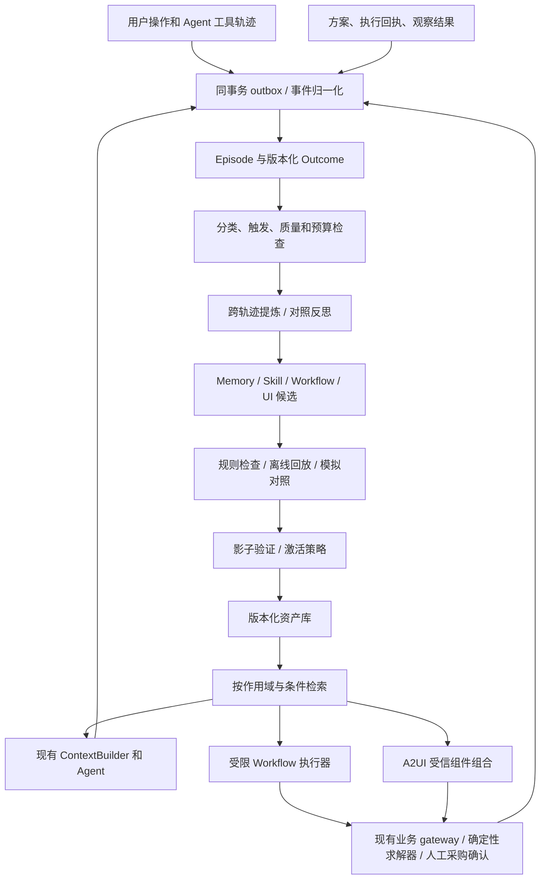

# ShopSteward 记忆、Skill、流程与界面自进化设计

日期：2026-10-03（Asia/Shanghai）。状态：研究与实施建议，尚未实现。代码基线：`YH` / HEAD `30bed9f` 加当前工作区未提交的下一阶段实现；以本次实际读到的代码为准，不把旧设计文档当作实现证据。

配套：[实施计划](../plans/2026-10-03-memory-skill-workflow-evolution-plan.md)。本文中的阈值、预算和验收线都是可调的工程初值，不是论文证明的普适规律。

质量检验专项：[Skill 质量检验与 Rubric v1](2026-10-03-skill-quality-rubric.md)。每个新 revision 必须先评后用，启用后持续验证；最低可用 evaluator 前移到 P1 首次激活之前。

## 1. 判断与目标

用户设想合理：系统从日常经营操作积累经验，形成可复用 Skill，重组处理流程，并把高频交互变成更方便的界面。这属于外部记忆和运行策略的持续适应，首版不必微调模型。

建议把“前十次经营操作后生成 Skill”改成：**从第一次有效操作开始记录，在第十个有效经营 Episode 后做首次分类型整理；证据不足的类别继续积累，达到条件的候选进入验证，再决定是否生效。** 十次总操作可能分布于六类任务，不能推导每类都已学会；用户重复操作也可能是在纠正系统错误。

目标是减少重复解释、无效查找、反复修订和遗漏检查，同时保持经营规则、事实来源、采购确认及结果核实的正确性。成功要表现为同样任务更少纠正、更少操作、更高结果正确率，而非 Skill 数量增长。

按当前项目范围，首批场景限定为日常补货、资金受限补货、供应延期恢复、报价比较、执行状态核实、经营复盘。先支持已有业务能力；跨店调拨、多 SKU 联合优化等不能仅靠生成文字路线宣称实现。

“路线”分成三种：一次任务的临时 Plan、跨任务复用的 Workflow、长期经营策略。前两者纳入本轮，长期经营策略先产出有证据的假设和模拟实验，不直接改变经营目标。

## 2. 现有代码提供什么，还缺什么

| 实际代码入口 | 本次确认的现状 | 本设计需要增加的内容 |
|---|---|---|
| `backend/app/agent_bridge/knowledge.py`、`models.py` | USER/NOTES/SKILL，用户×店铺×任务类型隔离；版本、修订来源、幂等、行锁；SKILL 每 scope 至多 12 条/6000 字符 | 独立学习资产、证据关系、状态机、质量评估和回滚，不能简单放大文本容量 |
| `agent/src/shopsteward_agent/memory/hermes_policy.py` | 去重、编辑和预算纯策略；USER 1375 字符、NOTES 2200 字符 | 保留显式偏好路径；学习产物走新模块 |
| `backend/app/agent_bridge/tools.py` | `memory_edit` 要求明确用户意图；`read_experiences` 取同用户同店铺 SUCCEEDED Run 的回答前 1500 字符和引用 | 成功结束的 Run 与真实经营成功分开，补业务 Episode 和结果观察 |
| `backend/app/agent_bridge/composition.py` | 加载记忆，SKILL 实际筛选固定为 replenishment，按工具可用性过滤 | 任务分类、有效版本筛选、按条件检索、使用记录、版本固定 |
| `agent/src/shopsteward_agent/extensions.py` | 有 SkillProvider 协议及工具过滤，默认 Empty；返回的是上下文 | 真实 provider 与桥接装配接线；不能以存在接口当作已有学习机制 |
| `agent/src/shopsteward_agent/context/builder.py` | 输入准入、TaskFrame、预算、manifest；必需来源超预算失败 | Skill/经验作为带版本的可选来源，不能挤掉用户约束和实时事实 |
| `backend/app/operations_cases/`、`planning/recovery/` | Case 修订、冻结快照、方案、逐日求解器 | 可回放结果、跨 Episode 模式学习和受限流程执行 |
| `backend/app/scheduling/runner.py`、`worker.py` | 持久任务、租约、重试及 business/agent worker 分工 | learning profile 和任务预算；生成过程与业务提交隔离 |
| `frontend/app/components/RecoveryWorkspace.vue` 等 | 固定业务组件和明确的确认交互 | 可组合、可回退的动态 surface 与用户固定的快捷入口 |
| `posttraining/src/shopsteward_pt/case_eval/` | 任务评分、证据绑定、unknown 语义 | 时间序列学习实验、记忆质量/遗忘/负迁移评估 |

检查范围内未发现完整的自动 Skill 生命周期或 A2UI 接入。已有交付报告也明确将自动 Skill 学习、真实经营结果 oracle 列为后续任务。本次未重新运行应用或复核过去报告里的测试成绩。

## 3. 研究与方案比较

下表依据论文原始页面、部分核心论文方法正文及 A2UI 官方资料。结果跨越对话问答、网页、代码、工具环境，不能直接换算为 ShopSteward 的营业收益。2026 年的新方法作为补充研究方向，不据此宣称已经成为行业标准。

| 方法、原始来源 | 机制和证据范围 | 本项目适配与取舍 |
|---|---|---|
| [Reflexion, 2023](https://arxiv.org/abs/2303.11366) | 用执行反馈生成文字反思并保留到后续尝试；评测含决策、编程、推理 | 做失败教训的基线；模型反思不能充当经营真值 |
| [Voyager, 2023](https://arxiv.org/abs/2305.16291) | Minecraft 中自动课程、可执行技能库、环境反馈迭代 | 借鉴可复用与可组合 Skill；真实采购不适合其开放式探索 |
| [Agent Workflow Memory, 2024](https://arxiv.org/abs/2409.07429) | 从轨迹提炼可复用子流程，支持离线与在线积累；网页任务实验 | 最贴近“从操作学流程”；学习参数化步骤及适用条件，避免复制历史对象 ID |
| [AFlow, 2024/2025 修订](https://arxiv.org/abs/2410.10762) | 把工作流优化变成搜索，用 MCTS 和执行反馈搜索代码表示的流程 | 借鉴离线候选搜索；本项目先用受限 DSL 和小规模搜索，避免开放代码变异 |
| [A-MEM, 2025](https://arxiv.org/abs/2502.12110) | 结构化记忆笔记、标签、链接和动态关联更新 | 借鉴证据、经验、Skill 之间的关系；关系表足够起步，不急于引入图数据库 |
| [Mem0, 2025](https://arxiv.org/abs/2504.19413) | 对话中的信息提取、整合、检索，并研究图记忆；主要验证长期对话问答 | 适合用户偏好/稳定事实层；不能独立解决流程搜索和采购效果归因 |
| [MemP, 2025](https://arxiv.org/abs/2508.06433) | 探索程序性记忆的构建、检索和更新 | 适合把“怎么做”单独建模，与原始情景记录分开 |
| [ReasoningBank, 2025/2026 修订](https://arxiv.org/abs/2509.25140) | 从成功和失败经历提炼可迁移策略；MaTTS 用更多交互形成对照经验 | 采用成败对比；其自评信号在本项目替换/补强为数据库规则、回执和观察结果 |
| [ACE, 2025/2026 修订](https://arxiv.org/abs/2510.04618) | Generator/Reflector/Curator 分工，条目级增量更新，避免反复重写导致细节丢失 | 适合经验维护；三个逻辑阶段即可，不要求三个并行服务；反馈质量仍是限制 |
| [ReMe, ACL Findings 2026](https://aclanthology.org/2026.findings-acl.829/) | 成败及比较式提炼、场景适配复用、按效用精炼；BFCL-V3/AppWorld 实验 | 适合完整生命周期和过时记忆清理，是重点补充阅读 |
| [MemRL, 2026](https://arxiv.org/abs/2601.03192) | 无参数更新，通过环境反馈和两阶段检索选择高效用情景记忆 | 有足够可归因反馈后研究检索策略；冷启动阶段先做规则和离线校准 |
| [MemSkill, 2026](https://arxiv.org/abs/2602.02474) | controller 选取记忆处理技能，executor 生成记忆，designer 基于困难样例更新技能 | 学的是“怎样抽取/维护记忆”的元技能；与“怎样补货”的业务 Skill 不同，放远期 |
| [MemEvolve, 2025/2026](https://arxiv.org/abs/2512.18746) | 联合演化经验与 encode/store/retrieve/manage 记忆架构 | 可做后期研究对照，首版不在线改变数据库和权限架构 |
| [PM4Py / Process Mining](https://processintelligence.solutions/static/api/2.7.17/api.html) | 从事件日志发现流程，并对日志与流程做一致性检查；属于成熟流程分析技术 | 很适合本项目的结构化业务事件；作为无需 LLM 的流程模式发现基线，不能把出现频率等同最优性 |

另一个值得纳入实验设计的近期结果是 [On the Fragility of Self-Improving Agents, 2026](https://arxiv.org/abs/2608.18066)：其研究观察到评测噪声和任务顺序对自改进效果的影响。因此本项目要报告多种任务顺序、失败和置信区间，不能用一次十任务演示证明持续进步。

### 三条可选工程路线

1. **轻量偏好+案例检索**：最小成本，快速减少重复解释；无法充分支持流程演化。作为实验基线与 Phase 1 交付。
2. **分层记忆+程序性 Skill+受限流程+评测发布**：推荐。兼容当前 Python/PostgreSQL/LangGraph/Nuxt，能解释每次变化，覆盖用户构想。
3. **训练检索控制器/强化学习/元演化**：潜力更高，但需要大量独立 Episode、可靠 reward 和严格离线实验。当前数据与评测不足以支撑为主线。

采用路线 2，参考 AWM 的流程抽取、ACE 的增量维护、ReasoningBank/ReMe 的成败提炼。先自己实现小而清晰的领域层，必要时把 Mem0 等接为适配器；不同时部署多套记忆框架。

另外保留“案例检索+流程挖掘”这一务实基线：把 Episode 的 case_id/activity/timestamp 导出，先统计重复序列、返工环节与等待时间，再由模型解释或参数化候选。小样本阶段直接做序列计数；PM4Py 只作为离线实验可选依赖，规模足够时再比较流程发现与一致性诊断。统计发现、LLM 解释、业务可执行验证分开。

## 4. 目标架构



学习不阻塞一次用户请求。在线路径只分类、检索、检查版本、写轻量使用事件；提炼、合并、验证在后台进行。模型生成候选，不决定数据库发布事务是否成立。

### 五类对象，两个平面

| 对象 | 保存什么 | 不承担什么 |
|---|---|---|
| 工作上下文 | 当前目标、原话、必需约束、当前步骤 | 不自动升级成长期偏好 |
| Episode | 一次完整经营尝试的行为、对象版本、回执和结果 | 不把聊天摘要当结算结果 |
| 事实/偏好/经验记忆 | 稳定用户偏好、带时效的观察、失败教训 | 不缓存“现在库存/现金”为权威值 |
| Skill | 一项可复用的领域做法及输入输出、前置条件、例外 | 不等同于任意一条文本偏好 |
| Workflow + UISurface | 多 Skill 的有界组合，以及调用它的界面 | 不创造不存在的工具与业务能力 |

行为适应平面负责候选和策略；业务执行平面继续维护金额、库存、权限、审批、幂等和 UNKNOWN 核实。记忆变更无法扩大工具权限。

## 5. 第一次到第十次：冷启动如何做

### 有效经营操作的计数口径

以 `OperationEpisode` 为单位，计一次用户发起的目标尝试；必须关联一个实际业务对象/查询快照，以及已交付的结构化结果或明确失败。一个 Episode 可以有多条消息、多个 Run、多个方案修订和多个工具调用。

- 反复点击、网络重试、后台轮询、同一次任务的改口均不增加计数。
- 纯闲聊、无经营数据的泛泛建议、演示伪造事件不计入真实操作；模拟来源单独计数。
- 用户主动取消的尝试可留作负面案例，但不计入首十次“结果可整理”计数；明确业务失败计数。
- 完成试算即可产生操作结果，但其 business_outcome 仍为 pending/unknown；无需等七天才完成全部初步学习。
- 用户×店铺×来源域分别计数；跨用户默认不共享个性化经验。

Episode 最初采用确定性 intent/业务命令映射作为主类，LLM 只补建议标签和摘要。低确定性的分类落到 `unclassified`，不能为凑类别硬分。

### 分阶段体验

- 第 1–3 次：使用人工审阅的通用补货/恢复模板；记录约束修改和耗时。明确“记住”的请求仍立即走现有 memory_edit。
- 第 4–9 次：后台形成候选观察；可提示“你多次调整了到货时间”，但不能说已经证明某供应商更好。
- 第 10 次：生成一次可查看的“已学到的做法”摘要，显示类别覆盖、支持/反例数量、哪些尚不确定。没有合格候选时如实说明。
- 此后：按类别独立积累、验证、细化、合并、降级，十次检查点不是停止学习的边界。

初始规则：同类至少 3 个独立 Episode 且来自至少 2 个经营日期，允许生成程序性候选；这只是提案门槛。只有 1 次明确纠错也可生成反例/待验证教训。不存在“用户操作了三次就证明最优”的推断。

## 6. 日常触发器与学习策略

| 触发 | 初值 | 候选产物 |
|---|---|---|
| 首次整理 | 有效计数首次跨过 10 | 分类覆盖报告、经验和 Skill 提案 |
| 重复成功模式 | 类别新增至少 3 个独立 Episode，覆盖 2 个经营日期 | 参数化步骤或 Skill 修订 |
| 明确纠错 | 用户指出字段、步骤或判断错误 | 带来源的纠错条目；不自动变全局规则 |
| 重复失败/绕路 | 同类错误最近 5 次中出现至少 2 次 | 原因分类、补前置检查/分支建议 |
| 延迟结果成熟 | 收货、观察窗口结束或补齐凭证 | 更新 Outcome，重新评估依赖经验 |
| 新目标/新组合 | 现有检索无合格技能，工具能力可覆盖 | 临时流程候选；先只试算 |
| 界面摩擦 | 同类交互至少 5 次，至少 3 次重复同一组字段/切页 | 快捷组件组合候选 |
| 失效/漂移 | 来源撤销、工具 schema 变化立即触发；最近 10 次成熟应用中失败≥3 触发复审 | 暂停或重新验证 |
| 定期整理 | 每周，有新增证据才运行 | 合并冗余、处理冲突、归档低效条目 |

相同 evidence digest 不重复触发。每个用户×店铺每日最多 3 个提炼批次，每批最多 3 个候选；首版每批至多 2 次生成调用+1 次受限 JSON 修复，输入最多 12000 token、输出合计最多 4000 token。超过预算延后并记录原因。复评任务单独排队并设总预算，禁止通过修复循环逃逸限制。

过程：质量过滤 → 按目标/约束/工具步骤归组 → 成败配对 → 抽象变量 → 显式列出前置条件、反例和证据 → 产生增量修改 → 确定性验证 → 候选入库。不要请求或保存模型隐藏思维链；保留可见操作、工具结果和简洁解释即可。

新增前先检索同类资产。相同做法增加支持证据；局部变化生成新 revision；实质冲突创建 `contradicts/supersedes` 关系并保留双方来源，禁止“最后写入胜出”。

## 7. 数据与结果契约

首版复用业务 PostgreSQL 的 `agent_data` schema。索引按 `(principal_id, store_id, source_domain, task_family, status)`；小规模采用结构过滤+标签/关键词排序，不以新增向量库为前置。规模和离线收益证实有必要后再引入 embedding 索引。

| 新表 | 主要字段和约束 |
|---|---|
| `learning_outbox` | event_id、scope、source_kind/id/version、event_type、event_time、payload_digest；来源事件唯一；业务提交时同事务写 |
| `operation_episodes` | id、principal_id、store_id、source_domain、intent_key、goal、task_family、mission/case/work_item IDs、status、opened/closed_at；请求幂等关联 |
| `episode_events` | episode_id、event_id、source_ref、observed_at、available_at、payload_digest；追加写，重复事件不重复计数 |
| `episode_outcomes` | episode_id、revision、procedural_status、decision_status、business_status、metrics、evidence、window_end、available_at、oracle_version |
| `learning_assets` | id、scope、kind、family、active_revision、lifecycle_version；kind 为 EXPERIENCE/SKILL/WORKFLOW/UI；资产稳定 ID |
| `learning_asset_revisions` | asset_id、revision、parent_revision、status、typed_spec、content_hash、origin、compatibility、validity、created_at；内容不可变 |
| `learning_evidence_links` | source_ref/episode/outcome_revision → asset_revision；support/contradict/derived_from/supersedes；撤销传播与回放依据 |
| `learning_evaluations` | revision、dataset_hash、baseline_revision、model/profile/prompt hash、policy_version、run seeds、metrics、gate_result |
| `learning_applications` | run/episode/step、asset_revision、retrieval_reason、exposure_mode、outcome_ref、usage/latency；retrieved/selected/executed 分开 |
| `learning_policies` | scope、version、mode、budget、blocked_concepts、deleted-source watermark；mode=off/suggest/assist |

设置变更、发布、回滚沿用 expected_version + Idempotency-Key + 当前授权复核，审计包含操作者。默认仅本人同店；未来共享只在去个性化审查后显式发布，不通过扩大 SQL 检索范围实现。

### Outcome 必须分层

1. `procedural_status`：步骤是否正确完成、工具协议是否满足，pass/fail/unknown。
2. `decision_status`：方案是否违反预算/MOQ/现金底线/用户约束，pass/fail/unknown。
3. `business_status`：经营观察结果 matured/pending/unknown；可伴随缺货、支出、收货时效等独立指标。

用户采纳、Run SUCCEEDED、供应商受理、全部收货、经营收益分别记录，不互相替代。数值记录单位、币种、时间窗口和来源。采购支出≠损失，低支出也≠更好的经营策略。

真实世界没有观测到的 lost demand 不由销量反推成真值；以 available_at 防止未来到货信息泄漏到过去。模拟器指标带 `source_domain=simulation`、scenario/seed/版本；只能支持模拟条件下的结论。

历史 ToolInvocation 主要存参数 hash，并不能恢复全部参数轨迹。历史回填只能引用确有的快照/回执，并标记 partial；新采集必须增加经过字段白名单和脱敏的输入输出投影。API 密钥、令牌、原始凭证不进入轨迹。

## 8. Skill 的结构、执行与冲突

首版 Skill 用 JSON/Pydantic 作为权威结构，可导出 Markdown 供查看。不是自动往 Codex 本地 SKILL.md 目录写文件。

示例（本项目拟议结构，非现有 API）：

```yaml
asset_id: compare_delay_recovery
kind: SKILL
revision: 1
task_family: supply_delay_recovery
scope: {principal_id: user-a, store_id: store-a}
inputs: [case_id, budget_minor]
preconditions: [case_active, authoritative_snapshot_current, daily_demand_available]
required_capabilities: [read_case, analyze_recovery, read_execution_status]
procedure:
  - 检查原在途数量、已付款状态、预计到货日
  - 对等待与应急补购做相同七日窗口试算
  - 对现金底线、MOQ、整包和预算做业务校验
  - 展示可行方案并解释差异
outputs: [version_bound_comparison, proposed_plan_reference]
exceptions: [missing_eta, stale_snapshot, unknown_execution]
forbidden_effects: [approve_purchase, resend_unknown_order]
evidence: [episode_ref_1, episode_ref_2, episode_ref_3]
validity: {review_after_days: 30, tool_catalog_hash: bound_at_validation}
```

这些 capability 名为逻辑接口；adapter 必须映射到现有业务服务/工具并验证 schema；映射缺失即不能执行，不能让模型随意创造工具。

检索先做硬过滤：当前授权、作用域、来源域、ACTIVE revision、前置条件、依赖新鲜度、能力可用、用户禁用项。随后按场景匹配、证据质量、历史效用、成本排序；首版最多注入 3 个 Skill，总预算 1800 token，实验调整。记录被拒绝的原因与选中版本。

业务规则/权限是不可学习的硬约束；当前用户明确约束优先于旧偏好；明确保存的长期偏好优先于推断偏好；历史经验只提供建议。两个同时适用但冲突的 Skill 不同时作为命令注入：基于作用域和有效证据解决，否则降级为比较建议。

运行启动固定 asset revision，避免途中悄悄换流程；每个有副作用步骤前仍复核权限、来源和撤销状态。新的普通版本不打断旧 Run，权限撤销/安全失效会阻止旧 Run 的后续动作。记忆内容保持数据角色，不提升为 system authority。

## 9. 生命周期、遗忘与用户控制

```text
DRAFT → VALIDATING → SHADOW → ACTIVE
              └→ REJECTED
ACTIVE → SUSPENDED → VALIDATING
ACTIVE → SUPERSEDED / ARCHIVED
任意未删除状态 → REVOKED
```

发布门槛：结构/schema/权限/来源检查全通过；独立回放无硬约束违反；有足够适用样例；在配对模拟中不降低关键任务质量；通过对应风险等级的激活策略。门槛不足停在候选/影子，不硬判失败或通过。

质量检查具体采用 H1–H6 硬门槛和 S1–S6 六维 rubric，定义见专项规范。硬门槛有 fail 拒绝激活，有必须项 unknown 则继续验证；新学习 Skill 的各维初始要求≥3/4，不使用加权总分抵消缺陷。S5 必须来自独立对照，缺少反馈时不能由模型估分。质量报告绑定 asset revision/content hash、rubric、数据集、执行模型、工具与业务规则版本，发布时重新核对。

- **off**：不生成新的个性化学习产物；业务所需审计仍遵循原系统规则。
- **suggest（首版默认）**：自动生成和后台验证，用户在“已学到的做法”中启用。明确 memory_edit 不受该开关替代。
- **assist（用户主动开启）**：低风险只读 Skill 通过门槛后可自动启用；重要流程变化呈现一次变更摘要。任何采购仍使用原确认路径，持续跟进仍需 opt-in。
- UI 临时表单可按任务生成；改变持久工作区布局由用户“固定到工作区”触发。

支持查看来源、修改、停用、回滚、“不要再推断这类偏好”、关闭学习和删除派生记忆。删除产生 tombstone/抑制规则，失效相关索引、摘要、UI 与候选，历史重放不可重新学回被拒绝的个人偏好。审计保留与内容删除分别按产品保留策略处理，界面不能承诺删除仍依法或按业务需求保留的账本。

知识事实根据证据有效期失效；偏好保留直到用户修改；Skill 的 30 天是复审周期，不是事实自动变假的时间。临时活动策略应绑定开始/结束时间。使用少不等于错误，低频异常技能按覆盖价值保留，避免一律按热度删除。

新学习功能以独立 flag 关闭时，立即回退旧系统；已提交采购照常核实，不能因撤销 Skill 回滚真实账本。

## 10. 流程自进化：怎样真正形成新路线

先让 Skill 作为指导文字参与现有工具循环；验证稳定后引入受限 Workflow DSL。声明输入输出、节点、分支、超时、版本和恢复点，由固定 Python 执行器解释；禁用 eval、任意导入和生成代码执行。

允许节点：`read`、`compute`、`branch`、`ask_user`、`propose_plan`、`await_user_confirmation`、`observe_execution`、`finish`。`await_user_confirmation` 只是挂起和打开既有确认页面，不授予后台审批能力。暂停在数据库中持久化，不用持有工作线程等待用户。

首版静态图为 DAG，最多 12 节点；重试由节点策略限制最多 2 次，执行状态和 step result 持久化。每个已授权业务写入键绑定 workflow_run_id/step_id/输入版本，过期版本失败；未知采购状态只走核实分支。UI 关闭和 worker 重启都能恢复。

推荐演化算子：补前置检查、删冗余读取、加入条件分支、替换已验证子 Skill、在独立只读步骤之间调序。确定性 validator 检查图合法、参数类型、读写顺序、必须确认路径、所有终点可达、预算上限及工具兼容。

示例：原流程“延期 → 查库存 → 看缺货 → 应急补货”；候选学到“先检查旧单状态与已付款金额；若 UNKNOWN 先核实；对等待/补购同窗试算；现金不足则生成等待方案”。既有恢复求解器做数量金额计算，流程只改变调查和交互顺序。

每个变更批次最多生成 3 个流程候选；使用同一快照、相同外生需求/供货随机种子进行配对回放。离线选优后先 SHADOW，再适用任务内灰度。Shadow 可以重放只读计算，不向供应商发送任何额外请求，不把未执行路线的猜测结果写成真实 outcome。

复杂自然语言 WorkItem 到 Mission/Case 的自动路由仍是前置缺口：先接已有目标类型和 handler；低确定性时澄清；未知目标输出能力缺口，不能自动捏造新流程实现。

## 11. A2UI：从高频流程生成更好用的界面

可行，但要区分“组合现有组件”和“创造新的组件实现”。[A2UI 官方项目](https://github.com/a2ui-project/a2ui)把它定义为声明式格式，由客户端受信组件目录渲染；模型不应在线生成并执行任意 Vue/JavaScript。

本次查阅的[官方 renderer 指南](https://a2ui.org/guides/renderer-development/)将 v0.9.1 标为 Current Production，v1.0 标为 Candidate，并提供框架无关的 `@a2ui/web_core`。建议以 v0.9.1 为目标做兼容性验证，锁定实际发布包与 schema hash；不假定现有 Nuxt 已有可直接复用的官方 Vue renderer。版本状态实施时重新核对。

首批 catalog：`MetricCard`、`EvidenceList`、`PlanComparison`、`BudgetInput`、`SupplierSelector`、`ExecutionTimeline`、`NextStep`，适配现有 DecisionCard/RecoveryWorkspace/TaskCard。这些是本项目自定义目录组件，不冒称协议标准组件。

生成分两步：LLM 输出 `UIIntent`（目标、字段、布局、action 名称）；后端编译器验证并输出选定协议的 surface 消息。开发者提供 Vue renderer 与 action adapter。新业务组件需求保存为开发建议，经过正常开发测试再加入 catalog。

动作只允许固定 action ID，例如 `preview_recovery`、`revise_case`、`open_existing_confirmation`；不接受模型生成 URL、SQL、任意 API 路由或函数名。后端解析实体引用并检查当前用户、版本、输入范围和允许动作，客户端隐藏按钮不是授权机制。

用户体验示例：用户连续多次输入“预算/期望到货日/供应商限制”并查看同一比较表，系统建议保存“延期应对”面板。面板预填已确认默认偏好，实时数据重新取；提交后产生待确认方案，采购确认继续在既有组件完成。

surface 限额初值：50 个节点、嵌套深度 8、描述不超过 64 KB。禁用任意 HTML/脚本、远程自定义组件及未经白名单的表达式函数；文本转义，资源 URL 白名单。数值与证据来自已验证 DTO，模型不能覆盖金额计算。

绑定 `surface_revision / catalog_hash / asset_revision / context_version`。流式消息先在缓冲区校验，完整合法版本再原子切换；恢复后只恢复已提交版本。未知组件、协议不兼容、失权或数据过期时回退现有固定 UI，不影响核心操作。

衡量减少了多少重复输入、页面跳转和完成时间，同时检查错误率、可访问性、移动端布局和用户是否愿意保留。点击率不是经营效果。

## 12. 评测、发布门槛与研究实验

本节是学习系统级研究设计。逐个 Skill revision 的准入、每次应用检查和上线后的质量变化，使用[专项 rubric](2026-10-03-skill-quality-rubric.md)；三层结果分别记录，不把一次任务得分当作 Skill 永久质量。

### 数据集与防泄漏

构建至少 6 类场景，各 20 条 Episode 序列，每序列 15 次任务：前 10 次用于冷启动学习，后 5 次前向评测。总计 120 条序列/1800 个 Episode 是首轮模拟工程规模建议，不是统计功效保证。

每类按完整 scenario family 划分 10 条开发、5 条验证、5 条锁定测试；同模板的变体、同店关联轨迹和共享事件必须同组。episode 数不是独立统计样本，按序列/场景簇做 bootstrap。多种操作顺序和随机种子检验次序敏感性。

固定记忆实验：评测 11–15 时不更新资产；另设在线学习实验，t 时刻只能用 t 前已可获得证据，在评测完成后允许反馈更新。两者分别报告。锁定集不能用来反复挑触发阈值。

### 对照组

- B0：当前系统，显式偏好+现有经验读取。
- B1：结构化 Episode 检索，不提炼 Skill。
- B2：单 Episode 反思/摘要。
- B3：跨轨迹 Skill，固定流程。
- B4：B3 + 验证后的 Workflow 演化。
- B5：B4 + 动态 UI；界面效果用用户任务实验评估，不混到纯模型成绩。
- B-process：B1 + 确定性重复序列/流程挖掘，作为流程优化的非 LLM 对照。

采用相同模型 profile、工具、预算、模拟版本和随机种子。新增成本包括提炼、评估和维护，不能只报告在线 token 节省。取消、失败、未知、无适用候选都在分母中。

### 必测条件

重复事件与响应丢失、样本稀疏/类别不均、成败冲突、季节变化、用户改口和禁止保存、跨用户/店铺、恶意文档注入、删除后回填、权限撤销、工具 schema 升级、预算超限、结果延迟/未知、Workflow 重启恢复、UI 旧版本操作与未知组件。

### 建议发布门槛

| 维度 | 初始验收标准 |
|---|---|
| 硬规则 | 固定回归集与所有发布评测中零越权采购、零重复下单、零跨作用域泄漏、零强行把 UNKNOWN 算成功；任何一次触发拒绝发布 |
| 依据 | 100% 激活资产有可解析来源、版本、适用条件；记忆失效和删除链路回归全通过 |
| 功能覆盖 | 每项候选至少 20 个适用独立场景回放（含异常/边界），不足则仍为 SHADOW；数量不代表统计显著 |
| 任务质量 | 配对差值的 95% 置信区间下界不低于基线 -2 个百分点；证据不足则继续收集，不宣布非劣 |
| 实用改善 | 目标纠正轮次或重复工具调用至少下降 15%，且上项不退化；仅作为验证集预注册目标 |
| 效率 | 在线检索开销 p95≤150 ms（明确硬件与数据规模）；离线学习 token 不超过同窗口在线 token 的 20%，无在线用量时采用前述日绝对上限 |
| 界面 | 同任务中位完成时间减少 20%，关键错误不增加；先做 8–12 人形成性测试，正式结论需另行功效分析 |

硬规则零观测失败不等于数学保证，仍依赖服务端约束。恢复业务指标包括缺货、现金底线违反、应急支出、收货状态；按用户目标解释，不用单一利润 reward 自动改目标。

现有九个开发示例不是本轮锁定数据集；旧套件通过也不能证明“自进化有效”。本次设计没有产生上述实验成绩。

## 13. 分阶段范围、收益与停止条件

| 阶段 | 独立可交付结果 | 估算（1 位熟悉项目的工程师） |
|---|---|---|
| P0：数据基础 | Episode/outcome/outbox、授权与结果口径、基线导出 | 4–6 人日 |
| P1：首十次学习 | 分类整理、候选提炼、最小评估器与前置 gate、来源查看、显式启用、检索 | 5–7 人日 |
| P2：持续学习 | 增量修订、删除传播、成熟结果反馈、模拟评测、自动暂停 | 5–8 人日 |
| P3：流程演化 | 受限 DSL、恢复执行、候选搜索、WorkItem 路由 | 6–9 人日 |
| P4：A2UI | catalog/Vue 适配、业务 action 绑定、快捷面板与回退 | 5–8 人日 |
| P5：联合评测 | 消融、锁定前向测试、用户实验、运行手册 | 4–6 人日 |

总计约 29–44 人日，不含招募、真实经营结果等待、模型调用额度与跨团队协调。可先用 P0–P2 的约 14–21 人日交付完整记忆/Skill MVP；课程演示优先两类场景并缩小 UI 数量，不削减证据与评测边界。并行开发前必须先锁定 Episode/Asset 接口。

质量检验细化后，将原 P2 的最小评估 gate 前移至 P1，不能用阶段名称推迟发布前检查。上述仍为未重新估算的原粗略区间；人工校准和独立场景准备若超出原范围，应在 P0 数据盘点后更新排期，不能承诺无额外工作量。

停止条件：如果 B3 相对 B1 未见稳定收益，先改检索和证据质量，不继续堆更复杂的流程搜索；如果 UI 无明显减少操作，保留固定界面；如果结果反馈不足，维持建议模式。数据充分后才考虑 MemRL 检索策略、MemSkill 元技能和离线 SFT，三者分别立实验。

首个端到端验收故事：十次混合经营操作 → 分类别显示学习进展 → 从延期场景提炼一个有前置条件的 Skill → 下一次命中并解释来源 → 用户改预算后正确重算 → 部分收货不误记成功 → 新证据使旧 Skill 暂停 → 回滚后旧业务仍能完成。之后再加入“固定延期应对面板”。

## 14. 与现有设计的关系

本设计明确扩展旧版“长期记忆仅由明确请求写入”的范围：原 `memory_edit` 语义不放宽；自动学习写入独立候选库，按新学习模式和发布策略进入上下文。旧偏好不能被学习作业覆盖。

不改 ML 预测模型、不把专家推理替代确定性求解器、不重写 Knowledge 文档服务、不直接迁移用户日常数据库。后续实施从当前真实 Alembic head 建新迁移，先迁移隔离测试库。所有未实现的文件、接口和阈值均由配套实施计划组织交付。
