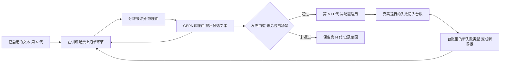

# 寻源循环上的自进化（RSI）细化设计

日期：2026-10-09（Asia/Shanghai）。状态：项目负责人已于当天确认第 8 节的前三项，尚未实现。代码基线：`YH` 分支，本文与 2026-10-09 的分批提交一同入库。

读者是项目负责人和后续实施者。本文把[技术选型与自进化设计](2026-10-08-technology-selection-and-evolution-design.md)里的“自进化阶梯”落到 2026-10-08 新建的多供应商寻源循环上；循环本身的说明见[寻源交接](../../reports/2026-10-08-sourcing-handover.md)。文中的预算、阈值和人日都是工程初值。

几个词在本文里的意思：

- **场景**：一次寻源任务，含一家门店、一个缺货商品、2 到 5 家供应商的文档和标准答案。
- **审查者**：每家供应商一个的分 Agent，读这一家的文档，交回一张**报价卡**。
- **报价卡把关**：代码检查报价卡的格式和引用，不过关的重读一次。
- **解释者**：求解器出方案后，负责把方案讲清楚的那一步。
- **文本制品**：带版本号和哈希的提示词文件，是唯一允许被演化的东西。
- **发布门槛**：新版本文本在优化器没见过的场景上与旧版本逐场景配对比较，通过才启用。

## 0. 结论

自进化在这条循环里是一个固定的闭环：跑场景，分环节评分，把失败原因写成文字，由 GEPA 提出新文本，过发布门槛后靠配置启用；下一轮从已启用的版本出发，并且换上更难的场景。演化引擎、制品和门槛都沿用已有的那一套，不新增第二套。

今天的核对改变了交接文档里建议的顺序，原因是**现有场景对够用的模型已经太容易**：

- 审查者读报价卡，`gpt-6-luna` 是 84 张里 83 张可用，`deepseek-flash` 是 42 张里 41 张可用。在这把尺子上演化审查者文本，量不出变化。
- 唯一有明显空间的是 `gpt-6-luna` 的解释：24 次运行里 8 次漏说同一条。`deepseek-flash` 的 12 次解释没有漏。

所以分四轮做：

| 轮次 | 做什么 | 为什么排在这里 |
|---|---|---|
| R0 仪器 | 让把关留下理由和被拒的原卡；写单环节评测和新循环的 GEPA 适配器 | 现在被拒的报价卡没有保存，失败原因无法复核 |
| R1 解释文本 | 在 `gpt-6-luna` 上演化解释者文本，目标是那条漏说 | 唯一已测到的空间；修法已知，正好用来检验整条自进化链路 |
| R2 更难的尺子 | 生成 `ops-sourcing-v2`，直到便宜模型的审查出现可测的错误 | 没有空间就没有可展示的进化 |
| R3 审查者文本 | 在 v2 上演化审查者文本，便宜模型当审查者 | 回答“便宜模型能不能当分 Agent 的核” |

模型花费不是约束：`deepseek-flash` 跑完整循环，今天按余额变化估约每场景 0.03 元。项目负责人决定不给这四轮设时间上限；课程交付截止仍是 2026-10-25，后端和前端在 RSI 之后接。

## 1. 今天核对到的事实

### 1.1 三组基线

都是 smoke 划分，12 个场景、42 份供应商资料。前两行是 2026-10-08 的记录，今天按原始记录重算；第三行是今天新跑的。

| 配置 | 运行数 | 端到端 | 解释通过 | 报价卡可用 | 记录 |
|---|---|---|---|---|---|
| 全部 `gpt-6-luna`，两种解释文本各一次 | 24 | 15/24 | 16/24 | 83/84 | [2026-10-08-sourcing-e2e](../../reports/strategy-eval/2026-10-08-sourcing-e2e/) |
| `gpt-5-nano` 初读，`gpt-6-luna` 复读和解释 | 2 | 1/2 | 2/2 | 5/7 | 同上 |
| 全部 `deepseek-flash` | 12 | 11/12 | 12/12 | 41/42 | [2026-10-09-sourcing-e2e-deepseek](../../reports/strategy-eval/2026-10-09-sourcing-e2e-deepseek/) |

“报价卡可用”指决定推荐结果的字段全对。第一行的两种解释文本是 `seed` 和 `gepa-r1`，审查者文本相同，所以它们不是严格的重复运行。

`deepseek-flash` 这一组平均每场景 8.5 次模型调用、输入约 24,900 token、输出约 17,300 token，中位耗时 40 秒。12 个场景跑完，账户余额从 49.55 元降到 49.23 元。

### 1.2 两类失败的具体原因

**解释漏说。** `gpt-6-luna` 的 8 次解释失败全部是同一条：说了“推荐候选 X”，没说“X 是否还有缺口”。12 个场景里有 7 个至少漏过一次，只有 1 个在两组里都漏，所以这是每次运行约三分之一概率的随机遗漏，不是某几个场景特别难。

原因能指到具体位置：这条要求只写在评分器里（`strategy_eval/claims.py` 的 `required_conditions`）。解释者拿到的提问（`bundles/case-experts/seed.json`）和输出约定（`cases/runner.py` 第 127 行）只说了“这两类说法会被核对”，没有说“推荐候选的缺口必须说”。模型说不说全凭自己。

**审查者读错。** `deepseek-flash` 今天读错一张：`smoke-notice_price-02` 的供应商 E。它打开了全部 6 份文档，其中一份调价通知把单价从 15.90 元改为 21.20 元并已生效；它仍报了 15.90，并引用了报价单上那一行。引用的原文确实存在，所以把关放行，推荐从 D 变成了 E。这正是生成器为该场景预设的陷阱。

昨天 `gpt-5-nano` 的两张错卡也是引用合规但数值错。把关现在只检查“引用的原文在不在”，不检查“引用的是不是该用的那份”。

**一处无法复核。** 交接文档说 `gpt-6-luna` 有一次被把关误拒，是因为引用了换算后的单价。记录里只有 `uncited:unit_price_minor` 这个代码，被拒的原卡没有保存，今天无法确认这个说法。

### 1.3 这对自进化意味着什么

1. 审查环节在现有场景上已接近做满，要先把尺子做难，才谈得上演化审查者文本。
2. 解释的失败是随机的，一个候选文本在 12 个场景上各跑一次，8/12 和 11/12 之间分不出真假。每个场景要重复跑。
3. 把关必须留下理由和原卡，否则优化器读不到有用的反馈，人也无法复核。

## 2. 自进化在这条循环里指什么

“递归”体现在两处：下一轮的起点是上一轮启用的版本；下一轮的场景包含上一轮暴露出的失败类型。

它不包含：系统修改评分器、标准答案、把关代码或求解器；线上自动发起优化；模型自己写新场景的标准答案。

## 3. 演化什么，不演化什么

| 对象 | 位置 | 是否演化 | 阶梯 |
|---|---|---|---|
| 解释者的提问与指引 | 文本制品 `case-experts`，6 个组件 | 是，R1 | L1 |
| 审查者的提问与指引 | 文本制品 `supplier-review`，2 个组件 | 是，R3 | L1 |
| 审查者的阅读规则，写成 Skill | 作为 `guidance.supplier` 的内容，导出 `SKILL.md` | 可选，R4 | L2 |
| 初读用哪个模型、何时升级 | 配置 | 不演化，由实测结果定规则 | L3 |
| 报价卡格式、引用规则、把关代码、求解器、评分器、标准答案 | 代码与数据集 | 永不 | — |

## 4. 设计要点

### 4.1 单环节演化，端到端放行

交接文档设想的是每评测一次就跑一遍完整循环，约 8 次模型调用。这样贵，而且解释文本的好坏会被审查者的波动盖住。

改成两种单环节评测，优化器只用它们：

| 评测 | 一次评测做什么 | 模型调用 | 评分 |
|---|---|---|---|
| 解释单测 | 把标准答案的报价卡和求解器方案交给解释者，只跑解释 | 1 次 | 现有的说法核对器 |
| 阅读单测 | 一个审查者读一家供应商，含把关和一次复读 | 约 2 到 4 次 | 现有的报价卡评分 |

完整循环只在发布门槛上跑，用来确认单环节的改进没有在别处造成损失。

### 4.2 分数和文字反馈

分数只供优化器排序，不对外报告；对外报告用通过计数。

- 解释：有说法与求解结果矛盾，或运行失败，记 0 分；否则是必须条件的覆盖比例。与旧任务的定义相同。
- 阅读：没有通过把关的卡，或任何决定推荐的字段读错，记 0 分；否则是全部字段的正确比例。第二目标是“一次读对”，不靠复读。

文字反馈只在 evo-train 上生成，evo-val 只回传分数。阅读的反馈要写明：哪个字段错了、正确值出自哪份文档、这家供应商属于哪种陷阱、把关拒绝的具体理由。

### 4.3 运行波动

- 优化器的验证集把 evo-val 的每个场景重复 3 次。解释单测每次只有 1 次模型调用，负担得起。
- 每一轮跑两个随机种子，分别报告。
- 演化前先测一次基线；验证集通过率已到 95% 以上时不演化这个组件，转去做难尺子。

### 4.4 发布门槛

在 gate 划分的 24 个场景上，与父版本逐场景配对。目标在优化开始前写下，之后不改。

1. 单环节：每场景重复 3 次，候选没有任何与求解结果矛盾的说法。
2. 单环节：没有“父版本多数通过、候选多数失败”的场景。
3. 单环节：通过率比父版本高至少 10 个百分点。
4. 完整循环：父版本和候选各跑一遍，候选的端到端通过数不低于父版本，其他环节的通过数没有下降。
5. 换一个模型在 smoke 上跑一遍候选，确认没有变差。这一条只报告，不作为否决项。

这是配对计数，不是统计证明，报告里照此说明。

### 4.5 尺子怎么变难

失败台账：每次完整循环的失败记下环节、字段、场景族和把关理由。台账由运行记录生成，不另建存储。

两种情况触发新数据集版本：

- 台账里出现现有十个场景族没有覆盖的失败类型，把它做成新场景族。
- 基线接近做满，按真实文档的方向加难度。

第一版 `ops-sourcing-v2` 属于第二种，因为到目前为止测到的失败（按箱报价读成按件、已生效的调价没有应用）都已被现有场景族覆盖。加难的方向取自交接文档列出的不足：

- 报价单更长，相近的商品更多。
- 同一商品有多份先后生效的通知。
- 通知用口语化的句子写，而不是表格。
- 按箱报价时起订量也按箱写。

新场景族的标准答案仍由生成器的类型化事实给出，并保留“读错确实会改变推荐”的生成时校验。求解器最多接受三份报价的限制不变。v2 是新的数据集名，`ops-sourcing-v1` 不动。

加难的停止条件：`deepseek-flash` 在 v2 的 smoke 上报价卡可用率落到 60% 到 85% 之间就停。加难两次仍在 95% 以上，就如实报告“在我们能造出的难度上审查已做满”，R3 取消。

### 4.6 版本记录

文本制品文件已有 `parent_revision`、`provenance` 和 `gate` 字段。每次发布把门槛报告的路径和结论写进 `gate`。世代表直接从这些文件生成，列出每一代的父版本、数据集版本、任务模型、演化前后的通过计数和是否启用，不另建存储。

## 5. 轮次

| 轮次 | 交付 | 验收 | 模型调用（估） | 人日（估） |
|---|---|---|---|---|
| R0 仪器 | 把关保存被拒的原卡和逐条理由，复读时把理由交给审查者；解释单测、阅读单测；新循环的 GEPA 适配器；`gate` 命令支持新循环；失败台账 | 不联网的自检全流程通过；gate 划分的基线首次跑出 | 约 400，两个模型各一半 | 1 |
| R1 解释文本 | `case-experts` 的新版本 | 第 4.4 节五条 | 约 1,000，其中约 900 是 `gpt-6-luna` | 1 |
| R2 难尺子 | `ops-sourcing-v2` 及其基线 | 第 4.5 节的停止条件 | 约 300，`deepseek-flash` | 1 到 1.5 |
| R3 审查者文本 | `supplier-review` 的新版本 | 第 4.4 节五条，在 v2 上；另在 v1 的 gate 上确认没有变差 | 约 3,500，`deepseek-flash` | 1 到 1.5 |
| R4 Skill，可选 | 把审查者的阅读规则整理成 `SKILL.md` 并走同一门槛 | 同上 | 约 1,500，`deepseek-flash` | 1 |

调用数的算法：两个种子，每个种子 200 到 300 次评测；阅读单测每次按 2.1 次模型调用算，这是今天 `deepseek-flash` 完整循环里每家供应商的平均值；门槛按第 4.4 节的重复次数算。v2 的供应商数量按 v1 估。

每一轮的停止条件：两个种子都没有产生通过门槛的版本，就保留父版本，把过程写成负面结论。R1 如果失败，那句要求由人补进文本，作为人工版本走同一道门槛。

R1 的定位要说清楚：修法是已知的，就是补一句“推荐候选的缺口必须说”。这一轮检验的是链路能否不靠人读记录，自己找到并修好一个已知的缺陷。R3 才是事先不知道答案的一轮。

## 6. 模型与花费

| 角色 | 模型 | 依据 |
|---|---|---|
| R1 的解释者 | `gpt-6-luna` | 漏说只在它身上测到 |
| R2、R3 的审查者 | `deepseek-flash` | 便宜，今天已在完整循环里跑通 |
| 反思模型 | `deepseek-v4-pro` | 上一次 GEPA 试点用的就是它 |

`deepseek-flash` 的花费按今天的余额变化估：约 100 次模型调用花了 0.32 元。R0 的一半加 R2、R3 约 4,000 次调用，合计约 10 到 15 元，现有余额够用。余额接口可能有延迟，单环节调用的平均花费也可能与完整循环不同，这个数是粗估。OpenAI 没有配置价格表，R1 的金额没有算；它约 900 次调用，按交接文档的估算，昨天的端到端运行在 OpenAI 上约 300 次。

`source` 命令现在所有角色共用一个服务地址，便宜模型初读加另一家的强模型复读需要小改，R3 需要时再做。

## 7. 不做的事

- 不让优化器接触 gate 划分，不让它改输出格式、把关规则和评分器。
- 不让模型生成新场景的标准答案。
- 不引入第二个演化引擎。
- 不在这四轮里接后端和前端，按项目负责人的决定放在 RSI 之后。
- 不恢复多 Agent 与单 Agent 的比对。

## 8. 确认情况

项目负责人 2026-10-09 的答复：

1. **R1 交给演化。** 不手工补那一句。
2. **先做难尺子，再演化审查者文本。** 同意。
3. **不设时间上限。** 原建议是把 R0 到 R3 限定在 2026-10-14 前，没有采纳。
4. **R4 做不做，未定。** 它与“引入哪些技术”的决定一起定。

## 9. 与现有设计的关系

- 对技术选型与自进化设计：原则“一个引擎、一种制品、一道门”不变；L1 的对象从旧任务的三专家提问扩到新循环的两份文本；新增单环节评测、验证集重复和难尺子这三项。
- 对寻源交接第 10 节：第 1、2 步保留，但评测从完整循环改为单环节；第 3 步的把关升级里，“说清拒绝原因”并入 R0，“两次独立阅读一致才放行”属于待定的技术清单；失败转用例提前到 R2。
- 旧任务上演化出的 `gepa-r1`：项目负责人 2026-10-09 决定暂不启用，先为它和多专家策略找合适的使用场景。所以 R1 从 `seed` 出发。两个版本在 `gpt-6-luna` 的 smoke 上解释通过数相同，都是 8/12。
- Case 专家的默认策略已在 2026-10-09 改为固定流程，寻源循环的解释步骤本来就用它，本文不受影响。
